# 5. Ordering сообщений и его цена

> *"Time is an illusion. Lunchtime doubly so. And absolute ordering in distributed systems is entirely a figment of human imagination."*  
> — Свободный пересказ Лесли Лэмпорта и Дугласа Адамса

В 1978 году Лесли Лэмпорт опубликовал фундаментальную работу *«Time, Clocks, and the Ordering of Events in a Distributed System»*, навсегда изменившую понимание распределенных вычислений. Он математически доказал простую истину: в распределенной системе без единых аппаратных часов невозможно определить абсолютный глобальный порядок двух независимых событий, произошедших на разных серверах. Понятия «раньше» и «позже» имеют смысл только тогда, когда между событиями существует прямая причинно-следственная связь (отношение *Happens-Before*).

Однако начинающие разработчики, переходя от монолитов с PostgreSQL к микросервисам, часто приносят с собой интуитивное требование: *«События в брокере обязаны обрабатываться строго в том порядке, в котором они произошли!»*

Это требование — один из самых разрушительных антипаттернов в проектировании высоконагруженных систем. **Тотальный глобальный порядок (Global Ordering) фундаментально убивает масштабируемость, отказоустойчивость и параллелизм.**

В этой главе мы разберем, какую колоссальную физическую цену приходится платить за сохранение порядка, как возникает блокировка начала очереди (Head-of-Line Blocking) и как современная индустрия находит баланс через **частичный порядок (Partial Ordering)**.

---

## 1. Парадокс порядка в распределенных системах

В классической реляционной базе данных (PostgreSQL или MySQL) строгий порядок гарантируется блокировками строк, таблиц и сериализацией транзакций через журнал упреждающей записи (WAL). Если клиент сначала нажал кнопку *«Создать заказ»*, а через 100 миллисекунд — *«Отменить заказ»*, эти запросы выстроятся в очередь на уровне движка СУБД:

```
[ Поток 1: Создать заказ #42 ] ──► [ Блокировка строки #42 ] ──► [ Commit ]
                                                                     │
[ Поток 2: Отменить заказ #42 ] ──────────(Ждет снятия Lock)─────────┘
```

Но что произойдет, когда мы разделим систему на асинхронные микросервисы?
1. Сервис заказов отправил в сеть событие `OrderCreated`.
2. Через 5 миллисекунд пользователь передумал и нажал отмену: ушло событие `OrderCancelled`.
3. Пакет `OrderCreated` наткнулся на временную потерю пакета на коммутаторе (TCP Retransmit) и задержался на 200 мс.
4. Пакет `OrderCancelled` долетел до воркера первым! 
5. Воркер пытается отменить заказ, которого в базе данных еще физически не существует. Система падает с логической ошибкой `OrderNotFoundException`.

Кажется, что решение очевидно: давайте заставим брокер выстроить все сообщения в одну строгую очередь FIFO и обрабатывать их строго по очереди. И вот тут начинается катастрофа.

---

## 2. Цена порядка: Head-of-Line Blocking и смерть конкурентности

Представьте классическую очередь (FIFO — First In, First Out). У вас есть 3 события для одного заказа:
1. `OrderCreated`
2. `PaymentProcessed`
3. `OrderShipped`

Если мы хотим гарантировать строгий порядок обработки (**Total / Global Ordering**), мы обязаны соблюдать два беспощадных правила:
1. Очередь обязана обрабатываться **строго одним консьюмером в один поток**. Никакого параллелизма.
2. Если при обработке первого сообщения произошел временный сбой (моргнула сеть к базе данных), консьюмер **не имеет права** переходить ко второму сообщению. Он обязан повторять попытку (Retry) до победного конца.

```mermaid
flowchart LR
    subgraph Queue["Глобальная FIFO очередь"]
        M1["1. Order #1 (Тормозит на БД!)"]
        M2["2. Order #2 (Легкий)"]
        M3["3. Order #3 (Легкий)"]
        M4["4. Order #4 (Легкий)"]
    end

    M1 --> M2 --> M3 --> M4
    M1 -->|"Head-of-Line Blocking"| W["Один воркер (1 поток CPU)"]

    style M1 fill:#f38ba8,stroke:#11111b,color:#11111b
    style W fill:#313244,stroke:#f9e2af,stroke-width:2px
```



> [!info] Под капотом: Потеря Mechanical Sympathy
> Что это означает на уровне аппаратного обеспечения сервера и рантайма Go?
> 
> Вы арендуете современный сервер с процессором на 64 ядра (например, AMD EPYC). Рантайм Go инициализирует 64 системных потока операционной системы (`m`), привязанных к 64 логическим процессорам (`p`), готовых параллельно прокачивать через себя сотни тысяч горутин (`g`).
> 
> Но из-за требования Global Ordering консьюмер запущен в **один-единственный поток** (одну горутину). 
> - 63 ядра процессора превращаются в бесполезные кремниевые обогреватели. 
> - Кэши инструкций L1i и данных L1d простаивают. 
> - Возникает катастрофическое явление — **Head-of-Line Blocking (HOL, блокировка головы очереди)**: если обработка сообщения Заказа №1 зависла на дисковом `fsync` или таймауте внешнего банка на 5 секунд, то Заказы №2, №3 и №100 000 покорно стоят в заторе эти 5 секунд, даже если они физически никак не связаны с Заказом №1 и могли бы выполниться за микросекунду.

Пропускная способность всей вашей распределенной корпоративной платформы падает до скорости обработки **самого медленного сообщения в системе**.

---

## 3. Total Order vs Partial Order: Спасительный компромисс

Индустрия высоконагруженных систем решила эту проблему отказом от тотального глобального порядка в пользу **частичного порядка (Partial Ordering)**, или упорядочивания по ключу сущности (**Ordering by Key**).

В реальном бизнесе нам абсолютно безразлично, в каком относительном порядке выполнятся события Заказа Клиента А и Заказа Клиента Б. Они независимы! 
- Заказ А покупает кроссовки в Москве.
- Заказ Б покупает кофеварку в Новосибирске.

Единственное, что нам действительно критично — чтобы события **внутри Заказа А** выполнялись строго последовательно: `Created` $\rightarrow$ `Paid` $\rightarrow$ `Shipped`.

Для этого вводится понятие ключа маршрутизации (**Partition Key / Routing Key**). Это уникальный идентификатор сущности (например, `order_id` или `user_id`), определяющий границы причинно-следственной связи:

```mermaid
flowchart TD
    subgraph Inbound["Входящий поток событий (Смешанный трафик)"]
        A["Msg 1 (order_id: A)"]
        B["Msg 2 (order_id: B)"]
        C["Msg 3 (order_id: A)"]
        D["Msg 4 (order_id: C)"]
    end

    Inbound --> Router{"Хэширование ключа<br>Hash(order_id) % N"}

    subgraph Shards["Изолированные шарды / партиции"]
        P1[("Партиция 1<br>Заказ A: Msg 1 -> Msg 3")]
        P2[("Партиция 2<br>Заказ B: Msg 2")]
        P3[("Партиция 3<br>Заказ C: Msg 4")]
    end

    Router -->|order_id: A| P1
    Router -->|order_id: B| P2
    Router -->|order_id: C| P3

    P1 --> C1["Воркер 1 (Ядро 0)"]
    P2 --> C2["Воркер 2 (Ядро 1)"]
    P3 --> C3["Воркер 3 (Ядро 2)"]

    style Inbound fill:#1e1e2e,stroke:#89b4fa,stroke-width:1px
    style Router fill:#313244,stroke:#f9e2af,stroke-width:2px
    style Shards fill:#181825,stroke:#a6e3a1,stroke-width:1px
```



Теперь каждое ядро процессора занято своим шардом. Если заказ А завис на банковском шлюзе, блокируется только Воркер 1. Воркеры 2 и 3 продолжают перемалывать заказы Б и В на полной скорости процессора!

---

## 4. Как частичный порядок устроен в брокерах

### Подход Apache Kafka: Партицирование (Partitioning)

Архитектура Apache Kafka изначально спроектирована вокруг идеи частичного порядка:
1. **Топик (Topic)** делится на независимые физические шарды — **Партиции (Partitions)**.
2. Каждая партиция представляет собой строго упорядоченный, неизменяемый Append-only лог. 
3. Kafka гарантирует строгий порядок сообщений **только и исключительно внутри одной партиции**. Между разными партициями порядка нет!
4. При публикации продюсер вычисляет номер партиции по формуле детерминированного хэша (например, `MurmurHash2(key) % num_partitions`):
   $$\text{partition} = \text{MurmurHash2(key)} \pmod{\text{num\_partitions}}$$
   Все события с одинаковым ключом `order_id` гарантированно попадают в одну и ту же партицию.
5. **Модель консьюмер-групп:** В рамках одной Consumer Group конкретную партицию всегда читает **строго один инстанс консьюмера**. Если у вас 32 партиции, вы можете запустить 32 параллельных воркера, получив 32-кратный параллелизм при сохранении 100% порядка внутри каждого заказа. (Подробнее в [[5. Ordering и partitioning]]).

### Подход RabbitMQ: Consistent Hashing Exchange

В классическом RabbitMQ очередь — это единый кольцевой список. Если к одной очереди подключить 5 конкурирующих воркеров (Competing Consumers), RabbitMQ будет раздавать им сообщения по алгоритму Round-Robin. Это **мгновенно уничтожает порядок**: Воркер 1 возьмет `OrderCreated`, Воркер 2 в ту же миллисекунду возьмет `OrderCancelled` и завершит его раньше первого!

Чтобы реализовать аналог партиций в RabbitMQ, используют официальный плагин **`Consistent Hash Exchange`**:
- Продюсер шлет сообщение с `Routing Key` (например, `order_id`).
- Обменник хэширует ключ и маршрутизирует сообщение в одну из $N$ очередей-бакетов.
- К каждой очереди подключается ровно один эксклюзивный консьюмер (Single Active Consumer).

> [!warning] Ловушка / Gotcha: Катастрофа ре-шардинга (Изменение числа партиций)
> Хэш-функция распределения намертво привязана к количеству партиций:
> $$\text{Partition} = \text{Hash}(K) \pmod N$$
> 
> Представьте, что у вас было $N=10$ партиций. Все события для ключа `order_id=55` стабильно летели в партицию №3. Бизнес вырос, и администратор кластера на лету увеличил количество партиций до $N=20$.
> 
> Теперь формула $\text{Hash}(55) \pmod{20}$ дает партицию №14!
> 
> Новые события заказа `order_id=55` немедленно начинают записываться в партицию №14 и вычитываться Воркером №14. В то же самое время Воркер №3 еще не успел дочитать старые события этого же заказа из партиции №3! 
> 
> **Гарантия порядка мгновенно ломается.** Консьюмер №14 обработает отмену заказа раньше, чем Консьюмер №3 создаст его. Добавление партиций в работающий топик со строгим порядком требует сложных процедур полного слива (Drain) старых данных.

---

## 5. Идиоматичный Go: Конкурентная обработка с сохранением порядка

Допустим, ваш сервис вычитывает одну партицию Kafka на Go со скоростью 5 000 сообщений в секунду. Каждая партиция гарантирует порядок на диске брокера. Но если в Go-коде консьюмера вы напишете наивный цикл:

```go
// АНТИПАТТЕРН: мгновенное разрушение порядка рантаймом Go!
for msg := range kafkaMessages {
    go handle(msg) // Каждая горутина живет своей жизнью!
}
```

Вы мгновенно уничтожите весь порядок! Планировщик Go (`runtime.scheduler`) распределяет горутины по разным потокам ОС (`m`) и ядрам CPU. Горутина с событием №2 может получить квант времени от планировщика раньше, чем горутина с событием №1, если поток горутины №1 попал на задержку системного вызова или Page Fault.

### Паттерн: Sharded Worker Pool

Чтобы задействовать все ядра многоядерного процессора и одновременно гарантировать 100% порядок обработки связанных событий, применяется архитектурный паттерн **Sharded Worker Pool**.

Мы создаем диспетчер, который читает брокер последовательно, хэширует ключ сообщения и отправляет его в определенный изолированный буферизованный `channel` конкретного воркера:

```mermaid
flowchart LR
    K["Kafka Consumer<br>(1 поток ввода-вывода)"] --> D["Диспетчер"]
    
    D -->|Hash(ID) % 4 == 0| CH0["chan Event 0"] --> W0["Воркер 0 (g)"]
    D -->|Hash(ID) % 4 == 1| CH1["chan Event 1"] --> W1["Воркер 1 (g)"]
    D -->|Hash(ID) % 4 == 2| CH2["chan Event 2"] --> W2["Воркер 2 (g)"]
    D -->|Hash(ID) % 4 == 3| CH3["chan Event 3"] --> W3["Воркер 3 (g)"]

    style K fill:#1e1e2e,stroke:#89b4fa,stroke-width:2px
    style D fill:#313244,stroke:#f9e2af,stroke-width:2px
```

Реализуем production-ready структуру пула воркеров на Go:

```go
package workerpool

import (
	"context"
	"hash/crc32"
	"sync"
)

// Event представляет бизнес-событие с ключом шардирования
type Event struct {
	Key     string
	Payload []byte
}

// ShardedPool маршрутизирует события в закрепленные горутины по хэшу ключа
type ShardedPool struct {
	workers []chan Event
	wg      sync.WaitGroup
}

// NewShardedPool создает пул с фиксированным числом изолированных воркеров
func NewShardedPool(ctx context.Context, numWorkers int, bufferSize int) *ShardedPool {
	p := &ShardedPool{
		workers: make([]chan Event, numWorkers),
	}

	for i := 0; i < numWorkers; i++ {
		ch := make(chan Event, bufferSize)
		p.workers[i] = ch
		p.wg.Add(1)

		go p.runWorker(ctx, i, ch)
	}

	return p
}

// runWorker гарантирует СТРОГО ПОСЛЕДОВАТЕЛЬНУЮ обработку внутри одного шарда
func (p *ShardedPool) runWorker(ctx context.Context, workerID int, tasks <-chan Event) {
	defer p.wg.Done()

	for {
		select {
		case <-ctx.Done():
			// Завершение по контексту: дочитываем оставшиеся задачи из канала
			for msg := range tasks {
				p.handle(msg)
			}
			return
		case msg, ok := <-tasks:
			if !ok {
				return
			}
			// Все события одного ключа гарантированно попадают сюда
			// и выполняются строго последовательно
			p.handle(msg)
		}
	}
}

// Dispatch хэширует ключ и отправляет событие строго определенному воркеру
func (p *ShardedPool) Dispatch(msg Event) {
	// IEEE CRC32 вычисляется процессором аппаратной инструкцией (SIMD) за доли наносекунды
	hash := crc32.ChecksumIEEE([]byte(msg.Key))
	workerIndex := hash % uint32(len(p.workers))

	p.workers[workerIndex] <- msg
}

// Close закрывает каналы и дожидается завершения всех воркеров (Graceful Drain)
func (p *ShardedPool) Close() {
	for _, ch := range p.workers {
		close(ch)
	}
	p.wg.Wait()
}

func (p *ShardedPool) handle(msg Event) {
	// Бизнес-логика обработки события
}
```

> [!tip] Собеседование: Нарушение порядка на продюсере при ретраях
> **Вопрос:** Мы используем Kafka. Наш Go-сервис (Продюсер) отправляет сообщения `MsgA` и `MsgB` с одинаковым ключом `order_id=42`. 
> Из-за сетевого сбоя отправка `MsgA` завершилась таймаутом, и библиотека начала повтор (Retry). Тем временем `MsgB` успешно ушло в сокет и записалось в партицию. Со второй попытки `MsgA` наконец-то долетело и легло в лог *позади* `MsgB`. Порядок нарушен еще до того, как сообщения попали к консьюмеру! Как это предотвратить?
> 
> **Ответ:** 
> 1. **Классический (устаревший) путь:** Установить `max.in.flight.requests.per.connection = 1`. Это запретит сетевому клиенту отправлять следующий батч, пока не получен `Ack` за предыдущий. Это полностью исключает обгон при ретраях, но чудовищно режет пропускную способность (Throughput), так как конвейеризация TCP отключается.
> 2. **Современный стандарт:** Включить идемпотентного продюсера (`enable.idempotence=true`). Продюсер помечает сообщения строгими `Sequence Number`. Если брокер видит приход сообщения с номером $N+1$ раньше сообщения $N$, брокер отложит коммит или вернет продюсеру статус для восстановления правильной последовательности. Это позволяет безопасно держать до `max.in.flight.requests.per.connection = 5`, сохраняя максимальный сетевой конвейер.

---

## Резюме

1. **Глобальный порядок (Total Ordering)** — враг масштабируемости. Он заставляет систему исполнять логику в один поток, порождает Head-of-Line Blocking и умножает на ноль всю мощь многоядерных процессоров.
2. **Частичный порядок (Partial Ordering by Key)** — золотой стандарт распределенных систем. Мы сохраняем строгую причинно-следственную связь для одного бизнес-объекта (`order_id`), но параллельно обрабатываем миллионы разных объектов.
3. **Рантайм Go не гарантирует FIFO** при обычном вызове `go worker(msg)`. Для сохранения порядка на консьюмере необходимо использовать шардированные пулы воркеров на базе хэширования (`ShardedPool`).

Но что произойдет, если продюсеры генерируют сообщения со скоростью 50 000 в секунду, а наш упорядоченный консьюмер физически способен обрабатывать только 10 000? Очередь брокера начнет стремительно распухать, пока сервер не исчерпает свободный диск или не упадет по OOM.

Как защитить систему от цунами данных, мы разберем в следующей лекции: **[[6. Backpressure и контроль нагрузки]]**.