# 6. Backpressure и контроль нагрузки

> *«Нельзя влить галлон воды в пинтовую кружку, не промочив ботинок. И нельзя впихнуть десять тысяч пакетов в секунду в обработчик, способный переварить лишь две тысячи, не утопив весь кластер».*    
> — Инженерный закон гидродинамики распределенных систем

Древнеримские строители акведуков прекрасно понимали законы гидродинамики: если горный поток принесет в каменный желоб больше воды, чем акведук способен пропустить через городские ворота, вода не сожмется — она разорвет каменную кладку и затопит улицы. Поэтому римляне оснащали каналы шлюзами сброса и буферными резервуарами.

В распределенных программных системах действуют абсолютно те же физические законы. Брокер сообщений — это великолепный амортизатор пиков, способный принять на себя внезапный всплеск нагрузки. Но что произойдет, если шторм не утихает? Если продюсеры генерируют 20 000 сообщений в секунду, а ваш кластер консьюмеров (даже после автоскейлинга в Kubernetes) уперся в пропускную способность дисков базы данных и переваривает максимум 4 000?

Если в системе отсутствует механизм сопротивления входящему потоку, катастрофа неизбежна: буферы переполнятся, оперативная память исчерпается, и ядро Linux хладнокровно уничтожит процессы по сигналу OOM Killer.

Архитектурный механизм, позволяющий нижестоящему узлу (потребителю) заявить вышестоящему (поставщику): *«Притормози, я захлебываюсь!»*, называется **Backpressure (Обратное давление)**.

---

## Backpressure: Искусство говорить «Хватит»

Любая распределенная система, лишенная обратной связи между консьюмером и продюсером, в момент перегрузки ведет себя как труба без крана. Чтобы понять, почему консьюмер не может «просто работать быстрее», необходимо изучить физику процессов внутри сервера.

---

## 1. Mechanical Sympathy: Анатомия перегрузки

Давайте проследим, как выглядит отсутствие Backpressure на уровне кремния, операционной системы и рантайма языка Go:

```
[ Продюсеры: 20 000 RPS ] ──► [ Сеть 10GbE ] ──► [ Консьюмер (Go-процесс) ]
                                                       │
                           (Наивный код: go handle(msg))
                                                       ▼
                                         500 000 горутин в памяти!
                                                       │
                                 ┌─────────────────────┴─────────────────────┐
                                 ▼                                           ▼
                       [ GC Death Spiral ]                         [ Database Deadlock ]
                     (25–80% CPU на Mark Phase)                  (Пул соединений исчерпан)
                                 │                                           │
                                 └─────────────────────┬─────────────────────┘
                                                       ▼
                                          [ OOM Killer / SIGKILL ]
```

Представьте распространенный антипаттерн в коде консьюмера: разработчик вычитывает сообщения из брокера и на каждое сообщение запускает горутину: `go process(msg)`.

### 1. Взрывной рост памяти (Memory Bloat)
Современная сеть 10GbE способна прокачивать сотни тысяч сетевых пакетов в секунду. Рантайм Go молниеносно вычитывает байты из сетевой карты и за пару секунд спавнит 500 000 горутин. 
- Каждая горутина — это базовая структура `g` и начальный стек на 2 КБ ($500\,000 \times 2\text{ КБ} = 1\text{ ГБ}$).
- При вложенных вызовах стек горутины расширяется до 4–16 КБ.
- Переменные бизнес-логики, контексты `context.Context` и буферы из-за Escape Analysis утекают в кучу (Heap). Потребление RAM мгновенно улетает в десятки гигабайт.

### 2. Спираль смерти сборщика мусора (GC Death Spiral)
Когда размер кучи лавинообразно увеличивается, сборщик мусора Go начинает паниковать. Фаза разметки (**Mark phase**) обязана обойти указатели на полумиллионе активных стеков. 
Сборщик задействует механизм *Mark Assist*, принудительно заставляя рабочие горутины помогать сканировать память вместо выполнения бизнес-логики. До 80% всех тактов процессора начинает сжигаться на обслуживание сборщика мусора. Сервис перестает отвечать на внешние запросы.

### 3. Каскад таймаутов
Пока процессор занят сканированием памяти, горутины, отправившие SQL-запросы в базу данных, не получают квантов времени CPU от планировщика, чтобы вовремя вычитать ответ из сокета БД. Запросы массово падают с ошибкой `context.DeadlineExceeded`.

### 4. Расправа OOM Killer
Ядро Linux видит, что контейнер с сервисом превысил лимит памяти своей контрольной группы `cgroup` (`memory.max`). Демон OOM Killer ядра шлет процессу беспощадный сигнал `SIGKILL`. Консьюмер погибает, а тысячи сообщений, находившихся в оперативной памяти, теряются навсегда.

> [!info] Под капотом: Аппаратный Backpressure протокола TCP
> На самом низком уровне операционной системы концепция Backpressure уже заложена в сетевой стек Linux. Каждое TCP-соединение оперирует буфером сокета и параметром **`Receive Window` (Окно приема)**.
> 
> Когда приложение медленно читает данные из сокета через `syscall read`, сокетный буфер ядра (`SO_RCVBUF`) заполняется. Стек TCP ядра Linux автоматически отправляет отправителю TCP-сегмент с флагом `Window Size = 0` (Zero-Window). Сетевой стек отправителя физически замораживает `syscall write`, блокируя поток продьюсера.
> 
> Проблема в том, что высокоуровневые брокеры сообщений читают данные из ОС мгновенно, перенося буфер из ядра в пространство пользователя (User Space) приложения, где аппаратный TCP-контроль перестает работать сам по себе.

---

## 2. Backpressure внутри Go: Паттерны защиты процесса

Прежде чем настраивать кластер брокера, необходимо гарантировать внутреннюю стабильность самого Go-процесса. Фундаментальный закон надежности: **Число одновременно выполняемых тяжелых операций должно быть строго детерминировано и ограничено**.

### Способ 1: Worker Pool и ограниченные буферизованные каналы

Классический паттерн пула воркеров с фиксированным числом исполнителей:

```go
package workerpool

import (
	"context"
	"sync"
)

// Dispatcher ограничивает число параллельных задач пулом воркеров
type Dispatcher struct {
	tasks chan []byte
	wg    sync.WaitGroup
}

func NewDispatcher(ctx context.Context, workers int, queueSize int) *Dispatcher {
	d := &Dispatcher{
		tasks: make(chan []byte, queueSize),
	}

	for i := 0; i < workers; i++ {
		d.wg.Add(1)
		go d.worker(ctx, i)
	}

	return d
}

func (d *Dispatcher) worker(ctx context.Context, id int) {
	defer d.wg.Done()

	for {
		select {
		case <-ctx.Done():
			return
		case msg, ok := <-d.tasks:
			if !ok {
				return
			}
			// Тяжелая бизнес-логика
			handleMessage(msg)
		}
	}
}

// Submit отправляет задачу воркерам.
// Если очередь заполнена, операция tasks <- msg БЛОКИРУЕТСЯ!
func (d *Dispatcher) Submit(ctx context.Context, msg []byte) error {
	select {
	case <-ctx.Done():
		return ctx.Err()
	case d.tasks <- msg:
		return nil
	}
}
```

Когда все воркеры заняты, а емкость канала исчерпана, попытка отправки `tasks <- msg` **естественным образом блокирует горутину**, читающую сообщения из брокера. Чтение из сети прекращается, заполняется сокетный буфер ОС, и TCP-окно принудительно останавливает брокер!

### Способ 2: Взвешенные семафоры (`x/sync/semaphore`)

Если логика вызова не укладывается в схему очередей каналов, для ограничения параллелизма используется официальный пакет `golang.org/x/sync/semaphore` (`x/sync/semaphore`):

```go
package handler

import (
	"context"
	"log/slog"

	"golang.org/x/sync/semaphore"
)

// SemConsumer ограничивает параллелизм до 500 одновременных задач
type SemConsumer struct {
	sem    *semaphore.Weighted
	logger *slog.Logger
}

func NewSemConsumer(maxConcurrent int64, logger *slog.Logger) *SemConsumer {
	return &SemConsumer{
		sem:    semaphore.NewWeighted(maxConcurrent),
		logger: logger,
	}
}

func (c *SemConsumer) Handle(ctx context.Context, msg []byte) error {
	// Если лимит активных горутин исчерпан, Acquire блокирует выполнение,
	// транслируя Backpressure обратно в сетевой стек брокера
	if err := c.sem.Acquire(ctx, 1); err != nil {
		return err
	}

	go func() {
		defer c.sem.Release(1)
		process(msg)
	}()

	return nil
}
```

---

## 3. Backpressure в распределенных брокерах: Push vs Pull

Защита консьюмера в оперативной памяти — это только половина дела. Как поведет себя сам брокер, когда консьюмер замедлит чтение? Ответ зависит от фундаментальной архитектурной парадигмы брокера: **Push** или **Pull**.

```mermaid
flowchart TD
    subgraph PushModel["RabbitMQ: Модель Push (Проталкивание)"]
        direction TB
        R1["Брокер RabbitMQ"] -->|"1. Push пачки сообщений<br>(Без контроля: смерть по OOM)"| C1["Go Консьюмер"]
        R2["Брокер RabbitMQ"] -->|"2. Push строго по лимиту<br>(Prefetch Count = 50)"| C2["Go Консьюмер<br>(Стабилен)"]
        C2 -.->|"Ack после обработки"| R2
    end

    subgraph PullModel["Apache Kafka: Модель Pull (Вытягивание)"]
        direction TB
        K1[("Брокер Kafka<br>Log на NVMe")] -.->|"Ожидает запрос"| K1
        C3["Go Консьюмер"] -->|"1. Poll: дай мне батч до 1 МБ"| K1
        K1 -->|"2. Ответ с батчем"| C3
        NoteK["Консьюмер обрабатывает батч.<br>Пока он занят, новых вызовов Poll нет!"] -.-> C3
    end

    style PushModel fill:#1e1e2e,stroke:#f38ba8,stroke-width:1px
    style PullModel fill:#181825,stroke:#a6e3a1,stroke-width:1px
```



### RabbitMQ и модель Push: Коварство неуправляемого потока

RabbitMQ по умолчанию работает в модели **Push**: брокер берет на себя инициативу и активно «выталкивает» сообщения в открытый TCP-сокет подключенного консьюмера с максимальной скоростью сетевой карты.

> [!warning] Ловушка / Gotcha: Смерть консьюмера без настройки QoS
> По умолчанию в RabbitMQ лимит неотвеченных сообщений отсутствует. Если ваш консьюмер выполняет тяжелую запись в БД за 10 мс, а продюсеры шлют события пачками, RabbitMQ за считаные секунды набьет сетевой буфер и оперативную память консьюмера сотнями тысяч сообщений. Процесс гарантированно рухнет по `OOM`.

Чтобы включить Backpressure в RabbitMQ, консьюмер **обязан выставить лимит QoS (Quality of Service)** через параметр `Prefetch Count`:
- Настройка `channel.Qos(prefetchCount = 50, 0, false)` говорит брокеру:  
  *«Выдай мне не более 50 сообщений. Пока я не пришлю положительный `Ack` хотя бы за одно из них, не отправляй мне больше ни единого байта»*.
- Брокер перестает слать сообщения в сокет и удерживает их на собственном диске.

**Что происходит, если начинает переполняться сам RabbitMQ?**  
В брокере срабатывают **Memory/Disk Alarms**: если объем свободной оперативной памяти или дискового пространства падает ниже критического порога (по умолчанию 40% RAM), RabbitMQ **перестает вычитывать сокеты продюсеров**. TCP-окно продюсера захлопывается, и горутины, публикующие события в Go API, блокируются при вызове `Publish`. Нагрузка останавливается на самом входе в систему!

### Apache Kafka и модель Pull: Естественный иммунитет к перегрузке

Apache Kafka использует диаметрально противоположный подход: философию **Dumb Broker / Smart Consumer**. Брокер Kafka никогда ничего не проталкивает клиентам по собственной инициативе.

Консьюмер в Kafka работает по модели **Pull (Вытягивание)**:
1. Go-сервис сам инициирует сетевой запрос `Poll(timeout)`: *«Брокер, отдай мне очередную порцию данных размером не более 1 МБ»*.
2. Брокер отдает батч сообщений из Page Cache.
3. Консьюмер обрабатывает полученный батч (вставляет записи в БД, валидирует данные).
4. **Пока обработка не завершена, консьюмер физически не отправляет следующий запрос `Poll`.**

В Kafka Backpressure встроен на фундаментальном уровне протокола: брокер физически не способен завалить консьюмер данными, потому что консьюмер берет ровно столько, сколько может проглотить прямо сейчас.

> [!tip] Собеседование: Что происходит с Kafka при отставании консьюмера?
> **Вопрос:** Если в Kafka консьюмер сам решает, когда забирать сообщения, как брокер защищается от переполнения диска, если продюсеры заливают 20 ГБ в минуту, а консьюмер безнадежно отстал или упал?
> 
> **Ответ:** 
> В Kafka Backpressure на продюсеров **не транслируется** (пока на серверах есть свободное дисковое пространство). Вместо этого Kafka изолирует продюсеров от консьюмеров через политики удержания данных (**Retention Policies**):
> 1. `retention.ms` (по времени, например, хранить ровно 7 дней).
> 2. `retention.bytes` (по общему объему лога партиции на диске).
> 
> Если медленный консьюмер отстает, растет метрика **Consumer Lag (Лаг отставания)**. Если консьюмер не успевает вычитать данные до истечения Retention, Kafka удаляет старые сегменты лога с диска. При попытке консьюмера запросить удаленный оффсет он получит ошибку `OffsetOutOfRange`. Поэтому в Kafka ключевым фактором стабильности является постоянный мониторинг Consumer Lag через системы оповещения (Prometheus / Grafana).

---

## 4. Стратегии сброса нагрузки (Load Shedding)

Когда поток трафика в разы превосходит физические возможности инфраструктуры, одного Backpressure становится недостаточно. Если в очереди RabbitMQ накопилось 10 миллионов сообщений, а каждое из них — это одноразовый SMS-код для входа в банк со сроком жизни 2 минуты, разгребать эту очередь через 3 часа бессмысленно: коды уже устарели.

В критических ситуациях в архитектуру внедряется **Load Shedding (Сброс балласта)** — осознанный отказ от части сообщений ради выживания ядра системы:

```mermaid
flowchart LR
    In["Входящий поток"] --> Check{"Очередь переполнена?"}
    Check -->|Нет| Q[("Рабочая очередь")]
    Check -->|Да: Превышен лимит| Drop["Load Shedding:<br>1. Сброс по TTL<br>2. Drop Head (выкинуть старые)<br>3. HTTP 503 + Retry-After"]

    style In fill:#1e1e2e,stroke:#89b4fa,stroke-width:1px
    style Q fill:#181825,stroke:#a6e3a1,stroke-width:2px
    style Drop fill:#313244,stroke:#f38ba8,stroke-width:2px
```



1. **TTL на уровне сообщений (Message TTL):** Если сообщение не вычитано из очереди за $N$ секунд, брокер автоматически удаляет его или перенаправляет в Dead Letter Queue (DLQ).
2. **Стратегия Drop Head (Сброс головы очереди):** Если буфер полон, мы выбрасываем не вновь пришедшие сообщения (Drop Tail), а самые старые элементы из начала очереди, так как новые события отражают самое актуальное состояние мира.
3. **Graceful Degradation (Мягкая деградация):** При срабатывании сигналов перегрузки API Gateway немедленно отвечает клиентам статусом `HTTP 503 Service Unavailable` с заголовком `Retry-After: 30`, предотвращая лавинообразное добивание сервисов повторными запросами.

---

## Резюме

1. **Без Backpressure любая распределенная система обречена на падение по OOM** в момент первого же нештатного всплеска нагрузки.
2. **В рантайме Go** конкурентность обязана быть жестко ограничена через пулы воркеров с буферизованными каналами (`tasks <- msg`) или семафоры `x/sync/semaphore`.
3. **В Push-брокерах (RabbitMQ)** жизненно необходимо выставлять `Prefetch Count` (QoS), иначе брокер мгновенно зальет память воркера непрочитанными пакетами.
4. **В Pull-брокерах (Apache Kafka)** Backpressure естественен: консьюмер запрашивает очередную порцию (`Poll`) строго по мере освобождения собственных ресурсов.

Мы защитили сервисы от перегрузки по памяти. Но что произойдет, если в серверной стойке внезапно пропадет питание или аварийно перезагрузится физический гипервизор? Как брокеры гарантируют, что зафиксированные транзакции не испарятся из буферов?

В следующей лекции мы разберем механику дисковой персистентности: **[[7. Message durability и persistence]]**.