# 7. Message durability и persistence

> *"Writing to disk is like mailing a letter. Dropping the envelope into the blue corner mailbox does not mean the recipient has read it; it simply means the postal service has taken custody of the paper."*  
> — Системная аналогия о вводе-выводе

В представлении многих прикладных программистов операция сохранения данных проста и бинарна: если функция `producer.Publish()` вернула `nil`, значит байты надежно зафиксированы на кремниевом носителе и переживут даже падение метеорита на дата-центр. 

Реальность операционных систем и серверного железа куда более иронична. Между моментом, когда ваше Go-приложение передало батч байтов сетевому сокету, и моментом, когда электроны физически заперлись в изолированных плавающих затворах ячеек 3D NAND SSD, лежит цепочка из пяти независимых уровней буферизации.

Если в дата-центре внезапно выбьет главный силовой ввод, процесс брокера будет убит `OOM Killer` (Out Of Memory) или аварийно перезагрузится физический гипервизор, данные, находившиеся в «быстрых» энергозависимых буферах, исчезнут без следа. Для финтеха, банковских переводов или криптобирж потеря даже одного сообщения недопустима.

В этой главе мы спустимся на уровень ядра Linux, исследуем физику дисковых контроллеров и разберем, как брокеры сообщений достигают **Durability (долговечности)** и **Persistence (персистентности)** без катастрофического падения производительности.

---

## 1. Mechanical Sympathy: Иллюзия записи на диск

Давайте препарируем анатомию записи байта в современной операционной системе Linux:

```mermaid
flowchart TD
    A["Go-продюсер"] -->|"1. TCP socket write"| B["Сетевой стек ядра Linux"]
    B -->|"2. Чтение в User Space"| C["Процесс Брокера (User Space)"]
    C -->|"3. syscall write(fd, buffer)<br>(Мгновенный возврат: ~100 нс)"| D[("OS Page Cache (RAM)<br>Грязные страницы ядра")]
    D -.->|"4. Фоновый сброс (Flush)<br>kworker / pdflush (задержка до 30 с)"| E["Контроллер SSD / NVMe"]
    C ==>|"5. syscall fsync(fd)<br>(Блокировка: 1–10 мс)"| E
    E -->|"6. Запись в флеш-ячейки"| F[("Энергонезависимая NAND память")]

    style D fill:#313244,stroke:#f9e2af,stroke-width:2px
    style E fill:#1e1e2e,stroke:#89b4fa,stroke-width:1px
    style F fill:#181825,stroke:#a6e3a1,stroke-width:2px
```



Проследим этот путь по шагам:

1. **User Space приложения:** Процесс брокера (RabbitMQ на Erlang, Kafka на Java или NATS на Go) собирает сообщения в прикладной буфер памяти и вызывает системный вызов `write(fd, buffer)`.
2. **Kernel Space (OS Page Cache):** Ядро Linux копирует данные из памяти брокера в **Page Cache** — страницы оперативной памяти, находящиеся под управлением ядра. Для брокера вызов `write` завершается мгновенно (со скоростью копирования в RAM — десятки гигабайт в секунду). С точки зрения брокера данные «записаны», но физически они всё еще находятся в энергозависимой памяти! Страницы помечаются ядром как «грязные» (*dirty pages*).
3. **Фоновые демоны сброса (Flusher Threads):** Специальные фоновые потоки ядра (`kworker`, а в старых ядрах `pdflush`) периодически сканируют грязные страницы и инициируют их сброс на диск. Параметры `/proc/sys/vm/dirty_background_ratio` и `dirty_expire_centisecs` определяют, как долго грязные данные могут безнаказанно жить в RAM (по умолчанию — до 30 секунд!).
4. **Кэш дискового контроллера:** Байт покидает оперативную память сервера и попадает в аппаратный DRAM-кэш самого накопителя (SSD/HDD).
5. **Физическая энергонезависимая память:** И только пройдя через кэш контроллера, данные физически программируются в ячейки NAND.

Если сервер внезапно потеряет питание на шаге 2 или 3, **все данные в Page Cache испарятся**, несмотря на то, что `write(fd, buffer)` рапортовал об абсолютном успехе.

---

## 2. Цена команды `fsync`

Чтобы заставить ядро Linux принудительно вытолкнуть все грязные страницы конкретного файла на физический диск и заблокировать процесс до подтверждения от дискового контроллера, существует системный вызов **`fsync(fd)`** (или `fdatasync`).

Но какова физическая цена вызова `fsync`?
- **Контекстное переключение:** Процесс приостанавливается, уступая ядро CPU.
- **Ожидание аппаратного прерывания:** Контроллер накопителя обязан завершить электрический цикл записи блоков, сбросить свой внутренний буфер и послать прерывание процессору.
- **Ограничение по IOPS:** Современный серверный NVMe SSD в режиме случайного синхронного сброса способен выдать от 10 000 до 50 000 синхронных операций в секунду. Если вы будете вызывать `fsync()` на каждое входящее сообщение, пропускная способность вашего брокера **мгновенно рухнет с 500 000 до пары тысяч сообщений в секунду**.

Разные брокеры решают эту дилемму принципиально разными инженерными путями.

---

## 3. Подход RabbitMQ: Избирательная персистентность

RabbitMQ разрабатывался с ориентацией на минимальные сетевые задержки (Sub-millisecond Latency). По умолчанию RabbitMQ держит очереди и сообщения исключительно в оперативной памяти процессов Erlang VM.

Чтобы заставить RabbitMQ гарантировать выживание данных при рестарте брокера, разработчик обязан выполнить **два независимых условия**:

```
[ RabbitMQ Персистентность ]
            │
            ├── 1. Durable Queue (Очередь объявлена с durable: true)
            │      └── Сохраняет саму структуру и биндинги очереди в метаданных
            │
            └── 2. Persistent Message (Сообщение отправлено с Delivery Mode = 2)
                   └── Сохраняет тело сообщения в дисковом хранилище msg_store
```

> [!warning] Ловушка / Gotcha: Ложная надежность Durable очередей
> Самый популярный каверзный вопрос на собеседованиях по RabbitMQ:  
> *«Я объявил очередь с параметром `durable: true`. Ночью сервер перезагрузился, очередь осталась на месте, но все 100 000 сообщений из нее исчезли! Почему?»*
> 
> Ответ кроется в разделении метаданных и полезной нагрузки:
> 1. **Durable Queue (`durable: true`):** Сохраняет на диск исключительно запись о факте существования очереди в схеме RabbitMQ (Mnesia). Если очередь не долговечна (`durable: false`), после перезапуска брокера она просто удалится. Но этот флаг **не делает сообщения персистентными!**
> 2. **Persistent Message:** Чтобы сообщение легло на диск, продюсер при публикации обязан выставить заголовок сообщения: `Delivery Mode = 2` (в официальной Go-библиотеке `amqp091-go` для этого используется константа `amqp.Persistent`).
> 
> Сообщение выживет при рестарте **только и исключительно в том случае**, если персистентное сообщение (`Delivery Mode = 2`) попало в долговечную очередь (`durable: true`). Если хотя бы одно условие нарушено — данные погибнут.

### Как RabbitMQ сбрасывает данные на диск?
RabbitMQ не делает `fsync` на каждое сообщение — это убило бы брокер. Он складывает персистентные сообщения в кольцевые буферы и сбрасывает их на диск батчами (раз в несколько сотен миллисекунд) через специальную подсистему `msg_store`.

Чтобы продюсер на Go был на 100% уверен, что данные легли на диск, в канале RabbitMQ включают режим **Publisher Confirms** (`channel.Confirm(false)`). Брокер вернет подтверждение продюсеру только тогда, когда батч сообщений будет физически записан на диск через `fsync`. Разумеется, задержка публикации при этом возрастает с сотен микросекунд до десятков миллисекунд.

---

## 4. Подход Kafka: Диск как фундамент

Apache Kafka совершила революцию в индустрии, полностью перевернув отношение к диску. В архитектуре Kafka диск — это не аварийный сбросник на случай беды, а **первичное и единственное место обитания данных**.

Вся архитектура Kafka выстроена вокруг структуры **Append-Only Log (Журнал последовательного добавления)**:
- Новые записи всегда добавляются строго в конец сегментного файла на диске.
- Последовательная запись (**Sequential I/O**) на современных NVMe SSD или RAID-массивах достигает гигабайтных скоростей, не уступая пропускной способности оперативной памяти.

> [!info] Под капотом: Zero-Copy и Page Cache в Kafka
> Kafka написана на Java/Scala, но в ее архитектуре заложен гениальный отказ от использования памяти кучи (JVM Heap) для кэширования сообщений. 
> Если бы Kafka держала гигабайты сообщений в куче JVM, сборщик мусора Java сходил бы с ума от многоминутных пауз Stop-The-World.
> 
> Вместо этого Kafka полностью доверяет операционной системе:
> 1. Все входящие сообщения оседают прямо в **OS Page Cache**.
> 2. При вычитке данных консьюмером Kafka использует системный вызов Linux **`sendfile` (Zero-Copy)**. Ядро операционной системы перекачивает страницы из Page Cache прямо в сокет сетевой карты через DMA (Direct Memory Access), минуя пространство пользователя (User Space) JVM!

### Парадокс Kafka: Безотказность без синхронного `fsync`

Самый поразительный факт об архитектуре Kafka, повергающий в шок многих инженеров:  
**По умолчанию Kafka не вызывает `fsync` на каждую запись!** 

Параметр `flush.messages` по умолчанию выставлен в максимальное значение (`Long.MAX_VALUE`). Kafka отдает управление сбросом грязных страниц фоновым демонам ядра Linux. 

Как же Kafka гарантирует надежность уровня банковских систем (Durability), если локальный сервер может быть обесточен в любой момент?

Ответ: **Гарантия надежности перенесена с локального диска на распределенный сетевой кворум.**

```
                                [ Продюсер Go ]
                                       │
                                 (acks=all / -1)
                                       ▼
        ┌─────────────────────────────────────────────────────────────┐
        │  Leader Брокер (Стойка A) ── Записал в Page Cache (RAM)     │
        └─────────────────────────────────────────────────────────────┘
                         │                           │
                   (Сетевая репликация)        (Сетевая репликация)
                         ▼                           ▼
        ┌─────────────────────────┐         ┌─────────────────────────┐
        │ Follower 1 (Стойка B)   │         │ Follower 2 (Стойка C)   │
        │ Записал в Page Cache    │         │ Записал в Page Cache    │
        └─────────────────────────┘         └─────────────────────────┘
                         │                           │
                         └─────────────┬─────────────┘
                                       ▼
                     Все In-Sync Replicas (ISR) подтвердили!
                                       ▼
                       Leader шлет успешный Ack продюсеру!
```

В Kafka продюсер управляет надежностью через настройку подтверждений `acks`:
- **`acks=0`:** Выстрелил и забыл. Максимальная пропускная способность, нулевые гарантии.
- **`acks=1`:** Продюсер ждет подтверждения только от лидера партиции (он сохранил данные в свой Page Cache, но на диск они еще не сброшены). Если сервер сгорит прямо сейчас — данные будут утеряны.
- **`acks=all` (или `acks=-1`):** Лидер принимает сообщение, реплицирует его по сети на все активные реплики из списка **ISR (In-Sync Replicas)**, каждая реплика сохраняет его в свой Page Cache, и только после этого лидер возвращает `Ack` продюсеру.

Вероятность того, что три независимых физических сервера, запитанных от разных подстанций в разных дата-центрах или стойках, одновременно потеряют питание за одну микросекунду, ничтожно мала. **Репликация в Page Cache трех независимых машин по сети оказывается надежнее и на порядки быстрее, чем локальный вызов `fsync` на одном физическом накопителе!**

---

## 5. Идиоматичный Go: Как не потерять данные на стороне клиента

Выбор максимального уровня надежности (`acks=all` в Kafka или `Publisher Confirms` в RabbitMQ) радикально влияет на поведение клиентского кода на Go.

Задержка сетевого вызова `producer.SendMessage()` вырастает с 0.5 мс до 10–50 мс. Каждая горутина, ожидающая подтверждения от кластера брокеров, удерживает открытый контекст и память.

Рассмотрим пример надежной отправки сообщений в Apache Kafka с использованием официальной библиотеки `sarama`:

```go
package producer

import (
	"context"
	"fmt"
	"time"

	"github.com/IBM/sarama"
)

// NewReliableKafkaProducer настраивает продюсер с максимальными гарантиями Durability
func NewReliableKafkaProducer(brokers []string) (sarama.SyncProducer, error) {
	config := sarama.NewConfig()

	// 1. Требуем подтверждения от ВСЕХ реплик (ISR кворум)
	config.Producer.RequiredAcks = sarama.WaitForAll // acks=-1 / acks=all

	// 2. Включаем идемпотентность на продюсере (защита от дубликатов при ретраях)
	config.Producer.Idempotent = true
	config.Net.MaxOpenRequests = 1 // для строгой совместимости порядка

	// 3. Настройка ретраев при сетевых сбоях
	config.Producer.Retry.Max = 5
	config.Producer.Retry.Backoff = 100 * time.Millisecond

	// 4. Обязательно требуем возврата успешных подтверждений
	config.Producer.Return.Successes = true

	producer, err := sarama.NewSyncProducer(brokers, config)
	if err != nil {
		return nil, fmt.Errorf("failed to create sync producer: %w", err)
	}

	return producer, nil
}

// PublishOrder отправляет критически важное бизнес-сообщение
func PublishOrder(ctx context.Context, producer sarama.SyncProducer, topic string, orderID string, payload []byte) error {
	msg := &sarama.ProducerMessage{
		Topic: topic,
		Key:   sarama.StringEncoder(orderID),
		Value: sarama.ByteEncoder(payload),
	}

	// Вызов SendMessage заблокирует горутину до получения кворумного ответа от кластера.
	// При проектировании высоконагруженных систем учитывайте эту задержку в контекстах context.Context!
	partition, offset, err := producer.SendMessage(msg)
	if err != nil {
		return fmt.Errorf("message delivery failed: %w", err)
	}

	_ = partition
	_ = offset
	return nil
}
```

> [!tip] Собеседование: acks=all и сетевые таймауты
> **Вопрос:** Мы настроили продюсер с `acks=all` (`sarama.WaitForAll`). Значит ли это, что потеря сообщений теперь технически невозможна?
> 
> **Ответ:** Нет, потеря сообщений всё еще возможна на границе «Продюсер — Сеть»!
> 
> Настройка `acks=all` гарантирует только то, что брокер не потеряет сообщение *после того, как успешно сохранил его в репликах*. 
> 
> Но если в момент отправки моргнула сеть, или брокер уже записал данные, но ответный пакет `Ack` не дошел до Go-сервиса из-за истечения таймаута контекста `context.Context`, продюсер получит ошибку. Продюсер не знает, зафиксировано ли сообщение в брокере. Чтобы избежать потерь, продюсер **обязан повторять попытку (Retry)**, а консьюмеры обязаны быть **идемпотентными**, чтобы безопасно переварить дубликат.

---

## Резюме

1. **Системный вызов `write` не пишет на диск.** Он копирует данные в оперативную память (OS Page Cache). Физическая запись отложена во времени.
2. **`fsync` — дорогая операция**, ограничивающая производительность системы физическими IOPS дискового контроллера.
3. **RabbitMQ** разделяет персистентность структуры (`durable: true`) и персистентность тела сообщений (`Delivery Mode = 2`), используя подтверждения Publisher Confirms.
4. **Apache Kafka** достигает фантастической скорости за счет последовательного ввода-вывода (Sequential I/O), Page Cache и Zero-Copy (`sendfile`), перекладывая ответственность за Durability с медленного локального `fsync` на быстрый сетевой кворум репликации (`acks=all`).
5. Высокая надежность брокера неизбежно приводит к **увеличению задержки (Latency)** для вызывающих горутин Go, требуя внимательной настройки таймаутов `context.Context` и ограничения конкурентности.

Мы научились надежно доставлять сообщения и гарантировать их сохранность на дисках. Но что делать, если сообщение благополучно дошло до консьюмера, но в теле сообщения передан некорректный JSON или невалидные данные, из-за которых консьюмер падает в панику при каждой попытке обработки? 

Такие сообщения называют «ядовитыми пилюлями» (Poison Pills). Как изолировать их и спасти очередь от бесконечного цикла аварий, мы разберем в следующей лекции: **[[8. Dead Letter Queue]]**.