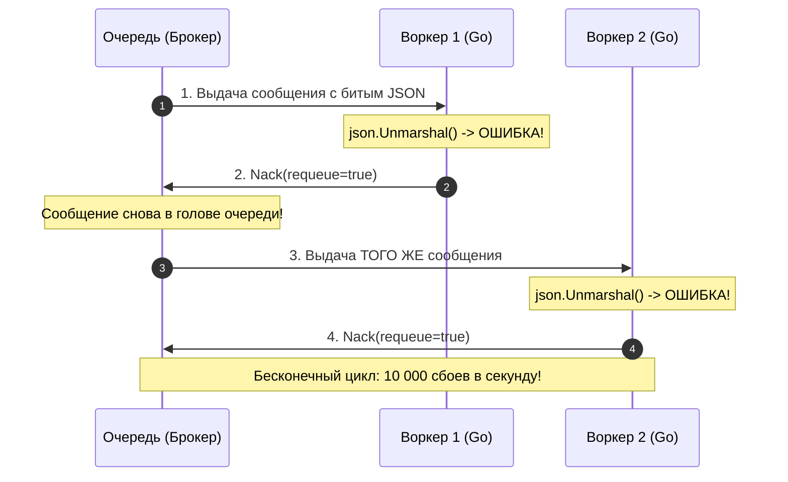
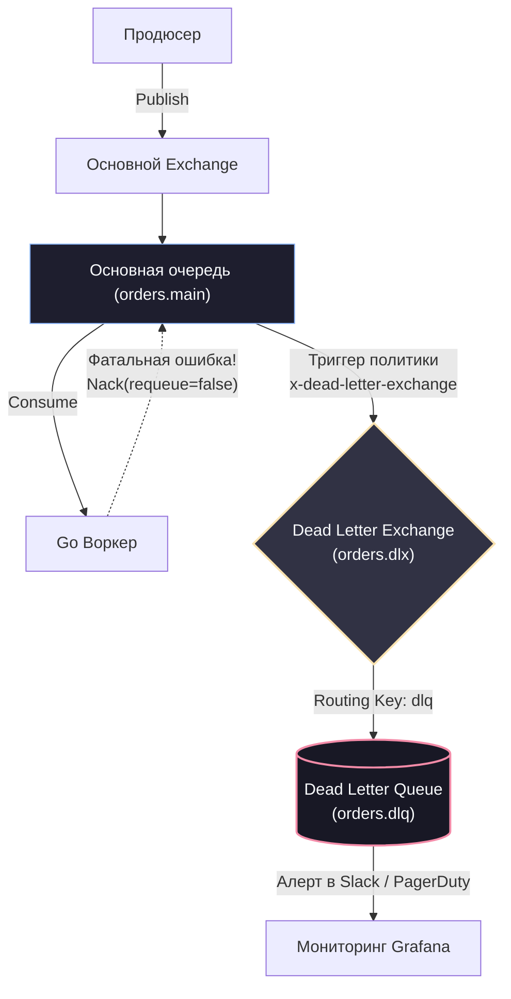

# 8. Dead Letter Queue

> *«В шпионаже ядовитая капсула обрывает жизнь агента, спасая миссию. В программной инженерии «ядовитое сообщение» делает прямо противоположное: оно убивает каждого воркера, пытающегося его обработать, приводя к полному параличу всей системы».*    
> — Системный афоризм о надежности

В предыдущих главах мы методично выстроили надежную асинхронную магистраль: защитили сервисы от потери данных дисковой персистентностью ([[7. Message durability и persistence]]), настроили подтверждения доставки в модели At-least-once и оградили систему от перегрузок через Backpressure. Кажется, что наша система способна выдержать любую бурю.

Но давайте представим тривиальную ситуацию из реальной жизни. Наш Go-консьюмер вычитывает сообщения из очереди и ожидает в теле JSON поле `user_id` строго типа `int64`. Из-за ошибки в стороннем сервисе или сломанного релиза фронтенда в очередь попадает всего одно поврежденное сообщение, где поле `user_id` передано как строка: `"unknown"`.

Что произойдет, когда горутина воркера вызовет `json.Unmarshal`?
1. Парсер стандартной библиотеки Go немедленно вернет ошибку несовпадения типов: `json: cannot unmarshal string into Go struct field .user_id of type int64`.
2. Добросовестный разработчик, следуя семантике гарантированной доставки At-least-once, решает не терять сообщение и вызывает `msg.Nack(requeue=true)` — приказывая брокеру: *«Я временно не справился, верни сообщение в очередь»*.
3. Брокер мгновенно возвращает сообщение обратно в голову очереди.
4. Освободившийся воркер (или его сосед) тут же вычитывает то же самое сообщение, снова падает на `json.Unmarshal` и снова шлет `Nack(requeue=true)`.

Система входит в **Infinite Retry Loop (Бесконечный цикл повторов)**. Это дефектное сообщение в индустрии называют **Poison Pill (Ядовитая пилюля)** или **Poison Message**.

---

## 1. Анатомия "Ядовитого сообщения" (Poison Pill)



> [!info] Под капотом: Последствия Poison Pill для железа и сети
> С точки зрения операционной системы Linux и рантайма Go этот бесконечный цикл — настоящая инфраструктурная катастрофа:
> 1. **Процессорный шторм:** Горутины консьюмеров выходят на 100% утилизацию CPU, непрерывно аллоцируя в куче структуры ошибок и временные буферы под битые JSON-сообщения. 
> 2. **Удушье GC:** Сборщик мусора Go захлебывается в попытках очистить миллионы короткоживущих объектов ошибок, создаваемых на каждом витке цикла.
> 3. **Сетевой флуд:** Локальный сетевой интерфейс забивается бесполезными TCP-пакетами: брокер и воркеры перебрасывают один и тот же килобайт данных взад и вперед десятки тысяч раз в секунду.
> 4. **Head-of-Line Blocking:** Если в очереди настроен строгий порядок (Strict Ordering) или консьюмер читает партицию Kafka, эта единственная ядовитая пилюля **намертво замораживает всю партицию**. Миллионы абсолютно валидных заказов, стоящих позади нее, никогда не будут обработаны.

Чтобы разорвать этот порочный круг и изолировать аварийные данные, в архитектуру очередей внедряется паттерн **Dead Letter Queue (DLQ) — Очередь мертвых писем**.

---

## 2. Что такое DLQ и как оно работает?

**Dead Letter Queue (DLQ)** — это специализированная изолированная очередь (или топик-карантин), куда брокер или прикладной сервис автоматически перенаправляет сообщения, которые по тем или иным причинам невозможно обработать в штатном режиме.

Главная цель DLQ — **немедленно освободить основную магистраль передачи данных**, сохранив дефектные сообщения для последующего расследования инженерами.

```
                  ┌───────────────────────────────┐
                  │    Основная очередь заказов   │
                  │   [Msg 1]  [Msg 2]  [Poison]  │
                  └───────────────┬───────────────┘
                                  │
                                  ▼
                        [ Воркер на Go ]
                                  │
                   (Ошибка: Невалидный JSON)
                                  │
                  ┌───────────────┴───────────────┐
                  ▼                               ▼
      [ Основная очередь свободна ]     [ Dead Letter Queue ]
      │  Валидные заказы идут     │     │  Карантин для     │
      │  на полной скорости       │     │  ручного разбора  │
      └───────────────────────────┘     └───────────────────┘
```

Сообщение признается «мертвым» и отправляется в DLQ в трех основных случаях:
1. **Явный отказ консьюмера (Rejection):** Консьюмер обнаружил фатальную ошибку и вызвал `Nack` (Negative Acknowledgement) с флагом `requeue=false`.
2. **Истечение времени жизни (TTL Expired):** Сообщение пролежало в очереди дольше допустимого времени (например, 2 часа) и потеряло бизнес-актуальность.
3. **Переполнение очереди (Queue Length Limit):** Буфер очереди заполнен до предела, и самые старые сообщения вытесняются с головы очереди (Drop Head) в DLQ.

---

## 3. Реализация в брокерах: Smart Broker против Dumb Broker

### Реализация в RabbitMQ (Smart Broker)

В брокере RabbitMQ концепция DLQ встроена прямо в ядро маршрутизации Erlang. Архитектурно сообщения перенаправляются не напрямую в очередь, а в специальный обменник — **Dead Letter Exchange (DLX)**.

При объявлении основной рабочей очереди вы передаете брокеру служебные аргументы конфигурации:
- `x-dead-letter-exchange`: имя Exchange, куда брокер автоматически перешлет отброшенные сообщения.
- `x-dead-letter-routing-key`: (опционально) ключ маршрутизации, с которым сообщение отправится в DLX.



Когда консьюмер на Go встречает ядовитое сообщение и выполняет `delivery.Nack(false, false)` (первый `false` — для одного сообщения, второй `false` — `requeue=false`), RabbitMQ мгновенно забирает байты из `orders.main` и публикует их в `orders.dlx`. Основная очередь чиста!

> [!warning] Ловушка / Gotcha: Переполнение самой Dead Letter Queue
> Классическая авария в продакшене:  
> В пятницу вечером разработчики выкатили релиз с багом валидации, из-за которого консьюмеры начали браковать 100% входящих заказов. За выходные миллионы сообщений благополучно перекочевали в DLQ.
> 
> Поскольку на саму Dead Letter Queue никто не установил лимиты, она забила все терабайты SSD-диска сервера RabbitMQ. Сработал дисковый аларм, RabbitMQ заблокировал все входящие сокеты продюсеров, и легла вся экосистема компании!
> 
> **Железное правило:** На саму Dead Letter Queue **обязательно** вешаются жесткие политики ограничения: `x-max-length` (максимальное число сообщений) и `x-message-ttl` (хранить не более нескольких суток).

---

### Реализация в Kafka (Dumb Broker)

В Apache Kafka брокер намеренно лишен сложной логики маршрутизации: он не знает, что такое DLQ, и не умеет автоматически перекладывать записи между топиками при сбоях консьюмера.

В парадигме Kafka вся ответственность за реализацию DLQ полностью лежит на **клиентском коде на Go**:

1. Консьюмер вычитывает сообщение из топика `orders`.
2. Если парсинг или бизнес-валидация вернула неустранимую ошибку, Go-воркер **самостоятельно инициирует отправку** (`Produce`) этого сообщения в специализированный топик: `orders-dlq`.
3. Воркер дожидается положительного подтверждения записи от топика `orders-dlq`.
4. **И только после этого воркер сдвигает оффсет (Commit Offset) в основном топике `orders`!**

Если воркер просто залогирует ошибку и упадет без фиксации оффсета, при следующем перезапуске Kafka снова отдаст ему то же самое ядовитое сообщение, и консьюмер войдет в бесконечный цикл падений (Crash Loop).

---

## 4. Идиоматичный Go: Классификация ошибок

Чтобы паттерн DLQ работал безотказно, архитектура приложения на Go обязана четко классифицировать ошибки на две принципиальные категории:

```
                          Ошибка обработки
                                 │
         ┌───────────────────────┴───────────────────────┐
         ▼                                               ▼
   [ Fatal Error ]                               [ Transient Error ]
(Неустранимая ошибка)                           (Временный сбой)
         │                                               │
   - Невалидный JSON                               - Таймаут к базе данных
   - Нарушение схемы данных                        - Ошибка 503 от эквайринга
   - Бизнес-инвариант (юзер забанен)               - Кратковременный сбой сети
         │                                               │
         ▼                                               ▼
   [ Отправка в DLQ ]                             [ Пауза + Retry ]
  (Nack requeue=false)                           (Экспоненциальный бэкофф)
```

Реализуем канонический обработчик на Go с классификацией ошибок через стандартный механизм `errors.Is`:

```go
package consumer

import (
	"context"
	"encoding/json"
	"errors"
	"fmt"
	"log/slog"
)

// Sentinel-ошибки для четкой классификации
var (
	ErrFatal     = errors.New("fatal message processing error")
	ErrTransient = errors.New("transient infrastructure error")
)

type OrderPayload struct {
	OrderID string `json:"order_id"`
	Amount  int64  `json:"amount"`
}

// DeliveryMessage абстрагирует входящее сообщение от брокера
type DeliveryMessage interface {
	Payload() []byte
	Ack() error
	Nack(requeue bool) error
}

type OrderProcessor struct {
	repo   OrderRepository
	logger *slog.Logger
}

func (p *OrderProcessor) ProcessDelivery(ctx context.Context, msg DeliveryMessage) {
	err := p.handleMessage(ctx, msg.Payload())
	if err == nil {
		_ = msg.Ack()
		return
	}

	// Анализируем категорию ошибки
	if errors.Is(err, ErrFatal) {
		p.logger.ErrorContext(ctx, "poison message detected, routing to DLQ",
			"error", err,
			"payload", string(msg.Payload()),
		)
		// requeue=false инициирует автоматический сброс в DLX (RabbitMQ)
		_ = msg.Nack(false)
		return
	}

	// Временная ошибка инфраструктуры: возвращаем в очередь для повтора
	p.logger.WarnContext(ctx, "transient failure, requeuing message",
		"error", err,
	)
	_ = msg.Nack(true)
}

func (p *OrderProcessor) handleMessage(ctx context.Context, raw []byte) error {
	var payload OrderPayload

	// 1. Десериализация: синтаксическая ошибка JSON НЕИСПРАВИМА
	if err := json.Unmarshal(raw, &payload); err != nil {
		return fmt.Errorf("%w: invalid JSON schema: %v", ErrFatal, err)
	}

	// 2. Бизнес-валидация инвариантов
	if payload.Amount <= 0 {
		return fmt.Errorf("%w: order amount must be positive", ErrFatal)
	}

	// 3. Вызов базы данных: ошибка сети УСТРАНИМА
	if err := p.repo.Save(ctx, payload); err != nil {
		return fmt.Errorf("%w: database write failure: %v", ErrTransient, err)
	}

	return nil
}

type OrderRepository interface {
	Save(ctx context.Context, p OrderPayload) error
}
```

> [!tip] Собеседование: Антипаттерн «Кладбище сообщений»
> **Вопрос:** Мы настроили Dead Letter Queue. В день туда оседает по 20–30 сообщений. Раз в неделю дежурный инженер заходит в веб-интерфейс RabbitMQ и нажимает кнопку `Purge` (Очистить), удаляя все накопившиеся записи. Является ли это нормальной эксплуатационной практикой?
> 
> **Ответ:** **Категорически нет! Это грубейший антипаттерн эксплуатации.**  
> Очередь DLQ — это не мусорная корзина, а хирургический изолятор. Каждое сообщение в DLQ означает **несостоявшуюся бизнес-транзакцию**:
> - Клиент заплатил деньги, но заказ не был собран.
> - Пользователь запросил смену пароля, но письмо не ушло.
> - Склад не списал остатки товара.
> 
> В зрелой HighLoad-системе метрика глубины DLQ (`dlq_messages_count > 0`) обязана генерировать алерт уровня **Warning** или **Critical** в мониторинг (Prometheus / Grafana / PagerDuty). Идеальная очередь DLQ должна быть абсолютно пустой.

---

## 5. Обработка DLQ: Что делать с «мертвецами»?

Изолировать дефектное сообщение в DLQ — это только первая половина спасательной операции. Вторая половина — разобраться с причиной аварии и завершить бизнес-процесс:

1. **Reprocessing (Повторная накатка):** Если сообщения попали в DLQ из-за программного бага в консьюмере (например, забыли поддержать новое поле JSON), разработчики выкатывают хотфикс. После деплоя запускается сервисный скрипт (Reprocessor), который вычитывает сообщения из DLQ и отправляет их обратно в основную очередь на повторную обработку.
2. **Аудит и заголовки `x-death` в RabbitMQ:** При пересылке сообщения в DLX RabbitMQ автоматически добавляет в заголовок сообщения массив `x-death`. Он содержит бесценную судебную метаинформацию: точную причину отказа (`rejected`, `expired`, `maxlen`), временную метку, имя оригинальной очереди и счетчик попыток.
3. **Dead Letter Service (Централизованный шлюз):** В микросервисных экосистемах создают единый внутренний сервис поддержки, который подписывается на все DLQ-топики компании, сохраняет поврежденные события в базу данных и предоставляет удобную веб-панель для инженеров саппорта (с возможностью отредактировать поврежденный payload и нажать «Re-try»).

---

## Резюме

1. **Poison Pill** — это сообщение с неустранимым дефектом, которое способно уничтожить производительность системы бесконечными повторами и блокировкой головы очереди (Head-of-Line Blocking).
2. **Dead Letter Queue (DLQ)** изолирует ядовитые сообщения в карантинную очередь, сохраняя пропускную способность основной магистрали.
3. В **RabbitMQ** DLQ настраивается на уровне брокера через **Dead Letter Exchange (DLX)** и заголовки очередей. В **Kafka** маршрутизация в DLQ реализуется вручную в коде консьюмера с последующим коммитом оффсета.
4. Консьюмер на Go обязан четко разделять ошибки на **Fatal** (немедленный сброс в DLQ) и **Transient** (повторная попытка).

Но что делать с временными ошибками (Transient)? Если внешняя база данных перегружена, немедленный возврат сообщения через `Nack(requeue=true)` заставит брокер вернуть его воркеру через миллисекунду, устроив беспощадный DDoS собственной упавшей инфраструктуре. 

Как правильно рассчитывать паузы между повторами и защищать сервисы от резонансных штормов, мы разберем в следующей лекции: **[[9. Retry стратегии и exponential backoff]]**.