# 9. Retry стратегии и exponential backoff

> *"If at first you don't succeed, try, try again. But if ten thousand workers try again at the exact same millisecond, they will simply ensure that the fallen server never stands up again."*  
> — Инженерный закон резонанса в распределенных системах

В 1831 году в Англии обрушился подвесной мост Бротон: колонна из семидесяти солдат маршировала по нему строевым шагом в ногу. Частота шагов совпала с собственной резонансной частотой моста, возникла разрушительная амплитуда колебаний, и железные цепи лопнули. С тех пор во всех уставах армий мира появилось строгое правило: *при переходе через мосты войска обязаны сбивать шаг и идти вольным строем*.

В распределенных системах программные воркеры ведут себя в точности как те солдаты.

---

## Анатомия временного сбоя

В предыдущей главе ([[8. Dead Letter Queue]]) мы разделили ошибки на **Фатальные** (битый JSON, нарушение схемы данных — немедленная изоляция в DLQ) и **Временные (Transient)**. 

Временная ошибка означает кратковременное недомогание инфраструктуры: моргнул коммутатор, база данных переключилась на реплику (Failover), внешний платежный шлюз вернул статус `503 Service Unavailable`. 

Разумеется, такое сообщение нельзя выбрасывать: его нужно повторить. Этот процесс называется **Retry (Повторная попытка)**. Но если реализовать ретраи наивно, вы собственноручно устроите разрушительный резонанс и добьете собственную упавшую инфраструктуру.

---

## 1. Проблема "Гремящего стада" (Thundering Herd)

Представим типичную архитектуру: 100 воркеров на Go вычитывают очередь заказов и пишут строки в PostgreSQL. В 12:00:00 база данных уходит в плановую перезагрузку для применения настроек. Процесс перезапуска занимает ровно 5 секунд.

```
       [ 100 Воркеров Go ] ─── Синхронный Immediate Retry ───► [ PostgreSQL (Rebooting) ]
                 ▲                                                        │
                 │                                                        ▼
                 └─────────────── Лавина 50 000 TCP-SYN / сек ────────────┘
                              (Ядро Linux на БД задыхается,
                               база не успевает инициализироваться)
```

Что произойдет при **наивном подходе (Immediate Retry)**?
1. В 12:00:00 воркер пытается выполнить транзакцию в БД $\rightarrow$ получает ошибку `connection refused`.
2. Воркер немедленно шлет брокеру отрицательное подтверждение `Nack` (Negative Ack) с флагом возврата в очередь (`requeue=true`).
3. Брокер со скоростью сетевого интерфейса возвращает сообщение обратно.
4. Воркер в ту же микросекунду снова долбит сокетом в закрытый порт базы данных.

За 5 секунд простоя 100 воркеров успеют сгенерировать более 200 000 запросов! Процессор на сервере базы данных, который пытается инициализировать буферный пул и запустить фоновые процессы PostgreSQL, на 100% сжигается сетевым стеком ядра Linux на обработку лавины входящих пакетов TCP-SYN. 

Вы устроили полноценную **DDoS-атаку на собственную базу данных**. Сервер не поднимется никогда. Это классическая проблема **Thundering Herd (Гремящее стадо)**.

---

## 2. Exponential Backoff (Экспоненциальная задержка)

Чтобы дать пострадавшей системе передышку и возможность восстановить рабочее состояние, пауза между повторными попытками обязана прогрессивно увеличиваться.

Стандартом индустрии является алгоритм **Exponential Backoff (Экспоненциальная задержка)**: с каждой последующей неудачной попыткой время ожидания удваивается (или умножается на фиксированный коэффициент), пока не упрется в заданный потолок:

$$WaitTime = \min\left(InitialDelay \times Factor^{Attempt},\; MaxDelay\right)$$

*Пример расчета ($Initial = 1\text{ с}$, $Factor = 2$, $Max = 30\text{ с}$):*
- Попытка 1: ожидание 1 секунду.
- Попытка 2: ожидание 2 секунды.
- Попытка 3: ожидание 4 секунды.
- Попытка 4: ожидание 8 секунд.
- Попытка 5: ожидание 16 секунд.
- Попытка 6+: ожидание 30 секунд (достигнут лимит $MaxDelay$).

> [!warning] Ловушка / Gotcha: Экспонента не спасает от резонанса!
> Распространенное заблуждение разработчиков: *«Я добавил экспоненциальную задержку, проблема Thundering Herd решена»*.
> 
> **Это опасная иллюзия!**
> Если база данных упала ровно в 12:00:00, все 100 воркеров получили ошибку одновременно. Все 100 воркеров подождут ровно 1 секунду и **строем ударят в базу в 12:00:01**. База снова упадет.
> Все 100 воркеров подождут ровно 2 секунды и **снова строем ударят в базу в 12:00:03**!
> 
> Чистая экспоненциальная задержка не устраняет Thundering Herd — она лишь разбивает непрерывный поток запросов на периодические разрушительные спайки (цунами трафика), синхронизированные во времени!

---

## 3. Jitter: Добавляем хаос во имя спасения

Чтобы разрушить синхронный строй воркеров (в точности как солдаты на мосту Бротон), в математическую формулу задержки вводят случайный шум — **Jitter (Джиттер)**.

Вместо того чтобы ждать ровно 4 секунды, Воркер №1 подождет 2.3 с, Воркер №2 — 3.9 с, а Воркер №3 — 1.1 с.

```mermaid
flowchart TD
    subgraph WithoutJitter ["Без Jitter: Разрушительный синхронный удар"]
        direction TB
        A1["Воркер 1"] -->|Удар в 12:00:03| DB1[("База Данных<br>(Crash)")]
        A2["Воркер 2"] -->|Удар в 12:00:03| DB1
        A3["Воркер 3"] -->|Удар в 12:00:03| DB1
    end

    subgraph WithJitter ["С Jitter: Размазанная плоская нагрузка"]
        direction TB
        B1["Воркер 1"] -->|Запрос в 12:00:01.8| DB2[("База Данных<br>(Online)")]
        B2["Воркер 2"] -->|Запрос в 12:00:02.9| DB2
        B3["Воркер 3"] -->|Запрос в 12:00:04.2| DB2
    end

    style WithoutJitter fill:#1e1e2e,stroke:#f38ba8,stroke-width:1px
    style WithJitter fill:#181825,stroke:#a6e3a1,stroke-width:1px
    style DB1 fill:#313244,stroke:#f38ba8,stroke-width:2px
    style DB2 fill:#313244,stroke:#a6e3a1,stroke-width:2px
```



В знаменитом исследовании архитекторов Amazon Web Services (*Exponential Backoff And Jitter, Marc Brooker*) было математически доказано, что наиболее эффективной стратегией является **Full Jitter**:

$$WaitTime = \text{Random}\left(0,\; \min\left(InitialDelay \times Factor^{Attempt},\; MaxDelay\right)\right)$$

Full Jitter полностью срезает амплитудные пики нагрузки, превращая спайки трафика в ровное, безопасное плато, позволяющее восстанавливающейся базе данных плавно войти в рабочий ритм.

---

## 4. Идиоматичный Go: Пишем правильный Retry-цикл

Реализация повторных попыток в Go-коде консьюмера требует предельной аккуратности при работе с таймерами рантайма и контекстами отмены.

> [!info] Под капотом: Таймеры рантайма и утечки памяти
> Исторически (до версии Go 1.23) вызов `time.After()` внутри цикла `for` с конструкцией `select` считался грубой ошибкой и источником утечки памяти (Memory Leak).
> 
> Функция `time.After(d)` создает структуру таймера `runtime.timer`, которая регистрируется в планировщике рантайма Go. Если операция завершалась успешно на 1-й секунде, а таймер был взят на 30 секунд, таймер не удалялся сборщиком мусора до тех пор, пока не протикает до конца! Под высокой нагрузкой это приводило к аллокации сотен мегабайт мертвых таймеров в куче.
> 
> Несмотря на то, что начиная с Go 1.23 каналы неиспользуемых таймеров научились собираться сборщиком мусора, **золотым стандартом высокопроизводительного Go** остается повторное использование одного таймера через `time.NewTimer`, `Stop()` и сброс канала.

Реализуем production-ready механизм повторов с поддержкой `context.Context` и алгоритмом Full Jitter:

```go
package retry

import (
	"context"
	"math/rand/v2" // Идиоматичный Go 1.22+ без глобальных мьютексов блокировки
	"time"
)

// Config задает параметры экспоненциального отката
type Config struct {
	MaxRetries int
	BaseDelay  time.Duration
	MaxDelay   time.Duration
}

// Do выполняет функцию f с Exponential Backoff и Full Jitter
func Do(ctx context.Context, cfg Config, f func(ctx context.Context) error) error {
	var err error

	// Инициализируем один таймер для предотвращения лишних аллокаций в куче
	timer := time.NewTimer(0)
	// Гарантированно освобождаем таймер в рантайме при выходе
	defer timer.Stop()

	// Сразу останавливаем и дренируем начальный таймер
	if !timer.Stop() {
		select {
		case <-timer.C:
		default:
		}
	}

	for attempt := 0; attempt < cfg.MaxRetries; attempt++ {
		// Выполняем полезную работу с передачей контекста
		if err = f(ctx); err == nil {
			return nil // Успешное выполнение
		}

		// Если это была последняя разрешенная попытка — выходим с ошибкой
		if attempt == cfg.MaxRetries-1 {
			break
		}

		// 1. Вычисляем экспоненту: Base * 2^attempt
		expo := float64(cfg.BaseDelay) * float64(uint64(1)<<attempt)
		if expo > float64(cfg.MaxDelay) {
			expo = float64(cfg.MaxDelay)
		}

		// 2. Full Jitter: случайная задержка от 0 до expo
		// В Go 1.22+ math/rand/v2 работает без разделяемых глобальных блокировок
		jitter := time.Duration(rand.Float64() * expo)

		// 3. Безопасный перезапуск таймера
		timer.Reset(jitter)

		// 4. Ожидание срабатывания таймера или отмены контекста (Graceful Shutdown)
		select {
		case <-ctx.Done():
			return ctx.Err()
		case <-timer.C:
			// Пауза истекла, идем на следующий виток
		}
	}

	return err
}
```

---

## 5. Как реализовать отложенные ретраи в Брокерах?

Локальный сон горутины (`time.Sleep` или `timer.Reset` в цикле `select { <-timer.C }`) в консьюмере имеет один критический архитектурный недостаток: **пока воркер спит, сообщение удерживается в статусе Unacknowledged**.
- Воркер и его горутина заблокированы и не могут обрабатывать другие, возможно совершенно здоровые сообщения.
- Если зависимый сервис упал на 30 минут, все воркеры заснут, и вся труба очередей компании намертво встанет!

В реальных HighLoad-системах отложенные повторы обязаны выноситься **на уровень инфраструктуры брокеров сообщений**.

### Подход RabbitMQ: Эмуляция задержек через TTL и DLX

Исторически брокер RabbitMQ не имел таймеров отложенной доставки. Инженеры создали гениальный паттерн на базе очередей-отстойников (Delay Queues):

1. При временном сбое консьюмер публикует (`Publish`) сообщение в служебную очередь: `retry-queue-1m`.
2. У этой очереди **нет ни одного живого консьюмера**. При создании для нее заданы аргументы:
   - `x-message-ttl: 60000` (ровно 60 секунд).
   - `x-dead-letter-exchange: main-exchange` (пересылка обратно в основной обменник).
3. Сообщение лежит в очереди-отстойнике ровно одну минуту. По истечении TTL брокер считает его просроченным и перебрасывает в `main-exchange`, откуда оно снова прилетает в рабочую очередь консьюмера!

Для цепочки ретраев создается каскад очередей: `retry.10s` $\rightarrow$ `retry-queue-1m` $\rightarrow$ `retry.10m` $\rightarrow$ `orders.dlq`.

*(Примечание: существует плагин `rabbitmq-delayed-message-exchange`, использующий таймеры Erlang Mnesia, однако под сверхвысоким трафиком он создает серьезную нагрузку на CPU брокера).*

### Подход Apache Kafka: Паттерн Uber Retry Topics

В Apache Kafka партиция — это строгий лог. Если консьюмер заснет, чтение всей партиции встанет (Head-of-Line Blocking).

Инженеры компании Uber разработали архитектурный паттерн **Retry Topics**:
Создается иерархия независимых топиков для ретраев с разным интервалом:
* `topic-main`
* `topic-retry-10s`
* `topic-retry-1m`
* `topic-retry-10m`
* `topic-dlq`


1. Консьюмер ловит ошибку в основном топике `topic-main`.
2. Он публикует (`Produce`) это же сообщение в топик `topic-retry-10s` и **немедленно коммитит оффсет в основном топике**! Основной консьюмер мгновенно свободен и читает следующие заказы.
3. Отдельный выделенный пул воркеров читает `topic-retry-10s` с задержкой и пытается обработать сообщение. Если снова сбой — перекладывает в `topic-retry-1m`, а затем в `topic-retry-10m`.
4. Если лимит попыток исчерпан — сообщение отправляется в `topic-dlq`.

> [!tip] Собеседование: Ретраи как генератор дубликатов
> **Вопрос:** Мы настроили идеальный Exponential Backoff с Full Jitter на 5 попыток. Но почему в базе данных периодически появляются дублирующие списания денег?
> 
> **Ответ:** 
> **Любой механизм Retry — это фабрика по генерации дубликатов на сетевом уровне.**
> 
> Сбой сети мог произойти *после* того, как база данных выполнила SQL-команду `Insert` и зафиксировала транзакцию, но *до* того, как клиент получил сетевой пакет подтверждения `Ack`. 
> 
> Клиент считает операцию неудавшейся по таймауту и честно запускает алгоритм Retry. Спустя пару секунд второй запрос прилетает в базу и делает повторный `Insert`. 
> 
> **Ретраи бессмысленны и опасны без Идемпотентности.** Повторять запрос безопасно только тогда, когда бизнес-логика гарантирует, что повторное выполнение операции приведет к абсолютно тому же результату, что и единичное.

---

## Резюме

1. **Мгновенные повторные попытки (Immediate Retry)** превращают кратковременный сбой в полномасштабную DDoS-атаку на собственную инфраструктуру (Thundering Herd).
2. **Exponential Backoff** увеличивает паузы между попытками, давая зависимым системам время на восстановление.
3. **Jitter (Full Jitter)** — обязательный элемент устойчивости: он рассинхронизирует запросы воркеров, предотвращая периодические резонансные всплески нагрузки.
4. В Go локальные ретраи реализуются через безопасный перезапуск таймеров `time.NewTimer` с контролем `context.Context`.
5. В высоконагруженных системах ретраи выносятся на уровень инфраструктуры (очереди TTL/DLX в RabbitMQ или топики повторов в Kafka), чтобы не блокировать потоки консьюмеров.

Но как сделать так, чтобы неизбежные дубликаты сообщений, порождаемые ретраями и сетевыми сбоями, не списывали деньги с клиентов повторно? 

В следующей, фундаментальной главе нашего раздела мы разберем главный краеугольный камень надежного бэкенда: **[[10. Idempotency в message processing]]**.