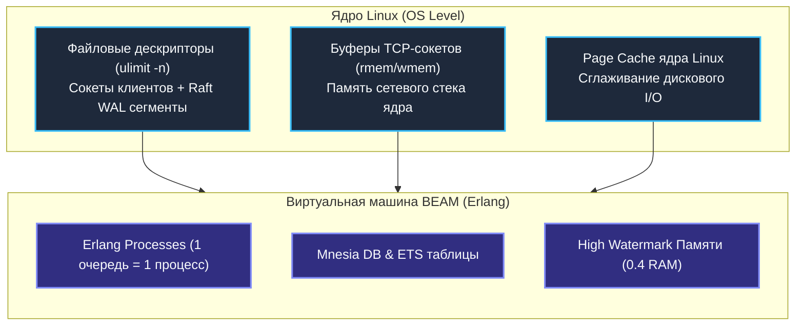
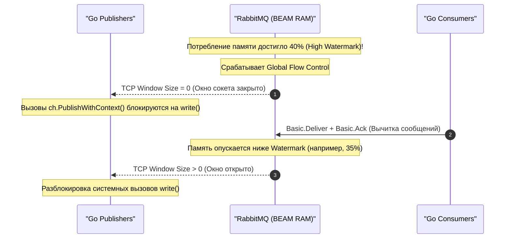
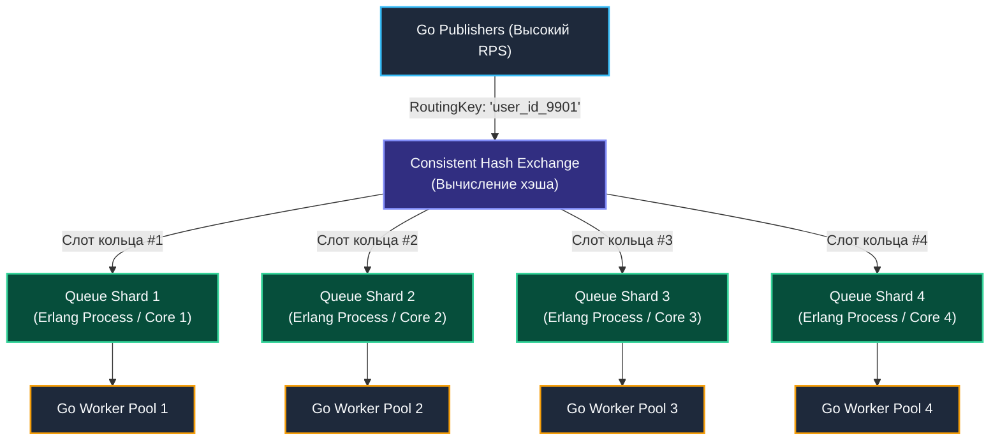

В предыдущих статьях (особенно в [[9. Cluster и HA в RabbitMQ]]) мы спроектировали распределенный отказоустойчивый кластер, способный без потери данных пережить падение дата-центра и сетевые разделения Split-Brain. Однако надежность в распределенных системах никогда не дается даром: математический консенсус и гарантии сохранности всегда оплачиваются снижением пропускной способности (**Throughput**) и ростом сетевых и дисковых задержек (**Latency**).

RabbitMQ — это великолепный представитель архитектуры «Умный брокер» (Smart Broker). Но его виртуальная машина BEAM и модель акторов Erlang/OTP подчиняются строгим законам физики и операционной системы. Если попытаться протолкнуть через кластер миллион сообщений в секунду «в лоб», без глубокого понимания аппаратного контекста, система быстро захлебнется от дефицита файловых дескрипторов, упрется в лимиты оперативной памяти или зависнет на синхронизации диска.

В этой заключительной лекции подраздела по RabbitMQ мы разберем тюнинг производительности на всех уровнях стека: от системных параметров ядра Linux и рантайма Erlang до оптимизации высоконагруженного клиентского кода на языке Go.

---

## 1. Лимиты ОС и Mechanical Sympathy

С точки зрения операционной системы Linux процесс RabbitMQ — это типичное **I/O-bound** приложение с интенсивным параллелизмом. Он удерживает десятки тысяч открытых TCP-сокетов и непрерывно выполняет операции дискового ввода-вывода (особенно в режиме Quorum Queues с упреждающим журналом Raft WAL).



### Файловые дескрипторы (File Descriptors)
В архитектуре UNIX/Linux практически любой ресурс ввода-вывода представлен файловым дескриптором. Каждое входящее TCP-соединение от вашего Go-бэкенда, каждый внутренний межкластерный RPC-канал Erlang и каждый сегмент лога на диске требуют отдельного дескриптора.

По умолчанию во многих серверных дистрибутивах Linux лимит на количество открытых файлов для процесса (`ulimit -n`) составляет скромные `1024`. Для нагруженного брокера очередей это верный путь к аварии.

> [!warning] Ловушка / Gotcha: Исчерпание файловых дескрипторов
> Если RabbitMQ исчерпает лимит файловых дескрипторов:
> 1. Он не просто откажется принимать новые подключения от Go-воркеров.
> 2. Брокер потеряет возможность открывать новые файлы сегментов для записи журналов транзакций и создания внутренних сокетов синхронизации.
> 3. Планировщик Erlang перейдет в аварийный режим, и пропускная способность кластера мгновенно рухнет до нуля.
>
> **Решение:** Для production-серверов лимит дескрипторов в конфигурации `systemd` (`LimitNOFILE`) или в файле `/etc/security/limits.conf` обязан быть выставлен минимум в `65536`, а для высоконагруженных инсталляций — **`1048576`**.

### TCP Keepalive и Heartbeats: Борьба с повисшими соединениями
В облачных средах (особенно при работе в Kubernetes) поды приложений могут внезапно погибать: отстрел по `OOM Killer`, аварийная перезагрузка пода узлом Kubelet, аппаратный сбой физического гипервизора.

При жестком падении процесса операционная система хоста физически не успевает отправить парному сокету финальные TCP-пакеты `FIN` или `RST`. Со стороны RabbitMQ такое соединение выглядит абсолютно здоровым и открытым (**Half-open connection**). Подобные «зомби-соединения» накапливаются сотнями, удерживая дескрипторы, память и закрепленные за ними каналы.

Для предотвращения этой утечки протокол AMQP 0-9-1 использует механизм **Heartbeats** (по умолчанию интервал равен 60 секундам). Сетевая библиотека `amqp091-go` в фоновой горутине непрерывно обменивается с брокером легковесными пинг-фреймами. Если брокер не получает подтверждения два периода подряд, он принудительно разрывает TCP-сокет и возвращает все неподтвержденные сообщения (`Unacked`) обратно в очередь.

---

## 2. Тюнинг памяти: Управление потопом (Flow Control)

RabbitMQ удерживает сообщения в оперативной памяти для достижения минимального времени отклика и сбрасывает их на накопитель только по мере необходимости. Как брокер страхует себя от неконтролируемого падения по нехватке памяти?

В рантайме Erlang действует многоуровневый защитный барьер — **High Watermark**. Главным настроечным параметром в файле `rabbitmq.conf` является директива `vm_memory_high_watermark` (по умолчанию `0.4`, то есть 40% от общего объема доступной физической оперативной памяти хоста).



### Механика Global Flow Control:
Когда брокер фиксирует, что объем занятой памяти достиг порога `vm_memory_high_watermark`:
1. Включается режим **Global Flow Control (Глобальная блокировка потока)**.
2. Брокер принудительно перестает считывать входящие байты из сокетов всех издателей (Publishers). Размер окна TCP (TCP Window) на приеме урезается до нуля.
3. Все клиентские приложения на Go мгновенно **блокируются внутри системного вызова `write()`** ядра Linux при попытке отправить очередное сообщение.
4. При этом консьюмерам (Consumers) выдача данных не блокируется: брокер намеренно позволяет воркерам вычитывать сообщения из буферов, чтобы вернуть уровень занятой памяти в безопасную зону.

> [!tip] Собеседование: Можно ли задрать High Watermark до 90%?
> **Вопрос:** Можем ли мы на выделенном сервере с 64 ГБ RAM выставить `vm_memory_high_watermark = 0.9` (90%), чтобы RabbitMQ использовал практически всю память хоста под кэш очередей?
> 
> **Ответ:** **Категорически нет.**  
> 1. Сборщик мусора в Erlang работает на уровне изолированных процессов: при мажорной очистке кучи процессу требуется временный буфер в памяти, сопоставимый с его текущим объемом (накладные расходы до x2 от размера кучи).
> 2. Ядру операционной системы Linux жизненно необходима оперативная память под **Page Cache**, чтобы эффективно буферизировать и агрегировать дисковый ввод-вывод. 
> Если выставить порог в 90%, при малейшем скачке нагрузки операционная система испытает жесточайший дефицит свободных страниц, придет системный **OOM Killer** и мгновенно уничтожит процесс брокера по `SIGKILL`. Безопасный максимум для выделенных машин — **`0.6`** (60%).

---

## 3. Архитектурный тюнинг: Очереди и Шардирование

Как мы установили в первых статьях раздела, фундаментальным архитектурным ограничением классического RabbitMQ является принцип:  
$$\mathbf{1\text{ Очередь} = 1\text{ Erlang-процесс} = 1\text{ Ядро CPU}}$$

Внутренний актор очереди исполняет инструкции строго последовательно. Если ваш сервер оснащен 64 или 128 процессорными ядрами, но весь трафик приложения вы направляете в *одну-единственную* очередь `orders`, утилизация процессорных ресурсов сервера составит ничтожные $1/64 \approx 1.5\%$. Брокер упрется в 40 000 – 60 000 RPS на одном ядре, а остальные 63 ядра будут бессмысленно простаивать.

### Паттерн Consistent Hashing (Шардирование очередей)
Для полноценной загрузки всех ядер сервера применяется официальный плагин — **`rabbitmq-consistent-hash-exchange`**.

Обменник вычисляет хэш-сумму от `Routing Key` (или указанного заголовка) входящего сообщения и по кольцу согласованного хэширования (**Consistent Hashing**) направляет его в одну из параллельных очередей-шардов.



**Преимущества паттерна:**
1. **Линейное масштабирование:** Нагрузка распределяется по всем физическим ядрам CPU.
2. **Сохранение локального порядка:** Все сообщения с одинаковым идентификатором (например, `user_id`) гарантированно попадают в один и тот же шард, сохраняя строгую хронологическую очередность обработки.

---

## 4. Оптимизация Go-кода (Producers & Consumers)

Чтобы инфраструктурный тюнинг брокера раскрыл свой потенциал, клиентский код на Go должен быть спроектирован с учетом механики протокола AMQP 0-9-1.

### Publisher: Батчинг и Асинхронные Confirms
В лекции [[4. Acknowledgements и delivery guarantees]] мы узнали, что для гарантии надежности издатель обязан использовать `Publisher Confirms`. 

Однако блокирующее ожидание подтверждения после *каждого* вызова `Publish` разрушает производительность: задержка Round-Trip по сети в сочетании с записью брокера на диск снизит скорость публикации до жалких сотен RPS.

Высокопроизводительный публикатор обязан применять **конвейеризацию (Pipelining)** и **асинхронное получение подтверждений (Asynchronous Confirms)** через метод `ch.NotifyPublish`:

```go
package main

import (
	"context"
	"fmt"
	"log"
	"sync"
	"time"

	amqp "github.com/rabbitmq/amqp091-go"
)

// publishBatchFast отправляет пачку сообщений с асинхронным подтверждением кворума
func publishBatchFast(ctx context.Context, ch *amqp.Channel, exchange, routingKey string, messages [][]byte) error {
	// 1. Переводим канал в режим подтверждений
	if err := ch.Confirm(false); err != nil {
		return fmt.Errorf("ошибка ch.Confirm: %w", err)
	}

	// 2. Инициализируем буферизованный канал для получения подтверждений
	confirms := ch.NotifyPublish(make(chan amqp.Confirmation, len(messages)))

	var wg sync.WaitGroup
	wg.Add(1)

	var nackCount int
	// 3. Запускаем фоновую горутину, асинхронно собирающую ответы брокера
	go func() {
		defer wg.Done()
		received := 0
		for c := range confirms {
			received++
			if !c.Ack {
				nackCount++
				log.Printf("Сообщение NACK брокером! DeliveryTag: %d", c.DeliveryTag)
			}
			if received == len(messages) {
				return // Получили ответы на всю пачку
			}
		}
	}()

	// 4. В основном потоке непрерывно выстреливаем сообщения в сокет (Pipelining)
	for _, payload := range messages {
		err := ch.PublishWithContext(ctx,
			exchange,
			routingKey,
			false,
			false,
			amqp.Publishing{
				DeliveryMode: amqp.Persistent, // Фиксация на диске
				ContentType:  "application/json",
				Body:         payload,
				Timestamp:    time.Now().UTC(),
			},
		)
		if err != nil {
			log.Printf("Ошибка записи в TCP-сокет: %v", err)
		}
	}

	// 5. Ожидаем завершения подтверждений всей пачки от сервера
	wg.Wait()

	if nackCount > 0 {
		return fmt.Errorf("пачка опубликована с ошибками: %d сообщений отклонено", nackCount)
	}
	return nil
}
```

*При таком подходе ядро RabbitMQ агрегирует записи в Raft WAL или дисковый лог пачками, что повышает пропускную способность публикации в $10\text{–}50$ раз.*

### Consumer: Настройка Prefetch и изоляция каналов
1. **Prefetch Count:** Для быстрых воркеров (микропакеты, инсерты в кэш) увеличивайте `ch.Qos(prefetchCount, 0, false)` до `200..1000`. Это нивелирует сетевой пинг, удерживая готовые к обработке сообщения в RAM процесса Go.
2. **Изоляция каналов (`amqp.Channel`):** Никогда не расшаривайте один объект `*amqp.Channel` между параллельными горутинами. Внутренний мьютекс `sync.Mutex` в библиотеке `amqp091-go`, сериализующий фреймы в сокет, станет источником жесточайшего lock contention.  
   **Правило архитектуры:** **1 горутина-воркер = 1 выделенный AMQP-канал**.

---

## 5. Компромиссы: Производительность vs Гарантии

Самый быстрый RabbitMQ — это брокер, который **ничего не записывает на диск**.

Если в вашей системе есть потоки данных, где потеря незначительной части событий при аварии сервера допустима (метрики мониторинга, сырые кликстрим-логи, временная телеметрия датчиков IoT), вы можете задействовать режим `Transient`:
- Публикуйте сообщения с флагом `DeliveryMode = 1 (Transient)`.
- Используйте стандартные **Classic Queues** без персистентности (Quorum Queues по своей природе всегда принудительно пишут данные в Raft WAL и не могут работать чисто in-memory).

В этом режиме RabbitMQ превращается в феноменально быстрый in-memory маршрутизатор, способный прокачивать сотни тысяч сообщений в секунду на скромном железе.

> [!info] Под капотом: Размер полезной нагрузки (Payload Size) и паттерн Claim Check
> RabbitMQ исторически спроектирован для работы с компактными сообщениями. Идеальный размер полезной нагрузки — **от нескольких сотен байт до 2–4 килобайт**.
> 
> Если вы начнете пересылать через очереди файлы или тяжелые JSON по $10\text{–}50\text{ МБ}$ (например, закодированные в Base64 изображения или архивы):
> 1. Виртуальная машина BEAM начнет испытывать колоссальную нагрузку при аллокациях в пуле больших объектов (LOB, Large Object Space).
> 2. Процессы очередей будут тратить львиную долю тактов CPU на постоянный вызов сборщика мусора.
> 3. Сетевые сокеты и буферы мгновенно забьются, заблокировав пропускную способность для остальных очередей.
> 
> **Архитектурный стандарт:** Для тяжелых бинарных данных используйте паттерн **Claim Check** — сохраняйте полезную нагрузку в объектное хранилище S3 (**MinIO**, Ceph, AWS S3), а через очередь RabbitMQ передавайте только компактный JSON с идентификатором (ID) и URI файла.

---

## Итог раздела по RabbitMQ

Мы завершили фундаментальное исследование архитектуры и практики работы с RabbitMQ. Сведем главные тезисы подраздела в единую ментальную карту:

1. **Smart Broker, Dumb Consumer:** RabbitMQ берет на себя всю сложность маршрутизации, фильтрации, управления очередями и контроля подтверждений (Acks). Клиентский код остается легковесным.
2. **Анатомия AMQP 0-9-1:** Сообщения никогда не публикуются прямо в очередь. Маршрут строго определен:  
   $$\text{Producer} \xrightarrow{\text{Publish}} \text{Exchange} \xrightarrow{\text{Binding + Routing Key}} \text{Queue} \xrightarrow{\text{Deliver}} \text{Consumer}$$
3. **Отказоустойчивость:** Для mission-critical систем стандартом индустрии являются **Quorum Queues** на базе консенсуса **Raft** в связке с `Publisher Confirms` и ручными подтверждениями `Manual Acks` (`autoAck: false`).
4. **Контроль потока (Backpressure):** Каждый консьюмер обязан настраивать `ch.Qos(prefetchCount, 0, false)` до вызова `ch.Consume()`, чтобы предотвратить катастрофический эффект пожарного гидранта и OOM Killer.
5. **Безопасность сбоев:** При транзитных ошибках используйте отложенные ретраи (**Wait Queues** с фиксированным TTL либо **Delayed Message Plugin**). Для бракованных данных настраивайте карантинные очереди **Dead Letter Exchange (DLX)**, избегая опасных циклов `Poison Message Loop`.
6. **Производительность:** Классическая очередь упирается в одно процессорное ядро. Для высоких нагрузок шардируйте потоки через `Consistent Hash Exchange`, расширяйте лимиты файловых дескрипторов (`ulimit -n`) и применяйте асинхронные пакетные подтверждения в Go.

---

### Мост к следующему разделу

RabbitMQ великолепен там, где требуются сложная маршрутизация, индивидуальная адресация задач и немедленное удаление сообщений после подтверждения обработки. 

Однако его архитектурные ограничения — выталкивающая Push-модель, удаление прочитанных данных и накладные расходы на поддержание состояния каждого сообщения в памяти — делают его неоптимальным для задач Event Sourcing, потоковой аналитики реального времени и хранения терабайтов немодифицируемой истории событий.

Для решения задач сверхвысоких нагрузок индустрия обращается к принципиально иной архитектурной парадигме — распределенному немодифицируемому журналу записей на диске (Append-Only Log), где брокер намеренно сделан предельно простым («Dumb Broker»), а вся ответственность за смещения и параллелизм возлагается на «умного потребителя» («Smart Consumer»).

Мы переходим к изучению тяжелой артиллерии распределенных систем. Наша следующая статья открывает новый раздел: [[1. Kafka. Архитектура и модель log based системы]].