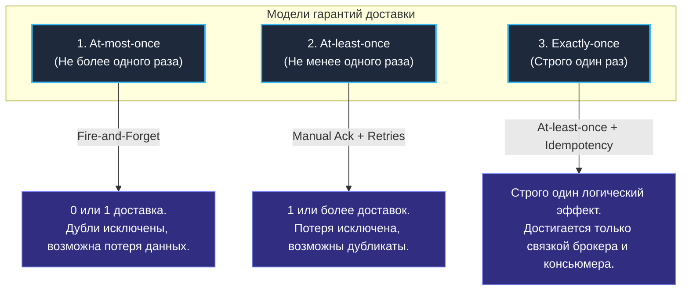
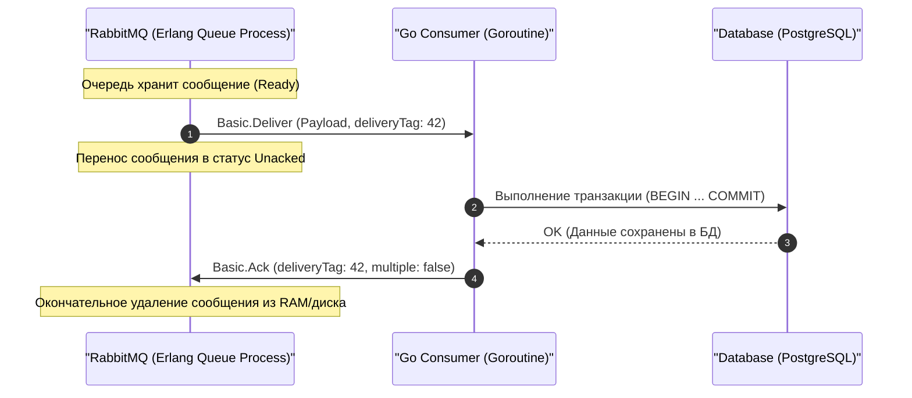
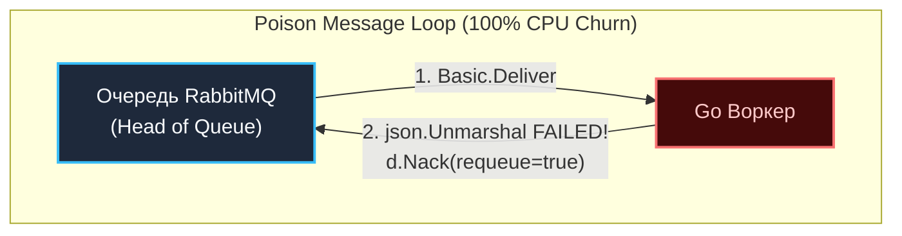

В предыдущей статье [[3. Queues и bindings]] мы подробно изучили, как очереди RabbitMQ сохраняют данные на диске и в оперативной памяти. Но надежное хранение — это лишь половина пути. Фундаментальная задача любого брокера — передать полезную нагрузку потребителю (Consumer) и получить математически строгое подтверждение того, что бизнес-логика успешно отработала.

Распределенные системы несовершенны по своей природе. Сетевой кабель может моргнуть, процесс воркера на Go может внезапно завершиться `panic` из-за разыменования `nil`-указателя, а контейнер в Kubernetes может быть мгновенно уничтожен ядром Linux по сигналу `SIGKILL` (OOM Killer) прямо посреди финансовой транзакции. 

Как брокер узнает, что сообщение действительно обработано и его можно стереть из буфера? Для решения этой дилеммы в протоколе AMQP 0-9-1 существует механизм **Acknowledgements (Подтверждений)**.

---

## Гарантии доставки (Delivery Guarantees)

Прежде чем погружаться в протокольные тонкости команд `Ack` и `Nack`, зафиксируем базовую классификацию гарантий доставки в распределенных системах:



1. **At-most-once (Не более одного раза):** Сообщение доставляется 0 или 1 раз. При сбоях системы данные могут быть безвозвратно утеряны, но дублирование полностью исключено (паттерн Fire-and-Forget). Применяется для низкоприоритетной телеметрии и метрик, где потеря нескольких замеров не критична.
2. **At-least-once (Не менее одного раза):** Сообщение гарантированно доставляется 1 или более раз. Потеря данных исключена, однако при сбоях сети или падении воркеров возможны повторные доставки (дубликаты). **Это фундаментальный золотой стандарт RabbitMQ.**
3. **Exactly-once (Строго один раз):** Идеальное состояние распределенной системы. На уровне одного лишь брокера сообщений (будь то RabbitMQ, Kafka или NATS) эта гарантия физически **недостижима** из-за классической «задачи двух генералов» (Two Generals' Problem): если воркер успешно выполнил транзакцию в базе данных, но подтверждающий сетевой пакет `Ack` потерялся из-за сетевого сбоя, брокер сочтет воркера мертвым и переотправит сообщение другому узлу.
   - *Единственный промышленный способ получить Exactly-once обработку:* обеспечить доставку **At-least-once** на уровне RabbitMQ и реализовать строгую идемпотентность на стороне консьюмера (этому мы посвятим отдельную лекцию [[10. Idempotency в message processing]]).

---

## Consumer Acknowledgements (Подтверждения подписчика)

Когда ваше приложение на Go подключается к очереди через вызов `ch.Consume(...)`, RabbitMQ может работать в одном из двух режимов подтверждения.

### 1. Auto-Ack (Fire and Forget)
Если при вызове метода подписки передан аргумент `autoAck: true`, брокер помечает сообщение как успешно выполненное и удаляет его из очереди ровно в тот момент, когда **запишет байты фрейма в свой исходящий TCP-сокет**.

> [!warning] Ловушка / Gotcha: Катастрофическая потеря данных в Auto-Ack
> В режиме Auto-Ack брокеру абсолютно безразлично, что произойдет с данными дальше:
> - Долетели ли TCP-пакеты через нестабильную сеть до сервера с приложением;
> - Не упала ли горутина с паникой при `json.Unmarshal`;
> - Не прибил ли ядро Linux процесс по OOM Killer из-за нехватки памяти.
>
> Если соединение оборвется, пока сообщение находится в пути или в буфере памяти приложения, данные **исчезнут навсегда без возможности восстановления**. 
> 
> *Инженерное правило:* **Никогда не используйте `autoAck: true` в production-системах** для бизнес-критичных задач (финансы, заказы, биллинг, критические события).

### 2. Manual Ack (Ручное подтверждение)
В промышленных системах стандартным является использование `autoAck: false`. В этом режиме удаление сообщения из брокера происходит только по явной команде приложения.



### Механика статуса Unacked под капотом
Когда брокер передает сообщение клиенту, он не стирает его с диска или из оперативной памяти. Он переводит сообщение из статуса **`Ready`** во внутреннее состояние **`Unacked`** (ожидает подтверждения) и ассоциирует его с дескриптором конкретного `amqp.Channel`.

Каждому сообщению, летящему внутри канала, брокер присваивает монотонно возрастающее 64-битное целое число — **`deliveryTag`**. Этот тег уникален строго в рамках данного канала и служит адресом сообщения при отправке подтверждения.

> [!info] Под капотом: Обработка сбоев сети и статус Unacked
> В отличие от Kafka, где брокер не отслеживает персональный прогресс вычитывания каждого отдельного сообщения (консьюмер лишь периодически сдвигает смещение — offset партиции), **RabbitMQ держит детальную карту неподтвержденных сообщений в памяти процесса Erlang**.
> 
> Если TCP-соединение между Go-воркером и RabbitMQ неожиданно обрывается (сработал таймаут TCP Keep-Alive, упал под Kubernetes или перезагрузился сервер), брокер мгновенно регистрирует событие закрытия сокета. 
> 
> В ту же миллисекунду RabbitMQ **автоматически возвращает все сообщения этого канала из статуса Unacked обратно в статус Ready** и помещает их в голову очереди! Они будут немедленно переданы любому другому свободному воркеру. Ни один байт не теряется.

---

## Негативные подтверждения (Nack и Reject)

Что делать, если при обработке сообщения в Go что-то пошло не так? Например, сервис базы данных временно недоступен, внешний платежный шлюз вернул HTTP 500 или пришел битый JSON-документ?

В этом случае отправлять `Ack` категорически нельзя — иначе брокер сотрет бракованное сообщение, и задача будет потеряна. Для информирования брокера об ошибке в протоколе AMQP предусмотрены две инструкции:

1. **`Basic.Reject`:** Базовый метод AMQP, позволяющий отклонить одно конкретное сообщение по его `deliveryTag`.
2. **`Basic.Nack` (Negative Acknowledgement):** Расширение протокола от RabbitMQ. В отличие от Reject, поддерживает флаг `multiple: true`, позволяя отклонить сразу пачку сообщений вплоть до указанного тега.

Оба метода принимают критически важный булев аргумент — **`requeue`**.

### 1. Requeue = true (Опаснейшая ловушка: Poison Message Loop)
Если консьюмер выполняет вызов с флагом `requeue: true`, брокер возвращает отклоненное сообщение обратно в очередь.



> [!warning] Ловушка / Gotcha: Бесконечный цикл отравленных сообщений (Poison Message Loop)
> Представьте: воркер получил сообщение с синтаксически невалидным JSON (битый payload). Парсер вернул ошибку, и воркер наивно вызвал `d.Nack(false, true)`.
> 
> **Что происходит дальше?**
> 1. Брокер немедленно возвращает битое сообщение в начало очереди.
> 2. В ту же микросекунду брокер снова отдает это же сообщение тому же воркеру.
> 3. Воркер снова падает на парсинге JSON и снова делает `Nack(requeue=true)`.
> 
> Возникает катастрофический **Poison Message Loop**: воркер и брокер начинают молотить вхолостую со скоростью сотен тысяч вызовов в секунду, загружая CPU на 100%, забивая сеть служебными фреймами и полностью блокируя продвижение остальных валидных сообщений в очереди (Head-of-Line Blocking).

### 2. Requeue = false (Архитектурно правильный путь)
Если ошибка является фатальной (детерминированный баг валидации) либо счетчик повторных попыток исчерпан, воркер обязан передавать флаг отбрасывания — делать `Nack(requeue=false)`. 

В этом случае сообщение будет либо удалено навсегда, либо, что более правильно, сброшено в **Dead Letter Exchange (DLX)** для последующего анализа инженерами или отложенного ретрая (подробно разберем в лекции [[7. Dead letter exchanges]]).

---

## Publisher Confirms: Как отправителю спать спокойно?

На технических собеседованиях и при проектировании архитектуры инженеры часто сосредотачиваются на консьюмерах, забывая про сторону отправителя (Producer).

> [!tip] Собеседование: Иллюзия надежности ch.Publish(...)
> **Вопрос:** Вы вызываете функцию `ch.Publish(...)` в Go. Функция вернула `err == nil`. Означает ли это, что сообщение гарантированно попало в очередь и сохранено брокером?
> 
> **Ответ:** **Категорически нет!** Метод `Publish` в сетевом драйвере `amqp091-go` работает синхронно лишь на уровне операционной системы хоста: он просто копирует срез байт во внутренний буфер сокета ядра Linux (системный вызов `write`). 
> Если через миллисекунду после возврата из функции упадет питание сервера RabbitMQ или сетевой коммутатор разорвет связь, сообщение бесследно растворится в воздухе. Ваше приложение будет уверено, что данные отправлены, хотя брокер их даже не получил.

Для устранения этой уязвимости в AMQP 0-9-1 существует механизм **Publisher Confirms (Подтверждения издателя)**:
1. Канал отправителя переводится в режим подтверждений вызовом `ch.Confirm(false)`.
2. Библиотека начинает асинхронно слушать подтверждения от сервера.
3. Брокер отправляет `Basic.Ack` публикатору **только после того**, как сообщение было маршрутизировано во все целевые очереди и физически записано на диск (в случае Quorum или Durable-очередей с `DeliveryMode = Persistent`).

Использование Publisher Confirms слегка увеличивает Round-Trip Time (RTT) публикации, но является единственным математически строгим способом гарантировать семантику **At-least-once** на стороне отправителя.

---

## Идиоматичный Go-код консьюмера с Manual Ack

Ниже представлен отказоустойчивый пример консьюмера на Go с корректной обработкой контекста, graceful shutdown и защитой от зависших сообщений:

```go
package main

import (
	"context"
	"encoding/json"
	"errors"
	"log"
	"time"

	amqp "github.com/rabbitmq/amqp091-go"
)

type OrderTask struct {
	OrderID   string `json:"order_id"`
	UserID    int64  `json:"user_id"`
	Amount    int64  `json:"amount"`
}

// processOrder выполняет бизнес-логику задачи
func processOrder(ctx context.Context, body []byte) error {
	var task OrderTask
	if err := json.Unmarshal(body, &task); err != nil {
		// Детерминированная ошибка: битый JSON ретраить бессмысленно
		return errors.New("malformed_json")
	}

	if task.Amount <= 0 {
		return errors.New("invalid_amount")
	}

	// Эмуляция полезной работы (запись в БД)
	log.Printf("Заказ %s успешно обработан для пользователя %d", task.OrderID, task.UserID)
	return nil
}

// startConsumer запускает цикл вычитывания сообщений с ручным Ack
func startConsumer(ctx context.Context, ch *amqp.Channel, queueName string) error {
	// 1. Обязательно регистрируем подписку с autoAck: false!
	msgs, err := ch.Consume(
		queueName,
		"orders-worker-1", // consumer tag
		false,             // autoAck (СТРОГО FALSE)
		false,             // exclusive
		false,             // noLocal
		false,             // noWait
		nil,               // args
	)
	if err != nil {
		return err
	}

	// 2. Вычитываем входящий канал доставки в отдельной горутине
	go func() {
		for {
			select {
			case <-ctx.Done():
				log.Println("Остановка консьюмера по контексту...")
				return
			case d, ok := <-msgs:
				if !ok {
					log.Println("AMQP канал доставки закрыт брокером")
					return
				}

				// Обработка сообщения
				processCtx, cancel := context.WithTimeout(ctx, 5*time.Second)
				err := processOrder(processCtx, d.Body)
				cancel()

				if err != nil {
					log.Printf("Ошибка обработки сообщения [tag=%d]: %v", d.DeliveryTag, err)
					
					// Критическая ошибка валидации: Nack БЕЗ requeue
					// Сообщение улетит в DLX (если настроен) или удалится
					if nackErr := d.Nack(false, false); nackErr != nil {
						log.Printf("Сбой отправки Nack: %v", nackErr)
					}
					continue
				}

				// 3. Успешная обработка: отправляем явный Ack
				if ackErr := d.Ack(false); ackErr != nil {
					log.Printf("Сбой отправки Ack [tag=%d]: %v", d.DeliveryTag, ackErr)
					// Если отправка сорвалась, соединение мертво;
					// при переподключении брокер переотправит сообщение снова.
				}
			}
		}
	}()

	return nil
}
```

> [!warning] Ловушка / Gotcha: Утечка памяти (Memory Leak) и аварийный Flow Control
> Самая распространенная ошибка при переходе на ручные подтверждения (`autoAck: false`) — это **забытый вызов `d.Ack`**. 
> 
> Если в одном из ответвлений бизнес-логики (`if err != nil { return }`) разработчик написал возврат, забыв вызвать `d.Ack(false)` или `d.Nack(false, false)`, сообщение навсегда зависает в памяти брокера со статусом **`Unacked`**.
> 
> По мере работы сервиса счетчик Unacked в брокере неумолимо растет: 10 000, 100 000, 1 000 000 сообщений.
> **Последствия для системы:**
> 1. Erlang-процессы очередей исчерпывают всю оперативную память хоста.
> 2. Брокер упирается в лимит памяти (`vm_memory_high_watermark`).
> 3. Включается режим глобальной блокировки (**Global Flow Control**): RabbitMQ перестает считывать входящие сокеты продюсеров, и вся инфраструктура компании встает в ступор.
> 
> *Мониторинг:* Дашборды в **Grafana** с алертом на метрику `Unacked Messages > 1000` — абсолютный must-have для production-контура RabbitMQ!

---

## Итог

1. **Гарантия At-least-once:** Достигается исключительно при совместном использовании **Publisher Confirms** на стороне отправителя и **Manual Ack (`autoAck: false`)** на стороне получателя.
2. **Управление состоянием в Erlang:** Брокер непрерывно отслеживает сообщения в статусе `Unacked`. При разрыве TCP-сокета воркера брокер автоматически возвращает их в состояние `Ready` в голову очереди.
3. **Опасность Poison Messages:** Никогда не выполняйте `Nack(requeue=true)` вслепую при сбоях валидации. Это порождает бесконечный цикл загрузки CPU. Используйте `requeue=false` и направляйте брак в Dead Letter Exchange.
4. **Опасность утечек Ack:** Каждый путь исполнения в коде консьюмера обязан завершаться вызовом `Ack` либо `Nack`. Забытый Ack приводит к переполнению оперативной памяти брокера и аварийной остановке всего кластера.

Мы научились гарантировать доставку каждого сообщения. Но представьте: в очереди накопился миллион задач, и консьюмер на Go подключился с флагом `autoAck: false`. Сколько сообщений брокер мгновенно вывалит в сокет нашего бедного воркера? Как предотвратить затопление памяти приложения и справедливо распределить работу между горутинами? 

Об этом мы поговорим в следующей лекции: [[5. Prefetch и QoS]].