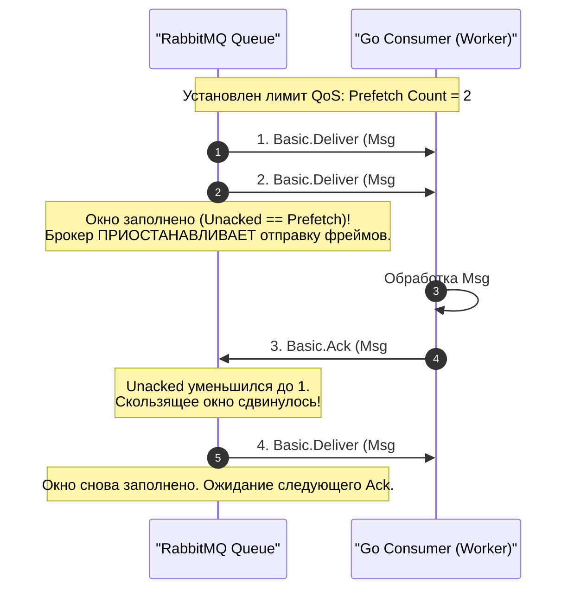
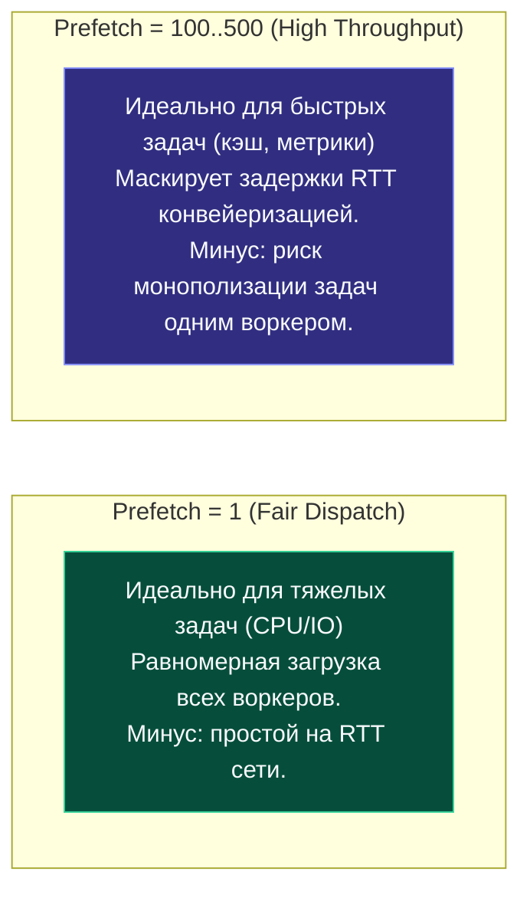

В предыдущей статье [[4. Acknowledgements и delivery guarantees]] мы детально разобрали, как с помощью ручных подтверждений (Manual Ack) исключить потерю сообщений при падениях сервисов. Мы научились забирать полезную нагрузку, выполнять бизнес-транзакции и только потом отправлять брокеру команду `d.Ack(false)`.

Однако здесь кроется фундаментальная ловушка push-архитектуры. Представьте классическую производственную ситуацию: сервис базы данных ночью ушел в рестарт на 30 минут, и в очереди RabbitMQ скопилось $1\,000\,000$ сообщений. Утром вы выкатываете долгожданный фикс и запускаете ваш воркер на Go. Что произойдет в первую же секунду?

---

## Эффект пожарного гидранта (The Firehose Problem)

В большинстве традиционных очередей брокер работает в модели **Push (выталкивание)**. 

По умолчанию, как только приложение вызывает метод `ch.Consume()` без предварительной настройки ограничений, RabbitMQ открывает шлюзы настежь и начинает выгружать сообщения в открытый сокет **на максимальной физической скорости сетевого интерфейса**. Брокер не интересуется, сколько у воркера свободной оперативной памяти и успевает ли он переваривать входящий поток.

```mermaid
flowchart LR
    subgraph Broker ["RabbitMQ Broker"]
        Q["Queue: 1 000 000 сообщений<br>(Durable / Quorum)"]
    end

    subgraph NetworkStack ["Сетевой стек Linux"]
        Socket["TCP Socket<br>(SO_RCVBUF)"]
    end

    subgraph GoApp ["Go Process (Воркер)"]
        direction TB
        Reader["amqp091-go Reader Goroutine"]
        Chan["Go Channel (Buffered msgs)"]
        Heap["Go Heap: миллионы аллокаций amqp.Delivery"]
        OOM["💥 OOM Killer (SIGKILL ядра Linux)"]

        Reader --> Chan
        Chan --> Heap
        Heap --> OOM
    end

    Q ==>|"Турборежим Push: 50 000 msg/s<br>(Без QoS / Firehose)"| Socket
    Socket ==> Reader

    classDef q fill:#1e293b,stroke:#38bdf8,stroke-width:2px,color:#f8fafc;
    classDef net fill:#312e81,stroke:#818cf8,stroke-width:1px,color:#f8fafc;
    classDef app fill:#450a0a,stroke:#f87171,stroke-width:2px,color:#fecaca;

    class Q q;
    class Socket net;
    class Reader,Chan,Heap,OOM app;
```



### Mechanical Sympathy: Как необузданный Push убивает Go-приложение
Посмотрим на этот процесс глазами операционной системы и рантайма Go:
1. Демон RabbitMQ непрерывно генерирует тысячи фреймов `Basic.Deliver` и прокачивает их в TCP-соединение.
2. Сетевой стек ядра Linux на принимающей стороне моментально заполняет буфер приема сокета (`SO_RCVBUF`).
3. Внутренний сетевой опросчик Go (**`netpoll`** на базе `epoll`/`kqueue`) сигнализирует о наличии данных в файловом дескрипторе и немедленно пробуждает системную горутину-читатель драйвера `amqp091-go`.
4. На каждое входящее сообщение драйвер аллоцирует в куче (**Heap**) структуру `amqp.Delivery` и копирует срез байт полезной нагрузки (`payload`).
5. Декодированные структуры помещаются во внутренний буферизованный Go-канал, из которого читает цикл вашего воркера.

Если ваш воркер выполняет тяжелую бизнес-логику (например, сложный запрос в PostgreSQL, занимающий 100 мс, выдавая скромные 10 сообщений в секунду на горутину), а брокер вкачивает $20\,000$ сообщений в секунду, внутренний канал и оперативная память заполняются лавинообразно. 

Сборщик мусора (**GC**) начинает задыхаться, пытаясь отслеживать миллионы живых указателей. Задержки Go-рантайма вырастают до секунд, и операционная система принудительно прибивает процесс через **Out Of Memory (OOM) Killer**. Приложение падает, не успев обработать даже сотни сообщений.

---

## Решение: Prefetch Count (QoS)

Чтобы защитить микросервисы от захлебывания и реализовать фундаментальный паттерн распределенных систем — **обратное давление (Backpressure)**, протокол AMQP 0-9-1 предоставляет механизм **QoS (Quality of Service)**, сердцем которого является параметр **`prefetch_count`**.

**Prefetch Count** — это жесткий лимит на максимальное количество **неподтвержденных (Unacknowledged)** сообщений, которые брокер имеет право одновременно выдать клиенту в рамках сессии. Это классическая реализация механизма **скользящего окна (sliding window)**, аналогичная управлению потоком (Flow Control Window) в протоколе TCP.



Если вы сконфигурировали `prefetch_count = 100`, RabbitMQ отправит консьюмеру ровно 100 сообщений и немедленно остановит передачу по каналу. 

Как только воркер закончит обработку первого сообщения и пришлет `d.Ack(false)`, брокер уменьшит счетчик Unacked до 99 и мгновенно «подтолкнет» в канал 101-е сообщение. Оставшиеся 999 900 сообщений будут в полной безопасности ожидать своей очереди на диске или в оперативной памяти сервера RabbitMQ.

> [!info] Под капотом: Загадка параметра Prefetch Size
> Метод спецификации AMQP `Basic.Qos` принимает параметр `prefetch_size` (лимит объема неподтвержденных данных в окне, выраженный в байтах).
> 
> Однако **RabbitMQ исторически не поддерживает ограничение по объему байт (`prefetch_size`)**! Расчет динамического размера каждого фрейма в памяти кучи Erlang для сотен очередей приводил к неприемлемым накладным расходам на процессор.
> 
> Поэтому в коде на Go мы всегда передаем `prefetch_size = 0` (что означает «без ограничений по размеру в байтах»). Лимитирование происходит только по *количеству* сообщений (`prefetch_count`).

---

## Как выбрать оптимальный размер Prefetch?

Выбор значения `prefetch_count` — это классический инженерный компромисс между тремя параметрами: **Latency** (задержка реакции), **Throughput** (пропускная способность) и **Fairness** (честность и равномерность распределения задач между воркерами).



### Стратегия 1: `Prefetch = 1` (Честное распределение / Fair Dispatch)
* **Сценарий:** Задачи занимают непредсказуемое или длительное время (от нескольких сотен миллисекунд до нескольких минут). Например: генерация сложных PDF-отчетов, транскодирование видео, обработка тяжелых нейросетевых моделей (ML Inference), финансовый клиринг.
* **Преимущества:** Абсолютная честность распределения (**Fair Dispatch**). Быстрый воркер успеет обработать 10 коротких задач, пока медленный пыхтит над одной гигантской. Ни одно сообщение не простаивает попусту в очереди ожидания занятого процесса.
* **Недостатки:** Накладные расходы на сетевую задержку (**Round-Trip Time, RTT**). После каждого отправленного `Ack` воркер вынужден ждать доли миллисекунды, пока брокер получит подтверждение и пришлет по сети следующую задачу.

### Стратегия 2: `Prefetch = 100 - 1000` (Максимальный Throughput)
* **Сценарий:** Задачи выполняются за доли миллисекунд (микропакетные операции, запись в Redis, логирование, агрегация метрик в ClickHouse).
* **Преимущества:** Полное нивелирование сетевой задержки за счет конвейеризации (**Pipelining**). Пока воркер обрабатывает сообщение №1, сообщения с №2 по №100 уже загружены в оперативную память приложения и ждут своей очереди без миллисекундных сетевых задержек.
* **Недостатки:** Опасность монополизации и «голодания» (Starvation) соседних воркеров. Если один воркер заберет себе в локальный буфер 1000 задач и внезапно замедлится (например, из-за долгой паузы GC или сетевого фриза), эти 1000 сообщений окажутся заблокированными для других свободных воркеров кластера.

> [!tip] Собеседование: Голодание новых консьюмеров при prefetch=0
> **Вопрос:** В очереди скопилось 50 000 сообщений. Запущен один воркер с `prefetch = 0` (без ограничений), который медленно их разгребает. Чтобы ускорить обработку, девопс поднимает еще 10 реплик воркера. Однако все новые воркеры простаивают, а очередь не уменьшается быстрее. В чем причина?
> 
> **Ответ:** Первый воркер при подключении без лимита QoS мгновенно «высосал» все 50 000 сообщений в свой локальный буфер сокета и память процесса. На стороне RabbitMQ все эти сообщения перешли в статус **`Unacked`** и жестко привязались к каналу первого воркера. 
> Для брокера очередь физически пуста! Новым воркерам просто нечего отдавать.  
> **Решение:** Всегда настраивать ограниченный `prefetch_count` на всех потребителях с момента запуска сервиса.

---

## Реализация на Go: Тонкости флага `global`

В сетевом драйвере `amqp091-go` метод конфигурирования QoS вызывается на объекте канала:
```go
err := ch.Qos(prefetchCount, prefetchSize, global)
```

Здесь разработчиков часто подстерегает путаница с третьим булевым параметром — **`global`**:
- **`global = false` (по умолчанию):** Лимит `prefetch_count` применяется **к каждому отдельному консьюмеру** (каждому независимому вызову `ch.Consume` на данном канале). Если на одном канале запущено 2 консьюмера с `prefetch = 10`, каждый из них сможет держать до 10 неподтвержденных сообщений (суммарно до 20).
- **`global = true`:** Лимит делится между **всеми консьюмерами суммарно**, открытыми на данном `amqp.Channel`.

Поскольку в идиоматичном коде на Go мы следуем правилу **«1 Channel = 1 Consumer/Worker»** во избежание взаимных блокировок мьютексов (`lock contention`), флаг `global` практически всегда выставляется в `false`.

```go
package main

import (
	"context"
	"log"
	"time"

	amqp "github.com/rabbitmq/amqp091-go"
)

func runWorkerWithQoS(ctx context.Context, conn *amqp.Connection, queueName string) error {
	// 1. Открываем выделенный канал для данного воркера
	ch, err := conn.Channel()
	if err != nil {
		return err
	}
	defer ch.Close()

	// 2. КРИТИЧЕСКИ ВАЖНО: Вызываем Qos ДО вызова Consume!
	// Если вызвать Consume раньше, брокер успеет выплюнуть в сокет пачку сообщений
	// до того, как ограничение вступит в силу.
	err = ch.Qos(
		50,    // prefetch_count: максимум 50 неподтвержденных задач в буфере
		0,     // prefetch_size: всегда 0 в RabbitMQ
		false, // global: лимит привязан к конкретному консьюмеру
	)
	if err != nil {
		return err
	}

	// 3. Запускаем получение потока сообщений
	msgs, err := ch.Consume(
		queueName,
		"worker-orders-eu", // consumer tag
		false,              // autoAck = false (ОБЯЗАТЕЛЬНО при использовании QoS!)
		false,              // exclusive
		false,              // noLocal
		false,              // noWait
		nil,                // args
	)
	if err != nil {
		return err
	}

	log.Println("Воркер запущен с QoS Prefetch = 50. Ожидание задач...")

	for {
		select {
		case <-ctx.Done():
			log.Println("Завершение работы воркера...")
			return nil
		case d, ok := <-msgs:
			if !ok {
				log.Println("AMQP канал закрыт брокером")
				return nil
			}

			// Выполнение полезной работы
			processTask(d.Body)

			// Подтверждение обработки
			if err := d.Ack(false); err != nil {
				log.Printf("Ошибка отправки Ack: %v", err)
			}
		}
	}
}

func processTask(payload []byte) {
	// Эмуляция обработки (20 мс)
	time.Sleep(20 * time.Millisecond)
}
```

> [!warning] Ловушка / Gotcha: QoS полностью игнорируется в связке с Auto-Ack
> Механизм `QoS` опирается на баланс отправленных сообщений и полученных брокером сигналов `Basic.Ack`.
> 
> Если вы вызовете метод `ch.Consume(..., autoAck=true, ...)`, брокер **будет полностью игнорировать любые ранее выставленные параметры Prefetch Count!** Сообщения будут выдаваться в сокет с максимальной скоростью, поскольку в режиме `autoAck: true` брокер удаляет сообщение сразу при отправке и не ведет учет статуса `Unacked`.

---

## Итог

1. **Защита от OOM:** Ни один консьюмер в производственной среде не должен запускаться без явной настройки `ch.Qos()`. По умолчанию RabbitMQ работает как пожарный гидрант, способный мгновенно затопить память Go-приложения.
2. **Золотая середина Prefetch:**
   - Для тяжелых, вариативных по времени задач (секунды/минуты) используйте `prefetch = 1..5` (Fair Dispatch).
   - Для ультрабыстрых операций (инсерты в базу данных, инвалидация кэшей) используйте `prefetch = 50..250` (Pipelining для маскировки RTT сети).
3. **Строгая последовательность инициализации:** Метод `ch.Qos()` всегда вызывается **строго до** метода `ch.Consume()`.
4. **QoS требует Manual Ack:** Ограничение окна сообщений функционирует только при `autoAck: false`.

Теперь мы умеем не только маршрутизировать и сохранять сообщения, но и надежно контролировать объем потока данных в памяти наших сервисов. 

Однако в реальных проектах топологии редко бывают тривиальными: нам часто требуется объединять несколько обменников в цепочки, динамически менять маршруты и разделять потоки по приоритетам. 

В следующей лекции [[6. Routing patterns]] мы детально разберем ключевые паттерны маршрутизации в RabbitMQ: Publish/Subscribe, Work Queues, RPC и Exchange-to-Exchange Bindings.