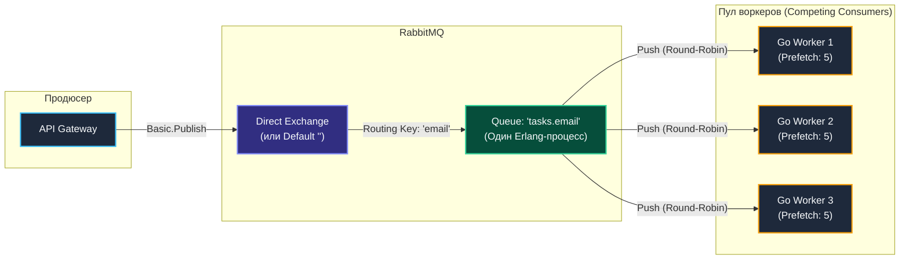
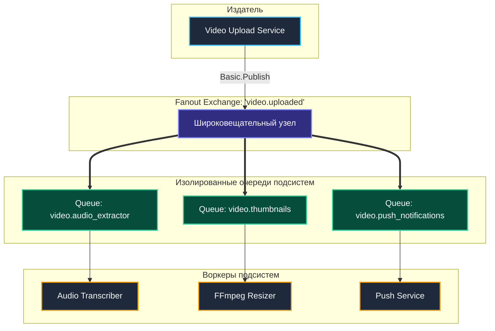
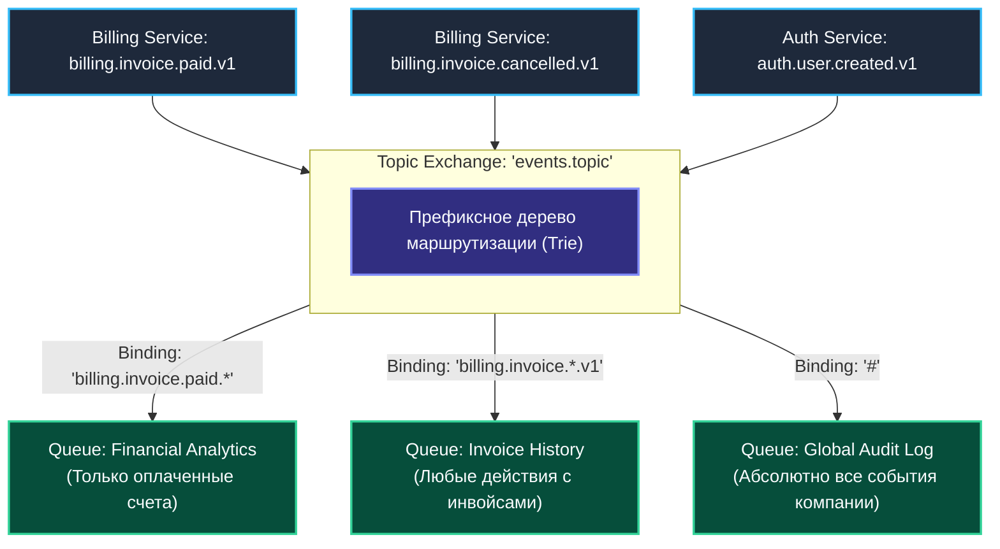
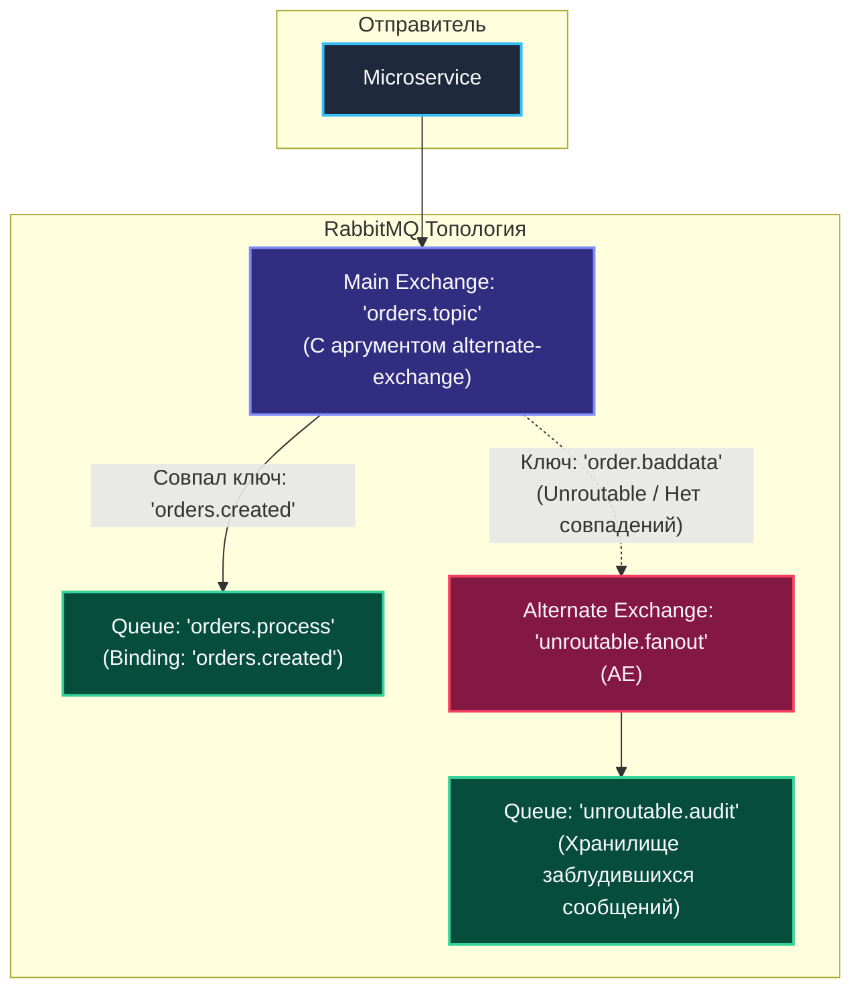
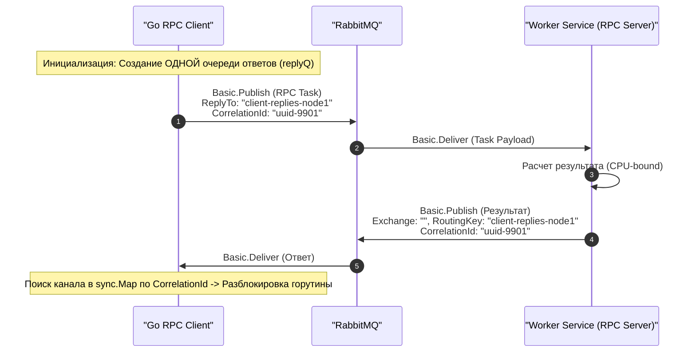

В статье [[2. Exchanges. Direct, Fanout, Topic, Headers]] мы подробно исследовали базовые механизмы маршрутизации AMQP 0-9-1 и увидели, как обменники направляют трафик на основе `Routing Key`. В лекции [[5. Prefetch и QoS]] мы настроили безопасное потребление сообщений, защитив сервисы на Go от исчерпания оперативной памяти и аварийного завершения по OOM.

Теперь настало время объединить эти фундаментальные блоки в целостную систему. В реальной промышленной разработке изолированные очереди и простые обменники используются редко. Архитекторы объединяют их в специализированные **Топологии (Topologies)** или **Паттерны маршрутизации (Routing Patterns)**, каждый из которых решает конкретную инженерную задачу распределенного взаимодействия.

---

## 1. Work Queues (Competing Consumers / Конкурирующие воркеры)

Это базовый и наиболее распространенный шаблон асинхронной обработки задач. 

**Архитектурная задача:** У вас есть единый интенсивный поток ресурсоемких фоновых задач (например, конвертация видео, генерация PDF-отчетов или отправка email-рассылок), и вы хотите горизонтально масштабировать их выполнение между $N$ независимыми экземплярами сервиса на Go.



### Механика работы и Mechanical Sympathy
Брокер распределяет сообщения между всеми активными подписчиками по алгоритму **Round-Robin** (циклический опрос). Однако этот опрос интеллектуален: он жестко координируется параметром `prefetch_count`. Если у `Worker 1` локальный буфер неподтвержденных сообщений заполнен, планировщик RabbitMQ пропускает его и передает очередную задачу свободному `Worker 2`.

> [!warning] Ловушка / Gotcha: Безвозвратная потеря порядка (Ordering)
> В паттерне Competing Consumers **гарантия строгого хронологического порядка обработки сообщений полностью теряется**.
> 
> Представьте сценарий:
> 1. В очередь поступают два зависимых события: сначала `UserCreated` (Msg 1), затем `UserUpdated` (Msg 2).
> 2. Брокер отдает Msg 1 воркеру №1, а Msg 2 — воркеру №2.
> 3. Воркер №1 испытывает задержку на аллокации памяти или засыпает на паузе GC. В это время воркер №2 моментально сохраняет изменения `UserUpdated` в базу данных.
> 4. В базе возникает ошибка консистентности: профиль обновился до того, как был создан!
>
> *Инженерный вывод:* Если вашей бизнес-логике требуется гарантированный порядок (Strict Ordering), паттерн Competing Consumers «в лоб» применять категорически запрещено. Вам потребуется шардирование потоков с маршрутизацией сообщений одного пользователя в выделенную под-очередь (например, с помощью плагина `rabbitmq-consistent-hash-exchange` либо перехода на партиции Apache Kafka).

---

## 2. Publish / Subscribe (Широковещательный веер / Fanout)

**Архитектурная задача:** Одно доменное событие должно быть гарантированно доставлено сразу нескольким несвязанным между собой подсистемам (Broadcast).

*Классический пример:* Пользователь загрузил новое видео в сервис.
- Подсистема №1 должна извлечь аудиодорожку для транскрибации.
- Подсистема №2 должна нарезать серию превью-кадров (Thumbnails).
- Подсистема №3 должна разослать push-уведомления подписчикам канала.



> [!info] Под капотом: Zero-Copy Delivery в куче Erlang
> Инженеры, привыкшие к языкам без разделяемой иммутабельной памяти, часто задаются вопросом: *«Если я публикую видеометаданные объемом 1 МБ в Fanout-обменник, к которому подключено 10 очередей, израсходует ли брокер 10 МБ оперативной памяти?»*
> 
> **Ответ: Нет.** Виртуальная машина BEAM использует архитектуру **Zero-Copy Delivery** для больших бинарных данных:
> - Бинарный срез полезной нагрузки аллоцируется в общей куче процесса BEAM ровно один раз.
> - В независимые процессы очередей передаются только легковесные **ссылки (указатели со счетчиком ссылок)**. 
> - Накладные расходы памяти для 10 очередей составят лишь несколько сотен байт метаданных.

---

## 3. Content-Based Routing (Иерархическое дерево топиков)

**Архитектурная задача:** Создание гибкой шины доменных событий (Event-Driven Architecture), где микросервисы динамически подписываются только на строго интересующие их срезы данных без изменения кода продюсеров.

### Конвенция именования ключей маршрутизации
Промышленным стандартом для Topic Exchange является сегментированная структура ключа через точку:  
`<domain>.<entity>.<action>.<version>`  
Например: `billing.invoice.paid.v1` или `auth.user.login_failed.v2`.



### Накладные расходы на вычисление маршрута
Таблица правил привязок для Topic Exchange компилируется в памяти брокера в префиксное дерево (**Trie**). 
- Обход дерева выполняется для каждого входящего фрейма. 
- Чрезмерно длинные ключи (более 5–6 уровней вложенности) и обилие спецсимволов `#` кратно увеличивают расход тактов CPU.
- *Рекомендация:* Держите глубину топиков в пределах 3–4 уровней.

---

## 4. Wire Tap (Неинвазивный аудит) и Alternate Exchange

В распределенных системах регулярно возникает потребность в «прослушке» или аудиторском логировании сообщений, которые по ошибке не смогли найти своего адресата (Unroutable Messages). 

По умолчанию RabbitMQ молча удаляет сообщения, для которых в Exchange не нашлось ни одного совпадающего биндинга. Для предотвращения потерь данных протокол AMQP 0-9-1 предлагает изящный паттерн — **Alternate Exchange (AE)**.



### Конфигурация Alternate Exchange на Go:
```go
// Декларация основного обменника со ссылкой на Alternate Exchange
args := amqp.Table{
    "alternate-exchange": "audit.fanout", // Куда перенаправлять нераспределяемые сообщения
}
err := ch.ExchangeDeclare(
    "main.topic", // name
    "topic",      // kind
    true,         // durable
    false,        // auto-delete
    false,        // internal
    false,        // no-wait
    args,         // параметры
)
```

> [!tip] Собеседование: Alternate Exchange vs Dead Letter Exchange (DLX)
> **Вопрос:** В чем принципиальная разница между Alternate Exchange (AE) и Dead Letter Exchange (DLX)?
> **Ответ:** 
> 1. **Alternate Exchange (AE)** срабатывает на этапе **маршрутизации** внутри Exchange, когда входящее сообщение не подошло ни под один `Binding Key` и еще ни разу не попало ни в одну очередь.
> 2. **Dead Letter Exchange (DLX)** срабатывает **внутри самой очереди**, когда сообщение уже находилось в буфере, но было отвергнуто консьюмером (`Basic.Nack` с `requeue=false`), протухло по таймеру `x-message-ttl` или было вытеснено из-за лимита длины очереди `x-max-length`.

---

## 5. Request-Reply (Синхронный RPC через RabbitMQ)

Иногда асинхронный брокер используется для синхронного по своей семантике вызова (Remote Procedure Call). Например: фронтенд-шлюз на Go отправляет запрос на тяжелый математический расчет в Python-воркер и блокируется до получения результата.



### Архитектурная ловушка новичков (The Ephemeral Queue Trap)
Создавать новую эксклюзивную очередь (`Exclusive Queue`) на *каждый входящий HTTP-запрос* — **фатальная архитектурная ошибка**. 
Создание очереди в кластере RabbitMQ — это тяжелая распределенная транзакция в метабазе Mnesia с синхронизацией по сети. При нагрузке в 200–300 RPS брокер захлебнется от постоянного создания и удаления очередей в ядре Erlang.

### Правильный паттерн: Пул каналов и мультиплексирование через `sync.Map`
Инстанс клиента создает **ровно одну очередь ответов на весь сервис**. Внутренние горутины регистрируют свои каналы ожидания через `sync.Map` и `channels` по ключу `CorrelationId`.

### Идиоматичный Go-код промышленного RPC-клиента:

```go
package rpc

import (
	"context"
	"fmt"
	"sync"
	"time"

	"github.com/google/uuid"
	amqp "github.com/rabbitmq/amqp091-go"
)

// RPCClient реализует потокобезопасный мультиплексированный клиент RPC
type RPCClient struct {
	ch       *amqp.Channel
	replyQ   string
	requests sync.Map // map[string]chan []byte (CorrelationId -> Go-канал)
}

// NewRPCClient инициализирует долгоживущую очередь для ответов и фоновый слушатель
func NewRPCClient(ch *amqp.Channel) (*RPCClient, error) {
	// 1. Создаем ОДНУ очередь для ВСЕХ ответов данного инстанса приложения
	q, err := ch.QueueDeclare(
		"",    // Имя сгенерирует брокер (например, amq.gen-Xa81...)
		false, // durable: очередь временная
		true,  // auto-delete: удалить при отключении сервиса
		true,  // exclusive: доступна только этому соединению
		false, // no-wait
		nil,
	)
	if err != nil {
		return nil, fmt.Errorf("queue declare error: %w", err)
	}

	client := &RPCClient{
		ch:     ch,
		replyQ: q.Name,
	}

	// 2. Запускаем фоновый consumer для прослушивания ответов
	msgs, err := ch.Consume(
		q.Name,
		"",    // consumer-tag
		true,  // autoAck: для временных RPC ответов допустим autoAck
		false, // exclusive
		false, // noLocal
		false, // noWait
		nil,
	)
	if err != nil {
		return nil, fmt.Errorf("consume error: %w", err)
	}

	go client.listenForReplies(msgs)

	return client, nil
}

// listenForReplies непрерывно читает поток ответов и пробуждает горутины
func (c *RPCClient) listenForReplies(msgs <-chan amqp.Delivery) {
	for d := range msgs {
		if chWaitAny, ok := c.requests.LoadAndDelete(d.CorrelationId); ok {
			chWait := chWaitAny.(chan []byte)
			chWait <- d.Body // Будим горутину, заблокированную в Call()
			close(chWait)
		}
	}
}

// Call отправляет RPC-запрос и синхронно ожидает ответ с учетом контекста
func (c *RPCClient) Call(ctx context.Context, targetQueue string, payload []byte) ([]byte, error) {
	corrID := uuid.NewString()
	waitCh := make(chan []byte, 1) // Буферизованный канал во избежание блокировки слушателя

	// Регистрируем ожидание по CorrelationId
	c.requests.Store(corrID, waitCh)
	defer c.requests.Delete(corrID) // Защита от утечек памяти при таймауте

	// Публикуем задачу
	err := c.ch.PublishWithContext(ctx,
		"",          // exchange (прямая отправка через default exchange)
		targetQueue, // routing key (имя очереди сервера)
		false,
		false,
		amqp.Publishing{
			ContentType:   "application/json",
			CorrelationId: corrID,   // Уникальный идентификатор запроса
			ReplyTo:       c.replyQ, // Куда сервер обязан прислать ответ
			Body:          payload,
			Timestamp:     time.Now().UTC(),
		},
	)
	if err != nil {
		return nil, fmt.Errorf("rpc publish failed: %w", err)
	}

	// Ожидаем ответ либо срабатывание таймаута контекста
	select {
	case <-ctx.Done():
		return nil, ctx.Err()
	case res := <-waitCh:
		return res, nil
	}
}
```

---

## Итог

1. **Work Queues (Competing Consumers):** Оптимальны для параллельного распределения задач между воркерами. Помните: хронологический порядок обработки сообщений при этом не сохраняется.
2. **Publish / Subscribe (Fanout):** Идеален для рассылки широковещательных событий нескольким сервисам. Работает с околонулевым оверхедом по памяти благодаря Zero-Copy в BEAM.
3. **Content-Based Routing (Topic):** Базовый каркас для событийно-ориентированных микросервисов. Проектируйте структуру топиков не глубже 3–4 уровней.
4. **Wire Tap & Alternate Exchange:** Защищают систему от невидимой потери сообщений на этапе маршрутизации при опечатках в ключах или сбоях конфигурации.
5. **AMQP RPC:** Требует строгой дисциплины. Никогда не создавайте очереди на каждый HTTP-запрос — используйте одну общую очередь ответов на процесс и мультиплексирование через `CorrelationId`.

Мы научились собирать гибкие топологии и отлавливать потерянные сообщения на этапе публикации. Но что делать с теми сообщениями, которые успешно дошли до очереди, но были отвергнуты воркером из-за некорректных данных или исчерпания лимита ретраев? 

В следующей статье [[7. Dead letter exchanges]] мы глубоко исследуем спасительный механизм **Dead Letter Exchange (DLX)** и разберем архитектуру очередей брака.