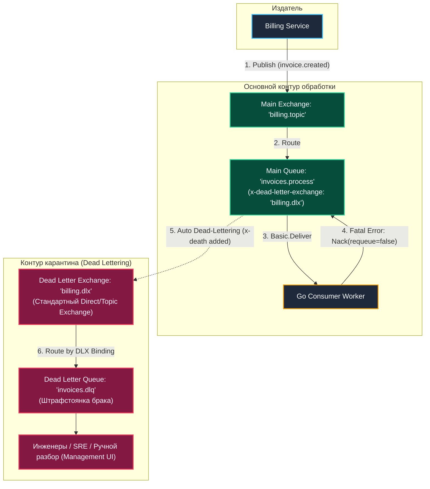
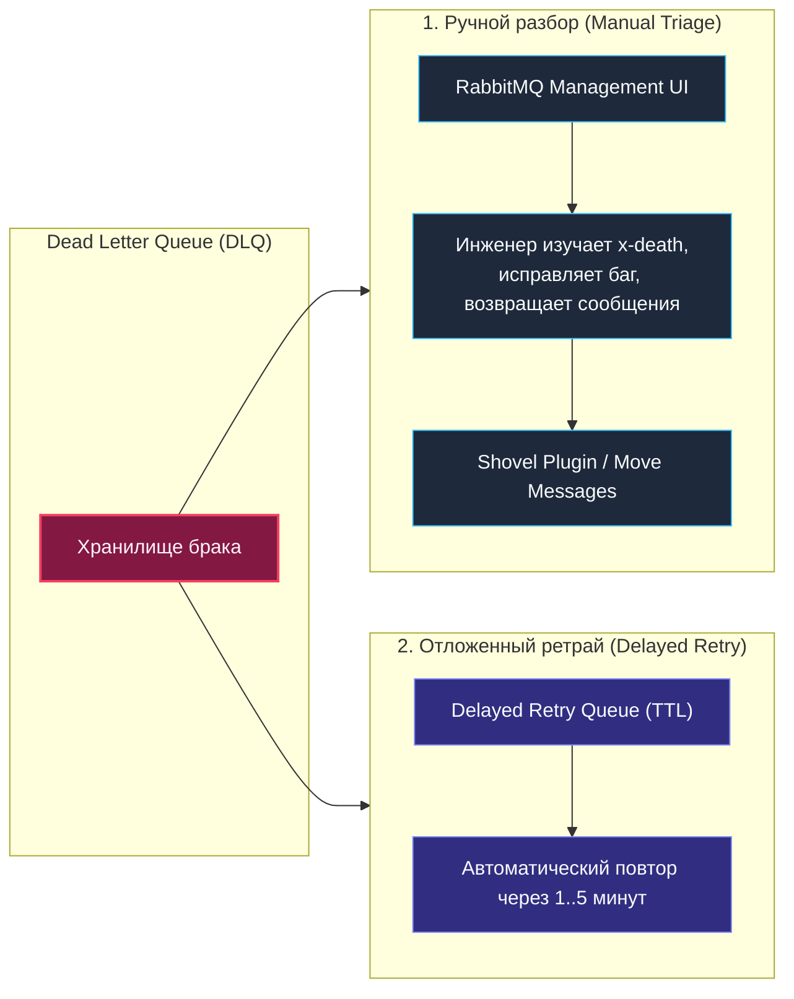

В предыдущей лекции [[6. Routing patterns]] мы научились выстраивать сложные распределенные топологии и перехватывать «заблудившиеся» сообщения на этапе маршрутизации с помощью Alternate Exchange. 

Однако что происходит, если сообщение благополучно дошло до очереди, было извлечено воркером на Go, но в процессе исполнения бизнес-логики произошел сбой? Например, партнерский API вернул критическую ошибку 400 (Bad Request), схема JSON не соответствует контракту, или база данных отклонила запись из-за нарушения внешнего ключа.

Если в ответ на ошибку воркер сделает `Nack(requeue=true)`, система попадет в катастрофический **Poison Message Loop** (бесконечный цикл повторов), который сожжет 100% ресурсов процессора. Если сделать `Nack(requeue=false)`, сообщение исчезнет навсегда без следа. Для надежных enterprise-систем оба варианта фатальны. 

Нам требуется безопасная штрафстоянка («карантин») для бракованных данных. В экосистеме RabbitMQ этот фундаментальный механизм называется **Dead Letter Exchange (DLX)**.

---

## Что такое DLX?

Вопреки распространенному заблуждению среди начинающих инженеров, **Dead Letter Exchange (Обменник мертвых писем)** — это **не** какой-то специфический закрытый тип обменника. Это абсолютно стандартный Exchange (Direct, Topic, Fanout или Headers), которому в архитектуре системы делегирована служебная роль: *принимать сообщения, отвергнутые очередями*.

Любая очередь в RabbitMQ может быть сконфигурирована аргументом `x-dead-letter-exchange`. При наступлении условий «смерти» процесс очереди автоматически перенаправляет проблемное сообщение в этот обменник.



---

## 3 причины «смерти» сообщения

RabbitMQ не отправляет сообщения в DLX произвольно. Процесс очереди выполняет Dead-Lettering строго при наступлении одного из трех предопределенных системных событий:

1. **Rejected / Nacked:** Воркер на стороне приложения явно отклонил сообщение через `Basic.Reject` или `Basic.Nack` с обязательным указанием флага **`requeue = false`**.
2. **TTL Expired:** У сообщения истекло отведенное время жизни (Time-To-Live). Срок жизни может быть задан как на уровне всей очереди (`x-message-ttl`), так и индивидуально паблишером в свойствах сообщения (`Expiration`).
3. **Queue Length Limit:** Очередь достигла лимита длины или размера (`x-max-length` или `x-max-length-bytes`), а политика переполнения настроена на `drop-head` (поведение по умолчанию). Старейшие сообщения, вытесняемые из головы очереди новыми поступлениями, не уничтожаются, а выталкиваются в DLX.

> [!info] Под капотом: Очередь в роли внутреннего публикатора
> В модели процессов Erlang/OTP, когда наступает одно из трех условий смерти, **Erlang-процесс самой очереди (Main Queue) берет на себя роль внутреннего отправителя (Producer)**.
> 
> Процесс очереди извлекает сообщение из своего внутреннего буфера, обогащает его служебным массивом заголовков `x-death` и вызывает внутреннюю функцию маршрутизации в целевой DLX. Все это происходит локально в оперативной памяти брокера за доли микросекунды, не создавая дополнительного сетевого трафика.

---

## Маршрутизация «мертвецов» (Routing Keys)

При пересылке сообщения в Dead Letter Exchange процесс очереди по умолчанию **сохраняет оригинальный Routing Key**, с которым сообщение было изначально опубликовано в систему.

*Пример:*
1. Издатель опубликовал заказ с ключом `order.created`.
2. Сообщение попало в рабочую очередь `orders_queue`.
3. Воркер сделал `d.Nack(false, false)`.
4. Очередь направляет сообщение в обменник `orders_dlx` с неизменным ключом `order.created`.

### Переопределение ключа: `x-dead-letter-routing-key`
Однако в крупных архитектурах часто требуется собирать брак из десятка различных очередей в единую общую штрафстоянку `global_dlq` через один `global_dlx`. Если ключи маршрутизации у всех очередей разные, настроить биндинги к общему DLX становится неудобно.

Для решения этой проблемы при создании очереди можно указать аргумент **`x-dead-letter-routing-key`**. Если этот параметр задан, процесс очереди сотрет оригинальный `Routing Key` и подставит вместо него указанную строку перед отправкой в DLX (например, `dead.processing`).

---

## Заголовок `x-death`: Анатомия трагедии

Когда брокер выполняет Dead-Lettering, он не просто перекладывает байты — он прикрепляет к сообщению подробнейший «протокол вскрытия». В словаре пользовательских заголовков (`Headers`) появляется служебный массив **`x-death`**.

Каждый элемент этого массива представляет собой ассоциативный массив со следующими полями:
- **`reason`:** Конкретная причина смерти. Принимает одно из трех значений:
  - `rejected` — сообщение было отклонено через `Nack`/`Reject` с `requeue=false`.
  - `expired` — истек срок жизни сообщения (`x-message-ttl`).
  - `maxlen` — сообщение вытеснено из-за переполнения очереди (`x-max-length`).
- **`queue`:** Точное имя очереди, в которой зафиксирована гибель сообщения.
- **`time`:** Временная метка инцидента (Timestamp).
- **`exchange`:** Имя обменника, из которого сообщение изначально прибыло в очередь.
- **`routing-keys`:** Массив оригинальных ключей маршрутизации.
- **`count`:** Счетчик смертей. Если сообщение в рамках каскадных ретраев погибает в одной и той же очереди несколько раз, RabbitMQ не раздувает массив `x-death`, а инкрементирует этот счетчик.

> [!warning] Ловушка / Gotcha: Нагрузка на CPU и двойной Raft I/O
> В высоконагруженных системах при массовых сбоях (например, авария кластера PostgreSQL, когда все 50 воркеров начинают делать `Nack` со скоростью тысяч операций в секунду) механизм DLX создает дополнительную нагрузку:
> 1. Erlang тратит ощутимое количество тактов CPU на динамическую аллокацию и сериализацию структур `x-death`.
> 2. В случае современных **Quorum Queues** перекладывание сообщения в DLQ порождает **двойную нагрузку на диск и Raft-консенсус**: брокер сначала коммитит операцию удаления через Raft-лог основной очереди, а затем коммитит операцию вставки в Raft-лог очереди `DLQ`. 
> Защищайте систему от шторма ошибок на уровне воркеров с помощью локального троттлинга!

---

## Реализация инфраструктуры на Go

Ниже приведен эталонный пример создания надежного контура обработки на Go: объявляются основной обменник, целевая Quorum-очередь со связкой с DLX и выделенная очередь брака (`DLQ`).

```go
package main

import (
	"fmt"
	"log"

	amqp "github.com/rabbitmq/amqp091-go"
)

// DeclareQueueWithDLX создает полный контур обработки с Dead Letter
func DeclareQueueWithDLX(ch *amqp.Channel) error {
	const (
		mainExchange = "events.topic"
		mainQueue    = "processing_queue"
		dlxExchange  = "events.dlx"
		dlqQueue     = "processing_dlq"
		dlxRouteKey  = "dead.processing"
	)

	// 1. Декларируем Dead Letter Exchange (обычный Direct Exchange)
	err := ch.ExchangeDeclare(
		dlxExchange,
		amqp.ExchangeDirect,
		true,  // durable
		false, // auto-delete
		false, // internal
		false, // no-wait
		nil,   // args
	)
	if err != nil {
		return fmt.Errorf("declare DLX: %w", err)
	}

	// 2. Декларируем DLQ (Dead Letter Queue) для складирования брака
	_, err = ch.QueueDeclare(
		dlqQueue,
		true,  // durable
		false, // auto-delete
		false, // exclusive
		false, // no-wait
		amqp.Table{
			"x-queue-type": "quorum", // В проде всегда используем Quorum
		},
	)
	if err != nil {
		return fmt.Errorf("declare DLQ: %w", err)
	}

	// 3. Биндим DLQ к DLX с переопределенным ключом маршрутизации
	err = ch.QueueBind(
		dlqQueue,
		dlxRouteKey,
		dlxExchange,
		false,
		nil,
	)
	if err != nil {
		return fmt.Errorf("bind DLQ: %w", err)
	}

	// 4. Подготавливаем аргументы для основной рабочей очереди
	mainArgs := amqp.Table{
		"x-queue-type":              "quorum",    // Quorum Queue
		"x-dead-letter-exchange":    dlxExchange, // Назначаем DLX
		"x-dead-letter-routing-key": dlxRouteKey, // Подменяем Routing Key
		"x-max-length":              int32(50000),// Защита от переполнения
	}

	// 5. Декларируем основную очередь
	q, err := ch.QueueDeclare(
		mainQueue,
		true,  // durable (обязательно true для quorum)
		false, // auto-delete
		false, // exclusive
		false, // no-wait
		mainArgs,
	)
	if err != nil {
		return fmt.Errorf("declare main queue: %w", err)
	}

	// 6. Биндим основную очередь к ее топик-обменнику
	err = ch.QueueBind(
		q.Name,
		"event.created",
		mainExchange,
		false,
		nil,
	)
	if err != nil {
		return fmt.Errorf("bind main queue: %w", err)
	}

	log.Println("Контур обработки с DLX успешно сконфигурирован!")
	return nil
}
```

> [!tip] Собеседование: Забытый Dead Letter Exchange
> **Вопрос:** Что произойдет в RabbitMQ, если воркер вызовет `Nack(requeue=false)`, но при декларации очереди аргумент `x-dead-letter-exchange` не был указан?
> **Ответ:** Сообщение будет **безвозвратно удалено (drop)** из памяти и диска брокера. Брокер расценит действие так, будто консьюмер осознанно приказал уничтожить данные. Никаких ошибок в сетевом канале или предупреждений в журнале RabbitMQ не появится. Настройка DLX — это исключительная зона ответственности инженера.

---

## Как правильно обрабатывать DLQ?

Создать очередь `processing_dlq` — лишь половина задачи. Что с ней делать дальше в реальной эксплуатации? Существует две основные стратегии:



1. **Ручной разбор (Manual Triage):**  
   К очереди DLQ **не должен быть подключен постоянный автоматический консьюмер**. Сообщения копятся там как в карантине. На DLQ настраивается алерт в Prometheus/Alertmanager. Дежурный инженер открывает Management UI, изучает заголовки `x-death` и тело сообщения, выкатывает хотфикс в код сервиса и с помощью встроенной функции **Move messages** (плагин Shovel) безопасно переливает накопившиеся сообщения обратно в основную очередь на повторную обработку.
2. **Отложенный автоматический ретрай (Delayed Retry):**  
   Если ошибка носит временный характер (сетевой таймаут к внешней платежной системе), сообщение отправляется не на ручной разбор, а в цепочку отложенных очередей с нарастающим TTL.

---

## Итог

1. **DLX — гарантия от потери данных:** Всегда используйте `Nack(requeue=false)` в связке с DLX вместо опасного `Nack(requeue=true)`, порождающего циклы отравленных сообщений.
2. **DLX — это стандартный Exchange:** Любой обменник может выполнять функции DLX. Маршрутизация в него выполняется процессом очереди в Erlang.
3. **Аудит через `x-death`:** Заголовок `x-death` содержит подробную историю инцидентов (`reason`, `queue`, `time`, `count`), позволяя точно расследовать причины сбоя.
4. **Не допускайте заброшенных DLQ:** Очередь брака без мониторинга — скрытая утечка диска. Всегда настраивайте алерты на глубину DLQ.

Мы разобрались, как изолировать бракованные сообщения. Но как быть, если сбой носит временный характер и мы хотим автоматически повторить попытку через 5 секунд, затем через 30 секунд, а затем через 5 минут? 

В следующей лекции [[8. Retry patterns в RabbitMQ]] мы подробно разберем построение распределенного экспоненциального ретрая с помощью комбинации TTL, очередей задержки и DLX.