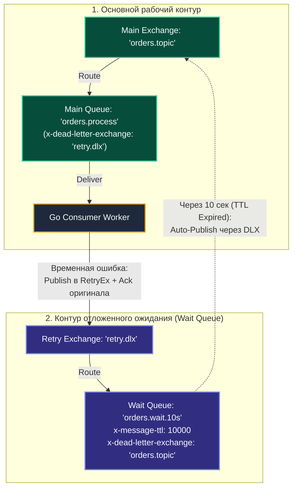

В предыдущей статье [[7. Dead letter exchanges]] мы выяснили, как безопасно «парковать» сообщения, обработка которых завершилась критической ошибкой. Мы защитили систему от главной угрозы асинхронного транспорта — **Poison Message Loop**, когда наивный вызов `Nack(requeue=true)` заставляет воркер бесконечно переваривать битые данные, сжигая 100% ресурсов CPU.

Однако в распределенных архитектурах подавляющее большинство сбоев носит **транзитный (временный)** характер:
- Кратковременная сетевая деградация между подом на Go и базой данных;
- Внешний платежный шлюз ответил `HTTP 429 Too Many Requests` или `HTTP 503 Service Unavailable`;
- В PostgreSQL возник транзакционный взаимоблокировочный конфликт (Deadlock), и транзакция была принудительно прервана ядром СУБД.

В таких сценариях выбрасывать сообщение в корзину недопустимо — его необходимо обработать повторно, но **с выверенной паузой (Backoff)**, дав сбоящей системе время восстановиться. В этой лекции мы разберем архитектуру и реализацию **Retry Patterns (Паттернов повторных попыток)** в RabbitMQ.

---

## 1. Наивный подход: Sleep в горутине (Опасный антипаттерн)

Самая распространенная ошибка начинающего разработчика при встрече с ошибками внешних сервисов — поставить `time.Sleep` прямо в рабочей горутине перед повторным выполнением запроса или перед вызовом `Nack(requeue=true)`.

```go
// ❌ АНТИПАТТЕРН: Блокировка воркера через time.Sleep
if err != nil {
    time.Sleep(10 * time.Second) // "Дадим базе отдохнуть..."
    _ = d.Nack(false, true)
    return
}
```

### Mechanical Sympathy: Почему это убивает систему?
Вспомним лекцию [[5. Prefetch и QoS]]. Сетевой канал воркера жестко ограничен параметром `prefetch_count` (например, 50). 

Если пул ваших горутин столкнулся с серией `HTTP 429` от стороннего шлюза, все 50 горутин одновременно уснут в `time.Sleep(10 * time.Second)`.
1. **Катастрофический Head-of-line blocking:** На целых 10 секунд весь сервис **полностью перестает вычитывать сообщения из очереди**. Легковесные, валидные сообщения, не требующие обращения к внешнему шлюзу, окажутся намертво заблокированными за уснувшими задачами.
2. **Иллюзия планировщика:** Хотя функция `time.Sleep` в Go не блокирует поток операционной системы (сущность `M` в рантайме `G-M-P`, а лишь переводит горутину `G` в режим ожидания таймера), с точки зрения брокера RabbitMQ вы удерживаете структуру `amqp.Delivery` в памяти и не возвращаете `Ack`.
3. Сообщения зависают в брокере в статусе `Unacked`, раздувая потребление RAM и создавая риск аварийного срабатывания Flow Control.

> [!IMPORTANT]
> **Золотое правило асинхронного воркера:**  
> Потребитель обязан завершить работу с сообщением и вернуть результат брокеру (`Ack` или `Nack`) **максимально быстро**. Никаких искусственных пауз внутри цикла обработки! Любая задержка (Delay) обязана реализовываться **на стороне инфраструктуры брокера**.

---

## 2. Паттерн: TTL + DLX (Очереди ожидания / Wait Queues)

Это классический, нативный и самый надежный паттерн отложенной повторной обработки в чистом RabbitMQ, не требующий установки сторонних плагинов. Он строится на комбинации двух базовых возможностей брокера: **Time-To-Live (TTL)** и **Dead Letter Exchange (DLX)**.



### Механика работы Wait Queue:
1. При сбое воркер не блокируется. Он публикует копию сообщения в обменник ожидания `retry.dlx`, инкрементируя счетчик попыток в заголовках.
2. Воркер немедленно отправляет `d.Ack(false)` на оригинальное сообщение, полностью освобождая свой слот в окне `prefetch_count`.
3. Сообщение попадает в очередь ожидания `orders.wait.10s`. К этой очереди **не подключен ни один консьюмер**.
4. Сообщение спокойно лежит в буфере очереди 10 секунд.
5. По истечении 10 секунд срабатывает таймер `x-message-ttl`. Процесс очереди RabbitMQ перенаправляет протухшее сообщение через свой `x-dead-letter-exchange` обратно в рабочий обменник `orders.topic`!
6. Сообщение снова оказывается в основной очереди и попадает к свободному воркеру на повторную обработку.

---

### Подводный камень: Head-of-Line Blocking на уровне TTL сообщений

В протоколе AMQP 0-9-1 время жизни можно задать двумя способами:
1. На всю очередь целиком через аргумент `x-message-ttl`.
2. Индивидуально для каждого отдельного сообщения через свойство `Expiration` при вызове `ch.Publish(...)`.

Казалось бы: почему бы не использовать одну общую очередь ожидания и выставлять индивидуальный заголовок `Expiration` равным $5\text{ с}$, $25\text{ с}$, $125\text{ с}$? 

> [!warning] Ловушка / Gotcha: Head-of-Line (HoL) Blocking при индивидуальном TTL
> Внутренний процесс очереди Erlang не выполняет фоновое сканирование всего массива сообщений на предмет истечения таймеров — для очередей в сотни тысяч элементов обход $O(N)$ уничтожил бы процессор.
> 
> Вместо этого RabbitMQ проверяет истечение срока жизни **строго у первого сообщения в голове очереди (Head of Queue)**!
> 
> *Что это означает на практике?*  
> Если в очередь ожидания сначала попало сообщение Msg 1 с таймером `TTL = 1 час`, а следом за ним прилетело сообщение Msg 2 с таймером `TTL = 1 секунда`, **Msg 2 НЕ выйдет из очереди через 1 секунду!** Оно будет намертво заблокировано за Msg 1 и выйдет только через 60 минут, когда Msg 1 наконец умрет. Это классический **Head-of-Line (HoL) Blocking**.

### Архитектурное решение: Многоуровневые очереди задержки
Чтобы обойти блокировку головы очереди, для построения экспоненциальной задержки (Exponential Backoff) создают **серию очередей с фиксированным TTL**:
- `wait_q_5s` (параметр очереди `x-message-ttl = 5000`)
- `wait_q_30s` (параметр очереди `x-message-ttl = 30000`)
- `wait_q_5m` (параметр очереди `x-message-ttl = 300000`)

Воркер на основе текущего номера попытки направляет сообщение в соответствующую очередь задержки. Поскольку внутри каждой очереди все сообщения имеют строго одинаковый TTL, эффект HoL-blocking полностью исключен: сообщения выходят строго в порядке поступления (FIFO).

---

## 3. Паттерн: Delayed Message Plugin (`rabbitmq-delayed-message-exchange`)

Если создание нескольких служебных очередей ожидания кажется вам избыточным, сообщество RabbitMQ разработало официальный плагин — `rabbitmq-delayed-message-exchange`.

Плагин вводит специализированный тип обменника: **`x-delayed-message`**. 


### Механика работы:
1. Вы публикуете сообщение в Delayed Exchange, указывая в словаре заголовков параметр `x-delay: 5000` (время задержки в миллисекундах, например 5 секунд).
2. Обменник «замораживает» сообщение у себя и удерживает его до истечения таймера.
3. По истечении времени обменник вычисляет маршрут и перекладывает сообщение в целевую очередь.

> [!info] Под капотом: Mnesia и пределы масштабирования плагина
> В отличие от стандартных очередей, сохраняющих буферы в специализированных бинарных сегментах диска, Delayed Exchange складывает отложенные сообщения во внутреннюю распределенную СУБД брокера — **Mnesia**.
> 
> Для каждого сообщения создается отдельный таймер Erlang.
> 
> **Жесткое архитектурное ограничение:**  
> Этот плагин **категорически не предназначен для сценариев с миллионами одновременно отложенных сообщений**! При попытке удерживать сотни тысяч таймеров база Mnesia начинает потреблять гигантские объемы памяти и дисквалифицирует кластер по I/O. 
> Плагин идеален для десятков тысяч сообщений с небольшим временем ожидания (от нескольких секунд до нескольких часов).

---

## Реализация Exponential Backoff на Go

Ниже приведен эталонный пример реализации функции повторной обработки с нарастающей задержкой (Exponential Backoff), использованием кастомного заголовка `x-retry-count` и безопасным сбросом в постоянную DLQ при превышении лимита попыток.

> [!tip] Собеседование: Почему x-retry-count лучше, чем массив x-death?
> **Вопрос:** Почему при реализации прикладных ретраев рекомендуется использовать кастомный заголовок `x-retry-count`, а не встроенный в RabbitMQ массив `x-death`?
> 
> **Ответ:** 
> 1. Если мы самостоятельно переопубликовываем сообщение в Delayed Exchange или в очередь ожидания, брокер **не генерирует заголовок `x-death`** (он формируется только при нативном срабатывании механизма DLX).
> 2. Парсинг структуры `x-death` из `amqp.Table` в Go требует разбора вложенных срезов, маппинга интерфейсов и рефлексии. Это порождает паразитные аллокации памяти в куче. Простой целочисленный заголовок `int32` извлекается мгновенно за $O(1)$ без накладных расходов.

```go
package main

import (
	"context"
	"fmt"
	"log"
	"math"
	"time"

	amqp "github.com/rabbitmq/amqp091-go"
)

const MaxRetries = 3

// processWithRetry читает из очереди и управляет логикой ретраев
func processWithRetry(ctx context.Context, ch *amqp.Channel, d amqp.Delivery) {
	// 1. Пытаемся выполнить бизнес-логику
	err := doBusinessLogic(d.Body)
	if err == nil {
		// Успех: мгновенно подтверждаем обработку
		_ = d.Ack(false)
		return
	}

	// 2. Обработка провалилась. Извлекаем счетчик попыток из заголовков.
	var retryCount int32 = 0
	if d.Headers != nil {
		if val, ok := d.Headers["x-retry-count"]; ok {
			if count, ok := val.(int32); ok {
				retryCount = count
			}
		}
	}

	// 3. Проверяем достижение лимита попыток
	if retryCount >= MaxRetries {
		log.Printf("Сообщение окончательно провалило %d попыток. Отправка в постоянный DLQ.", retryCount)
		// Nack с requeue=false отправит сообщение в Dead Letter Exchange очереди
		_ = d.Nack(false, false)
		return
	}

	// 4. Вычисляем экспоненциальную задержку: 5s, 25s, 125s
	retryCount++
	// Формула: 5^retryCount секунд
	delaySeconds := math.Pow(5, float64(retryCount))
	delayMs := int64(delaySeconds) * 1000

	log.Printf("Попытка %d не удалась. Откладываем сообщение на %v сек...", retryCount, delaySeconds)

	// 5. Клонируем заголовки и обновляем счетчик
	headers := make(amqp.Table)
	for k, v := range d.Headers {
		headers[k] = v
	}
	headers["x-retry-count"] = retryCount
	headers["x-delay"] = delayMs // Параметр для Delayed Message Plugin

	// 6. Публикуем копию сообщения в отложенный обменник
	pubCtx, cancel := context.WithTimeout(ctx, 5*time.Second)
	defer cancel()

	err = ch.PublishWithContext(pubCtx,
		"my_delayed_exchange", // имя delayed обменника
		d.RoutingKey,          // сохраняем исходный ключ маршрутизации
		false,
		false,
		amqp.Publishing{
			Headers:      headers,
			Body:         d.Body,
			DeliveryMode: amqp.Persistent, // Сохраняем надежность
			ContentType:  d.ContentType,
			Timestamp:    time.Now().UTC(),
		},
	)

	if err != nil {
		log.Printf("Критическая ошибка публикации повтора: %v. Отправляем в DLQ.", err)
		_ = d.Nack(false, false)
		return
	}

	// 7. КРИТИЧЕСКИ ВАЖНО: Подтверждаем исходное сообщение!
	// Мы создали его клона в будущем, поэтому оригинал должен освободить буфер.
	_ = d.Ack(false)
}

func doBusinessLogic(payload []byte) error {
	// Эмуляция временного сбоя внешнего сервиса
	return fmt.Errorf("external payment gateway timeout (503)")
}
```

### Разбор кода:
1. **Асинхронность и освобождение буфера:** Мы не спим в горутине. Мы мгновенно подтверждаем обработку оригинального сообщения через `d.Ack(false)`, полностью освобождая слот в скользящем окне `prefetch_count` для новых входящих задач.
2. **Публикация клона:** Мы вручную публикуем новое сообщение в отложенный обменник с полезной нагрузкой оригинала. С точки зрения RabbitMQ — это новое сообщение, которое материализуется в целевой очереди строго после истечения задержки.
3. **Защита от бесконечного цикла:** Ограничение `MaxRetries` гарантирует, что фатальные ошибки не останутся в системе навечно, а будут направлены в постоянную очередь брака `DLQ`.

---

## Итог

1. **Запрет `time.Sleep`:** Никогда не усыпляйте горутины-воркеры. Это исчерпывает окно QoS `prefetch_count` и блокирует продвижение независимых задач в очереди.
2. **Wait Queues (TTL + DLX):** Самый отказоустойчивый нативный подход. Для исключения эффекта **Head-of-Line Blocking** используйте отдельные очереди под каждый интервал задержки (`5s`, `30s`, `5m`).
3. **Delayed Message Plugin:** Удобный механизм для плавной динамической задержки (`x-delay`). Помните о лимитах масштабирования: не перегружайте внутреннюю СУБД Mnesia сотнями тысяч одновременных таймеров.
4. **Обязательный Ack оригинала:** При публикации повторной задачи в очередь задержки не забывайте вызывать `Ack(false)` на оригинальное сообщение, освобождая буфер памяти приложения.

Мы обеспечили устойчивость на уровне программной логики: сообщения фильтруются, безопасно потребляются, откладываются при сбоях и паркуются в карантин. 

Но что произойдет, если аппаратный сервер, на котором запущен RabbitMQ, физически сгорит или потеряет питание? 

В следующей статье [[9. Cluster и HA в RabbitMQ]] мы перейдем на уровень инфраструктуры и разберем архитектуру кластеризации, сетевые расщепления (Split-Brain) и консенсус Raft в Quorum-очередях.