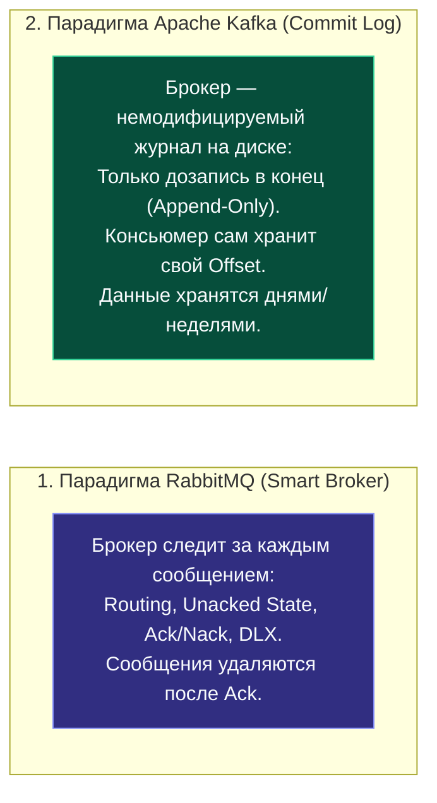
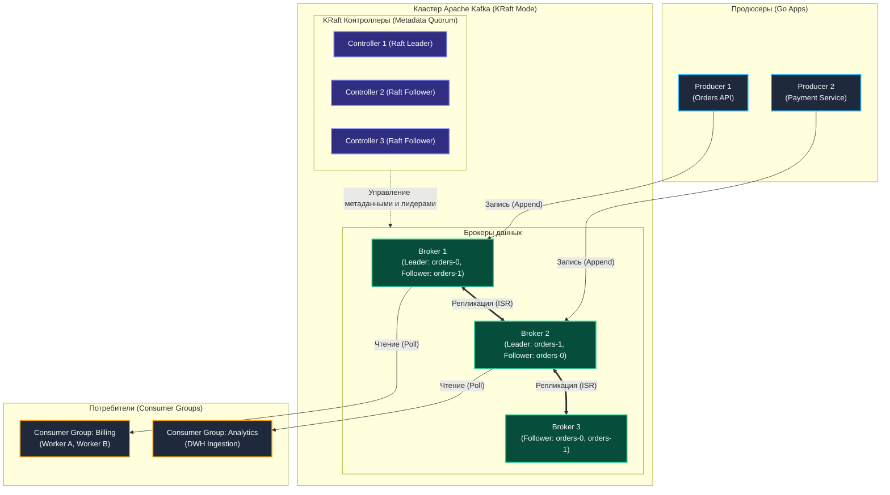
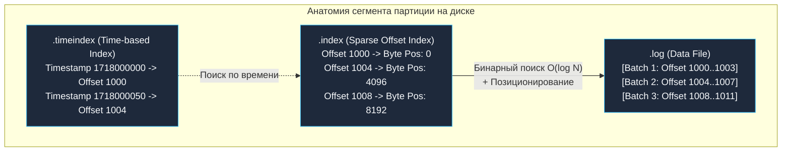
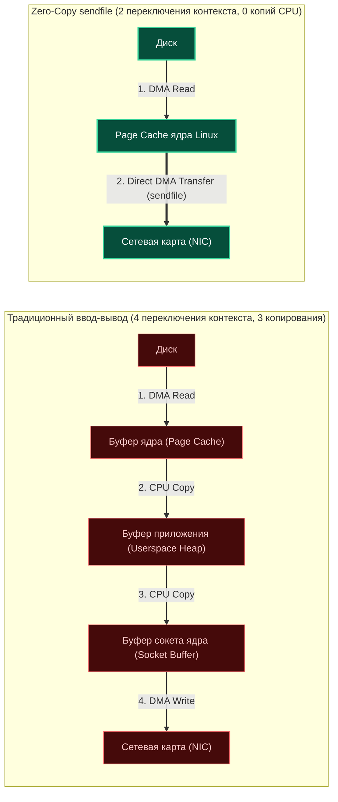
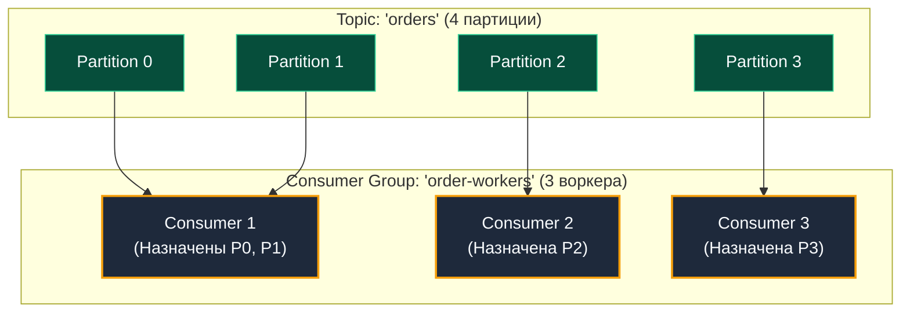

> [!NOTE]
> **Связи:** Данная статья открывает подраздел Kafka и опирается на фундамент, заложенный в [[1. Обзор раздела. Асинхронность как основа масштабирования]], [[3. Очереди сообщений. Зачем они нужны]] и [[4. Модели доставки. At most once, at least once, exactly once]].

## Введение: Kafka как распределённый commit log

Apache Kafka — это распределённая, горизонтально масштабируемая, устойчивая к сбоям система для публикации и подписки на потоки данных, которая в корне отличается от классических брокеров сообщений вроде [[1. RabbitMQ. Архитектура и концепции]]. 

Если RabbitMQ строился вокруг модели «умного брокера» с динамической маршрутизацией, сложными биндингами и подтверждениями на уровне каждого отдельного сообщения, то создатели Kafka в LinkedIn пошли по диаметрально противоположному пути: **«Умный продюсер и умный консьюмер при максимально простом («глупом»), но феноменально быстром брокере»**, реализующем модель распределённого **append-only commit-лога**.



Чтобы понять внутреннюю природу Kafka, нужно мысленно отбросить концепцию традиционной «очереди» и взглянуть на систему как на распределённый, секционированный журнал транзакций, аналогичный **Write-Ahead Log (WAL)** в реляционных базах данных. 

Все сообщения, отправляемые продюсерами, дописываются строго в конец этого журнала и никогда не модифицируются. Консьюмеры вычитывают записи последовательно, самостоятельно отслеживая своё текущее положение (**offset**). 

Это снимает с брокера колоссальную вычислительную нагрузку по поддержанию таблиц доставки: брокеру не нужно помнить, кто именно прочитал сообщение, а кто отстал — он просто отдаёт поток байт по запрошенному смещению.

---

## Философия log-based системы

Фундаментальным строительным кирпичом архитектуры Kafka является **Partition (партиция)** — логический, упорядоченный, неизменяемый журнал (лог) сообщений. Топик (категория потока данных) представляет собой именованную группу партиций, распределённых по брокерам кластера.

- **Топик (Topic):** Логическая абстракция, объединяющая сообщения с общей предметной семантикой (например, `orders`, `user-events`, `payment-transactions`).
- **Партиция (Partition):** Физический журнал (набор упорядоченных файлов-сегментов на файловой системе брокера), в который строго последовательно дописываются входящие сообщения. Каждая партиция абсолютно упорядочена внутри себя.
- **Offset (Смещение):** Монотонно возрастающее 64-битное целое число, служащее уникальным порядковым номером сообщения строго в рамках конкретной партиции. Консьюмеры используют offset как закладку в книге, чтобы возобновить чтение ровно с того места, где остановились.

Такая модель восходит к классическим принципам LSM-деревьев (Log-Structured Merge-tree) и WAL-журналов СУБД. Преимущество log-based архитектуры — в бескомпромиссной производительности последовательного дискового ввода-вывода (Sequential I/O), отсутствии накладных расходов на случайную индексацию b-деревьев и идеальной согласованности с механизмами кэширования операционной системы.

---

## Архитектура высокого уровня

Кластер Kafka состоит из нескольких ключевых компонентов, взаимодействующих по бинарному протоколу поверх TCP:



### Ключевые участники кластера:
1. **Продюсер (Producer):** Клиентское приложение, публикующее события в топик. Продюсер самостоятельно вычисляет целевую партицию (по хэшу ключа сообщения, через round-robin или кастомный партиционер).
2. **Брокер (Broker):** Экземпляр серверного процесса Kafka, отвечающий за прием записей, их запись в сегменты на диск, репликацию и отдачу консьюмерам.
3. **Консьюмер (Consumer):** Клиентское приложение, последовательно вычитывающее сообщения из закрепленных за ним партиций.
4. **Контроллер (Controller):** Специализированный узел кластера, управляющий глобальным состоянием: назначением лидеров партиций, фиксацией состава реплик и мониторингом живости брокеров.

> [!info] Под капотом: Эпоха KRaft вместо ZooKeeper
> Исторически (до версии 3.5) координацию метаданных в Kafka обеспечивал внешний распределенный сервис **ZooKeeper**. Это порождало дублирование слоев, усложняло администрирование и замедляло восстановление кластера при масштабных сбоях.
> 
> Современные инсталляции Kafka полностью перешли на архитектуру **KRaft (Kafka Raft Metadata mode, KIP-500)**. Метаданные теперь хранятся в специальном внутреннем топике `@metadata` и реплицируются выделенным кворумом контроллеров по протоколу консенсуса Raft, концептуально идентичному [[14. Алгоритмы консенсуса. Raft]]. Это обеспечивает мгновенные выборы лидеров (миллисекунды вместо минут) и поддержку миллионов партиций в одном кластере.

---

## Модель хранения под капотом

Партиция на файловой системе — это не бесконечный гигантский файл (файловые системы операционных систем плохо справляются с файлами терабайтного объема). Партиция физически делится на **сегменты (segments)** — файлы фиксированного размера (по умолчанию 1 ГБ или 7 дней накопления).

Каждый сегмент на диске состоит из тройки файлов:
- **`.log`:** Файл данных, содержащий непосредственно бинарные фреймы сообщений, упакованные в пакеты (RecordBatches).
- **`.index`:** Разреженный позиционный индекс (Sparse Offset Index), связывающий логический `offset` с физическим смещением в байтах внутри `.log`-файла.
- **`.timeindex`:** Разреженный временной индекс, сопоставляющий timestamp сообщения с его логическим `offset`.

```bash
# Физическая раскладка партиции на накопителе
/var/lib/kafka/data/orders-0/
├── 00000000000000000000.log
├── 00000000000000000000.index
├── 00000000000000000000.timeindex
├── 00000000000000012345.log
├── 00000000000000012345.index
└── 00000000000000012345.timeindex
```



При поступлении запроса на вычитывание брокер выполняет быстрый бинарный поиск по индексному файлу в оперативной памяти, мгновенно находит физическое смещение в `.log` файле и последовательно считывает данные. 

Старые неактивные сегменты удаляются или уплотняются согласно политикам **Retention** (по времени `retention.ms` или размеру `retention.bytes`) и **Compaction** (уплотнение по ключу), что подробно рассматривается в статье [[8. Retention и compaction]].

---

## Mechanical Sympathy: почему это безумно быстро

Как Kafka удается прокачивать миллионы событий в секунду через обычные дисковые накопители? Ответ кроется в глубоком механическом сочувствии к архитектуре операционной системы и кремния.

Современные дисковые контроллеры и накопители (как традиционные HDD, так и современные NVMe SSD) оптимизированы под **последовательный ввод-вывод (Sequential I/O)**. Линейная запись на диск сопоставима по скорости с оперативной памятью, поскольку контроллер накопителя задействует аппаратную конвейеризацию, упреждающее чтение (read-ahead) и пакетную запись без случайных скачков головок или перемещений блоков. Kafka принципиально исключает случайный I/O: запись всегда идет строго в конец активного файла.



> [!info] Под капотом: Симбиоз Page Cache и системного вызова sendfile()
> 1. **Page Cache вместо JVM Heap:**  
>    Kafka намеренно не кэширует сообщения внутри кучи своего процесса (JVM heap). Вместо этого брокер всецело полагается на **Page Cache ядра Linux**.  
>    - Если процесс брокера упадет и перезапустится, кэш страниц операционной системы останется «горячим».
>    - В куче JVM нет миллионов мелких объектов — сборщик мусора (GC) свободен от пауз «Stop-the-World».
>    - Память автоматически утилизируется ядром Linux под кэш диска и мгновенно освобождается при необходимости.
> 2. **Zero-Copy (Системный вызов `sendfile`):**  
>    При передаче сообщений консьюмерам брокер вызывает системный вызов ядра Linux `sendfile()`.  
>    Вместо дорогостоящего маршрута: `Диск -> Page Cache -> Userspace буфер Kafka -> Сокет ядра -> Буфер сетевой карты (NIC)`, системный вызов `sendfile` копирует данные **напрямую из Page Cache в сетевой интерфейс** с помощью контроллера прямого доступа к памяти (**DMA**). Процессор хоста вообще не тратит такты на перекладывание байт в userspace.

---

## Распределённая модель: лидеры, фолловеры и ISR

Каждая отдельная партиция в Kafka имеет фиксированный фактор репликации (**Replication Factor**, например 3). Из пула брокеров-реплик ровно один узел назначается **Лидером (Leader)**.

- **Лидер партиции:** Принимает 100% операций записи от продюсеров и (по умолчанию) обслуживает все операции чтения консьюмеров.
- **Последователи (Followers):** Выступают в роли обычных консьюмеров: они непрерывно отправляют запросы `Fetch` лидеру и дописывают полученные пачки в свои локальные журналы.

### In-Sync Replicas (ISR)
Чтобы гарантировать сохранность данных при внезапном падении лидера, Kafka вводит динамическое понятие **In-Sync Replicas (ISR)** — список реплик, которые не отстают от лидера дольше настроенного порога (`replica.lag.time.max.ms`, по умолчанию 30 секунд).

Продюсер при отправке сообщения определяет требуемый уровень надежности с помощью флага **`acks`**:
- **`acks=0` (Fire-and-Forget):** Продюсер не ждет ответа от брокера. Максимальная пропускная способность, но риск потери данных при малейшем сетевом сбое.
- **`acks=1` (Компромисс):** Продюсер ждет подтверждения только от лидера партиции. Сообщение надежно записано лидером, но может быть утеряно, если лидер упадет до того, как фолловеры успели его зареплицировать.
- **`acks=all` (или `-1`, Золотой стандарт):** Продюсер получает подтверждение только после того, как запись зафиксировали **все реплики, входящие в текущий список ISR** (с учетом параметра `min.insync.replicas`).

> [!tip] Собеседование: Выборы лидера и unclean.leader.election.enable
> **Вопрос:** Что произойдет, если лидер партиции внезапно выйдет из строя, а все оставшиеся живые узлы отстали и выпали из списка ISR?
> 
> **Ответ:** Поведение определяется системной конфигурацией `unclean.leader.election.enable`:
> 1. Если `unclean.leader.election.enable = false` (рекомендуется для строгой консистентности): брокер откажется выбирать нового лидера из числа несинхронизированных реплик. Партиция станет временно недоступной для чтения и записи, пока узел из ISR не оживет. Это выбор **Consistency (C)** в теореме CAP.
> 2. Если `unclean.leader.election.enable = true`: брокер назначит лидером любую выжившую реплику. Партиция останется доступной, но все сообщения, которые не успели зареплицироваться на этот узел, **будут безвозвратно потеряны**, а смещения (offsets) в логе разойдутся.

---

## Консьюмеры и Consumer Groups

В отличие от классических очередей (RabbitMQ), где брокер удаляет сообщение сразу после получения `Ack`, Kafka сохраняет сообщения на протяжении всего настроенного периода хранения (Retention Period). 

Это дает фундаментальную архитектурную свободу:
1. Вы можете в любой момент сдвинуть свой `offset` назад во времени и заново перечитать историю за последнюю неделю для повторного расчета аналитики или исправления бага в коде.
2. Десятки независимых сервисов могут параллельно читать один и тот же поток событий со своей собственной индивидуальной скоростью, не мешая друг другу.



**Consumer Group (Группа потребителей)** — это объединение нескольких процессов-консьюмеров для параллельной совместной обработки топика.
- Каждая отдельная партиция внутри группы назначается **строго одному консьюмеру**.
- Один консьюмер может обслуживать несколько партиций одновременно (как `Consumer 1` на схеме выше).
- При падении воркера или добавлении нового узла брокер запускает процедуру **перебалансировки (rebalance)**, перераспределяя партиции между живыми членами группы.

> [!warning] Ловушка / Gotcha: Предел масштабирования Consumer Group
> Количество активных воркеров внутри одной Consumer Group **не может превышать общее количество партиций в топике**.
> 
> Если в вашем топике 4 партиции, а вы развернете в Kubernetes 10 реплик микросервиса в одной группе, ровно 4 пода будут обрабатывать данные, а оставшиеся 6 будут абсолютно бесполезно простаивать, не получая ни единого сообщения.  
> **Инженерный закон:** Степень горизонтального параллелизма в Kafka жестко ограничена числом партиций!

---

## Топология хранения и обработки в Go

В экосистеме Go исторически существовало три основных библиотеки для работы с Kafka:

1. **`Shopify/sarama`:** Старейшая библиотека на чистом Go. Широко распространена, но страдает от исторического наследия: высокого объема аллокаций памяти, неоптимального использования каналов и сложности настройки под капотом.
2. **`confluent-kafka-go`:** Официальный клиент от Confluent. Представляет собой обертку над нативной C-библиотекой `librdkafka`. Обеспечивает высокую скорость, но требует включения CGO, что кратно замедляет сборку, усложняет кросс-компиляцию и делает бинарники зависимыми от версий `glibc` в Docker-контейнерах.
3. **`franz-go` (`github.com/twmb/franz-go`):** Современный индустриальный стандарт де-факто для Go. Написан на 100% чистом Go без CGO, специально спроектирован с учетом механики планировщика Go, пулов памяти `sync.Pool` и обеспечивает производительность, сопоставимую с `librdkafka`.

### Production-Ready пример консьюмера на Go (`franz-go`)

Ниже приведен эталонный пример реализации консьюмера на `franz-go` с ручным управлением смещениями (Manual Commit) и graceful shutdown:

```go
package main

import (
	"context"
	"fmt"
	"log"
	"os/signal"
	"syscall"
	"time"

	"github.com/twmb/franz-go/pkg/kgo"
)

func main() {
	// Перехват системных сигналов завершения процесса для Graceful Shutdown
	ctx, stop := signal.NotifyContext(context.Background(), syscall.SIGINT, syscall.SIGTERM)
	defer stop()

	// Инициализация современного чистого Go-клиента
	cl, err := kgo.NewClient(
		kgo.SeedBrokers("localhost:9092"),
		kgo.ConsumerGroup("order-processors"),
		kgo.ConsumeTopics("orders"),
		kgo.DisableAutoCommit(), // Ручной коммит для предотвращения потери данных
	)
	if err != nil {
		log.Fatalf("Ошибка инициализации Kafka-клиента: %v", err)
	}
	defer cl.Close()

	log.Println("Консьюмер успешно запущен. Ожидание пакетов сообщений...")

	for {
		// Опрос брокера на получение пачки записей с учетом контекста
		fetches := cl.PollFetches(ctx)
		if fetches.IsClientClosed() {
			log.Println("Клиент закрыт, завершение цикла.")
			break
		}

		// Проверка ошибок выборки
		if errs := fetches.Errors(); len(errs) > 0 {
			log.Printf("Ошибки при получении сообщений: %v", errs)
			continue
		}

		// Итерируемся по партициям и сообщениям
		fetches.EachPartition(func(ftp kgo.FetchTopicPartition) {
			for _, record := range ftp.Records {
				processRecord(record)
			}

			// Коммитим смещения строго ПОСЛЕ успешной обработки пачки
			commitCtx, cancel := context.WithTimeout(context.Background(), 3*time.Second)
			if err := cl.CommitUncommittedOffsets(commitCtx); err != nil {
				log.Printf("Сбой фиксации offset для партиции %d: %v", ftp.Partition, err)
			}
			cancel()
		})
	}
}

func processRecord(record *kgo.Record) {
	fmt.Printf("Обработано сообщение: topic=%s partition=%d offset=%d key=%s value=%s\n",
		record.Topic, record.Partition, record.Offset, string(record.Key), string(record.Value))
}
```

---

## Kafka vs традиционные очереди: смена парадигмы

| Архитектурный аспект | RabbitMQ / Традиционные брокеры | Apache Kafka |
|---|---|---|
| **Модель хранения** | Кольцевой буфер (сообщение стирается после `Ack`) | Распределенный немодифицируемый журнал (Commit Log) |
| **Управление состоянием** | Брокер хранит статус каждого сообщения (`Unacked`) | Консьюмер сам управляет своим указателем (`Offset`) |
| **Гарантия порядка** | В рамках очереди (теряется при пуле воркеров) | Строгий порядок внутри конкретной партиции |
| **Масштабирование чтения** | Подключение новых конкурирующих воркеров | Шардирование топика на партиции внутри Consumer Group |
| **Throughput** | Десятки тысяч сообщений/сек | Миллионы сообщений/сек (Zero-Copy + Sequential IO) |
| **Перечитывание истории** | Невозможно (данные уничтожены) | Встроено: чтение с любого `offset` или по времени |

> [!tip] Собеседование: Можно ли сделать Work Queue на Kafka?
> **Вопрос:** Можно ли с помощью Kafka реализовать классическую очередь задач (Work Queue), как в RabbitMQ?
> 
> **Ответ:** Да, но с жесткими ограничениями:
> 1. Если топик имеет 1 партицию, воркеры в Consumer Group не смогут работать параллельно (активен будет только один).
> 2. Если топик разбит на $N$ партиций, параллелизм возможен, но сообщения распределяются статически по партициям. Если одна задача в партиции зависнет на 10 минут, все последующие задачи в этой же партиции будут заблокированы (Head-of-Line blocking), в то время как другие воркеры могут простаивать. 
> Для независимых тяжелых задач с переменным временем выполнения классический RabbitMQ подходит лучше.

---

## Заключение и дальнейшие шаги

Архитектура распределенного коммит-лога, лежащая в основе Apache Kafka — это осознанный инженерный выбор. Мы сознательно отказываемся от сложной серверной маршрутизации и умного отслеживания отдельных сообщений, получая взамен колоссальную пропускную способность, горизонтальную масштабируемость и возможность использовать лог как неизменяемый источник истины (Single Source of Truth).

Такая парадигма идеально ложится на событийно-ориентированные системы ([[3. Event Driven Architecture]]), паттерн Event Sourcing ([[4. Event sourcing и брокеры]]) и распределенные аналитические конвейеры.

В следующей лекции [[2. Topics, partitions и offsets]] мы детально исследуем математику и геометрию партиционирования, разберем анатомию оффсетов и научимся проектировать ключи шардирования для продакшена.