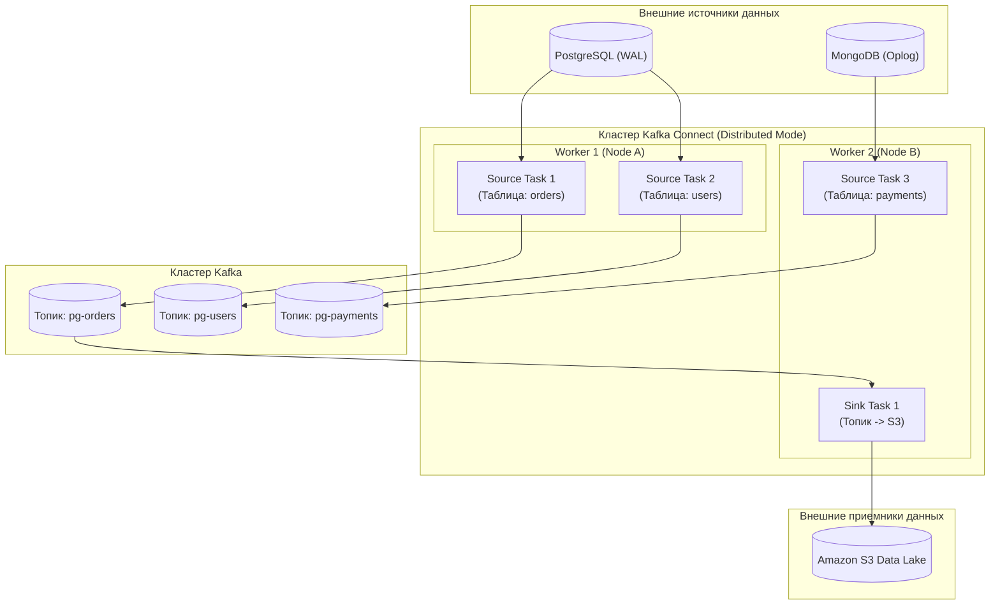
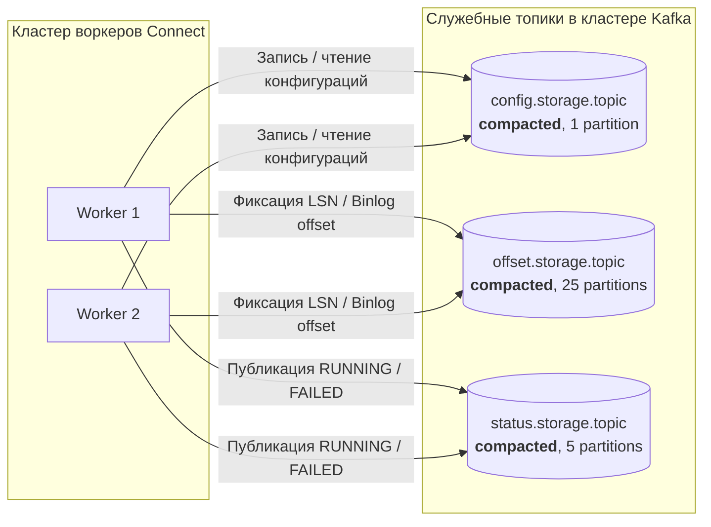
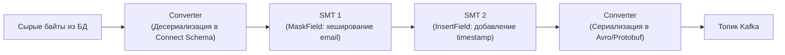

# 10. Kafka Connect: интеграционная шина, CDC и масштабируемый конвейер данных

> *"The purpose of software engineering is to control complexity, not to create it. Reuse standard plumbing whenever you can."*  
> — Брайан Керниган

> [!NOTE]
> **Связи:** Эта статья завершает основной цикл статей о компонентах экосистемы Kafka. Мы опираемся на фундамент [[1. Kafka. Архитектура и модель log based системы]], [[3. Producer и consumer]], [[7. Kafka storage под капотом]] и [[8. Retention и compaction]], и подводим к следующим темам: [[11. Schema Registry и эволюция схем]] и [[12. Производительность Kafka]].

---

## Введение: интеграционная шина, а не просто топики

В реальной корпоративной архитектуре Apache Kafka почти никогда не существует изолированно. Данные непрерывно рождаются и потребляются во внешних системах: в реляционных базах (PostgreSQL, MySQL, Oracle), NoSQL-хранилищах (MongoDB, Cassandra), аналитических озерах данных (Amazon S3, ClickHouse, Apache Iceberg) и поисковых индексах (Elasticsearch, OpenSearch).

Исторически разработчики пытались решить проблему интеграции самым очевидным способом: писали самодельные микросервисы-адаптеры (custom consumers и producers). Очень скоро это приводило к архитектурному кошмару:
- Десятки разнородных сервисов на разных языках, каждый из которых по-своему реализует парсинг, батчинг, ретраи при сетевых сбоях и коммит смещений;
- Постоянные утечки памяти и race conditions при сбоях внешних баз;
- Отсутствие единого стандарта мониторинга, метрик и версионирования схем.

**Kafka Connect** — это открытый стандартизированный фреймворк (поставляемый как неотъемлемая часть Apache Kafka), предназначенный для масштабируемой и отказоустойчивой интеграции Kafka с внешними системами **без написания единой строчки прикладного кода**.

Аналогия из физического мира: до появления стандартизированных интермодальных контейнеров в 1956 году портовые грузчики вручную перетаскивали бочки, мешки и ящики разного размера с телег на палубу кораблей (штучный груз). Контейнеризация стандартизировала перемещение: подъемному крану все равно, что лежит внутри контейнера — компьютеры или бананы. Kafka Connect делает ровно то же самое для байтов данных: абстракции `SourceRecord` и `SinkRecord` стандартизируют стык между любым источником и брокером.

Для Go-разработчика Kafka Connect важен в двух ипостасях: как надежный фундамент для захвата изменений из БД (CDC / Debezium) и как управляемый через REST API компонент, жизненным циклом которого можно управлять прямо из инфраструктурного кода на Go.

---

## Архитектура: Workers, Connectors, Tasks

Архитектурная модель Kafka Connect строится на четком разделении обязанностей между тремя сущностями:

- **Worker (Воркер):** Физический процесс операционной системы (JVM-процесс), исполняемый на сервере или в контейнере Kubernetes. Воркер предоставляет вычислительные ресурсы (потоки CPU, память, сетевой ввод-вывод) и REST API управления. Бывает в двух режимах: `standalone` (один процесс, для локальной разработки и тестирования) и `distributed` (кластер воркеров, для продакшена). Воркеры объединяются в кластер и автоматически распределяют нагрузку.
- **Connector (Коннектор):** Логическая декларативная сущность, определяющая бизнес-правила интеграции: *откуда* брать данные, *куда* их передавать, с какими учетными данными подключаться и как нарезать работу на параллельные порции. Различают:
  - **Source Connector:** Вытягивает данные из внешней системы (например, читает журнал транзакций PostgreSQL) и публикует события в топики Kafka.
  - **Sink Connector:** Вычитывает сообщения из топиков Kafka и записывает их во внешнюю систему (например, вставляет документы в Elasticsearch или сбрасывает Parquet-файлы в S3).
- **Task (Задача):** Физическая единица параллельного выполнения. Коннектор сам не перемещает данные: он разбивает объем работы на $N$ независимых задач `Task`. Каждая задача запускается в отдельном потоке внутри пула воркеров и отвечает за конкретный срез данных (например, отдельную партицию топика или отдельную таблицу базы данных).



### Почему разделение на Connector и Task?

Разделение на Connector и Task — это классическое разделение уровня управления (Control Plane) и уровня передачи данных (Data Plane):
1. **Connector (Control Plane):** Оценивает фронт работ. Например, `PostgresSourceConnector` опрашивает каталог базы данных, находит 20 таблиц, подлежащих репликации, и решает: «Я создам 4 параллельные задачи `Task`, назначив каждой по 5 таблиц».
2. **Task (Data Plane):** Занимается исключительно высокопроизводительным вводом-выводом, не отвлекаясь на перераспределение задач. Если падает один из воркеров, кластер перемещает конкретную `Task` на оставшийся живой воркер без перезапуска всей конфигурации коннектора.

---

## Под капотом: хранение конфигураций, смещений и статусов

Где распределенный кластер Kafka Connect хранит свои метаданные?  
Архитекторы Connect приняли гениальное решение: **хранить всё состояние в самой же Kafka!** Кластеру Connect не требуется внешняя реляционная база данных, ZooKeeper или etcd. Все метаданные живут в трех служебных системных топиках:

- **`config.storage.topic`:** Хранит конфигурации всех запущенных коннекторов и их задач в формате JSON. Топик имеет ровно **1 партицию** (для гарантии строгого глобального порядка применения конфигураций) и использует политику уплотнения лога `cleanup.policy=compact` ([[8. Retention и compaction]]).
- **`offset.storage.topic`:** Хранит смещения внешних источников для Source-коннекторов (например, Log Sequence Number в PostgreSQL или позицию бинарного лога binlog в MySQL). Это ключевой элемент гарантии отказоустойчивости: при перезапуске задачи Source Task читает свое последнее смещение из этого топика и возобновляет чтение без пропуска и без дублирования. Топик компактифицируется и разделен на множество партиций (по умолчанию 25).
- **`status.storage.topic`:** Хранит актуальные статусы коннекторов и их задач (`RUNNING`, `PAUSED`, `FAILED`). Используется для отдачи информации в REST API и мониторинга здоровья. Топик настраивается с политикой `cleanup.policy=compact` или retention по времени.



### Механическая симпатия: почему Connect не изобретает велосипед

Хранение состояния в топиках — не просто "удобно". Это означает, что координация worker'ов, восстановление после сбоев и распределение задач реализуются через стандартные механизмы Kafka:

- **Групповая координация:** Worker'ы соединяются в Consumer Group ([[4. Consumer groups]]) на служебных топиках, что даёт автоматическое обнаружение живых узлов и перебалансировку задач при падении worker'а.
- **Долговечность:** Данные конфигураций и смещений реплицируются согласно фактору репликации топиков, обеспечивая сохранность даже при потере дисков worker'а.
- **Zero-copy:** При чтении данных из Kafka Sink-задачи используют тот же механизм `sendfile`, что и обычные консьюмеры, минимизируя копирование данных в userspace.

---

## Модели данных: Source и Sink

### Source Connector

Source-коннектор запускает задачи, которые опрашивают внешнюю систему, преобразуют записи в `SourceRecord` и отправляют их в Kafka. Ключевая проблема — отслеживание прогресса, чтобы не пропустить данные и не продублировать их. Для этого SourceTask использует `SourceTaskContext`, который позволяет атомарно сохранять offset во внешней системе и offset storage топик.

Примеры встроенных Source-коннекторов:
- **JDBC Source Connector:** Опрашивает таблицы SQL-баз периодическими запросами `SELECT ... WHERE updated_at > :last_timestamp`. Прост, но создает нагрузку на базу данных и не перехватывает удаление строк (DELETE).
- **Debezium Connectors:** Современный золотой стандарт Change Data Capture (CDC). Читает бинарный журнал упреждающей записи СУБД (PostgreSQL WAL, MySQL binlog, MongoDB Change Streams) на уровне байтовых инструкций репликации. Гарантирует перехват 100% событий (INSERT, UPDATE, DELETE) с субмиллисекундной задержкой и нулевой нагрузкой на оптимизатор запросов СУБД.
- **FileStream Source:** Читает текстовый файл и построчно отправляет данные в топик (используется для локального тестирования).

### Sink Connector

Sink-коннектор читает топики, преобразует записи в `SinkRecord` и вставляет/обновляет данные во внешней системе. Задачи используют обычного Kafka Consumer с ручным коммитом offset'ов: offset коммитится только после успешной записи во внешнюю систему, обеспечивая at-least-once семантику.

Примеры Sink-коннекторов:
- **JDBC Sink:** Сохраняет записи в реляционные таблицы, поддерживая режимы INSERT и UPSERT (по первичному ключу).
- **Elasticsearch Sink:** Преобразует JSON/Avro сообщения в документы и индексирует их в Elasticsearch пачками через Bulk API.
- **S3 Sink:** Агрегирует события из топика во временные буферы памяти и при заполнении окна сбрасывает файлы в бакеты Amazon S3 в сжатых форматах (Snappy, GZIP, Parquet, Avro).

### Converters и Transformations

В процессе перемещения данные проходят сквозной конвейер преобразования:



1. **Converters (Конвертеры):** Отвечают за преобразование данных между внутренним представлением Connect (`Connect Data API`) и бинарными байтами в топике. Самые популярные конвертеры: `AvroConverter` (с интеграцией в Schema Registry), `ProtobufConverter`, `JsonConverter`.
2. **Single Message Transform (SMT):** Легковесные цепочки преобразования единичных записей «на лету» без написания стороннего кода:
   - Маскирование персональных данных (PII Masking);
   - Переименование полей;
   - Маршрутизация в целевой топик на основе значений полей (`RegexRouter`).

---

## Распределённый режим и отказоустойчивость

В промышленной эксплуатации Kafka Connect всегда запускается в распределенном режиме (**Distributed Mode**). Воркеры объединяются в кластер (задается единым параметром `group.id`, например `group.id=connect-cluster`).

Жизненный цикл кластера:
1. Воркер стартует и регистрируется через служебный протокол членства групп.
2. Воркеры выбирают Лидера группы (Group Leader) — первого ответившего участника.
3. Лидер группы вычитывает конфигурации из `config.storage.topic`, вычисляет оптимальное распределение коннекторов и задач `Task` между активными воркерами и рассылает план назначений.
4. При сбое одного из воркеров (по таймауту `session.timeout.ms`) инициируется инкрементальная ребалансировка (Cooperative Rebalance): задачи упавшего воркера подхватываются живыми нодами, а их смещения считываются из `offset.storage.topic`.

> [!info] Под капотом
> Протокол координации Connect очень близок к протоколу Consumer Group. Он использует Heartbeat-механизм, session timeout и max.poll.interval.ms (через `task.shutdown.graceful.timeout.ms`). Именно поэтому тюнинг этих параметров критичен: если задача надолго зависает во внешней системе, она может быть исключена из группы, и её работа будет запущена на другом worker'е, что может привести к дублированию.

---

## Mechanical Sympathy: влияние на ввод-вывод и CPU

Kafka Connect работает как высоконагруженное промежуточное звено:

- **Батчинг на отправке:** Source-задачи накапливают записи перед отправкой в топики Kafka, используя параметры `batch.size` и `linger.ms` внутреннего продюсера. Правильная настройка этих параметров (например, `linger.ms=10`) драматически повышает пропускную способность ввода-вывода.
- **Сетевой Zero-Copy:** Sink-коннекторы получают сообщения из лога через системный вызов `sendfile`, избегая промежуточных копий в ядре брокера до момента десериализации.
- **Очистка служебных топиков:** Топик `status.storage.topic` при большом количестве задач и частых heartbeat-сообщениях может генерировать сотни тысяч записей. Включение своевременного retention предотвращает переполнение дисков брокера.

---

## Интеграция с Go: управление Kafka Connect через REST API

Поскольку Kafka Connect полностью управляется через стандартизированный REST API, Go-приложения могут автоматически создавать, масштабировать и мониторить интеграции, реализуя паттерн **Infrastructure as Code (IaC)**.

Основные эндпоинты REST API Connect:
- `GET /connectors` — получить список всех активных коннекторов;
- `POST /connectors` — зарегистрировать новый коннектор (принимает JSON-конфигурацию);
- `GET /connectors/{name}/status` — получить текущий статус коннектора и всех его задач (RUNNING/FAILED);
- `PUT /connectors/{name}/pause` и `PUT /connectors/{name}/resume` — временная приостановка вычитки;
- `DELETE /connectors/{name}` — удалить коннектор.

Пример промышленного создания CDC-коннектора для PostgreSQL на Go:

```go
package main

import (
	"bytes"
	"encoding/json"
	"fmt"
	"io"
	"net/http"
	"time"
)

type ConnectorConfig struct {
	Name   string            `json:"name"`
	Config map[string]string `json:"config"`
}

func createConnector(connectURL string, cfg ConnectorConfig) error {
	body, err := json.Marshal(cfg)
	if err != nil {
		return fmt.Errorf("marshal config: %w", err)
	}

	client := &http.Client{Timeout: 10 * time.Second}
	resp, err := client.Post(
		connectURL+"/connectors",
		"application/json",
		bytes.NewReader(body),
	)
	if err != nil {
		return fmt.Errorf("request failed: %w", err)
	}
	defer resp.Body.Close()

	if resp.StatusCode != http.StatusCreated && resp.StatusCode != http.StatusOK {
		errBody, _ := io.ReadAll(resp.Body)
		return fmt.Errorf("unexpected status %d: %s", resp.StatusCode, string(errBody))
	}
	return nil
}

func main() {
	cfg := ConnectorConfig{
		Name: "postgres-source-orders",
		Config: map[string]string{
			"connector.class":                     "io.confluent.connect.jdbc.JdbcSourceConnector",
			"connection.url":                      "jdbc:postgresql://localhost:5432/mydb",
			"connection.user":                     "user",
			"connection.password":                 "pass",
			"mode":                                "timestamp",
			"timestamp.column.name":               "updated_at",
			"table.whitelist":                     "orders",
			"topic.prefix":                        "pg-",
			"key.converter":                       "io.confluent.connect.avro.AvroConverter",
			"value.converter":                     "io.confluent.connect.avro.AvroConverter",
			"key.converter.schema.registry.url":   "http://schema-registry:8081",
			"value.converter.schema.registry.url": "http://schema-registry:8081",
		},
	}
	if err := createConnector("http://connect:8083", cfg); err != nil {
		fmt.Printf("failed to create connector: %v\n", err)
		return
	}
	fmt.Println("Connector created successfully")
}
```

---

## Kafka Connect vs "написать своего консьюмера"

Частый вопрос на архитектурных комитетах: «Зачем разворачивать дополнительный кластер Kafka Connect, если наш разработчик на Go может за день написать сервис, который читает из топика и делает `INSERT` в базу?»

Сравнение инженерных затрат:

| Критерий | Kafka Connect | Кастомный Go-сервис |
|---|---|---|
| **Скорость внедрения** | Готовые коннекторы из коробки (Debezium, JDBC, S3) | Дни и недели разработки и тестирования |
| **Гарантии Exactly-Once** | Встроены в проверенные коннекторы (двухфазный коммит с внешней БД) | Нужно проектировать вручную с учетом ретраев и дубликатов |
| **Отказоустойчивость и скейлинг** | Автоматическое перераспределение задач `Task` при сбоях | Ручная настройка балансировки Consumer Group |
| **Эволюция схем** | Прямая нативная интеграция со Schema Registry (Avro/Protobuf) | Ручная десериализация и обработка несовместимых схем |
| **Обработка битых сообщений** | Dead Letter Queue (DLQ) и настраиваемые Error Handlers | Собственная реализация очередей ошибок |
| **Сложная бизнес-логика** | Ограничен простыми SMT-трансформациями | Полная свобода реализации любой бизнес-логики |

**Архитектурное правило:**
- Если ваша задача — **переместить данные как есть** (из БД в Kafka или из Kafka в S3/Elasticsearch/ClickHouse) с минимальной трансформацией полей — **используйте Kafka Connect**!
- Если вам требуется **сложная агрегация, джойны нескольких потоков, валидация по внешним микросервисам** — пишите выделенный микросервис на Go либо используйте потоковые процессоры ([[9. Kafka Streams]]).

---

## Вопросы для собеседования

> [!tip] Собеседование
> **Вопрос:** Как гарантировать, что при сбое Sink-коннектора данные не будут потеряны и не продублируются?  
> **Ответ:** Sink-коннектор использует Consumer с ручным коммитом. Offset коммитится только после успешной вставки во внешнюю систему. При крахе задача перезапускается и читает с последнего закоммиченного offset'а, получая at-least-once. Для exactly-once нужна идемпотентная вставка (например, upsert по первичному ключу) и поддержка транзакций в самом коннекторе (JDBC sink с транзакционной обёрткой).

---

## Заключение и дальнейшие шаги

Kafka Connect превращает Kafka из изолированного распределенного журнала в универсальную магистраль корпоративных данных, стандартизируя интеграцию со всеми классами хранилищ. Понимание его трехзвенной архитектуры (Worker $\to$ Connector $\to$ Task) и способов хранения состояния внутри служебных топиков позволяет системным архитекторам грамотно балансировать между готовыми коннекторами и кастомной разработкой.

Но как гарантировать, что продюсеры и консьюмеры (включая коннекторы Connect) одинаково понимают структуру передаваемых бинарных данных при обновлении версий сервисов?

В следующей статье мы разберем критически важный компонент экосистемы — [[11. Schema Registry и эволюция схем]].