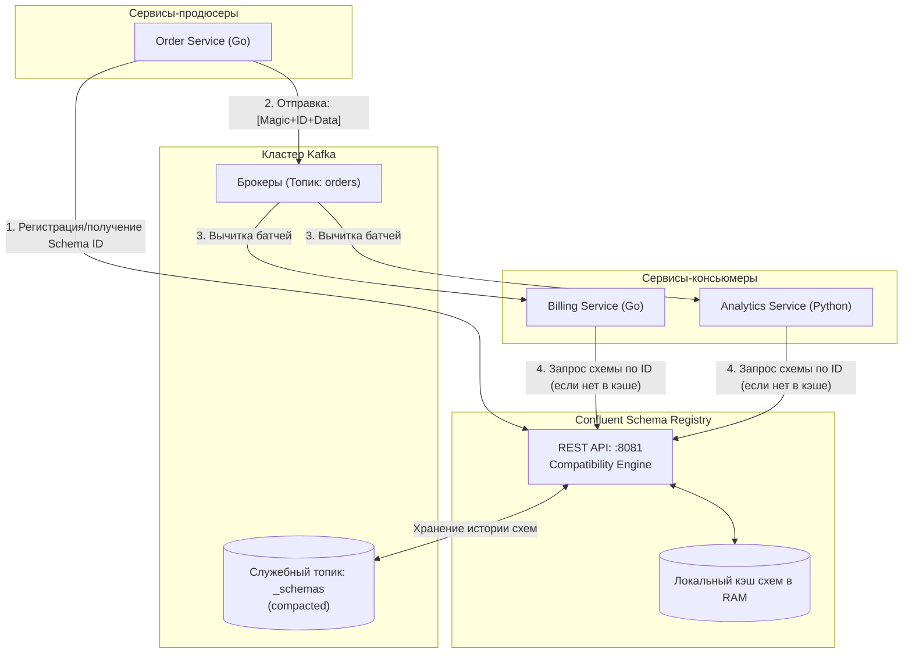
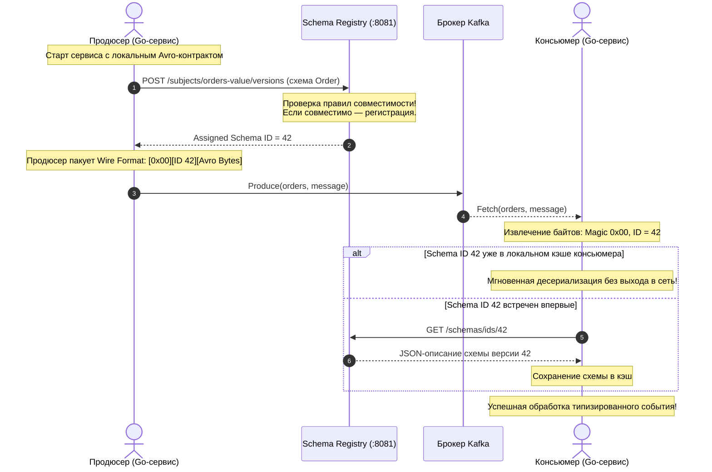
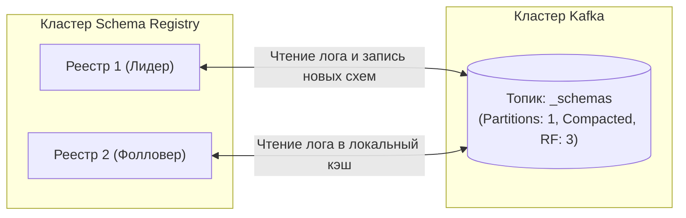
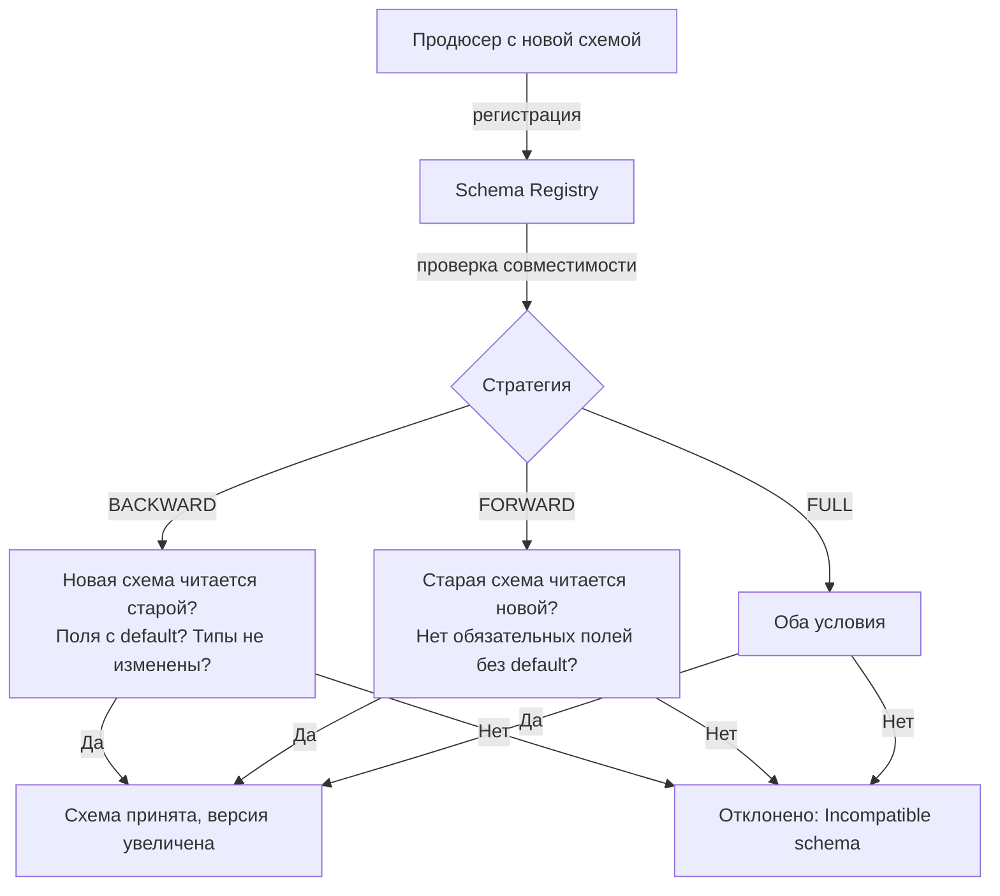

# 11. Schema Registry и эволюция схем: строгие контракты и совместимость в распределенном логе

> *"Control the interfaces, and you control the system. Let the interfaces slip, and chaos takes over."*  
> — Брайан Керниган

> [!NOTE]
> **Связи:** Эта статья тесно связана с [[10. Kafka Connect]], [[9. Kafka Streams]] и [[6. Exactly once в Kafka]], а также опирается на общие принципы эволюции API из раздела [[10. Проектирование API и Сетевые протоколы]] и фундамент гарантий доставки [[4. Модели доставки. At most once, at least once, exactly once]].

---

## Проблема невидимых контрактов

В классическом синхронном мире (REST, gRPC) несовместимое изменение формата данных обнаруживается практически мгновенно: клиент получает HTTP 400 Bad Request или ошибку десериализации прямо во время запроса. Инженеры сразу видят проблему на дашбордах мониторинга и откатывают несовместимый релиз.

В асинхронных событийно-ориентированных системах на базе Apache Kafka всё устроено принципиально иначе:
- Продюсер и консьюмер разделены не только физической сетью, но и **временем**.
- Продюсер может записать сообщение сегодня, а консьюмер (например, сервис аналитики или пересчета финансового баланса) прочитает его через неделю, месяц или даже год при перечитывании истории из лога!

Если разработчик продюсера изменит тип поля `amount` с числа `float64` на строку `"100.50"`, брокер Kafka даже не поморщится — для брокера сообщение является просто аморфным набором сырых байтов `[]byte`. 

Но когда через несколько дней или месяцев консьюмер натолкнется на эту запись в партиции, он упадет в аварийную панику (panic). Что еще хуже — возникнет **Poison Pill** («отравленная пилюля»): консьюмер не сможет сдвинуть свой `offset`, зависнет на этой записи, начнет бесконечно падать и перезапускаться, полностью парализуя работу критического бизнес-процесса!

Без централизованного формального управления схемами распределенная разработка быстро превращается в «гадание по нетипизированному JSON»:
- Какие поля обязательные, а какие опциональные?
- Что означает отсутствие ключа в JSON: `null` или дефолтное значение?
- Можно ли безопасно переименовать поле `userId` в `user_id`?
- Как обновить схему продюсера так, чтобы не сломать 15 независимых сервисов-потребителей, написанных на разных языках разными командами?

Ответом на этот архитектурный хаос стал **Schema Registry** — централизованный реестр контрактов и валидатор совместимости для событийно-ориентированных систем.

---

## Что такое Schema Registry

**Schema Registry** — это выделенный распределенный сервис, служащий единым источником правды (Single Source of Truth) для всех схем данных, циркулирующих внутри кластеров Kafka. 

Schema Registry живет вне брокеров Kafka, предоставляя легковесный REST API для регистрации, извлечения и валидации схем. Историческим стандартом индустрии de-facto является **Confluent Schema Registry** (а также его открытые альтернативы, такие как Aiven Karapace или Redpanda Schema Registry).



Ключевые обязанности Schema Registry:
1. **Хранение схем и версий:** Каждой зарегистрированной схеме присваивается уникальный глобальный целочисленный идентификатор — **Schema ID** (4 байта).
2. **Гарантия совместимости (Compatibility Rules):** При попытке зарегистрировать новую версию схемы Registry автоматически сопоставляет её с предыдущими версиями и **отклоняет несовместимые изменения** еще до того, как продюсер успеет отправить хотя бы один байт в топик!
3. **Кэширование контрактов:** Продюсеры и консьюмеры кэшируют схемы в оперативной памяти, поэтому сетевой запрос к Registry происходит всего один раз при первом старте сервиса.
4. **Минимизация сетевого и дискового трафика:** Сообщение в топике не несет в себе громоздкое описание полей — в заголовок вшивается только 4-байтный Schema ID.

---

## Форматы сериализации: почему Avro, а не только JSON

Schema Registry поддерживает три основных формата сериализации: **Apache Avro**, **Protocol Buffers (Protobuf)** и **JSON Schema**. Однако исторически и концептуально центральным форматом в экосистеме Kafka является **Apache Avro**.

Сравним форматы на уровне аппаратуры и сетевого конвейера:

| Критерий | Сырой JSON | Apache Avro | Protocol Buffers (Protobuf) |
|---|---|---|---|
| **Формат представления** | Текстовый ASCII / UTF-8 | Бинарный, плотная упаковка | Бинарный, теговая упаковка |
| **Передача названий полей** | **В каждом сообщении!** (Огромный оверхед) | **Никогда!** (Имена полей только в схеме) | Номера тегов полей (1-2 байта на поле) |
| **Объем типового сообщения** | 100% (базовый размер, например 300B) | **15–25%** (50–70B) | 20–30% (60–90B) |
| **Эволюция схем** | Ручная, легко ломается | Встроенные математические правила | Строгие правила по номерам тегов |
| **Скорость парсинга CPU** | Медленно (парсинг строк, escaping) | Молниеносно (прямое чтение байт) | Молниеносно (прямое чтение байт) |

Почему **Avro** настолько эффективен?  
В формате Avro бинарные данные сообщения состоят исключительно из **значений полей**, уложенных в строгой последовательности байтов без каких-либо имен ключей, разделителей или метаданных! Если схема говорит: `int, string, double`, то тело сообщения — это просто `[4 байта varint][длина строки + байты строки][8 байт float64]`. 

Вынос схемы за пределы сообщения сокращает размер сетевого трафика и файлов логов на диске в 4–8 раз!

> [!info] Под капотом: Confluent Wire Format
> Сообщения, публикуемые в Kafka через экосистему Schema Registry, упаковываются в специальный стандартизированный бинарный конверт — **Confluent Wire Format**:
> 
> ```
> +---------------------------------------------------------------+
> | Magic Byte (1B) | Schema ID (4B, Big Endian) | Payload (Avro) |
> |      0x00       |      0x00 0x00 0x00 0x2A   |   ... биты ... |
> +---------------------------------------------------------------+
> ```
> 
> - **Magic Byte** (1 байт, всегда `0x00`) — признак того, что сообщение упаковано по стандарту Confluent Wire Format;
> - **Schema ID** (4 байта, big-endian) — уникальный 32-битный целочисленный идентификатор схемы в реестре (например, ID 42);
> - **Avro Payload** — бинарные данные, закодированные строго по правилам Avro Binary Encoding.
> 
> При получении батча консьюмер считывает первый байт: если он равен `0x00`, консьюмер извлекает следующие 4 байта, находит соответствующую схему в локальном кэше (или один раз запрашивает её у Registry) и мгновенно десериализует байты в Go-структуру.

---

## Архитектура взаимодействия

Рассмотрим сквозной жизненный цикл публикации и чтения сообщения:



В терминологии Schema Registry логическое пространство имен схемы называется **Subject** (Субъект). По умолчанию используется стратегия именования `TopicNameStrategy`:
- Схема ключа топика `orders` регистрируется под именем `orders-key`;
- Схема значения топика `orders` регистрируется под именем `orders-value`.

---

## Хранение схем под капотом: топик `_schemas`

Schema Registry спроектирован в соответствии с лучшими практиками распределенных систем: он полностью **stateless** на уровне вычислительных узлов. 

Реестр не требует базы данных PostgreSQL или Oracle для хранения схем. Вся персистентность опирается на **внутренний системный топик Kafka** с именем `_schemas` (по умолчанию):

- Топик `_schemas` имеет ровно **1 партицию**, что гарантирует строго последовательный глобальный порядок регистрации всех версий и исключает коллизии идентификаторов;
- Используется политика уплотнения лога **`cleanup.policy=compact`** ([[8. Retention и compaction]]), благодаря чему топик никогда не теряет активные схемы, но автоматически очищается от промежуточных черновиков;
- При старте любого инстанса Schema Registry он просто вычитывает топик `_schemas` с начала (`offset = 0`) и за несколько миллисекунд полностью восстанавливает все зарегистрированные схемы в оперативной памяти.



> [!warning] Ловушка / Gotcha: Мягкое удаление схем
> Удаление схемы через REST API (`DELETE /subjects/...`) не удаляет данные из `_schemas`, а лишь записывает tombstone. Компактификация топика со временем уберёт старую версию, но schema ID уже занят и не переиспользуется. Это предотвращает коллизии идентификаторов, но означает, что при интенсивной регистрации/удалении идентификаторы могут быстро расти. Никогда не используйте удаление схем в продакшене без крайней необходимости — исторические сообщения в топиках перестанут читаться!

---

## Эволюция схем: правила, спасающие от поломок

Главная суперсила Schema Registry — это автоматический валидатор совместимости (**Compatibility Engine**). Реестр поддерживает несколько режимов совместимости:



Разберем ключевые режимы эволюции:

1. **`BACKWARD` (Обратная совместимость — режим по умолчанию):**
   - **Правило:** Потребители, использующие новую схему, могут читать данные, созданные со старой схемой.
   - **Порядок деплоя:** Сначала обновляются все консьюмеры, затем продюсеры.
   - **Разрешенные изменения:** Добавление полей со значением по умолчанию (`default`), удаление полей, не имевших дефолта.
2. **`FORWARD` (Прямая совместимость):**
   - **Правило:** Потребители, использующие старую схему, могут продолжать читать данные, созданные новой схемой продюсера.
   - **Порядок деплоя:** Сначала обновляются продюсеры, затем консьюмеры.
   - **Разрешенные изменения:** Добавление любых полей, удаление полей, имевших значение по умолчанию.
3. **`FULL` (Полная совместимость):**
   - **Правило:** Сочетает правила `BACKWARD` и `FORWARD`. Старые и новые схемы полностью взаимозаменяемы.
   - **Порядок деплоя:** Любой (консьюмеры и продюсеры обновляются независимо).
   - **Разрешенные изменения:** Добавлять и удалять разрешено **только поля, имеющие значение `default`**!
4. **`NONE`:** Проверка совместимости полностью отключена. Крайне опасный режим, запрещенный в продакшене.

Существуют также транзитивные варианты (`BACKWARD_TRANSITIVE`, `FORWARD_TRANSITIVE`, `FULL_TRANSITIVE`), проверяющие совместимость новой схемы не только с предыдущей версией, но и со **всеми историческими версиями схемы**, когда-либо зарегистрированными в данном subject!

---

### Примеры эволюции Avro-схем

Рассмотрим исходную схему заказа:

```json
{
  "type": "record",
  "name": "Order",
  "namespace": "com.example.orders",
  "fields": [
    {"name": "orderId", "type": "string"},
    {"name": "amount", "type": "double"},
    {"name": "currency", "type": "string", "default": "USD"}
  ]
}
```

- **Добавление поля (BACKWARD):** Добавить поле `discount` со значением по умолчанию `"default": 0.0` — **допустимо**. Старый консьюмер, не знающий о `discount`, просто подставит `0.0`.
- **Удаление поля (BACKWARD):** Удалить поле `currency` — **допустимо**, потому что у него есть default, и старый консьюмер его проигнорирует.
- **Изменение типа поля (BACKWARD):** Поменять `amount` с типа `double` на тип `string` — **категорически запрещено**! Реестр вернет ошибку `422 Unprocessable Entity`, так как старый консьюмер ожидает бинарный float и упадет при попытке десериализации строки.
- **Удаление обязательного поля:** Удалить поле `orderId` — **запрещено**, так как старый консьюмер ожидает это поле как обязательное (нет `default`) и не сможет обработать запись.

---

## Mechanical Sympathy: Avro в Go

В экосистеме Go исторически существовало три подхода к работе с Avro и Schema Registry:
1. `github.com/confluentinc/confluent-kafka-go` — официальная библиотека Confluent. Главный недостаток: построена поверх C-библиотеки `librdkafka` через CGO. Это усложняет кросс-компиляцию, увеличивает потребление стека горутин и приводит к дорогостоящему копированию памяти между C и Go.
2. `github.com/linkedin/goavro` — историческая библиотека на чистом Go, использующая динамическую типизацию через `map[string]interface{}` (высокие накладные расходы на аллокации памяти).
3. **`github.com/hamba/avro/v2`** — современный, экстремально быстрый генератор и кодер Avro на чистом Go, компилирующий парсеры прямо в машинный код и работающий со статически типизированными структурами Go без единой аллокации памяти в горячем цикле!

Ниже представлен эталонный пример сериализации Avro с поддержкой Confluent Wire Format на чистом Go без CGO:

```go
package main

import (
	"context"
	"fmt"
	"log"

	"github.com/hamba/avro/v2"
	"github.com/twmb/franz-go/pkg/kgo"
)

// Order структура бизнес-события
type Order struct {
	OrderID  string  `avro:"orderId"`
	Amount   float64 `avro:"amount"`
	Currency string  `avro:"currency"`
}

func main() {
	schemaJSON := `{
		"type": "record",
		"name": "Order",
		"namespace": "com.example.orders",
		"fields": [
			{"name": "orderId", "type": "string"},
			{"name": "amount", "type": "double"},
			{"name": "currency", "type": "string", "default": "USD"}
		]
	}`

	// Парсинг схемы в память один раз при старте
	avroSchema, err := avro.Parse(schemaJSON)
	if err != nil {
		log.Fatalf("parse schema: %v", err)
	}

	// Schema ID, полученный от Schema Registry (например, ID = 42)
	schemaID := uint32(42)

	// Создание полезной нагрузки
	order := Order{
		OrderID:  "order-xyz-100",
		Amount:   250.50,
		Currency: "USD",
	}

	// Бинарная сериализация полезной нагрузки
	avroPayload, err := avro.Marshal(avroSchema, order)
	if err != nil {
		log.Fatalf("avro marshal: %v", err)
	}

	// Формирование Confluent Wire Format: 1 байт magic (0x00) + 4 байта Schema ID (big-endian)
	wireMessage := make([]byte, 1+4+len(avroPayload))
	wireMessage[0] = 0x00
	wireMessage[1] = byte(schemaID >> 24)
	wireMessage[2] = byte(schemaID >> 16)
	wireMessage[3] = byte(schemaID >> 8)
	wireMessage[4] = byte(schemaID)
	copy(wireMessage[5:], avroPayload)

	// Отправка через производительный чистый Go-клиент franz-go
	cl, err := kgo.NewClient(kgo.SeedBrokers("localhost:9092"))
	if err != nil {
		log.Fatalf("failed to create client: %v", err)
	}
	defer cl.Close()

	ctx := context.Background()
	cl.Produce(ctx, &kgo.Record{
		Topic: "orders",
		Key:   []byte(order.OrderID),
		Value: wireMessage,
	}, func(r *kgo.Record, err error) {
		if err != nil {
			log.Printf("delivery failed: %v", err)
			return
		}
		fmt.Printf("Message with Schema ID %d delivered to partition %d\n", schemaID, r.Partition)
	})

	_ = cl.Flush(ctx)
}
```

---

## Связь с Kafka Connect и Streams

Schema Registry — это нервная система всей платформы Kafka:

- **Kafka Connect** ([[10. Kafka Connect]]) использует конвертер `AvroConverter` (или `ProtobufConverter`). При чтении из базы данных Debezium автоматически преобразует типы SQL в поля схемы Avro и регистрирует их в Registry. Консьюмер на Go получает строго типизированные сообщения без ручной настройки!
- **Kafka Streams** ([[9. Kafka Streams]]) опирается на классы `SpecificAvroSerde`, обеспечивая прозрачную сериализацию локального состояния RocksDB и changelog-топиков.

---

## Вопросы для собеседования

> [!tip] Собеседование
> **Вопрос:** Почему Schema Registry хранит схему вне сообщений, а не внутри? В чём преимущество?  
> **Ответ:** Вынос схемы в реестр и передача только schema ID (4 байта) радикально сокращает размер сообщения, особенно для множества мелких записей. Это экономит пропускную способность сети, дисковое пространство в логах Kafka и ускоряет сериализацию/десериализацию, так как продюсер и консьюмер могут кешировать распарсенные схемы локально. Кроме того, централизованное управление эволюцией схем позволяет предотвращать несовместимые изменения до того, как они сломают прод.

> [!tip] Собеседование
> **Вопрос:** Стратегия BACKWARD vs FORWARD: когда и какую выбрать?  
> **Ответ:** BACKWARD используется, когда продюсеры обновляются раньше консьюмеров — типичный сценарий микросервисов: сервис-продюсер разворачивается первым, а потребители могут обновляться позже. FORWARD нужна, когда консьюмеры обновляются первыми или когда один топик читают множество независимых консьюмеров, которых сложно синхронизировать. В большинстве проектов оптимально начинать с BACKWARD, переходя на FULL по мере стабилизации.

---

## Заключение и дальнейшие шаги

Schema Registry — это не просто репозиторий схем, а активный страж совместимости в асинхронном мире. Он превращает непредсказуемые поломки при изменении форматов в контролируемый процесс с чёткими правилами, делая эволюцию данных безопасной и предсказуемой даже в распределённых командах.

Теперь, когда мы рассмотрели все компоненты экосистемы Kafka — от физического лога и групп потребителей до потоковых процессоров и реестра схем, — пора обратиться к последней фундаментальной теме подраздела: как измерить и максимизировать производительность всего этого великолепия. Следующая статья: [[12. Производительность Kafka]].