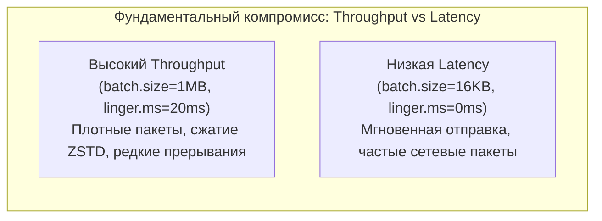
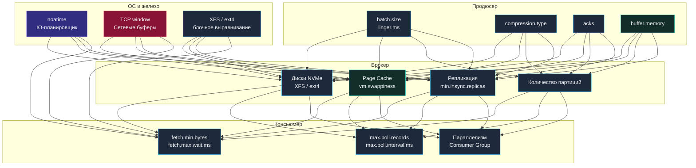

# 12. Производительность Kafka: Mechanical Sympathy, тюнинг от железа до Go и бенчмарки

> *«Узкие места возникают в самых неожиданных местах; поэтому не пытайтесь гадать и не внедряйте хаки ради скорости, пока на реальных измерениях не убедитесь, что они действительно нужны».*    
> — Брайан Керниган

> [!NOTE]
> **Связи:** Эта статья завершает подраздел Kafka, замыкая теорию на практические рычаги управления скоростью. Мы опираемся на [[1. Kafka. Архитектура и модель log based системы]], [[2. Topics, partitions и offsets]], [[3. Producer и consumer]], [[4. Consumer groups]], [[5. Ordering и partitioning]], [[6. Exactly once в Kafka]], [[7. Kafka storage под капотом]], [[8. Retention и compaction]], [[9. Kafka Streams]], [[10. Kafka Connect]] и [[11. Schema Registry и эволюция схем]].

---

## Производительность как архитектурное свойство

Производительность Apache Kafka — это не случайная удача и не результат одного изолированного алгоритмического трюка. Это следствие системной реализации концепции **Mechanical Sympathy** (механического сочувствия к оборудованию) на всех уровнях стека: от кремния процессора и шины памяти до системных вызовов ядра Linux и сетевого протокола.

Вместо того чтобы бороться с ограничениями физического мира, архитекторы Kafka поставили их себе на службу:
- **Последовательный доступ к диску** вместо случайного (скорость чтения/записи NVMe SSD достигает 3–7 ГБ/с);
- **Нулевое копирование (Zero-Copy)** через системный вызов `sendfile`, исключающий копирование данных процессором в пользовательское пространство;
- **Использование страничного кэша ядра Linux (Page Cache)** вместо раздутой JVM-кучи, что устраняет многосекундные паузы сборщика мусора (Stop-the-World GC);
- **Батчинг на всех этапах**, амортизирующий накладные расходы заголовков TCP/IP и переключений контекста CPU;
- **Сжатие целых пакетов сообщений** на стороне клиента (Snappy, LZ4, ZSTD), разгружающее сетевой канал и дисковую подсистему брокеров.

Производительность любой распределенной системы обмена сообщениями оценивается по двум ключевым координатам:
- **Throughput (пропускная способность):** Объем данных (Мбайт/с) или количество сообщений в секунду (RPS), которые система способна гарантированно пропустить через себя.
- **Latency (задержка):** Время от момента вызова `Produce` на клиенте-отправителе до момента получения сообщения консьюмером (end-to-end latency), измеряемое на строгих перцентилях (p95, p99, p99.9).



Эти две оси находятся в строгом физическом компромиссе. Нельзя получить минимальную задержку в 500 микросекунд и одновременно рекордный throughput в гигабайты в секунду на одном канале. Задача инженера — осознанно настроить систему под конкретные бизнес-требования.

---

## Три уровня тюнинга

Любое узкое место производительности локализуется на одном из трёх уровней конвейера или на их стыках:

1. **Продюсер:** Формирует батчи, сжимает данные и управляет сетевыми очередями отправки.
2. **Брокер:** Принимает TCP-пакеты, сохраняет данные в Page Cache, управляет репликацией в ISR и отдает сегменты через `sendfile`.
3. **Консьюмер:** Вытягивает батчи через `FetchRequest`, параллелит вычисления и коммитит смещения.

Фундаментом для всех трех уровней служит **четвертый уровень — операционная система и физическое оборудование** (процессорные ядра, сетевые карты NIC, контроллеры NVMe, планировщики ввода-вывода ядра Linux).



---

## Продюсер: как отправить миллион сообщений и не захлебнуться

Производительность продюсера определяется настройками батчинга и сжатия. Одиночная отправка (`Send` на каждое сообщение) — гарантированный путь к посредственной производительности.

### batch.size и linger.ms

Продюсер накапливает сообщения в буферах RecordAccumulator для каждой партиции. Когда буфер для партиции достигает `batch.size` (по умолчанию 16 КБ) или истекает `linger.ms` (по умолчанию 0), батч отправляется брокеру.

- **`batch.size`** — увеличивайте до 64–512 КБ (а в высокопоточных аналитических пайплайнах до 1 МБ). Более крупные батчи лучше сжимаются, а брокер выполняет меньше операций записи на единицу данных.
- **`linger.ms`** — установите 5–20 мс, чтобы небольшая задержка наполняла батчи, не увеличивая заметно end-to-end latency. При значении 0 многие батчи будут отправляться полупустыми, снижая эффективность. В высоконагруженных системах `linger.ms=5` практически не добавляет задержки, но утраивает пропускную способность.

### Сжатие

Сжатие (`compression.type`: gzip, snappy, lz4, zstd) выполняется на стороне продюсера над целым батчем. Брокер хранит сжатый батч без изменений, и консьюмер получает его без перепаковки. Выбор кодека — компромисс CPU vs throughput:

| Кодек | Степень сжатия | Нагрузка на CPU | Скорость декомпрессии | Рекомендация |
|---|:---:|:---:|:---:|---|
| **lz4** | Средняя | Минимальная | Сверхбыстро | **Идеальный баланс по умолчанию** для микросервисов |
| **snappy** | Средняя | Низкая | Очень быстро | Отличная альтернатива для CPU-bound систем |
| **zstd** | Экстремально высокая | Средняя/Высокая | Быстро | **Максимум сжатия** для Big Data и экономии диска |
| **gzip** | Высокая | Высокая | Медленно | Устаревший выбор, не рекомендуется для высоких RPS |

> [!info] Под капотом
> В Go-клиентах (`franz-go`) сжатие выполняется чистым Go-кодом без CGO. Рекомендуется `lz4` для наилучшего баланса скорости и компактности, особенно при использовании `sync.Pool` для переиспользования буферов сжатия.

### acks и долговечность

Параметр `acks` прямо влияет на задержку отправки:
- **`acks=0`** — продюсер не ждет ответа от сети. Минимальная задержка (sub-millisecond), но риск безвозвратной потери сообщений при малейшем сетевом сбое.
- **`acks=1`** — брокер-лидер подтверждает запись после сброса в локальный Page Cache. Баланс скорости и надёжности, но смена лидера до репликации может привести к потере данных.
- **`acks=all`** — брокер ждет подтверждения от всех синхронных реплик в ISR (`min.insync.replicas`). Максимальная надежность ценой задержки на сетевой round-trip между брокерами.

Для высокопроизводительных систем с требованиями надёжности обычно выбирают `acks=all` в сочетании с `min.insync.replicas=2` и настройкой `enable.idempotence=true` для предотвращения дубликатов.

### Параллелизм и буферы

Множество горутин, вызывающих `Produce`, могут конкурировать за RecordAccumulator. 
- **`max.in.flight.requests.per.connection`** (по умолчанию 5): Позволяет отправлять до 5 сетевых TCP-пакетов параллельно в один брокер без ожидания подтверждения предыдущего, полностью насыщая сетевой канал (Bandwidth-Delay Product). При включенной идемпотентности (`enable.idempotence=true`) брокер отслеживает `Sequence Number` и гарантирует идеальный порядок даже при параллельной отправке!
- **`buffer.memory`** (по умолчанию 32 МБ): Общий пул оперативной памяти продюсера под накопление батчей. Если сеть временно деградировала, буфер заполняется, и вызовы `Produce` начинают блокироваться по истечении `max.block.ms`. Для высоконагруженных продюсеров этот параметр увеличивают до 64–256 МБ.

---

## Брокер: запись, репликация, хранение

Брокер — центральное звено, и его производительность ограничена двумя физическими ресурсами: дисковой подсистемой и сетью.

### Диски и файловая система

Kafka предельно зависима от последовательного ввода-вывода. Использование **NVMe SSD** (например, AWS i3/i4i инстансы с локальными NVMe) — обязательное условие для высоких нагрузок. На HDD throughput падает в десятки раз.

Рекомендации по файловой системе:
- Предпочтительнее **XFS** — показывает лучшую производительность на больших файлах и операциях sequential write, чем ext4, благодаря более эффективной работе с непрерывными экстентами (extents).
- Монтирование с опцией **`noatime`** отключает обновление времени последнего доступа к файлам, экономя метаданные операции при каждом чтении.
- Блочное выравнивание разделов по границам erase block SSD (обычно 1 МБ) предотвращает write amplification на уровне контроллера.

### Страничный кеш и управление памятью

Брокер активно использует Page Cache ядра Linux. Для производства крайне важно, чтобы операционная система не вытесняла горячие страницы Kafka из кеша. Настройте **`vm.swappiness=1`** (не 0, чтобы избежать OOM Killer при нехватке памяти), чтобы ядро агрессивно держало страничный кеш.

Дополнительные параметры ядра для дискового кэша:
- `vm.dirty_background_ratio = 5` — ядро начинает сбрасывать грязные страницы на диск в фоне, когда они занимают 5% доступной RAM, предотвращая внезапные лавины I/O;
- `vm.dirty_ratio = 10` — жесткий порог, при котором процессы начинают блокироваться до сброса страниц.

Внутри JVM брокера не следует выделять более 6–8 ГБ heap (для брокеров с ~30–64 ГБ RAM). Остальная память остаётся под Page Cache. Флаг JVM `-XX:+UseG1GC` обеспечивает предсказуемые паузы GC, особенно при большом количестве партиций.

### Количество партиций и топиков

Избыточное количество партиций — частая причина скрытой деградации:
- Каждая партиция требует открытых файловых дескрипторов (минимум 3 на сегмент: .log, .index, .timeindex). С ростом числа партиций брокер может исчерпать лимит ОС на открытые файлы (`ulimit -n`).
- При ребалансировке Consumer Group координатор обрабатывает все партиции, и с десятками тысяч партиций время ребалансировки становится значительным.
- Рекомендуемый практический максимум: **~4000 партиций на брокер**, но эта цифра зависит от доступной памяти и дисков.

### Репликация и min.insync.replicas

При `acks=all` запись считается успешной, когда её подтвердили все реплики в ISR. Параметр `min.insync.replicas` определяет, сколько реплик должно подтвердить запись. Значение `min.insync.replicas=2` (при факторе репликации 3) означает, что лидер + одна синхронная реплика обязаны подтвердить. Это повышает надёжность без значительного ухудшения задержки. Установка значения, равного фактору репликации, максимизирует долговечность, но при выходе из строя любого брокера топик становится недоступным для записи.

---

## Консьюмер: быстрая вычитка без потерь

Производительность консьюмера определяется тем, насколько быстро он может забирать данные и обрабатывать их.

### fetch.min.bytes и fetch.max.wait.ms

Консьюмер запрашивает данные с брокера. Чтобы избежать частых пустых запросов:
- **`fetch.min.bytes`** (по умолчанию 1) — минимальный объём данных, который брокер должен накопить перед ответом. Увеличьте до 1048576 (1 МБ) для throughput-ориентированных систем, чтобы каждый ответ приносил значимые данные.
- **`fetch.max.wait.ms`** (по умолчанию 500) — максимальное время ожидания брокером накопления `fetch.min.bytes`. Установите 100–500 мс в зависимости от требований к latency.

### max.poll.records и цикл обработки

Консьюмер за один `Poll` может получать до `max.poll.records` записей. Увеличение этого параметра до 500–2000 позволяет обрабатывать большие батчи, но требует, чтобы бизнес-логика укладывалась в `max.poll.interval.ms` (по умолчанию 5 минут), иначе консьюмер будет исключён из группы.

**Критический паттерн для Go:** не обрабатывайте сообщения синхронно внутри цикла `Poll`. Выгружайте их в worker-пул или горутины, немедленно возвращаясь к `Poll`:

```go
for {
    fetches := client.PollFetches(ctx)
    if fetches.IsClientClosed() {
        break
    }
    fetches.EachRecord(func(record *kgo.Record) {
        wg.Add(1)
        go func(r *kgo.Record) {
            defer wg.Done()
            process(r)
        }(record)
    })
    // Коммит после обработки батча — отдельный механизм
}
```

### Количество консьюмеров vs партиций

Максимальный параллелизм Consumer Group ограничен числом партиций топика. Добавление консьюмеров сверх числа партиций не повышает throughput — лишние экземпляры бездействуют. Проектируйте топики с достаточным числом партиций под ожидаемый уровень параллелизма, учитывая накладные расходы, описанные выше.

---

## Операционная система: невидимый фундамент

### Сеть

Брокер обслуживает множество TCP-соединений от продюсеров, консьюмеров и других брокеров (репликация). Пропускная способность сетевого интерфейса — ещё один физический лимит. На платформах вроде AWS выбирайте инстансы с гарантированной пропускной способностью (Enhanced Networking, ENA). 

Увеличение размеров TCP-буферов ядра через `sysctl` (`net.core.rmem_max`, `net.core.wmem_max`) может улучшить пропускную способность на высоких задержках:
```bash
sysctl -w net.core.rmem_max=16777216
sysctl -w net.core.wmem_max=16777216
sysctl -w net.ipv4.tcp_rmem="4096 87380 16777216"
sysctl -w net.ipv4.tcp_wmem="4096 65536 16777216"
```

### IO-планировщик

Для современных SSD/NVMe используйте планировщик `none` (или `noop` в старых ядрах Linux) — он отключает лишнюю сортировку запросов в ядре и передает команды контроллеру NVMe напрямую, экономя такты CPU.

### Max open files

Каждый сегмент партиции потребляет файловые дескрипторы. При большом количестве партиций стандартного лимита (1024) недостаточно. Установите `ulimit -n 100000` или выше (например, `1000000` в `/etc/security/limits.conf`).

---

## Типичные цифры

При правильной настройке на современном оборудовании (NVMe, 10+ GbE) можно ожидать:

| Сценарий | Throughput | End-to-end latency p99 |
|---|:---:|:---:|
| **1 продюсер, 1 консьюмер, 1 партиция** | 100+ Мбайт/с | < 5 мс |
| **8 продюсеров, 8 консьюмеров, 32 партиции** | 800+ Мбайт/с | < 10 мс |
| **Транзакционная запись exactly-once** | ~70% от базового | +2–5 мс |

---

## Инструменты измерения

Не тюньте вслепую. Используйте встроенные инструменты бенчмаркинга:

```bash
# Тест производительности продюсера
kafka-producer-perf-test \
  --topic perf-test \
  --num-records 10000000 \
  --record-size 1024 \
  --throughput -1 \
  --producer-props bootstrap.servers=localhost:9092 acks=all linger.ms=5 compression.type=lz4

# Тест производительности консьюмера
kafka-consumer-perf-test \
  --topic perf-test \
  --bootstrap-server localhost:9092 \
  --messages 10000000 \
  --group perf-test-group
```

Для production-мониторинга подключайте JMX-метрики брокеров через Prometheus exporter и отслеживайте ключевые показатели:
- **`request-handler-idle-ratio`** — доля времени, когда потоки обработки запросов простаивают (если < 0.2 — нехватка CPU или потоков);
- **`network-processor-idle-ratio`** — простой сетевых потоков;
- **`disk-write-rate`** — интенсивность дисковой записи;
- **`replication-under-replicated-partitions`** — количество недореплицированных партиций (должно быть строго 0).

---

## Вопросы для собеседования

> [!tip] Собеседование
> **Вопрос:** Какая стратегия увеличения пропускной способности эффективнее: добавление партиций или увеличение размера батча?  
> **Ответ:** Зависит от узкого места. Если продюсер упирается в латентность одиночной партиции на медленном диске, помогает добавление партиций (распределение нагрузки). Если брокер простаивает, а продюсер отправляет мелкие сообщения, сначала увеличивают `batch.size` и `linger.ms`, что даёт прирост без изменения топологии. Добавление партиций также увеличивает накладные расходы брокера, поэтому начинают с тюнинга продюсера.

> [!tip] Собеседование
> **Вопрос:** Почему для брокера Kafka рекомендуется устанавливать `vm.swappiness=1`, а не `0`?  
> **Ответ:** Значение `vm.swappiness=1` заставляет ядро Linux максимально агрессивно удерживать страничный кэш в оперативной памяти и избегать выгрузки страниц на диск в swap. Однако установка в `0` в некоторых ядрах полностью запрещает подкачку страниц, что при внезапном скачке аллокаций памяти может немедленно активировать аварийный `OOM Killer` и убить процесс брокера. Значение `1` оставляет ядру Linux узкую форточку безопасности.

---

## Заключение

Высокая производительность Kafka — это инженерная дисциплина, а не разовый акт. Она достигается пониманием того, как батчинг и сжатие продюсера, неизменяемый лог брокера, страничный кеш и zero-copy, а также асинхронная обработка консьюмера складываются в единый конвейер. Каждый параметр — рычаг, влияющий на компромисс между пропускной способностью и задержкой.

Мы завершили подраздел Kafka, пройдя путь от архитектуры лога и партиций до потоковых процессоров, схем и тюнинга производительности. Теперь мы можем перейти к другому, не менее важному брокеру экосистемы — лёгкому и высокоскоростному NATS. Следующая статья откроет подраздел [[1. NATS. Легковесный брокер]].