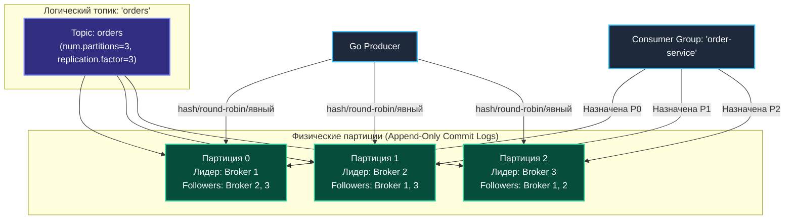
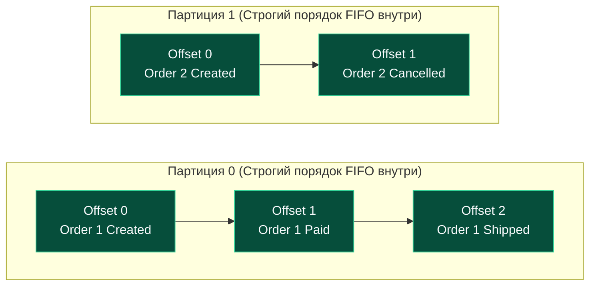
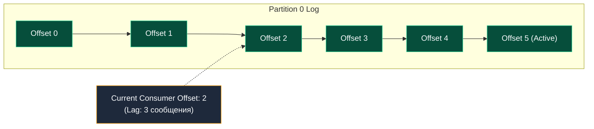
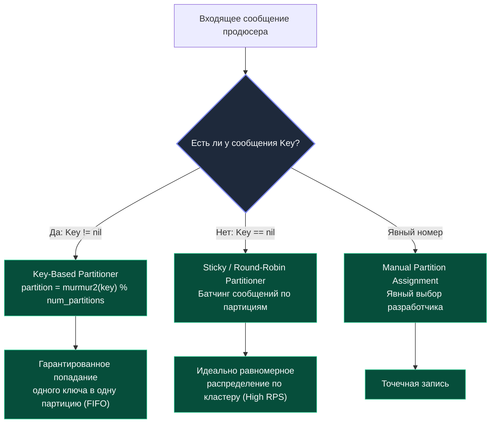

> [!NOTE]
> **Связи:** Данная статья продолжает тему, начатую в [[1. Kafka. Архитектура и модель log based системы]], и закладывает основу для понимания работы [[3. Producer и consumer]], [[4. Consumer groups]] и [[5. Ordering и partitioning]].

Вот фундаментальная статья, детально разбирающая `Topics`, `Partitions` и `Offsets` — ядро модели хранения и параллелизма Apache Kafka.

Если в традиционных СУБД фундаментальной единицей декомпозиции выступает таблица со строками, а в RabbitMQ — очередь сообщений, то в Apache Kafka весь мир держится на триаде: **Топик**, **Партиция** и **Оффсет**. Именно это триединство превращает Kafka из банального брокера в распределённую нервную систему современного бэкенда, способную переваривать терабайты телеметрии в реальном времени.

---

## Топики: категории бесконечного потока данных

Если смотреть на архитектуру Kafka с высоты птичьего полёта, **Topic (топик)** — это именованный логический поток данных, к которому продюсеры публикуют события, а консьюмеры оформляют подписку. Разработчик присваивает топику осмысленное доменное имя (`orders`, `user-events`, `page-views`), и с этого момента он выступает точкой схождения для всех событий определенного контракта.

Однако за этим привычным абстрактным фасадом скрывается радикальное архитектурное решение: в отличие от RabbitMQ, где топик — это алгоритм маршрутизации (Topic Exchange), не хранящий ни байта данных, в Kafka топик — это **логический контейнер для набора физических, неизменяемых, строго упорядоченных логов — партиций**.

### Структура топика и его физическое воплощение

Когда системный инженер или сервис инициализирует топик в кластере, он обязан зафиксировать две базовые характеристики:
1. **Количество партиций (`num.partitions`):** Степень горизонтального дробления потока данных.
2. **Фактор репликации (`replication.factor`):** Количество узлов брокеров, на которых физически дублируются журналы каждой партиции.

Топик сам по себе не содержит ни одного байта на диске — это виртуальный агрегатор. Все физические операции записи и чтения адресуются в конкретные партиции этого топика.



---

## Партиции: единица параллелизма и порядка

**Партиция (Partition)** — это фундаментальная единица масштабирования, отказоустойчивости и гарантии порядка в Kafka. 

Именно количество партиций задает абсолютный теоретический потолок горизонтального параллелизма: **одна партиция в рамках конкретной Consumer Group может обрабатываться не более чем одним консьюмером одновременно**.

### Почему партиция гарантирует строгий порядок

Каждая партиция представляет собой **линейно упорядоченный лог с монотонно возрастающим смещением (offset)**. 

Как только брокер зафиксировал запись в партиции, ее позиция относительно соседей цементируется навсегда:
- Консьюмер, подключенный к партиции №0, видит поток событий строго в том хронологическом порядке, в котором их подтвердил лидер этой партиции (гарантия **FIFO**).
- Однако между независимыми партициями (например, между партицией №0 и партицией №1) **никакой синхронизации порядка не существует**.



> [!IMPORTANT]
> **Великий компромисс распределенных систем: Параллелизм против Глобального порядка.**  
> Если для вашей системы жизненно необходим глобальный строгий порядок всех событий в рамках топика, у вас может быть только **одна партиция** (`num.partitions = 1`). Но в этом случае вся система сожмется в однопоточную обработку. 
> Архитектура Kafka намеренно отказывается от глобального порядка топика, заменяя его **локальным порядком по ключу сущности (Entity ID)**, что дает возможность горизонтального масштабирования на сотни брокеров.

---

### Физическая структура: сегменты и файлы

На дисковом накопителе сервера партиция разворачивается не как бесконечный непрерывный файл, а как директория, заполненная набором упорядоченных **сегментов (segments)**. 

Активный сегмент, куда в данный момент пишет брокер, постепенно растет. При достижении предельного размера (параметр `segment.bytes`, по умолчанию 1 ГБ) или временного порога (`segment.ms`, по умолчанию 7 дней) сегмент закрывается (становится неизменяемым), и создается новый активный сегмент.

Каждый сегмент на диске состоит из трех специализированных файлов:
1. **`.log` (Журнал данных):** Непосредственный поток сжатых бинарных пакетов сообщений (RecordBatch).
2. **`.index` (Смещение $\to$ Позиция):** Разреженный позиционный индекс (Sparse Offset Index), связывающий логический `offset` с физическим смещением в байтах внутри `.log`-файла.
3. **`.timeindex` (Время $\to$ Смещение):** Разреженный временной индекс, сопоставляющий timestamp сообщения с его логическим `offset`.

```bash
# Пример файловой структуры партиции orders-0
/var/lib/kafka/data/orders-0/
├── 00000000000000000000.log        # Сегмент: сообщения с offset 0 по 12344
├── 00000000000000000000.index      # Позиционный индекс смещений
├── 00000000000000000000.timeindex  # Временной индекс
├── 00000000000000012345.log        # Активный сегмент: offset с 12345 и далее...
├── 00000000000000012345.index
└── 00000000000000012345.timeindex
```

### Зачем нужно разделение на сегменты?
- **Мгновенное удаление устаревших данных:** Операционной системе не нужно вырезать байты из середины терабайтного файла. Брокер просто вызывает системный вызов `unlink()` на старейшие файлы сегментов, целиком освобождая блоки на диске за доли микросекунды.
- **Быстрый бинарный поиск:** Разреженный индекс загружается прямо в оперативную память. Поиск физического смещения для любого offset занимает $O(\log N)$ операций бинарного поиска в памяти, после чего выполняется единственное прямое чтение блока с диска.
- **Минимизация фрагментации:** Файлы фиксированного размера идеально укладываются в экстенты файловых систем Linux (ext4, XFS).

> [!info] Под капотом: LogSegment, Page Cache и Zero-Copy
> Внутри рантайма Kafka каждый сегмент инкапсулирован в объект `LogSegment`. Для эффективного ввода-вывода брокер обращается к Java NIO классам `FileChannel` и `MappedByteBuffer`, которые работают в теснейшем симбиозе со страничным кэшем (**Page Cache**) операционной системы.
> 
> При чтении консьюмером данные передаются в сетевую карту напрямую через системный вызов ядра Linux **`sendfile()`** (**Zero-Copy**). Процессор хоста не участвует в копировании полезной нагрузки в память userspace: срез байт перекачивается из Page Cache напрямую в буфер сокета сетевого контроллера (NIC).

---

## Offset: «курсор» в бесконечном логе

Каждому сообщению, попадающему в партицию, брокер присваивает **Offset** — монотонно возрастающее 64-битное целое число (`int64`), однозначно определяющее позицию записи в рамках этой партиции.

Оффсет в Kafka концептуально отличается от очередей задач:
- Оффсет нельзя переставить, перепрыгнуть или удалить выборочно.
- Оффсет не привязан к конкретному воркеру — это объективная координата сообщения в координатной сетке времени топика.
- Консьюмер хранит лишь числовое значение оффсета, отмечая, до какого места лог уже успешно прочитан.



---

### Управление смещениями и Consumer Group

Вся мощь параллельной обработки раскрывается в механизме фиксации прогресса (**Commit Offsets**):
1. Консьюмер вычитывает пакет сообщений из партиции.
2. После успешной бизнес-обработки консьюмер отправляет брокеру команду фиксации (`OffsetCommitRequest`).
3. Брокер записывает зафиксированный номер оффсета во внутренний системный топик **`__consumer_offsets`**.

Топик `__consumer_offsets` представляет собой уплотняемый журнал (Compacted Topic). Он хранит пары вида `[ConsumerGroup, Topic, Partition] -> CommittedOffset`. Благодаря этому при перезапуске пода в Kubernetes или масштабном сбое сети новый консьюмер мгновенно считывает свое последнее зафиксированное состояние и продолжает работу без дублей и пропусков.

Политика фиксации оффсетов бывает двух видов:
- **Auto-Commit (Автоматический):** Драйвер консьюмера раз в $N$ секунд фоново коммитит последний вычитанный оффсет. Удобно, но чревато потерей данных при аварии воркера до завершения обработки в базе данных.
- **Manual Commit (Ручной):** Консьюмер явно подтверждает оффсет строго после завершения записи в целевую базу данных. Это фундамент построения гарантий **At-least-once** и **Exactly-Once** (см. [[6. Exactly once в Kafka]] и [[10. Idempotency в message processing]]).

---

### Как консьюмер находит начальную точку

Если новая Consumer Group впервые подключается к существующему топику (в `__consumer_offsets` для нее еще нет записей), брокер определяет стартовую позицию на основе параметра **`auto.offset.reset`**:
- **`earliest`:** Начать с самого первого доступного сообщения в логе (перечитать всю историю).
- **`latest`:** Начать с самого конца (игнорировать историю и получать только новые события, поступающие после подключения).

```go
// Идиоматичная настройка клиента franz-go на чистом Go
package main

import (
	"context"
	"log"

	"github.com/twmb/franz-go/pkg/kgo"
)

func createKafkaConsumer() (*kgo.Client, error) {
	return kgo.NewClient(
		kgo.SeedBrokers("localhost:9092"),
		kgo.ConsumerGroup("my-billing-group"),
		kgo.ConsumeTopics("orders"),
		// Отключаем автокоммит: мы будем подтверждать оффсеты руками!
		kgo.DisableAutoCommit(),
		// При отсутствии сохраненного оффсета читаем с самого начала истории
		kgo.ConsumeResetOffset(kgo.NewOffset().AtStart()),
	)
}
```

---

## Стратегия маршрутизации: как продюсер выбирает партицию

Отправитель сообщения (Producer) играет ключевую роль в распределении нагрузки между партициями топика. Алгоритм маршрутизации выбирается на основе структуры сообщения:



1. **Маршрутизация по ключу (Key-based Partitioning):**  
   Если сообщение снабжено непустым ключом (например, `user_id` или `order_id`), стандартный партиционер Kafka вычисляет 32-битный хэш с помощью алгоритма **murmur2** и вычисляет индекс: `partition = hash(key) % num_partitions`.  
   Это гарантирует, что все события одного пользователя или заказа всегда попадут строго в одну и ту же партицию, гарантируя идеальный порядок их обработки.

2. **Равномерное распределение (Round-robin / Sticky Partitioner):**  
   Если ключ не задан (`key == nil`), продюсер распределяет сообщения между всеми партициями. В современных версиях Kafka используется **Sticky Partitioner**: он заполняет пакет для одной партиции до лимита `batch.size`, затем переключается на следующую, что максимизирует сжатие и сетевую утилизацию.

3. **Явное указание партиции:**  
   Приложение может вручную задать конкретный индекс партиции в коде, переопределив стандартную логику.

> [!warning] Ловушка / Gotcha: Изменение количества партиций ломает порядок
> Представьте: вы создали топик с 4 партициями и маршрутизируете события по ключу `user_id`. Все события пользователя `user-99` попадали в партицию №2.
> 
> Позже трафик вырос, и администратор увеличил число партиций топика с 4 до 8 (`num.partitions = 8`).
> **Что произойдет?**  
> Формула `murmur2(key) % 8` выдаст совершенно другой номер партиции (например, партицию №5). Новые события пользователя начнут записываться в партицию №5, в то время как его старые события все еще ждут вычитки в партиции №2!  
> 
> Порядок обработки сообщений пользователя окажется **безвозвратно разорван**.  
> **Инженерный закон:** Количество партиций для топиков со строгим порядком по ключу рассчитывается заранее на несколько лет вперед с запасом на рост нагрузки!

---

## Механическая симпатия: как партиции взаимодействуют с железом

Каждая партиция, будучи линейным неизменяемым логом, идеально согласована с физическими свойствами современных накопителей. 

Последовательная запись в активный сегмент позволяет дискам (SSD/NVMe) работать на пиковой пропускной способности, эффективно заполняя erase-блоки и минимизируя усиление записи (Write Amplification). 

Чтение консьюмерами с использованием `sendfile` и страничного кеша означает, что даже при тысячах потребителей данные копируются только один раз — из кеша ядра в сокетную буферную память NIC, вообще не попадая в пространство пользователя.

Именно эта синергия между неизменяемой моделью хранения, сегментированием, zero-copy и последовательным вводом-выводом позволяет брокеру обслуживать миллионы сообщений в секунду на обычном оборудовании.

---

## Практические выводы и подготовка к собеседованию

Понимание топиков, партиций и оффсетов необходимо для ответа на ключевые архитектурные вопросы на Middle+/Senior собеседованиях:

> [!tip] Собеседование: Почему порядок гарантирован только внутри партиции?
> **Вопрос:** Почему порядок сообщений в Kafka гарантируется только в рамках одной партиции, но не в рамках всего топика?
> 
> **Ответ:** Топик в Kafka — это чисто виртуальная группировка нескольких физически независимых логов (партиций), распределенных по разным узлам кластера. Обеспечение глобального порядка между несколькими независимыми партициями потребовало бы глобальной межброкерной синхронизации и блокировок (2PC или распределенных часов), что полностью уничтожило бы горизонтальную масштабируемость и пропускную способность. Kafka намеренно жертвует глобальным порядком ради производительности.

> [!tip] Собеседование: FIFO для конкретного клиента при высоком общем Throughput
> **Вопрос:** Как спроектировать систему в Kafka, где критически важен строгий FIFO-порядок операций по каждому клиенту, но суммарный поток составляет 100 000 событий в секунду?
> 
> **Ответ:** Использовать топик с десятками партиций (например, 32 или 64), а в качестве ключа сообщения (`Key`) передавать уникальный идентификатор клиента (`ClientID`). Все события одного клиента по формуле хэширования будут направляться в одну и ту же партицию, гарантируя строгую последовательность исполнения. При этом разные клиенты будут распределяться по разным партициям, обеспечивая параллельную обработку на пуле воркеров.

---

## Дальнейшие шаги

Мы детально исследовали фундаментальные строительные блоки Kafka: топики, партиции, оффсеты и файлы сегментов. 

Следующий логический шаг — погрузиться в механику работы клиентов: как продюсер собирает батчи, сжимает данные и как консьюмер опрашивает брокер через длинные пулы (Long Polling). 

В следующей лекции мы детально разберем: [[3. Producer и consumer]].