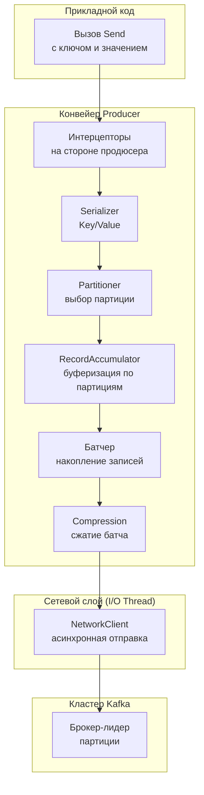
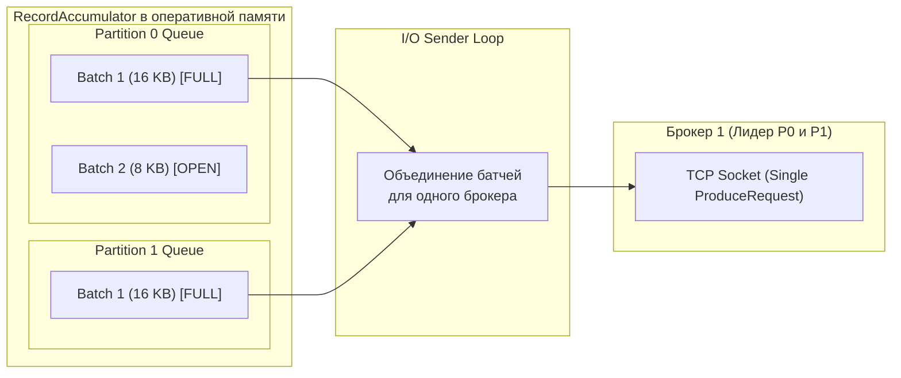
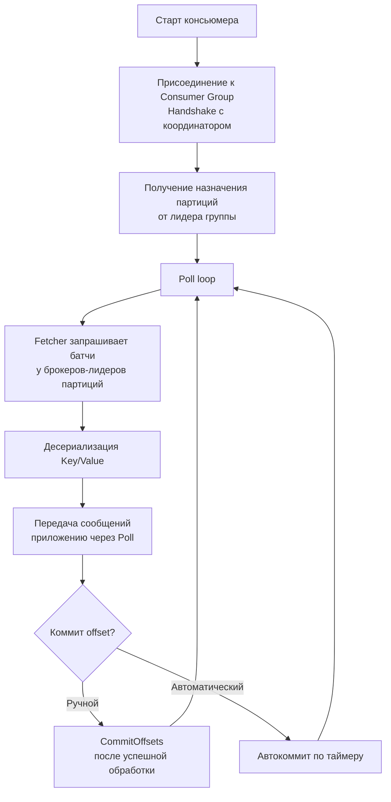
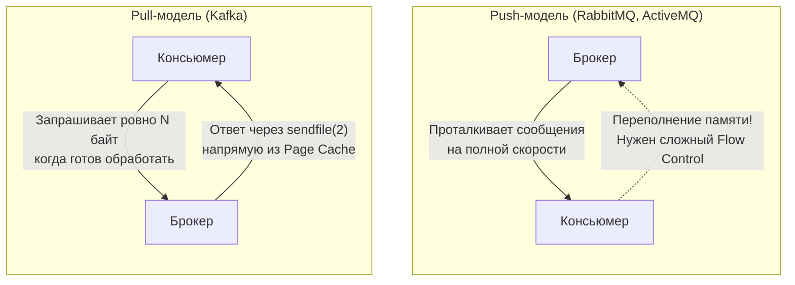

# 3. Producer и consumer: анатомия взаимодействия с распределенным логом

> *"To make a program fast, make it do less work. To make it do less work, batch its operations."*  
> — Стивен Борн, создатель Bourne shell

> [!NOTE]
> **Связи:** Эта статья — прямое продолжение [[2. Topics, partitions и offsets]], в котором мы рассмотрели физическую структуру лога. Теперь мы разберём, как приложения-отправители и получатели взаимодействуют с этим логом, опираясь на гарантии доставки из [[4. Модели доставки. At most once, at least once, exactly once]] и закладывая основу для групповой координации [[4. Consumer groups]].

---

## Две стороны одного лога

Любая распределенная система обмена сообщениями рано или поздно упирается в физику: пропускную способность шины PCI Express, задержки сетевых интерфейсов (NIC) и накладные расходы операционной системы на переключение контекста. Apache Kafka проектировалась с глубоким уважением к этим физическим ограничениям — с тем, что Мартин Томпсон назвал *Mechanical Sympathy* (механическим сочувствием к аппаратуре).

Kafka-клиент состоит из двух симметричных, но архитектурно противоположных сущностей: **Producer** (отправитель) и **Consumer** (получатель). Их объединяет фундаментальная цель — максимально эффективно перемещать байты между памятью пользовательских приложений и страничным кэшем ядра Linux, но достигается она противоположными механизмами:

- **Продюсер** работает как логистический распределительный центр: он агрегирует отдельные прикладные записи в плотно упакованные батчи, маскируя сетевые задержки и амортизируя системные вызовы операционной системы.
- **Консьюмер**, напротив, использует **pull-модель**: он самостоятельно вытягивает готовые батчи большими блоками, получая естественный контроль над темпом обработки (backpressure) и позволяя брокеру сбрасывать данные с диска прямо в сетевой сокет через механизм `Zero-Copy` без единого копирования в userspace.

---

## Producer: от вызова `Send` до битов на проводе

Продюсер — это не просто тонкая обёртка над сетевым сокетом. Внутри каждого промышленного продюсера скрыт сложный асинхронный конвейер, состоящий из сериализаторов, интерцепторов, партиционера, буфера накопления записей (`RecordAccumulator`), фонового потока ввода-вывода (NetworkClient) и компрессора. 

Каждый вызов метода отправки — это не блокирующий сетевой запрос к серверу, а быстрая операция добавления байтов в локальный буфер в памяти.

### Внутренний конвейер

Рассмотрим путь сообщения от прикладного кода до сетевого сокета:



Разберём каждый этап этого конвейера:

1. **Интерцепторы (ProducerInterceptor)** — выполняют сквозную модификацию метаданных, внедрение трейсинг-заголовков (OpenTelemetry W3C Trace Context) или аудит до попадания в сериализатор.
2. **Сериализация (Serializer)** — преобразует строго типизированные прикладные структуры данных (Go-структуры, Java POJO) в байтовые массивы. Для контроля за эволюцией схемы и обратной совместимостью используются Protobuf, Avro или JSON Schema совместно со Schema Registry ([[11. Schema Registry и эволюция схем]]).
3. **Partitioner** — определяет, в какую конкретно партицию топика отправится запись:
   - Если ключ задан: стандартный алгоритм хэширования `murmur2(key) % num_partitions` гарантирует, что все события по одной сущности (например, `order_id` или `user_id`) попадут в одну партицию и будут обработаны строго по порядку ([[5. Ordering и partitioning]]).
   - Если ключ пуст (`nil`): современный Kafka-клиент использует `StickyKeyPartitioner` (или встроенный UniformStickyPartitioner). Вместо наивного Round-Robin для каждого сообщения продюсер «прилипает» к одной партиции до тех пор, пока текущий батч не заполнится (`batch.size`) или не истечет таймер (`linger.ms`). Это снижает фрагментацию сети и формирует полновесные пакеты.
4. **RecordAccumulator** — сердце производительности продюсера. Это специализированный буфер в оперативной памяти, разделенный на очереди батчей по каждой партиции (`TopicPartition`). Прикладные горутины складывают сообщения в `RecordAccumulator` почти мгновенно, не дожидаясь ответа брокера.
5. **Батчер** — накапливает записи в текущем открытом буфере памяти. Когда размер буфера достигает границы `batch.size` или истекает таймер задержки `linger.ms`, батч «запечатывается» и помечается готовым к отправке.
6. **Compression** — сжатие целого батча с использованием алгоритмов gzip, snappy, lz4 или zstd. Сжатие на стороне продюсера драматически снижает сетевой трафик и дисковую нагрузку: брокер сохраняет сжатый батч на диск как есть, без распаковки, и консьюмер считывает его в сжатом виде, распаковывая уже на своей стороне!
7. **NetworkClient** — отдельный сетевой фоновый поток/горутина, использующий мультиплексирование неблокирующего ввода-вывода (epoll в Linux, kqueue в macOS/BSD, Java NIO). Он собирает готовые батчи для одного и того же брокера (даже если они принадлежат разным топикам и партициям) в один составной TCP-запрос `ProduceRequest`.



> [!info] Под капотом  
> Внутри `RecordAccumulator` работает пул буферов прямого доступа (`DirectByteBuffer` в Java, байтовые слайсы в Go), которые аллоцируются вне кучи GC, чтобы не создавать pressure на сборщик мусора. В Go-клиенте `franz-go` активно используется `sync.Pool` для переиспользования слайсов, что минимизирует аллокации и обеспечивает высокую пропускную способность. Память не запрашивается у ОС на каждое сообщение: буферы берутся из пула, заполняются и возвращаются обратно после получения подтверждения от брокера.

---

### Mechanical Sympathy: зачем нужен `linger.ms` и `batch.size`

Чтобы понять, почему архитектура продюсера устроена именно так, обратимся к физике процессора и операционной системы. 

Представьте курьера, которому поручено доставить письма из офиса в архив на другом конце города. Если курьер будет садиться на грузовик и ехать через весь город с одним конвертом в руке каждый раз, когда секретарь распечатывает документ — компания обанкротится на бензине и амортизации машины. Разумный секретарь складывает письма в лоток: если лоток заполнился до 100 писем — вызываем курьера; если лоток не полон, но прошло 10 минут — всё равно отправляем, чтобы адресат не ждал вечность.

В компьютерных системах сетевой вызов `write(2)` или `send(2)` на каждый одиночный байт — точно такая же катастрофа. Каждое сетевое сообщение несёт с собой фиксированные накладные расходы:
1. **Накладные расходы TCP/IP:** Заголовки Ethernet (14B), IP (20B) и TCP (20–32B) плюс служебные протокольные заголовки Kafka. Передача 50 байт полезной нагрузки в отдельном пакете означает потерю более 60% пропускной способности канала на служебные заголовки.
2. **Переключение контекста ядра (Context Switch):** Переход процессора из пространства пользователя (Ring 3) в режим ядра (Ring 0) для выполнения системного вызова ввода-вывода сбрасывает часть регистров и конвейера инструкций CPU, отнимая от сотен до тысяч процессорных тактов.
3. **Прерывания сетевой карты (NIC Interrupts):** Обработка миллионов крошечных пакетов нагружает ядра CPU обработкой программных прерываний (softirq).

Батчинг решает эту проблему в корне, находя идеальный баланс между пропускной способностью (throughput) и временем отклика (latency):

- **`batch.size`** (по умолчанию 16 КБ) — максимальный размер одного батча в памяти для конкретной партиции. Увеличение этого параметра (например, до 64 КБ, 256 КБ или 1 МБ в высоконагруженных системах) повышает пропускную способность за счёт уменьшения числа сетевых пакетов ценой небольшого потребления памяти.
- **`linger.ms`** (по умолчанию 0) — искусственная задержка перед отправкой не полностью заполненного батча. Если продюсер работает с `linger.ms = 0`, он отдаст батч сетевому потоку немедленно, как только сокет освободится для записи. Если же установить `linger.ms=5` (или 5–20 мс), продюсер подождёт указанное количество миллисекунд, давая приложению шанс дописать в этот же батч новые сообщения. В высоконагруженных системах с потоковой записью `linger.ms=5` практически не добавляет задержки, но радикально улучшает эффективность использования сети.

| Сценарий | `batch.size` | `linger.ms` | Поведение системы |
|---|:---:|:---:|---|
| **Минимальная задержка (Low Latency / Trading)** | 16 KB | 0–1 ms | Сообщения отправляются мгновенно; высокий RPS системных вызовов; сеть недоутилизирована |
| **Высокая пропускная способность (High Throughput / Logs, Metrics)** | 256 KB – 1 MB | 10–50 ms | Сообщения плотно пакуются; отличный коэффициент сжатия lz4/zstd; минимальный CPU overhead |
| **Сбалансированный бэкенд (Баланс по умолчанию)** | 64 KB | 5–10 ms | Оптимальное соотношение: задержка вырастает всего на единицы миллисекунд, а пропускная способность вырастает в 3–5 раз |

---

### Идемпотентный продюсер (Idempotent Producer)

В распределенных сетях сбои — это норма, а не аномалия. Представим классический сценарий:
1. Продюсер отправляет батч сообщений брокеру.
2. Брокер успешно записывает батч на диск и реплицирует его в ISR.
3. В момент отправки сетевого подтверждения (ACK) сетевой кабель временно теряет связь или происходит сброс TCP-соединения.
4. Продюсер получает таймаут, не знает, сохранено ли сообщение, и добросовестно повторяет отправку (retry).
5. Результат: **дубликат данных в логе!**

Чтобы избежать дублирования без перекладывания сложной логики дедупликации на плечи разработчиков, начиная с Kafka 0.11 был представлен **идемпотентный продюсер** (`enable.idempotence=true`), который с версии Kafka 3.0 включен по умолчанию.

```mermaid
sequenceDiagram
    autonumber
    actor App as Продюсер (PID 42)
    participant Broker as Брокер-лидер (Партиция 0)

    App->>Broker: InitProducerIdRequest
    Broker-->>App: Assigned PID = 42, Epoch = 0
    
    rect rgb(19, 29, 51)
        Note over App,Broker: Первая отправка (успех)
        App->>Broker: Produce(PID=42, SeqNum=0)
        Broker->>Broker: Сохранение в лог (offset=100)
        Broker-->>App: ACK (offset=100)
    end

    rect rgb(33, 20, 30)
        Note over App,Broker: Потеря сетевого ACK
        App->>Broker: Produce(PID=42, SeqNum=1)
        Broker->>Broker: Сохранение в лог (offset=101)
        Broker--xApp: ACK потерян в сети (Network Drop)
    end

    rect rgb(20, 35, 30)
        Note over App,Broker: Автоматический Retry продюсера
        App->>Broker: Produce(PID=42, SeqNum=1) [RETRY]
        Broker->>Broker: Проверка: SeqNum 1 уже записан! Дубликат отброшен.
        Broker-->>App: ACK (offset=101) [Дубликат не записан]
    end
```



Принцип работы идемпотентного продюсера:
1. При старте продюсер отправляет брокеру запрос `InitProducerIdRequest` и получает глобально уникальный 64-битный идентификатор — **Producer ID (PID)** и номер эпохи (Epoch).
2. Для каждой целевой партиции продюсер поддерживает монотонно возрастающий порядковый номер последовательности — **Sequence Number** (начиная с 0).
3. Принимая батч, брокер проверяет: `IncomingSeqNum == LastStoredSeqNum + 1`.
   - Если совпадает — данные пишутся в лог, а `LastStoredSeqNum` обновляется.
   - Если `IncomingSeqNum <= LastStoredSeqNum` — брокер понимает, что это дубликат из-за сетевого ретрая. Он **не пишет запись в лог повторно**, но возвращает продюсеру успешный `ACK`.
   - Если `IncomingSeqNum > LastStoredSeqNum + 1` — значит, произошла потеря сообщений в пути; брокер возвращает ошибку `OutOfOrderSequenceException`.

Это гарантирует **exactly-once семантику на уровне одной сессии продюсера в рамках одной партиции** без снижения производительности.

> [!warning] Ловушка / Gotcha  
> Идемпотентность продюсера спасает от дублирования, порождённого сетевыми ретраями, но она **не переживает перезапуск продюсера с потерей Producer ID**. При перезапуске процесс получит новый PID, и его последовательность `Sequence Number` начнётся заново. Для сквозного exactly-once между топиками и при перезапусках процессов используются Kafka Transactions (см. [[6. Exactly once в Kafka]]).

---

### Production-ready продюсер на Go (franz-go)

В экосистеме Go исторически использовался клиент `Shopify/sarama`, однако в современном высоконагруженном бэкенде отраслевым стандартом de-facto стал чистый Go-клиент `franz-go` (`github.com/twmb/franz-go`). Он превосходит альтернативы за счет:
- 100% реализации на Go (без CGO-зависимостей от `librdkafka`);
- Экстремальной оптимизации аллокаций памяти (`sync.Pool`);
- Полной поддержки всех современных KIP (включая KRaft, KIP-500, гибкие протоколы версионирования).

Ниже приведен эталонный пример отказоустойчивого асинхронного продюсера на Go:

```go
package main

import (
	"context"
	"fmt"
	"log"
	"time"

	"github.com/twmb/franz-go/pkg/kgo"
)

func main() {
	// Создание клиента с production-настройками
	cl, err := kgo.NewClient(
		kgo.SeedBrokers("localhost:9092"),
		// Включаем подтверждение от всех реплик в ISR (In-Sync Replicas)
		kgo.RequiredAcks(kgo.AllISRAcks()),
		// Время на автоматические ретраи при сбоях сети или смене лидеров
		kgo.RetryTimeout(30*time.Second),
		// StickyKeyPartitioner оптимизирует батчинг при отсутствии ключа
		kgo.RecordPartitioner(kgo.StickyKeyPartitioner(nil)),
		// Накопление батча до 1 МБ
		kgo.BatchMaxBytes(1<<20),
		// Устанавливаем задержку linger для эффективного накопления записей
		kgo.Linger(5 * time.Millisecond),
		// Сжатие батчей алгоритмом zstd (баланс скорости и сжатия)
		kgo.ProducerBatchCompression(kgo.ZstdCompression()),
	)
	if err != nil {
		log.Fatalf("failed to create kafka client: %v", err)
	}
	defer cl.Close()

	ctx, cancel := context.WithTimeout(context.Background(), 10*time.Second)
	defer cancel()

	// Асинхронная запись: прикладная горутина не блокируется в ожидании сети
	record := &kgo.Record{
		Topic: "orders",
		Key:   []byte("cust-12345"),
		Value: []byte(`{"order_id":"xyz","amount":250}`),
	}

	cl.Produce(ctx, record, func(r *kgo.Record, err error) {
		if err != nil {
			// Обработка критической ошибки после исчерпания всех ретраев
			log.Printf("failed to deliver record to topic %s: %v", r.Topic, err)
			return
		}
		fmt.Printf("Delivered to partition %d at offset %d (timestamp: %v)\n",
			r.Partition, r.Offset, r.Timestamp)
	})

	// Принудительный сброс всех накопленных буферов перед завершением сервиса
	if err := cl.Flush(ctx); err != nil {
		log.Fatalf("flush failed: %v", err)
	}
	fmt.Println("All accumulated batches have been successfully flushed.")
}
```

---

## Consumer: pull-based разгрузка лога

В отличие от традиционных брокеров очередей (например, RabbitMQ), которые проталкивают сообщения (push) в TCP-сокеты потребителей, архитектура Kafka фундаментально построена на **pull-модели**. Консьюмер сам опрашивает брокера, отправляя сетевой запрос `FetchRequest` и запрашивая следующую порцию данных.

Это даёт потребителю полный контроль над темпом обработки, исключает переполнение его локальных буферов и обеспечивает естественный backpressure ([[6. Backpressure и контроль нагрузки]]).

### Внутренний цикл консьюмера

Жизненный цикл консьюмера состоит из двух уровней: координации в группе и регулярного цикла опроса лога (`Poll loop`).



Ключевые компоненты и протокольные механизмы консьюмера:

1. **Координатор группы (Group Coordinator)** — один из брокеров кластера Kafka (ответственный за партицию внутреннего топика `__consumer_offsets`, в которую попадает хэш имени группы). Он управляет членством в группе, отслеживает heartbeat-сообщения и инициирует ребалансировку.
2. **Лидер группы (Group Leader)** — один из консьюмеров группы (обычно первый подключившийся). Координатор передает лидеру список всех живых участников, и лидер вычисляет распределение партиций по выбранной стратегии (Range, RoundRobin, Sticky, CooperativeSticky) и возвращает план координатору.
3. **Fetcher** — внутренний компонент, занимающийся асинхронной предвыборкой (`prefetch`) батчей с брокеров. Консьюмер не ждёт ответа брокера на каждый вызов `Poll`: Fetcher в фоновом режиме запрашивает новые батчи из брокеров-лидеров назначенных партиций, заполняя внутреннюю очередь.
4. **Heartbeat** — фоновые сигналы жизнедеятельности (по умолчанию отправляются каждые 3 секунды), подтверждающие координатору, что данный консьюмер жив. Если брокер не получает heartbeat дольше интервала `session.timeout.ms` (по умолчанию 45 с), консьюмер признаётся выпавшим из кластера, и координатор объявляет ребалансировку.
5. **`max.poll.interval.ms`** — максимальное допустимое время между последовательными вызовами метода `Poll` (по умолчанию 5 минут). Это защита от «зависших» или перегруженных воркеров. Если приложение заблокировалось при обработке батча (например, на тяжелом SQL-запросе) и не успело вызвать `Poll` до истечения таймаута, клиент самостоятельно покидает группу, чтобы не тормозить чтение партиции.

> [!warning] Ловушка / Gotcha  
> В Go-консьюмере нельзя блокировать горутину, вызывающую `Poll`, на длительное время (например, тяжелой синхронной записью в базу данных или обращением к внешнему HTTP API). Это приведет к превышению `max.poll.interval.ms` и возникновению **шторма бесконечных ребалансировок** (rebalance storm): группа перераспределяет партиции, брокер отзывает их у зависшего воркера, другой воркер берет тот же батч, тоже зависает, и весь консьюмерский кластер встает колом! Сообщения всегда нужно передавать пулу рабочих горутин, оставляя цикл `Poll` быстрым и непрерывным.

---

### Управление смещениями: автоматический vs ручной коммит

Смещение (offset) — это закладка в книге лога. То, как именно консьюмер обновляет эту закладку во внутреннем топике `__consumer_offsets`, определяет гарантии надёжности обработки данных:

- **Автоматический коммит** (`enable.auto.commit=true`) — каждые `auto.commit.interval.ms` (по умолчанию 5 секунд) клиент автоматически фиксирует максимальный offset, полученный при предыдущих вызовах `Poll`. 
  - *Плюсы:* Предельная простота прикладного кода.
  - *Риски:* Высокая вероятность **потери данных** (если воркер получил сообщения, закоммитил смещение по таймеру, но упал с panic до реальной записи в БД) либо **дублирования сообщений** (если падение произошло до истечения таймера коммита).
- **Ручной коммит** (`enable.auto.commit=false`) — приложение явно вызывает методы `CommitOffsets` (синхронно или асинхронно) строго после того, как все побочные эффекты (запись в БД, вызов платежного шлюза) успешно зафиксированы.
  - *Плюсы:* Надежная семантика доставки **at-least-once** («как минимум один раз»).
  - *Стратегия:* При сбое узел перезапускается и перечитывает последние незакоммиченные сообщения с момента предыдущей фиксации.

Для построения сквозного `exactly-once` на стороне консьюмера ручной коммит комбинируют с паттерном **Идемпотентного потребителя** ([[4. Idempotent handlers]]), сохраняя обработанный бизнес-идентификатор в уникальном индексе базы данных в рамках одной локальной транзакции.

---

### Производительный консьюмер на Go

Ниже представлен production-ready консьюмер на `franz-go`, реализующий конкурентную обработку сообщений по партициям, корректную обработку сигналов завершения ОС (Graceful Shutdown) и безопасный ручной коммит смещений:

```go
package main

import (
	"context"
	"fmt"
	"log"
	"os/signal"
	"sync"
	"syscall"
	"time"

	"github.com/twmb/franz-go/pkg/kgo"
)

func main() {
	// Перехват сигналов завершения для корректного выхода из группы (Graceful Shutdown)
	ctx, stop := signal.NotifyContext(context.Background(), syscall.SIGINT, syscall.SIGTERM)
	defer stop()

	cl, err := kgo.NewClient(
		kgo.SeedBrokers("localhost:9092"),
		kgo.ConsumerGroup("order-processors"),
		kgo.ConsumeTopics("orders"),
		// Отключаем автокоммит для предотвращения потери сообщений
		kgo.DisableAutoCommit(),
		// Настройки heartbeats и таймаутов обнаружения сбоев
		kgo.SessionTimeout(30*time.Second),
		kgo.HeartbeatInterval(3*time.Second),
		// Cooperative Sticky стратегия позволяет ребалансироваться без Stop-the-World
		kgo.Balancers(kgo.CooperativeStickyBalancer()),
	)
	if err != nil {
		log.Fatalf("failed to create consumer client: %v", err)
	}
	defer cl.Close()

	var wg sync.WaitGroup
	fmt.Println("Consumer started. Waiting for partition assignment...")

	for {
		// Опрос брокера: возвращает батчи записей по всем назначенным партициям
		fetches := cl.PollFetches(ctx)
		if fetches.IsClientClosed() {
			break
		}
		if ctx.Err() != nil {
			// Получен сигнал SIGINT/SIGTERM, прекращаем опрос
			break
		}
		if errs := fetches.Errors(); len(errs) > 0 {
			log.Printf("fetch warnings/errors: %v", errs)
			continue
		}

		// Параллельная обработка каждой партиции в отдельной горутине.
		// Внутри ОДНОЙ партиции порядок сообщений сохраняется строго последовательно!
		fetches.EachPartition(func(ftp kgo.FetchTopicPartition) {
			wg.Add(1)
			go func(p kgo.FetchTopicPartition) {
				defer wg.Done()

				for _, record := range p.Records {
					// Бизнес-логика: идемпотентная обработка заказа
					processOrder(record)
				}

				// Коммит смещений выполняется только после успешной обработки всех записей партиции!
				// cl.CommitUncommittedOffsets фиксирует максимальный прочитанный offset
				if err := cl.CommitUncommittedOffsets(context.Background()); err != nil {
					log.Printf("failed to commit offsets for partition %d: %v", p.Partition, err)
				}
			}(ftp)
		})
	}

	fmt.Println("Shutting down consumer, waiting for pending partition workers...")
	wg.Wait()
	fmt.Println("All partition workers finished. Exiting gracefully.")
}

func processOrder(r *kgo.Record) {
	fmt.Printf("[Partition %d | Offset %d] Processed key=%s val_len=%d\n",
		r.Partition, r.Offset, string(r.Key), len(r.Value))
}
```

---

## Pull vs Push: почему не push?

Выбор pull-модели для Kafka — не случайность и не исторический курьёз, а фундаментальное архитектурное решение, продиктованное механической симпатией к дисковой и сетевой подсистеме современного оборудования:



1. **Естественный Backpressure «из коробки»:**
   - В традиционных push-системах (RabbitMQ, классические RPC) брокер пытается протолкнуть данные получателю как можно быстрее. Если потребитель замедлился (например, база данных деградировала по задержке), брокер заваливает его сетевыми пакетами. Чтобы не упасть с `Out of Memory`, системе требуется сложный двусторонний протокол управления потоком (flow control, credit-based rate limiting, pause/resume).
   - В pull-модели консьюмер запрашивает новую порцию данных **только тогда, когда закончил обработку предыдущей**. Замедлился консьюмер — он просто реже вызывает `poll`. Брокер даже не замечает этого, сохраняя сообщения на диске. Backpressure возникает автоматически, как фундаментальный закон природы.
2. **Агрессивный сетевой батчинг на чтении:**
   - Консьюмер запрашивает данные большими порциями (параметры `fetch.min.bytes`, `fetch.max.bytes`, например, до 50 МБ за один сетевой round-trip). В push-модели брокеру пришлось бы принимать решение: отправить ли одно сообщение сейчас или подождать? В pull-модели консьюмер говорит: «Дай мне все накопившиеся записи вплоть до 10 МБ», минимизируя накладные расходы протокола.
3. **Zero-Copy до последнего байта:**
   - Поскольку консьюмер запрашивает непрерывный диапазон смещений из конкретной партиции, брокеру не нужно разбирать записи в пользовательской памяти! 
   - Ядро Linux выполняет системный вызов `sendfile(2)` (или `splice(2)`), который переносит данные из страничного кэша (Page Cache) прямо в DMA-буфер сетевой карты, минуя пространство пользователя брокера. Никаких аллокаций в JVM/Go-рантайме брокера, никакой нагрузки на GC!

---

> [!tip] Вопрос с собеседования  
> **Вопрос:** «Что произойдет, если в Go-консьюмере обработка одного батча в вызове `Poll` займет 7 минут при `max.poll.interval.ms = 300000` (5 минут)? Поможет ли то, что фоновая горутина исправно шлет heartbeats брокеру?»  
> **Ответ:** Фоновые heartbeats (`session.timeout.ms`) подтверждают лишь то, что процесс консьюмера физически жив и сетевой сокет открыт. Однако брокер расценивает превышение `max.poll.interval.ms` как признак того, что консьюмер **завис логически** (deadlock, вечный цикл, зависший запрос к БД). Координатор принудительно исключит консьюмера из группы и запустит ребалансировку, отдав его партиции другому инстансу. Когда «зависший» консьюмер наконец очнется через 7 минут и попытается закоммитить свои offsets, брокер отклонит коммит с ошибкой `CommitFailedException` (партиции уже принадлежат другому узлу), что неизбежно приведет к повторной обработке и дубликатам. Для решения проблемы следует либо уменьшать размер вычитываемого батча (`max.poll.records`), либо выносить тяжелую работу в пул горутин.

---

## Заключение и следующие шаги

Внутреннее устройство Producer и Consumer в Kafka подчинено одной доминирующей идее — максимальной эффективности утилизации железа. Батчинг на стороне продюсера через `RecordAccumulator`, аккуратная балансировка `linger.ms` и `batch.size`, аппаратное сжатие целых пакетов и pull-модель консьюмера с опорой на `sendfile(2)` и страничный кэш ядра превращают Kafka в высокопроизводительную конвейерную магистраль данных.

Теперь, когда механика одиночных отправителей и получателей ясна, мы готовы перейти к масштабированию: как распределить чтение огромного топика из сотен партиций между десятками параллельно работающих сервисов? 

В следующей статье — [[4. Consumer groups]] — мы детально разберем внутреннюю кухню координатора групп, протоколы Rebalance (Eager vs Incremental Cooperative) и то, как избежать деградации сервиса при выкатке новых релизов.