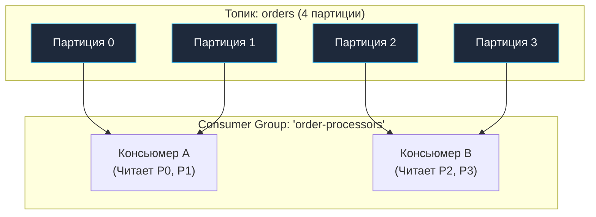
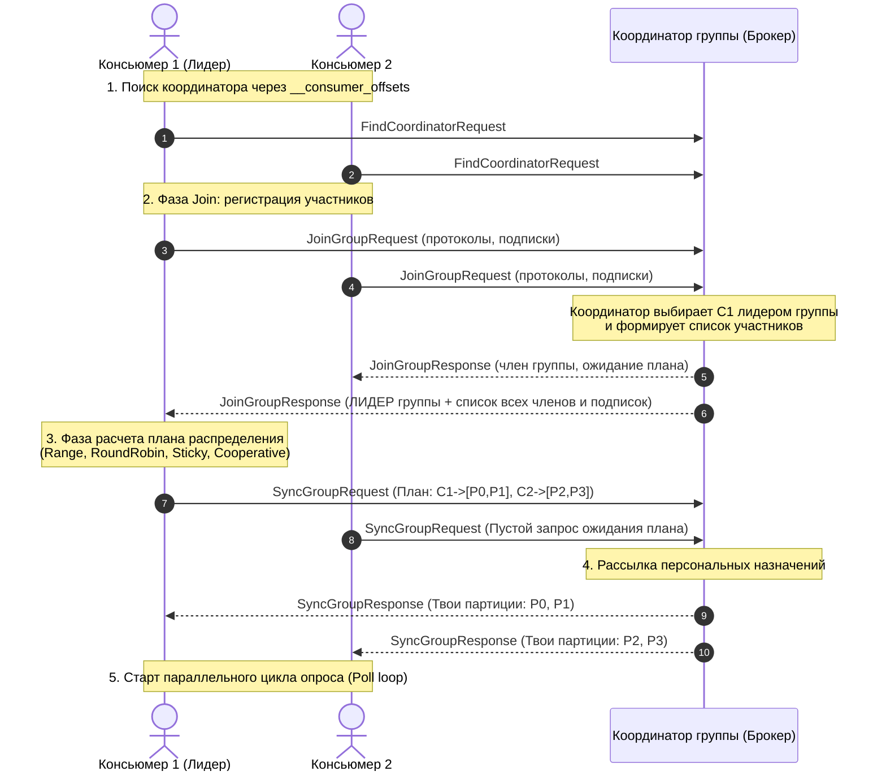
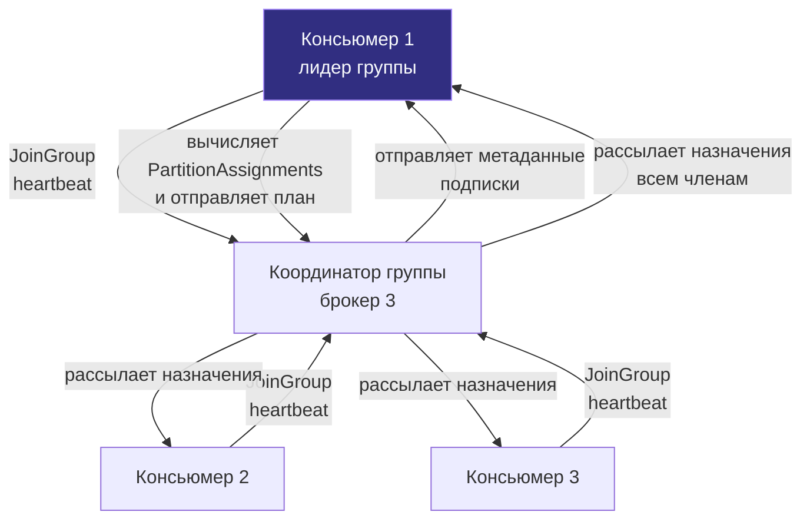
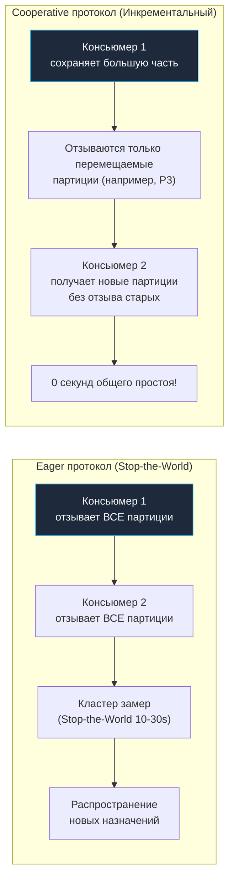
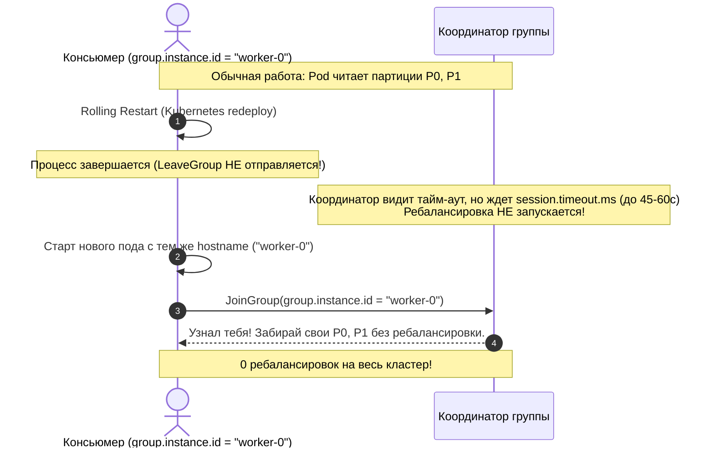

# 4. Consumer groups: координация, ребалансировка и параллелизм

> *«Секрет построения масштабных систем заключается не в создании гигантской машины, а в координации множества мелких независимых воркеров так, чтобы они не наступали друг другу на пятки».*    
> — Брайан Керниган

> [!NOTE]
> **Связи:** Эта статья продолжает темы, заложенные в [[2. Topics, partitions и offsets]] и [[3. Producer и consumer]]. Мы переходим от индивидуальных клиентов к координированной групповой обработке — ключевому механизму масштабирования и отказоустойчивости потребления в Kafka.

---

## Что такое Consumer Group и зачем она нужна

В традиционных очередях сообщений (например, классическом RabbitMQ) реализация паттерна **Competing Consumers** (конкурирующие потребители) строится вокруг конкуренции за каждое отдельное сообщение: десятки воркеров слушают одну очередь, брокер распределяет по одному сообщению каждому свободному процессу, а процессорные ядра и сеть тратят ресурсы на постоянную координацию, блокировки и подтверждения (ACKs) на уровне единичных пакетов.

Apache Kafka подошла к проблеме с совершенно иной стороны. Вместо конкуренции за отдельные сообщения Kafka ввела абстракцию **Consumer Group** (потребительская группа), где единицей параллелизма является **целая партиция лога**:

Consumer Group — это логическое объединение одного или нескольких независимых процессов-консьюмеров, совместно вычитывающих данные из одного или нескольких топиков. 

Фундаментальное правило группы формулируется предельно строго:
> **Каждая партиция топика в любой момент времени назначается строго одному консьюмеру внутри данной группы.**

Это элегантное архитектурное разделение дает сразу три мощнейших преимущества:
1. **Строгий порядок без блокировок:** Поскольку партицию читает только один воркер, сообщения внутри неё обрабатываются строго монотонно по возрастанию их `offset` — без единого мьютекса или распределенной блокировки.
2. **Нулевая координация во время обработки:** В процессе нормальной работы консьюмеры вообще не общаются друг с другом! Каждый просто вытягивает данные из назначенного ему сегмента лога через `fetch`-запросы.
3. **Эластичное горизонтальное масштабирование:** Чтобы удвоить скорость обработки, достаточно запустить ещё один инстанс сервиса — группа автоматически разделит партиции поровну.

С точки зрения системного дизайна Consumer Group реализует паттерн **Competing Consumers** поверх секционированного лога: конкуренция идёт не за отдельные сообщения, а за целые партиции. Благодаря этому устраняется необходимость в координационных блокировках на уровне отдельных сообщений и достигается очень высокая пропускная способность.

---

## Архитектура координации

Группа не существует как физический процесс на сервере — это протокольная конструкция. Координация членства и распределение партиций опираются на тандем двух сущностей:
- **Координатор группы (Group Coordinator)** — серверный компонент: один из брокеров кластера Kafka, персонально отвечающий за жизненный цикл конкретной группы.
- **Лидер группы (Group Leader)** — клиентский компонент: один из консьюмеров группы, которому координатор делегирует вычисление математического плана распределения партиций.

Пошаговый алгоритм координации:

1. **Определение координатора:** Каждый консьюмер при старте вычисляет своего координатора. Для этого имя группы хэшируется: `Math.abs(groupId.hashCode()) % offsetsTopicPartitionCount` (по умолчанию 50 партиций топика `__consumer_offsets`). Брокер, являющийся лидером полученной партиции, становится персональным координатором группы.
2. **Фаза JoinGroup:** Консьюмеры посылают сетевой запрос `JoinGroup`, сообщая поддерживаемые стратегии распределения (`partition.assignment.strategy`) и список интересующих топиков.
3. **Выбор лидера:** Координатор фиксирует состав участников. Первый ответивший консьюмер назначается **Лидером группы**. Координатор отправляет лидеру полный реестр всех активных участников и их подписок, а остальным участникам сообщает, что они приняты и должны ожидать распределения.
4. **Фаза SyncGroup:** Лидер группы локально запускает выбранный алгоритм партиционирования (`Partition Assignor`), формирует итоговый план `PartitionAssignments` (какой участник какие партиции читает) и передает его координатору в запросе `SyncGroup`. Рядовые участники также шлют пустые запросы `SyncGroup`.
5. **Активация:** Координатор распаковывает план лидера и рассылает в ответах `SyncGroup` каждому участнику строго его персональный список партиций. Консьюмеры подключаются к лидерам назначенных партиций и запускают рабочий цикл опроса `Poll`.

> [!info] Под капотом
> Протокол Consumer Group — это серия RPC-запросов поверх бинарного протокола Kafka (Kafka wire protocol). Каждый консьюмер поддерживает постоянное TCP-соединение с координатором (heartbeat-ы и коммиты) и отдельные соединения с брокерами, содержащими назначенные ему партиции (fetch-запросы). В Go-клиентах, например `franz-go`, эти соединения управляются пулом горутин, каждая из которых обслуживает одно TCP-соединение с неблокирующим циклом чтения/записи. Делегирование расчета распределения клиенту-лидеру — гениальный архитектурный ход: если вам потребуется нестандартная логика распределения (например, с учетом доступных ресурсов CPU или географической зоны AZ), вам не нужно перекомпилировать брокеры Kafka — достаточно реализовать собственный плагин распределения на клиенте!

---

## Ребалансировка: центральный механизм живучести

Ребалансировка (rebalance) — это процесс перераспределения партиций между членами группы при изменении её состава или при изменении набора партиций в топике. Она обеспечивает эластичность: при падении консьюмера его партиции переходят к оставшимся; при добавлении нового консьюмера нагрузка перераспределяется.

События, запускающие ребалансировку:
- Новый консьюмер присоединяется к группе (например, автоскейлинг пода в Kubernetes).
- Существующий консьюмер покидает группу (штатное завершение процесса с отправкой `LeaveGroup`).
- Консьюмер аварийно завершился, завис или потерял связь с сетью (сработал `session.timeout.ms`).
- Консьюмер долго не вызывает `Poll` (превышение `max.poll.interval.ms`).
- Число партиций в подписанном топике изменяется администратором (`kafka-topics --alter --partitions`).

### Heartbeat и Session Timeout

Каждый консьюмер периодически отправляет координатору `Heartbeat`-запросы (по умолчанию каждые 3 секунды). Если координатор не получает heartbeat дольше `session.timeout.ms` (по умолчанию 45 с), консьюмер исключается из группы и инициируется ребалансировка.

Важно: heartbeat отправляются **фоновым потоком** (в Go — отдельной горутиной), поэтому они не блокируются длительной обработкой сообщений в основном цикле. Это позволяет избежать ложных исключений даже при обработке тяжёлых батчей.

### Max.poll.interval.ms — отдельный страж

Помимо heartbeat-ов, существует `max.poll.interval.ms` (по умолчанию 5 минут) — максимальное время между двумя вызовами `Poll`. Если консьюмер не вызывает Poll дольше этого интервала, он считается «зависшим» и покидает группу, даже если heartbeat-ы продолжают приходить.

Зачем нужен этот второй таймер? Представьте ситуацию: приложение попало в бесконечный цикл обработки, заблокировалось на deadlock в мьютексе или ждет ответа от зависшей сторонней базы данных. Фоновая горутина исправно шлет heartbeat-ы («я жива!»), но прикладная логика стоит. Если бы Kafka ориентировалась только на heartbeat, партиции «зависшего» воркера замерли бы навечно. 

Таймаут `max.poll.interval.ms` служит строгим сторожевым таймером (watchdog): не успел забрать следующую порцию за 5 минут — отдай партиции здоровым коллегам.

> [!warning] Ловушка / Gotcha
> В Go-приложениях нельзя выполнять медленные синхронные операции внутри цикла, вызывающего `Poll` (например, транзакцию в БД с длительным ожиданием). Это может привести к превышению `max.poll.interval.ms` и бесконечным ребалансировкам. Решение: передавать полученные сообщения в worker-пул или отдельные горутины, немедленно возвращаясь к `Poll`, как показано в предыдущей статье [[3. Producer и consumer]].

---

## Стратегии распределения партиций (Partition Assignment Strategies)

От выбора стратегии зависит не только баланс нагрузки, но и стабильность группы. Стратегия задаётся параметром `partition.assignment.strategy` в конфигурации консьюмера.

### 1. Range Assignor (по умолчанию)

Самый простой и исторически первый алгоритм. Партиции каждого топика делятся на непрерывные диапазоны и раздаются консьюмерам.

Алгоритм: для каждого топика отдельно сортируются партиции и члены группы, затем каждый консьюмер получает непрерывный отрезок. 

Формула: консьюмер $i$ получает диапазон размера $N / M$, где $N$ — число партиций топика, $M$ — число консьюмеров. Если деление дает остаток, первые участники получают на одну партицию больше.

*Проблема Range Assignor:* Если сервис подписан на 10 топиков, в каждом из которых по 3 партиции, а в группе 2 консьюмера:
- Консьюмер 1 получит партиции 0 и 1 из каждого топика (итого **20 партиций**).
- Консьюмер 2 получит партицию 2 из каждого топика (итого **10 партиций**).
Возникает 100% дисбаланс нагрузки!

### 2. RoundRobin Assignor

Все партиции всех топиков, на которые подписана группа, складываются в один общий упорядоченный список и поочередно («по кругу») распределяются между членами группы.

Обеспечивает почти идеальный баланс по числу партиций. Однако у RoundRobin есть серьезный недостаток: алгоритм не сохраняет текущее владение партициями. При добавлении или падении всего одного участника партиции перемешиваются случайным образом между всеми оставшимися узлами, что сбрасывает локальные кэши.

### 3. Sticky Assignor

Стратегия стремится к двум взаимодополняющим целям:
1. **Равномерность:** Максимально сбалансированное количество партиций на каждого участника.
2. **Липкость (Sticky):** Максимальное сохранение существующих назначений между ребалансировками. 

Если консьюмер временно покидает группу и возвращается, Sticky стремится вернуть ему те же партиции. Если удаляется один консьюмер, забираются только его партиции и распределяются между оставшимися — назначения остальных участников не трогаются. Это минимизирует накладные расходы на передачу состояния между консьюмерами.

### 4. Cooperative Sticky Assignor (инкрементальная ребалансировка)

Исторический бич Kafka в больших кластерах — протокол **Eager Rebalance** («жадная» ребалансировка). Когда в кластер из 100 консьюмеров добавлялся 101-й, все 100 консьюмеров принудительно отзывали **все 100% своих партиций**, сбрасывали смещения и замирали в ожидании нового распределения. Наступал полный **Stop-the-World** конвейера обработки данных на 15–40 секунд!

KIP-429 представил революционный **Cooperative Sticky Assignor** — инкрементальный протокол ребалансировки:

Как работает инкрементальная кооперативная ребалансировка:
1. **Раунд 1:** Все консьюмеры продолжают вычитывать назначенные им партиции. Вычисляется новое распределение. Консьюмеры получают указание освободить **только те партиции**, которые должны мигрировать на другие узлы. Все остальные партиции продолжают непрерывно обрабатываться!
2. **Раунд 2:** Освобожденные партиции передаются новым владельцам.

Cooperative Sticky опирается на протокол `ConsumerProtocolAssignment` с версией 2, в котором консьюмер может держать партиции во время ребалансировки и отзывать только те, что указаны в плане. Это кардинально улучшает стабильность больших групп и рекомендуется для всех production-систем.

---

## Статическое членство (Static Group Membership)

В современных облачных средах (Kubernetes, Nomad) микросервисы постоянно перезапускаются: rolling update новой версии контейнера, плановый перенос пода на другую ноду, обновление конфигурации. В классической модели Kafka каждый перезапуск контейнера приводил к следующему:
1. Под завершается $\to$ координатор фиксирует уход `member.id` $\to$ **Ребалансировка группы!**
2. Под поднимается через 10 секунд с новым `member.id` $\to$ **Вторая ребалансировка группы!**
3. Если у вас 20 подов, то при обычном rolling deploy кластер переживал 40 последовательных ребалансировок, погружаясь в перманентный шторм деградации пропускной способности.

Для решения этой проблемы в KIP-345 было введено **Статическое членство (Static Group Membership)**.

По умолчанию каждый перезапуск консьюмера приводит к смене его идентификатора (`member.id`), что вызывает полную ребалансировку. **Static Membership** позволяет закрепить за инстансом постоянный `group.instance.id` — строковый идентификатор, который не меняется между перезапусками. В Kubernetes в качестве `group.instance.id` идеально использовать имя пода (`StatefulSet` pod name или hostname).

Если консьюмер с известным `group.instance.id` временно отключается (например, при rolling restart), он может переподключиться в течение `session.timeout.ms` и сохранить свои партиции **без ребалансировки**. Это критично для стабильности stateful-потоковых приложений, хранящих локальное состояние в RocksDB (как в Kafka Streams).

---

## Влияние на производительность и механическая симпатия

Consumer Group — это не просто абстрактный протокол распределения задач: его внутренняя механика напрямую завязана на аппаратные характеристики оборудования и системные вызовы ядра ОС:

- **Максимальный предел параллелизма:** Жестко ограничен количеством партиций в топике. Если топик разбит на 8 партиций, а в группе запущено 12 консьюмеров, ровно 4 консьюмера будут абсолютно бесполезно простаивать, не получая ни байта данных. Если требуется увеличить параллелизм — необходимо сначала шардировать топик (добавить партиций через alter topic).
- **Локальность данных и страничный кэш ядра (Page Cache):** 
  Когда консьюмер стабильно читает закрепленную за ним партицию 0, ядро Linux применяет агрессивную упреждающую подкачку страниц (**Sequential Read-Ahead**). Страничный кэш на сервере всегда горячий и держит нужные смещения в быстрой оперативной памяти.
  Постоянные ребалансировки и миграции партиций с узла на узел сбрасывают окно упреждающего чтения ядра, «охлаждают» системный кэш и заставляют брокер выполнять дорогостоящие случайные дисковые чтения (I/O Read IOPS) с NVMe/SSD.
- **Сетевые всплески при ребалансировке:** В момент назначения новых партиций консьюмеру нужно загрузить метаданные о смещениях, найти нового лидера каждой партиции и начать fetch-цикл. Это порождает лавинообразный всплеск соединений и запросов по всему кластеру. Cooperative Sticky смягчает этот эффект, позволяя обрабатывать часть партиций в процессе ребалансировки.

---

## Практические выводы и собеседование

Consumer Group — обязательная тема на собеседованиях уровня Middle+ и Senior. Типовые вопросы:

> [!tip] Собеседование
> **Вопрос:** Что происходит с Consumer Group, если один из консьюмеров зависает (долго не вызывает `Poll`)?  
> **Ответ:** По истечении `max.poll.interval.ms` (по умолчанию 5 минут) координатор исключает зависшего консьюмера из группы и инициирует ребалансировку. Его партиции перераспределяются между оставшимися членами. Heartbeat-ы при этом могут продолжать приходить — это два независимых механизма контроля живости.

> [!tip] Собеседование
> **Вопрос:** Почему не рекомендуется использовать автоматический коммит смещений в consumer group с асинхронной обработкой?  
> **Ответ:** Автокоммит фиксирует offset последнего возвращённого Poll-ом сообщения, независимо от того, завершилась ли его реальная обработка. Если приложение упадёт после Poll, но до завершения бизнес-логики, сообщение будет потеряно. Поэтому при асинхронной обработке обычно используют ручной коммит после подтверждения записи в БД или идемпотентный обработчик ([[4. Idempotent handlers]]).

> [!tip] Собеседование
> **Вопрос:** Чем отличается `Eager Rebalance` от `Cooperative Sticky Rebalance`?  
> **Ответ:** В протоколе `Eager` все участники группы отзывают 100% своих партиций и полностью останавливают чтение данных (Stop-the-World) на всё время перераспределения. В `Cooperative Sticky` ребалансировка выполняется инкрементально в два раунда: воркеры продолжают вычитывать неизменившиеся партиции, а отзываются только те конкретные партиции, которые физически перемещаются на другой узел. Простой потока обработки сводится к нулю.

---

## Заключение и дальнейшие шаги

Consumer Groups — это сердце параллельного потребления в Kafka. Они превращают партицированный лог в масштабируемый вычислительный конвейер, где каждый консьюмер получает эксклюзивный доступ к своему сегменту данных. Грамотный выбор стратегии распределения партиций, настройка таймаутов и понимание механизмов ребалансировки позволяют строить устойчивые системы с минимальными простоями.

Теперь, когда мы освоили групповую координацию, самое время вновь обратиться к партициям с новой стороны: в [[5. Ordering и partitioning]] мы разберём, как гарантировать порядок обработки в распределённом логе и как стратегии партиционирования влияют на архитектуру консьюмеров.