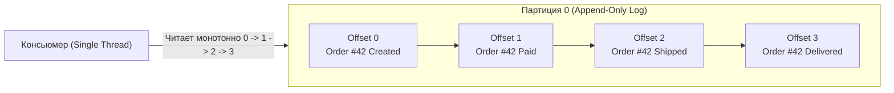
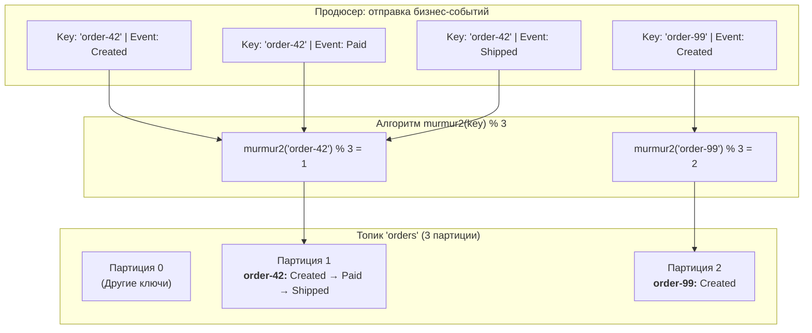
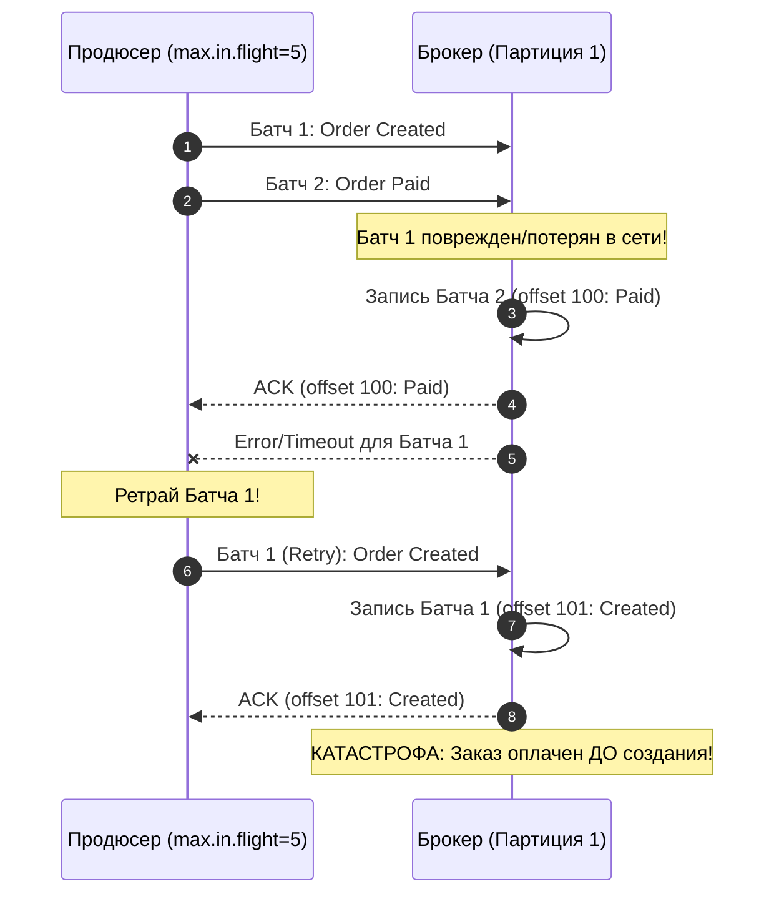
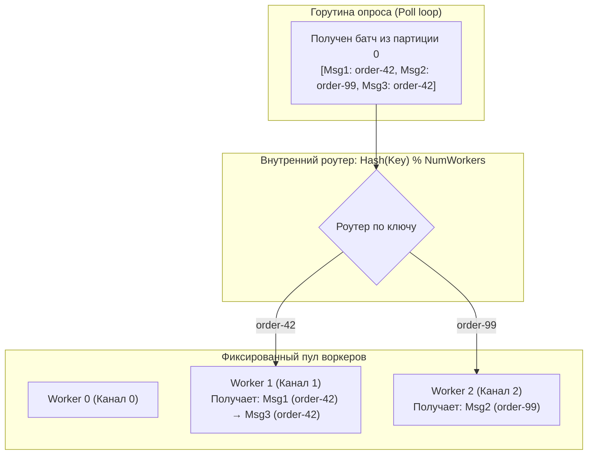

# 5. Ordering и partitioning: причинность, ключи и параллелизм в распределенном логе

> *"Time, clocks, and the ordering of events in a distributed system are not absolute; they are an artifact of the communication channels we choose to construct."*  
> — Лесли Лэмпорт, лауреат премии Тьюринга

> [!NOTE]
> **Связи:** Эта статья развивает темы, начатые в [[2. Topics, partitions и offsets]] и [[4. Consumer groups]], и закладывает основу для понимания гарантий exactly-once в [[6. Exactly once в Kafka]] и паттернов [[5. Ordering и partitioning]] в распределённых системах.

---

## Почему упорядоченность — вызов в распределённых системах

В монолитных системах и простых очередях сообщений (например, одиночной очереди в оперативной памяти процесса) строгий порядок первого пришедшего (FIFO — First-In, First-Out) даётся практически даром: один поток записывает события в циклический буфер, другой поток их вычитывает. 

Но как только мы переходим к горизонтально масштабируемым распределенным системам, где терабайты данных ежесекундно обрабатываются сотнями серверов, **глобальный порядок становится фундаментальным физическим препятствием**:

1. **Теория относительности и задержки сигналов:** В распределенной сети нет единого абсолютного «сейчас». Сетевые пакеты между дата-центрами испытывают джиттер, физические кварцевые часы серверов расходятся (clock drift), а маршрутизаторы меняют пути следования пакетов.
2. **Цена глобальной упорядоченности:** Чтобы обеспечить абсолютно строгий глобальный порядок для всех событий в системе, вам потребуется **единая точка сериализации** — один процессор или один узел-координатор, через который обязаны пройти абсолютно все запросы. Это немедленно превращает систему в бутылочное горлышко: производительность всей вашей мировой инфраструктуры деградирует до скорости одного потока CPU и сетевой задержки до одного сервера.

Apache Kafka предлагает зрелое инженерное решение этой дилеммы: **отказ от тотального глобального порядка ради строгого локального порядка и горизонтального параллелизма**.

Kafka предоставляет безупречный порядок **внутри одной партиции** и сознательно отказывается от глобального порядка между партициями одного топика. Это не недоработка, а гениальный архитектурный компромисс: в реальном бизнесе вам почти никогда не требуется глобальный порядок между всеми пользователями планеты одновременно! Достаточно, чтобы события по *одному конкретному банковскому счёту* или *одному конкретному заказу* обрабатывались строго последовательно.

---

## Партиция как гарант порядка

Физически партиция — это неизменяемый append-only лог, хранящийся на диске в виде последовательных файлов-сегментов. Каждое новое сообщение дописывается строго в конец активного сегмента и получает монотонно возрастающий целочисленный идентификатор — `offset`. 



Эта архитектура даёт железные гарантии:
- **Детерминизм чтения:** Консьюмер, последовательно запрашивающий данные из партиции, физически не может получить сообщение с offset 2 раньше, чем сообщение с offset 1.
- **Инвариантность репликации:** Все реплики в ISR-наборе (In-Sync Replicas) — как лидер, так и фолловеры — реплицируют байты строго в порядке их фиксации лидером. Даже при аварийном переключении лидера новый лидер содержит ту же самую последовательность смещений.
- **Причинно-следственная связь (Causal Ordering):** Если событие B вызвано событием A (например, «Платёж подтверждён» после «Заказ создан»), и оба они записаны в одну партицию, ни один консьюмер в мире не увидит подтверждение платежа раньше создания заказа.

Таким образом, если все события, для которых критичен порядок, попадают в одну и ту же партицию, система предоставляет строгий FIFO для этой группы событий. Это фундамент, на котором строятся событийно-ориентированные микросервисы с сохранением причинно-следственных связей.

---

## Партиционирование как рубильник порядка

Связь между ключом сообщения и партицией — вот где рождается или умирает порядок. Продюсер направляет сообщение в конкретную партицию по одному из трёх правил:

1. **Без ключа (`key == nil`)** — продюсер использует стратегию `StickyKeyPartitioner` (или в старых версиях наивный round-robin). Сообщения пакетируются и распределяются по всем партициям топика. Любые два события, даже относящиеся к одному заказу, почти наверняка разойдутся по разным партициям и потеряют всякий гарантированный порядок.
2. **С ключом (hash-based)** — продюсер вычисляет 32-битный хеш ключа алгоритмом `murmur2` и берёт остаток от деления на общее количество партиций: `partition = hash(key) % num_partitions`. Все сообщения с одинаковым ключом всегда направляются в одну и ту же партицию, гарантируя строгий порядок для этой сущности (например, `order-12345` или `order-42`).
3. **Явное указание партиции** — приложение-отправитель само задаёт номер партиции в метаданных записи, полностью контролируя логику распределения (Custom Partitioner).



В этой схеме события по заказу `order-42` гарантированно упорядочены, а события заказов `order-42` и `order-99` обрабатываются параллельно на разных ядрах CPU или разных серверах, не блокируя друг друга. Именно так достигается баланс между порядком и пропускной способностью.

---

### Подводный камень: переупорядочивание на стороне Producer

Мало кто задумывается, что порядок может быть сломан ещё **до того, как байты коснутся диска брокера**, — внутри самого сетевого конвейера продюсера!

Представьте следующую настройку продюсера:
- `max.in.flight.requests.per.connection = 5` (продюсер может отправить до 5 сетевых TCP-пакетов без ожидания ответа, чтобы насытить сетевой канал).
- `retries = 3` (автоматический повтор при ошибках сети).
- `enable.idempotence = false` (идемпотентность отключена).

Сценарий катастрофы упорядоченности:
1. Продюсер отправляет батч 1 (событие `Order Created`).
2. Не дожидаясь ответа, продюсер сразу же отправляет батч 2 (событие `Order Paid`).
3. Батч 1 испытывает временную потерю пакета в маршрутизаторе и завершается ошибкой таймаута на брокере.
4. Батч 2 благополучно доходит до брокера и записывается под смещением 100 (`Order Paid`).
5. Продюсер получает ошибку для батча 1, выполняет автоматический retry и повторно отсылает его.
6. Батч 1 записывается под смещением 101 (`Order Created`).
7. **Итог:** В логе заказ сначала оплачен, а затем создан!



> [!warning] Ловушка / Gotcha: Спасение через Idempotent Producer
> Чтобы исключить эту ловушку, в современных системах **всегда** включают идемпотентный продюсер (`enable.idempotence = true`). При включенной идемпотентности брокер отслеживает `Sequence Number` каждого пакета. Даже если `max.in.flight.requests.per.connection` равен 5, брокер откажется записывать батч с номером 2, пока не получит батч с номером 1, сохраняя идеальный порядок без падения сетевой производительности!

---

## Ловушка изменения числа партиций

Добавление новых партиций в топик — операция, которая ломает гарантии порядка по ключу. Формула `partition = hash(key) % num_partitions` после увеличения $N$ начинает давать совершенно другие результаты, и сообщения с одним и тем же ключом могут «переехать» в другую партицию.

> [!warning] Ловушка / Gotcha
> Предположим, топик `orders` имел 2 партиции, и все события по заказу `order-42` шли в партицию 0. Вы добавляете третью партицию для масштабирования. Новые события по `order-42` теперь могут попасть в партицию 1 или 2. Если консьюмер обрабатывает их параллельно, относительный порядок между старыми и новыми событиями разрушается, даже если каждая партиция упорядочена сама по себе.
>
> **Решение:** Количество партиций топика должно быть заложено на этапе проектирования с запасом на будущий параллелизм (например, исходя из целевого RPS через 2–3 года). Изменение числа партиций — это архитектурный перелом, требующий пересмотра логики консьюмеров и, возможно, миграции данных.

Если динамическое масштабирование неизбежно, применяют техники:
- **Двухфазная миграция:** Запись старых ключей продолжается в старые партиции через специальную карту маппинга или кастомный партиционер, пока активные процессы по ним не завершатся.
- **Временные топики:** Новый топик создается с нужным числом партиций, старый топик дочитывается до конца (drain), и лишь затем продюсеры переключаются на новый.

---

## Упорядоченная обработка в Consumer Group

Consumer Group назначает каждую партицию строго одному консьюмеру-члену. Следовательно, порядок обработки сообщений из одной партиции автоматически сохраняется: их читает один поток выполнения, последовательно.

Однако здесь кроется главная дилемма разработчика на Go:
- Если обрабатывать сообщения из партиции строго последовательно в одной горутине — скорость обработки ограничена скоростью выполнения бизнес-логики (например, если запись в БД занимает 10 мс, один поток выдаст максимум 100 сообщений в секунду на партицию).
- Если наивно запускать горутину на каждое сообщение: `go process(msg)`, то горутины будут выполняться планировщиком Go в случайном порядке, и порядок обработки событий внутри заказа немедленно разрушится!

### Паттерн: Шардированный Worker Pool внутри Go-консьюмера

Чтобы получить высокий параллелизм и при этом на 100% сохранить порядок обработки событий по ключам, внутри консьюмера реализуют **детерминированный пул воркеров по хэшу ключа**:



Пример реализации на Go:

```go
package main

import (
	"context"
	"fmt"
	"hash/fnv"
	"sync"

	"github.com/twmb/franz-go/pkg/kgo"
)

type KeyedWorkerPool struct {
	workers int
	queues  []chan *kgo.Record
	wg      sync.WaitGroup
}

func NewKeyedWorkerPool(numWorkers int, bufferSize int) *KeyedWorkerPool {
	p := &KeyedWorkerPool{
		workers: numWorkers,
		queues:  make([]chan *kgo.Record, numWorkers),
	}
	for i := 0; i < numWorkers; i++ {
		p.queues[i] = make(chan *kgo.Record, bufferSize)
		p.wg.Add(1)
		go p.workerLoop(i, p.queues[i])
	}
	return p
}

func (p *KeyedWorkerPool) workerLoop(id int, queue <-chan *kgo.Record) {
	defer p.wg.Done()
	for record := range queue {
		// Обработка строго последовательна ДЛЯ ДАННОГО КАНАЛА!
		// Все события с одинаковым ключом попадут в один и тот же канал.
		processBusinessEvent(record)
	}
}

func (p *KeyedWorkerPool) Route(record *kgo.Record) {
	h := fnv.New32a()
	h.Write(record.Key)
	workerIdx := int(h.Sum32()) % p.workers
	if workerIdx < 0 {
		workerIdx = -workerIdx
	}
	p.queues[workerIdx] <- record
}

func (p *KeyedWorkerPool) Close() {
	for _, q := range p.queues {
		close(q)
	}
	p.wg.Wait()
}

func processBusinessEvent(r *kgo.Record) {
	fmt.Printf("[Worker Process] Key: %s, Offset: %d, Value: %s\n",
		string(r.Key), r.Offset, string(r.Value))
}
```

При ребалансировке партиция может переехать к другому консьюмеру, но и там её сообщения будут обрабатываться последовательно. Однако если во время ребалансировки старый консьюмер ещё не завершил обработку, а новый уже начал, возможно временное дублирование сообщений (если оффсет не был закоммичен). Именно для таких случаев важны идемпотентные обработчики ([[4. Idempotent handlers]]) и транзакционная доставка ([[6. Exactly once в Kafka]]).

---

## Mechanical Sympathy: порядок и дисковый ввод-вывод

Почему партиция как строгий лог настолько эффективна? Современные накопители (SSD/NVMe и даже классические вращающиеся HDD) показывают пиковую производительность именно на **последовательном доступе**. 

Каждая партиция Kafka пишется линейно, без случайных перестановок, что идеально ложится на физическую природу носителя: минимум фрагментации, максимум загрузки каналов, эффективное использование страничного кеша.

```
Последовательная запись в конец файла:
[Сегмент 0000000000] -> [Запись 1] -> [Запись 2] -> [Запись 3] ===> Головка/Контроллер не ищет секторы!
```

Более того, консьюмер, читающий партицию последовательно, движется по файлу сегментам вперёд, позволяя операционной системе предвыбирать следующие блоки данных в кеш (**Linux kernel read-ahead**). Это даёт устойчивый throughput без провалов, даже при тысячах параллельных потребителей, читающих разные партиции.

> [!info] Под капотом
> Когда консьюмер читает партицию с большим лагом, его запросы могут уходить в старые сегменты, которые уже вытеснены из `Page Cache`. В этом случае брокер выполняет чтение с диска, но, благодаря линейной структуре сегмента, это всё ещё быстро — последовательное чтение с диска даже на HDD составляет сотни мегабайт в секунду. На современных NVMe-накопителях последовательное чтение достигает 3–7 ГБ/с на накопитель.

---

## Сравнение с RabbitMQ и типичные собеседовательные вопросы

Различие в моделях упорядоченности между традиционными брокерами и Kafka фундаментально:

В RabbitMQ упорядоченность сообщений в очереди гарантируется, пока нет конкурирующих потребителей. Как только появляются competing consumers (несколько воркеров слушают одну очередь), порядок разрушается: каждый получает сообщение и обрабатывает его параллельно; быстрое сообщение обгоняет медленное. 

Kafka переворачивает эту модель: порядок привязан к партиции, а конкуренция (`Competing Consumers`) идёт на уровне партиций, а не отдельных сообщений.

| Критерий | RabbitMQ (Classic Queue) | Apache Kafka |
|---|---|---|
| **Единица порядка** | Вся очередь целиком (при 1 консьюмере) | Строго внутри отдельной партиции |
| **Поведение при конкурирующих воркерах** | Порядок мгновенно нарушается ($A$ и $B$ обгоняют друг друга) | Порядок по ключу сохраняется на 100% |
| **Масштабирование чтения** | Добавление воркеров ломает FIFO | Добавление консьюмеров не нарушает FIFO по ключам |
| **Причина выбора партиции** | Роутинг через Exchange/Routing Key | Хэширование ключа `murmur2(key)` |

---

> [!tip] Собеседование
> **Вопрос:** Как в Kafka гарантировать порядок обработки событий для одного клиента, если у вас 1000 клиентов и вы хотите обрабатывать их параллельно?  
> **Ответ:** Задайте ключ сообщения равным идентификатору клиента (например, `client_id` или `user_id`). Все события конкретного клиента гарантированно попадут в одну и ту же партицию через формулу `partition = hash(key) % num_partitions`, и их обработчик (консьюмер, которому назначена эта партиция) получит их строго по порядку. Параллелизм достигается за счёт того, что разные клиенты равномерно распределяются по разным партициям, обрабатываемым независимыми консьюмерами.

> [!tip] Собеседование
> **Вопрос:** Почему добавление партиций в топик может сломать порядок по ключу, и как этого избежать?  
> **Ответ:** Потому что хеш-функция зависит от количества партиций: `partition = hash(key) % num_partitions`. При увеличении N распределение ключей меняется, и сообщения одной сущности могут уйти в другую партицию. Избежать этого можно, заложив количество партиций с запасом при проектировании, используя составные ключи с учётом всех будущих сущностей и избегая динамического увеличения партиций без миграции состояния консьюмеров.

---

## Заключение и следующие шаги

Упорядоченность в Kafka — это управляемый архитектурный компромисс. Вы получаете строгий порядок внутри партиции, но теряете глобальный порядок в топике. Ключ сообщения становится инструментом, который «закрепляет» причинность за сущностью, а количество партиций — рычагом, регулирующим параллелизм. Неизменяемый лог и последовательный ввод-вывод делают эту модель исключительно производительной на современном железе.

Теперь мы готовы рассмотреть самый высокий уровень гарантий доставки — exactly-once семантику, объединяющую идемпотентных продюсеров, транзакции и изолированные операции чтения-записи: [[6. Exactly once в Kafka]].