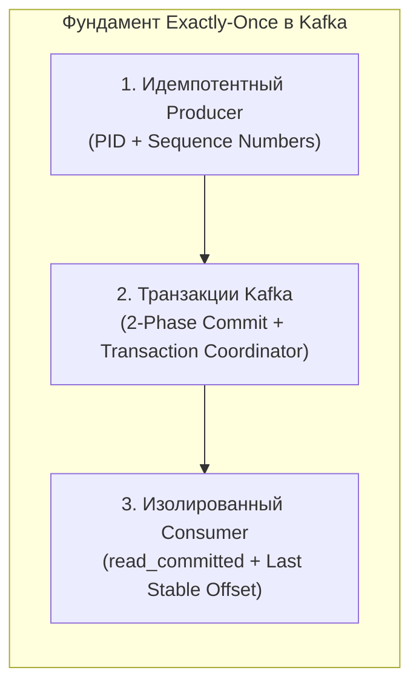
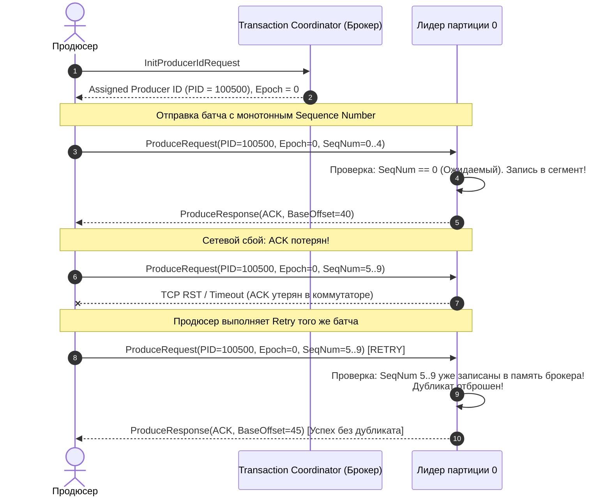
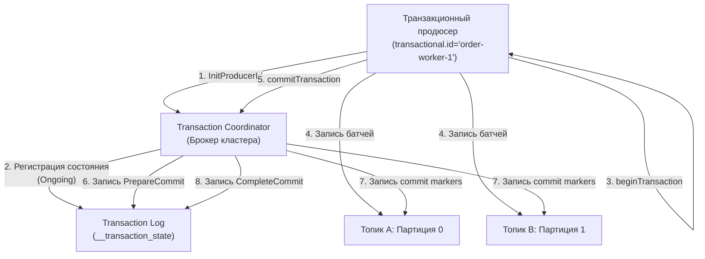
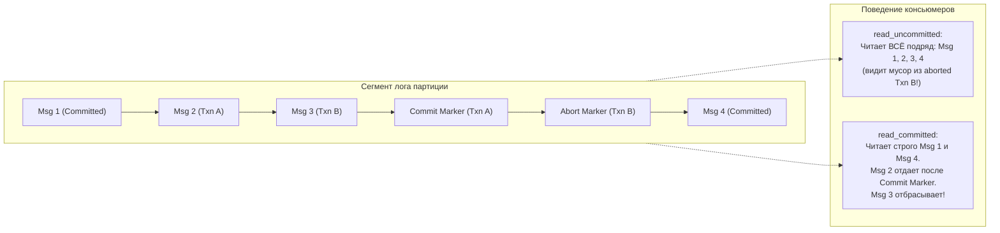
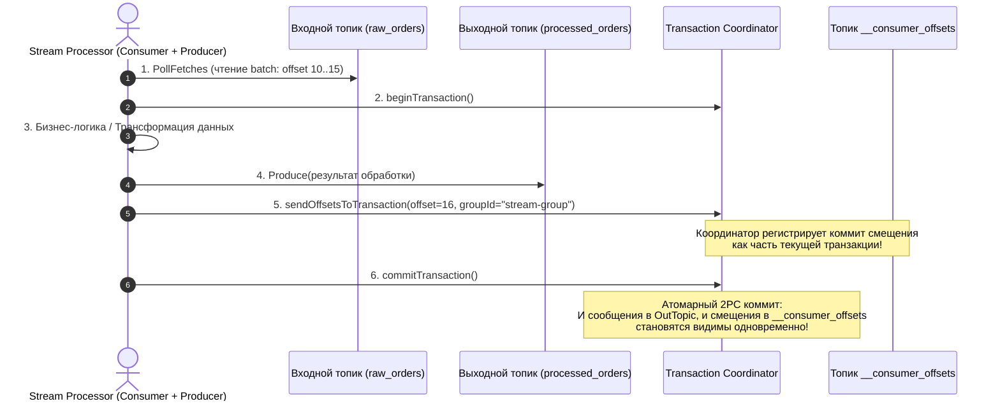

# 6. Exactly once в Kafka: идемпотентность, транзакции и границы возможного

> *«В распределенных системах есть только две сложные проблемы: 2. Доставка ровно один раз (exactly-once); 1. Гарантированный порядок; 2. Доставка ровно один раз (exactly-once)».*    
> — Инженерный фольклор

> [!NOTE]
> **Связи:** Эта статья опирается на фундамент [[4. Модели доставки. At most once, at least once, exactly once]] и [[10. Idempotency в message processing]], соединяет продюсера ([[3. Producer и consumer]]) и консьюмера ([[4. Consumer groups]]) с гарантиями порядка ([[5. Ordering и partitioning]]) и подводит к деталям хранения ([[7. Kafka storage под капотом]]).

---

## Три грани гарантий доставки

В теории распределенных систем существует доказанная теорема: в ненадежной асинхронной сети с возможными падениями узлов (модель сбоев crash-recovery) абсолютная доставка «ровно один раз» невозможна в общем виде из-за фундаментальной неразрешимости Задачи двух генералов (Two Generals' Problem). Сетевой пакет может потеряться, подтверждение (ACK) может задержаться, а узел-отправитель принципиально не способен отличить упавший сервер от медленной сети.

Тем не менее в индустрии мы ежедневно слышим термин **EOS (Exactly-Once Semantics)** в Apache Kafka. Что же это такое на самом деле? Маркетинговый трюк или гениальная инженерия?

Разложим классическую триаду гарантий:

- **At most once («не более одного раза»):** Сообщение либо доставляется один раз, либо теряется навсегда. Продюсер отправляет данные в сокет с `acks=0` (fire-and-forget), не ожидая подтверждения от брокера. Консьюмер коммитит offset в момент извлечения из буфера до начала реальной обработки. Если процесс падает — данные безвозвратно утеряны.
- **At least once («как минимум один раз»):** Сообщение гарантированно доставляется, но при сетевых сбоях и ретраях может быть продублировано. Продюсер требует подтверждения (`acks=all`) и повторяет отправку при малейшем таймауте. Консьюмер коммитит offset строго после успешного завершения обработки. Это режим по умолчанию в абсолютном большинстве промышленных систем.
- **Exactly once («ровно один раз»):** Семантика, при которой логический эффект от обработки каждого сообщения наступает ровно один раз, даже при аппаратных сбоях серверов, разрывах сети и повторных попытках отправки.

В Apache Kafka гарантия **Exactly-Once** — это не магия, нарушающая законы физики, а математически выверенная композиция трёх строгих компонентов:
1. **Идемпотентный продюсер** (`enable.idempotence=true`) — гарантирует ровно одну запись без дубликатов в рамках одной партиции и одной сессии;
2. **Транзакционный координатор и 2PC (Two-Phase Commit)** — обеспечивает атомарную запись пакета сообщений в произвольное число топиков и партиций;
3. **Изолированное чтение консьюмера** (`read_committed`) — скрывает от потребителей данные прерванных (aborted) и незавершённых транзакций.



---

## Идемпотентный продюсер: основа exactly-once внутри партиции

В распределенных системах большинство дубликатов рождается не из-за ошибок в коде, а из-за аномалий сети: продюсер отправляет батч, брокер-лидер успешно записывает его на диск и реплицирует в ISR, но сетевой пакет подтверждения (ACK) теряется в коммутаторе. Продюсер, не получив ответа по таймауту, инициирует повторную отправку (retry). Без специальной защиты в логе появится второй идентичный экземпляр записи.

Идемпотентный продюсер (`enable.idempotence=true`) решает эту проблему на уровне бинарного протокола брокера.

### Как это работает под капотом

При инициализации продюсера происходит следующий протокольный обмен:



1. **Producer ID (PID):** Продюсер отправляет запрос `InitProducerIdRequest` и получает глобальный 64-битный идентификатор PID.
2. **Sequence Number:** Для каждой целевой партиции клиент заводит локальный счетчик, монотонно возрастающий на 1 с каждым новым сообщением (начиная с 0).
3. **Кэш состояний на брокере:** Каждый брокер хранит в оперативной памяти кольцевой буфер последних 5 принятых sequence numbers для каждого активного PID в каждой партиции.
4. **Валидация входящего батча:**
   - Если пришедший `Sequence Number` равен в точности `LastSequenceNumber + 1` — батч записывается в файл сегмента, а счетчик обновляется.
   - Если пришедший `Sequence Number <= LastSequenceNumber` — брокер мгновенно распознает сетевой дубликат. Запись **не производится**, но клиенту возвращается подтверждение успешной доставки (ACK).
   - Если пришедший `Sequence Number > LastSequenceNumber + 1` — брокер обнаруживает пропуск сообщений и возвращает фатальную ошибку `OutOfOrderSequenceException`.

Таким образом, даже если продюсер повторит отправку батча несколько раз, брокер запишет его ровно один раз — в пределах одной сессии Producer ID. Эта гарантия действует **на одну партицию** и **на время жизни продюсера** (PID живёт до перезапуска продюсера или истечения срока неактивности `transactional.id.timeout.ms`).

> [!info] Под капотом
> Продюсер хранит sequence numbers в оперативной памяти, а не в распределенном логе. При падении или перезапуске процесса продюсера PID теряется и назначается новый, поэтому идемпотентность без транзакций не переживает крах продюсера. Для сквозной exactly-once между топиками или перезапусками нужны транзакции.

---

## Транзакции: атомарная запись в несколько партиций

Что делать, если бизнес-операция требует атомарной записи сразу в несколько разных топиков (например, создание записи в `orders` и одновременное списание баланса в `payments`)? Или если мы реализуем классический потоковый конвейер: вычитываем сообщение из входного топика `raw_events`, трансформируем его и пишем в `aggregated_events`?

Если сервис упадет посреди этой операции, часть сообщений окажется записана, а часть нет. На помощь приходят **Транзакции Kafka**, введенные в KIP-98.

Транзакции расширяют гарантию идемпотентности: они гарантируют, что набор сообщений, адресованный в произвольное количество топиков и партиций, будет либо **закоммичен целиком**, либо **полностью отброшен** (All-or-Nothing).

Транзакционный API вводит понятие **transactional producer** и **transactional consumer**. Продюсер вызывает `beginTransaction()`, затем отправляет сообщения в один или несколько топиков, после чего вызывает `commitTransaction()` или `abortTransaction()`. Консьюмер с режимом изоляции `read_committed` увидит только сообщения из завершённых транзакций.

### Transaction Coordinator и Transaction Log

Центральную роль в транзакционной инфраструктуре играет **Transaction Coordinator** — выделенный брокер кластера (лидер соответствующей партиции системного топика `__transaction_state`).



Рассмотрим детальный двухфазный протокол коммита:

1. **Регистрация транзакционного ID:** Продюсер конфигурируется постоянным строковым идентификатором `transactional.id` (например, `order-service-node-42`). Координатор находит его в топике `__transaction_state`, проверяет эпоху и назначает неизменный PID.
2. **Добавление партиций в транзакцию:** Перед записью в целевые партиции продюсер отправляет координатору запрос `AddPartitionsToTxnRequest`. Координатор фиксирует в `__transaction_state`, что партиции $A:0$ и $B:1$ участвуют в текущей транзакции.
3. **Запись данных:** Продюсер отправляет батчи в партиции. Брокеры записывают их в обычные сегменты, но помечают как принадлежащие незавершенной транзакции (uncommitted).
4. **Двухфазный коммит (Two-Phase Commit):**
   - **Фаза 1 (Prepare):** Продюсер вызывает `commitTransaction()`. Координатор пишет в свой внутренний лог запись `PrepareCommit`. С этого момента транзакция считается гарантированно зафиксированной. Даже если координатор упадет прямо сейчас, после перезапуска он завершит процесс.
   - **Фаза 2 (Commit Markers):** Координатор асинхронно отправляет специальный RPC-запрос `WriteTxnMarkersRequest` лидерам всех партиций, участвовавших в транзакции. Лидеры дописывают в конец партиций особый служебный маркер — **Commit Marker**.
   - **Финализация:** Координатор записывает статус `CompleteCommit` в `__transaction_state`.

Если продюсер падает до вызова коммита или завершается с ошибкой, координатор по истечении `transaction.timeout.ms` (или при явном `abortTransaction()`) рассылает в партиции **Abort Marker**.

### Producer epoch и защита от зомби

В распределенных системах чрезвычайно опасен сценарий **«Зомби-продюсера» (Zombie / Split-Brain)**:
1. Инстанс сервиса завис из-за долгой паузы GC (Stop-the-World) или сетевой изоляции.
2. Координатор счел его мертвым по таймауту `transaction.timeout.ms` и прервал его транзакцию.
3. Оркестратор запустил новый инстанс с тем же `transactional.id`. Новый инстанс начал новую транзакцию.
4. Старый «зомби»-инстанс внезапно отвисает и пытается дописать свои устаревшие батчи в партиции!

Для защиты от зомби Kafka использует механизм **Producer Epoch** (поколение продюсера):
- При каждом вызове инициализации `InitProducerId` для существующего `transactional.id` координатор увеличивает счетчик `epoch` на 1 (например, с 0 на 1).
- Старый PID с устаревшей эпохой (`epoch = 0`) мгновенно отсекается (fenced).
- При любой попытке старого продюсера записать данные брокер возвращает ошибку `ProducerFencedException`. «Зомби» немедленно завершает свою работу, не повредив данные.

---

### Транзакционный консьюмер и режимы изоляции

То, как потребители видят транзакционные записи, регулируется параметром `isolation.level`:



- **`read_uncommitted`** (по умолчанию) — консьюмер читает все сообщения подряд вплоть до `High Watermark`. Он видит промежуточные сообщения незавершенных транзакций и даже те сообщения, которые позже были отменены (aborted). В этом режиме семантика exactly-once невозможна.
- **`read_committed`** — консьюмер читает данные только до специальной отметки **LSO (Last Stable Offset)** — смещения первой незавершенной транзакции. Консьюмер буферизирует сообщения в памяти:
  - Если транзакция закоммичена (`Commit Marker`) — сообщения отдаются приложению.
  - Если транзакция отменена (`Abort Marker`) — сообщения прозрачно отфильтровываются и удаляются из буфера, никогда не попадая в прикладной код.

Пример настройки консьюмера на Go с библиотекой `franz-go`:

```go
// Пример настройки транзакционного консьюмера в franz-go
cl, err := kgo.NewClient(
    kgo.SeedBrokers("localhost:9092"),
    kgo.ConsumerGroup("transactional-group"),
    kgo.ConsumeTopics("orders"),
    kgo.FetchIsolationLevel(kgo.ReadCommitted()),
    kgo.DisableAutoCommit(),
)
```

---

## Сквозной exactly-once: паттерн consume-transform-produce

Наиболее распространённый сценарий exactly-once в Kafka — потоковая обработка, где консьюмер читает из одного топика, трансформирует данные и записывает в другой. Сочетание транзакционного продюсера и режима `read_committed` позволяет обеспечить exactly-once даже при ретраях и перезапусках.

В чем здесь главная сложность? Мы должны **атомарно** сделать две вещи:
1. Записать обработанные сообщения в выходной топик `processed_orders`;
2. Закоммитить смещение прочитанных сообщений входного топика `raw_orders` во внутренний топик `__consumer_offsets`.

Если эти две операции не атомарны:
- Записали в выходной топик, но упали до коммита смещений $\to$ после рестарта вычитаем те же сообщения повторно $\to$ **дубликат на выходе!**
- Закоммитили смещение, но упали до записи в выходной топик $\to$ **потеря данных!**

Решение Kafka гениально: смещение консьюмера записывается **внутрь транзакции продюсера** через специальный вызов `sendOffsetsToTransaction`!



Шаги паттерна Consume-Transform-Produce:

1. Консьюмер читает батч из входного топика.
2. Начинается транзакция продюсера (`beginTransaction()`).
3. Выполняется бизнес-логика (чистая трансформация данных).
4. Результат записывается в выходной топик.
5. Offset входного топика коммитится **внутри той же транзакции** (через специальный API `sendOffsetsToTransaction`).
6. Транзакция коммитится (`commitTransaction()`). Теперь и результат, и факт обработки становятся видимы атомарно.

> [!warning] Ловушка / Gotcha: Границы применимости
> Exactly-once **не распространяется на внешние сайд-эффекты**. Если внутри транзакции происходит запись в PostgreSQL или вызов HTTP API, Kafka не откатит эти операции при аборте. Для этого потребуется распределённая транзакция с использованием паттернов [[8. Saga через брокеры]] или координация через [[2. Temporal. Архитектура и концепции]]. Не путайте exactly-once внутри Kafka с глобальной exactly-once всей системы.

Если ваш консьюмер пишет в PostgreSQL или MongoDB, транзакции Kafka не спасут внешнюю базу от дубликатов при сбоях. Для внешних баз данных правильное решение — комбинация **Идемпотентного потребителя** ([[4. Idempotent handlers]]), паттерна **Transactional Outbox** ([[6. Outbox pattern]]) и уникальных констрейнтов в БД.

---

## Производительность, механическая симпатия и подводные камни

Транзакции не бесплатны. Каждая транзакция добавляет дополнительные записи в `__transaction_state` и commit-маркеры в пользовательские топики, увеличивая трафик и нагрузку на диски. Координатор транзакций становится узким местом при большом количестве продюсеров.

### Head-of-Line Blocking на стороне консьюмера

Самый коварный подводный камень транзакционного чтения — блокировка очереди (Head-of-Line Blocking) из-за зависшей транзакции:

Представим:
1. Продюсер А начал долгую транзакцию в партиции 0 под смещением 100.
2. Продюсер Б отправляет обычные или короткие транзакции со смещениями 101, 102, 103...
3. Консьюмер в режиме `read_committed` доходит до смещения 100.
4. Поскольку транзакция продюсера А всё ещё активна, смещение **LSO (Last Stable Offset)** фиксируется на отметке 100!
5. **Консьюмер полностью останавливает чтение всей партиции!** Он не может отдать сообщения 101, 102, пока транзакция 100 не будет завершена (коммитом или абортом).

Если разработчик установил `transaction.timeout.ms = 15 минут`, и продюсер завис — все консьюмеры этой партиции замрут на 15 минут!

На стороне консьюмера режим `read_committed` требует буферизации входящих сообщений до появления маркеров, что увеличивает потребление памяти и может добавить задержку (особенно при долгих транзакциях). В Go-приложениях с ручным управлением памятью следует мониторить размер буферов и избегать утечек при долго висящих незакоммиченных транзакциях.

С точки зрения операционной системы: commit-маркеры — это дополнительные записи в лог, нарушающие идеальную линейность последовательного ввода-вывода. Однако, так как Kafka пишет всё равно последовательно в активный сегмент, эти маркеры просто вклиниваются в поток, не вызывая случайных перемещений головок диска.

---

## Вопросы для собеседования

> [!tip] Собеседование
> **Вопрос:** Можете ли вы гарантировать exactly-once при перезапуске продюсера без использования `transactional.id`?  
> **Ответ:** Нет. Идемпотентный продюсер без `transactional.id` теряет PID при перезапуске и может создать дубликаты, если ретраи отправляются после перезапуска. Для сквозного exactly-once между топиками и перезапусками обязательно использовать `transactional.id` и транзакционный API.

> [!tip] Собеседование
> **Вопрос:** Какие ограничения имеет exactly-once в Kafka при работе с внешними БД?  
> **Ответ:** Exactly-once гарантируется только внутри операций, охватываемых транзакцией Kafka: чтение offset'ов и запись в выходные топики. Внешние системы (PostgreSQL, Redis) не участвуют в транзакции Kafka. Для атомарности между Kafka и БД применяют Outbox Pattern ([[6. Outbox pattern]]) или Saga ([[8. Saga через брокеры]]), либо используют Temporal ([[2. Temporal. Архитектура и концепции]]) для оркестрации распределённых транзакций.

---

## Заключение и дальнейшие шаги

Exactly-once в Kafka — это инженерный шедевр, построенный на трёх столпах: идемпотентном продюсере, транзакционном протоколе с координатором и изолированном чтении консьюмерами. Правильное применение этих инструментов позволяет строить конвейеры данных с гарантией отсутствия дубликатов и потерь, но требует чёткого понимания границ: exactly-once внутри кластера Kafka не равняется глобальной exactly-once всей системы.

Теперь, освоив гарантии доставки, мы готовы заглянуть под капот самого хранилища Kafka и понять, как сегменты, индексы и политики retention обеспечивают долговечность и эффективность лога: следующая статья — [[7. Kafka storage под капотом]].