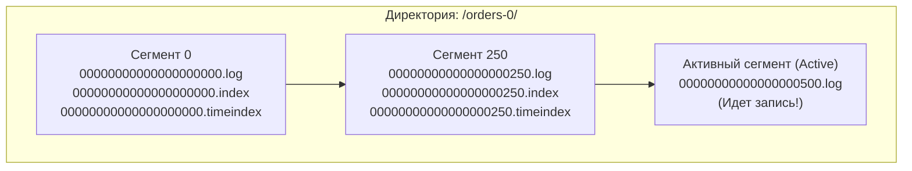
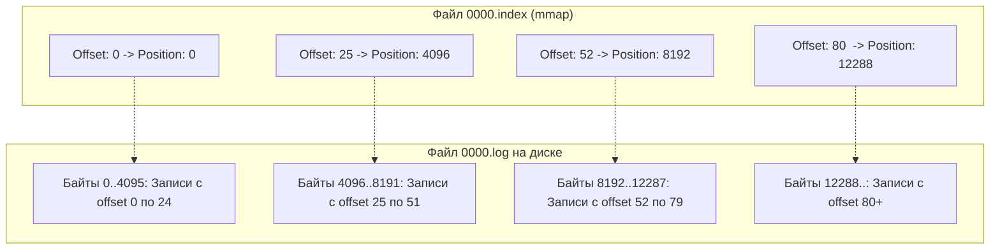
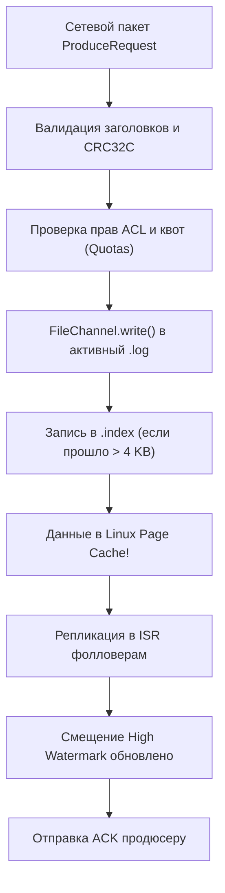
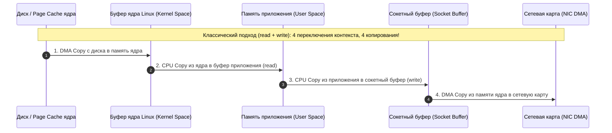
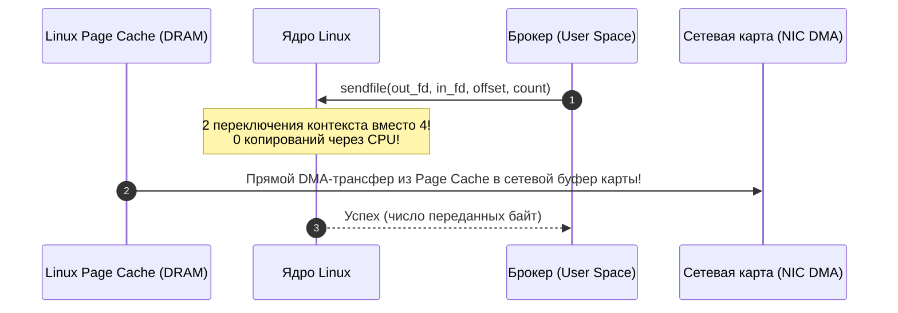

# 7. Kafka storage под капотом: анатомия сегментов, разреженные индексы и Zero-Copy

> *«Философия Unix состоит в том, чтобы проектировать системы, делающие одну вещь и делающие ее хорошо, полагаясь на операционную систему в том, что она умеет лучше всего».*    
> — Дуг Макилрой, один из отцов Unix

> [!NOTE]
> **Связи:** Эта статья погружает в физическое устройство хранилища, опираясь на [[1. Kafka. Архитектура и модель log based системы]], [[2. Topics, partitions и offsets]], [[7. Message durability и persistence]], а также закладывает фундамент для [[8. Retention и compaction]] и [[12. Производительность Kafka]].

---

## Почему понимание хранилища критично

Производительность Apache Kafka часто описывают в рекламных проспектах фразами вроде «миллионы сообщений в секунду на одном сервере». Но за этими цифрами нет ни «магии», ни сверхсложных самодельных алгоритмов в кодовой базе брокера. Напротив: архитектурное ядро хранилища Kafka поражает своей предельной, почти спартанской простотой.

Создатели Kafka осознали фундаментальную истину вычислительной техники: **не нужно соревноваться с ядром операционной системы в управлении памятью и дисками**. Вместо того чтобы городить в адресном пространстве процесса сложные B-деревья, пользовательские буферные пулы (Buffer Pools) и самодельные LRU-кэши (как это делают традиционные реляционные СУБД), Kafka была спроектирована как тонкий сетевой диспетчер над **неизменяемым последовательным файловым логом**.

Kafka буквально эксплуатирует то, что современная аппаратура и ядро Linux делают быстрее всего:
1. Последовательную (sequential) запись в конец файла;
2. Агрессивное кэширование страниц операционной системой (**Linux Page Cache**);
3. Аппаратную прямую передачу байтов из оперативной памяти в сетевую карту (**Zero-Copy через `sendfile(2)`**).

---

## Физическая организация партиции

Если зайти по SSH на сервер брокера Kafka и открыть рабочий каталог с данными (обычно `/var/lib/kafka/data/`), вы не обнаружите никакой сложной проприетарной базы данных. Логическая партиция — это просто **обычная директория на файловой системе** (например, `ext4` или `xfs`), названная по шаблону `<topic_name>-<partition_id>`.

Внутри этой директории партиция нарезана на цепочку неизменяемых файлов-сегментов (Segments). Каждый логический сегмент физически представлен тройкой (или четверкой) файлов:

```
/var/lib/kafka/data/orders-0/
├── 00000000000000000000.log
├── 00000000000000000000.index
├── 00000000000000000000.timeindex
├── 00000000000000000250.log
├── 00000000000000000250.index
├── 00000000000000000250.timeindex
├── leader-epoch-checkpoint
```

Назначение файлов в сегменте:
- **`.log`** — основной файл данных, в который последовательно дописываются бинарные батчи сообщений (`RecordBatch`).
- **`.index`** — бинарный разреженный индекс (Offset Index), сопоставляющий логическое смещение (`offset`) с физическим байтовым смещением внутри файла `.log`.
- **`.timeindex`** — бинарный разреженный индекс (Time Index), сопоставляющий временную метку (Unix timestamp) со смещением `offset`.
- **`leader-epoch-checkpoint`** — служебный файл, отслеживающий смены лидеров партиции для безопасного восстановления при сбоях (KIP-101).

Имя каждого файла в сегменте формируется из **базового смещения (Base Offset)** — смещения самой первой записи, сохраненной в данном сегменте, дополненного ведущими нулями до ровно 20 цифр (64-битное беззнаковое число). 

Файл `00000000000000000250.log` означает, что первое сообщение в этом файле имеет offset 250.



### Жизненный цикл сегмента (Segment Rolling)

В каждый момент времени для партиции существует строго **один активный сегмент** (Active Segment). Только в него продюсер дописывает новые байты. Все остальные предшествующие сегменты навсегда закрыты для записи и доступны исключительно на чтение!

Сегмент «запечатывается» (rolls over), и создается новый активный сегмент при наступлении любого из двух событий:
1. **Превышение размера:** Размер файла `.log` достигает порога `log.segment.bytes` (по умолчанию 1 ГБ).
2. **Превышение времени:** С момента первой записи в активный сегмент прошло больше времени, чем задано в `log.roll.ms` или `log.roll.hours` (по умолчанию 7 дней).

Зачем сегментировать лог на диске? Почему нельзя писать в один огромный 10-терабайтный файл?
Потому что удаление устаревших данных (**Retention**) в сегментированном логе сводится к тривиальному системному вызову ядра `unlink(2)` целого файла! Никакой сборки мусора на диске, никакой фрагментации файловой системы и никакого дефрагментирующего перемещения блоков данных.

---

## Формат данных на диске: RecordBatch v2

Начиная с Kafka 0.11, на диске используется высокоэффективный формат **RecordBatch v2** (введенный в KIP-98). Главная особенность этого формата — **структурный батчинг**: служебные метаданные (заголовки, контрольные суммы, флаги продюсера) вынесены на уровень батча, а индивидуальные записи внутри батча кодируются компактными дельтами:

```
+-------------------------------------------------------------------------------+
|                             RecordBatch Header                                |
| BaseOffset (8B) | Length (4B) | PartitionLeaderEpoch (4B) | MagicByte (1B)    |
| CRC32C (4B)     | Attributes (2B) | LastOffsetDelta (4B)                      |
| BaseTimestamp (8B) | MaxTimestamp (8B) | ProducerId (8B) | ProducerEpoch (2B) |
| BaseSequence (4B)  | RecordsCount (4B)                                        |
+-------------------------------------------------------------------------------+
|                               Records Payload                                 |
| Record 1: Length (Varint) | Attributes (1B) | TimestampDelta (Varint)         |
|           OffsetDelta (Varint) | KeyLength | Key | ValueLength | Value        |
| Record 2: ...                                                                 |
| Record N: ...                                                                 |
+-------------------------------------------------------------------------------+
```

Разбор полей RecordBatch:
- **`baseOffset` (8 байт)** — логическое смещение первой записи в пакете.
- **`baseTimestamp` (8 байт)** — временная метка создания пакета.
- **`attributes` (2 байта)** — битовые флаги: алгоритм сжатия (None, GZIP, Snappy, LZ4, ZSTD), признак транзакционности, признак управляющего пакета (Control Batch для commit/abort маркеров).
- **`crc` (4 байта)** — контрольная сумма CRC32C заголовка и записей для проверки целостности.
- **`ProducerId` (8 байт) и `ProducerEpoch` (2 байта)** — параметры для поддержки идемпотентности и транзакций.
- **`records`** — поток отдельных сообщений. Каждое сообщение сохраняет свой offset как компактную дельту `offset delta = record.offset - baseOffset` (в виде Protobuf-подобного `varint`), что экономит до 7 байт на каждое сообщение!

> [!info] Под капотом
> Брокер Kafka хранит сжатый батч на диске в абсолютно неизменном виде: он **не распаковывает** данные при записи и не упаковывает их заново при чтении консьюмером! Продюсер сжал батч в lz4/zstd $\to$ брокер сохранил его в `.log` $\to$ передал по сети в сетевую карту через `sendfile` $\to$ консьюмер распаковал. Брокер тратит 0 процессорных тактов на декомпрессию, выступая идеальной конвейерной трубой.

---

## Разреженные индексы

Если бы Kafka сохраняла смещение каждого отдельного сообщения в B-дереве или хэш-таблице (как классические базы данных), то для лога из 10 миллиардов сообщений сам индекс весил бы сотни гигабайт и требовал огромного объема дорогой оперативной памяти.

Вместо этого Kafka использует **разреженные индексы (Sparse Indexes)**.

Индексные файлы `.index` и `.timeindex` проецируются напрямую в адресное пространство процесса с помощью системного вызова `mmap(2)` (в Java — `MappedByteBuffer`).

Индексная запись добавляется **не на каждое сообщение**, а только тогда, когда объем записанных в лог данных превышает интервал `log.index.interval.bytes` (по умолчанию 4096 байт — размер одной страницы памяти Linux!).



### Offset Index: поиск смещения за O(log N)

Каждая запись в файле `.index` имеет фиксированный размер ровно **12 байт**:
- **Относительное смещение (Relative Offset, 4 байта):** Смещение сообщения относительно базового смещения сегмента (`offset - baseOffset`). Использование 4 байт вместо 8 байт позволяет экономить 50% размера индекса.
- **Физическая позиция (Physical Position, 4 байта):** Точный байтовый офсет внутри файла `.log`.

**Алгоритм поиска смещения $X$:**
1. **Бинарный поиск по сегментам:** По имени файлов сегментов в памяти находится нужный сегмент, где `BaseOffset <= X < NextSegmentBaseOffset`.
2. **Бинарный поиск по `.index`:** Векторизованный бинарный поиск по проецированному в память `mmap`-индексу находит наибольшее проиндексированное смещение, меньшее или равное $X$ (например, смещение 52 с физической позицией 8192).
3. **Линейное дочитывание:** Брокер прыгает на позицию 8192 в файле `.log` и последовательно читает максимум 4 КБ данных, пока не встретит точный offset $X$.

Поскольку размер индексного блока составляет всего 4 КБ, линейное сканирование занимает доли микросекунды и полностью умещается в кэше процессора L1/L2!

### Time Index

Файл `.timeindex` устроен полностью аналогично, но оперирует записями по **12 байт**: 8 байт Unix Timestamp + 4 байта Relative Offset. 

Он используется, когда приложению необходимо перемотать консьюмер на определенный момент времени — например, через API `offsetsForTimes(timestamp)`. Kafka находит по времени целевой `offset`, а затем по `.index` — физическую позицию на диске.

> [!warning] Ловушка / Gotcha: Деградация поиска по времени
> Если в топик пишутся сообщения с некорректными (немонотонными) временными метками (например, продюсер генерирует timestamp на стороне распределенных клиентов с рассинхронизированными часами), `.timeindex` теряет строгую монотонность. В этом случае вызов `offsetsForTimes(timestamp)` может вернуть не самое ранее смещение, а брокер будет вынужден выполнять более глубокое сканирование лога. В современных системах рекомендуется использовать `CreateTime` на стороне продюсера с NTP-синхронизацией либо переключать топик на `LogAppendTime` на брокере.

---

## Путь сообщения от продюсера до диска

Когда сетевой поток брокера получает TCP-пакет `ProduceRequest`, происходит строго детерминированный цикл операций:



1. **Валидация:** Проверка контрольной суммы CRC32C и прав доступа.
2. **Последовательный append:** Вызов `FileChannel.write` добавляет байты в конец активного сегмента `.log`. Это системный вызов `write(2)`.
3. **Обновление индекса:** Если накопилось более 4096 байт с прошлой отметки, в `.index` и `.timeindex` добавляется новая точка.
4. **Попадание в Page Cache:** Данные оказываются в оперативной памяти ОС (страничный кэш).
5. **Репликация:** Фолловеры вычитывают новый батч; когда кворум ISR подтверждает запись, `High Watermark` сдвигается вперед, и продюсер получает сетевой ACK.

Заметьте: брокер **не вызывает `fsync`** перед отправкой ответа продюсеру! Почему? Об этом ниже.

---

## Путь от диска до консьюмера: Zero-Copy и sendfile

При запросе консьюмера (`Fetch` request) брокер выполняет следующие действия:
1. Определяет offset, с которого нужно читать.
2. Находит нужный сегмент и физическую позицию внутри `.log` через бинарный поиск по индексу.
3. Использует **`FileChannel.transferTo`** (в Java), который в среде Linux компилируется непосредственно в системный вызов `sendfile`. Эта функция копирует данные из страничного кеша (или с диска, если данных нет в кеше) напрямую в сокетный буфер, минуя промежуточный буфер в userspace.

В классических серверах (например, традиционных веб-серверах старого поколения или брокерах на чистом userspace) передача файла с диска в сетевой сокет выглядит как чудовищно неэффективная растрата аппаратных ресурсов:



При традиционном `read() + write()`:
- Процессор выполняет **4 переключения контекста** (User Mode $\leftrightarrow$ Kernel Mode);
- Данные **дважды копируются процессором** через шину памяти RAM (из ядра в userspace, затем из userspace в ядро), сжигая драгоценную пропускную способность шины памяти и загрязняя кэши L1/L2/L3 CPU.

### Магия системного вызова `sendfile` (Zero-Copy)

В Apache Kafka чтение консьюмера реализовано через Java-метод `FileChannel.transferTo`, который в среде Linux компилируется непосредственно в системный вызов **`sendfile(2)`** (или `splice(2)`):



Как работает Zero-Copy:
1. Брокер вызывает `sendfile(socket_fd, file_fd, offset, length)`.
2. Процессор переключается в режим ядра всего один раз.
3. Данные берутся напрямую из **Page Cache** ядра Linux и с помощью контроллера прямого доступа к памяти (**Scatter-Gather DMA**) отправляются непосредственно в кольцевой буфер сетевого адаптера!
4. В пространство пользователя брокера **не копируется ни единого байта**! Процессор вообще не участвует в перемещении данных.

Это означает, что скорость отдачи сообщений консьюмерам в Kafka ограничена исключительно **физической пропускной способностью сетевой карты** (например, 25 Gbps или 100 Gbps), а не мощностью процессора сервера!

---

## Долговечность и стратегии fsync

Существует распространенное заблуждение: «Если Kafka не делает `fsync` на каждую запись, значит, она может потерять данные при отключении питания серверов!»

Давайте разберем механику долговечности:

Системный вызов `fsync(2)` принудительно сбрасывает грязные страницы из кэша памяти на физические пластины или ячейки флэш-памяти. Однако вызов `fsync` на каждое сообщение превратил бы производительность современного накопителя из сотен тысяч записей в секунду в жалкие 500–2000 IOPS из-за задержек контроллера.

Kafka предлагает выбор через параметры конфигурации брокера:
- `log.flush.interval.messages` — принудительный сброс на диск каждые N сообщений;
- `log.flush.interval.ms` — принудительный сброс на диск каждые N миллисекунд.

> [!important] Официальная рекомендация архитекторов Kafka
> **Оставьте параметры `log.flush.interval.messages` и `log.flush.interval.ms` отключенными (по умолчанию `Long.MAX_VALUE`)!**  
> Доверьте фоновый сброс грязных страниц демонам ядра Linux (`kswapd`, `pdflush`). Надёжность и долговечность данных в Kafka гарантируются не локальным диском одного узла, а **распределенной репликацией в оперативной памяти нескольких независимых серверов (ISR с `acks=all`)**! Вероятность одновременного внезапного обесточивания сразу трех серверов в разных стойках или зонах доступности несоизмеримо ниже, чем вероятность деградации производительности из-за синхронного `fsync`.

---

## Mechanical Sympathy: почему это работает

Подведем итог mechanical sympathy подсистемы хранения Kafka:

1. **Последовательный доступ вместо случайного:** Скорость последовательной записи на современные NVMe SSD достигает 3–7 ГБ/с, в то время как случайная запись мелкими блоками быстро упирается в лимиты контроллера и вызывает дорогостоящий Write Amplification.
2. **Отсутствие нагрузки на GC брокера:** Поскольку брокер не держит кэш сообщений в памяти виртуальной машины, куча JVM остается компактной (4–8 ГБ даже на серверах с 256 ГБ RAM). Нет многосекундных пауз Stop-the-World сборщика мусора!
3. **Бесплатный кэш ОС:** Весь неиспользуемый объем RAM автоматически отдается операционной системой под Page Cache. Если брокер перезапустить, его кэш не сбрасывается — он сохраняется в ядре Linux!

---

## Влияние Go-клиентов

Со стороны клиентов на Go (таких как `franz-go`) архитектура хранения Kafka находит идеальное отражение.

Когда брокер сбрасывает данные через `sendfile`, консьюмер на Go получает гигантские непрерывные TCP-пакеты. Клиент `franz-go` использует мультиплексирование ввода-вывода и системный вызов `syscall.Read` непосредственно в горутине, читающей сокет, помещая данные в пулы переиспользуемых байтовых срезов из `sync.Pool`. 

Это сводит выделение памяти на стороне Go-приложения к абсолютному минимуму и предотвращает деградацию GC Go-рантайма даже при обработке гигабайтных потоков данных.

---

## Вопросы для собеседования

> [!tip] Собеседование
> **Вопрос:** Почему в Kafka файлы сегментов имеют имена из 20 цифр, например `00000000000000000250.log`?  
> **Ответ:** Имя файла кодирует базовое логическое смещение (`Base Offset`) — смещение первой записи, с которой начинается данный сегмент. Это позволяет брокеру находить нужный файл сегмента для любого запрашиваемого смещения $X$ с помощью быстрого алгоритма бинарного поиска по массиву имен файлов в памяти за время $O(\log N)$ без открытия самих файлов.

> [!tip] Собеседование
> **Вопрос:** В чем разница между плотным (dense) и разреженным (sparse) индексом, и почему Kafka выбрала разреженный?  
> **Ответ:** Плотный индекс содержит указатель на абсолютно каждую запись в логе; его размер растет линейно с числом записей, требуя гигабайты оперативной памяти. Разреженный индекс Kafka сохраняет позицию только раз на каждые 4096 байт данных (`log.index.interval.bytes`). Это делает файлы индексов предельно компактными (несколько мегабайт), позволяя держать все индексы в памяти через `mmap` и находить точную запись за бинарный поиск по индексу плюс минимальное последовательное дочитывание блока до 4 КБ.

---

## Заключение

Хранилище Kafka — это триумф простоты: неизменяемый лог, сегменты на файловой системе, разреженные индексы и полное доверие страничному кешу ОС. Никаких самодельных буферных менеджеров, никаких сложных структур в памяти — только линейная запись, линейное чтение и `sendfile`. Именно эта архитектура позволяет одному брокеру обслуживать миллионы сообщений в секунду, не превращаясь в бутылочное горлышко.

Теперь, когда мы разобрали, как данные хранятся и извлекаются, перейдём к тому, как Kafka управляет жизненным циклом этих данных: [[8. Retention и compaction]].