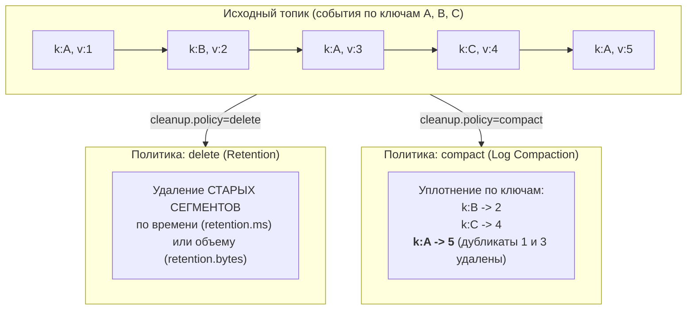
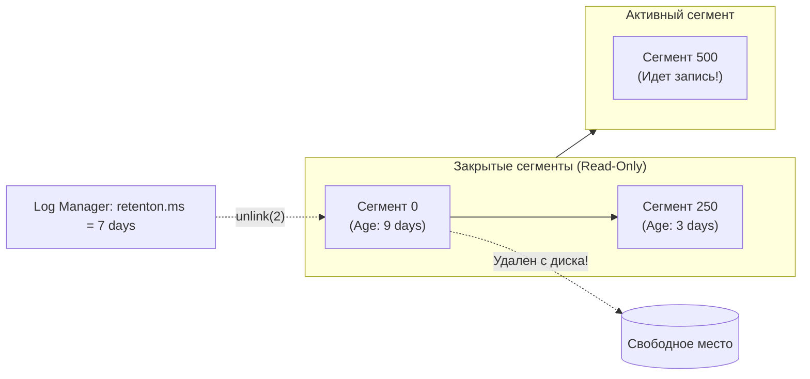
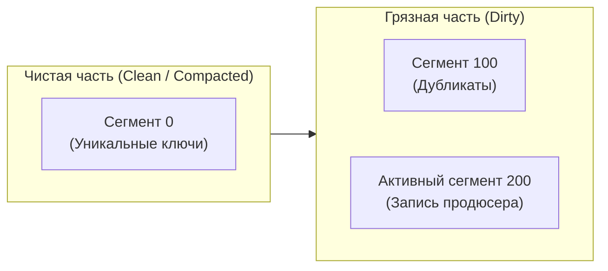
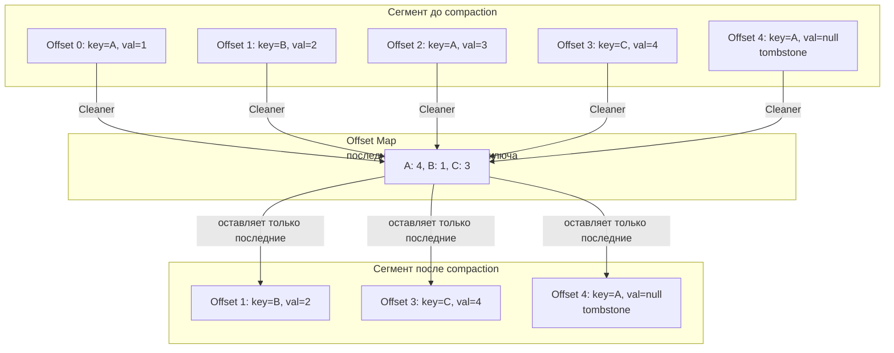
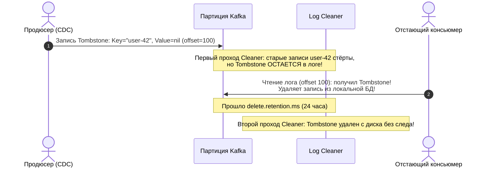

# 8. Retention и compaction: управление жизненным циклом и уплотнение лога

> *"Data structures and algorithms are tools to manage complexity, but managing the lifetime of data is what keeps systems alive."*  
> — Брайан Керниган

> [!NOTE]
> **Связи:** Эта статья прямо продолжает [[7. Kafka storage под капотом]], в котором мы детально разобрали сегменты и физическую организацию лога. Здесь мы рассмотрим, как Kafka управляет жизненным циклом этих сегментов через два фундаментально разных механизма: **Retention** (удаление по времени/размеру) и **Compaction** (уплотнение по ключу).

---

## Два взгляда на жизненный цикл данных

Дисковое пространство любого промышленного сервера конечно. В высоконагруженных системах, генерирующих сотни гигабайт или терабайты событий в сутки, бесконтрольно растущий лог — это верный рецепт аварийной остановки кластера с ошибкой `No space left on device` (ENOSPC).

При этом характер хранимых данных в бэкенд-архитектурах принципиально различен:

1. **Непрерывный поток неизменяемых событий (Event Stream):** Клики пользователей, телеметрия IoT-датчиков, финансовые транзакции, трейсы и логи приложений. В таких сценариях важна возможность воспроизвести поток за последние $N$ часов или дней (например, для расследования инцидентов или повторного обучения моделей машинного обучения), а всё, что старше этого окна, можно безболезненно уничтожить.
2. **Поток изменений состояния сущностей (State Updates / CDC):** Балансы пользователей, каталог цен товаров, текущий статус доставки заказа, служебный реестр смещений консьюмеров. Здесь бизнес-логике не интересна вся цепочка из 50 промежуточных изменений цены за полгода — приложению критически важно иметь **самое последнее актуальное состояние для каждого первичного ключа**!

Apache Kafka предлагает два взаимодополняющих режима очистки лога — **delete** (Retention) и **compact** (Log Compaction), — и позволяет гибко настраивать их на уровне каждого отдельного топика через параметр `cleanup.policy`.



---

## Retention: классическое удаление по времени и размеру

Политика `delete` — это классический и наиболее распространенный способ управления размером топиков в Kafka. Топик хранит сообщения в течение заданного окна времени либо до достижения заданного суммарного объема на диске.

### Параметры, управляющие retention

Поведение политики удаления регулируется на уровне брокера (глобально) и может быть переопределено для каждого отдельного топика:

- **`retention.ms`** — максимальное время хранения сообщения в топике (по умолчанию 7 дней: `604800000 мс`). Сообщения, чей timestamp старше `now - retention.ms`, становятся кандидатами на удаление.
- **`retention.bytes`** — максимальный суммарный размер всех сегментов партиции на диске (по умолчанию `-1`, то есть без ограничения). При превышении этого порога самые старые сегменты удаляются, даже если их возраст меньше `retention.ms`.
- **`log.retention.check.interval.ms`** — периодичность, с которой фоновый планировщик Log Manager сканирует директории брокера на соответствие условиям очистки (по умолчанию 5 минут).

### Как работает удаление под капотом

Физически операция удаления в Kafka оперирует исключительно **целыми файлами-сегментами**! 

Брокер никогда не пытается «вырезать» отдельные сообщения из середины файла `.log` — это вызвало бы чудовищный оверхед на дефрагментацию и переписывание сотен гигабайт данных.



Правила работы Log Manager:
1. **Неприкосновенность активного сегмента:** Активный сегмент, в который в текущий момент поступают записи от продюсеров, **никогда не удаляется**, даже если его размер превышает `retention.bytes` или сообщения внутри него устарели по времени!
2. **Проверка временных меток:** Log Manager находит максимальный timestamp среди всех записей сегмента (хранящийся в заголовке `.timeindex`). Если `now - max_segment_timestamp > retention.ms`, весь сегмент помечается кандидатом на удаление.
3. **Системный вызов `unlink(2)`:** Удаление закрытого сегмента — это тривиальный системный вызов ядра операционной системы `unlink(2)` (в Java — `File.delete()`), удаляющий тройку файлов: `.log`, `.index` и `.timeindex`. 

> [!info] Под капотом
> Удаление сегментов не приводит к дефрагментации файловой системы и не требует сканирования контента. Всё, что делает брокер, — удаляет файлы `.log`, `.index` и `.timeindex` целиком. Именно поэтому retention — лёгкая операция, практически не нагружающая ввод-вывод, если не считать кратковременного обновления метаданных файловой системы (inode в `ext4`/`xfs`).

---

## Compaction: уплотнение по ключу

Если политика retention отвечает на вопрос: *«Как долго хранить временную историю сообщений?»*, то Log Compaction отвечает на совершенно другой инженерный вопрос: *«Какое значение каждого уникального ключа является актуальным на данный момент?»*.

В компактифицированном топике для каждого уникального ключа гарантированно сохраняется **только запись с максимальным offset-ом** (последняя по времени записи). Все предшествующие исторические записи с тем же самым ключом признаются устаревшими и безвозвратно удаляются из лога.

Консьюмер, начавший чтение компактифицированного топика с самого начала (`offset = 0`), гарантированно восстановит полное актуальное состояние системы, прочитав минимально необходимый объем данных.

### Зачем нужен compaction

Основные сценарии применения уплотнения лога:

1. **Change Data Capture (CDC):** Интеграция с реляционными базами данных через Debezium. Каждое изменение строки (INSERT, UPDATE, DELETE) в PostgreSQL или MySQL публикуется в топик Kafka, где ключом является первичный ключ таблицы (`id`). Уплотнение лога превращает топик в распределенный материализованный снапшот базы данных!
2. **Хранение эталонных справочников (Reference Data):** Таблицы курсов валют, конфигурации фиче-флагов, каталоги категорий товаров.
3. **Системные внутренние топики Kafka:** Самый известный пример — топик `__consumer_offsets`. Каждое сообщение в нем хранит ключ `[group_id, topic, partition]`, а значением является последний зафиксированный `offset`. Благодаря compaction топик смещений не разрастается до терабайтов, удерживая только последние смещения консьюмеров.

---

### Как работает Log Cleaner под капотом

За процесс компактификации отвечает выделенный пул фоновых потоков брокера — **Log Cleaner**. 

Физическая партиция делится на две логические зоны:
- **Чистая часть (Clean/Tail):** Сегменты, которые уже прошли уплотнение. Здесь каждый ключ встречается ровно один раз.
- **Грязная часть (Dirty/Head):** Сегменты, в которые дописывались новые данные, и где присутствуют повторные записи одних и тех же ключей.



Алгоритм работы Log Cleaner:

1. **Выбор кандидата:** Log Cleaner вычисляет соотношение «грязных» данных к общему размеру закрытых сегментов партиции:
   $$\text{Dirty Ratio} = \frac{\text{Bytes in Dirty Segments}}{\text{Bytes in Clean Segments} + \text{Bytes in Dirty Segments}}$$
   Очистка запускается только тогда, когда $\text{Dirty Ratio} \ge \textbf{min.cleanable.dirty.ratio}$ (по умолчанию 0.5, то есть 50% грязных данных). Если грязных данных мало, брокер откладывает работу, чтобы не расходовать драгоценные циклы дискового ввода-вывода на переписывание почти чистого лога.
2. **Построение Offset Map (SkimpyOffsetMap):** Log Cleaner строит в оперативной памяти компактную хэш-таблицу (используя 128-битный хэш ключа Murmur3 и 64-битный offset). Карта сохраняет отображение: $\text{Key Hash} \to \text{Highest Offset}$.
3. **Линейное слияние (Deduplication Merge):** Поток Log Cleaner последовательно читает записи из грязных сегментов. Если offset записи совпадает со значением в `Offset Map` — запись копируется в новый чистый сегмент. Если offset меньше — запись признается устаревшим дубликатом и **пропускается** (не попадает в новый файл).
4. **Атомарная подмена сегмента:** Новый компактный сегмент завершается, индексы пересчитываются, старые сегменты удаляются через `unlink(2)`, а ссылка на чистый сегмент атомарно обновляется.



---

### Tombstone-записи и `delete.retention.ms`

А как удалить ключ в системе, где лог только дописывается? Для этого продюсер публикует специальную запись — **Tombstone** («надгробная плита»): сообщение с непустым бизнес-ключом и пустым телом: `Value == nil` (`null`).

Однако Tombstone нельзя стереть немедленно в процессе первого же раунда компактификации! Представьте, что консьюмер был временно отключен на 2 часа: если брокер мгновенно удалит и старое значение, и сам Tombstone, проснувшийся консьюмер вообще не узнает, что объект был удален из базы данных!

Параметр **`delete.retention.ms`** (по умолчанию 24 часа) определяет, как долго tombstone хранится в логе после того, как он был обработан Log Cleaner и признан последней записью для своего ключа. По истечении этого срока при следующей очистке tombstone будет окончательно удалён, и ключ исчезнет из лога.



> [!warning] Ловушка / Gotcha: Воскрешение удаленных сущностей (Zombie Resurrect)
> Если консьюмер отстаёт больше, чем на `delete.retention.ms`, и tombstone уже удалён, при перемотке он увидит старые значения ключа, не узнав, что ключ был удалён. Это приводит к «воскрешению» удалённых записей в состоянии консьюмера. Чтобы избежать этого, необходимо либо гарантировать, что консьюмер не отстаёт на такие длительные периоды, либо использовать компактифицированные топики в сочетании с дополнительным механизмом синхронизации (например, снапшоты в Kafka Streams).

---

## Mechanical Sympathy: влияние на ввод-вывод и страничный кеш

Понимание аппаратной цены каждого механизма очистки критично при проектировании архитектуры:

### Retention: почти бесплатно

Удаление сегментов — это чистая метаданная операция операционной системы. Файловая система освобождает экстенты и блоки, не требуя ни единого чтения или записи данных с физического носителя. Страничный кэш ядра Linux автоматически очищается по мере вытеснения ненужных страниц демоном `kswapd`. Дисковая нагрузка равна нулю.

### Compaction: тяжеловесная операция

Log Cleaner — это интенсивная фоновая работа, которая читает старые сегменты и записывает новые. Это конкурирует со штатной нагрузкой брокера (продюсеры, консьюмеры). Ключевые аспекты:

- **Чтение:** холодные сегменты, возможно, вытеснены из `Page Cache` в момент очистки, что приводит к физическому чтению с диска.
- **Запись:** создание новых сегментов порождает последовательную запись, что эффективно, но добавляет общий объём ввода-вывода (Write Amplification).
- **Память:** `Offset Map` для каждой партиции может быть значительной (десятки мегабайт), потребляя оперативную память брокера.

Тюнинг `log.cleaner.threads` (число потоков очистки) и `min.cleanable.dirty.ratio` позволяет балансировать между свежестью компактификации и нагрузкой на железо.

---

## Сравнение Retention и Compaction

| Характеристика | Retention (delete) | Compaction (compact) |
|---|---|---|
| **Критерий очистки** | Время (`retention.ms`) / размер топика (`retention.bytes`) | Последнее значение ключа (`Offset Map`) |
| **Физическая операция** | Удаление целых сегментов (`unlink`) | Переписывание сегментов с удалением дубликатов |
| **Порядок сообщений** | Сохраняется строго | Сохраняется, но часть сообщений исчезает |
| **Воспроизведение истории** | Да, за весь период retention | Нет, только последнее состояние каждого ключа |
| **Накладные расходы CPU/IO** | Почти нулевые (только метаданные ФС) | Значительные (I/O чтение/запись, RAM на Offset Map) |
| **Типовые сценарии** | Логирование, поток событий, метрики, аналитика | CDC, таблицы состояний, `__consumer_offsets` |

Допустимо комбинировать политики: `cleanup.policy=compact,delete` — топик будет одновременно удалять сообщения по времени/размеру и компактифицировать старые сегменты. Это позволяет ограничить абсолютный объём хранилища, сохраняя преимущества compaction.

---

## Практическое использование в Go: восстановление состояния из компактифицированного топика

Типичный паттерн для stateful-микросервиса на Go: при холодном старте консьюмер читает компактифицированный топик с настройкой `auto.offset.reset=earliest` и строит в оперативной памяти быструю проекцию состояния (In-Memory K-V Cache):

```go
package main

import (
	"context"
	"fmt"
	"log"
	"strconv"
	"sync"

	"github.com/twmb/franz-go/pkg/kgo"
)

// CurrencyCache представляет потокобезопасный локальный кэш курсов валют
type CurrencyCache struct {
	mu    sync.RWMutex
	rates map[string]float64
}

func NewCurrencyCache() *CurrencyCache {
	return &CurrencyCache{rates: make(map[string]float64)}
}

// Пример: загрузка справочника курсов валют из компактифицированного топика
func loadCurrencyRates(ctx context.Context, client *kgo.Client) (map[string]float64, error) {
	rates := make(map[string]float64)
	for {
		fetches := client.PollFetches(ctx)
		if fetches.IsClientClosed() {
			break
		}
		if ctx.Err() != nil {
			break
		}

		fetches.EachRecord(func(record *kgo.Record) {
			key := string(record.Key)
			// tombstone: ключ удалён из системы
			if record.Value == nil {
				delete(rates, key)
				return
			}
			rate, err := strconv.ParseFloat(string(record.Value), 64)
			if err != nil {
				log.Printf("invalid currency rate format for key %s: %v", key, err)
				return
			}
			rates[key] = rate
		})

		// Коммитить offset имеет смысл только после построения полного состояния,
		// чтобы при перезапуске не перечитывать всё заново.
		client.CommitUncommittedOffsets(ctx)
	}
	return rates, nil
}
```

---

## Вопросы для собеседования

> [!tip] Собеседование
> **Вопрос:** Почему консьюмер компактифицированного топика при восстановлении состояния должен читать **весь** лог с начала, а не только последние сообщения?  
> **Ответ:** Потому что compaction не даёт гарантии, что для каждого ключа есть запись в последнем сегменте. Ключ мог быть записан однократно в старом сегменте, больше не обновляться, и его значение осталось только там. После прочтения всего лога с начала консьюмер восстанавливает полное актуальное состояние. В Kafka Streams для ускорения используются локальные RocksDB с периодическими снапшотами, чтобы не перечитывать весь лог каждый раз.

> [!tip] Собеседование
> **Вопрос:** Что произойдет, если в компактифицированный топик отправлять сообщения без ключа (`key == nil`)?  
> **Ответ:** Сообщения без ключа не могут быть уплотнены, так как у них нет идентификатора сущности. В старых версиях Kafka такие сообщения удалялись при первой же очистке. В современных версиях брокер не может сопоставить им `Offset Map`, и они приводят либо к деградации эффективности Log Cleaner, либо сохраняются бесконечно. В компактифицированных топиках ключ сообщения **обязателен** для каждой записи.

---

## Когда Retention, а когда Compaction: правило выбора

- Если поток данных — это **непрерывный поток событий** (события кликов, логи, метрики), и вам нужна история за последний день/неделю — используйте **retention**.
- Если данные — это **изменения сущностей** (пользователи, заказы), и вам важно текущее состояние, а не история — используйте **compaction**.
- Если вам нужно и то, и другое (история изменений за период и быстрое восстановление состояния) — комбинируйте: используйте отдельный топик с retention для событий и компактифицированный топик для CDC-снапшотов. Или `compact,delete`.

---

## Заключение и следующие шаги

Retention и Compaction — два фундаментальных механизма, превращающих Kafka из просто «распределённого лога» в долговременное хранилище, способное обслуживать как операционную аналитику, так и постоянно актуальные таблицы состояний. Понимание их физического устройства — ключ к корректной настройке кластера и предотвращению катастрофических отставаний или потерь данных.

Теперь, когда мы разобрались с хранением, пора переходить к более высокоуровневой обработке данных прямо внутри кластера. В следующей статье мы рассмотрим [[9. Kafka Streams]] — библиотеку, которая строит потоковые топологии поверх тех самых логов, которые мы только что изучили.