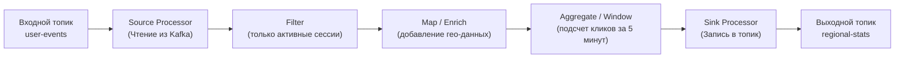
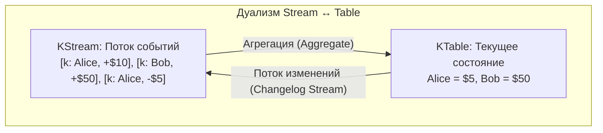
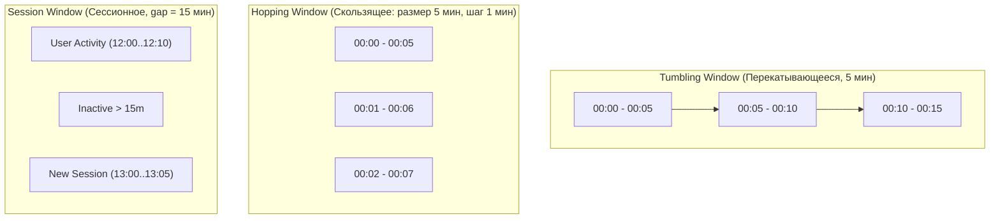
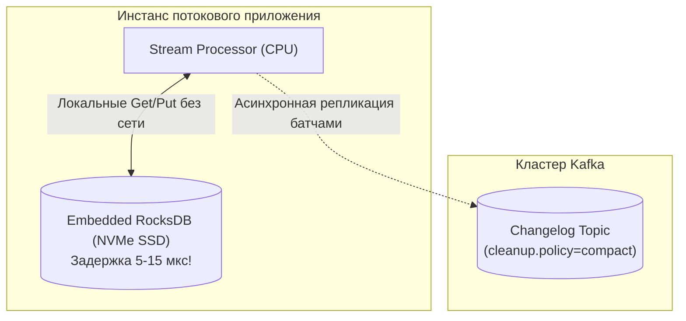

# 9. Kafka Streams: потоковая топология, дуализм потоков и таблиц и локальное состояние

> *"Programs that transform a stream of inputs into a stream of outputs are the cleanest, most composable abstractions in computing."*  
> — Брайан Керниган

> [!NOTE]
> **Связи:** Эта статья опирается на фундамент всего подраздела Kafka: [[1. Kafka. Архитектура и модель log based системы]], [[2. Topics, partitions и offsets]], [[3. Producer и consumer]], [[4. Consumer groups]], [[5. Ordering и partitioning]], [[6. Exactly once в Kafka]], [[7. Kafka storage под капотом]] и [[8. Retention и compaction]]. Мы переходим от инфраструктуры к построению потоковых приложений, которые живут и дышат внутри этой инфраструктуры.

---

## Что такое Kafka Streams

Исторически потоковая обработка больших данных (Stream Processing) ассоциировалась с громоздкими распределенными кластерами: Apache Storm, Apache Spark Streaming, Apache Flink. Развертывание таких систем требовало выделенного кластера, отдельных узлов-мастеров (Master/JobManager), пулов воркеров (TaskManagers), интеграции с YARN или Kubernetes, а также отдельной команды инженеров по эксплуатации.

**Kafka Streams** предложила радикально иную, прорывную парадигму: **потоковая обработка как обычный микросервис, а не тяжеловесный джоб в кластере**.

Kafka Streams — это клиентская библиотека (первоначально реализованная для Java, но породившая аналоги во всех языках, включая Go), которая превращает ваше стандартное приложение в масштабируемый, отказоустойчивый потоковый процессор. 

Ключевые свойства архитектуры:
- **Никаких дополнительных кластеров:** Приложение запускается как обычный контейнер в Kubernetes или процесс на виртуальной машине.
- **Инфраструктура Kafka как координатор:** Масштабирование, обнаружение сбоев, шардирование задач и эластичность строятся на базе стандартного протокола **Consumer Group** ([[4. Consumer groups]]).
- **Встроенное шардированное состояние (Embedded State Store):** Приложение хранит промежуточные агрегаты не во внешней базе данных, а локально на NVMe-диске (по умолчанию в embedded движке RocksDB), реплицируя изменения в компактные changelog-топики Kafka.

С точки зрения Go-разработчика, понимание Kafka Streams необходимо не столько для написания кода на Java, сколько для усвоения фундаментальных паттернов потоковой обработки (Stream-Table Duality, Windowing, Local State Stores, Interactive Queries), которые ежедневно применяются при проектировании распределенных систем на Go.

---

## Основные абстракции: граф процессоров

Kafka Streams моделирует вычисления в виде **топологии процессоров (Processor Topology)** — направленного ациклического графа (DAG), где:
- **Узлы (Nodes):** Процессоры потока (Stream Processors) — чистые функции трансформации, фильтрации или агрегации.
- **Рёбра (Edges):** Непрерывные потоки событий (Streams), связывающие процессоры между собой.

### Дуализм потоков и таблиц (Stream-Table Duality)

Краеугольный камень потоковой обработки — это математический дуализм между потоком изменений и таблицей состояний.

> **Поток (Stream) — это история изменений. Таблица (Table) — это текущий снимок состояния.**  
> Если воспроизвести весь поток изменений с начала — вы получите таблицу.  
> Если отслеживать все модификации строк таблицы — вы получите поток изменений (CDC).

В Kafka Streams этот дуализм выражен тремя базовыми абстракциями:

1. **`KStream` (Поток записей):** Представляет собой непрерывную последовательность независимых фактов. Каждое сообщение — это новое событие в мире. Дубликаты ключей не заменяют друг друга, а дописываются в лог. (Аналог в SQL: таблица логов аудита `INSERT INTO audit_log ...`).
2. **`KTable` (Материализованная таблица):** Представляет собой поток обновлений состояния (Changelog). Новая запись с ключом `K` интерпретируется как `UPSERT` (обновление), перезаписывая предыдущее значение. Запись со значением `null` (Tombstone) интерпретируется как `DELETE`. Каждая партиция KTable представляет собой локальный срез таблицы, шардированный по ключу.
3. **`GlobalKTable` (Глобальная таблица справочников):** В отличие от KTable, которая шардируется между инстансами консьюмеров, GlobalKTable **полностью реплицируется на каждый экземпляр приложения**. Она вычитывает все партиции топика и идеально подходит для справочников (страны, валюты, тарифные сетки), позволяя выполнять быстрые локальные соединения (joins) без дорогостоящего перераспределения входного потока (re-keying / shuffling).

---

## Stateless и stateful операции

### Stateless (без сохранения состояния)

Операции, не зависящие от истории предшествующих сообщений. Каждое событие обрабатывается изолированно в оперативной памяти:

- **`filter` / `filterNot`:** Пропуск или отсеивание сообщений по предикату;
- **`map` / `mapValues`:** Преобразование ключа или полезной нагрузки;
- **`flatMap` / `flatMapValues`:** Преобразование одного входящего сообщения в ноль, один или список исходящих сообщений;
- **`branch`:** Разделение одного входящего потока на несколько независимых ветвей в зависимости от бизнес-условий.

Stateless-операции тривиальны в эксплуатации: они не требуют дисковой памяти, не создают changelog-топиков и мгновенно перебалансируются при перезапуске подов.

### Stateful (с сохранением состояния)

Операции, результат которых зависит от накопленного исторического контекста:

- **Агрегация (`aggregate`, `count`, `reduce`):** Накопление сумм, счетчиков, средних значений по каждому ключу.
- **Оконные вычисления (`windowedBy`):** Группировка событий по временным интервалам (например, число запросов от пользователя за последние 60 секунд).
- **Потоковые соединения (`join`):**
  - `KStream-KStream Join` — соединение двух потоков событий в пределах скользящего временного окна (например, соединение клика по рекламе с последующей покупкой в течение 30 минут).
  - `KStream-KTable Join` — обогащение входящего потока событий актуальным состоянием сущности из таблицы (например, обогащение заказа текущим адресом пользователя).
  - `KStream-GlobalKTable Join` — обогащение потока глобальным справочником без ограничений по партиционированию.

---

## Окна: как придать времени структуру

В бесконечном потоке данных невозможно вычислить агрегат «для всех записей», потому что поток никогда не завершится. Единственный способ агрегировать данные — нарезать непрерывное время на дискретные **окна (Windows)**:

1. **Tumbling window (перекатывающееся окно):** Окна фиксированной длительности, следующие друг за другом встык без перекрытия (`[00:00-00:05]`, `[00:05-00:10]`). Каждое событие попадает строго в одно окно. Идеально для периодических отчетов.
2. **Hopping window (скользящее окно):** Окна фиксированной длины, сдвигающиеся на шаг, меньший размера окна (например, окно 5 минут с шагом 1 минута). Окна перекрываются; одно событие попадает сразу в несколько окон. Применяется для скользящих средних и алертинга.
3. **Session window (сессионное окно):** Динамическое окно, границы которого определяются активностью пользователя. Окно открывается с первым событием и расширяется, пока интервал между событиями не превышает порог неактивности (`inactivity.gap`). Как только наступает пауза дольше порога — сессия запечатывается.
4. **Sliding window (скользящий join):** Окно, привязанное не к фиксированной временной сетке, а к временной метке конкретной записи. Используется в операциях соединения двух потоков.

---

## Хранение состояния: RocksDB, changelog и восстановление

В чем состоит главная архитектурная слабость наивных микросервисов потоковой обработки?  
Они пытаются хранить агрегаты во внешней базе данных: Redis, PostgreSQL, Cassandra. При потоке в 200 000 RPS каждый апдейт счетчика означает сетевой round-trip к Redis. Сеть перегружается, задержки взлетают до десятков миллисекунд, а внешняя база данных деградирует под нагрузкой.

Kafka Streams решает эту проблему через **Embedded Local State Store**:

Ключевые элементы подсистемы состояния:

- **Локальное хранилище (state store):** По умолчанию каждый экземпляр запускает в своем процессе высокопроизводительный встраиваемый LSM-движок **RocksDB** (разработанный в Meta на базе LevelDB от Google). Данные хранятся в томах, привязанных к экземпляру (обычно `/var/lib/kafka-streams`). Запись в локальный RocksDB занимает **микросекунды**, так как не требует выхода в сеть. В Go-реализациях аналогами могут быть Badger, BoltDB, Pebble.
- **Changelog-топик:** Чтобы локальное состояние не потерялось при гибели сервера, все изменения RocksDB непрерывно реплицируются в специальный внутренний топик Kafka — **Changelog Topic** с политикой уплотнения `cleanup.policy=compact` ([[8. Retention и compaction]]). Настройка параметров компактификации `min.cleanable.dirty.ratio` и `delete.retention.ms` критична для быстрого восстановления.
- **Восстановление после сбоев:** Если инстанс падает, Kubernetes перезапускает его на другой ноде. Новый процесс консьюмера назначается на те же партиции и вычитывает компактный changelog-топик с диска брокера, восстанавливая локальную базу RocksDB до актуального состояния.
- **Standby Replicas (`num.standby.replicas`):** Чтобы многогигабайтное состояние не восстанавливалось с нуля минутами при редеплое, Kafka Streams поддерживает горячие резервные копии. Standby-инстансы пассивно вычитывают changelog-топик в фоновом режиме. При отказе основного воркера Standby-узел мгновенно перехватывает обработку без задержки на холодный прогрев кэша.

> [!info] Под капотом
> RocksDB внутри использует MemTable (буфер записи в оперативной памяти) и фоновую компактификацию SST-файлов. При записи данные сначала попадают в MemTable и WAL на диске, затем асинхронно сливаются в отсортированные строковые таблицы (SST). Это идеально ложится на модель Kafka Streams: быстрая аккумуляция обновлений, периодическое слияние. Страничный кеш Linux активно используется при чтении SST-файлов, а Go-аналоги Badger/Pebble работают по тем же принципам.

---

## Exactly-once семантика

Kafka Streams реализует полноценную семантику **Exactly-Once Processing (EOS)** внутри замкнутого цикла Kafka $\to$ Обработка $\to$ Kafka.

Это достигается благодаря двухфазному коммиту транзакций Kafka ([[6. Exactly once в Kafka]]):
1. Процессор начинает транзакцию.
2. Промежуточные результаты пишутся в выходной топик.
3. Изменения локального состояния отправляются в changelog-топик.
4. Смещения входящего топика фиксируются через вызов `sendOffsetsToTransaction`.
5. Координатор фиксирует транзакцию: данные на выходе, смещения на входе и локальное состояние фиксируются **строго атомарно**.

Если в процессе падает контейнер — незавершенная транзакция прерывается (aborted), а состояние RocksDB откатывается к точке последней зафиксированной контрольной точки (checkpoint).

---

## Интерактивные запросы (Interactive Queries)

Обычно потоковые приложения воспринимают как «черный ящик»: на вход поступают события, на выходе генерируются другие события.

Однако Kafka Streams предлагает революционную возможность: **Interactive Queries** (интерактивные запросы). Поскольку каждый инстанс держит в RocksDB материализованное состояние назначенных ему партиций (например, актуальные балансы пользователей), приложение может поднять локальный HTTP/gRPC API и отвечать на внешние запросы на чтение прямо из RocksDB!

Если запрос от пользователя приходит на Инстанс 1, а данные ключа лежат в партиции Инстанса 2, библиотека предоставляет метаданные `StreamsMetadata`: Инстанс 1 узнает сетевой адрес коллеги (`http://worker-2:8080`) и прозрачно проксирует запрос к нему. 

Таким образом, Kafka Streams превращается в **полноценную распределенную NoSQL базу данных с шардированием по партициям**, материализующую состояние из лога событий!

---

## Mechanical Sympathy: почему локальное состояние эффективнее удалённого

Сравним физику выполнения операции:

| Параметр | Обращение к удаленному Redis/PostgreSQL | Чтение из Local Embedded RocksDB/Badger |
|---|:---:|:---:|
| **Физический путь** | CPU $\to$ TCP Socket $\to$ Маршрутизатор $\to$ Сервер БД $\to$ Диск/RAM БД $\to$ Ответ TCP | CPU $\to$ L3 Cache / DRAM (MemTable) $\to$ PCIe NVMe (SST file) |
| **Задержка (Latency)** | **1 000 – 5 000 микросекунд** (1–5 мс) | **5 – 20 микросекунд** (0.005–0.020 мс) |
| **Точка отказа** | Падение кластера БД останавливает все сервисы | Изолировано: падение одной ноды задевает только её партиции |
| **Сетевой трафик** | $2 \times \text{RPS} \times \text{MsgSize}$ в локальной сети | 0 сетевых пакетов на чтение! |

Локальный SSD/NVMe критичен: RocksDB активно использует fsync для WAL и случайное чтение SST-файлов. На HDD throughput будет плачевным. Использование локальных NVMe-дисков (как в инстансах AWS i3) позволяет получить задержки менее миллисекунды.

---

## Go и потоковая обработка: альтернативы Kafka Streams

В экосистеме Go нет официальной библиотеки от команды Kafka, но сообщество разработало мощные архитектурные решения:

### 1. Goka — библиотека, вдохновлённая Kafka Streams

[Goka](https://github.com/lovoo/goka) — зрелая библиотека от инженеров Lovoo, повторяющая философию Kafka Streams на чистом Go:
- Абстракция `Emitter`, `Processor`, `View`;
- Локальное шардированное состояние на движках **Badger** (LSM-хранилище на Go) или LevelDB;
- Автоматическая репликация в changelog-топики и восстановление состояния при ребалансировках;
- Потокобезопасные представления (Views) для интерактивных запросов.

### 2. Ручная реализация с franz-go

Можно построить потоковый процессор, используя `kgo.Client`, горутины и собственное локальное хранилище (например, Badger, Bolt или Pebble):
- Горутины консьюмера вычитывают батчи через `PollFetches`.
- Обработчик выполняет быстрые `Get/Put` в локальный Pebble Store.
- Изменения состояния пакуются в батчи и отправляются в changelog-топик через транзакционный продюсер `cl.BeginTransaction()`.
- Ребалансировки отслеживаются через коллбеки `OnPartitionsRevoked` (сброс WAL Pebble) и `OnPartitionsAssigned` (прогрев из changelog).

### 3. Использование внешних фреймворков

Для особо масштабных потоковых топологий с экстремально сложными соединениями десятков потоков может быть оправдано использование Apache Flink или Spark Streaming, вызываемых из Go через API, но это уводит от простоты и легковесности микросервисной архитектуры.

---

## Вопросы для собеседования

> [!tip] Собеседование
> **Вопрос:** В чем заключается фундаментальная разница между `KStream` и `KTable`?  
> **Ответ:** `KStream` моделирует поток фактов (фактологический лог, где каждая запись независима, дубликаты сохраняются, а семантика добавления — append-only). `KTable` моделирует поток обновлений состояния (Changelog / Materialized View), где каждая запись с существующим ключом перезаписывает старое значение (UPSERT), а запись с пустым значением (`null`) удаляет ключ (DELETE).

> [!tip] Собеседование
> **Вопрос:** Как Kafka Streams обеспечивает восстановление состояния при перезапуске инстанса, и что такое `standby replicas`?  
> **Ответ:** Каждое локальное состояние (RocksDB) дублируется в служебный компактифицированный changelog-топик Kafka. При падении инстанса новый узел вычитывает changelog и восстанавливает базу на диске. Чтобы этот процесс не вызывал задержек при терабайтных базах, включают `num.standby.replicas`: теневые узлы непрерывно читают changelog в фоновом режиме, держа локальную базу теплой. При аварии standby мгновенно становится активным лидером без перечитывания лога.

---

## Заключение и дальнейшие шаги

Kafka Streams — это кульминация проектирования потоковых систем на основе лога: она превращает партицированный, реплицированный журнал в платформу для stateful-обработки, сохраняя простоту и горизонтальную масштабируемость обычного консьюмера. Понимание её внутреннего устройства и компромиссов критически важно для системного архитектора, даже если реализация будет на Go.

Следующая статья в разделе Kafka — [[10. Kafka Connect]], которая расширяет экосистему за пределы кастомных приложений, предоставляя стандартизированные коннекторы для интеграции с внешними системами без написания кода.