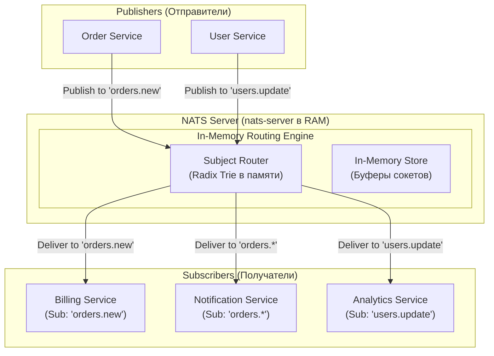
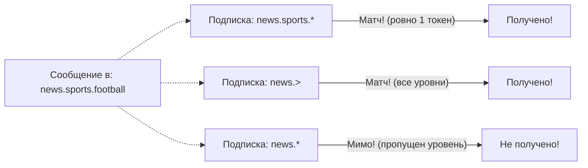
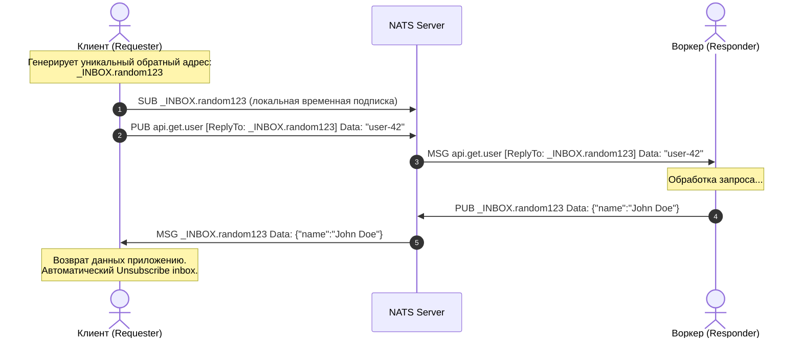

# 1. NATS. Легковесный брокер: философия максимальной простоты и скорости

> *"Simplicity is prerequisite for reliability. Complex systems always break in complex ways; simple systems usually work."*  
> — Эдсгер Дейкстра

> [!NOTE]
> **Связи:** Эта статья открывает подраздел, посвященный NATS. Мы опираемся на концепции [[1. Архитектура очередей сообщений. Push vs Pull, брокерные vs безброкерные]], проводим параллели с изученными ранее [[1. RabbitMQ. Архитектура и основные концепции]] и [[1. Kafka. Архитектура и модель log based системы]], а также закладываем фундамент для понимания продвинутого хранилища [[2. Core NATS vs JetStream]] и [[5. JetStream. Persistence и stream processing]].

---

## Философия и происхождение

В мире распределенных систем существует негласное соревнование в сложности: брокеры сообщений обрастают терабайтными логами на дисках, распределенными консенсусами Paxos/Raft, схемами валидации данных и многоуровневыми транзакционными менеджерами. За всё это приходится платить: гигабайтами потребляемой оперативной памяти, десятками миллисекунд сетевых задержек и армией инженеров по эксплуатации.

**NATS** был рожден как антитеза этой индустриальной громоздкости.

Создатель NATS, Дерек Коллисон (Derek Collison), ранее спроектировавший архитектуру коммерческих систем обмена сообщениями в TIBCO, в 2010 году (в рамках проекта Apcera, с открытием исходного кода в 2012 году) сформулировал радикальную идею: **что, если убрать из брокера вообще всё лишнее, оставив только молниеносную доставку байтов по сети в оперативной памяти?**

Название проекта происходит от метафоры «NASCAR At Television Speed»: **максимальная скорость передачи событий в реальном времени**. NATS построен на основе **асинхронного publish-subscribe** (pub/sub) шаблона, где отправители (publishers) и получатели (subscribers) не связаны напрямую — они взаимодействуют через **subject-based routing**, что делает систему слабо связанной (loosely coupled).

### Физическая модель: радиоэфир вместо почтового склада

Чтобы прочувствовать разницу между традиционными брокерами и Core NATS, проведем физическую аналогию:
- **Kafka и RabbitMQ** работают как огромный централизованный логистический хаб со складами, стеллажами и сейфами: каждое письмо бережно упаковывается, регистрируется в журнале на диске, кладется на полку и ждет, когда адресат придет за ним с распиской. Это надежно, но требует огромных складских площадей (диск, RAM) и времени.
- **Core NATS** работает как **радиопередатчик или оптоволоконный световой импульс**: передатчик вспыхивает фотонами света в эфир (`Publish`). Любой приемник, настроенный на эту частоту (`Subject`), мгновенно улавливает сигнал за микросекунды. Если в момент передачи в комнате никого не было и радиоприемник был выключен — волна бесследно рассеивается в пространстве. Брокер не хранит историю, не ждет подтверждений от отсутствующих подписчиков и не тратит ни одного такта CPU на сохранение на диск!

---

## Архитектура NATS

Центральный элемент NATS — это **сервер (nats-server)**, написанный на языке Go. Он представляет собой компактный статически скомпилированный бинарный файл весом около 15–20 МБ, запускающийся за доли секунды и потребляющий в базовом состоянии менее 20–30 МБ оперативной памяти.

Сервер выступает в роли сверхбыстрого диспетчера (**message broker**): он принимает входящие сообщения от publisher'ов и мгновенно рассылает их соответствующим subscriber'ам на основе строковых тем — **subject'ов**.



**Server** в NATS — это **stateless** компонент, который работает в памяти. Сообщения по умолчанию **не persistent**, что обеспечивает минимальные задержки, но требует осторожного подхода к гарантиям доставки. Для persistent сообщений существует расширение **JetStream** (о котором будет подробнее в статье [[5. JetStream. Persistence и stream processing]]).

---

## Core Concepts

Архитектура Core NATS держится на трех китах: субъектах (Subjects), паттерне Publish-Subscribe и синхронном Request-Reply.

### 1. Subject (Тема)

Subject — это чувствительная к регистру строка в кодировке ASCII, разделенная точками на логические токены. Это аналог топика в Kafka или Routing Key в RabbitMQ, но с более гибкой и быстрой моделью сопоставления.

Примеры иерархических субъектов:
```
orders.new
orders.completed
users.created
users.profile.updated
news.sports.football
```

Подписчики могут подписываться как на точные имена субъектов, так и использовать два типа подстановочных символов (**wildcards**):

- **Символ `*` (звездочка)** — подменяет **ровно один уровень (токен)** в иерархии. Например, подписка `orders.*` будет получать события `orders.new` и `orders.completed`, но **не** получит `orders.new.special` или `orders`.
- **Символ `>` (больше)** — подменяет **все последующие уровни** до конца строки (может стоять только в самом конце субъекта). Например, подписка `news.>` будет матчить `news.sports`, `news.sports.football`, `news.tech.ai` и любую более глубокую вложенность.



---

### 2. Publish-Subscribe (Pub/Sub)

Это основной паттерн взаимодействия в NATS. Publisher отправляет сообщение в определённый subject, а все активные подписчики на этот subject получают персональную копию сообщения. Это классический **fan-out** паттерн: одно сообщение может быть параллельно доставлено десяткам независимых микросервисов.

Пример на Go с использованием официального клиента `github.com/nats-io/nats.go`:

```go
package main

import (
	"fmt"
	"log"
	"time"

	"github.com/nats-io/nats.go"
)

func main() {
	// Подключение к серверу (по умолчанию nats://localhost:4222)
	nc, err := nats.Connect(nats.DefaultURL)
	if err != nil {
		log.Fatalf("failed to connect to nats: %v", err)
	}
	defer nc.Close()

	// Subscriber 1: Подписка на точный субъект
	sub1, err := nc.Subscribe("orders.new", func(msg *nats.Msg) {
		fmt.Printf("[Consumer 1] received: %s (subject: %s)\n", string(msg.Data), msg.Subject)
	})
	if err != nil {
		log.Fatalf("failed to subscribe: %v", err)
	}
	defer sub1.Unsubscribe()

	// Subscriber 2: Второй независимый подписчик (fan-out)
	sub2, err := nc.Subscribe("orders.*", func(msg *nats.Msg) {
		fmt.Printf("[Consumer 2 - Wildcard] received: %s\n", string(msg.Data))
	})
	if err != nil {
		log.Fatalf("failed to subscribe: %v", err)
	}
	defer sub2.Unsubscribe()

	// Publisher: Отправка события
	payload := []byte("Order #123 created for $250")
	if err := nc.Publish("orders.new", payload); err != nil {
		log.Fatalf("failed to publish: %v", err)
	}

	// Flush гарантирует, что локальный клиентский буфер сброшен в сокет
	if err := nc.FlushTimeout(1 * time.Second); err != nil {
		log.Fatalf("flush failed: %v", err)
	}

	// Даем время горутинам обработать событие
	time.Sleep(100 * time.Millisecond)
}
```

> [!info] Под капотом
> Внутри `nats-server` сообщения обрабатываются через **асинхронные горутины** и **каналы** Go. Каждый connection к серверу — это отдельная горутина, которая читает/пишет через `net.Conn`. Сервер использует **многопоточную обработку** (на уровне планировщика Go) для маршрутизации сообщений между subject'ами. При этом сама маршрутизация — это **in-memory lookup** по префиксному дереву (Radix Tree), что занимает микросекунды и не требует блокировок глобального мьютекса на горячем пути.

---

### 3. Request-Reply (Sync RPC over Async Transport)

В микросервисной архитектуре постоянно возникает необходимость в синхронном получении ответа на запрос (RPC — Remote Procedure Call). Вместо того чтобы поднимать отдельный стек HTTP/REST или gRPC, NATS предоставляет элегантный паттерн **Request-Reply прямо поверх асинхронного pub/sub**:



Как это работает:
1. Клиент вызывает метод `nc.Request(subject, data, timeout)`.
2. Клиентская библиотека автоматически генерирует уникальный одноразовый субъект для ответа — так называемый **Inbox** (например, `_INBOX.x7z9Q1...`), подписывается на него и передает его имя в служебном поле сообщения `Reply`.
3. Сервер-обработчик получает сообщение, извлекает `msg.Reply` и отправляет ответ в этот адрес: `nc.Publish(msg.Reply, response)`.
4. Клиент получает ответ, отменяет временную подписку и возвращает результат в вызывающий код, укладываясь в заданный таймаут.

```go
// Сервер (Responder)
_, err = nc.Subscribe("api.get.user", func(msg *nats.Msg) {
    userID := string(msg.Data)
    response := fmt.Sprintf(`{"id": "%s", "name": "John Doe"}`, userID)
    // Отправляем ответ на временный subject из поля msg.Reply
    if msg.Reply != "" {
        _ = nc.Publish(msg.Reply, []byte(response))
    }
})

// Клиент (Requester)
msg, err := nc.Request("api.get.user", []byte("123"), 2*time.Second)
if err != nil {
    log.Printf("Request failed: %v", err)
    return
}
fmt.Printf("Response: %s\n", string(msg.Data))
```

---

## Преимущества NATS

1. **Минималистичность:** Сервер `nats-server` весит всего ~15 МБ, потребляет минимум RAM и CPU, запускается за сотые доли секунды в scratch-контейнерах Docker.
2. **Экстремальная производительность:** Способен маршрутизировать от 1 до 10 миллионов сообщений в секунду на одном сервере с задержками менее 100 микросекунд.
3. **Простота деплоя и эксплуатации:** Единый бинарный файл, плоский текстовый конфигурационный файл, 0 внешних зависимостей (нет ZooKeeper, нет etcd, нет JVM).
4. **Легковесные клиенты:** Клиентская библиотека на Go не содержит CGO, использует только стандартный пакет `net` и весит считанные мегабайты.
5. **Cloud Native & Multi-tenancy:** Нативная интеграция с Kubernetes, поддержка Leaf Nodes для Edge/IoT, JWT-аутентификация с децентрализованными учетными записями (NATS 2.0+).

---

## Устройство сообщения NATS

Протокол NATS предельно прост: это текстовый протокол поверх TCP, напоминающий HTTP/1.1 или Redis RESP. 

Структура сообщения в Go-клиенте отражает эту спартанскую простоту:

```go
type Msg struct {
    Subject string        // Тема (субъект) сообщения
    Reply   string        // Субъект для ответа (в request-reply)
    Data    []byte        // Полезная нагрузка (сырые байты)
    Sub     *Subscription // Указатель на подписку, принявшую сообщение
    Header  Header        // Карта метаданных и трассировки (NATS 2.2+)
}
```

> [!warning] Ловушка / Gotcha: Отсутствие хранения в Core NATS
> Core NATS предоставляет строгую семантику **At-most-once («не более одного раза»)**.  
> Если продюсер опубликовал сообщение, а в этот момент ни один консьюмер не слушал данный субъект — сообщение **безвозвратно исчезает в ту же миллисекунду**. NATS не сохранит его на диск и не выдаст новому подписчику, подключившемуся через 5 секунд!  
> Если вашей системе критически необходимо гарантированное сохранение сообщений, защита от сбоев подписчиков и перечитывание истории — обязательно используйте подсистему **JetStream** ([[2. Core NATS vs JetStream]], [[5. JetStream. Persistence и stream processing]]).

---

## NATS vs. другие брокеры

| Характеристика | NATS (Core) | RabbitMQ | Apache Kafka |
|---|---|---|---|
| **Хранилище данных** | In-Memory (RAM) | Persistent на диске (Erlang Mnesia/Khepri) | Append-Only Log на диске (сегменты) |
| **Гарантии доставки** | At-most-once (Fire-and-forget) | Configurable (At-least-once / At-most-once) | At-least-once / Exactly-once |
| **Модель маршрутизации** | Subject-based (иерархии + wildcards) | Exchange / Queue / Routing Keys | Partitioned Topics по хэшу ключа |
| **Задержка (Latency p99)** | **Микросекунды (10–100 мкс)** | Миллисекунды (1–5 мс) | Миллисекунды (3–10 мс) |
| **Потребление ресурсов** | Минимальное (~30 МБ RAM) | Среднее (~200–500 МБ RAM) | Высокое (~4–8 ГБ JVM + Page Cache) |
| **Эксплуатационная сложность** | Близкая к нулю (1 бинарник) | Средняя/Высокая | Высокая |

---

## Security и аутентификация

Безопасность в NATS не принесена в жертву простоте. Платформа поддерживает полный спектр средств разграничения доступа:

- **Token authentication:** Простая аутентификация по секретному токену в строке подключения;
- **Username / Password:** Классические пары логин/пароль с хэшированием;
- **TLS/SSL Encryption:** Полное шифрование трафика с взаимной валидацией сертификатов (mTLS);
- **Децентрализованная безопасность на JWT (NATS 2.0+):** Революционная система без единого центра авторизации на базе открытых ключей Эдвардса (Ed25519 NKeys). Пользователи получают JWT-токены с ограниченными правами (например, право публиковать только в `orders.*` и читать только из `orders.processed`). Сервер проверяет криптографическую подпись локально без запросов во внешние базы данных.

Пример безопасного подключения на Go:

```go
nc, err := nats.Connect(nats.DefaultURL,
    nats.Token("secret-token"),
    nats.Secure(), // TLS
)
```

---

## Кластеризация и отказоустойчивость

Серверы NATS объединяются в **Full Mesh кластер**: брокеры устанавливают TCP-соединения между собой и синхронизируют информацию о зарегистрированных подписчиках через облегченный протокол gossip.

Для гео-распределенных сред NATS поддерживает две уникальные концепции:
1. **Superclusters:** Объединение нескольких независимых кластеров в разных дата-центрах или регионах мира через шлюзы (Gateways).
2. **Leaf Nodes («Листовые узлы»):** Микро-серверы NATS, работающие на удаленных IoT-устройствах, кораблях, заводах или в закрытых периметрах. Они работают локально даже при полном обрыве интернета, а при восстановлении связи прозрачно синхронизируются с головным кластером в облаке.

---

## Performance Benchmarks

В независимых тестах производительности Core NATS стабильно демонстрирует выдающиеся показатели:
- Более **1 000 000+ сообщений в секунду** на одно процессорное ядро;
- Задержка доставки (End-to-End Latency) **менее 1 миллисекунды** на перцентиле p99;
- Способность удерживать **десятки тысяч активных TCP-соединений** при расходе оперативной памяти менее 50–100 МБ.

---

## Когда использовать NATS

- **Внутренняя шина микросервисов (Internal Event Bus):** Мгновенная рассылка событий между сервисами внутри кластера Kubernetes.
- **Service Mesh & Sidecar:** Легковесный транспорт для межсервисной коммуникации взамен тяжелых прокси.
- **Real-time нотификации и WebSockets:** Рассылка котировок, чатов, пушей миллионам клиентов.
- **IoT и Edge Computing:** Запуск на слабых процессорах (Raspberry Pi, ARM-микроконтроллеры) с нестабильной сетью.
- **Высокочастотные торговые системы (HFT):** Где каждая микросекунда задержки напрямую конвертируется в финансовые потери.

---

> [!tip] Вопрос с собеседования
> **Вопрос:** «Что произойдет в Core NATS, если консьюмер обрабатывает сообщения медленнее, чем продюсер их отправляет (Slow Consumer)?»  
> **Ответ:** Поскольку Core NATS не сохраняет сообщения на диске, сервер буферизирует входящие сообщения для каждого сокета подписчика в памяти (по умолчанию лимит буфера `PendingLimits` составляет 64 МБ или 65 536 сообщений). Если медленный подписчик переполняет этот буфер, сервер NATS принудительно обрывает соединение с ним, регистрируя ошибку `Slow Consumer Dropped`. Это защищает брокер от деградации по памяти и сохраняет стабильность работы остальных подписчиков. Для надежной буферизации с backpressure необходимо использовать **NATS JetStream**.

---

## Итог

NATS — это **минималистичный**, **быстрый** и **облегченный** брокер сообщений, идеально подходящий для построения **event-driven** и **real-time** систем. Его сила — в простоте и производительности. Однако для production-систем с требованиями к **durability** и **exactly-once** доставке нужно использовать **JetStream**, который добавляет persistent возможности поверх core NATS.

В следующей статье мы рассмотрим [[2. Core NATS vs JetStream]], чтобы детально сопоставить две модели и научиться безошибочно выбирать между ними.