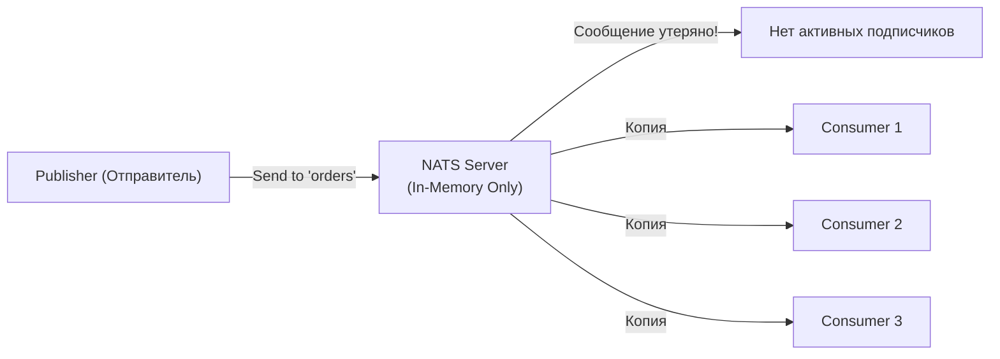
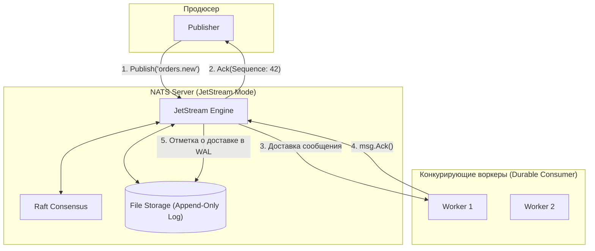

# 2. Core NATS vs JetStream: эфемерный транспорт против долговечного потока

> *"The primary virtue of a good transport layer is that it gets out of your way and lets bytes fly. But when you need memory, you must pay for physics."*  
> — Брайан Керниган

> [!NOTE]
> **Связи:** Эта статья продолжает вводный обзор [[1. NATS. Легковесный брокер]], углубляя разделение между транспортным и персистентным уровнями платформы, развивает темы моделей доставки из [[4. Модели доставки. At most once, at least once, exactly once]] и готовит читателя к детальному разбору [[5. JetStream. Persistence и stream processing]].

---

NATS — это не просто один монолитный продукт, а **двухуровневая экосистема**, объединяющая два принципиально разных класса систем: **Core NATS** (классический легковесный транспорт) и **JetStream** (полноценную платформу персистентного стриминга). 

Понимание архитектурного водораздела между ними критично для любого инженера. Проводить знак равенства между Core NATS и JetStream — всё равно что сравнивать «голый» сокет **TCP/UDP** и транзакционную базу данных: первое решает задачу быстрой доставки байтов между двумя сетевыми точками, второе гарантирует сохранность состояния, порядок и воспроизводимость событий при любых аппаратных сбоях.

---

### Core NATS: Воздушный шар, а не реактивный двигатель

**Core NATS** — это **asynchronous message transport**. Он предоставляет только **pub/sub** и **request/reply** модели. Это **stateless**, **in-memory** брокер. Он работает как **fire-and-forget** система: сообщение отправлено — и если никто не слушает — оно потеряно.

Философия Core NATS предельно честна: *«Я доставлю ваше сообщение всем, кто слушает прямо сейчас, сделаю это за микросекунды и тут же забуду о его существовании»*.

#### Особенности Core NATS

- **No persistence:** Сообщения существуют исключительно в оперативной памяти сервера (в буферах сокетов). Если сервер перезапустился — недоставленные сообщения исчезают.
- **No delivery guarantees:** Отсутствуют протокольные подтверждения (ACK/NACK), нет очередей недоставленных сообщений (DLQ) и механизмов автоматического повтора (retry).
- **No ordering guarantees:** В рамках субъекта порядок сохраняется только от одного TCP-соединения; при параллельных отправителях глобальный порядок не отслеживается.
- **High performance:** Миллионы сообщений в секунду на одном ядре CPU, задержки менее 100 микросекунд ($<1\text{ ms}$).
- **Minimal resource usage:** Всего ~30–50 МБ оперативной памяти и один статический бинарник весом ~15 МБ.
- **Fan-out only:** Одно сообщение получают все активные подписчики; по умолчанию нет концепции «кто-то один должен обработать» (если не используются Queue Groups).

```go
// Core NATS: Fire and forget
err := nc.Publish("events.order.created", []byte("order data"))
// Если никто не подписан — сообщение потеряно
// Если подписано 3 консьюмера — каждый получит копию
```



> [!warning] Ловушка / Gotcha: Семантика At-most-once
> Core NATS **не гарантирует доставку**. Это **at-most-once** модель по умолчанию. Если publisher отправил сообщение в момент, когда ни один consumer не был подключен — сообщение **исчезает навсегда**. Это не баг, а осознанное архитектурное свойство для систем, где важна **скорость**, а не **надежность** (телеметрия, котировки, метрики, чаты).

---

### JetStream: Постоянный двигатель с GPS и автопилотом

Исторически первой попыткой добавить хранилище в NATS был проект *NATS Streaming (STAN)*. Однако STAN был отдельным надстроечным процессом со своей тяжелой клиентской библиотекой, отдельными соединениями и узким горлышком по масштабированию. В NATS 2.2 команда Коллисона полностью переписала подсистему персистентности с нуля, создав **JetStream** — встроенный прямо в ядро `nats-server` движок стриминга.

**JetStream** — это **persistent message streaming platform**, построенный **поверх Core NATS**. Это полноценная **streaming платформа** с **durability**, **ordering**, **replay**, **consumer groups** и другими enterprise-функциями.

#### Особенности JetStream

- **Persistent storage:** Сообщения сериализуются на NVMe-диск (File Storage) либо в кольцевые буферы оперативной памяти (Memory Storage) с политиками удержания (Retention Policy).
- **Delivery guarantees:** Гарантии **At-least-once** («как минимум один раз») и **Exactly-once** (через окно дедупликации `deduplication window` по заголовку `Nats-Msg-Id`).
- **Message replay:** Потребители могут перечитывать историю потока с любого момента: с самого начала (`DeliverAll`), с определенного смещения (Sequence Number), за последние $N$ минут или по времени (`DeliverByStartTime`).
- **Consumer groups (Push & Pull):** Поддержка конкурирующих потребителей с подтверждением обработки (`msg.Ack()`, `msg.Nak()`, `msg.Term()`).
- **Stream retention:** Удаление старых сообщений по времени (`MaxAge`), общему объему (`MaxBytes`), количеству записей (`MaxMsgs`) или по факту обработки (`WorkQueuePolicy`).
- **Replication:** Встроенный консенсус на базе алгоритма **Raft** (без внешних зависимостей) с кворумом репликации ($R=1, 3, 5$).
- **KV и Object Storage:** Высокоуровневые распределенные абстракции Key-Value и Object Store, реализованные поверх стримов JetStream.

```go
package main

import (
	"fmt"
	"log"

	"github.com/nats-io/nats.go"
)

func main() {
	nc, err := nats.Connect(nats.DefaultURL)
	if err != nil {
		log.Fatal(err)
	}
	defer nc.Close()

	// JetStream: Инициализация контекста
	js, err := nc.JetStream()
	if err != nil {
		log.Fatal(err)
	}

	// Создаем персистентный стрим ORDERS
	_, err = js.AddStream(&nats.StreamConfig{
		Name:      "ORDERS",
		Subjects:  []string{"orders.*"},
		Storage:   nats.FileStorage,       // Персистентная запись на диск
		Retention: nats.WorkQueuePolicy,   // Удаляет сообщение только после Ack!
	})
	if err != nil {
		log.Fatal(err)
	}

	// Публикуем сообщение с подтверждением записи брокером
	ack, err := js.Publish("orders.new", []byte(`{"order_id": 100500, "amount": 420.0}`))
	if err != nil {
		log.Printf("Publish error: %v", err)
	} else {
		fmt.Printf("Published message stored with Stream Sequence: %d\n", ack.Sequence)
	}

	// Создаем персистентный Consumer с сохранением прогресса
	_, err = js.QueueSubscribe("orders.*", "workers", func(msg *nats.Msg) {
		fmt.Printf("Processing order: %s\n", string(msg.Data))
		// Явное подтверждение обработки (ACK)
		if err := msg.Ack(); err != nil {
			log.Printf("Ack error: %v", err)
		}
	}, nats.Durable("order_worker_group"))
	if err != nil {
		log.Fatal(err)
	}
}
```



> [!info] Под капотом
> JetStream использует **RAFT consensus algorithm** для обеспечения согласованности между репликами. Внутри он хранит сообщения в **append-only logs** (как Kafka), но с гораздо более легковесной архитектурой. RAFT реализован **внутри самого nats-server**, без внешних зависимостей. Метаданные стримов и смещения потребителей синхронизируются внутри того же процесса, что исключает сетевые задержки на внешние координаторы.

---

### Сравнительная таблица: Core NATS против JetStream

| Характеристика | Core NATS | JetStream |
|---|:---:|:---:|
| **Хранилище данных** | In-Memory (буферы сокетов) | Persistent (файлы на диске или RAM ring-buffer) |
| **Гарантии доставки** | At-most-once (Fire-and-forget) | At-least-once, Exactly-once (окно дедупликации) |
| **Подтверждения (ACK/NACK)** | ❌ Отсутствуют | ✅ `msg.Ack()`, `msg.Nak()`, `msg.Term()` |
| **Message Replay (повторное чтение)** | ❌ Невозможно | ✅ С любого offset, времени или снапшота |
| **Группы потребителей** | ⚠️ Только эфемерные Queue Groups | ✅ Полноценные Consumer Groups (Pull/Push, Durable) |
| **Управление жизненным циклом** | ❌ Нет | ✅ Retention (Limits, Interest, WorkQueue) |
| **Репликация и консенсус** | ❌ Нет репликации сообщений | ✅ RAFT-консенсус ($R=1, 3, 5$) |
| **Производительность** | **Экстремальная:** 1M–10M msg/s, $<100\ \mu\text{s}$ | **Высокая:** 100K–500K msg/s, $1–10\text{ ms}$ |
| **Потребление ресурсов** | Минимальное (~30 МБ RAM) | Зависит от объема логов и дискового I/O |
| **Типовые сценарии** | Метрики, сигналы, heartbeats, RPC | Финансовые транзакции, Event Sourcing, Task Queues |

---

### Когда использовать Core NATS?

- **Real-time notifications:** WebSockets-нотификации, чат-приложения, live dashboards, алертинг мониторинга.
- **Service discovery & Heartbeats:** Опрос статуса компонентов (`service.health.check`), регистрация подов.
- **Event broadcasting:** Трансляция телеметрии, спортивных событий, биржевых котировок (Market Data).
- **Low-latency RPC:** Синхронные межсервисные вызовы Request-Reply с микросекундной задержкой.
- **Высокочастотные сигналы:** Когда потеря пары промежуточных сообщений не критична, так как следующее актуальное состояние прибудет через 50 миллисекунд.

```go
// Пример: Live Price Updates
nc.Publish("market.price.BTCUSD", []byte(`{"price": 43250.50}`))
// Даже если кто-то пропустил — следующая цена придет через 100ms
```

---

### Когда использовать JetStream?

- **Event Sourcing & CQRS:** Хранение полной и неизменяемой истории бизнес-событий.
- **Финансовые транзакции:** Платежные шлюзы, биллинг, списание балансов (потеря сообщения недопустима).
- **Очереди задач (Task Queues):** Надежная фоновая обработка тяжелых задач с ретраями и Dead Letter Queue.
- **Аудит и комплаенс:** Гарантированное сохранение логов безопасности и действий пользователей.
- **Data Pipelines:** Потоковые конвейеры ETL, где критичен строгий порядок и семантика At-least-once.

```go
// Пример: Financial Transaction Log
ack, _ := js.Publish("transactions.credit", []byte(txData))
// Сообщение гарантированно сохранено в RAFT-кворуме
// Можно в любой момент восстановить состояние счета из лога
```

---

### Практические примеры использования

В реальных архитектурах на Go обе технологии **не конкурируют, а гармонично дополняют друг друга**:

#### Сценарий 1: Микросервисная архитектура

```go
// Core NATS: Легковесный межсервисный heartbeat без нагрузки на диски
nc.Publish("service.health.check", []byte("auth-service:alive"))

// JetStream: Фиксация критического бизнес-события создания заказа
js.Publish("transaction.created", []byte(orderData))
```

#### Сценарий 2: Real-time Analytics

```go
// Core NATS: Высокочастотный поток кликов пользователей (Clickstream)
nc.Publish("user.activity.click", []byte(userData))

// JetStream: Сохранение итоговых агрегированных метрик за час
js.Publish("metrics.aggregated.hourly", []byte(hourlyData))
```

---

### Performance Considerations: цена долговечности

Почему Core NATS выдает более миллиона сообщений в секунду, а JetStream — сотни тысяч?

- **Core NATS:** Нет дискового I/O, нет ожидания подтверждений (ACK), нет межсерверного консенсуса. Процессор просто перекладывает байты из сетевого буфера сокета одного клиента в сокет другого через Go netpoller (`epoll`).
- **JetStream:** Каждое сообщение обязано пройти через протокол RAFT (сетевой round-trip между кворумом нод), записаться в файл упреждающей записи на диске (WAL), при необходимости выполнить `fsync` и дождаться подтверждения `Ack` от консьюмера.

Физику нельзя обмануть: **долговечность стоит сетевых миллисекунд и дисковых операций**.

---

> [!tip] Собеседование
> **Вопрос:** В чем разница между Queue Groups в Core NATS и Consumer Groups в JetStream?  
> **Ответ:** Queue Groups в Core NATS — это механизм балансировки нагрузки в оперативной памяти: сервер распределяет входящие сообщения между пирами группы по алгоритму round-robin (одно сообщение обрабатывается одним воркером). Однако если воркер упадет в процессе обработки, сообщение будет навсегда потеряно, так как нет подтверждений (ACK) и очередей повторов. Consumer Groups в JetStream обеспечивают балансировку поверх персистентного лога: если воркер не прислал `msg.Ack()` до истечения таймаута (`AckWait`), JetStream автоматически переотправит сообщение другому доступному воркеру.

---

### Migration Path: эволюционный путь

Благодаря единому клиенту переход с Core NATS на JetStream не требует переписывания архитектуры с нуля:

1. **Этап 1:** Запуск сервисов на Core NATS для валидации продуктовых гипотез и скоростного прототипирования;
2. **Этап 2:** Включение JetStream для критических финансовых и транзакционных топиков с помощью `js.AddStream()`;
3. **Этап 3:** Использование гибридного подхода: легковесные сигналы и RPC остаются на Core NATS, а бизнес-факты переносятся в стримы JetStream.

---

### Итог

- **Core NATS** — это **транспортный уровень** для быстрых, эфемерных сообщений без состояния.
- **JetStream** — это **прикладной уровень хранения потоков** с долговечностью, порядком и воспроизведением.
- Выбор определяется бизнес-требованиями: максимальная скорость против абсолютной надежности.
- Они идеально **дополняют**, а не исключают друг друга.

В следующей статье — [[3. Subject based routing]] — мы детально разберем внутреннюю механику маршрутизации по темам, синтаксис wildcards и то, как дерево префиксов NATS превосходит очереди традиционных брокеров.