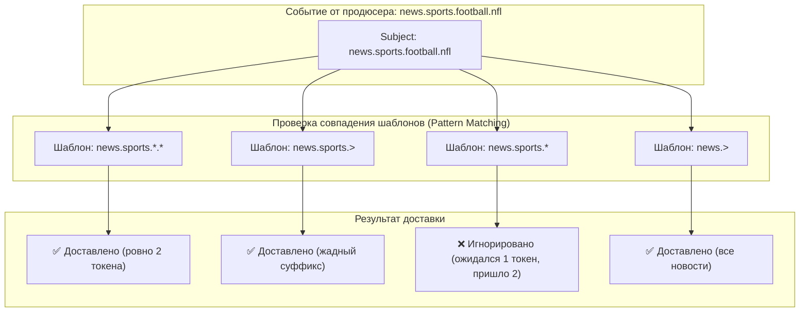
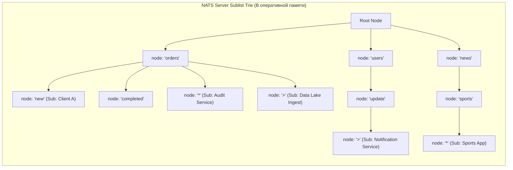
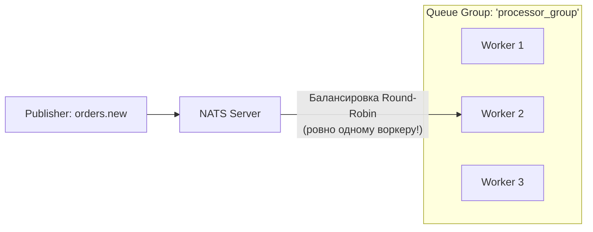

# 3. Subject-based routing: иерархии, wildcards и механика префиксных деревьев

> *"The name of a variable, a function, or a channel should tell you what it is, simply and clearly. Good namespaces make complex architectures self-documenting."*  
> — Брайан Керниган

> [!NOTE]
> **Связи:** Эта статья продолжает погружение в архитектуру NATS, начатое в [[1. NATS. Легковесный брокер]] и [[2. Core NATS vs JetStream]]. Мы разберем сердце маршрутизации NATS — строковые субъекты, сопоставим их с механизмами топиков из [[2. Topics, partitions и offsets]] и обменников из [[2. Exchanges, queues и bindings]], а также подготовимся к изучению синхронного взаимодействия в [[4. Request Reply паттерн]].

---

## Что такое Subject?

В большинстве традиционных брокеров сообщений адресация данных жестко привязана к предварительно создаваемым тяжеловесным сущностям:
- В **Apache Kafka** вы обязаны заранее объявить топик (`Topic`), выбрать количество партиций и фактор репликации. Имена топиков образуют плоское пространство имен (`orders_v1`, `user_events`).
- В **RabbitMQ** маршрутизация требует предварительного объявления обменников (`Exchange`), очередей (`Queue`) и биндингов (`Binding`) с ключами маршрутизации.

**NATS подошел к маршрутизации совершенно иначе:** здесь нет необходимости предварительно создавать топики или настраивать конфигурации на сервере! 

**Subject (Субъект)** в NATS — это динамическая иерархическая строка, состоящая из буквенно-цифровых **токенов (tokens)**, разделенных **точками** (`.`). 

Каждый токен представляет собой смысловой уровень иерархии (пространство имен, домен, сущность, действие, регион). Это напоминает структуру путей в файловой системе Unix (`/var/log/nginx/access.log`) или URL в HTTP, но работает со скоростью процессорных регистров непосредственно в оперативной памяти брокера.

Примеры выразительных subject'ов в реальных системах:

```
orders.new
orders.completed
orders.cancelled
users.create
users.update.profile
users.delete
news.sports.football.nfl
news.sports.basketball.nba
news.tech.software
payments.credit.card.visa
payments.debit.bank.transfer
```

Продюсер может в любую миллисекунду отправить сообщение в абсолютно любой субъект, например `metrics.sensor.temperature.europe.rack-42`, даже если этот субъект никогда раньше не упоминался в системе. Если подписчиков нет — сообщение мгновенно исчезает. Если есть — доставляется за доли микросекунды.

---

## Иерархическая структура и Wildcards

Главная мощь субъектов NATS раскрывается благодаря механизму сопоставления с шаблонами (**Pattern Matching**). Подписчик может подписаться не только на один конкретный субъект, но и на целое поддерево событий с помощью двух простых подстановочных знаков (**Wildcards**):

1. **Одиночный wildcard `*` (PWC — Partial Wildcard):**
   - Заменяет **строго один токен** между точками.
   - Подписка `orders.*` перехватит: `orders.new`, `orders.completed`, `orders.cancelled`.
   - Но **не перехватит**: `orders.payment.failed` (здесь два токена после `orders`) и не перехватит просто `orders` (ноль токенов).

2. **Жадный wildcard `>` (FWC — Full Wildcard):**
   - Заменяет **один или более любых токенов до самого конца строки**.
   - Может стоять **только в самом конце** выражения подписки.
   - Подписка `orders.>` перехватит: `orders.new`, `orders.payment.processing`, `orders.refund.initiated.approved` и вообще любую вложенность внутри пространства `orders`.



Сравнение поведения масок:
- `news.sports.*` — матчит `news.sports.football`, `news.sports.basketball`, но **не** матчит `news.sports.football.nfl`.
- `news.sports.>` — матчит `news.sports.football`, `news.sports.football.nfl` и всё, что глубже.
- `*.payment.*` — матчит `orders.payment.status`, `users.payment.method`.

---

## Механизм маршрутизации

Когда publisher отправляет сообщение в NATS, сервер должен за считанные наносекунды найти всех подписчиков, чьи фильтры соответствуют данному конкретному субъекту.

Если бы NATS использовал регулярные выражения (RegExp) или линейный перебор массива подписчиков $O(N)$, производительность деградировала бы уже при 10 000 клиентах. 

Вместо этого `nats-server` использует специализированное многолучевое префиксное дерево — **Sublist (Radix Trie)**, оптимизированное под механическую симпатию к кэш-линиям CPU:



### Как устроен Sublist в Go-исходниках `nats-server`

Внутри ядра NATS (`server/sublist.go`) маршрутизация реализована через структуру `sublist`:
1. Каждая вершина дерева содержит хэш-таблицу точных совпадений литералов (`nodes map[string]*node`), ссылку на поддерево частичной маски `*` (`pwc *node`) и список подписчиков полной маски `>` (`fwc *node`).
2. При поступлении сообщения сервер разбивает субъект на токены прямо на срезе байтов без аллокаций памяти (`zero-allocation tokenization`).
3. Поиск выполняется за **один проход по дереву**: алгоритм рекурсивно спускается по точной ветке, одновременно собирая подписчиков из узлов `*` и `>`.
4. **Subscription Cache (Кэш сопоставлений):** Сервер кэширует результаты сопоставлений для часто повторяющихся субъектов в быстрой хэш-таблице (с атомарной инвалидацией при добавлении новых подписчиков). Благодаря этому повторные сообщения маршрутизируются за время $O(1)$!

> [!info] Под капотом
> Внутри `nats-server` используется соптимизированная trie-структура для хранения всех активных subscriptions. При получении сообщения сервер быстро находит все matching subscription'ы через single-pass lookup. Это делает routing $O(K)$ от глубины иерархии субъекта ($K \approx 3..6$ токенов), что полностью независимо от общего числа подписчиков в системе ($N$). Никакого регулярного парсинга, никаких блокировок глобального мьютекса на горячем пути!

---

## Пример кода: Использование Subject Routing

Продемонстрируем работу точных подписок и подписок с масками на Go с использованием официального пакета `github.com/nats-io/nats.go`:

```go
package main

import (
	"fmt"
	"log"
	"time"

	"github.com/nats-io/nats.go"
)

func main() {
	// Подключение к серверу NATS
	nc, err := nats.Connect(nats.DefaultURL)
	if err != nil {
		log.Fatalf("connection failed: %v", err)
	}
	defer nc.Close()

	// 1. Подписка на точный субъект: только новые заказы
	_, err = nc.Subscribe("orders.new", func(msg *nats.Msg) {
		fmt.Printf("Specific Order Handler: %s\n", string(msg.Data))
	})
	if err != nil {
		log.Fatal(err)
	}

	// 2. Подписка на все заказы первого уровня вложенности (wildcard *)
	_, err = nc.Subscribe("orders.*", func(msg *nats.Msg) {
		fmt.Printf("Wildcard Order Handler: %s (subject: %s)\n", 
			string(msg.Data), msg.Subject)
	})
	if err != nil {
		log.Fatal(err)
	}

	// 3. Жадная подписка на все события профиля пользователя любой глубины (wildcard >)
	_, err = nc.Subscribe("users.update.>", func(msg *nats.Msg) {
		fmt.Printf("User Update Handler: %s (full path: %s)\n", 
			string(msg.Data), msg.Subject)
	})
	if err != nil {
		log.Fatal(err)
	}

	// Убедимся, что сервер зарегистрировал подписки
	_ = nc.Flush()

	// Публикация тестовых событий
	_ = nc.Publish("orders.new", []byte("New order #123"))
	_ = nc.Publish("orders.completed", []byte("Order #123 completed"))
	_ = nc.Publish("users.update.profile.email", []byte("Email updated"))
	_ = nc.Publish("users.update.settings.theme", []byte("Theme changed"))

	// Даем время на доставку
	time.Sleep(100 * time.Millisecond)
}
```

Вывод консоли:
```
Specific Order Handler: New order #123
Wildcard Order Handler: New order #123 (subject: orders.new)
Wildcard Order Handler: Order #123 completed (subject: orders.completed)
User Update Handler: Email updated (full path: users.update.profile.email)
User Update Handler: Theme changed (full path: users.update.settings.theme)
```

---

## Сравнение с другими брокерами

### NATS vs Kafka

- **Apache Kafka:** Использует плоские имена топиков (`flat namespace`). Например, `orders_new`, `orders_completed`, `user_updates`. Нельзя подписаться «на все топики с префиксом orders» без сложного динамического regex-подключения в Consumer (`Pattern.compile("orders_.*")`), которое создает огромную нагрузку на метаданные кластера.
- **NATS:** Иерархические субъекты спроектированы под динамическую фильтрацию изначально.

```go
// Kafka style (flat)
producer.send(new ProducerRecord<>("orders_new", data));
producer.send(new ProducerRecord<>("orders_completed", data));

// NATS style (hierarchical)
nc.Publish("orders.new", data);
nc.Publish("orders.completed", data);
```

### NATS vs RabbitMQ

- **RabbitMQ:** Маршрутизация строится вокруг концепций `Exchange`, `Queue` и `Binding`. Чтобы привязать очередь к обменнику типа `topic`, вы должны отправить брокеру декларативные команды по протоколу AMQP. Каждая новая очередь требует выделения памяти на сервере Erlang.
- **NATS:** Прямое сопоставление `Subject $\to$ Subscription`. Маршрутизация эфемерна, не требует создания очередей и выполняется за наносекунды в оперативной памяти.

```go
// RabbitMQ (упрощенно)
channel.publish(exchange="amq.topic", routingKey="orders.new", body=data);

// NATS
nc.Publish("orders.new", data);
```

---

## Advanced Routing Patterns

### 1. Multi-level Wildcards

С помощью масок можно элегантно фильтровать события по горизонтальным срезам архитектуры:

```go
// Подписка на ВСЕ финансовые операции любой глубины
nc.Subscribe("finance.>", handler) // finance.payments.card, finance.reports.daily, etc.

// Подписка на все операции оплаты во всех подсистемах (cross-cutting concern)
nc.Subscribe("*.payment.*", handler) // orders.payment.status, users.payment.method
```

### 2. Queue Groups (Load Balancing на субъектах)

По умолчанию NATS рассылает сообщение **всем** подписчикам (fan-out). Но что, если нам нужно распределить нагрузку между пулом из 5 одинаковых воркеров?

Для этого NATS предоставляет **Queue Groups**:



```go
// Эти воркеры разделят входящий поток между собой
for i := 0; i < 3; i++ {
    workerID := i
    _, err := nc.QueueSubscribe("orders.new", "processor_group", func(msg *nats.Msg) {
        fmt.Printf("Worker %d processing order: %s\n", workerID, string(msg.Data))
    })
    if err != nil {
        log.Fatal(err)
    }
}
```

> [!warning] Ловушка / Gotcha: Регистрозависимость и точки
> Имена субъектов в NATS **строго чувствительны к регистру**: `orders.New` $\neq$ `orders.new`! Сообщение, отправленное в `orders.New`, никогда не будет получено подписчиком `orders.new`.  
> Кроме того, помните: символ `*` **не поглощает точки**! Подписка `orders.*` не перехватит `orders.payment.status`. Для захвата нескольких уровней используйте `>`.

---

### Performance Implications

Производительность сопоставления субъектов в NATS опирается на следующие инженерные принципы:

- **Subject matching** выполняется целиком в оперативной памяти брокера с использованием специализированных префиксных деревьев (`trie` / `radix tree` / `sublist`).
- **Wildcards** требуют параллельного сопоставления нескольких путей в префиксном дереве (ветки точного совпадения, `*` и `>`), что требует чуть больше тактов CPU, чем тривиальный хэш-поиск. Однако благодаря механизму `Subscription Cache` (кэш результатов сопоставления для горячих субъектов) эта разница практически нивелируется.
- **Deep subject hierarchies** (большое количество токенов) увеличивают глубину обхода дерева, поэтому общепринятым стандартом в продакшене считается глубина в 3–6 уровней.
- **Масштабируемость**: NATS способен маршрутизировать десятки миллионов сообщений в секунду даже при наличии сотен тысяч уникальных субъектов и сложных wildcard-масок.

---

## Best Practices: стандарты именования субъектов

Архитектурная дисциплина в именовании субъектов определяет долговечность вашей системы:

### 1. Subject Naming Convention (Соглашения об именовании)

Рекомендуемый базовый шаблон: `<область>.<сущность>.<действие/статус>`

```
// Хорошо: структурировано, понятно, расширяемо
"payment.processing.success"
"user.authentication.failed"
"inventory.stock.low"

// Плохо: слишком абстрактно или слишком узко
"event"                                                               // Ужасно: нет контекста
"user.authentication.failed.attempt.number.12345.timestamp.12345678" // Ужасно: переменные данные в теле субъекта
```

### 2. Wildcard Usage (Использование масок)

```go
// Хорошо: разумное ограничение скоупа
"orders.*"       // Все прямые события заказов
"users.update.*" // Все типы обновлений профиля

// Избегайте: слишком широкие маски без необходимости
">"              // Прослушивание ВСЕГО брокера — допустимо только для аудита/логирования!
```

### 3. Namespace Management (Управление пространствами имен и мультиарендность)

```go
// Разделение по окружениям или командам
"prod.billing.invoices.created"
"staging.billing.invoices.created"
"tenant-100500.orders.new"
```

---

### Use Cases for Subject Routing

Иерархические субъекты находят широкое применение в типовых распределенных паттернах:

1. **Microservices Communication**: `service-name.action.resource` (например, `orders-service.create.order`).
2. **Event Sourcing**: `aggregate-type.event-type` (например, `account.credited`, `account.debited`).
3. **Monitoring & Observability**: `service.environment.metric-type` (например, `auth-api.production.latency-p99`).
4. **Multi-tenant Systems**: `tenant-id.service.event` (например, `tenant-42.billing.invoice-issued`).

---

> [!tip] Вопрос с собеседования
> **Вопрос:** «Какова алгоритмическая сложность маршрутизации сообщений по субъектам в NATS, и как она зависит от количества зарегистрированных подписчиков?»  
> **Ответ:** Сложность маршрутизации в NATS составляет $O(K)$, где $K$ — количество токенов в имени субъекта ($K \approx 3..6$), и практически **не зависит от общего числа подписчиков** $N$ в системе. Это достигается за счет использования специализированного префиксного дерева (Radix Trie / Sublist) в оперативной памяти и внутреннего кэша сопоставлений (Subscription Cache). При поступлении сообщения сервер за один проход по ветке дерева находит списки подписчиков для точных совпадений и масок (`*` и `>`).

---

## Итог

- **Subject-based routing** — фундаментальная архитектурная особенность NATS, исключающая необходимость предварительного создания очередей и топиков.
- **Иерархическая структура** позволяет организовывать потоки событий в логические пространства имен с минимальной связностью компонентов.
- **Поддержка масок** (`*` и `>`) обеспечивает гибкую подписку на любые горизонтальные и вертикальные срезы системы.
- **Дерево Sublist в оперативной памяти** гарантирует миллионы операций маршрутизации в секунду с микросекундными задержками.

В следующей статье — [[4. Request Reply паттерн]] — мы изучим, как NATS реализует синхронный межсервисный RPC поверх асинхронного pub/sub с помощью динамических inbox-субъектов.