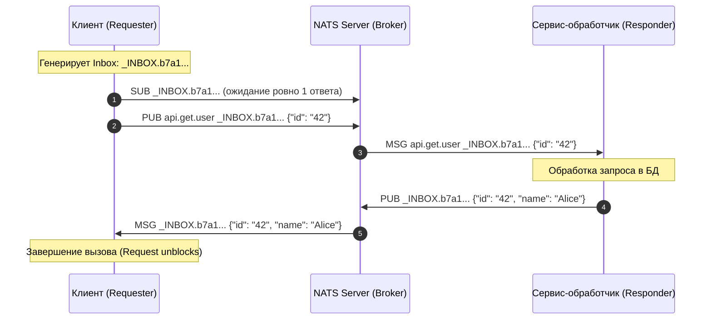
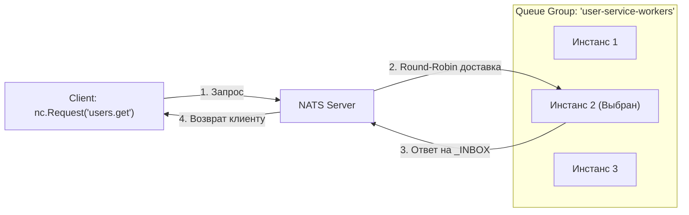

# 4. Request-Reply паттерн: синхронный RPC поверх асинхронного брокера

> *«Распределенная система — это система, в которой сбой компьютера, о существовании которого вы даже не подозревали, может вывести из строя вашу собственную машину. Простота и быстрое падение при ошибках — наша единственная защита».*    
> — Лесли Лэмпорт

> [!NOTE]
> **Связи:** В [[1. NATS. Легковесный брокер]] мы познакомились с базовой философией NATS, а в [[3. Subject based routing]] детально изучили префиксные деревья маршрутизации. Теперь мы разберем, как поверх чисто асинхронного транспорта построить синхронный RPC-механизм **Request-Reply**, не требующий внешних Service Discovery и балансировщиков нагрузки вроде Consul или Envoy. В следующей лекции — [[5. JetStream. Persistence и stream processing]] — мы перейдем к сохранению состояния и гарантиям доставки.

---

## Анатомия паттерна: синхронный диалог в мире асинхронного Pub/Sub

В классической парадигме **Publish/Subscribe** отправитель («fire-and-forget») публикует сообщение в шину данных и немедленно продолжает работу. Он не знает и не желает знать, сколько потребителей получат событие (ноль, один или сотня) и когда именно они его обработают.

Однако в реальных микросервисных архитектурах постоянно возникает необходимость в **двустороннем диалоге (Request-Reply / RPC)**:
- «Дай актуальный профиль пользователя с ID 42»;
- «Заблокируй 100 рублей на счете клиента и верни номер транзакции»;
- «Проверь доступность складского остатка перед созданием заказа».

Большинство инженеров по привычке выбирают для этой задачи HTTP REST или gRPC. Но это тянет за собой целый ворох инфраструктурных сложностей: необходимость в Service Discovery (Consul, Eureka, k8s DNS), клиентской балансировке нагрузки, Sidecar-прокси (Envoy, Istio), управлении TLS-сертификатами для каждого пода и борьбе с таймаутами при холодном старте соединений.

**NATS предлагает изящную альтернативу:** реализацию полноценного высокопроизводительного **RPC поверх базового механизма Publish/Subscribe**.

```
    Почтовая аналогия Request-Reply:
    Отправляя письмо с вопросом в компанию, вы вкладываете внутрь
    конверт с вашим обратным адресом и наклеенной маркой (Reply Subject).
    Получатель читает вопрос, пишет ответ, запечатывает его в ваш
    обратный конверт и опускает в ближайший почтовый ящик.
```

---

## Как работает Request-Reply в NATS

Ключевая идея NATS Request-Reply — **асинхронный транспорт для синхронных вызовов**. 

Каждое сообщение протокола NATS на транспортном уровне содержит опциональное поле `reply-to`. Клиент генерирует уникальный эфемерный субъект для ответа и передает его серверу вместе с телом запроса:

1. **Клиент** создает **временный reply subject** (внутренний уникальный почтовый ящик, inbox).
2. **Клиент** подписывается на этот **reply subject** и **ожидает ответ**.
3. **Клиент** отправляет **request** на **request subject**, указывая **reply subject** в протокольном заголовке.
4. **Сервер (обработчик)** получает запрос, выполняет бизнес-логику и **отправляет ответ** на **указанный reply subject**.
5. **Клиент** получает ответ и **завершает ожидание**, после чего удаляет временную подписку.



---

## Эволюция Inbox: под капотом библиотеки nats.go

> [!info] Под капотом: Эволюция от наивных подписок к Inbox Multiplexing
> В ранних версиях NATS (и в наивных самодельных реализациях) каждый вызов `nc.Request()` отправлял на сервер команды:  
> `SUB _INBOX.<uuid> 1` $\to$ `PUB target _INBOX.<uuid> payload` $\to$ ожидание ответа $\to$ `UNSUB`.  
> При нагрузке в 50 000 RPS это генерировало 100 000 лишних служебных команд подписки/отписки в секунду, перегружая внутреннее дерево префиксов (`sublist`) сервера!
>
> В современном Go-клиенте (`github.com/nats-io/nats.go`) реализован **Inbox Multiplexer**:
> 1. При инициализации подключения `nats.Conn` регистрирует **ровно одну долгоживущую подписку** на маску `_INBOX.<client_unique_id>.>`.
> 2. Для каждого отдельного запроса генерируется короткий уникальный токен: `_INBOX.<client_unique_id>.<request_token>`.
> 3. Входящие ответы перехватываются единым обработчиком, который по `request_token` находит нужный Go-канал в хэш-таблице клиента (`sync.Map` / защищенный мьютексом `map`) и пересылает сообщение ждущей горутине с $O(1)$ накладными расходами.
>
> Это полностью устраняет сетевой оверхед на динамические подписки!

---

## Пример реализации

### Basic Request-Reply

Ниже приведен законченный рабочий пример на Go, демонстрирующий клиент и сервер:

```go
package main

import (
	"encoding/json"
	"fmt"
	"log"
	"time"

	"github.com/nats-io/nats.go"
)

type User struct {
	ID      string `json:"id"`
	Name    string `json:"name"`
	Email   string `json:"email"`
	Created string `json:"created_at"`
}

func main() {
	nc, err := nats.Connect(nats.DefaultURL)
	if err != nil {
		log.Fatal(err)
	}
	defer nc.Close()

	// 1. Запускаем обработчик запросов (сервер)
	go startUserServer(nc)

	// Даем серверу миллисекунду на регистрацию подписки
	time.Sleep(50 * time.Millisecond)

	// 2. Выполняем синхронные запросы (клиент)
	makeRequests(nc)
}

func startUserServer(nc *nats.Conn) {
	// Подписываемся на субъект запросов
	_, err := nc.Subscribe("api.get.user", func(msg *nats.Msg) {
		userID := string(msg.Data)

		// Формируем полезную нагрузку ответа
		user := User{
			ID:      userID,
			Name:    "John Doe",
			Email:   "john@example.com",
			Created: time.Now().Format(time.RFC3339),
		}

		response, err := json.Marshal(user)
		if err != nil {
			log.Printf("Marshal error: %v", err)
			return
		}

		// Отправляем ответ на временный reply subject клиента
		if msg.Reply != "" {
			err = nc.Publish(msg.Reply, response)
			if err != nil {
				log.Printf("Failed to send reply: %v", err)
			}
		}
	})
	if err != nil {
		log.Fatal(err)
	}

	fmt.Println("User server responder started on [api.get.user]...")
	select {} // Удерживаем фоновую горутину
}

func makeRequests(nc *nats.Conn) {
	for i := 1; i <= 3; i++ {
		userID := fmt.Sprintf("user-%d", i)

		// nc.Request блокирует горутину до получения ответа или истечения таймаута
		resp, err := nc.Request("api.get.user", []byte(userID), 2*time.Second)
		if err != nil {
			log.Printf("Request failed: %v", err)
			continue
		}

		var user User
		if err := json.Unmarshal(resp.Data, &user); err != nil {
			log.Printf("Failed to parse response: %v", err)
			continue
		}

		fmt.Printf("Received user: %+v\n", user)
	}
}
```

---

## Timeout и Error Handling: защита от зависания

В распределенных системах запросы обязаны быть жестко ограничены во времени. Сетевой сбой, падение сервиса или блокировка в СУБД не должны подвешивать вызывающий сервис навечно.

В NATS предусмотрено два критически важных сценария ошибок:
1. `nats.ErrTimeout` — прошел интервал ожидания, но ответ так и не пришел.
2. `nats.ErrNoResponders` — **революционная оптимизация NATS!** Если в кластере прямо сейчас нет ни одного живого подписчика на целевой субъект, сервер NATS не заставляет клиента ждать 5 секунд по таймауту, а **мгновенно возвращает специальный 503-статус** (No Responders).

```go
func robustRequestExample(nc *nats.Conn) {
	userID := "test-user"

	// Устанавливаем жесткий таймаут в 5 секунд
	resp, err := nc.Request("api.get.user", []byte(userID), 5*time.Second)
	if err != nil {
		switch err {
		case nats.ErrTimeout:
			log.Printf("Request timeout after 5 seconds: сервис не ответил вовремя")
		case nats.ErrNoResponders:
			log.Printf("No service available to handle request: нет активных обработчиков в кластере!")
		default:
			log.Printf("Request failed: %v", err)
		}
		return
	}

	fmt.Printf("Success response: %s\n", string(resp.Data))
}
```

---

## Concurrent Requests: параллельная обработка запросов

Благодаря асинхронной природе протокола NATS и мультиплексированию входящих ответов по Go-каналам, одно TCP-соединение `nats.Conn` может обслуживать десятки тысяч одновременных горутин без взаимной блокировки конвейера:

```go
func concurrentRequests(nc *nats.Conn) {
	const numRequests = 10
	responses := make(chan *nats.Msg, numRequests)
	errors := make(chan error, numRequests)

	// Запускаем пул параллельных горутин
	for i := 0; i < numRequests; i++ {
		go func(requestID int) {
			resp, err := nc.Request(
				"api.get.user",
				[]byte(fmt.Sprintf("user-%d", requestID)),
				3*time.Second,
			)

			if err != nil {
				errors <- err
				return
			}

			responses <- resp
		}(i)
	}

	// Асинхронно собираем результаты
	for i := 0; i < numRequests; i++ {
		select {
		case resp := <-responses:
			fmt.Printf("Got response: %s\n", string(resp.Data))
		case err := <-errors:
			fmt.Printf("Got error: %v\n", err)
		}
	}
}
```

---

## Request-Reply vs HTTP

Инженеры часто задают вопрос: зачем использовать NATS Request-Reply, если есть общепринятый HTTP/gRPC? Сравним их архитектурные свойства:

| Характеристика | HTTP Request | NATS Request-Reply |
|:---|:---|:---|
| **Транспорт** | TCP / HTTP/1.1 / HTTP/2 | Высокоэффективный бинарно-текстовый NATS протокол |
| **Connection reuse** | HTTP/1.1 keep-alive, HTTP/2 multiplexing | Одно постоянное персистентное TCP-соединение (`nats.Conn`) |
| **Load balancing** | Внешний L7/L4 прокси (Nginx, Envoy, AWS ALB) | Встроенный в брокер через Queue Groups (`nc.QueueSubscribe`) |
| **Service discovery** | Внешний реестр (Consul, k8s Headless Services, DNS) | Не требуется: маршрутизация по субъектам (`Subject-based`) |
| **Serialization** | Любая (чаще JSON/gRPC Protobuf over HTTP) | Любая произвольная последовательность байт (`[]byte`) |
| **Performance** | Высокий оверхед на парсинг HTTP-заголовков | Экстремально низкий оверхед (микросекунды) |
| **Circuit breaking** | Внешние библиотеки (Hystrix, go-resilience) | Встроенная поддержка через `nats.ErrNoResponders` |

```go
// HTTP Request: требует резолва DNS, создания/извлечения соединения из пула, формирования HTTP-заголовков
resp, err := http.Get("http://user-service/api/user/123")

// NATS Request-Reply: запись пакета в уже открытый TCP-сокет по имени логического субъекта
resp, err := nc.Request("api.get.user", []byte("123"), 2*time.Second)
```

---

## Горизонтальное масштабирование и балансировка через Queue Groups

Одна из сильнейших сторон Request-Reply в NATS — **автоматическая балансировка нагрузки из коробки**. Если вы запустите 10 реплик микросервиса `user-service` и подпишете их с использованием `QueueSubscribe`, NATS сам распределит входящие RPC-запросы между ними по алгоритму Round-Robin:



```go
// На каждом инстансе сервиса запускается код:
nc.QueueSubscribe("api.get.user", "user-service-workers", func(msg *nats.Msg) {
    // Обработка ровно одним экземпляром из группы
    nc.Publish(msg.Reply, []byte(`{"status": "ok"}`))
})
```

Вам больше не нужны Kubernetes Ingress-контроллеры или сервисные сетки (Service Mesh) для балансировки внутреннего межсервисного трафика!

---

## Advanced Pattern: Request-Reply с Middleware

Как и в веб-фреймворках (Gin, Echo), в NATS обработчики можно оборачивать в цепочки промежуточного ПО (**middleware**) для логирования, сбора метрик Prometheus, трейсинга OpenTelemetry и аутентификации:

```go
func createAuthenticatedRequestHandler(nc *nats.Conn, next nats.MsgHandler) nats.MsgHandler {
	return func(msg *nats.Msg) {
		// 1. Проверяем токен авторизации из заголовка
		token := msg.Header.Get("Authorization")
		if token != "secret-token-123" {
			if msg.Reply != "" {
				_ = nc.Publish(msg.Reply, []byte(`{"error": "unauthorized"}`))
			}
			return
		}

		// 2. Замеряем время выполнения
		start := time.Now()

		// 3. Передаем управление бизнес-логике
		next(msg)

		// 4. Логируем результат
		duration := time.Since(start)
		log.Printf("[METRIC] Subject: %s handled in %v", msg.Subject, duration)
	}
}

// Использование middleware
userHandler := func(msg *nats.Msg) {
	_ = nc.Publish(msg.Reply, []byte(`{"user": "Alice"}`))
}

_, err = nc.Subscribe("api.get.user", createAuthenticatedRequestHandler(nc, userHandler))
```

---

## Request-Reply с Context: современный идиоматичный Go

Начиная с современных версий библиотеки `nats.go`, доступен нативный метод `nc.RequestWithContext(ctx, subject, data)`. Он идеально интегрируется с отменой операций, таймаутами родительских контекстов и трассировкой Go:

```go
import (
	"context"
	"time"
)

func requestWithContext(ctx context.Context, nc *nats.Conn, subject string, data []byte) (*nats.Msg, error) {
	// Если клиентский контекст уже содержит дедлайн или отмену,
	// RequestWithContext корректно прервет ожидание без утечки горутин
	return nc.RequestWithContext(ctx, subject, data)
}
```

Для понимания того, как контекст управлял жизненным циклом запроса до появления нативного API, полезна кастомная реализация через горутины и каналы:

```go
func legacyRequestWithContext(ctx context.Context, nc *nats.Conn, subject string, data []byte) (*nats.Msg, error) {
	result := make(chan struct {
		msg *nats.Msg
		err error
	}, 1)

	go func() {
		msg, err := nc.Request(subject, data, 30*time.Second)
		result <- struct {
			msg *nats.Msg
			err error
		}{msg, err}
	}()

	select {
	case res := <-result:
		return res.msg, res.err
	case <-ctx.Done():
		return nil, ctx.Err()
	}
}
```

---

## Performance Considerations: наносекунды против миллисекунд

При прямом сравнении на одном и том же оборудовании NATS Request-Reply демонстрирует потрясающую производительность:

```go
func benchmarkRequestReply() {
	nc, _ := nats.Connect(nats.DefaultURL)

	// Прогрев (Warm up)
	for i := 0; i < 100; i++ {
		_, _ = nc.Request("api.ping", []byte("ping"), time.Second)
	}

	// Замер производительности
	start := time.Now()
	const requests = 10000

	for i := 0; i < requests; i++ {
		_, err := nc.Request("api.ping", []byte("ping"), time.Second)
		if err != nil {
			log.Fatal(err)
		}
	}

	duration := time.Since(start)
	avgLatency := duration.Nanoseconds() / int64(requests)

	fmt.Printf("Total: %v, Avg latency: %dns per request\n", duration, avgLatency)
	// В локальной сети / localhost: ~50-90µs на запрос (против ~1-5ms для чистого HTTP REST)
}
```

---

## Ограничения и Best Practices

### 1. Не используйте для high-throughput операций

Request-Reply по своей природе заставляет клиента ожидать ответа (RTT — Round Trip Time). Если вам требуется обрабатывать 500 000 событий в секунду (логирование, сбор метрик, финансовый клиринг), используйте чистый асинхронный **Publish** или потоки **JetStream**. Синхронный Request-Reply идеален для низколатентных точечных запросов и команд, но губителен для пакетного ingestion данных.

### 2. Обработка ошибок

Всегда явным образом обрабатывайте ошибки:
- `nats.ErrTimeout` (таймаут ответа);
- `nats.ErrNoResponders` (отсутствие обработчиков);
- ошибки маршалинга полезной нагрузки.
Никогда не игнорируйте возвращаемое значение ошибки `nc.Request()`.

### 3. Service Discovery

Вместо жестко закодированных или плоских идентификаторов используйте осмысленные иерархические пространства имен субъектов:

```go
// Хорошо: Семантически понятные и масштабируемые subject'ы
"service.users.api.get"
"service.orders.api.create"

// Плохо: Жестко закодированные или бессистемные имена
"get_user_by_id_123"
"service_abc_def_ghi"
```

---

## Когда использовать Request-Reply

1. **Synchronous microservice calls** — когда вызывающему сервису необходим немедленный ответ для завершения клиентской транзакции.
2. **Service discovery & Health checks** — регулярная проверка жизнеспособности компонентов и опрос конфигурации без выделенного координатора.
3. **Real-time data fetching** — мгновенное извлечение состояния из кэша или распределенного хранилища в памяти.
4. **Command/query separation (CQRS)** — отправка команд на модификацию данных, требующих явного подтверждения или возврата присвоенного UUID.

---

> [!tip] Собеседование
> **Вопрос:** «В чем принципиальная разница между Request-Reply в NATS и обычным вызовом через HTTP REST API? Что произойдет в NATS, если ни один инстанс сервиса не запущен?»  
> **Ответ:** HTTP требует прямого сетевого подключения (Point-to-Point) между клиентом и сервером через IP-адрес или DNS, а также внешней инфраструктуры балансировки. NATS Request-Reply работает поверх асинхронной шины pub/sub: клиент и сервер знают только имя логического субъекта и общаются через брокер. Клиент подписывается на временный обратный адрес (`_INBOX...`), отправляя его в сообщении. Если в кластере NATS нет ни одного живого обработчика, сервер вернет ошибку `nats.ErrNoResponders` мгновенно (503 status), в отличие от классического HTTP, где клиент часто виснет в ожидании ответа шлюза или DNS-таймаута.

---

## Итог

- **Request-Reply в NATS** реализует синхронный межсервисный RPC поверх асинхронной событийно-ориентированной архитектуры.
- **Временные обратные адреса (Inboxes)** позволяют клиенту получать ответы напрямую без создания постоянных очередей.
- **Встроенное мультиплексирование** в Go-клиенте исключает нагрузку на брокер при создании сотен тысяч кратковременных запросов.
- **Интеграция с Queue Groups** дает бесплатную балансировку запросов между репликами микросервисов без Nginx, Envoy и Consul.

В следующей лекции — [[5. JetStream. Persistence и stream processing]] — мы познакомимся с подсистемой хранения NATS JetStream, разобрав гарантии доставки At-least-once, консенсус Raft и стриминг данных.