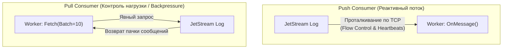

# 5. JetStream: персистентность, распределенный консенсус и stream processing

> *"The fastest I/O is the I/O that never happens. When persistence is required, write sequentially, batch aggressively, and keep the coordinating protocol as simple as the physics of the disk."*  
> — Брайан Керниган

> [!NOTE]
> **Связи:** В [[1. NATS. Легковесный брокер]] и [[2. Core NATS vs JetStream]] мы разобрали различие между чистым in-memory брокером и подсистемой хранения. В [[3. Subject based routing]] и [[4. Request Reply паттерн]] мы освоили маршрутизацию и RPC. Теперь мы детально изучим **JetStream** — встроенный в NATS движок персистентного хранения и потоковой обработки, сопоставим его с архитектурой разделов Apache Kafka из [[2. Topics, partitions и offsets]] и подготовимся к сравнительному анализу в [[6. NATS vs Kafka vs RabbitMQ]].

---

## Что такое JetStream и зачем он нужен?

В классическом Core NATS сообщения существуют ровно столько, сколько требуется сетевой карте для отправки TCP-пакета: если в момент отправки нет активных подписчиков или процесс упал, сообщение исчезает безвозвратно. Это превосходно для телеметрии, но категорически неприемлемо для финансовых транзакций, заказов или аудита.

**JetStream** — это встроенная непосредственно в сервер NATS **персистентная потоковая платформа (persistent streaming platform)**. Она превращает легковесный NATS в полноценную распределенную систему класса Apache Kafka, RabbitMQ Streams и AWS Kinesis, наделяя брокер следующими свойствами:
- **Durability (Долговечность):** сохранение сообщений на диск с гарантией выживания при перезапуске кластера.
- **Ordering (Строгий порядок):** монотонно возрастающие глобальные и потоковые номера последовательности (`Sequence Numbers`).
- **Replay (Воспроизведение истории):** возможность перечитать события с начала времен, с конкретной временной метки или конкретного смещения.
- **Consumer Groups & Ack Policies:** явные подтверждения обработки (`Ack`, `Nak`, `Term`), дедупликация и надежные рабочие очереди.
- **Stream Processing:** потоковая фильтрация по субъектам без развертывания тяжелых внешних фреймворков.

При этом JetStream **не требует отдельных демонов**, внешних координаторов (ZooKeeper) или прожорливых виртуальных машин (JVM). Весь функционал включен в единый бинарный файл `nats-server` размером около 20 МБ, написанный на чистом Go.

---

## Архитектура JetStream

JetStream строится **поверх Core NATS**, используя его высокоскоростной транспортный конвейер, но добавляя уровень персистентного хранения данных на базе консенсуса **Raft**:

```mermaid
graph TB
    subgraph "Application Layer (Клиентские сервисы)"
        P["Publishers (Издатели)"]
        C["Consumers (Потребители)"]
    end
    
    subgraph "NATS Transport Layer (Транспортный уровень)"
        NC["NATS Client"]
        NS["NATS Server (Core Hub)"]
    end
    
    subgraph "JetStream Storage Layer (Уровень хранения и консенсуса)"
        JS["JetStream API (Raft Meta-Group)"]
        ST["Streams (Append-Only Logs)"]
        CT["Consumers (Offset & State Trackers)"]
        DS["Disk / Memory Storage"]
    end
    
    P --> NC
    C --> NC
    NC <--> NS
    NS <--> JS
    JS --> ST
    JS --> CT
    ST <--> DS
    CT --> ST
    
    style JS fill:#1e293b,stroke:#6366f1,stroke-width:2px
    style ST fill:#131d33,stroke:#38bdf8,stroke-width:2px
    style CT fill:#131d33,stroke:#10b981,stroke-width:2px
    style DS fill:#0f172a,stroke:#f59e0b,stroke-width:2px
```



### Механическое сочувствие (Mechanical Sympathy): append-only log

> [!info] Под капотом
> Внутри JetStream использует **append-only log** (журнал упреждающей записи, аналогичный механике Kafka и классических СУБД).  
> Запись на диск всегда производится строго последовательно (sequential write), что исключает дорогостоящие перемещения магнитных головок HDD или фрагментацию блоков SSD. Каждое сохраняемое сообщение получает уникальный 64-битный **sequence number**, гарантирующий глобальный **ordering**.  
> Уровень хранения поддерживает два режима:
> - **file-based storage** (по умолчанию) — данные сбрасываются на диск с настраиваемым интервалом `fsync`;
> - **memory-based storage** — данные удерживаются в RAM с защитой репликацией Raft по сети, обеспечивая задержки менее 10 микросекунд.

---

## Основные концепции JetStream

### 1. Stream (Поток)

**Stream** — это **persistent log** сообщений, логический аналог Kafka topic, но обладающий ключевым отличием: один Stream в NATS может захватывать сообщения из **множества иерархических субъектов** (`Subjects`).

```go
js, err := nc.JetStream()
if err != nil {
    log.Fatal(err)
}

// Создаем stream с персистентной конфигурацией
stream, err := js.AddStream(&nats.StreamConfig{
    Name:      "ORDERS",
    Subjects:  []string{"orders.*"},        // Subject'ы, которые будут сохраняться в лог
    Retention: nats.WorkQueuePolicy,       // Удалять сообщение сразу после подтверждения обработки
    MaxAge:    7 * 24 * time.Hour,         // Хранить сообщения максимум 7 дней
    MaxBytes:  100 * 1024 * 1024,         // Ограничение размера лога: максимум 100MB
    Storage:   nats.FileStorage,           // File-based storage (дисковое хранилище)
    Replicas:  3,                          // 3 реплики для отказоустойчивости (Raft кворум)
})
if err != nil {
    log.Fatal(err)
}
```

### 2. Message Structure в JetStream

Сообщение в JetStream обогащено служебными метаданными рантайма:

```go
type Msg struct {
    Subject      string    // Subject сообщения (например, orders.new)
    Reply        string    // Reply subject для подтверждений и ответов
    Data         []byte    // Полезная нагрузка (Payload)
    Header       Header    // Заголовки (key-value, включая Nats-Msg-Id)
    Sequence     uint64    // Монотонный Sequence number в рамках конкретного stream
    Time         time.Time // Время поступления на брокер (timestamp)
    Stream       string    // Имя stream'a (например, ORDERS)
    Duplicates   bool      // Флаг дедупликации (признак дубликата)
}
```

### 3. Consumer (Потребитель)

**Consumer** — это сущность внутри JetStream, которая **читает** сообщения из потока. В отличие от Kafka, где смещение (offset) контролируется исключительно клиентом через периодический commit, в JetStream Consumer является серверным объектом с состоянием.

JetStream поддерживает:
- **Push consumers:** брокер активно проталкивает сообщения клиенту при их появлении;
- **Pull consumers:** клиент явно запрашивает пачки сообщений по мере своей готовности (идеально для backpressure);
- **Durable consumers:** сервер запоминает имя потребителя и его позицию чтения (offset) на диске;
- **Ephemeral consumers:** временные потребители, исчезающие при разрыве сетевой сессии.

```go
// Push consumer (сервер отправляет сообщения)
pushCons, err := js.Subscribe("orders.*", func(msg *nats.Msg) {
    fmt.Printf("Processing order: %s\n", string(msg.Data))
    msg.Ack() // Подтверждение получения
}, nats.Durable("order_processor")) // Durable consumer
if err != nil {
    log.Fatal(err)
}

// Pull consumer (клиент сам забирает сообщения)
pullCons, err := js.PullSubscribe("orders.*", "batch_processor")
if err != nil {
    log.Fatal(err)
}

// Батчевая обработка с контролем времени ожидания
msgs, err := pullCons.Fetch(10, nats.MaxWait(5*time.Second))
if err != nil {
    log.Printf("Fetch error: %v", err)
    return
}

for _, msg := range msgs {
    processOrder(msg)
    msg.Ack()
}
```

---

## Типы Consumers: Push vs Pull



### 1. Push Consumers

Push consumers получают сообщения **автоматически** от сервера сразу после их записи в поток. Они обеспечивают минимальную задержку и подходят для **real-time processing**:

```go
// Async push consumer
_, err = js.Subscribe("orders.new", func(msg *nats.Msg) {
    // Обработка в фоне
    go processOrderAsync(msg)
    msg.Ack()
}, nats.Durable("async_order_processor"))
```

### 2. Pull Consumers

Pull consumers **сами запрашивают** сообщения. Это золотой стандарт для микросервисов с высокими нагрузками: воркер никогда не захлебнется, если база данных начнет тормозить, так как он запрашивает ровно столько данных, сколько способен обработать:

```go
// Pull consumer с контролем скорости (Rate Limiting & Backpressure)
cons, err := js.PullSubscribe("orders.*", "batch_processor")
if err != nil {
    log.Fatal(err)
}

for {
    // Забираем до 10 сообщений, ожидая не более 10 секунд
    msgs, err := cons.Fetch(10, nats.MaxWait(10*time.Second))
    if err != nil {
        if err == nats.ErrTimeout {
            continue // Нет новых сообщений, повторяем цикл
        }
        log.Printf("Fetch error: %v", err)
        break
    }
    
    // Обрабатываем batch
    for _, msg := range msgs {
        processOrder(msg)
        msg.Ack()
    }
}
```

---

## Stream Policies: политики хранения и жизненного цикла

JetStream позволяет гибко настраивать правила удаления сообщений из потока в зависимости от бизнес-требований:

### 1. Limits Policy (По умолчанию)

Поток хранит сообщения до тех пор, пока не будет превышен один из настроенных лимитов (размер в байтах, количество сообщений или возраст):

```go
stream, err := js.AddStream(&nats.StreamConfig{
    Name:      "LOGS",
    Subjects:  []string{"logs.*"},
    Retention: nats.LimitsPolicy,
    MaxMsgs:   100000,          // Максимум 100K сообщений в логе
    MaxBytes:  10 * 1024 * 1024, // 10MB
    MaxAge:    24 * time.Hour,  // 24 часа
})
```

### 2. Interest Policy

Хранит сообщения в логе **ровно до тех пор, пока они нужны** зарегистрированным потребителям:

```go
stream, err := js.AddStream(&nats.StreamConfig{
    Name:      "TEMP_EVENTS",
    Subjects:  []string{"temp.*"},
    Retention: nats.InterestPolicy, // Удалять сообщение после того, как ВСЕ консьюмеры прислали Ack
})
```

### 3. Work Queue Policy

Превращает поток в классическую распределенную очередь задач (аналог RabbitMQ Queue):

```go
stream, err := js.AddStream(&nats.StreamConfig{
    Name:      "TASK_QUEUE",
    Subjects:  []string{"tasks.*"},
    Retention: nats.WorkQueuePolicy, // Удалять сообщение из лога сразу после ПЕРВОГО успешного Ack
})
```

---

## Message Deduplication: защита от дублей на уровне ядра

В распределенных системах сеть ненадежна: клиент может успешно отправить сообщение, но упасть до получения подтверждения от брокера. Повторная отправка (retry) приведет к дубликату.

JetStream предоставляет встроенное **окно дедупликации (deduplication window)** на основе уникального клиентского идентификатора `Nats-Msg-Id`:

```go
// Stream с включенной дедупликацией
stream, err := js.AddStream(&nats.StreamConfig{
    Name:            "ORDERS",
    Subjects:        []string{"orders.*"},
    DuplicateWindow: 2 * time.Minute, // Окно дедупликации 2 минуты
})
if err != nil {
    log.Fatal(err)
}

// Публикация с deduplication key
msg := nats.NewMsg("orders.new")
msg.Data = []byte("order data #42")
msg.Header.Set(nats.MsgIdHdr, "ORDER-12345") // Deduplication key (Nats-Msg-Id)

ack, err := js.PublishMsg(msg)
if err != nil {
    log.Printf("Publish error: %v", err)
} else {
    fmt.Printf("Message published with sequence: %d (duplicate: %v)\n", ack.Sequence, ack.Duplicate)
}
```

> [!warning] Ловушка / Gotcha: Границы окна дедупликации
> Message deduplication работает **только в пределах заданного duplicate window**!  
> Сервер NATS держит в оперативной памяти скользящий LRU-кэш идентификаторов за указанный интервал. Если сообщение с тем же `Nats-Msg-Id` придет через 2 минуты и 1 секунду при окне в 2 минуты — дедупликация не сработает, и сообщение будет записано в поток как новое! Для долгосрочной дедупликации используйте идемпотентность на стороне БД.

---

## Consumer Configuration

### 1. Durable Consumers

Сохраняют текущий **offset (Ack Floor)** на сервере JetStream. При падении или перезапуске воркер продолжит чтение строго с того места, где остановился:

```go
// Durable consumer (offset сохраняется)
_, err = js.Subscribe("orders.*", func(msg *nats.Msg) {
    processOrder(msg)
    msg.Ack()
}, nats.Durable("order_processor"), // Имя durable consumer'а
   nats.ManualAck())                // Ручное подтверждение (отключаем авто-ack)
```

### 2. Ephemeral Consumers

Не сохраняют offset при завершении соединения:

```go
// Ephemeral consumer (offset теряется при перезапуске)
_, err = js.Subscribe("orders.*", func(msg *nats.Msg) {
    processOrder(msg)
    msg.Ack()
}, nats.ManualAck())
```

---

## Advanced Stream Processing

### 1. Stream Filtering

Один Stream может собирать широкий спектр данных, а разные консьюмеры могут подписываться только на узкие подмножества благодаря маскам:

```go
// Consumer только для определенных subject'ов
cons, err := js.Subscribe("orders.new", func(msg *nats.Msg) {
    // Обрабатываем только создание новых заказов
    processOrder(msg)
    msg.Ack()
}, nats.Durable("new_orders_only"))
```

### 2. Multiple Consumers per Stream

Один и тот же поток может параллельно читаться десятками независимых сервисов с индивидуальной скоростью и индивидуальными офсетами:

```go
// Consumer для финансового аудита
js.Subscribe("orders.*", auditHandler, nats.Durable("audit_consumer"))

// Consumer для мгновенных push-уведомлений
js.Subscribe("orders.new", notificationHandler, nats.Durable("notification_consumer"))

// Consumer для бизнес-обработки платежей
js.Subscribe("orders.*", processingHandler, nats.Durable("processing_consumer"))
```

### 3. Consumer Groups (Queue Groups в JetStream)

Для горизонтального масштабирования обработки одного consumer'а несколькими подами используется объединенный Pull или Push Consumer с общим именем группы:

```go
// Несколько экземпляров одного consumer'а разделяют поток между собой
for i := 0; i < 3; i++ {
    go func(instanceID int) {
        _, err := js.Subscribe("orders.*", func(msg *nats.Msg) {
            fmt.Printf("Instance %d processing: %s\n", instanceID, msg.Subject)
            processOrder(msg)
            msg.Ack()
        }, nats.Durable("order_workers")) // Одинаковое имя = queue group
        if err != nil {
            log.Printf("Worker %d error: %v", instanceID, err)
        }
    }(i)
}
```

---

## Performance и Tuning

### 1. File vs Memory Storage

Выбор типа хранилища определяется критичностью потерь:

```go
// Memory storage (выше производительность, задержки единицы микросекунд, но данные сбрасываются при рестарте кластера)
stream, err := js.AddStream(&nats.StreamConfig{
    Name:    "HIGH_PERF_TEMP",
    Storage: nats.MemoryStorage, // Только в памяти
})

// File storage (полная durability, сохранение на диск через WAL)
stream, err := js.AddStream(&nats.StreamConfig{
    Name:    "PERSISTENT_LOGS", 
    Storage: nats.FileStorage, // На диск
})
```

### 2. Compression: экономия места и дискового I/O

JetStream поддерживает потоковую компрессию логов с использованием алгоритма **S2** (высокоскоростной потоковый форк Snappy, оптимизированный под современные SIMD-инструкции процессора):

```go
stream, err := js.AddStream(&nats.StreamConfig{
    Name:        "COMPRESSED_STREAM",
    Subjects:    []string{"logs.*"},
    Compression: nats.S2Compression, // Использует S2 compression для сжатия блоков на диске
})
```

---

## Monitoring и Observability

JetStream предоставляет исчерпывающую информацию о состоянии потоков и смещениях потребителей через программное API:

```go
// Получение подробной информации о stream
info, err := js.StreamInfo("ORDERS")
if err != nil {
    log.Printf("Stream info error: %v", err)
    return
}

fmt.Printf("Messages: %d, Bytes: %d, First: %v, Last: %v\n",
    info.State.Messages,
    info.State.Bytes,
    info.State.FirstTime,
    info.State.LastTime,
)

// Получение информации о consumer
consInfo, err := js.ConsumerInfo("ORDERS", "order_processor")
if err != nil {
    log.Printf("Consumer info error: %v", err)
    return
}

fmt.Printf("Pending: %d, Ack Floor: %d\n",
    consInfo.NumPending,
    consInfo.AckFloor.Consumer,
)
```

---

## Использование в Production

### 1. Service Mesh Integration

JetStream может выступать единой надежной **шиной данных (event backbone)** для координации сервисов:

```go
// Service registration через JetStream
js.Publish("service.register", []byte(serviceInfoJSON))

// Регулярные Health checks
js.Publish("service.heartbeat", []byte(healthStatusJSON))
```

### 2. Event Sourcing

Архитектурный шаблон, где состояние системы восстанавливается из неизменяемой последовательности событий:

```go
type Event struct {
    Type    string `json:"type"`
    Data    string `json:"data"`
    Version int    `json:"version"`
}

event := Event{
    Type:    "UserCreated",
    Data:    userData,
    Version: 1,
}

js.Publish("user.events", mustEncode(event))
```

### 3. CQRS Implementation

Разделение команд на изменение и событий о произошедших фактах (Command/Query Responsibility Segregation):

```go
// Command stream (поток команд)
js.Publish("commands.create.user", commandData)

// Event stream (поток фактов)  
js.Publish("events.user.created", eventData)
```

---

> [!tip] Собеседование
> **Вопрос:** «В чем принципиальная разница между NATS Core и JetStream в контексте message ordering и гарантий доставки?»  
> **Ответ:** NATS Core работает по принципу **at-most-once**: сообщения не сохраняются на диск, порядок доставки гарантируется только в пределах одного TCP-соединения, а при отсутствии подписчиков сообщение сбрасывается. JetStream предоставляет **at-least-once** (и строго **exactly-once** при использовании дедупликации), сохраняет сообщения в append-only log на диск или в RAM, присваивает монотонные `sequence numbers` и использует **RAFT consensus** для распределенного порядка и репликации между узлами кластера.

---

## Итог

- **JetStream** превращает NATS из легковесного pub/sub брокера в мощную распределенную потоковую платформу.
- **Append-only log** и поддержка **File/Memory storage** обеспечивают миллионы операций записи в секунду с микросекундными задержками.
- **Pull Consumers** дают встроенный контроль перегрузки (Backpressure) и пакетную выборку без риска исчерпания памяти.
- **Raft Consensus** обеспечивает прозрачную репликацию и автоматический failover без внешних координаторов типа ZooKeeper.

В следующей лекции — [[6. NATS vs Kafka vs RabbitMQ]] — мы проведем детальное лобовое сравнение NATS с лидерами индустрии и сформулируем четкие правила выбора инструмента под конкретные инженерные задачи.