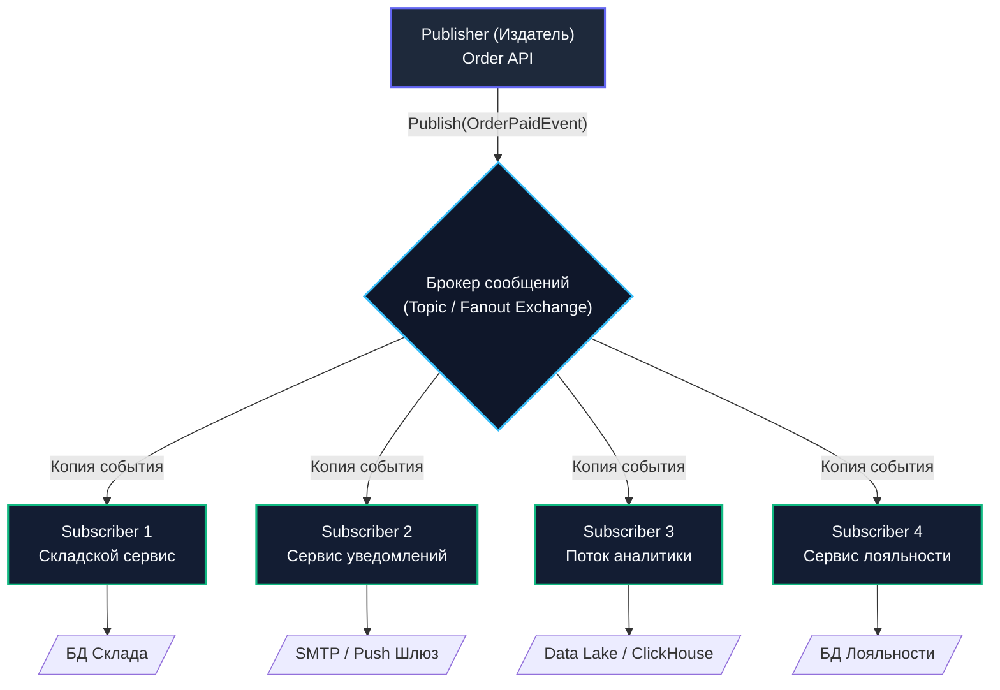

# 1. Publish-Subscribe (Pub/Sub): архитектура слабосвязанных распределенных систем

> *«Секрет создания больших и надежных систем заключается в том, чтобы изолировать их части настолько полно, чтобы сбой или изменение в одном компоненте не могли перекинуться на другой».*    
> — Брайан Керниган

> [!NOTE]
> **Связи:** В предыдущих разделах мы досконально изучили конкретные технологии брокеров: [[1. RabbitMQ. Архитектура и концепции]], [[1. Apache Kafka. Архитектура и концепции]] и [[1. NATS. Легковесный брокер]]. Теперь мы поднимаемся на уровень архитектурных абстракций и шаблонов проектирования. Начнем с фундаментального паттерна **Publish-Subscribe (Pub/Sub)**, разберем эволюцию от императивных вызовов к событиям, сопоставим его с паттерном рабочих очередей в [[2. Work Queue]] и заложим фундамент для событийно-ориентированной архитектуры в [[3. Event Driven Architecture]].

---

## От команд к событиям: Эволюция связности

До этого момента мы рассматривали брокеры сообщений преимущественно как трубы для передачи задач от одного сервиса к другому. «Возьми этот заказ и спиши деньги» — это императивный подход, паттерн отправки команд (Point-to-Point Command). Но когда распределенная система разрастается от пары демонов до десятков независимых микросервисов, прямая командная маршрутизация превращается в архитектурный кошмар.

Представьте классический сценарий интернет-магазина: пользователь успешно оформляет заказ. В классической императивной модели Сервис Заказов (Order Service) обязан отправить прямые команды в:
1. **Сервис Нотификаций** (отправить клиенту подтверждающий Email и SMS);
2. **Сервис Аналитики** (обновить дашборд продаж в реальном времени);
3. **Сервис Склада** (зарезервировать товарные позиции);
4. **Сервис Лояльности** (рассчитать и начислить бонусный кэшбек);
5. **Сервис Антифрода** (проверить аномалии в платежном профиле).

```
    Императивный кошмар (Tight Coupling):
    [Order Service] ──(RPC)──> [Email Service]
                    ──(RPC)──> [Analytics Service]
                    ──(RPC)──> [Inventory Service]
                    ──(RPC)──> [Loyalty Service]
                    ──(RPC)──> [Anti-Fraud Service]  <-- Каждое новое требование
                                                          меняет код Order Service!
```

Каждое новое требование бизнеса заставляет вас модифицировать код Сервиса Заказов, добавляя туда вызовы новых API, обработку сетевых ошибок, таймаутов и отправку новых сообщений в новые очереди. Это **жесткая связность (Tight Coupling)**, которая убивает скорость разработки, увеличивает задержку (RTT) и превращает распределенную систему в распределенный монолит.

Чтобы разрубить этот гордиев узел, архитекторы используют фундаментальный паттерн распределенных систем — **Publish-Subscribe (Pub/Sub, Издатель-Подписчик)**.

---

## Анатомия Pub/Sub

В модели Pub/Sub Сервис Заказов (Publisher) больше не командует подчиненными сервисами. Он просто оповещает шину данных о свершившемся факте: *«Произошло событие: Заказ №123 оплачен!»*. Ему абсолютно все равно, кто именно сейчас слушает брокер, сколько этих подписчиков (ноль, один или сто пятьдесят) и что именно они будут делать с полученной информацией.

Заинтересованные сервисы (Subscribers) сами подписываются на данный тип событий в брокере. Когда событие публикуется, брокер гарантирует доставку независимой копии этого события каждому активному подписчику (**Fan-out**):



Это основа архитектуры, управляемой событиями ([[3. Event Driven Architecture]]). Вы можете в любой момент добавить в систему совершенно новый сервис (например, Сервис Рекомендаций на базе ML), просто зарегистрировав новую подписку на существующий поток событий, не меняя ни единой строчки кода в Сервисе Заказов и не перезапуская его в продакшене.

---

## Mechanical Sympathy: Как Pub/Sub работает под капотом

На логическом уровне абстракции Pub/Sub выглядит одинаково во всех учебниках. Однако на физическом уровне железа — оперативной памяти (RAM), системных кэшей процессора, дискового контроллера и сетевого стека — разные брокеры реализуют размножение сообщений (**Fan-out**) принципиально по-разному. Понимание этой разницы отличает крепкого Senior-инженера от теоретика.

### Подход RabbitMQ: Размножение очередей

В RabbitMQ паттерн Pub/Sub реализуется через связку `Exchange` типа `fanout` или `topic` с очередями потребителей (подробнее в [[2. Exchanges, queues и bindings]]).

Когда издатель отправляет одно сообщение в Fanout Exchange, к которому привязаны 3 разные очереди (по одной для Склада, Нотификаций и Аналитики), брокер выполняет логическую маршрутизацию: сообщение должно оказаться в **каждой из трех очередей**:

```
    Физическая память RabbitMQ (Erlang Heap + msg_store):
    
    [Payload: OrderPaidEvent] <── Хранится в 1 экземпляре в msg_store
           ▲         ▲
           │         └──────────────┐
     [Ссылка/Индекс]          [Ссылка/Индекс]
           │                        │
     ┌─────┴──────────┐       ┌─────┴──────────┐
     │ Queue 1 (Склад)│       │ Queue 2 (Email)│
     └────────────────┘       └────────────────┘
```

> [!info] Под капотом: Erlang и ссылки
> Копирует ли RabbitMQ тело сообщения (payload) в памяти 3 раза при доставке в 3 очереди?  
> Ядро RabbitMQ, написанное на Erlang/OTP, оптимизировано: само тело сообщения хранится в памяти (и на диске, если включен флаг `persistent`) в единственном экземпляре в специализированном хранилище сообщений (`msg_store`).  
> В структуры данных самих очередей помещаются лишь легковесные **ссылки (индексы)** на исходное сообщение.  
> Однако каждая зарегистрированная очередь — это самостоятельный актор-процесс Erlang со своими очередями сообщений, внутренними локами, дисковыми индексами и собственным сетевым циклом отдачи данных консьюмерам. При коэффициенте размножения (Fan-out) в 100 подписчиков брокер вынужден совершить 100 операций обновления очередей и отправить 100 независимых сетевых пакетов. Нагрузка на CPU брокера растет линейно: $O(N)$, где $N$ — число подписчиков.

---

### Подход Kafka: Разделяемый лог и указатели

В Apache Kafka нет очередей в их классическом представлении, и брокер никогда не занимается копированием сообщений или созданием очередей ссылок. Kafka опирается на модель **распределенного упорядоченного лога (Append-only Log)**, подробно изученную нами в [[1. Apache Kafka. Архитектура и концепции]].

Когда продюсер отправляет `OrderPaidEvent`, брокер Kafka выполняет ровно **одну операцию последовательной записи** байтов в сегментный файл на диске ($O(1)$).

Каждый Subscriber в терминах Kafka — это независимая группа потребителей (**Consumer Group**, см. [[3. Kafka Producer и Consumer. Гарантии доставки]]). Подписчики не получают персональных очередей в брокере: они просто читают один и тот же неизменяемый файл с диска, причем каждый консьюмер самостоятельно отслеживает свою текущую позицию чтения — **смещение (Offset)**.

```
    Физическая память Linux / Kafka:
    
    Дисковый лог: [Msg 1] -> [Msg 2] -> [Msg 3 (OrderPaidEvent)]
                                             ▲               ▲
    OS Page Cache:                           │               │
    (Kernel Memory)                     Offset=3            Offset=2
                                             │               │
                                     [Consumer Group 1] [Consumer Group 2]
```

Благодаря системному вызову `sendfile` (Zero-copy передача данных напрямую из страничного кэша ядра ОС `OS Page Cache` в сетевой сокет, минуя копирование в память JVM) Kafka способна обслуживать сотни и тысячи параллельных групп подписчиков, вообще не нагружая процессор брокера!

> [!tip] Собеседование
> **Вопрос:** «Мы проектируем платформу интернета вещей (IoT). У нас 1 000 датчиков генерируют поток телеметрии, и 500 различных независимых аналитических микросервисов должны параллельно получать копию каждого события. Что выбрать в качестве брокера: RabbitMQ (Fanout) или Kafka?»  
> **Ответ:** Однозначно **Apache Kafka**.  
> В RabbitMQ 500 подписчиков потребуют создания 500 отдельных очередей. Размножение (Fan-out) каждого входящего сообщения в 500 очередей создаст колоссальную вычислительную нагрузку на планировщик Erlang и дисковую подсистему ($O(N)$ по CPU и памяти брокера).  
> В Kafka сообщение записывается в append-only лог ровно **один раз** ($O(1)$). Все 500 подписчиков будут параллельно вычитывать одни и те же «горячие» страницы из кэша оперативной памяти ОС (`OS Page Cache`) с использованием механизма Zero-copy `sendfile`. Брокер Kafka даже не заметит разницы между 2 и 500 читателями!

---

## Идиоматичный Go: Проектирование контрактов в Pub/Sub

В распределенной событийно-ориентированной системе передаваемое сообщение — это публичный **API-контракт**. 

Если в традиционном синхронном HTTP REST вы модифицируете структуру ответа, вы рискуете сломать конкретного клиента, вызывающего эндпоинт. В архитектуре Pub/Sub, необдуманно изменив структуру или типы полей публикуемого JSON-события, вы можете **одновременно вывести из строя десятки независимых сервисов**, о существовании половины из которых команда сервиса-издателя даже не подозревала!

### Антипаттерн 1: «Жирное событие» (Fat Event)

Попытка засунуть в событие всю базу данных целиком «на всякий случай, вдруг кому-то пригодится»:

```go
// АНТИПАТТЕРН: Fat Event
type OrderCreatedEvent struct {
    OrderID  string `json:"order_id"`
    // Вы затаскиваете в событие внутреннюю структуру агрегата БД:
    Customer User   `json:"customer_details"` 
    Items    []Item `json:"items"`
    Payment  Payment`json:"payment_info"`
}
```
*В чем опасность:* Жесткая транзитивная связность. Если Сервис Пользователей меняет структуру объекта `User` или добавляет шифрование персональных данных, ломается контракт `OrderCreatedEvent`. Вам придется одновременно обновлять, перекомпилировать и деплоить всех 10 подписчиков.

### Антипаттерн 2: «Худое событие» (Thin Event)

Обратная крайность — передавать только факт и идентификатор:

```go
// АНТИПАТТЕРН: Thin Event
type OrderCreatedEvent struct {
    OrderID string `json:"order_id"`
}
```
*В чем опасность:* Сервису Нотификаций нужен email покупателя, Сервису Аналитики — сумма чека, Складу — список SKU. Получив такой «тощий» ивент, все 10 микросервисов одновременно пойдут по синхронному HTTP/gRPC обратно в Сервис Заказов за деталями. Возникает катастрофический эффект **Thundering Herd (Набегающее стадо)**, мгновенно укладывающий базу данных Сервиса Заказов в локальный отказ в обслуживании (DDoS).

### Золотая середина: Event-Carried State Transfer

Событие должно быть **самодостаточным (Self-Contained)**: оно обязано содержать ровно те данные, которые исчерпывающе описывают произошедший факт и дают контекст, достаточный для большинства подписчиков, без необходимости повторных обращений к издателю:

```go
package events

import (
	"encoding/json"
	"time"
)

// OrderCreatedEvent реализует паттерн Event-Carried State Transfer
type OrderCreatedEvent struct {
	// 1. Метаданные для идемпотентности, дедупликации и распределенной трассировки
	EventID       string    `json:"event_id"`        // Уникальный UUID события
	CorrelationID string    `json:"correlation_id"`  // Для сквозного трейсинга OpenTelemetry
	Timestamp     time.Time `json:"timestamp"`       // Время фиксации факта на издателе
	Version       int       `json:"version"`         // Версия схемы контракта (Schema Evolution)

	// 2. Бизнес-контекст произошедшего факта
	OrderID       string    `json:"order_id"`
	UserID        string    `json:"user_id"`         // Только ID, не вся сущность User!
	Total         int64     `json:"total_amount_cents"` // Деньги строго в копейках/центах (целое число!)
	Currency      string    `json:"currency"`        // ISO-4217: "RUB", "USD"
	ItemCount     int       `json:"item_count"`
}

// MarshalEvent сериализует событие в байты для отправки в брокер
func (e *OrderCreatedEvent) MarshalEvent() ([]byte, error) {
	return json.Marshal(e)
}
```

---

## Ловушки (Gotchas) паттерна Pub/Sub

### 1. Проблема нового подписчика (Catch-up Problem)

Что произойдет, если новый сервис (например, Сервис Аудита) подключается к системе спустя год после запуска продакшена? Как ему инициализировать свое внутреннее состояние?
- **В RabbitMQ** сообщение удаляется из брокера, как только все существовавшие в момент публикации очереди подтвердили его обработку (`Ack`). Новый подписчик создаст свежую очередь и начнет получать события строго начиная с текущей секунды. Историю он не увидит.
- **В Apache Kafka** сообщения сохраняются в течение заданного окна удержания (`log.retention.hours`). Новый консьюмер может настроить параметр `auto.offset.reset = earliest` и последовательно вычитать все исторические события за прошедшие дни или недели, полностью восстановив локальное состояние (State Replay).

### 2. Отсутствие обратной связи (Fire-and-Forget)

В классическом Pub/Sub издатель ничего не знает о результатах обработки событий подписчиками. Если бизнес-требование гласит: *«Пользователь видит статус Успешно только после того, как Склад гарантированно зарезервировал товар»*, чистый односторонний Pub/Sub не применим! Попытка навесить на Pub/Sub синхронное ожидание ломает всю архитектуру. Для таких сценариев требуются:
- синхронный **Request-Reply** ([[4. Request Reply паттерн]]);
- либо распределенная сага с компенсациями (**Saga Pattern**, см. [[8. Saga через брокеры]]).

---

## Итог

1. **Pub/Sub (Издатель-Подписчик)** — базовый паттерн слабого связывания (Decoupling) и однократной публикации для множественных потребителей (Fan-out).
2. **RabbitMQ** организует Fan-out через логическую маршрутизацию копий ссылок по независимым очередям (нагрузка на CPU брокера $O(N)$).
3. **Kafka** реализует Fan-out через разделяемый append-only лог и независимые группы смещений ($O(1)$ по записи, чтение из кэша ОС через Zero-copy).
4. **Контракты событий** должны проектироваться по принципу *Event-Carried State Transfer*: достаточный бизнес-контекст без раздувания схемы агрегатами базы данных.

Pub/Sub безупречен для уведомления множества заинтересованных сторон о свершившихся фактах. Но что делать, если задачу нужно выполнить **строго один раз** и распределить тяжелые вычисления между пулом параллельных воркеров так, чтобы никто не дублировал работу? 

Для этого применяется второй ключевой паттерн асинхронных систем, к которому мы переходим: [[2. Work Queue]].