# 10. Распределенная трассировка (Distributed Tracing) в асинхронных системах

> *«Отладка кода вдвое сложнее его написания. Поэтому, если вы пишете код настолько заумно, насколько способны, у вас по определению не хватит ума его отладить».*    
> — Брайан Керниган

> [!NOTE]
> **Связи:** В предыдущих статьях мы построили сложный асинхронный ландшафт: события передаются через [[1. Pub Sub]] и [[2. Work Queue]], данные дедуплицируются через [[6. Outbox pattern]] и [[7. Inbox pattern]], а саги координируют сервисы в [[8. Saga через брокеры]] и [[9. Message choreography vs orchestration]]. Однако когда сообщения начинают асинхронно перепрыгивать через брокеры, отладка превращается в детективное расследование. В этой заключительной лекции подраздела мы разберем **Distributed Tracing (Распределенную трассировку)** в экосистеме OpenTelemetry (OTEL) и рантайме Go, прежде чем перейти к следующему подразделу — [[06. Оркестрация процессов/1. Что такое workflow orchestration]].

---

## Проблема «черного ящика» в асинхронном мире

Распределенные системы, построенные на базе событийно-ориентированной архитектуры (EDA), приносят потрясающую масштабируемость и устойчивость к пиковым нагрузкам. Но когда дело доходит до отладки и мониторинга в продакшене, они способны превратить жизнь инженера в кошмар.

Представьте классический путь заказа:
1. Пользователь нажимает кнопку «Оформить заказ»;
2. Запрос принимает `API Gateway`, который после сохранения в БД публикует событие в Apache Kafka;
3. Событие параллельно вычитывают `Сервис Склада` и `Сервис Оплаты`;
4. `Сервис Оплаты` отправляет HTTP-запрос во внешний банковский эквайринг, получает ответ и публикует новое событие в RabbitMQ;
5. Событие подхватывает `Сервис Нотификаций`, чтобы отправить чек клиенту.

Вдруг в саппорт поступает жалоба: *«Деньги с карты списались, а чек и подтверждение заказа не пришли»*.

В классическом монолите вы бы открыли лог по `order_id` и прочитали непрерывный стек вызовов (Stack Trace) сверху вниз. В асинхронных микросервисах логи размазаны по десяткам независимых подов и серверов. 

Попытка связать их обычным `grep` по логам обречена на провал:
- Один и тот же `order_id` может обрабатываться конкурентно десятками воркеров;
- Сеть, очереди и ретраи могут задерживать доставку событий на минуты и часы;
- Сервис нотификаций мог упасть, вычитать сообщение, но не записать `order_id` в строку лога из-за ошибки парсинга.

Чтобы вернуть контроль над хаосом, индустрия стандартизировала подход **Distributed Tracing (Распределенная трассировка)**.

```
    Бытовая аналогия: Международная почтовая накладная (Waybill):
    Когда посылка отправляется через весь мир, ей присваивается глобальный трек-номер 
    (TraceID). В каждом транзитном узле (аэропорт, таможня, сортировочный центр) 
    сканер фиксирует время и локальный этап (SpanID), ссылаясь на предыдущий сканер 
    (ParentSpanID). В любой момент отправитель видит сквозной маршрут 
    в едином интерфейсе.
```

---

## Анатомия Распределенной Трассировки

Распределенная трассировка базируется на двух фундаментальных понятиях:

1. **Trace (Трейс):** Полный ориентированный ациклический граф (DAG) выполнения сквозного бизнес-процесса от клика пользователя в браузере до финального коммита в БД. Идентифицируется глобально уникальным `TraceID` (16 байт / 32 шестнадцатеричных символа);
2. **Span (Спан):** Единица работы внутри трейса (например, один входящий HTTP-запрос, выполнение SQL-запроса, публикация пакета в Kafka или обработка сообщения воркером). 

Каждый спан содержит:
- Собственный `SpanID` (8 байт / 16 hex-символов);
- Имя операции (например, `kafka.produce`, `SELECT FROM orders`);
- Временную метку старта и продолжительность;
- `ParentSpanID` — ссылку на идентификатор родительского спана, вызвавшего текущую операцию;
- Набор метаданных: теги (`Attributes`), логи внутри спана (`Events`) и статус ошибки.

Собранные воедино спаны визуализируются в виде наглядного каскадного графика (Waterfall) в системах наблюдаемости — Jaeger, Grafana Tempo или Zipkin:

```mermaid
flowchart TD
    A["API Заказов<br>TraceID: 123<br>SpanID: A"] -->|"1. Publish"| B{"Брокер сообщений<br>Kafka"}
    A -->|"2. Insert"| DB1[/"PostgreSQL"/]
    
    B -->|"3. Consume"| C["Сервис Оплаты<br>TraceID: 123<br>SpanID: B<br>Parent: A"]
    B -->|"4. Consume"| D["Сервис Склада<br>TraceID: 123<br>SpanID: C<br>Parent: A"]
    
    C -->|"5. HTTP POST"| E["Внешний Эквайринг<br>TraceID: 123<br>SpanID: D<br>Parent: B"]

    style B fill:#0f172a,stroke:#38bdf8,stroke-width:2px
    style A fill:#1e293b,stroke:#6366f1,stroke-width:2px
    style C fill:#131d33,stroke:#10b981,stroke-width:2px
    style D fill:#131d33,stroke:#10b981,stroke-width:2px
    style E fill:#1e1b4b,stroke:#f59e0b,stroke-width:2px
```



---

## Context Propagation: Магия проброса

Чтобы `Сервис Оплаты` узнал, что полученное из брокера сообщение является звеном цепочки с `TraceID: 123`, `API Заказов` обязан передать контекст через границы процессов. Этот механизм называется **пробросом контекста (Context Propagation)**.

В 2019 году консорциум W3C утвердил официальный стандарт **Trace Context**, положивший конец эпохе несовместимых проприетарных заголовков (`X-B3-TraceId`, `uber-trace-id`).

Стандарт обязывает передавать метаданные через заголовок:

```http
traceparent: 00-0af7651916cd43dd8448eb211c80319c-b7ad6b7169203331-01
```

Структура заголовка `traceparent`:
- `00` — версия спецификации W3C;
- `0af7651916cd43dd8448eb211c80319c` — 16-байтный `TraceID`;
- `b7ad6b7169203331` — 8-байтный `ParentSpanID` (идентификатор вызывающего спана);
- `01` — битовые флаги (`TraceFlags`), где `01` означает, что спан включен в выборку трассировки (`Sampled`).

---

### Сравнение с другими языками

В экосистемах Java (JVM), C# (.NET) или Python контекст запроса традиционно привязывается к текущему системному потоку ОС через потоко-локальные переменные (**ThreadLocal**). Это позволяет прозрачно считывать контекст в любом месте программы без явной передачи аргументов.

**В Go концепция ThreadLocal отсутствует намеренно.**  
Рантайм Go непрерывно переключает и мигрирует миллионы легковесных горутин (`g`) между небольшим пулом системных потоков ОС (`m`). Использование потоко-локальной памяти в Go привело бы к фатальному загрязнению контекста между не связанными горутинами.

Поэтому в Go контекст всегда передается **явно первым аргументом функции** через интерфейс `context.Context`.

> [!info] Под капотом: context.Context в Go
> Структура `context.Context` в Go — это иммутабельное дерево связных узлов.  
> Когда библиотека OpenTelemetry (OTEL) стартует новый спан через вызов `tracer.Start(ctx, "name")`, OTEL создает объект `Span`, оборачивает его во внутреннюю структуру `valueCtx` и возвращает новый дочерний контекст.  
> Все функции и методы вниз по стеку вызовов, принимающие этот `ctx`, могут извлечь текущий `Span` и получить доступ к метаданным трассировки без глобальных мьютексов и блокировок.

---

### Как пробросить TraceID через Брокер?

Брокеры сообщений оперируют не HTTP-запросами, а бинарными пакетами. Однако все современные брокеры предоставляют поддержку метаданных на уровне протокола:
- **RabbitMQ:** Поддерживает структуру метаданных `Headers` (ассоциативный массив ключ-значение) внутри структуры `amqp.Publishing`;
- **Apache Kafka:** Начиная с версии Kafka 0.11 (KIP-82), формат сообщений включает встроенные **Record Headers**, сохраняемые на диске без нарушения Zero-copy передачи данных;
- **NATS:** Поддерживает заголовки сообщений стандарта NATS Headers (`msg.Header`), синтаксически идентичные HTTP-заголовкам.

---

## Идиоматичный Go: Интеграция OpenTelemetry

Рассмотрим практическую реализацию сквозной трассировки в Apache Kafka на Go с использованием официального SDK OpenTelemetry (`go.opentelemetry.io/otel`).

### 1. Сторона Продюсера (Inject)

Задача продюсера: извлечь текущий контекст трассировки из `context.Context` и **внедрить (Inject)** его в заголовки отправляемого сообщения `sarama.ProducerMessage`:

```go
package tracing

import (
	"context"

	"github.com/IBM/sarama"
	"go.opentelemetry.io/otel"
	"go.opentelemetry.io/otel/propagation"
	"go.opentelemetry.io/otel/trace"
)

// kafkaCarrier реализует интерфейс propagation.TextMapCarrier для заголовков Sarama Kafka
type kafkaCarrier struct {
	msg *sarama.ProducerMessage
}

func (c kafkaCarrier) Get(key string) string { return "" } // При Inject чтение не используется

func (c kafkaCarrier) Set(key string, value string) {
	c.msg.Headers = append(c.msg.Headers, sarama.RecordHeader{
		Key:   []byte(key),
		Value: []byte(value),
	})
}

func (c kafkaCarrier) Keys() []string { return nil }

// PublishWithTrace оборачивает публикацию сообщения в спан и внедряет W3C Traceparent
func PublishWithTrace(ctx context.Context, producer sarama.SyncProducer, msg *sarama.ProducerMessage) error {
	tracer := otel.Tracer("order-service-producer")
	
	// 1. Создаем Span отправки сообщения (Kind: Producer)
	ctx, span := tracer.Start(ctx, "kafka.produce", trace.WithSpanKind(trace.SpanKindProducer))
	defer span.End()

	// 2. Внедряем TraceID и SpanID из Go context в бинарные заголовки Kafka
	propagator := otel.GetTextMapPropagator()
	propagator.Inject(ctx, kafkaCarrier{msg: msg})

	// 3. Отправляем сообщение брокеру
	_, _, err := producer.SendMessage(msg)
	if err != nil {
		span.RecordError(err)
	}
	return err
}
```

---

### 2. Сторона Консьюмера (Extract)

Задача консьюмера: прочитать заголовки из `sarama.ConsumerMessage`, **извлечь (Extract)** идентификаторы трейса и создать новый дочерний Span с типом `SpanKindConsumer`:

```go
package tracing

import (
	"context"

	"github.com/IBM/sarama"
	"go.opentelemetry.io/otel"
	"go.opentelemetry.io/otel/propagation"
	"go.opentelemetry.io/otel/trace"
)

// kafkaExtractCarrier реализует адаптер чтения заголовков Kafka для OpenTelemetry
type kafkaExtractCarrier struct {
	headers []*sarama.RecordHeader
}

func (c kafkaExtractCarrier) Get(key string) string {
	for _, h := range c.headers {
		if string(h.Key) == key {
			return string(h.Value)
		}
	}
	return ""
}

func (c kafkaExtractCarrier) Set(key string, value string) {}

func (c kafkaExtractCarrier) Keys() []string {
	keys := make([]string, len(c.headers))
	for i, h := range c.headers {
		keys[i] = string(h.Key)
	}
	return keys
}

// ConsumeWithTrace восстанавливает контекст трейса и оборачивает бизнес-логику в Consumer Span
func ConsumeWithTrace(ctx context.Context, msg *sarama.ConsumerMessage, businessLogic func(context.Context) error) error {
	// 1. Извлекаем W3C TraceContext из заголовков входящего сообщения Kafka
	propagator := otel.GetTextMapPropagator()
	extractedCtx := propagator.Extract(ctx, kafkaExtractCarrier{headers: msg.Headers})

	// 2. Запускаем дочерний Span консьюмера, связывая его с родительским спаном продюсера
	tracer := otel.Tracer("order-service-consumer")
	logicCtx, span := tracer.Start(extractedCtx, "kafka.consume", trace.WithSpanKind(trace.SpanKindConsumer))
	defer span.End()

	// 3. Передаем обогащенный контекст в бизнес-обработчик!
	err := businessLogic(logicCtx)
	if err != nil {
		span.RecordError(err)
	}
	return err
}
```

> [!warning] Ловушка / Gotcha: Потеря контекста при порождении фоновых горутин
> Самая распространенная ошибка разработчиков на Go:
> ```go
> func handle(ctx context.Context, msg Message) {
>     // АНТИПАТТЕРН: передача context.Background() обрывает дерево трейса!
>     go doHeavyWork(context.Background()) 
> }
> ```
> Вы **обязаны** пробрасывать исходный `ctx` во все дочерние вызовы.  
> Если фоновая операция должна продолжить выполнение даже в случае отмены клиентского HTTP-запроса, используйте стандартный метод Go 1.21+ `context.WithoutCancel(ctx)`: он сохраняет все значения трассировки (`TraceID`, спаны), но отвязывает дедлайн отмены!

---

## Высший пилотаж: Batch Processing и Span Links

В высоконагруженных системах обработка сообщений по одному неэффективна: консьюмер вычитывает сообщения пачками (например, по 500 штук) и вставляет их в СУБД единым батчем (Batch Ingestion).

Но как оформить трассировку батча?  
Каждое из 500 сообщений пришло из **500 независимых пользовательских трейсов**!  
Спецификация W3C запрещает указывать у одного спана несколько родителей (`ParentSpanID` строго один).

Для решения этой дилеммы OpenTelemetry предоставляет механизм **Span Links (Ссылки спанов)**:

```mermaid
flowchart TD
    T1["Trace 1: Клиент Alice"] --> S1["Producer Span 1"]
    T2["Trace 2: Клиент Bob"] --> S2["Producer Span 2"]
    T3["Trace 3: Клиент Charlie"] --> S3["Producer Span 3"]

    S1 -.->|"Span Link"| BatchSpan["Batch Consumer Span (batch_insert)<br>(Корневой спан пакетной обработки)"]
    S2 -.->|"Span Link"| BatchSpan
    S3 -.->|"Span Link"| BatchSpan

    BatchSpan --> DB[/"INSERT INTO orders VALUES (...), (...)"/]

    style BatchSpan fill:#1e293b,stroke:#f59e0b,stroke-width:2px
    style S1 fill:#131d33,stroke:#38bdf8,stroke-width:2px
    style S2 fill:#131d33,stroke:#38bdf8,stroke-width:2px
    style S3 fill:#131d33,stroke:#38bdf8,stroke-width:2px
```



1. Консьюмер вычитывает пакет из 500 сообщений;
2. Создается абсолютно **новый независимый корневой Span** для пакетной вставки: `batch_insert`;
3. Контекст каждого входящего сообщения извлекается и добавляется в новый спан через атрибут `trace.WithLinks`:

```go
func processBatchWithLinks(tracer trace.Tracer, batch []*sarama.ConsumerMessage) {
	var links []trace.Link
	for _, msg := range batch {
		// Извлекаем контекст из заголовков каждого сообщения
		ctx := extractContext(msg)
		spanCtx := trace.SpanContextFromContext(ctx)
		if spanCtx.IsValid() {
			links = append(links, trace.Link{SpanContext: spanCtx})
		}
	}

	// Создаем корневой спан пакетной операции, связанный ссылками с 500 трейсами
	batchCtx, span := tracer.Start(context.Background(), "batch_insert", trace.WithLinks(links...))
	defer span.End()

	// Выполняем пакетный INSERT в базу данных...
	_ = executeBulkInsert(batchCtx, batch)
}
```

В интерфейсе Jaeger или Tempo этот батч отобразится как самостоятельный процесс, но из любого родительского трейса клиента можно будет перейти по ссылке (Link) и увидеть, в какой именно батч попало сообщение и сколько миллисекунд заняла запись на диск.

---

## Цена наблюдаемости (Mechanical Sympathy)

Распределенная трассировка требует аппаратных ресурсов:
- Каждое создание спана вызывает системный вызов получения времени ядра ОС (`clock_gettime`, оптимизированный через vDSO, но не бесплатный при 100 000 вызовов в секунду);
- Создание структур спанов порождает аллокации в куче;
- Сериализация и отправка телеметрии по gRPC/Protobuf в коллектор нагружает сетевой стек.

> [!tip] Собеседование: Стратегии сэмплирования (Sampling)
> **Вопрос:** «При нагрузке в 200 000 RPS сохранение 100% трейсов убьет процессорные кэши серверов и заполнит петабайты дисков Tempo за сутки. Как защитить инфраструктуру мониторинга?»  
> **Ответ:** Использовать стратегии **сэмплирования (Sampling)**:
> 1. **Head-Based Sampling (Сэмплирование на входе):** Шлюз API «бросает монетку» и принимает решение: например, трассировать только 1% входящих запросов. Флаг `sampled=1` передается по всей цепочке через `traceparent`, и downstream-сервисы собирают спаны только для выбранного процента. Это экономит ресурсы, но может упустить редкие аномальные ошибки в оставшихся 99% запросов;
> 2. **Tail-Based Sampling (Сэмплирование на выходе):** Все микросервисы генерируют спаны и отправляют их в локальный агент **OpenTelemetry Collector**, удерживающий трейсы в кольцевом буфере оперативной памяти. Коллектор дожидается завершения всего графа трейса и применяет умный фильтр: если трейс отработал быстро (до 100 мс) со статусом `HTTP 200 OK`, он сбрасывается из памяти без сохранения на диск. Если же в трейсе зафиксирована ошибка (`HTTP 500`, паника) или задержка превысила p99-порог (например, > 2 секунд), коллектор сохраняет трейс на диск на 100%. Это идеальный баланс видимости аномалий и экономии хранилища.

---

## Итог раздела "Паттерны и архитектура"

Мы завершили фундаментальный архитектурный блок проектирования современных асинхронных систем:
1. **Pub/Sub** ([[1. Pub Sub]]) и **Work Queue** ([[2. Work Queue]]) заложили базовые сетевые топологии взаимодействия;
2. **Event Driven Architecture** ([[3. Event Driven Architecture]]) объяснила реактивную модель и аппаратное поведение рантайма Go;
3. **Event Sourcing** ([[4. Event sourcing и брокеры]]) и **CQRS** ([[5. CQRS и брокеры]]) изолировали конфликты профилей чтения и записи;
4. **Transactional Outbox** ([[6. Outbox pattern]]) и **Transactional Inbox** ([[7. Inbox pattern]]) обеспечили математическую надежность класса **Effectively-Once**;
5. **Saga** ([[8. Saga через брокеры]] и [[9. Message choreography vs orchestration]]) решила проблему распределенных транзакций;
6. **Distributed Tracing** восстановила прозрачность и управляемость в асинхронном графе сервисов.

Однако, как мы увидели в анализе оркестрации, написание собственного распределенного движка бизнес-процессов на Go (с конечными автоматами, таблицами таймеров, персистентным состоянием и ретраями) — это повторное изобретение колеса, отнимающее месяцы инженерного труда.

В следующем модуле мы перейдем к специализированным промышленным платформам распределенного исполнения процессов. Встречайте: [[06. Оркестрация процессов/1. Что такое workflow orchestration]].