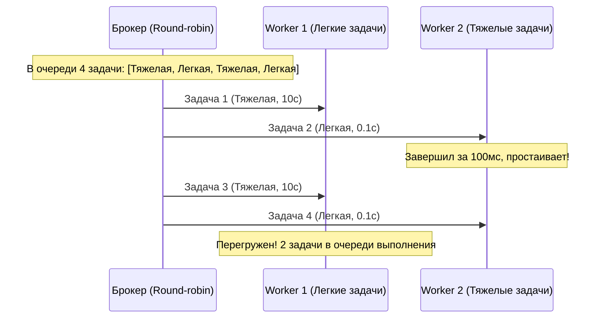

# 2. Work Queue: балансировка нагрузки и паттерн конкурирующих потребителей

> *"Do not try to make the program do too much at once. Break it into small, independent tasks, and let specialized workers execute them without stepping on each other's toes."*  
> — Брайан Керниган

> [!NOTE]
> **Связи:** В [[1. Pub Sub]] мы разобрали широковещательную рассылку событий всем заинтересованным подписчикам (Fan-out). Однако в реальных системах огромная часть работы состоит не в оповещении, а в распределении тяжелых задач между параллельными исполнителями. В этой статье мы изучим паттерн **Work Queue (Очередь задач)**, также известный как **Competing Consumers (Конкурирующие потребители)**. Мы разберем механику честного распределения (Fair Dispatch), свяжем размер пула горутин с QoS брокера и подготовимся к концепции событийно-ориентированных архитектур в [[3. Event Driven Architecture]].

---

## Зачем нужна очередь задач?

Представьте типичные сценарии бэкенда:
- Пользователь нажал кнопку «Сформировать выписку за 5 лет» (генерация PDF-документа на 500 страниц);
- Маркетплейс получил архив с 10 000 фотографий товаров для сжатия и нарезки миниатюр;
- Биллинг рассылает SMS с одноразовым кодом авторизации (OTP).

Если опубликовать эти задачи через обычный [[1. Pub Sub]], то все запущенные реплики вашего сервиса параллельно получат копию задачи. В результате пользователь получит 10 одинаковых SMS-сообщений (что приведет к убыткам и ярости клиента), а 10 серверов будут одновременно генерировать один и тот же PDF-файл, сжигая процессорные циклы.

Для задач, которые **должны быть выполнены строго один раз** с равномерным распределением нагрузки по вычислительным узлам, используется паттерн **Work Queue (Очередь задач / Task Queue)**.

---

## Анатомия паттерна Work Queue

Суть паттерна заключается в наличии **одной логической очереди** и пула параллельных обработчиков (воркеров), которые **конкурируют** за получение следующей доступной задачи.

Фундаментальный контракт паттерна: **каждое сообщение из очереди должно быть получено и успешно обработано строго одним воркером из пула**.

```mermaid
flowchart TD
    P1["API Gateway 1<br>(Издатель задач)"] -->|"Task A"| Q{"Work Queue<br>(Очередь брокера)"}
    P2["API Gateway 2<br>(Издатель задач)"] -->|"Task B, Task C"| Q
    
    Q -->|"Task A (Раздача ровно одному)"| W1["Worker 1<br>(Статус: Свободен / Idle)"]
    Q -->|"Task B (Раздача ровно одному)"| W2["Worker 2<br>(Статус: Занят / Busy)"]
    Q -->|"Task C (Раздача ровно одному)"| W3["Worker 3<br>(Статус: Свободен / Idle)"]

    W1 -->|"Ack (Задача A завершена)"| Q
    W2 -->|"Ack (Задача B завершена)"| Q
    W3 -->|"Ack (Задача C завершена)"| Q

    style Q fill:#0f172a,stroke:#38bdf8,stroke-width:2px
    style W1 fill:#131d33,stroke:#10b981,stroke-width:2px
    style W2 fill:#131d33,stroke:#f59e0b,stroke-width:2px
    style W3 fill:#131d33,stroke:#10b981,stroke-width:2px
```



### Преимущества архитектуры:
1. **Эластичное горизонтальное масштабирование:** Если нагрузка растет и очередь задач начинает накапливаться (In-flight messages увеличиваются), Kubernetes Horizontal Pod Autoscaler (HPA) поднимает еще 10 подов воркеров. Брокер мгновенно начинает распределять задачи на новые экземпляры без изменения топологии сети.
2. **Изоляция сбоев (Fault Isolation):** Если воркер аварийно завершится (panic, OOM Killer ядра Linux) посреди обработки задачи, брокер заметит обрыв TCP-сессии и автоматически перенаправит неподтвержденную задачу другому живому воркеру.
3. **Сглаживание пиковых нагрузок (Traffic Leveling):** Клиенты могут отправить 100 000 задач за 5 секунд, но воркеры будут забирать их со стабильной скоростью, не рискуя исчерпать ресурсы серверов и СУБД.

---

## Mechanical Sympathy: Локальные vs Распределенные очереди

Каждый инженер на Go рано или поздно задается вопросом:  
*«Зачем разворачивать кластер RabbitMQ или NATS, настраивать TLS и мониторинг, если я могу написать `tasks := make(chan Task, 1000)` и запустить 8 горутин прямо в памяти процесса?»*

Давайте сравним физику работы этих двух подходов:

| Параметр | Локальная очередь (Go `chan`) | Распределенная очередь (RabbitMQ / NATS) |
|:---|:---|:---|
| **Среда выполнения** | Оперативная память (RAM) одного процесса | Отдельный кластер серверов по сети |
| **Задержка передачи** | ~20–50 наносекунд | ~1–5 миллисекунд ($10^5$ раз медленнее!) |
| **Накладные расходы** | Копирование указателя, лок мьютекса в рантайме Go | Сериализация в JSON/Protobuf, syscall `write`, TCP-стек, `fsync` |
| **Отказоустойчивость** | **Нулевая**: при падении процесса задачи в `chan` уничтожаются | **Высокая**: задачи персистентно сохраняются в логе на диске |
| **Границы масштабирования** | Ограничено ядрами и RAM одного сервера | Сотни физических узлов в Kubernetes |

```
    Анатомия передачи в Go (наносекунды):
    Горутина 1 ──> [chan Task] ──(копирование указателя)──> Горутина 2
                   Структура sudog и переключение g/p в рантайме Go.

    Анатомия передачи через брокер (миллисекунды):
    Сервис A ──> JSON Encode ──> Syscall write() ──> TCP/IP Socket
             ──> Сетевой коммутатор ──> Broker RAM/Disk fsync()
             ──> Syscall read() ──> JSON Decode ──> Сервис B
```

* **Локальная очередь (Go `chan`):** Сверхбыстрая. Передача данных — это просто копирование указателя под мьютексом внутри рантайма Go. Структуры `sudog` перекидывают горутины (`g`) между потоками ОС (`m`) через локальные очереди планировщика (`p`). Но если контейнер перезагрузится, задачи исчезнут без следа.
* **Распределенная очередь:** Платит накладными расходами сети и дискового ввода-вывода ради главного свойства — **сохранности данных (Durability)** и возможности распределять CPU-bound задачи (например, кодирование видео) на сотни серверов в облаке.

---

## Справедливое распределение (Fair Dispatch)

Представьте систему, в которой задачи имеют разную вычислительную сложность:
- **Легкие задачи:** отправка email (выполняются за 100 мс);
- **Тяжелые задачи:** расчет аналитического отчета (требуют 10 секунд на 100% CPU).

Если мы запустим два воркера и подключим их к брокеру, брокер по умолчанию будет использовать циклический алгоритм **Round-robin** — он выдает сообщения строго по очереди: первому, второму, первому, второму.



> [!warning] Ловушка / Gotcha: Проблема Head-of-Line Blocking на консьюмере
> Что произойдет, если все четные задачи окажутся тяжелыми, а нечетные — легкими?  
> Брокер «вслепую» отдаст 50 тяжелых задач Воркеру 1 и 50 легких задач Воркеру 2. Воркер 2 закончит свою работу за 5 секунд и будет бессмысленно простаивать. В это время Воркер 1 будет непрерывно молотить процессор на протяжении 500 секунд, удерживая все 50 сообщений в оперативной памяти как неподтвержденные (**Unacknowledged**).  
> Это приводит к неравномерной утилизации ресурсов и классической блокировке начала очереди (**Head-of-Line Blocking**).

---

### Решение: Prefetch Count (QoS)

Чтобы гарантировать подлинно справедливое распределение (**Fair Dispatch**), используется механизм управления качеством обслуживания (**QoS — Quality of Service**), подробнее рассматриваемый в [[5. Prefetch и QoS]].

В конфигурации соединения консьюмера задается параметр **Prefetch Count** (например, `Prefetch Count = 1` или равный размеру пула параллельных горутин воркера). Это правило на уровне сетевого протокола указывает брокеру:  
*«Не отправляй мне новую порцию данных, пока число неподтвержденных мной задач (`Unacknowledged`) не уменьшится!»*

В результате задачи остаются в центральной очереди брокера. Как только любой из воркеров завершает обработку и отправляет подтверждение (`Ack`), он тут же забирает следующую задачу. Балансировка становится математически идеальной.

---

## Реализация паттернов Work Queue в разных брокерах

В мире Message Brokers не существует универсального API. RabbitMQ, Kafka и NATS решают задачу конкурирующих потребителей с использованием фундаментально различных архитектурных подходов.

### 1. RabbitMQ: Нативные очереди сообщений

RabbitMQ был буквально спроектирован вокруг паттерна Work Queue:
- Создается одна именованная очередь (`Queue`);
- К ней подключаются $N$ независимых консьюмеров через AMQP;
- Брокер сам управляет атомарным снятием задач из начала очереди и доставкой воркерам по push-модели;
- Если соединение с воркером падает, брокер мгновенно возвращает все неподтвержденные сообщения (`Unacknowledged`) в голову очереди для выдачи другим воркерам.

### 2. Apache Kafka: Consumer Groups и ограничение партиций

Kafka — это упорядоченный append-only лог, из которого нельзя просто так «вырезать» или «удалить» выполненную запись. В Kafka паттерн Work Queue строится поверх механизма групп потребителей (**Consumer Groups** с общим идентификатором `group.id`, см. [[4. Consumer groups]]).

Брокер распределяет **партиции (Partitions)** топика между участниками группы:

```
    Топик: 4 Партиции [ P0, P1, P2, P3 ]
    
    Сценарий А (4 воркера):   W1->P0, W2->P1, W3->P2, W4->P3  (100% утилизация)
    Сценарий Б (6 воркеров):  W1->P0, W2->P1, W3->P2, W4->P3, W5->IDLE, W6->IDLE!
```

> [!tip] Собеседование
> **Вопрос:** «Мы используем Apache Kafka в качестве очереди задач. В топике настроено 10 партиций. Мы замечаем, что очередь задач растет (Consumer Lag увеличивается), и Kubernetes HPA автоматически масштабирует количество подов воркеров с 10 до 20. Поможет ли это ускорить разгребание очереди?»  
> **Ответ:** **Категорически нет!**  
> В модели конкурирующих потребителей Kafka действует фундаментальное правило: **одну партицию топика не могут одновременно читать два воркера из одной Consumer Group**.  
> Если у вас 10 партиций и 20 воркеров, ровно 10 воркеров получат по одной партиции, а оставшиеся 10 воркеров перейдут в состояние **Idle (простой)** и не получат ни единого байта данных.  
> Чтобы масштабировать Work Queue в Kafka, необходимо **увеличивать количество партиций** топика!

### 3. NATS: Queue Groups и JetStream WorkQueue

В экосистеме NATS Work Queue реализуется через:
- **Core NATS Queue Groups:** вызов `nc.QueueSubscribe("tasks", "worker_pool", handler)`. Сервер NATS балансирует сообщения между подписчиками группы по алгоритму Round-Robin;
- **JetStream WorkQueue Policy:** поток с политикой `Retention: nats.WorkQueuePolicy`, где сообщение гарантированно удаляется из персистентного лога сразу после первого успешного `msg.Ack()`.

---

## Идиоматичный Go: Соединяем локальный и распределенный пулы

Senior-паттерн при проектировании воркеров на Go заключается в правильной координации распределенной очереди брокера и локального пула горутин.

Запускать `go handle(msg)` на каждое входящее из сети сообщение категорически запрещено: при резком наплыве 50 000 сообщений вы породите 50 000 горутин, исчерпаете лимиты подключений к базе данных и уроните приложение по OOM (классический эффект Thundering Herd).

**Фундаментальное правило: Значение Prefetch Count брокера должно быть строго согласовано с размером локального пула горутин (`poolSize`)!**

```go
package worker

import (
	"context"
	"log"

	amqp "github.com/rabbitmq/amqp091-go"
)

// WorkQueueConsumer управляет распределенным чтением и локальным пулом горутин
type WorkQueueConsumer struct {
	poolSize int
}

// NewWorkQueueConsumer создает новый экземпляр консьюмера
func NewWorkQueueConsumer(poolSize int) *WorkQueueConsumer {
	return &WorkQueueConsumer{poolSize: poolSize}
}

// Start запускает чтение задач и фиксированный пул воркеров
func (c *WorkQueueConsumer) Start(ctx context.Context, ch *amqp.Channel, queueName string) error {
	// 1. Критически важно: Синхронизируем QoS с размером пула горутин!
	// Если poolSize = 10, брокер выдаст ровно 10 задач и остановится, 
	// пока хотя бы одна горутина не пришлет Ack/Nack.
	err := ch.Qos(
		c.poolSize, // prefetch count: максимальное число не подтвержденных сообщений
		0,          // prefetch size: без ограничения по объему в байтах
		false,      // global: false означает ограничение на текущий канал/консьюмер
	)
	if err != nil {
		return err
	}

	msgs, err := ch.Consume(
		queueName,
		"",    // consumer tag (генерируется брокером)
		false, // auto-ack: ОБЯЗАТЕЛЬНО FALSE для надежных Work Queues!
		false, // exclusive
		false, // no-local
		false, // no-wait
		nil,   // args
	)
	if err != nil {
		return err
	}

	// 2. Локальный канал для передачи задач пулу горутин.
	// Небуферизованный канал идеален: префетч уже ограничен сетевым QoS
	tasks := make(chan amqp.Delivery)

	// 3. Запускаем фиксированный пул горутин
	for i := 0; i < c.poolSize; i++ {
		go c.workerLoop(ctx, tasks, i)
	}

	// 4. Диспетчер: считывает сообщения из сетевого канала AMQP и передает в пул
	for {
		select {
		case <-ctx.Done():
			log.Println("Остановка диспетчера очередей...")
			return nil
		case msg, ok := <-msgs:
			if !ok {
				return nil // Сетевой канал закрыт
			}
			// Блокируется, только если все горутины в пуле заняты
			tasks <- msg 
		}
	}
}

// workerLoop представляет цикл работы отдельного воркера в пуле
func (c *WorkQueueConsumer) workerLoop(ctx context.Context, tasks <-chan amqp.Delivery, id int) {
	for {
		select {
		case <-ctx.Done():
			return
		case msg := <-tasks:
			// Обработка тяжелой вычислительной или I/O задачи
			err := processHeavyTask(ctx, msg.Body)
			
			if err != nil {
				log.Printf("[Worker %d] Ошибка обработки задачи: %v", id, err)
				// Возвращаем задачу обратно в очередь для повторной попытки (requeue = true)
				_ = msg.Nack(false, true)
			} else {
				// Успех: отправляем подтверждение в брокер
				_ = msg.Ack(false)
			}
		}
	}
}

// processHeavyTask имитирует выполнение бизнес-логики
func processHeavyTask(ctx context.Context, payload []byte) error {
	// Бизнес-логика генерации отчета или транскодирования видео...
	return nil
}
```

---

## Итог

1. **Work Queue (Очередь задач)** гарантирует, что каждое сообщение обрабатывается ровно одним исполнителем из пула конкурирующих потребителей.
2. **Fair Dispatch** достигается ограничением параметра `Prefetch Count` (QoS), защищая систему от перекоса нагрузки и блокировок Head-of-Line.
3. В **RabbitMQ** масштабирование осуществляется простым добавлением воркеров к очереди; в **Apache Kafka** число параллельных воркеров жестко ограничено числом партиций топика.
4. В коде на Go правильная архитектура требует синхронизации лимита `ch.Qos` брокера с фиксированным пулом горутин воркера.

Мы разобрали два ключевых базовых паттерна: [[1. Pub Sub]] для оповещения всех и [[2. Work Queue]] для распределения задач одному. Но как собрать эти примитивы в глобальную архитектуру предприятия? 

В следующей лекции мы переходим к анализу парадигмы: [[3. Event Driven Architecture]].