# 3. Event-Driven Architecture (EDA): событийно-ориентированные системы

> *«Управление сложностью — вот суть программирования. Заменяя жесткие командные иерархии гибкими сетями реагирующих компонентов, мы создаем системы, способные эволюционировать без катастрофических поломок».*    
> — Брайан Керниган

> [!NOTE]
> **Связи:** В [[1. Pub Sub]] и [[2. Work Queue]] мы изучили конкретные сетевые топологии: как размножить сообщение на всех (Fan-out) и как сбалансировать вычислительную задачу между конкурирующими воркерами. Теперь мы поднимаемся на уровень архитектурных стилей предприятия. Мы разберем парадигму **Event-Driven Architecture (EDA)**, классификацию событий, влияние на рантайм Go, аппаратные ресурсы процессора и проблему Dual Write. В следующей лекции — [[4. Event sourcing и брокеры]] — мы исследуем радикальное развитие этой идеи, где события становятся единственным источником истины.

---

## Сдвиг парадигмы: Команды vs События

Когда вы начинаете проектировать распределенную систему, первое искушение — перенести привычный процедурный или объектно-ориентированный стиль в сеть: микросервис A вызывает микросервис B, микросервис B вызывает микросервис C. Это называется **Command-Driven (RPC/REST)** архитектурой.

Но при переходе к **Event-Driven Architecture (EDA)** вектор мышления меняется на 180 градусов: сервисы перестают «приказывать» друг другу и начинают «реагировать» на свершившиеся факты.

| Параметр | Команда (Command) | Событие (Event) |
|:---|:---|:---|
| **Семантический смысл** | «Сделай вот это» (императив) | «Произошло вот это» (факт в прошедшем времени) |
| **Адресация** | Точечная (Point-to-Point): отправитель знает точный адрес исполнителя (IP, DNS, URL) | Анонимная: издатель не знает получателей и публикует данные в шину |
| **Ожидание** | Отправитель ожидает результат или подтверждение выполнения | Fire-and-forget: издатель опубликовал факт и забыл |
| **Пример** | `POST /api/v1/emails/send` или `POST /api/v1/payments/charge` | `OrderPaidEvent` или `AccountDebitedEvent` |
| **Степень связности** | Высокая связность (Tight Coupling) | Слабая связность (Loose Decoupling) |

```mermaid
flowchart LR
    subgraph CommandDriven ["Синхронный подход: Command-Driven (RPC / REST)"]
        direction TB
        A["Сервис Заказов"] -->|"1. Команда: Спиши деньги"| B["Сервис Оплаты"]
        A -->|"2. Команда: Отправь Email"| C["Сервис Нотификаций"]
        A -->|"3. Команда: Зарезервируй товар"| D["Сервис Склада"]
    end

    subgraph EventDriven ["Асинхронный подход: Event-Driven (EDA)"]
        direction TB
        E["Сервис Оплаты"] -->|"Событие: OrderPaidEvent"| Broker{"Брокер сообщений"}
        Broker -->|"Реакция: Отправить чек"| F["Сервис Нотификаций"]
        Broker -->|"Реакция: Начать сборку"| G["Сервис Склада"]
        Broker -->|"Реакция: Обновить витрину"| H["Сервис Аналитики"]
    end

    style Broker fill:#0f172a,stroke:#38bdf8,stroke-width:2px
    style A fill:#1e293b,stroke:#f59e0b,stroke-width:2px
    style E fill:#1e293b,stroke:#10b981,stroke-width:2px
```



В EDA логика «что должно произойти после оплаты» перестает быть головной болью Сервиса Оплаты (оркестрация) и делегируется заинтересованным сервисам-подписчикам (хореография).

---

## Mechanical Sympathy: Ресурсы и Latency в EDA

Давайте взглянем на EDA не через призму модных архитектурных паттернов, а глазами «железа», оперативной памяти и планировщика рантайма Go (`runtime.scheduler`).

### Сценарий 1: Синхронная цепочка RPC (Command-Driven)

В синхронном Command-Driven подходе обработчик HTTP-запроса в `Сервисе Заказов` выглядит так. Чтобы ответить клиенту, сервис выполняет цепочку последовательных сетевых вызовов:
1. Вызов `Сервиса Оплаты` (gRPC): горутина паркуется в системном механизме `netpoll`. Ожидание ответа сети — 200 мс;
2. Вызов `Сервиса Нотификаций` (HTTP): горутина снова засыпает в `netpoll`. Ожидание — 100 мс;
3. Вызов `Сервиса Склада` (gRPC): еще 150 мс ожидания.

**Цена для аппаратуры:**
- Пользователь ждет суммарно **450 мс**;
- Горутина `g` со всем своим стеком вызовов (от 2–4 КБ до сотен килобайт) и аллокациями в куче «заморожена» на полсекунды;
- Если под нагрузкой в 2 000 RPS один из сервисов начнет отвечать за 5 секунд, в памяти `Сервиса Заказов` мгновенно зависнут 10 000 горутин, вызвав перегрузку процессора планировщиком Go, всплеск пауз GC и неминуемый OOM Killer ядра Linux.

### Сценарий 2: Асинхронный конвейер событий (Event-Driven)

Тот же сценарий в событийно-ориентированной парадигме:
1. Локальная транзакция в СУБД: сохранение заказа в статусе `Created` (5–10 мс);
2. Запись в локальный сетевой буфер сокета брокера: отправка `OrderCreatedEvent` в Kafka или NATS JetStream (1–2 мс);
3. Мгновенный возврат клиенту статуса `HTTP 201 Created` или `HTTP 202 Accepted`.

```mermaid
flowchart TD
    subgraph SyncChain ["Синхронный конвейер: Critical Path = 450ms"]
        S1["Входной запрос"] -->|"200ms"| S2["RPC Оплата"]
        S2 -->|"100ms"| S3["RPC Email"]
        S3 -->|"150ms"| S4["RPC Склад"]
        S4 --> S5["HTTP 200 OK (Горутина удерживает RAM 450ms)"]
    end

    subgraph AsyncPipeline ["EDA конвейер: Critical Path = 12ms"]
        A1["Входной запрос"] -->|"10ms"| A2["Локальная БД"]
        A2 -->|"2ms"| A3["Запись в сокет брокера"]
        A3 --> A4["HTTP 201 Created (Горутина уничтожена через 12ms!)"]
    end

    style SyncChain fill:#1e1e2e,stroke:#f43f5e,stroke-width:2px
    style AsyncPipeline fill:#0f172a,stroke:#10b981,stroke-width:2px
```



**Цена для аппаратуры:**
- Горутина живет всего **12 мс**! Она мгновенно отдает процессорные потоки (`m` и `p`) планировщика Go другим запросам;
- Стек горутины мгновенно очищается, не создавая долгоживущих объектов в куче;
- Сборщик мусора (GC) работает в режиме коротких и дешевых фаз;
- I/O-bound ожидание полностью исключено из критического пути (**Critical Path**) ответа пользователю. 

Система способна выдерживать в десятки раз больший RPS на том же самом скромном аппаратном обеспечении!

---

## Анатомия Событий: Что мы кладем в Payload?

В событийно-ориентированных архитектурах выделяют три фундаментальных типа событий. Выбор неверного типа — классическая ошибка начинающих архитекторов.

### 1. Event Notification (Уведомление о событии)

Самое «тонкое» (Thin) событие. Оно лишь констатирует факт и сообщает идентификатор изменившейся сущности:
* **Смысл:** «Изменился профиль пользователя ID=42».
* **Плюсы:** Минимальный сетевой трафик, нулевой оверхед на сериализацию, исключение риска случайной утечки персональных данных (PII).
* **Минусы:** Если подписчику нужны детали (например, какое именно поле изменилось), он вынужден делать обратный синхронный HTTP/gRPC-запрос к сервису-источнику. При массовых событиях это порождает катастрофический шторм запросов — **«Гремящее стадо» (Thundering Herd)**, гарантированно укладывающий сервис-источник.

### 2. Event-Carried State Transfer (Передача состояния)

«Толстое» (Fat) событие. Включает в себя снапшот данных сущности, достаточный для автономной работы подписчиков:
* **Смысл:** «Изменился профиль ID=42. Вот его новое имя, email и тарифный план».
* **Плюсы:** Полная изоляция сервисов. Подписчикам не нужно делать обратные сетевые запросы. Они могут сохранять эти данные в свои локальные витрины (**Materialized View**) для быстрых соединений (`JOIN`).
* **Минусы:** Избыточность трафика, риск рассинхронизации схем при частых обновлениях.

```go
// Пример реализации Event-Carried State Transfer на Go
type UserProfileUpdatedEvent struct {
    EventID     string    `json:"event_id"`
    OccurredAt  time.Time `json:"occurred_at"`
    UserID      int64     `json:"user_id"`
    
    // Данные для локального кэширования и построения Materialized Views:
    NewEmail    string    `json:"new_email"`
    NewTier     string    `json:"new_tier"`
}
```

### 3. Domain Event (Доменное событие)

Событие предметной области (в терминологии Domain-Driven Design, DDD). Оно не привязано к структуре базы данных (CRUD), а выражает явное бизнес-действие:
* **Смысл:** Не «Обновлена таблица `users`», а «Пользователь повысил статус до VIP» (`UserUpgradedToVIPEvent`) или «Счет клиента заблокирован из-за подозрительной активности» (`AccountSuspendedEvent`).
* **Плюсы:** Наивысшая семантическая выразительность. Архитектура начинает говорить на языке реального бизнеса.

---

## Теневая сторона EDA: Хаос и Консистентность

Если событийно-ориентированная архитектура дает такую потрясающую производительность и развязку сервисов, почему весь мир до сих пор не перешел на нее?

> [!warning] Ловушка / Gotcha: Event Hell (Хаос хореографии)
> В чистой EDA отсутствует единый координатор (оркестратор). Сложный бизнес-процесс (например, обработка заказа) оказывается размазанным по цепочке из 10 сервисов, обменивающихся десятками разнородных событий.  
> Когда бизнес задает вопрос: *«Почему клиент оплатил покупку, но заказ №555 завис в статусе В_Обработке и не передан на доставку?»*, поиск ответа превращается в детективное расследование. Вам придется сопоставлять логи десятка контейнеров, пытаясь вручную восстановить цепочку хореографии. Без внедрения распределенного контекста и сквозной трассировки (OpenTelemetry), которую мы детально изучим в [[10. Distributed tracing в async системах]], поддержка EDA в продакшене превращается в сущий ад.

---

### Проблема Dual Write (Двойная запись)

Это самый частый вопрос на собеседованиях уровня Senior / Lead Go Engineer при обсуждении асинхронных систем.

Представьте, что вы разрабатываете `Сервис Заказов`. Вам необходимо выполнить две операции:
1. Сохранить заказ в базе данных PostgreSQL;
2. Опубликовать событие `OrderCreatedEvent` в Apache Kafka.

```go
// АНТИПАТТЕРН: Наивная двойная запись (Dual Write)
func (s *Service) CreateOrder(ctx context.Context, req OrderReq) error {
    // 1. Фиксируем заказ в реляционной базе данных
    order := s.db.Save(req) 
    
    // 2. Публикуем событие в брокер
    // ЧТО ПРОИЗОЙДЕТ, ЕСЛИ ЗДЕСЬ УПАДЕТ СЕТЬ ИЛИ KAFKA ВЕРНЕТ ТАЙМАУТ?
    err := s.kafka.Publish("orders", order.ToEvent()) 
    if err != nil {
        // Катастрофа: транзакция в PostgreSQL уже закоммичена!
        // Заказ существует в базе данных, деньги у клиента могут списаться,
        // но Склад и Аналитика никогда не узнают об этом заказе!
        return err 
    }
    return nil
}
```

Невозможно выполнить распределенную транзакцию между реляционной базой данных (PostgreSQL) и брокером сообщений (Kafka/RabbitMQ) атомарно без тяжеловесного двухфазного коммита (2PC), который категорически не поддерживается современными облачными системами.

Для решения этой фундаментальной проблемы применяются два проверенных паттерна:
1. **Transactional Outbox (Транзакционный исходящий ящик):** сохранение события в служебную таблицу той же БД в единой ACID-транзакции с последующей асинхронной доставкой в брокер (подробно в [[6. Outbox pattern]]);
2. **Event Sourcing:** отказ от сохранения текущего состояния и хранение цепочки событий как первоисточника истины (в [[4. Event sourcing и брокеры]]).

---

> [!tip] Собеседование
> **Вопрос:** «Если мы используем Event-Driven Architecture и все зависимые сервисы кэшируют данные у себя через Event-Carried State Transfer, что произойдет, если брокер сообщений выйдет из строя на 10 минут?»  
> **Ответ:** Система продолжит частично функционировать, плавно деградируя вместо полного отказа!  
> Сервис Заказов сможет принимать новые заказы, сохраняя их в локальную БД и складывая события в таблицу Outbox. А зависимые сервисы (Склад, Каталог, Аналитика) смогут безостановочно отвечать на запросы пользователей, опираясь на свои локальные копии данных (Materialized Views), пусть и слегка устаревшие.  
> Это практическая реализация принципа **Availability over Consistency** (Теорема CAP). В синхронной архитектуре падение одного сервиса вызывает каскадный отказ всей цепочки; в EDA строгая согласованность (ACID) уступает место **Eventual Consistency (Согласованности в конечном счете)**.

---

## Итог

1. **EDA** кардинально меняет направление контроля: вместо прямого вызова процедур компоненты системы автономно реагируют на опубликованные факты.
2. **Mechanical Sympathy:** сокращение времени жизни горутин с сотен миллисекунд до десятков миллисекунд снижает давление на планировщик Go и сборщик мусора в разы.
3. **Типы событий:** используйте *Event Notification* для легковесных сигналов, *Event-Carried State Transfer* для устранения лишних HTTP-запросов и *Domain Events* для отражения бизнес-смысла.
4. **Архитектурная цена:** переход к EDA приносит сложности отладки, согласованности данных (**Eventual Consistency**) и требует решения проблемы **Dual Write**.

Но если события столь точно отражают все, что произошло в системе, возникает вопрос: *«А зачем вообще хранить "текущее" состояние в строках таблицы, если можно хранить саму историю событий как первоисточник истины?»*

Этот вопрос приводит нас к концепции **Event Sourcing**, которую мы разберем в следующей лекции: [[4. Event sourcing и брокеры]].