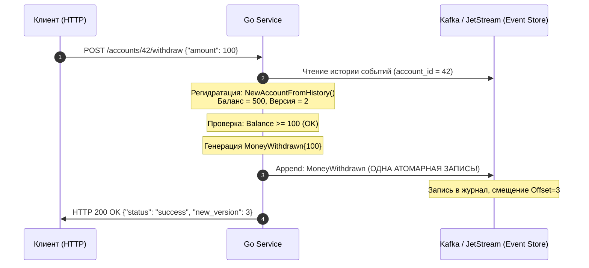
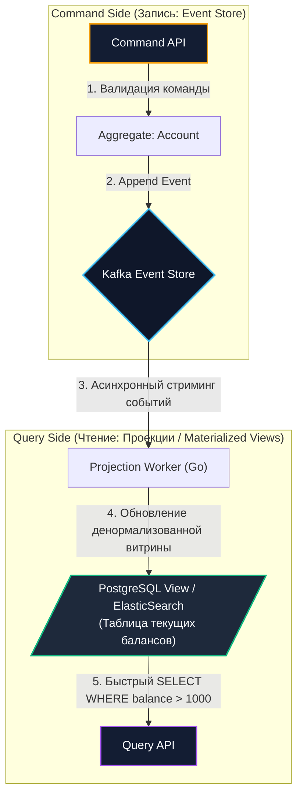
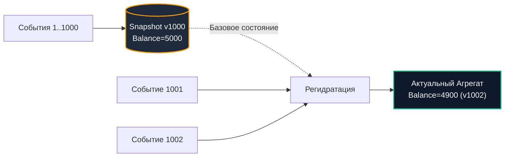

# 4. Event Sourcing и брокеры сообщений: архитектура неизменяемых логов

> *«Бухгалтеры не пользуются ластиками — иначе они сели бы в тюрьму. В хорошей инженерии, как и в хорошем бухучете, история того, как вы пришли к числу, неизмеримо ценнее самого числа».*    
> — Грег Янг

> [!NOTE]
> **Связи:** В [[3. Event Driven Architecture]] мы вскрыли фундаментальную проблему распределенных систем — **Dual Write (Двойную запись)**: невозможность атомарного обновления локальной СУБД и отправки события в брокер. В этой статье мы познакомимся с радикальным решением, которое переворачивает архитектуру с ног на голову: **Event Sourcing (Порождение событий)**. Мы разберем, как Kafka и NATS JetStream превращаются в полноценные базы данных, как устроена регидратация сущностей в Go, и почему этот паттерн неразрывно связан со следующей лекцией — [[5. CQRS и брокеры]].

---

## Иллюзия текущего состояния (CRUD vs Event Sourcing)

Классическая веб-разработка последних трех десятилетий заложница парадигмы CRUD (Create, Read, Update, Delete). Мы привыкли считать, что база данных обязана хранить мгновенный «слепок» текущей реальности.

Представьте банковский счет. В традиционной реляционной CRUD-модели при переводе денег разработчик выполняет деструктивную операцию:

```sql
UPDATE accounts SET balance = balance - 100 WHERE id = 42;
```

В этот момент физические байты на диске перезаписываются (или помечаются мертвыми в MVCC). Старое значение баланса **безвозвратно уничтожено**. Если через полгода регулятор или клиент задаст вопрос: *«Почему 15 марта на счете было 4 200 рублей, а не 5 000?»*, ответить по одной лишь таблице `accounts` невозможно. Приходится нагромождать костыли в виде таблиц аудита (`audit_logs`), триггеров и версионирования строк, которые со временем неизбежно рассинхронизируются с реальным состоянием.

**Event Sourcing** заимствует мудрость многовековой практики бухгалтерского учета (Double-Entry Bookkeeping). Бухгалтеры никогда не используют ластик: если совершена ошибка или произошел перевод, в гроссбух **дописывается новая корректирующая проводка**. 

В Event Sourcing операции `UPDATE` и `DELETE` **запрещены на физическом уровне**. Допустима строго одна операция — `INSERT` (Append).

```
    CRUD Модель (Деструктивное состояние):
    [Таблица accounts: ID=42, Balance=400] <-- Прошлые значения стерты навсегда!

    Event Sourcing Модель (Иммутабельный лог):
    [t0: AccountCreated (0)] ──> [t1: MoneyDeposited (+500)] ──> [t2: MoneyWithdrawn (-100)]
                                                                           │
                                           Текущее состояние: SUM() = 400 ◄┘
```

Текущее состояние агрегата — это математическая функция свертки (Fold / Reduce) от всех событий, произошедших с момента его создания:

$$\text{CurrentState} = \sum_{i=0}^{N} \text{Apply}(\text{Event}_i)$$

**Поток событий (Event Stream) для счета №42:**
1. `AccountCreated { InitBalance: 0 }`
2. `MoneyDeposited { Amount: 500 }`
3. `MoneyWithdrawn { Amount: 100 }`

Текущий баланс (400) **не хранится как статическое поле**. Он вычисляется в оперативной памяти процесса в ходе быстрой процедуры восстановления — **регидратации (Rehydration)**.

---

## Брокер как База Данных (Идеальный Match)

Для работы Event Sourcing необходим специализированный компонент — **Event Store (Хранилище событий)**. 

К Event Store предъявляются три жестких требования:
1. **Строгий порядок событий (Strict Ordering):** транзакции должны воспроизводиться строго в хронологическом порядке;
2. **Иммутабельность:** история никогда не модифицируется и не сжимается задним числом (Append-only Log);
3. **Реактивная подписка:** возможность стриминга новых событий подписчикам в реальном времени (Pub/Sub).

Именно поэтому распределенный лог **Apache Kafka** (а также **NATS JetStream**) выступает идеальным техническим фундаментом для Event Sourcing — куда более естественным, чем классические реляционные СУБД!

Вспомним устройство распределенного журнала из [[1. Apache Kafka. Архитектура и концепции]]: Kafka спроектирована как последовательный Append-only лог сегментов на диске. Если задать параметры топика:
- `retention.bytes = -1` (бесконечный объем);
- `retention.ms = -1` (вечное хранение),
то топик Kafka де-факто превращается в высоконадежную, персистентную СУБД. При этом использование ID агрегата (например, `account_id`) в качестве ключа партиционирования (**Partition Key**) гарантирует, что все события конкретного банковского счета попадут в одну и ту же партицию, обеспечивая абсолютный порядок чтения и записи.

> [!warning] Ловушка / Gotcha: RabbitMQ не подходит для Event Sourcing
> RabbitMQ — это брокер очередей, работающий по принципу *«доставил и сразу удалил из памяти»*. В RabbitMQ нет концепции неизменяемого персистентного журнала с произвольным смещением (Offset).  
> Если попытаться построить Event Sourcing на RabbitMQ, вам придется сохранять события в стороннюю БД (PostgreSQL или EventStoreDB), а брокер использовать только для рассылки уведомлений. Это мгновенно возвращает вас к кошмару проблемы **Dual Write**!

---

## Анатомия Агрегата в Go

Посмотрим, как фундаментальный паттерн Event Sourcing реализуется в чистом и идиоматичном коде на Go:

```go
package domain

import (
	"errors"
	"fmt"
)

// Account — Доменный Агрегат (Aggregate Root)
// Состояние не мутируется напрямую публичными методами!
type Account struct {
	ID      string
	Balance int64
	Version int // Критично для проверки оптимистичных блокировок
}

// Event — базовый интерфейс любого доменного события
type Event interface {
	EventType() string
}

// Конкретные неизменяемые события:
type AccountCreated struct {
	AccountID string
}
func (e AccountCreated) EventType() string { return "AccountCreated" }

type MoneyDeposited struct {
	Amount int64
}
func (e MoneyDeposited) EventType() string { return "MoneyDeposited" }

type MoneyWithdrawn struct {
	Amount int64
}
func (e MoneyWithdrawn) EventType() string { return "MoneyWithdrawn" }

// Apply — чистая функция-мутатор: единственный способ изменить поля структуры.
// Внутри Apply запрещена любая логика ввода-вывода (I/O) и валидации!
func (a *Account) Apply(event Event) {
	switch e := event.(type) {
	case AccountCreated:
		a.ID = e.AccountID
		a.Balance = 0
	case MoneyDeposited:
		a.Balance += e.Amount
	case MoneyWithdrawn:
		a.Balance -= e.Amount
	}
	a.Version++
}

// NewAccountFromHistory восстанавливает состояние агрегата из цепочки событий (Rehydration)
func NewAccountFromHistory(events []Event) *Account {
	account := &Account{}
	for _, e := range events {
		account.Apply(e) // O(N) проход в оперативной памяти
	}
	return account
}

// Withdraw реализует команду бизнес-логики.
// Метод проверяет инварианты и ГЕНЕРИРУЕТ новое событие, но НЕ меняет состояние сам!
func (a *Account) Withdraw(amount int64) (Event, error) {
	if amount <= 0 {
		return nil, errors.New("сумма списания должна быть строго положительной")
	}
	if a.Balance < amount {
		return nil, fmt.Errorf("insufficient funds: доступно %d, запрошено %d", a.Balance, amount)
	}

	// Мы НЕ пишем a.Balance -= amount! 
	// Мы только фиксируем факт успешного формирования события:
	return MoneyWithdrawn{Amount: amount}, nil
}
```

> [!info] Под капотом: Mechanical Sympathy, Escape Analysis и интерфейс itab
> Восстановление состояния агрегата (`NewAccountFromHistory`) требует итерации по срезу событий.  
> Если события упакованы в последовательный непрерывный буфер памяти, процессор с легкостью подгрузит их в кэш первого уровня (L1 Data Cache) благодаря линейной локальности ссылок (Cache Locality).  
> Однако обратите внимание на тип среза: `[]Event`. В Go присваивание конкретной структуры интерфейсному типу `Event` приводит к созданию структуры `runtime.iface` с указателем на таблицу методов `itab`. Если компилятор не сможет доказать, что переменная не утекает из функции (Escape Analysis fails), память под каждое событие будет аллоцирована в куче (Heap), создавая колоссальную работу для Сборщика Мусора (GC).  
> В критических HighLoad-системах на Go вместо срезов интерфейсов `[]Event` используют кодогенерацию, `union`-подобные плоские структуры или бинарные протоколы (Protobuf/FlatBuffers), упакованные в монолитный слайс байт `[]byte`.

---

## Решение проблемы Dual Write

Главный триумф Event Sourcing заключается в том, что проблема **Dual Write** (двойной записи) не просто решается — **она перестает существовать в принципе**!

Поскольку мы больше не ведем отдельную таблицу текущего состояния, в архитектуре **остается ровно одна операция записи**:



Нет никакой локальной реляционной базы данных, которую требовалось бы координировать с брокером через двухфазный коммит. Брокер сообщений **и есть ваша база данных**. Запись всегда атомарна, последовательна и иммутабельна.

---

## Темная сторона: Как читать данные? (Введение в CQRS)

У Event Sourcing есть обратная сторона медали, которая может стать фатальной, если не подготовить архитектуру чтения заранее.

Представьте, что отдел комплаенса просит предоставить отчет:  
*«Выведи список всех счетов, где текущий баланс превышает 1 000 долларов»*.

В обычной реляционной базе данных вы бы выполнили мгновенный запрос:
```sql
SELECT * FROM accounts WHERE balance > 1000;
```

**В чистом Event Sourcing выполнить такой запрос невозможно!**  
У вас нет таблицы с колонкой `balance`. У вас есть только терабайтный журнал миллионов транзакций в Kafka. Чтобы найти подходящие счета, вам пришлось бы:
1. Вычитать миллиарды событий из Kafka с самого первого дня существования банка;
2. Сгруппировать события по миллионам пользователей;
3. Регидрировать каждый агрегат в оперативной памяти и проверить баланс.

Сложность операции — $O(N)$ по объему всего лога событий в мире. Это вызовет гарантированный отказ сервиса по памяти и CPU.

По этой причине **Event Sourcing практически никогда не используется в одиночку**. В 100% реальных продакшен-систем он работает в неразрывной связке с паттерном **CQRS (Command Query Responsibility Segregation)**:



Система разделяется на два независимых крыла:
- **Command Side (Запись):** принимает команды, валидирует бизнес-правила и дописывает новые события в неизменяемый Event Store (Kafka);
- **Query Side (Чтение):** фоновые консьюмеры слушают новые события из Kafka и обновляют классические оптимизированные базы данных (PostgreSQL, ClickHouse, Redis, Elasticsearch), создавая готовые для чтения витрины (**Materialized Views / Projections**).

---

## Оптимизация: Snapshotting (Снапшоты)

Если банковский счет активно используется на протяжении 5 лет, для него могут накопиться десятки тысяч транзакций. Вычитывать и прогонять через `Apply()` 50 000 событий при каждой попытке списать 100 рублей — непозволительная трата времени и процессорных тактов.

Для решения проблемы применяется техника **Snapshotting (Снимки состояния)**:



1. Фоновый процесс или сам обработчик раз в $N$ событий (например, каждые 1 000 событий) сериализует текущее восстановленное состояние агрегата и сохраняет его в быстрое хранилище (Redis, S3 или отдельный компактный топик Kafka).
2. При поступлении новой команды сервис загружает последний снапшот (версия 1 000, баланс 5 000).
3. Из Event Store запрашиваются только те события, чья версия строго больше 1 000.
4. Сервис «докручивает» всего 2–3 свежих события поверх снапшота. Время отклика возвращается к константному $O(1)$!

---

> [!tip] Собеседование: GDPR и право на забвение в иммутабельных логах
> **Вопрос:** «В европейском законодательстве действует регламент GDPR (Право на забвение — Right to be Forgotten). Если пользователь требует полностью удалить свои персональные данные, как это сделать в системе с Event Sourcing, где фундаментальное правило архитектуры гласит: "Append-only, данные никогда не удаляются и не изменяются"?»  
> **Ответ:** Это классический вопрос на проверку зрелости архитектора. Удалять или редактировать события в середине append-only лога Kafka нельзя — это сломает хеширование, смещения (Offsets) и вызовет каскадную порчу репликации.  
> Решение заключается в архитектурном паттерне **Crypto-Shredding (Криптографическое уничтожение)**:
> 1. Персональные данные пользователя (PII: ФИО, паспорт, телефон, email) шифруются уникальным для каждого пользователя симметричным ключом (AES-256-GCM) перед формированием события.
> 2. Ключи шифрования хранятся в защищенном внешнем хранилище (HashiCorp Vault или СУБД с поддержкой `DELETE`). В событие пишется только зашифрованный шифротекст и идентификатор ключа `key_id`.
> 3. Когда пользователь запрашивает удаление по GDPR, вы **удаляете только его ключ шифрования** из Vault.
> 4. События в неизменяемом логе Kafka остаются физически целыми, но полезная нагрузка превращается в нерасшифровываемый криптографический белый шум. Юридически и технически данные считаются уничтоженными навсегда!

---

## Итог

1. **Event Sourcing** заменяет деструктивное хранение текущего состояния на непрерывный иммутабельный журнал доменных событий.
2. **Apache Kafka и NATS JetStream** служат естественными хранилищами событий (Event Store) благодаря модели Append-only лога с гарантией порядка внутри партиции.
3. **Проблема Dual Write исчезает**, поскольку единственным источником правды становится брокер.
4. **Архитектурный компромисс:** Event Sourcing делает запись тривиальной, но усложняет чтение. Для выборок и аналитики необходимы асинхронные проекции.

В следующей лекции мы досконально исследуем вторую половину этого тандема: как правильно проектировать асинхронные проекции и витрины данных в рамках паттерна [[5. CQRS и брокеры]].