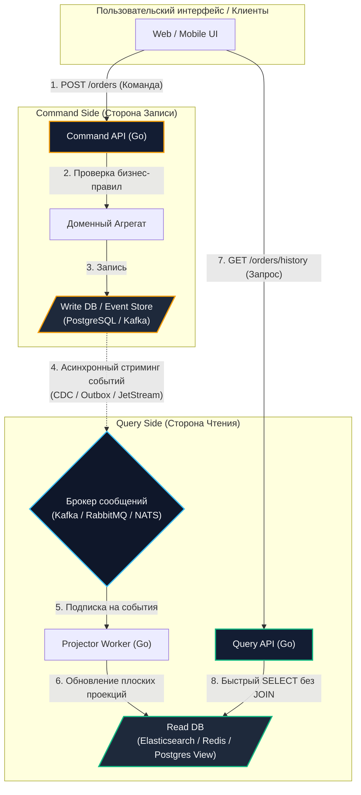

# 5. CQRS и брокеры сообщений: разделение команд, запросов и проекций

> *«Суть чистого проектирования — в разделении ответственности. Не требуйте от компонента служить двум господам с противоположными физическими требованиями».*    
> — Брайан Керниган

> [!NOTE]
> **Связи:** В [[4. Event sourcing и брокеры]] мы столкнулись с архитектурным парадоксом: хранилище, идеально оптимизированное для последовательной записи (Append-only лог событий), категорически не пригодно для произвольных фильтраций, выборок и поисковых агрегаций. В этой лекции мы изучим паттерн **CQRS (Command Query Responsibility Segregation — Разделение ответственности команд и запросов)**, где брокер сообщений выступает в роли асинхронного моста между миром записи и миром чтения. Это знание подготовит нас к анализу паттерна [[6. Outbox pattern]].

---

## Проблема CRUD: конфликт аппаратных профилей

В традиционных архитектурах (CRUD) одна и та же реляционная база данных и одни и те же сущности (Data Model Objects) используются одновременно и для записи, и для чтения. 

В небольших проектах это работает великолепно. Но при переходе в HighLoad (где соотношение запросов чтения к записи часто составляет 100:1 или 1000:1) единая база данных неизбежно сталкивается с **физическим конфликтом аппаратных профилей**:

```
    Аппаратный конфликт внутри одной СУБД:
    
    [Транзакция Записи] ──> B-Tree Page Splits ──> Random I/O на 10 индексах ──> WAL fsync()
                                      ▲
                                      │ Вытеснение страниц из Buffer Pool!
                                      ▼
    [Запрос на Чтение]  ──> Сканирование памяти ──> Cache Miss ──> Задержки p99 растут!
```

> [!info] Под капотом: Mechanical Sympathy и конфликт дискового I/O
> Почему традиционные CRUD-базы данных деградируют под смешанной нагрузкой?
> - **Профиль записи (Write):** Требует обновления первичных и всех вторичных индексов (B-Tree). Это порождает разбиение страниц памяти (Page Splits), инвалидацию страничного кэша ядра ОС (`OS Page Cache`), фрагментацию и синхронный сброс журнала упреждающей записи на диск через системный вызов `fsync`.
> - **Профиль чтения (Read):** Требует, чтобы горячие строки и индексы непрерывно находились в оперативной памяти (Buffer Pool) и процессорных кэшах L1/L2/L3.  
> 
> Когда транзакция пишет в таблицу с 10 индексами, она заставляет дисковый контроллер совершать дорогой случайный ввод-вывод (Random I/O), вытесняя из оперативной памяти полезные страницы данных для чтения.
> 
> **CQRS изолирует эти нагрузки на аппаратном уровне:**
> - Сервер записи (Write DB) оснащается сверхбыстрыми накопителями NVMe SSD и настраивается на максимальную пропускную способность коммитов (индексов минимум);
> - Сервер чтения (Read DB) комплектуется терабайтами оперативной памяти (RAM) для кэширования плоских витрин без дискового ожидания (например, Redis, Elasticsearch или ClickHouse).

---

## Анатомия CQRS

Паттерн **CQRS** утверждает: модель, которая проверяет доменные инварианты и фиксирует изменения (Команда), и модель, которая отдает структурированные данные пользователю (Запрос), должны быть **логически и физически разделены**.



### 1. Command Side (Сторона Записи)
- **Назначение:** Принимает императивные команды изменения мира: `CreateOrder`, `CancelSubscription`, `TransferMoney`;
- **Логика:** Содержит всю валидацию, бизнес-инварианты и проверку прав доступа;
- **Оптимизация:** Направлена на высокую пропускную способность записи (**High Write Throughput**). Никаких тяжелых JOIN-ов, минимум вторичных индексов;
- **СУБД:** Нормализованный PostgreSQL, специализированный Event Store или Apache Kafka.

### 2. Query Side (Сторона Чтения)
- **Назначение:** Обслуживает запросы на получение данных: `GetOrderHistory`, `SearchCatalog`, `GetDashboardMetrics`;
- **Логика:** Лишена бизнес-правил; чистая проекция и отдача данных;
- **Оптимизация:** Направлена на минимальную задержку отдачи (**Low Read Latency**). Таблицы предельно денормализованы (все данные заказа, включая адрес и имя клиента, склеены в одну строку или JSON-документ);
- **СУБД:** Elasticsearch (полнотекстовый поиск), Redis (кэш профиля), ClickHouse (аналитика) или плоские материализованные представления в PostgreSQL.

---

## Роль брокера: Мост между мирами

Как данные из транзакционной базы записи попадают в денормализованные витрины для чтения?  
Через механизм **асинхронной проекции (Projections)**. Брокер сообщений (Kafka, RabbitMQ, NATS) становится транспортной артерией всей системы:

1. Сервис записи фиксирует изменение и публикует доменное событие в брокер;
2. Специальный фоновый процесс — **Проектор (Projector)** — подписан на эти события;
3. Получив событие, Проектор преобразует его структуру в формат, удобный для экрана пользователя, и выполняет `Upsert` в Read DB.

---

## Идиоматичный Go: Проектор и Идемпотентность

Проектор на Go — это консьюмер брокера сообщений. Из-за природы распределенных систем он неизбежно будет сталкиваться с повторной доставкой сообщений (at-least-once) и возможным нарушением хронологического порядка.

Если брокер доставит событие `OrderTotalUpdated` с новым чеком, как обновить витрину `read_orders_view`, чтобы дубликат или запоздавшее старое событие не перезаписали актуальные данные?

Применяется механизм **оптимистичной блокировки по версии (Optimistic Concurrency Control)** непосредственно в SQL-запросе проектора:

```go
package projector

import (
	"context"
	"database/sql"
	"fmt"
	"log/slog"
)

// OrderUpdatedEvent представляет контракт события изменения заказа
type OrderUpdatedEvent struct {
	OrderID string `json:"order_id"`
	Status  string `json:"status"`
	Total   int64  `json:"total"`
	Version int64  `json:"version"` // Монотонно возрастающая версия агрегата!
}

// OrderProjector отвечает за асинхронное обновление витрины чтения
type OrderProjector struct {
	db     *sql.DB
	logger *slog.Logger
}

func NewOrderProjector(db *sql.DB, logger *slog.Logger) *OrderProjector {
	return &OrderProjector{db: db, logger: logger}
}

// HandleOrderUpdated атомарно обновляет материализованное представление
func (p *OrderProjector) HandleOrderUpdated(ctx context.Context, event OrderUpdatedEvent) error {
	// Денормализованная таблица read_orders_view содержит готовые для фронтенда данные
	query := `
		INSERT INTO read_orders_view (order_id, status, total, version)
		VALUES ($1, $2, $3, $4)
		ON CONFLICT (order_id) DO UPDATE 
		SET 
			status = EXCLUDED.status,
			total = EXCLUDED.total,
			version = EXCLUDED.version
		-- КРИТИЧЕСКИ ВАЖНО: Защита от дубликатов и нарушения порядка!
		-- Строка обновляется ТОЛЬКО если версия входящего события строго больше текущей
		WHERE read_orders_view.version < EXCLUDED.version
	`

	res, err := p.db.ExecContext(ctx, query, event.OrderID, event.Status, event.Total, event.Version)
	if err != nil {
		return fmt.Errorf("ошибка upsert в read model: %w", err)
	}

	rowsAffected, err := res.RowsAffected()
	if err != nil {
		return fmt.Errorf("ошибка проверки rows affected: %w", err)
	}

	if rowsAffected == 0 {
		// Событие проигнорировано базой данных.
		// Это либо дубликат (версии равны), либо старое сообщение (нарушен порядок в сети).
		p.logger.DebugContext(ctx, "Событие проигнорировано: версия устарела или уже применена",
			"order_id", event.OrderID,
			"incoming_version", event.Version,
		)
	}

	return nil // Возвращаем nil для отправки подтверждения (Ack) брокеру
}
```

---

## Главная боль CQRS: Eventual Consistency

Когда поток записи отделен от потока чтения асинхронным брокером, система неизбежно переходит в режим **согласованности в конечном счете (Eventual Consistency)**.

Задержка репликации (Replication Lag) между коммитом в Write DB и обновлением строки в Read DB обычно составляет от 10 до 100 миллисекунд, но при всплеске нагрузки может вырастать до секунд.

> [!warning] Ловушка / Gotcha: Проблема Read Your Own Writes (Чтение собственных изменений)
> Пользователь нажимает кнопку «Добавить товар в корзину»:
> 1. Браузер отправляет команду: `POST /cart/items` $\to$ Command API $\to$ Write DB $\to$ `HTTP 200 OK`;
> 2. Фронтенд немедленно делает редирект на экран корзины: `GET /cart` $\to$ Query API $\to$ Read DB;
> 3. Но Проектор еще не успел вычитать событие из Kafka и обновить Read DB!
> 
> Пользователь видит **абсолютно пустую корзину**, впадает в недоумение и нажимает кнопку покупки еще 5 раз. Бизнес получает жалобы и дубликаты заказов.

---

### Как решать эту проблему (Вопросы с собеседований Senior+)

На интервью системного дизайна вас обязательно спросят: *«Как обойти лаг репликации в CQRS, чтобы пользователь не видел устаревших данных?»* 

Существует три канонических инженерных решения:

1. **Optimistic UI (Оптимистичный интерфейс):**  
   Фронтенд-приложение (Single Page Application / Mobile App) не ждет повторного запроса `GET`. Оно само локально обновляет внутреннее состояние и сразу рисует товар в корзине. Если бэкенд через пару секунд вернет ошибку фоновой обработки, UI покажет всплывающее уведомление и откатит отрисовку.
2. **Polling с версионированием (`min_revision`):**  
   Command API в ответе на команду возвращает `Version` или `Revision ID` измененной сущности (например, `Revision: 5`).  
   При запросе чтения фронтенд передает эту метку в параметрах: `GET /cart?min_revision=5`. Query API проверяет версию в Read DB: если в витрине пока доступна только 4-я версия, Query API **не отдает устаревший ответ сразу**, а приостанавливает выполнение (через `time.Sleep` и retry-loop под капотом, либо через Long Polling) до тех пор, пока Проектор не догонит нужную версию.
3. **WebSockets / Server-Sent Events (SSE):**  
   Command API возвращает клиенту статус `HTTP 202 Accepted` («Принято в обработку»). Пользователь видит аккуратный спиннер. Как только Проектор обновил Read DB, он отправляет push-уведомление через WebSocket прямо в браузер: *«Корзина обновлена»*, после чего интерфейс запрашивает актуальный слепок.

---

## Суперсила CQRS: Перестройка моделей (Rebuilding)

Главная архитектурная магия тандема **CQRS + Event Sourcing (на базе Kafka)** — это возможность безболезненно менять бизнес-требования задним числом.

Представьте, что руководство компании требует:  
*«Нам срочно нужен новый дашборд: распределение выручки по городам и категориям товаров за последние 5 лет»*.

В классической CRUD-системе, если вы исторически не нормализовали город доставки в отдельную индексированную колонку, построить такой дашборд на миллиардах строк без блокировки продакшен-базы невозможно.

В архитектуре CQRS вы действуете по прозрачному алгоритму:
1. Создаете новую, идеально подходящую базу данных (например, ClickHouse);
2. Пишете новый легковесный сервис-проектор на Go;
3. Подключаете его к топику Kafka с параметром `auto.offset.reset = earliest`;
4. За несколько часов Проектор на полной скорости процессора перечитывает всю 5-летнюю историю компании из лога Kafka и формирует безупречную аналитическую витрину;
5. Вы бесшовно переключаете дашборд на ClickHouse. **Zero Downtime, ноль изменений в продакшен-базе записи!**

---

## Итог

1. **CQRS** физически разносит потоки Записи (команды, сложная валидация) и Чтения (быстрые выборки без тяжелых JOIN-ов).
2. **Брокер сообщений** служит надежным асинхронным конвейером передачи фактов изменений из Write-модели в Read-модель.
3. **Изоляция аппаратных профилей:** вы настраиваете NVMe SSD под последовательный append-only лог записи и гигантские пулы оперативной памяти под кэши чтения.
4. **Компромисс:** появление **Eventual Consistency** требует проектирования идемпотентных проекторов с контролем версий строк и специальных UI-паттернов (Optimistic UI, `min_revision`).

Мы описали стройную картину: Command API записывает агрегат и шлет событие в брокер. Но как гарантировать, что транзакция в базе данных и отправка сообщения в брокер произойдут **абсолютно надежно**, без потери событий при сетевых сбоях и падениях серверов?

В следующей лекции мы детально разберем фундаментальный архитектурный паттерн, решающий проблему двойной записи: [[6. Outbox pattern]].