# 6. Transactional Outbox: надежная доставка сообщений без Dual Write

> *«Каждый раз, когда вы пытаетесь обновить два независимых конечных автомата одновременно без единого координирующего центра, вы неизбежно убеждаетесь, что законы физики и сеть вступили против вас в сговор».*    
> — Брайан Керниган

> [!NOTE]
> **Связи:** В [[3. Event Driven Architecture]] и [[5. CQRS и брокеры]] мы зафиксировали проблему **Dual Write**: невозможность в рамках одной распределенной транзакции обновить данные в реляционной СУБД и отправить сообщение в брокер (Kafka/RabbitMQ/NATS). В этой лекции мы детально разберем паттерн **Transactional Outbox (Исходящий ящик)** — индустриальный золотой стандарт гарантированной публикации событий. В следующей лекции — [[7. Inbox pattern]] — мы изучим его зеркальное отражение на стороне консьюмера.

---

## Проклятие двойной записи (Dual Write)

Классический сценарий микросервиса электронной коммерции: пользователь нажимает кнопку «Оформить заказ». Нам требуется выполнить две элементарные операции:
1. Сохранить сущность заказа в реляционную базу данных (PostgreSQL);
2. Опубликовать событие `OrderCreatedEvent` в брокер сообщений (Kafka или RabbitMQ), чтобы Сервис Склада начал комплектацию товара.

Как выглядит наивная попытка реализовать это на Go?

```go
// АНТИПАТТЕРН: Наивная попытка связать СУБД и брокер
func (s *Service) CreateOrder(ctx context.Context, req OrderRequest) error {
	// 1. Начинаем ACID-транзакцию в БД
	tx, _ := s.db.BeginTx(ctx, nil)
	
	// 2. Сохраняем бизнес-сущность заказа в таблицу
	_ = saveOrderToDB(tx, req)
	
	// 3. Отправляем событие в брокер сообщений
	err := s.kafka.Publish("orders", req.ToEvent())
	if err != nil {
		tx.Rollback() // Откатываем БД, если брокер недоступен
		return err
	}
	
	// 4. Коммитим транзакцию в БД
	return tx.Commit() 
}
```

> [!warning] Ловушка / Gotcha: Бомба замедленного действия под капотом
> Этот код — архитектурная мина. Он обречен на возникновение рассинхронизации данных (**Dual Write**):  
> Что произойдет, если брокер Kafka успешно принял сообщение (`s.kafka.Publish` завершился успехом), но на этапе `tx.Commit()` база данных вернула ошибку (например, кратковременный сетевой сбой, обрыв соединения, конфликт блокировок или сработал `UNIQUE` constraint)?  
> 
> Транзакция в базе данных откатывается. Заказа в системе физически не существует. Но событие `OrderCreatedEvent` **уже улетело в брокер**! Сервис Склада радостно соберет и отправит посылку для несуществующего заказа, а деньги у клиента не спишутся. Система приходит в несогласованное состояние, которое невозможно исправить автоматически.

Пытаться объединить PostgreSQL и Kafka в двухфазный коммит (**2PC / XA Transactions**) в современных облачных средах бессмысленно: 2PC превращает систему в хрупкую конструкцию, где сбой любого узла блокирует ресурсы базы, а пропускная способность падает до единиц запросов в секунду.

Инженерное решение этой задачи — паттерн **Transactional Outbox (Исходящие сообщения)**.

---

## Анатомия паттерна Outbox

Философия паттерна гениально проста: мы используем локальные ACID-свойства нашей проверенной реляционной базы данных (PostgreSQL/MySQL), чтобы гарантировать 100% атомарность.

Вместо того чтобы совершать ненадежный сетевой вызов к брокеру посреди транзакции, мы создаем в той же базе данных служебную таблицу — `outbox` (ящик исходящей почты).

```
    Реальная бытовая аналогия:
    Руководитель подписывает контракт и сразу кладет его в лоток «Исходящие» 
    на своем столе. Если выключится свет, и контракт, и конверт останутся 
    на столе в сохранности. Позже курьер (Relay) заберет конверт и отнесет на почту.
```

В рамках **одной локальной транзакции** выполняются строго два действия:
1. Записываются изменения бизнес-сущности (таблица `orders`);
2. Записывается тело события (JSON payload) в таблицу `outbox`.

Если транзакция коммитится успешно — в базе данных **одновременно** появляются и заказ, и готовое к отправке событие. Если транзакция откатывается — исчезают оба. Атомарность гарантирована ядром СУБД!

После этого в игру вступает отдельный асинхронный процесс — **Relay (Релей / Диспетчер)**, который считывает строки из таблицы `outbox` и гарантированно перекладывает их в брокер сообщений.

```mermaid
flowchart TD
    subgraph App ["Go Backend (API Сервис)"]
        A["Бизнес-логика"] -->|"1. Begin TX<br>2. INSERT INTO orders<br>3. INSERT INTO outbox<br>4. Commit TX"| B[/"PostgreSQL (ACID)"/]
    end
    
    subgraph Relay ["Outbox Relay (Диспетчер)"]
        C["Message Dispatcher<br>(Polling или Debezium CDC)"] -->|"5. Читает новые строки outbox"| B
        C -->|"6. Publish в топик"| D{"Брокер сообщений<br>(Kafka / RabbitMQ / NATS)"}
        C -->|"7. Удаляет или помечает<br>строки как отправленные"| B
    end

    style B fill:#1e293b,stroke:#10b981,stroke-width:2px
    style D fill:#0f172a,stroke:#38bdf8,stroke-width:2px
    style C fill:#131d33,stroke:#f59e0b,stroke-width:2px
```



---

## Идиоматичный Go: Реализация записи (Command Side)

На стороне API-сервиса код становится предельно надежным и избавляется от любых внешних сетевых зависимостей в момент обработки клиентского запроса:

```go
package domain

import (
	"context"
	"database/sql"
	"encoding/json"
	"fmt"
	"time"
)

// OutboxMessage представляет контракт структуры в исходящей таблице
type OutboxMessage struct {
	ID        string
	Topic     string
	Payload   []byte
	CreatedAt time.Time
}

type Order struct {
	ID    string
	Total int64
}

type OrderService struct {
	db *sql.DB
}

func (s *OrderService) CreateOrder(ctx context.Context, order Order) error {
	tx, err := s.db.BeginTx(ctx, nil)
	if err != nil {
		return fmt.Errorf("begin tx: %w", err)
	}
	defer tx.Rollback()

	// 1. Сохраняем заказ в бизнес-таблицу orders
	_, err = tx.ExecContext(ctx, "INSERT INTO orders (id, total) VALUES ($1, $2)", order.ID, order.Total)
	if err != nil {
		return fmt.Errorf("insert order: %w", err)
	}

	// 2. Формируем событие доменной модели
	event := map[string]any{
		"event":    "OrderCreated",
		"order_id": order.ID,
		"total":    order.Total,
	}
	payload, err := json.Marshal(event)
	if err != nil {
		return fmt.Errorf("marshal outbox payload: %w", err)
	}

	// 3. Сохраняем событие в таблицу outbox в ТОЙ ЖЕ САМОЙ транзакции
	_, err = tx.ExecContext(ctx, `
		INSERT INTO outbox (id, topic, payload, created_at) 
		VALUES (gen_random_uuid(), 'orders_topic', $1, NOW())
	`, payload)
	if err != nil {
		return fmt.Errorf("insert outbox: %w", err)
	}

	// Атомарный коммит! Если успешно — событие 100% будет доставлено
	if err := tx.Commit(); err != nil {
		return fmt.Errorf("commit tx: %w", err)
	}

	return nil
}
```

---

## Механизмы Relay: Доставка из базы в брокер

Записать строку в `outbox` — половина дела. Как надежно и с минимальной задержкой извлечь эти данные и доставить их в брокер сообщений? В индустрии существует два основных подхода.

### Подход 1: Polling Publisher (Опрос базы данных)

Периодический фоновый воркер на Go раз в $N$ миллисекунд опрашивает таблицу `outbox` обычным SQL-запросом.

> [!warning] Ловушка / Gotcha: Блокировки и гонки при конкурентном Polling
> Если запустить несколько реплик сервиса Relay для отказоустойчивости, наивный запрос:  
> `SELECT * FROM outbox WHERE status = 'pending'`  
> приведет к тому, что все воркеры прочитают одни и те же строки и отправят в Kafka пачки дубликатов!  
> Попытка заблокировать таблицу через обычный `FOR UPDATE` заблокирует параллельные воркеры, превратив конкурентную обработку в узкое горлышко.

Чтобы организовать параллельное чтение без взаимных блокировок, в PostgreSQL используется специализированная конструкция **`FOR UPDATE SKIP LOCKED`**:

```sql
-- Эталонный запрос конкурентного Polling Relay в PostgreSQL:
BEGIN;

WITH cte AS (
    SELECT id FROM outbox
    WHERE status = 'pending'
    ORDER BY created_at ASC
    LIMIT 100
    FOR UPDATE SKIP LOCKED -- Пропускает строки, уже занятые другим воркером!
)
UPDATE outbox SET status = 'processing'
WHERE id IN (SELECT id FROM cte)
RETURNING id, topic, payload;

-- 1. Полученные строки отправляются в брокер Kafka/RabbitMQ в коде Go
-- 2. При подтверждении успешной отправки от брокера:
DELETE FROM outbox WHERE id IN (...);

COMMIT;
```

*Минусы Polling:* Постоянная нагрузка на CPU базы данных (даже когда новых событий нет) и неизбежный лаг доставки, равный интервалу таймера опроса.

---

### Подход 2: Transaction Log Tailing (CDC) — Индустриальный стандарт

В высоконагруженных системах (HighLoad) периодический опрос базы данных неприменим из-за накладных расходов. Вместо этого применяется технология **Change Data Capture (CDC — Захват изменений данных)**.

> [!info] Под капотом: Mechanical Sympathy, PostgreSQL WAL и Debezium
> Как работает CDC на физическом уровне?  
> Любая современная реляционная база данных (PostgreSQL, MySQL) сначала последовательно сбрасывает все транзакции в журнал упреждающей записи — **Write-Ahead Log (WAL)**. Это append-only журнал на диске, работающий на скорости контроллера без блокировок таблиц.  
> Инструменты CDC (например, **Debezium**, работающий на базе Kafka Connect) подключаются к PostgreSQL по стандартному протоколу логической репликации (`pgoutput`). Для базы данных Debezium выглядит как обычная реплика!  
> Ядро СУБД само асинхронно проталкивает (Push) бинарный поток изменений WAL в Debezium. Debezium фильтрует транзакции, выделяет вставки в таблицу `outbox` и мгновенно публикует JSON-события в топик Kafka.

*Преимущества CDC:*
1. **Нулевая нагрузка на диски и индексы СУБД** от повторяющихся `SELECT`-ов;
2. **Минимальная задержка:** событие попадает в брокер за считанные миллисекунды после коммита транзакции;
3. **Чистый код сервиса:** Go-приложению больше не нужно содержать воркеры отправки — сервис только пишет в таблицу `outbox`.

> [!tip] Собеседование: Гарантии доставки CDC
> **Вопрос:** «Если мы используем Debezium (CDC) для паттерна Outbox, гарантирует ли это нам семантику Exactly-once доставки событий в Kafka?»  
> **Ответ:** **Категорически нет!**  
> Debezium (как и любой другой механизм репликации WAL) обеспечивает строго семантику **At-least-once**. Если Debezium успешно отправит пачку событий в брокер, но упадет до того, как зафиксирует текущую позицию лога (**LSN — Log Sequence Number**) обратно в слот репликации PostgreSQL, после рестарта он перечитает тот же сегмент WAL и отправит дубликаты!  
> Любой сервис-консьюмер в архитектуре с Outbox **обязан быть идемпотентным**.

---

## Очистка Outbox-таблицы (Housekeeping)

Таблица `outbox` имеет неприятное свойство непрерывно расти. Если ее не очищать, размер таблицы и ее индексов быстро превысит сотни гигабайт, замедляя основные бизнес-транзакции `INSERT INTO orders` и вызывая разрастание мертвых строк (**Table Bloat** в PostgreSQL).

Стратегии очистки:
1. **Жесткое удаление (Hard Delete):** При использовании Polling Relay успешно отправленные строки удаляются сразу в транзакции отправки: `DELETE FROM outbox WHERE id = X`.
2. **Фоновый сборщик мусора (Background Cron):** Поскольку Debezium CDC только читает WAL и не трогает строки на диске, запускается регулярный фоновый воркер, выполняющий удаление устаревших данных пачками:
   ```sql
   DELETE FROM outbox WHERE created_at < NOW() - INTERVAL '1 day';
   ```
3. **Партиционирование (Partitioning):** В сверхнагруженных базах таблицу `outbox` секционируют по дням (например, `outbox_2024_05_01`). По прошествии суток администратор выполняет:
   ```sql
   DROP TABLE outbox_2024_05_01;
   ```
   Удаление файла партиции на уровне файловой системы происходит за доли миллисекунды (**Zero I/O operation**) и не порождает мертвых строк MVCC и мусора в WAL.

---

## Итог

1. **Dual Write** (попытка прямой записи в СУБД и брокер) — антипаттерн, приводящий к гарантированной рассинхронизации данных при сетевых сбоях.
2. **Transactional Outbox** обеспечивает 100% атомарность, сохраняя бизнес-сущность и событие в рамках одной локальной ACID-транзакции.
3. **Relay-процесс** асинхронно считывает события из таблицы `outbox` и гарантированно передает их в брокер сообщений.
4. **Реализации Relay:** для простых систем подходит **Polling** с блокировкой `FOR UPDATE SKIP LOCKED`; для HighLoad систем стандартом является **CDC (Debezium)** на базе журнала WAL базы данных.
5. **Гарантии доставки:** Outbox обеспечивает гарантию **At-least-once**. Консьюмеры обязаны быть готовы к приему дубликатов.

Мы научились гарантированно и безопасно публиковать события наружу. Но как защитить принимающую сторону микросервиса от дубликатов, сбоев сети и повторных ретраев брокера? 

Об этом мы поговорим в следующей лекции: [[7. Inbox pattern]].