# 7. Transactional Inbox: надежная дедупликация и Effectively-Once семантика

> *«Идемпотентность — это абсолютное оружие обороны в распределенных системах. Если двойное выполнение операции дает тот же результат, что и однократное, повторные сетевые попытки перестают представлять угрозу».*    
> — Брайан Керниган

> [!NOTE]
> **Связи:** В [[6. Outbox pattern]] мы создали несокрушимый механизм гарантированной отправки событий на стороне продюсера (At-least-once). Однако сетевые сбои, повторные ретраи брокера и падения подов консьюмера неизбежно приводят к дубликатам сообщений. В этой лекции мы изучим зеркальный защитный щит — **Transactional Inbox (Входящий ящик)**, подробно разберем механику дедупликации на уровне транзакций базы данных и добьемся семантики **Effectively-once processing**. В следующей лекции мы перейдем к оркестрации распределенных шагов: [[8. Saga через брокеры]].

---

## Проблема дубликатов в асинхронном мире

В распределенных системах действуют суровые законы физики: невозможно построить абсолютно надежную сеть. 

Паттерн [[6. Outbox pattern]] гарантирует, что продюсер отправит событие в брокер как минимум один раз (**At-least-once delivery**). Но что происходит на принимающей стороне?

Рассмотрим типичные сбои на консьюмере:
1. Консьюмер вычитал сообщение из Kafka или RabbitMQ, списал деньги со счета клиента в базе данных, но в момент отправки сетевого подтверждения (`Ack`) оборвался кабель или упал свитч. Брокер посчитает консьюмера мертвым и переотправит то же самое сообщение другой реплике;
2. Go-процесс консьюмера завершился по OOM Killer сразу после коммита в СУБД, не успев отправить `Ack`;
3. Процесс ребалансировки партиций в Kafka (Rebalance) привел к повторной выдаче еще не закоммиченных смещений.

Если наш обработчик наивен, он выполнит бизнес-логику повторно и спишет деньги дважды. Для пользователя и бизнеса это катастрофа.

Чтобы избежать этого, обработчик обязан быть **идемпотентным** (см. [[10. Idempotency в message processing]]). И если Outbox — это меч для надежной отправки, то **Inbox Pattern (Входящие сообщения)** — это наш надежный щит на стороне приема. Вместе они формируют стандарт надежности: **Effectively-once processing (Обработка ровно один раз на прикладном уровне)**.

---

## Анатомия паттерна Inbox

Суть паттерна Inbox абсолютно симметрична паттерну Outbox: мы используем строгие свойства локальных ACID-транзакций реляционной базы данных (PostgreSQL/MySQL), чтобы **атомарно объединить дедупликацию и выполнение бизнес-логики**.

```
    Бытовая аналогия паттерна Inbox:
    В канцелярию компании поступает входящее письмо. Секретарь ставит на конверт 
    штамп регистрации: «Входящий №123 от 15.09.2026». 
    Если через час курьер по ошибке привозит дубликат той же накладной, секретарь 
    смотрит в журнал, видит, что №123 уже зарегистрирован и передан в бухгалтерию, 
    расписывается курьеру в доставке (Ack), а дубликат отправляет в корзину.
```

Вместо того чтобы размазывать проверки на дубликаты по всем бизнес-таблицам (добавляя колонки `last_processed_msg_id` к каждому агрегату), мы создаем единую инфраструктурную таблицу — `inbox` (журнал входящих сообщений).

### Пошаговый алгоритм работы консьюмера:
1. Получаем сообщение с уникальным `message_id` из брокера;
2. Открываем транзакцию в базе данных (`BEGIN`);
3. Пытаемся вставить `message_id` в таблицу `inbox`;
4. **Анализ конфликта:**
   - Если база данных сообщает о нарушении уникальности (Primary Key / Unique Constraint Violation) — это дубликат! Сообщение уже было обработано ранее. Мы прерываем транзакцию (`ROLLBACK` или используем `ON CONFLICT DO NOTHING`) и немедленно **отправляем `Ack` брокеру**, чтобы он удалил дубликат из очереди;
   - Если запись добавлена успешно — мы первыми захватили право на обработку сообщения в рамках открытой транзакции;
5. Выполняем бизнес-логику (например, `UPDATE balances SET amount = amount - 100`);
6. Фиксируем транзакцию (`COMMIT`);
7. Отправляем подтверждение (`Ack`) брокеру сообщений.

```mermaid
flowchart TD
    A["Брокер сообщений<br>(Kafka / RabbitMQ / NATS)"] -->|"1. Доставка сообщения (ID: 123)"| B["Go Consumer Worker"]
    B --> C{"2. BEGIN Transaction"}
    C --> D["3. INSERT INTO inbox (message_id: 123)"]
    
    D -->|"Конфликт PK (Дубликат!)"| E["4a. Пропуск бизнес-логики"]
    E --> F["7. Отправка Ack в брокер<br>(Снятие с очереди)"]
    
    D -->|"Успешная вставка (Новое событие)"| G["4b. Выполнение бизнес-логики<br>(UPDATE balances)"]
    G --> H["5. COMMIT Transaction"]
    H --> F

    style A fill:#0f172a,stroke:#38bdf8,stroke-width:2px
    style B fill:#131d33,stroke:#6366f1,stroke-width:2px
    style D fill:#1e293b,stroke:#f59e0b,stroke-width:2px
    style G fill:#1e293b,stroke:#10b981,stroke-width:2px
    style F fill:#064e3b,stroke:#10b981,stroke-width:2px
```



---

## Mechanical Sympathy: Исключение состояния гонки на уровне ядра СУБД

> [!info] Под капотом: Row-level locks, B-Tree и параллельные воркеры
> Что произойдет, если брокер из-за сетевого дребезга доставит два идентичных сообщения двум параллельным воркерам на Go в одну и ту же миллисекунду?  
> 
> На уровне рантайма Go обе горутины параллельно отправят в СУБД команду `INSERT INTO inbox`.  
> Ядро PostgreSQL при обработке вставки обращается к B-Tree индексу первичного ключа `message_id`:
> 1. Первая транзакция захватывает эксклюзивную блокировку строки (**Row-level lock**) и вставляет кортеж;
> 2. Вторая транзакция пытается вставить то же значение первичного ключа и **блокируется ядром СУБД**, ожидая разрешения первой транзакции;
> 3. Когда первая транзакция делает `COMMIT`, вторая мгновенно разблокируется и генерирует ошибку:  
>    `duplicate key value violates unique constraint`.  
> 
> Состояние гонки (**Race Condition**) математически исключено на уровне механизмов изоляции транзакций СУБД!

---

## Идиоматичный Go: Реализация Inbox

Для реализации создается компактная таблица в реляционной базе данных:

```sql
CREATE TABLE inbox (
    message_id UUID PRIMARY KEY,
    topic VARCHAR(255) NOT NULL,
    processed_at TIMESTAMP WITH TIME ZONE DEFAULT NOW()
);
```

В коде на Go мы используем идиоматичную конструкцию `ON CONFLICT (message_id) DO NOTHING` с клаузой `RETURNING message_id`. Это избавляет от необходимости обрабатывать системные ошибки базы данных и позволяет обнаружить дубликат за один сетевой round-trip к СУБД:

```go
package consumer

import (
	"context"
	"database/sql"
	"fmt"
)

// Message представляет абстрактное входящее сообщение брокера
type Message struct {
	ID      string
	Topic   string
	Payload []byte
}

type OrderProcessor struct {
	db *sql.DB
}

func NewOrderProcessor(db *sql.DB) *OrderProcessor {
	return &OrderProcessor{db: db}
}

// ProcessMessage вызывается воркером консьюмера на каждое полученное сообщение
func (p *OrderProcessor) ProcessMessage(ctx context.Context, msg Message) error {
	tx, err := p.db.BeginTx(ctx, nil)
	if err != nil {
		return fmt.Errorf("begin tx: %w", err)
	}
	defer tx.Rollback() // Гарантированный откат при панике или ошибке

	// 1. Атомарная проверка Inbox на дубликат:
	// RETURNING message_id вернет непустое значение ТОЛЬКО если произошла реальная вставка.
	var insertedID string
	err = tx.QueryRowContext(ctx, `
		INSERT INTO inbox (message_id, topic) 
		VALUES ($1, $2) 
		ON CONFLICT (message_id) DO NOTHING 
		RETURNING message_id
	`, msg.ID, msg.Topic).Scan(&insertedID)

	if err != nil {
		if err == sql.ErrNoRows {
			// Это дубликат! Строка уже была вставлена предыдущей успешной транзакцией.
			// Возвращаем nil: воркер спокойно отправит Ack брокеру и удалит дубль из очереди.
			return nil 
		}
		return fmt.Errorf("ошибка проверки inbox: %w", err)
	}

	// 2. Выполнение бизнес-логики: мы гарантированно первые и единственные обработчики!
	err = p.applyBusinessLogic(ctx, tx, msg.Payload)
	if err != nil {
		// Ошибка бизнес-инвариантов: возвращаем ошибку.
		// Транзакция откатится (включая запись в inbox), консьюмер сделает Nack/DLQ.
		return fmt.Errorf("ошибка бизнес-логики: %w", err)
	}

	// 3. Атомарная фиксация транзакции: бизнес-данные и inbox коммитятся вместе
	if err := tx.Commit(); err != nil {
		return fmt.Errorf("commit tx: %w", err)
	}

	return nil
}

func (p *OrderProcessor) applyBusinessLogic(ctx context.Context, tx *sql.Tx, payload []byte) error {
	// Бизнес-логика модификации счетов, заказов или остатков.
	// КРИТИЧЕСКИ ВАЖНО: запросы обязаны выполняться СТРОГО через переданный *sql.Tx!
	_, err := tx.ExecContext(ctx, "UPDATE balances SET amount = amount - 100 WHERE account_id = $1", 42)
	return err
}
```

> [!warning] Ловушка / Gotcha: Чужой коннект к базе (`db` вместо `tx`)
> Самая опасная ошибка начинающих разработчиков: передать внутрь `applyBusinessLogic` не объект текущей транзакции `tx`, а глобальный пул `p.db` (или случайно обратиться к нему).  
> В этом случае вставка в `inbox` и обновление баланса произойдут в **двух разных независимых транзакциях**!  
> Если бизнес-логика упадет, запись в таблице `inbox` останется закоммиченной. Сообщение навсегда окажется помеченным как «обработанное», хотя деньги так и не были переведены. В Go всегда явно пробрасывайте `*sql.Tx` по стеку вызовов!

---

## Архитектурные нюансы Inbox

### 1. Переполнение таблицы Inbox (Table Bloat)

Таблица `inbox` пополняется на каждое успешно обработанное входящее событие. В высоконагруженных системах она может прирастать на десятки миллионов записей в сутки. Хранить эти записи вечно нет необходимости: дубликаты обычно прилетают в течение минут или часов после сбоя.

Решения для очистки:
- **Background Cleanup (Фоновый сборщик мусора):** Регулярный фоновый процесс (CronJob) на Go, удаляющий записи старше 7 дней:
  ```sql
  DELETE FROM inbox WHERE processed_at < NOW() - INTERVAL '7 days';
  ```
- **Партиционирование по датам (Table Partitioning):** Создание дневных партиций `inbox_YYYY_MM_DD` и удаление устаревших секций через мгновенный `DROP TABLE` без нагрузки на планировщик вакуума (Vacuum).

---

### 2. Масштабирование: Вынос Inbox в Redis

Когда пропускная способность базы данных становится узким местом, инженеры часто пытаются вынести дедупликацию в Redis с помощью быстрой атомарной команды `SETNX` (Set if Not Exists).

**Почему это опасно для транзакционных бизнес-процессов?**

Как только проверка дубликатов выносится из базы данных, где лежат ваши бизнес-данные (PostgreSQL), вы **мгновенно теряете ACID-гарантию** и снова попадаете в ловушку Dual Write:
1. Выполнили `SETNX` в Redis (успех, ключ сохранен);
2. Выполняем `UPDATE balances` в PostgreSQL $\to$ база вернула ошибку или упала сеть;
3. Сообщение возвращается в брокер для повторной попытки (requeue);
4. При следующей попытке Redis проверит ключ и заявит: *«Это дубликат!»*, отбросив сообщение. Деньги никогда не спишутся, а заказ зависнет навсегда!

> [!important]
> Выносить Inbox в Redis допустимо **исключительно** для сервисов без транзакционного состояния (например, сервис отправки Email или сбора метрик). В финансовом и биллинговом коде таблица `inbox` обязана жить **строго в одной СУБД с бизнес-таблицами**!

---

### 3. Middleware подход в Go

В зрелых микросервисных проектах логика Inbox выносится в обобщенные компоненты промежуточного слоя (**Middleware**). Декоратор консьюмера автоматически:
1. Открывает транзакцию `*sql.Tx`;
2. Проверяет и резервирует `message_id` в таблице `inbox`;
3. Вызывает чистый доменный обработчик бизнес-логики;
4. Коммитит транзакцию и подтверждает `Ack` брокеру.

Это освобождает продуктовых инженеров от написания инфраструктурного бойлерплейта в каждом микросервисе.

---

## Итог

1. **Inbox Pattern** — фундаментальный механизм дедупликации сообщений на стороне консьюмера с опорой на локальные ACID-транзакции СУБД.
2. Архитектурная связка **Outbox (на отправке) + Inbox (на приеме)** обеспечивает надежность класса **Effectively-once** поверх ненадежной сети и брокеров с гарантией At-least-once.
3. В коде на Go правильная реализация требует использования `ON CONFLICT DO NOTHING`, строгого проброса `*sql.Tx` и корректного подтверждения `Ack` при обнаружении дубликата.
4. Вынос дедупликации во внешние in-memory кэши (Redis) нарушает атомарность и допустим только для некритичных stateless-сервисов.

Теперь наши сервисы защищены от потери данных при отправке и от дубликатов при приеме. Но что делать, если бизнес-процесс требует согласованного выполнения цепочки действий в трех разных сервисах (Оплата $\to$ Склад $\to$ Доставка), у каждого из которых своя собственная база данных? 

В следующей лекции мы перейдем к паттерну распределенных транзакций: [[8. Saga через брокеры]].