# 8. Saga через брокеры сообщений: распределенные транзакции и хореография

> *"Long-lived transactions cannot hold locks across autonomous systems without destroying availability. A Saga breaks the monolithic transaction into a sequence of steps with explicit compensations."*  
> — Гектор Гарсиа-Молина, Кеннет Салем (1987)

> [!NOTE]
> **Связи:** В [[6. Outbox pattern]] и [[7. Inbox pattern]] мы вооружились инструментами надежной отправки и идемпотентного приема сообщений. Теперь мы подошли к вершине распределенного взаимодействия: как координировать бизнес-процесс (например, оформление и оплату заказа), затрагивающий 3–5 независимых микросервисов с изолированными базами данных? В этой лекции мы разберем паттерн **Saga** на базе событийной хореографии брокеров, а в [[9. Message choreography vs orchestration]] сопоставим его с централизованной оркестрацией.

---

## Крах двухфазного коммита (2PC) в микросервисах

В монолитной архитектуре с единой реляционной СУБД (PostgreSQL или MySQL) атомарность обеспечивается элементарно. Вы открываете локальную транзакцию:

```sql
BEGIN;
UPDATE accounts SET balance = balance - 100 WHERE id = 42;
UPDATE inventory SET stock = stock - 1 WHERE item_id = 99;
INSERT INTO orders (id, status) VALUES (123, 'PAID');
COMMIT;
```

Если на складе не оказалось товара или у пользователя не хватило денег, вызывается мгновенный `ROLLBACK`. База данных восстанавливает состояние, блокировки строк снимаются, консистентность абсолютна.

Но в микросервисной архитектуре Сервис Счетов, Сервис Склада и Сервис Заказов имеют **изолированные базы данных**. Вы не можете выполнить один локальный `COMMIT` над тремя физическими серверами.

Попытки перенести традиционную распределенную транзакционность в микросервисы через протокол **двухфазного коммита (2PC / XA Transactions)** с треском провалились:
- **Удержание блокировок:** 2PC удерживает эксклюзивные блокировки строк в базах данных на протяжении всех сетевых подтверждений между участниками ($O(\text{RTT})$);
- **Координатор как единая точка отказа:** если координатор 2PC падает посреди второй фазы, ресурсы во всех СУБД остаются заблокированными на неопределенный срок;
- **Катастрофическая деградация RPS:** пропускная способность системы падает на два порядка (с тысяч до десятков транзакций в секунду).

Для решения этой фундаментальной проблемы индустрия обратилась к классической научной концепции 1987 года — паттерну **Saga**.

---

## Что такое Saga?

**Saga** — это цепочка независимых локальных транзакций. Каждый микросервис в рамках Саги выполняет собственную локальную ACID-транзакцию в своей СУБД и публикует доменное событие в брокер сообщений (Kafka/RabbitMQ/NATS). Это событие триггерит выполнение следующей локальной транзакции в следующем микросервисе.

Фундаментальный принцип Саги: **если один из шагов бизнес-процесса завершается ошибкой, Сага последовательно запускает компенсирующие транзакции (Compensating Transactions) в обратном порядке**, чтобы нейтрализовать эффект ранее выполненных действий.

```
    Реальная бытовая аналогия:
    Вы планируете отпуск:
    1. Покупаете авиабилет (Шаг 1 - успешно);
    2. Бронируете отель (Шаг 2 - успешно);
    3. Пытаетесь арендовать автомобиль (Шаг 3 - сбой, машин нет).
    
    Вы не можете «отмотать время назад» (ROLLBACK невозможен, деньги авиакомпании ушли).
    Вместо этого вы совершаете компенсирующие действия:
    - Отменяете бронь отеля (Компенсация 2);
    - Сдаете авиабилет с получением возврата денег или ваучера (Компенсация 1).
```

---

### Прямой ход и Компенсация

Рассмотрим детальный сценарий покупки товара в интернет-магазине:

#### Прямой ход (Forward Flow):
1. `Заказ`: Создать заказ в статусе `PENDING` (Локальная транзакция 1);
2. `Оплата`: Списать деньги со счета клиента (Локальная транзакция 2);
3. `Склад`: Зарезервировать товар на полке (Локальная транзакция 3 $\to$ **СБОЙ: товара нет на складе!**).

Поскольку двухфазного коммита нет, деньги на шаге 2 *уже физически списаны*, и транзакция в СУБД `Сервиса Оплаты` уже закоммичена.

#### Фаза компенсации (Compensating Flow):
4. `Оплата`: **Вернуть деньги клиенту** (Компенсирующая транзакция 2);
5. `Заказ`: Перевести заказ в статус `CANCELED` (Компенсирующая транзакция 1).

---

## Сага через Хореографию (Choreography)

В событийной **хореографической Саге (Choreographed Saga)** отсутствует выделенный центральный координатор. Микросервисы не вызывают друг друга напрямую: они подписываются на события брокера и автономно реагируют на них:

```mermaid
flowchart TD
    O["Сервис Заказов"] -->|"1. Заказ Создан (PENDING)"| B{"Брокер сообщений<br>(Kafka / RabbitMQ / NATS)"}
    B -->|"2. Доставка события"| P["Сервис Оплаты"]
    
    P -->|"3. Успех: Деньги Списаны"| B
    B -->|"4. Доставка события"| I["Сервис Склада"]
    
    I -.->|"5. ОШИБКА: Нет остатка<br>(Резерв Провален)"| B
    B -.->|"6. Доставка события провала"| P
    
    P -.->|"7. Компенсация: Возврат Денег"| B
    B -.->|"8. Доставка события возврата"| O
    
    O -.->|"9. Смена статуса заказа на CANCELED"| ODB[/"БД Заказов"/]

    style B fill:#0f172a,stroke:#38bdf8,stroke-width:2px
    style O fill:#131d33,stroke:#6366f1,stroke-width:2px
    style P fill:#131d33,stroke:#10b981,stroke-width:2px
    style I fill:#131d33,stroke:#f59e0b,stroke-width:2px
```



> [!info] Под капотом: Mechanical Sympathy хореографии
> Почему хореографическая Сага позволяет удерживать экстремально высокий RPS?  
> Если бы мы строили Сагу на синхронных RPC-вызовах (HTTP/gRPC), горутина в `Сервисе Заказов` была бы заморожена в механизме `netpoll` операционной системы на протяжении всей цепочки вызовов, ожидая ответа от `Сервиса Оплаты` и `Сервиса Склада`. При пятисекундном лаге на Складе тысячи структур `g` забили бы оперативную память сервера, исчерпав файловые дескрипторы сокетов.  
> 
> В хореографической Саге `Сервис Заказов` делает `INSERT` в свою СУБД (со статусом `PENDING`), сохраняет событие через [[6. Outbox pattern]] и **мгновенно возвращает клиенту ответ `HTTP 202 Accepted`**! Горутина отрабатывает за 5 миллисекунд и освобождает поток процессора (`m`) в планировщике Go. Вся координация переносится в дисковые очереди брокера сообщений.

---

## Анатомия Изоляции (Чего лишена Saga)

Классические свойства ACID включают Атомарность, Согласованность, Изоляцию и Долговечность. Сага обеспечивает распределенную Атомарность (в конечном счете) и Долговечность. 

**Однако Сага фундаментально лишена свойства Изоляции (Isolation — буква "I" в ACID)!**

Это означает, что другие параллельные транзакции и пользователи могут видеть промежуточные, еще не зафиксированные состояния сущностей до полного завершения Саги. Это порождает классическую аномалию распределенных систем — **Dirty Read (Грязное чтение)**.

*Пример:* Если `Сервис Оплаты` списал 5 000 рублей, но `Сервис Склада` еще не дал ответ, баланс в базе данных *уже уменьшен*. Если пользователь в этот момент обновит страницу в мобильном банке, он увидит списание, хотя Сага из-за нехватки товара на складе через 3 секунды откатится и вернет деньги назад.

---

### Семантические блокировки (Semantic Locks)

Чтобы нивелировать отсутствие изоляции и защитить бизнес от аномалий грязного чтения, в Сагах применяют архитектурный прием — **семантические блокировки (Semantic Locks)**.

Вместо прямого деструктивного списания ресурса мы меняем его доменный статус или выделяем специальную таблицу удержаний — **холдирование (holds)**:

```
    Разделение баланса на уровне схемы БД:
    
    [Счет клиента #42]
    ├── available_balance: 10 000 руб. (Доступно для новых операций)
    └── held_balance:       2 000 руб. (Заблокировано активными Сагами)
```

Вместо вызова `UPDATE balance = balance - 100`:
- Средства переводятся из `available_balance` в `held_balance`;
- До тех пор пока Сага не пришлет финальное подтверждение успеха или компенсации, деньги остаются замороженными в `held_balance`, а другие параллельные операции не могут их потратить.

---

## Практика на Go: Обработка компенсаций

Написание кода для хореографической Саги требует предельной дисциплины: каждый микросервис превращается в набор независимых обработчиков событий (Event Handlers).

Главное инженерное правило распределенных саг: **Компенсирующие транзакции не имеют права на фатальную ошибку!**  
Если прямая транзакция может быть отклонена бизнес-логикой (нет средств на счете), то компенсация (возврат заблокированных средств) обязана завершиться успехом. Если упала база данных или моргнула сеть — компенсирующий обработчик обязан бесконечно повторять попытки (**Exponential Backoff**).

```go
package saga

import (
	"context"
	"database/sql"
	"fmt"
	"log/slog"
)

type InventoryFailedEvent struct {
	SagaID  string `json:"saga_id"`
	OrderID string `json:"order_id"`
	Reason  string `json:"reason"`
}

type PaymentRefundedEvent struct {
	SagaID string `json:"saga_id"`
}

type PaymentHandler struct {
	db     *sql.DB
	logger *slog.Logger
	outbox OutboxRepository
}

type OutboxRepository interface {
	SaveWithinTx(ctx context.Context, tx *sql.Tx, topic string, payload any) error
}

// HandleInventoryFailed обрабатывает событие сбоя на складе
func (h *PaymentHandler) HandleInventoryFailed(ctx context.Context, event InventoryFailedEvent) error {
	// 1. Дедупликация (Idempotency):
	// Компенсация не должна быть применена дважды, иначе мы начислим клиенту лишние деньги!
	tx, err := h.db.BeginTx(ctx, nil)
	if err != nil {
		return fmt.Errorf("begin tx: %w", err)
	}
	defer tx.Rollback()

	// 2. Идемпотентная компенсация: ищем платеж по строгому SagaID и статусу COMPLETED
	res, err := tx.ExecContext(ctx, `
		UPDATE payments 
		SET status = 'REFUNDED' 
		WHERE saga_id = $1 AND status = 'COMPLETED'
	`, event.SagaID)
	if err != nil {
		// Транзиентная ошибка СУБД: возвращаем ошибку, брокер повторит доставку
		return fmt.Errorf("ошибка возврата средств: %w", err)
	}

	rows, err := res.RowsAffected()
	if err != nil {
		return fmt.Errorf("rows affected: %w", err)
	}

	if rows == 0 {
		// Ловушка гонки: компенсация пришла раньше прямого списания, 
		// либо это повторный дубликат уже отмененной транзакции
		h.logger.WarnContext(ctx, "Платеж не найден в статусе COMPLETED или уже возвращен",
			"saga_id", event.SagaID,
		)
		return nil // Отправляем Ack брокеру во избежание бесконечного цикла
	}

	// 3. Фиксируем факт возврата через Outbox для оповещения сервиса заказов
	outboxEvent := PaymentRefundedEvent{SagaID: event.SagaID}
	if err := h.outbox.SaveWithinTx(ctx, tx, "payments", outboxEvent); err != nil {
		return fmt.Errorf("outbox save: %w", err)
	}

	return tx.Commit()
}
```

---

> [!warning] Ловушка / Gotcha: Event Hell (Хаос распределенной хореографии)
> В чисто хореографической Саге нет единого места, где можно увидеть текущий статус процесса «Оформление заказа №123». Логика разорвана между 10 микросервисами.  
> Когда бизнес спрашивает: *«Почему заказ клиента №42 завис в неопределенности?»*, разработчику приходится вручную анализировать терабайты логов в OpenSearch или Grafana, фильтруя записи по единому идентификатору сквозного трейсинга (`Trace ID` / `SagaID`).  
> Кроме того, неизбежно возникают циклические зависимости в графе событий: Сервис A слушает Сервис B, который слушает Сервис C, который ожидает событий от Сервиса A. Добавление одного нового шага в цепочку требует одновременной переделки половины сервисов компании.

---

> [!tip] Собеседование: Фатальные ошибки в компенсациях
> **Вопрос:** «Что делать, если компенсирующая транзакция содержит логическую ошибку в коде (например, вызов метода с разыменованием `nil`-указателя или `NullPointerException`) и падает при каждом перезапуске?»  
> **Ответ:** Это худший сценарий распределенной Саги. Если сообщение с компенсацией после исчерпания лимита попыток улетает в **Dead Letter Queue (DLQ)**, система остается в перманентно неконсистентном состоянии (деньги у клиента списаны, а товар не выдан).  
> Автоматически исправить это рантайм не может. Архитектура обязана предусматривать:
> 1. Немедленный алерт в On-Call канал дежурных инженеров (SRE / Platform Team) при попадании любого события в DLQ компенсирующего топика;
> 2. Ручное исправление данных в базе дежурным инженером либо выпуск экстренного хотфикса с последующим повторным запуском (replay) событий из очереди DLQ;
> 3. 100% покрытие кода компенсаций модульными и интеграционными тестами.

---

## Итог

1. **Saga** — фундаментальный масштабируемый паттерн реализации распределенных транзакций в микросервисах взамен мертвого протокола 2PC.
2. Вместо системного `ROLLBACK` используются явные **компенсирующие транзакции**, аннулирующие последствия предыдущих шагов.
3. **Хореография (Choreography)** опирается на асинхронный Pub/Sub брокеров сообщений, сохраняя максимальную автономность сервисов.
4. Отсутствие ACID-изоляции требует внедрения **семантических блокировок** (`holds`, `available_balance`, `held_balance`, статусы `PENDING`/`CANCELED`).
5. Главная уязвимость хореографии — **невидимость процесса (Event Hell)** и сложность отладки.

Хореография великолепно работает в компактных процессах из 2–3 шагов. Но когда цепочка разрастается до 10–15 сервисов со сложными ветвлениями `if-else`, таймаутами и внешними подтверждениями, хореография становится неуправляемой.

В следующей статье мы разберем противостояние архитектурных школ: [[9. Message choreography vs orchestration]].