# 9. Хореография против Оркестрации: битва архитектурных подходов

> *"A complex system that works is invariably found to have evolved from a simple system that worked. A complex system designed from scratch never works and cannot be patched up to make it work. You have to start over with a working simple system."*  
> — Джон Галл (Закон Галла)

> [!NOTE]
> **Связи:** В [[8. Saga через брокеры]] мы познакомились с распределенными сагами, построенными по принципу событийной хореографии. Микросервисы обменивались сообщениями через шину, не зная о существовании друг друга. Однако при усложнении бизнес-процессов децентрализация порождает «событийный ад» (Event Hell). В этой лекции мы столкнем лбами **Хореографию (Choreography)** и **Оркестрацию (Orchestration)**, взвесим аппаратные компромиссы каждого подхода и выясним, когда дирижер необходим, а когда вреден. В следующей лекции — [[10. Distributed tracing в async системах]] — мы разберем сквозную трассировку таких систем.

---

## Две философии распределенной координации

Когда бизнес-процесс выходит за границы одного сервиса, перед архитектором встает фундаментальный вопрос: **кто управляет ходом выполнения?**

Индустрия предлагает два противоположных ответа:

```
    Джазовый ансамбль (Хореография):
    Музыканты слушают друг друга и импровизируют в такт. Саксофон слышит финал 
    партии рояля и вступает сам. Нет дирижера. Если музыкантов четверо — это магия. 
    Если на сцену выпустить 50 музыкантов — начнется оглушительная какофония.

    Симфонический оркестр (Оркестрация):
    На подиуме стоит Дирижер с полной партитурой. Скрипка не смотрит на литавры; 
    музыканты смотрят на взмах дирижерской палочки. Дирижер точно знает, 
    кто играет сейчас, кто вступает через 4 такта, и что делать, если флейта сфальшивила.
```

---

## Суть Оркестрации

В **Оркестрации** в архитектуру вводится выделенный компонент — **Оркестратор (Saga Orchestrator / Process Manager)**.

Оркестратор берет на себя роль дирижера. Он хранит в себе полное знание обо всем жизненном цикле бизнес-процесса от начала до конца. Вместо того чтобы сервисы хаотично реагировали на факты друг друга, Оркестратор:
1. Отправляет сервисам явные директивы — **Команды** (`DebitAccountCommand`, `ReserveInventoryCommand`);
2. Дожидается от сервисов асинхронных ответов — **Событий-результатов** об успехе или неудаче (`PaymentSucceeded`, `InventoryFailed`);
3. Принимает решение о переходе к следующему шагу или запуске цепочки компенсаций.

```mermaid
flowchart TD
    O["Оркестратор Заказов<br>(State Machine в Go)"] 
    
    O -->|"1. Команда: Списать деньги"| P["Сервис Оплаты"]
    P -.->|"2. Ответ: Деньги списаны"| O
    
    O -->|"3. Команда: Резерв товара"| I["Сервис Склада"]
    I -.->|"4. Ответ: Ошибка (Нет на складе)"| O
    
    O -->|"5. Команда: Вернуть деньги"| P
    P -.->|"6. Ответ: Возврат выполнен"| O
    
    O -->|"7. Фиксация статуса: CANCELED"| DB[/"БД Оркестратора"/]

    style O fill:#1e293b,stroke:#6366f1,stroke-width:2px
    style DB fill:#0f172a,stroke:#38bdf8,stroke-width:2px
    style P fill:#131d33,stroke:#10b981,stroke-width:2px
    style I fill:#131d33,stroke:#f59e0b,stroke-width:2px
```



В этой модели подчиненные микросервисы (Оплата, Склад, Доставка) становятся предельно простыми воркерами: они ничего не знают о глобальном контексте заказа и лишь надежно выполняют точечные поручения.

---

## Mechanical Sympathy: Цена централизации

Переход от децентрализованной хореографии к централизованной оркестрации влечет за собой серьезные аппаратные и сетевые последствия.

### 1. Сетевые прыжки (Network Hops) и Latency

Сравним физический путь пакетов по сети:
- **Хореография:** Сервис Оплаты публикует событие в брокер $\to$ Сервис Склада вычитывает его из брокера.  
  Итог: **1 сетевой переход (Network Hop)** через брокер.
- **Оркестрация:** Сервис Оплаты завершает работу $\to$ шлет ответ в брокер $\to$ Оркестратор вычитывает ответ $\to$ Оркестратор выполняет транзакцию в своей СУБД $\to$ Оркестратор отправляет команду в брокер $\to$ Сервис Склада вычитывает команду.  
  Итог: **2 сетевых перехода + синхронный I/O в базу данных Оркестратора**.

Оркестрация **всегда увеличивает совокупную сетевую задержку (End-to-End Latency)** бизнес-процесса!

### 2. Узкое место БД (Database Bottleneck)

Оркестратор обязан быть надежным конечным автоматом (**State Machine**). Чтобы не потерять состояние процесса при падении контейнера в Kubernetes, Оркестратор обязан фиксировать текущий шаг в реляционной базе данных **при каждом переходе**:

```sql
UPDATE sagas SET state = 'AWAITING_STOCK', updated_at = NOW() WHERE saga_id = $1;
```

Если бизнес-процесс состоит из 10 шагов, Оркестратор совершит **10 транзакционных записей в СУБД** на каждый заказ. При нагрузке в 10 000 заказов в секунду это создает поток в **100 000 `UPDATE`/сек** в одну базу данных! Это приводит к жесткой конкуренции за блокировки строк, вытеснению страниц из буферного пула (Buffer Pool) и риску деградации дисковой подсистемы.

> [!warning] Ловушка / Gotcha: «Бог-Монолит» (God Service)
> Самая частая болезнь оркестраторов — вырождение в так называемый **God Service**.  
> Разработчикам становится лень выносить бизнес-логику в независимые сервисы, и они начинают писать валидацию скидок, расчет налогов и генерацию промокодов прямо внутри обработчиков Оркестратора.  
> В результате элегантная микросервисная архитектура деградирует в худший из миров — **Распределенный Монолит**: Оркестратор превращается в единую точку отказа (SPOF) и чудовищное узкое место командной разработки.

---

## Идиоматичный Go: Как выглядит Оркестратор под капотом

На Go надежный Оркестратор реализуется как конечный автомат (**State Machine**), чьи переходы синхронизированы с базой данных и очередями через паттерн [[6. Outbox pattern]]:

```go
package orchestrator

import (
	"context"
	"database/sql"
	"fmt"
)

// Состояния жизненного цикла бизнес-процесса заказа
const (
	StatePending         = "PENDING"
	StateAwaitingPayment = "AWAITING_PAYMENT"
	StateAwaitingStock   = "AWAITING_STOCK"
	StateCompleted       = "COMPLETED"
	StateCompensating    = "COMPENSATING"
	StateFailed          = "FAILED"
)

type OrderSaga struct {
	OrderID string
	State   string
}

type PaymentResultMessage struct {
	OrderID string `json:"order_id"`
	Success bool   `json:"success"`
	Reason  string `json:"reason"`
}

type ReserveCommand struct {
	OrderID string `json:"order_id"`
}

type Orchestrator struct {
	db     *sql.DB
	outbox OutboxDispatcher
}

type OutboxDispatcher interface {
	Save(tx *sql.Tx, topic string, payload any) error
}

// HandlePaymentResult обрабатывает асинхронный ответ от Сервиса Оплаты
func (o *Orchestrator) HandlePaymentResult(ctx context.Context, msg PaymentResultMessage) error {
	tx, err := o.db.BeginTx(ctx, nil)
	if err != nil {
		return fmt.Errorf("begin tx: %w", err)
	}
	defer tx.Rollback()

	// 1. Блокируем строку саги (FOR UPDATE) для защиты от гонок параллельных ответов
	var saga OrderSaga
	query := `SELECT order_id, state FROM sagas WHERE order_id = $1 FOR UPDATE`
	err = tx.QueryRowContext(ctx, query, msg.OrderID).Scan(&saga.OrderID, &saga.State)
	if err != nil {
		return fmt.Errorf("load saga state: %w", err)
	}

	// 2. Проверка инвариантов State Machine (Идемпотентность)
	if saga.State != StateAwaitingPayment {
		// Дубликат ответа или нарушение хронологии: безопасно игнорируем
		return nil 
	}

	// 3. Выбор ветки перехода конечного автомата
	if msg.Success {
		// Успех: переходим к резервированию товаров на складе
		_, err = tx.ExecContext(ctx, `UPDATE sagas SET state = $1 WHERE order_id = $2`, StateAwaitingStock, saga.OrderID)
		if err != nil {
			return err
		}

		// Атомарно планируем отправку команды складу через Outbox
		cmd := ReserveCommand{OrderID: saga.OrderID}
		if err := o.outbox.Save(tx, "inventory.commands", cmd); err != nil {
			return fmt.Errorf("outbox save: %w", err)
		}
	} else {
		// Провал оплаты: переводим сагу в статус FAILED (компенсировать пока нечего)
		_, err = tx.ExecContext(ctx, `UPDATE sagas SET state = $1 WHERE order_id = $2`, StateFailed, saga.OrderID)
		if err != nil {
			return err
		}
	}

	return tx.Commit()
}
```

> [!info] Под капотом: Таймауты и зависания процессов
> В чистой Хореографии, если Сервис Склада упал, клиентский заказ зависает в статусе `PENDING` навсегда: никто не публикует события, никто не реагирует.  
> 
> В Оркестрации управление таймаутами становится явным. Однако рантайм Go не предназначен для удержания миллионов долгоживущих таймеров `time.After` на дни или недели (это перегрузит планировщик и хип).  
> Для надежных таймаутов Оркестраторы используют планировщики задач и персистентные таблицы дедлайнов в СУБД (например, отдельную таблицу `timeouts` в БД):  
> Фоновый воркер периодически сканирует индекс:  
> *«Найти все саги со статусом AWAITING_STOCK, где updated_at < NOW() - 10 minutes»*, и принудительно инициирует компенсирующие действия!

---

## Битва подходов: Хореография vs Оркестрация

В архитектуре нет абсолютного добра и зла: каждый выбор — это компромисс между автономностью и контролем:

| Критерий | Хореография (События) | Оркестрация (Команды) |
|:---|:---|:---|
| **Связность (Coupling)** | **Минимальная.** Сервисы полностью независимы и не знают о клиентах. | **Высокая.** Оркестратор обязан знать контракты команд всех подчиненных сервисов. |
| **Наблюдаемость (Observability)** | **Низкая.** Картина процесса размазана по логам десятка микросервисов. | **Идеальная.** Текущее состояние процесса видно в реальном времени в СУБД Оркестратора. |
| **Управление ошибками** | **Сложное.** Логика компенсаций децентрализована. Риск зацикливаний. | **Прозрачное.** Сценарии отката и ретраев собраны в единой кодовой базе. |
| **Узкое место (Bottleneck)** | Пропускная способность брокера сообщений. | База данных Оркестратора (State Store). |
| **Сложность внедрения** | Низкая на старте, экспоненциально растет с числом шагов. | Высокая на старте, остается стабильной при росте системы. |
| **Оптимально для...** | Компактных флоу (2–4 шага), интеграции независимых доменов. | Сложных процессов (много шагов, таймауты, циклы, ветвления `if-else`). |

---

> [!tip] Собеседование: Гибридный подход как золотой стандарт
> **Вопрос:** «Обязаны ли мы строго выбирать между Хореографией и Оркестрацией для всей компании, или их можно комбинировать?»  
> **Ответ:** В современной enterprise-архитектуре стандартом является **гибридный подход**:
> 1. **Внутри ограниченного контекста (Bounded Context):** там, где требуется строгая консистентность и сложный бизнес-флоу (например, внутри контекста «Оформление и оплата заказа»), используется **Оркестрация**;
> 2. **Между ограниченными контекстами:** как только внутренняя Сага успешно завершена, Оркестратор публикует наружу единое широковещательное событие `OrderCompletedEvent` через чистый **Pub/Sub (Хореографию)**. Все внешние домены (Маркетинг, Рекомендательная система, Аналитический Data Lake) подписываются на него асинхронно, оставаясь полностью отвязаными от внутренней кухни заказа.

---

## Итог раздела "Паттерны и архитектура"

Мы прошли колоссальный путь по систематизации асинхронных паттернов:
1. **Pub/Sub** ([[1. Pub Sub]]) развязывает сервисы для рассылки событий на многих (Fan-out), а **Work Queue** ([[2. Work Queue]]) распределяет тяжелую вычислительную работу строго одному воркеру;
2. **Event-Driven Architecture** ([[3. Event Driven Architecture]]) освобождает ресурсы CPU и планировщика Go от синхронных I/O-блокировок;
3. **Event Sourcing** ([[4. Event sourcing и брокеры]]) и **CQRS** ([[5. CQRS и брокеры]]) решают конфликт аппаратных профилей записи и чтения;
4. **Transactional Outbox** ([[6. Outbox pattern]]) и **Transactional Inbox** ([[7. Inbox pattern]]) обеспечивают надежность класса **Effectively-Once** без мертвого протокола 2PC;
5. **Saga** ([[8. Saga через брокеры]]) объединяет разрозненные сервисы в распределенные бизнес-транзакции через хореографию или централизованную оркестрацию.

Однако в любых асинхронных распределенных архитектурах возникает критический вопрос эксплуатации: как отслеживать путь запроса, когда сообщения перепрыгивают через брокеры, воркеры и отложенные очереди? 

В завершающей лекции подраздела мы разберем фундаментальный инструмент надежности: [[10. Distributed tracing в async системах]].