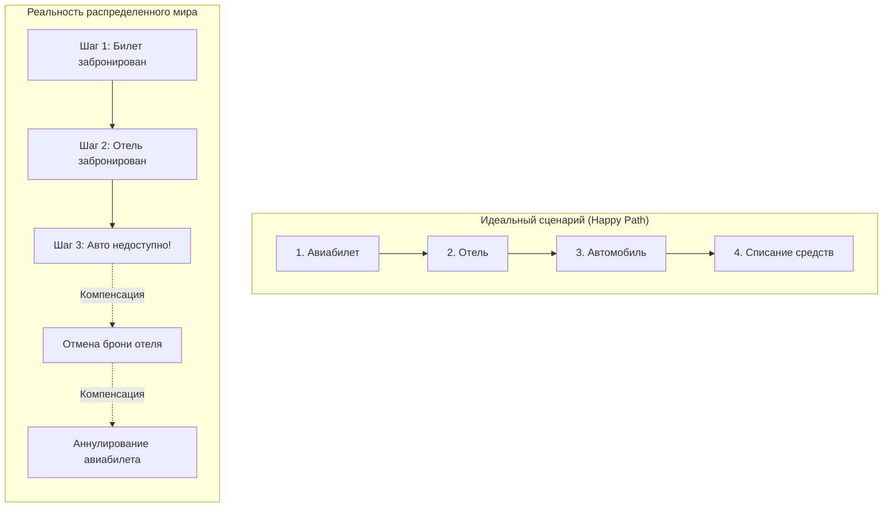
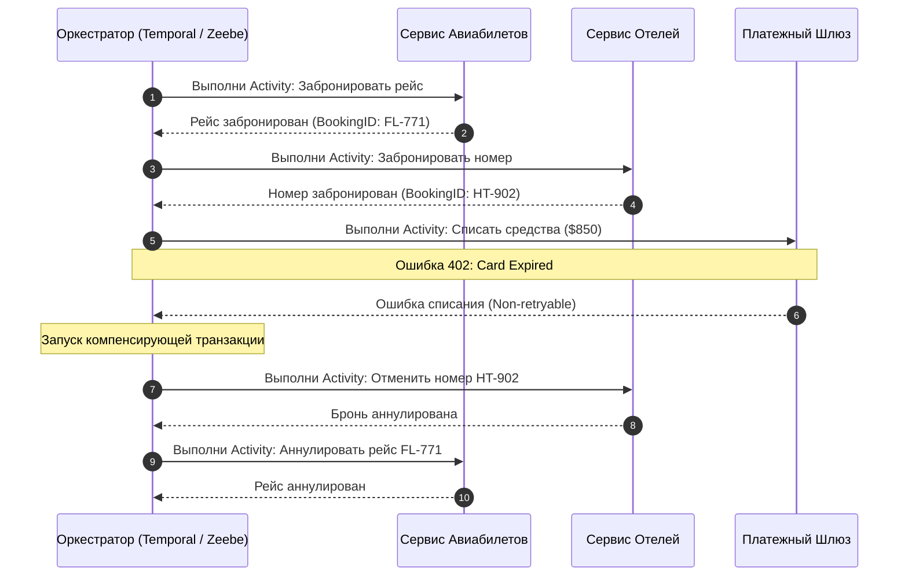
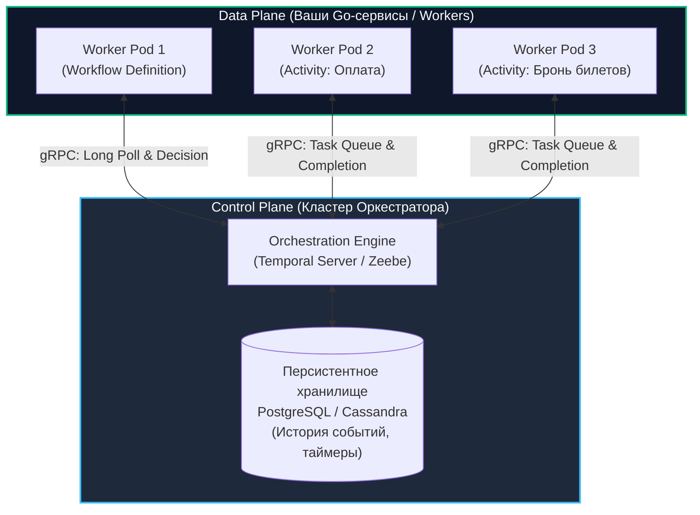
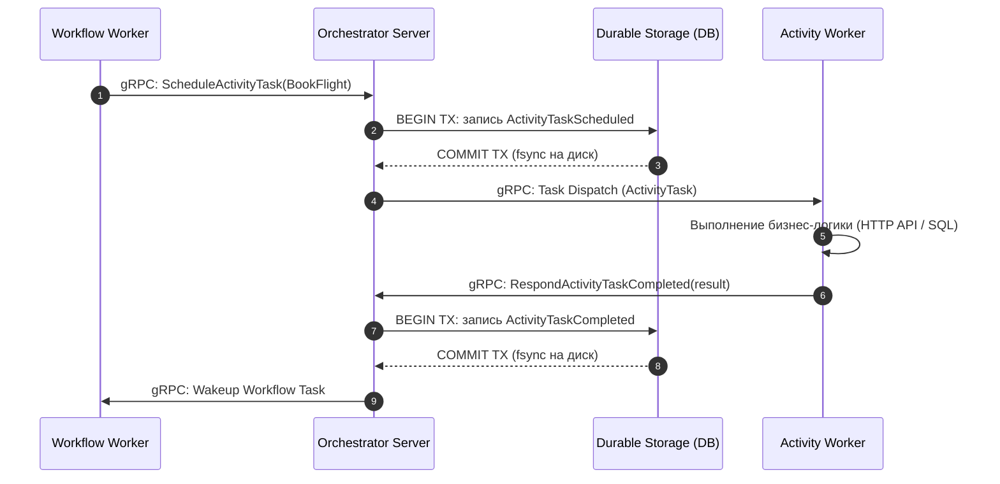

# Что такое Workflow Orchestration?

> *«Программирование распределенных систем — это искусство делать вид, что мир надежен, когда на самом деле ничто не работает дольше пяти минут подряд.»*

В предыдущих разделах мы подробно изучили транспортный уровень асинхронного мира: очереди, обменники и распределенные журналы сообщений (RabbitMQ, Apache Kafka, NATS). Эти инструменты великолепно справляются с передачей сырых байтов, гарантируют доставку событий (Event-Driven Architecture) и позволяют балансировать нагрузку между пулами воркеров (Work Queues).

Однако, как только архитектура выходит за рамки изолированных задач типа «сжать картинку в фоне» и сталкивается со сложными, многоэтапными бизнес-процессами, инженеры неизбежно упираются в фундаментальную проблему распределенных вычислений: **управление состоянием, временем и сбоями в распределенных транзакциях**.

В этом разделе мы переходим от примитивов передачи сообщений к **оркестрации рабочих процессов (Workflow Orchestration)** — инженерной парадигме, превращающей хрупкие распределенные цепочки вызовов в надежные, детерминированные и визуализируемые программы.

---

## Проблема распределенной транзакции

Представьте классический процесс бронирования комплексного путешествия (Trip Booking):
1. Забронировать авиабилет в авиакомпании.
2. Забронировать номер в гостинице.
3. Арендовать автомобиль.
4. Списать оплату с банковской карты клиента.



В монолитном приложении с единой реляционной СУБД подобная задача решается элементарно: открывается транзакция `BEGIN TRANSACTION`, выполняются `INSERT/UPDATE` в таблицы заказов, и при любой ошибке вызывается `ROLLBACK`. Свойства ACID гарантируют, что система либо целиком перейдет в новое валидное состояние, либо вернется к исходному.

В микросервисной архитектуре шаг 1, 2, 3 и 4 принадлежат независимым сервисам, каждый из которых владеет собственной изолированной базой данных и общается по сети. Единого распределенного транзакционного контекста не существует:
- Что делать, если на шаге 4 банк отклонил платеж («недостаточно средств»)?
- Кто и как должен отменить бронирование авиабилета и отеля?
- Что произойдет, если запрос на отмену отеля завершится сетевым таймаутом `504 Gateway Timeout`?
- А если сервис клиента отправил команду отмены, но упал по OOM до получения ответа?

Попытка реализовать этот процесс на «голых» очередях сообщений через хореографию событий (как мы рассматривали в [[8. Saga через брокеры]] и подробно сопоставим в [[4. Оркестрация vs хореография]]) быстро превращает проект в так называемую **«архитектуру пинбола» (Pinball Architecture)**. События хаотично рикошетят между десятками топиков и консьюмеров. Логика перехода между состояниями размазывается по кодовой базе нескольких репозиториев, таймеры и задержки костыляются через `Delayed Queues` или шедулеры в базе данных. Ни один инженер, глядя в исходный код, не способен ответить на базовый вопрос: *«Каков полный жизненный цикл заказа, где он завис и почему клиент не получил возврат?»*.

---

## Что такое Workflow Orchestration?

**Workflow Orchestration (Оркестрация рабочих процессов)** — это архитектурный паттерн и специализированный класс распределенного инфраструктурного ПО, который позволяет выражать многоэтапные бизнес-процессы в виде **единого, централизованного и устойчивого к сбоям потока управления (Workflow Definition)**, написанного на обычном императивном языке программирования (Go, Java, Python).

Вместо того чтобы сервисы хаотично реагировали на события друг друга вслепую, в системе появляется **Оркестратор (Orchestrator)** — дирижер, обладающий полной картиной происходящего.



Оркестратор точно знает:
- На каком именно шаге находится процесс прямо сейчас.
- Какие данные были получены на предыдущих этапах.
- Сколько раз попытка выполнения конкретного шага завершилась неудачей.
- Какие компенсирующие действия необходимо предпринять, если дальнейшее движение вперед невозможно.

---

## Главная суперсила: Durable Execution (Надежное выполнение)

Ключевая концепция, лежащая в основе передовых современных оркестраторов (в первую очередь, Temporal) — это **Durable Execution (Надежное непрерывное выполнение)**.

Что происходит в обычной Go-программе, если сервер перезагрузился, упал сетевой интерфейс или контейнер был уничтожен OOM-киллером ядром Linux? Стек вызовов горутины, значения локальных переменных в куче и регистры процессора исчезают безвозвратно. При перезапуске сервис вынужден начинать все с чистого листа, пытаясь через тяжелые запросы в БД понять, на чем оборвалась работа.

Платформы Durable Execution создают поразительную иллюзию: **ваша Go-функция выполняется вечно и неуязвима к любым инфраструктурным катаклизмам**.

Вы можете написать прямо в коде Go: `time.Sleep(30 * 24 * time.Hour)` (через специализированный `workflow.Sleep(ctx, 30 * 24 * time.Hour)`):
```go
// Заснуть на 30 дней в ожидании продления подписки
err := workflow.Sleep(ctx, 30*24*time.Hour)
```
Сервер с вашим приложением может быть уничтожен через минуту после этого вызова. Kubernetes-кластер за этот месяц может мигрировать в другой дата-центр. Серверы могут обновляться и перезагружаться десятки раз. Но ровно через 30 суток оркестратор запустит воркер, поднимет ваш процесс и продолжит выполнение функции **ровно со следующей строчки кода**, восстановив контекст, аргументы и локальные переменные.

> [!info] Под капотом: Event Sourcing и Replay
> Как достигается эта «магия» бессмертных функций без дорогостоящего создания полных снапшотов оперативной памяти (RAM Core Dumps)?
> 
> Фундаментом служит архитектурный паттерн **Event Sourcing (Событийно-ориентированное состояние)**:
> 1. Оркестратор никогда не сериализует память процесса целиком. Вместо этого он протоколирует во внешнее персистентное хранилище (PostgreSQL, Cassandra, MySQL) **каждое дискретное событие**, происходящее в жизни процесса: планирование таймера, получение входного сигнала, запуск внешнего действия, успешный результат или сбой.
> 2. Если контейнер с Go-воркером внезапно погибает, оркестратор замечает потерю heartbeat-сигнала и направляет задачу другому свободному воркеру.
> 3. Новый воркер берет оригинальный код функции Workflow и запускает его с самого начала. Но всякий раз, когда код доходит до точки вызова внешнего шага или таймера, SDK оркестратора перехватывает вызов, заглядывает в переданную историю событий (**Replay**) и подставляет готовый результат из базы данных!
> 4. Функция молниеносно «проматывается» (Replay) по уже пройденному пути и в точке падения бесшовно переходит в режим живого исполнения.

---

## Основные компоненты оркестратора

Архитектура системы оркестрации строго разделена на две независимые плоскости (Planes):

1. **Сервер оркестрации (Control Plane):** Высоконадежный кластерный сервис. Он управляет очередями задач (Task Queues), хранит историю событий (Event History), обеспечивает консенсус, следит за таймерами и дедлайнами. Сервер оркестратора **никогда не выполняет бизнес-код пользователя** — он оперирует лишь метаданными и идентификаторами задач.
2. **Воркеры (Data Plane):** Ваши обычные сервисы на Go, запускаемые в Kubernetes, Nomad или на виртуальных машинах. Они подключаются к серверу оркестратора через постоянные двунаправленные gRPC-соединения (long-polling), забирают поступившие задачи, выполняют прикладную логику и рапортуют о статусе.



---

## Разделение логики: Workflow и Activity

Чтобы концепция Durable Execution работала безупречно, в коде оркестратора вводится строгое архитектурное разделение обязанностей на два уровня:

### 1. Workflow (Оркестратор)
Это управляющая функция-дирижер. Ее единственная задача — задавать алгоритм и последовательность действий:
- В ней описываются бизнес-разветвления (`if/else`, `switch`, циклы `for`).
- В ней запускаются таймеры (ожидание в часах, сутках, месяцах).
- В ней перехватываются внешние асинхронные события (Signals).
- **Железное правило:** Код Workflow обязан быть **абсолютно детерминированным** и идемпотентным. Ему категорически запрещено выполнять сетевые запросы, читать файлы с диска или делать выборки из базы данных.

### 2. Activity (Действие)
Это кирпичик полезной прикладной нагрузки — «рабочие руки» оркестратора.
- Поход по REST/gRPC в платежный шлюз.
- Выполнение SQL-запроса в PostgreSQL.
- Генерация PDF-документа или отправка SMS через внешний сервис.
- **Механика:** Activity выполняется в конкурентном пуле воркеров, может падать с сетевыми ошибками, таймаутить и бесконечно повторяться по настроенной политике повторов (`RetryPolicy`). Оркестратор берет на себя все заботы о повторах: пока Activity не завершится успехом (или фатальной ошибкой), результат не попадет в журнал событий, а Workflow будет терпеливо ждать.

```go
// Пример разделения логики в стиле Temporal на Go
package workflow

import (
	"time"
	"go.temporal.io/sdk/temporal"
	"go.temporal.io/sdk/workflow"
)

// BookingWorkflow — детерминированный дирижер процесса
func BookingWorkflow(ctx workflow.Context, orderID string) error {
	ao := workflow.ActivityOptions{
		StartToCloseTimeout: 10 * time.Second,
		RetryPolicy: &temporal.RetryPolicy{
			InitialInterval:    time.Second,
			BackoffCoefficient: 2.0,
			MaximumAttempts:    5,
		},
	}
	ctx = workflow.WithActivityOptions(ctx, ao)

	// 1. Шаг: Бронь авиабилета
	var flightBookingID string
	err := workflow.ExecuteActivity(ctx, BookFlightActivity, orderID).Get(ctx, &flightBookingID)
	if err != nil {
		return err
	}

	// 2. Шаг: Оплата заказа
	var paymentID string
	err = workflow.ExecuteActivity(ctx, ChargePaymentActivity, orderID, 850).Get(ctx, &paymentID)
	if err != nil {
		// Запуск компенсации в отдельном контексте
		cctx, _ := workflow.NewDisconnectedContext(ctx)
		_ = workflow.ExecuteActivity(cctx, CancelFlightActivity, flightBookingID).Get(cctx, nil)
		return err
	}

	return nil
}
```

---

## Mechanical Sympathy: Накладные расходы

Закон сохранения сложности в инженерии непреклонен: за невероятную надежность и иллюзию бессмертия приходится платить вычислительными ресурсами и сетевыми задержками (Latency).

Когда Workflow вызывает простую функцию Activity, под капотом разворачивается тяжелая машинерия:



На один-единственный вызов внешней функции Activity оркестратор инициирует:
1. Не менее **четырех сетевых сетевых переходов (Round-trips)** по gRPC между воркерами и сервером.
2. Не менее **двух распределенных транзакций** с записью на диск (`fsync`) в персистентной базе данных сервера (`ActivityTaskScheduled` и `ActivityTaskCompleted`).
3. Сериализацию и десериализацию аргументов и результатов через Protobuf/JSON.

> [!important] Область применимости оркестраторов
> Из-за дисковых задержек на фиксацию истории событий и накладных расходов на gRPC, оркестраторы процессов имеют время отклика порядка десятков миллисекунд (10–50 мс на шаг).
> 
> **Оркестраторы НЕ предназначены для:**
> - High-Frequency Trading (HFT) и биржевых стаканов.
> - Аудио/видео стриминга в реальном времени.
> - Высоконагруженного кэширования или проксирования сетевых пакетов.
> 
> **Их стихия** — транзакционные бизнес-процессы: оформление заказов, онбординг клиентов, биллинг, provisioning виртуальной инфраструктуры в облаках, согласование документов и длительные ETL-пайплайны.

---

## Подводные камни и вопросы с собеседований

> [!warning] Ловушка / Gotcha: Детерминизм в Go
> Самая распространенная и коварная ошибка инженера при переходе на оркестраторы — нарушение правила **абсолютного детерминизма** внутри кода Workflow.
> 
> Поскольку при любом падении или вытеснении воркера оркестратор выполняет **Replay** (воспроизведение) истории событий с нулевой секунды, код при тех же входных параметрах обязан принимать в точности те же решения и идти по тем же веткам `if/else`, что и в первый раз. Несовпадение истории приводит к панической ошибке: **Non-Deterministic Error**, которая намертво блокирует выполнение процесса.
> 
> **Внутри кода Workflow КАТЕГОРИЧЕСКИ ЗАПРЕЩЕНО:**
> 1. Вызывать системное время через `time.Now()` (время должно быть детерминированным из истории: используйте `workflow.Now(ctx)`).
> 2. Засыпать через стандартный `time.Sleep(...)` (используйте `workflow.Sleep(ctx, ...)`).
> 3. Генерировать случайные числа и UUID через `rand.Int()` или `crypto/rand` (используйте детерминированные генераторы из SDK оркестратора).
> 4. Запускать стандартные горутины через ключевое слово `go func()` (планировщик оркестратора теряет контроль над стеком; применяйте `workflow.Go(ctx, ...)`).
> 5. Итерироваться по стандартным мапам Go (`range map`) для принятия решений! Начиная с ранних версий Go порядок обхода мапы намеренно рандомизируется рантаймом при каждом прогоне. Разный порядок обхода приведет к разной последовательности вызова Activity и моментальному сбою детерминизма.
> 6. Изменять порядок вызова Activity или структуру условий в уже развернутом в проде коде без механизма версионирования (`workflow.GetVersion(...)`).

> [!tip] Собеседование
> **Вопрос:** Мы разрабатываем сервис формирования сложной финансовой аналитики. Генерация одного отчета занимает 10 часов интенсивных вычислений. Как вы спроектируете отказоустойчивую архитектуру процесса?
> 
> **Ответ:** 
> Попытка построить такое решение на чистых очередях (RabbitMQ / Kafka) сопряжена с колоссальными рисками:
> 1. Брокеры сообщений рассчитаны на быстрый Ack. Удержание соединения открытым на 10 часов приведет к падению соединений по TCP Keepalive, срабатыванию потребительских таймаутов (`consumer_timeout` в RabbitMQ) и повторной доставке одной и той же тяжелой задачи на соседние серверы.
> 2. При падении воркера на 9-м часу брокер переотправит сообщение, и мы потеряем 9 часов работы.
> 
> **Оптимальное решение:** Workflow Orchestration (например, Temporal).
> Процесс делится на Workflow и набор гранулярных Activity (например, выгрузка данных по часам, агрегация, построение таблиц, рендеринг PDF). 
> - Оркестратор замораживает состояние Workflow и не потребляет ресурсы CPU в ожидании шагов.
> - Для тяжелых задач настраивается `Heartbeat`: Activity периодически рапортует серверу о прогрессе. Если воркер погибает на 9-м часе, оркестратор видит потерю heartbeat, запускает retry согласно `RetryPolicy` на другом физическом узле, причем процесс может продолжить вычисления с последнего зафиксированного чекпоинта, не повторяя успешные шаги 1–8 часов.

---

## Итог

1. **Workflow Orchestration** превращает хаотичное межсервисное взаимодействие в наглядный, строго структурированный и прозрачный бизнес-процесс.
2. **Durable Execution** стирает грань между кратковременными вызовами функций и долгоживущими распределенными состояниями, защищая код от перезагрузок серверов, сетевых сбоев и перезапусков инфраструктуры.
3. Механизм **Event Sourcing и Replay** позволяет воспроизводить состояние горутины из журнала событий, не требуя создания тяжелых снапшотов оперативной памяти.
4. Жесткое разделение на **детерминированные Workflow** и **побочные Activity** гарантирует предсказуемость оркестрации при обработке повторов и компенсирующих транзакций (Saga).
5. За надежность приходится платить дисковым I/O и сетевыми задержками gRPC, поэтому оркестраторы применяются там, где критична целостность данных и бизнес-логики, а не ультранизкие задержки.

В следующей лекции мы заглянем под капот безоговорочного лидера современной оркестрации в экосистеме Go: [[2. Temporal. Архитектура и концепции]].