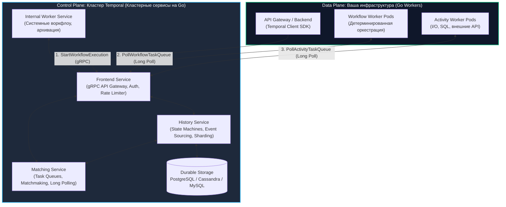
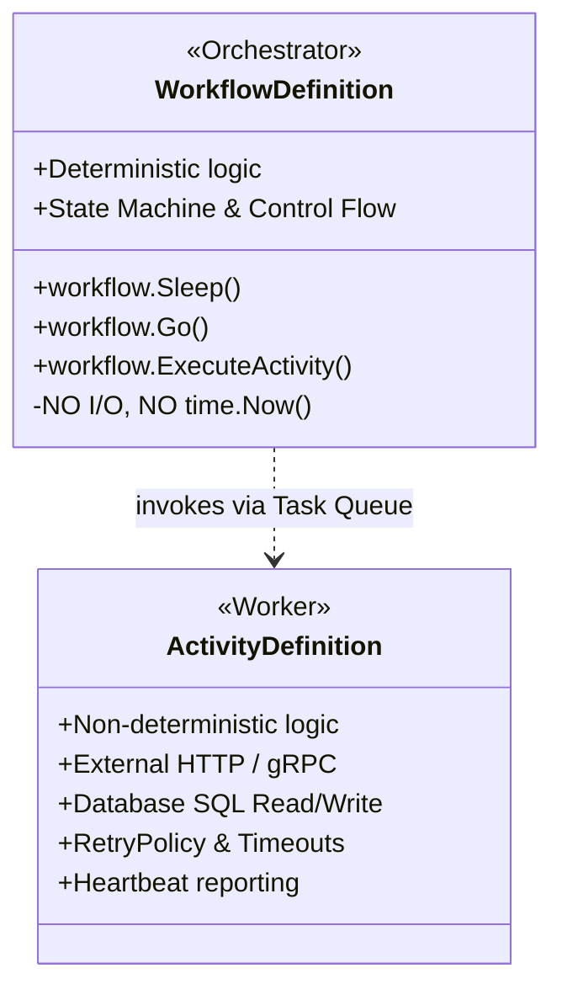
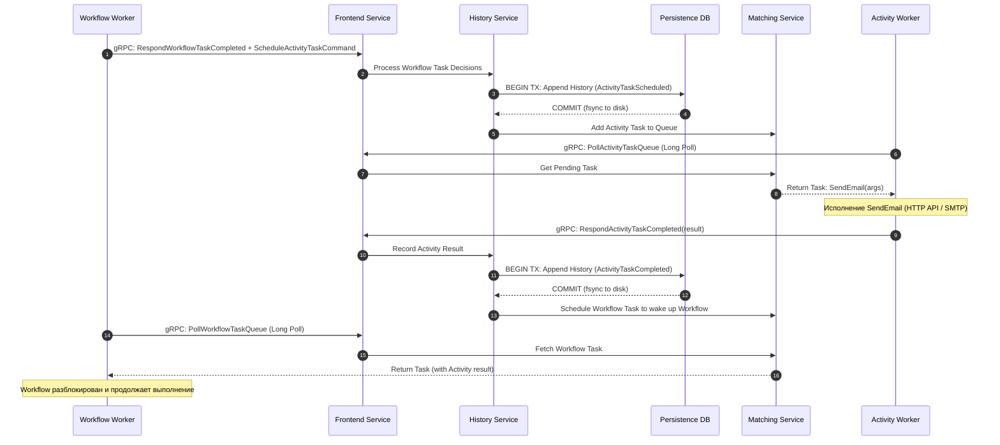

# Temporal: Архитектура и концепции

> *«Архитектура программной системы должна делать две вещи: решать поставленную бизнес-задачу сегодня и гарантировать, что завтра система не рассыплется на куски, когда упадет половина серверов.»*

В предыдущей статье [[1. Что такое workflow orchestration]] мы сформулировали фундаментальный вызов распределенных транзакций и познакомились с концепцией **Durable Execution** — иллюзией непрерывного выполнения кода, которая не разрушается даже при аппаратных сбоях.

Теперь мы переходим к детальному изучению **Temporal** — индустриального стандарта оркестрации современных распределенных систем, созданного авторами Cadence (Максимом Фатеевым и Самаром Аббасом) в недрах Uber и развивающегося как мощная open-source платформа на языке Go.

Чтобы писать высокопроизводительный, надежный код на Temporal и не совершать фатальных архитектурных ошибок, инженер обязан понимать механику работы платформы: где исполняются инструкции, как взаимодействуют узлы кластера и почему рантайм гарантирует сохранность состояния при падении дата-центров.

---

## Разделение Control Plane и Data Plane

Самое частое и опасное заблуждение инженеров, впервые открывающих документацию: *«Сервер Temporal исполняет скомпилированный Go-код наших бизнес-процессов»*.

**Это категорически не так.** В архитектуре Temporal проведена строгая демаркационная линия между плоскостью управления (**Control Plane**) и плоскостью данных (**Data Plane**).



---

### 1. Temporal Cluster (Control Plane)

Это серверный кластер, который вы разворачиваете в Kubernetes (через Helm/Operator) или арендуете как управляемый сервис (Temporal Cloud). Кластер **ничего не знает о вашей бизнес-логике**: он не запускает ваши бинарные файлы, не парсит структуры предметной области и не имеет доступа к вашим базам данных.

Его задачи — надежный учет состояния конечных автоматов, синхронизация таймеров и распределение задач через очереди. Кластер состоит из четырех микросервисов:

1. **Frontend Service:** Публичный шлюз. Принимает все входящие gRPC-запросы от клиентов и воркеров. Отвечает за TLS-терминацию, аутентификацию (mTLS/JWT), валидацию неймспейсов (Namespaces), распределенный Rate Limiting и маршрутизацию запросов к внутренним сервисам.
2. **History Service:** «Мозг» и транзакционное ядро Temporal. Он управляет состоянием каждого запущенного Workflow через распределенный конечный автомат (State Machine). Каждое действие Workflow шардируется по хэшу от `WorkflowID` (по умолчанию от 512 до нескольких тысяч шардов) и атомарно записывается в персистентную СУБД (PostgreSQL, Cassandra, MySQL) в виде журнала событий (Event History).
3. **Matching Service:** Высокопроизводительный распределенный диспетчер очередей задач (**Task Queues**). Он сводит воедино задачи, ожидающие исполнения (поступившие от History Service), со свободными воркерами, ожидающими работу по открытым каналам Long Polling.
4. **Worker Service:** Вспомогательный внутренний сервис для служебных нужд самого кластера (репликация данных между регионами, архивация старой истории в S3/GCS, очистка удаленных неймспейсов).

---

### 2. Workers (Data Plane)

Это **ваши собственные Go-приложения**. Вы компилируете их стандартным `go build`, упаковываете в Docker-образы и масштабируете горизонтально с помощью HPA в Kubernetes.

Воркер не слушает входящие сетевые порты (ему не нужен открытый Ingress). При старте он инициализирует `temporal.Client`, подключается к Frontend Service по gRPC и открывает долгоживущее соединение, заявляя:  
*«Я воркер неймспейса 'billing', слушаю Task Queue 'orders-v1' и зарегистрировал у себя Workflow 'ProcessOrder' и Activity 'ChargeCreditCard'. Жду задач!»*.

> [!info] Под капотом: gRPC и Long Polling
> В брокерах сообщений классической школы (таких как RabbitMQ) часто используется модель **Push**, при которой брокер сам проталкивает сообщения подключенным консьюмерам. Это требует тщательной настройки `prefetch_count`, иначе медленный консьюмер может захлебнуться лавиной задач.
> 
> Temporal использует модель **Pull через gRPC Long Polling**:
> Go-воркер отправляет gRPC-запрос `PollWorkflowTaskQueue` (или `PollActivityTaskQueue`). Если в очереди `Matching Service` пусто, запрос не завершается с ошибкой и не крутит CPU в холостом цикле: соединение удерживается сервером в «подвешенном» состоянии до 60 секунд. Как только задача появляется, Matching Service мгновенно отправляет ее воркеру в рамках открытого стрима. Это обеспечивает нулевую задержку реакции при отсутствии холостой нагрузки на сеть.

---

## Фундаментальные абстракции: Workflow и Activity

Чтобы движок Event Sourcing мог надежно воспроизводить состояние при сбоях, код строго разделяется на две категории ответственности.



---

### 1. Workflow (Оркестратор)

Workflow — это детерминированная функция-дирижер. Она задает логику и правила перехода между фазами бизнес-процесса: циклы, ветвления `if/else`, реакцию на таймеры и внешние сигналы.

**Главное правило: Код Workflow обязан быть на 100% детерминированным.**  
Если передать в функцию Workflow те же аргументы и скормить ей тот же журнал событий из истории, она обязана выполнить ровно ту же последовательность шагов и остановиться в той же точке.

Из-за этого в теле Workflow **СТРОГО ЗАПРЕЩЕНО**:
- Выполнять любой сетевой I/O (обращаться по HTTP, вызывать сторонние микросервисы, слать SQL-запросы).
- Читать файлы с локального диска или опрашивать переменные окружения, способные измениться во времени.
- Использовать системное время через `time.Now()` (при воспроизведении истории время будет разным!).
- Генерировать псевдослучайные числа (`rand` / `crypto/rand`).
- Использовать стандартные горутины `go func()` (планировщик Go недетерминирован и переключает контексты в непредсказуемом порядке).
- Итерироваться по структуре `map` с помощью цикла `range` (в Go порядок обхода ключей в мапе намеренно рандомизируется при каждом запуске программы!).

> [!tip] Собеседование
> **Вопрос:** Если в коде Workflow запрещено использовать `go func()`, `time.Sleep()` и `time.Now()`, как организовать конкурентное выполнение задач, паузы на месяц или замер интервалов?
> 
> **Ответ:** Temporal Go SDK предоставляет детерминированные рантайм-примитивы:
> - Вместо стандартного `time.Sleep` вызывается `workflow.Sleep(ctx, duration)`.
> - Вместо системного `time.Now()` вызывается `workflow.Now(ctx)`.
> - Вместо нативных горутин используется `workflow.Go(ctx, func)` (или сигнатура с контекстом `func(ctx workflow.Context)`).
> 
> Под капотом эти методы не блокируют потоки ОС и не запускают неуправляемые горутины. SDK переводит выполнение на собственную кооперативную подсистему сопрограмм (корутин), перехватывает команды, регистрирует их в журнале событий и отдает управление движку.

---

### 2. Activity (Рабочая лошадка)

Activity — это место для всей реальной, «грязной» работы. Внутри функции Activity разрешено абсолютно всё, что нужно для взаимодействия с физическим миром: сетевые вызовы к внешним сервисам, SQL-транзакции, чтение S3, парсинг файлов, генерация криптографических ключей.

- Activity выполняется в пуле воркеров и может завершаться сетевыми сбоями или падениями процесса.
- Temporal автоматически повторяет выполнение упавшей Activity в соответствии с настроенной политикой `RetryPolicy`.
- Результат работы (или финальная неисправимая ошибка) фиксируется в History Service и возвращается в вызывающий Workflow как результат выполнения функции.

---

## Анатомия вызова (Mechanical Sympathy)

Что происходит на уровне сети, сокетов и базы данных, когда воркер исполняет одну строку кода:  
`workflow.ExecuteActivity(ctx, SendEmail, args)`?



Детальный разбор шагов:
1. **Workflow Worker:** Вызов `workflow.ExecuteActivity` не делает прямой вызов по сети к сервису email. Вместо этого воркер приостанавливает корутину Workflow и формирует команду `ScheduleActivityTaskCommand`.
2. **gRPC:** Команда отправляется на Frontend Service в теле ответа `RespondWorkflowTaskCompleted`.
3. **History Service & DB:** Сервер открывает транзакцию в БД, записывает событие `ActivityTaskScheduled` и фиксирует ее на диске (`fsync`).
4. **Matching Service:** Задача помещается в память Matching Service в указанную очередь (`Task Queue`).
5. **Activity Worker:** Свободный Activity-воркер забирает задачу по висящему gRPC-запросу `PollActivityTaskQueue`.
6. **Выполнение:** Воркер вызывает функцию `SendEmail`, совершая реальный сетевой вызов к внешнему почтовому сервису.
7. **Завершение:** Воркер отправляет результат в кластер через gRPC-вызов `RespondActivityTaskCompleted`.
8. **Фиксация результата:** History Service открывает транзакцию и записывает в журнал событие `ActivityTaskCompleted`.
9. **Пробуждение:** Matching Service создает новую задачу `WorkflowTask` для воркера оркестрации, который просыпается и передает распакованный результат выполнения в переменную Go.

*Один вызов Activity генерирует минимум 4 сетевых gRPC-раундтрипа и 2 дисковые транзакции в СУБД кластера.* Именно поэтому проектировать системы на Temporal нужно крупными блоками бизнес-логики, избегая превращения мелких примитивных выражений в отдельные Activity.

---

## Идиоматичный пример на Go

Рассмотрим production-ready структуру сервиса онбординга пользователя с настройкой таймаутов, повторов и клиентской инициализацией:

```go
package onboarding

import (
	"context"
	"fmt"
	"net/http"
	"time"

	"go.temporal.io/sdk/activity"
	"go.temporal.io/sdk/client"
	"go.temporal.io/sdk/temporal"
	"go.temporal.io/sdk/worker"
	"go.temporal.io/sdk/workflow"
)

// ---------------------------------------------------------------------
// 1. Описание Activity (Недетерминированный рабочий код)
// ---------------------------------------------------------------------

type EmailService struct {
	client *http.Client
}

func (s *EmailService) SendWelcomeEmailActivity(ctx context.Context, email string) error {
	logger := activity.GetLogger(ctx)
	logger.Info("Отправка приветственного письма", "email", email)

	// Реальный поход во внешний мир (SMTP / REST API)
	if email == "" {
		// Non-retryable ошибка: ретраить бесполезно, email невалиден
		return temporal.NewNonRetryableApplicationError(
			"email cannot be empty", 
			"INVALID_ARGUMENT", 
			nil,
		)
	}

	// Имитация успешной отправки
	return nil
}

// ---------------------------------------------------------------------
// 2. Описание Workflow (Детерминированный дирижер процесса)
// ---------------------------------------------------------------------

const TaskQueueName = "onboarding-tasks"

func UserOnboardingWorkflow(ctx workflow.Context, email string) (string, error) {
	logger := workflow.GetLogger(ctx)
	logger.Info("Старт онбординга пользователя", "email", email)

	// Настройка политик вызова Activity
	ao := workflow.ActivityOptions{
		// Время на выполнение одной попытки
		StartToCloseTimeout: 10 * time.Second,
		// Общее время со всеми повторами
		ScheduleToCloseTimeout: 1 * time.Minute,
		RetryPolicy: &temporal.RetryPolicy{
			InitialInterval:    1 * time.Second,
			BackoffCoefficient: 2.0,
			MaximumInterval:    15 * time.Second,
			MaximumAttempts:    5,
		},
	}
	ctx = workflow.WithActivityOptions(ctx, ao)

	// 1. Вызов Activity отправки письма
	var emailService *EmailService
	err := workflow.ExecuteActivity(ctx, emailService.SendWelcomeEmailActivity, email).Get(ctx, nil)
	if err != nil {
		logger.Error("Не удалось отправить приветственный email", "error", err)
		return "", fmt.Errorf("failed to send welcome email: %w", err)
	}

	// 2. Долгоживущая пауза на 3 дня (Durable Sleep)
	// Сервер освобождает ресурсы, таймер тикает в кластере Temporal
	logger.Info("Ожидание 3 дней перед отправкой обучающих материалов")
	err = workflow.Sleep(ctx, 3*24*time.Hour)
	if err != nil {
		return "", err
	}

	logger.Info("Онбординг успешно завершен")
	return "Onboarding Completed", nil
}

// ---------------------------------------------------------------------
// 3. Запуск Worker-процесса
// ---------------------------------------------------------------------

func RunWorker() error {
	// Подключение к Frontend-сервису кластера Temporal
	c, err := client.Dial(client.Options{
		HostPort:  "localhost:7233",
		Namespace: "default",
	})
	if err != nil {
		return fmt.Errorf("unable to create Temporal client: %w", err)
	}
	defer c.Close()

	// Инициализация воркера для заданной Task Queue
	w := worker.New(c, TaskQueueName, worker.Options{
		MaxConcurrentActivityExecutionSize: 100,
		MaxConcurrentWorkflowTaskExecutionSize: 100,
	})

	emailSvc := &EmailService{client: http.DefaultClient}

	// Регистрация доступных для исполнения сущностей
	w.RegisterWorkflow(UserOnboardingWorkflow)
	w.RegisterActivity(emailSvc.SendWelcomeEmailActivity)

	// Блокирующий запуск прослушивания очереди
	return w.Run(worker.InterruptCh())
}
```

---

## Подводные камни и вопросы с собеседований

> [!warning] Ловушка / Gotcha: Глобальные переменные
> Никогда не храните состояние экземпляра Workflow в глобальных переменных уровня пакета (`var currentOrderID string`) или в полях структур-воркеров.
> 
> Один Go-воркер одновременно обслуживает тысячи параллельно исполняющихся инстансов Workflow в конкурентных корутинах. Если один инстанс запишет промежуточные данные в разделяемую память процесса, он мгновенно перезапишет данные чужих заказов. Это порождает трудноуловимые состояния гонки (Data Races) и разрушает детерминизм.
> 
> **Все состояние процесса должно храниться исключительно внутри локальных переменных функции Workflow или передаваться явно через структуры данных.**

> [!tip] Собеседование
> **Вопрос:** Что произойдет, если база данных Temporal Server (PostgreSQL/Cassandra) переполнится или станет временно недоступна во время выполнения активного бизнес-процесса?
> 
> **Ответ:**
> 1. Воркеры не упадут в панику. Их попытки отправить `RespondWorkflowTaskCompleted` или `RespondActivityTaskCompleted` будут завершаться ошибками gRPC `UNAVAILABLE`, после чего SDK воркеров начнет автоматически повторять попытки отправки с экспоненциальным backoff.
> 2. Сами исполняемые Activity продолжат работать (если они уже были получены воркером), а результаты будут безопасно удерживаться воркером в памяти до восстановления связи с кластером.
> 3. Как только СУБД кластера вернется в строй, все накопленные подтверждения будут зафиксированы в History Service без потери данных и без дублирования бизнес-логики.

---

## Итог

1. **Temporal** реализует четкое разделение между **Control Plane** (кластер сервисов на Go, управляющий историей и очередями) и **Data Plane** (ваши воркеры с бизнес-кодом).
2. Кластер Temporal состоит из четырех сервисов: **Frontend** (gRPC API), **History** (конечные автоматы и персистентность), **Matching** (диспетчеризация очередей) и **Worker** (фоновые задачи кластера).
3. Общение между воркерами и кластером построено на **gRPC Long Polling**, обеспечивающем естественное противодавление (Backpressure) и нулевые задержки без избыточной нагрузки на сеть.
4. **Workflow** — детерминированный алгоритмический дирижер, где запрещен сетевой/дисковый ввод-вывод.
5. **Activity** — изолированный исполнитель прикладной логики, защищенный механизмами автоматических повторов (`RetryPolicy`) и таймаутов.
6. Надежность требует вычислительных ресурсов: каждый шаг оркестрации фиксируется транзакцией на диске хранилища истории, поэтому Temporal применяется для оркестрации ответственных бизнес-транзакций.

В следующей лекции мы разберем главный механизм «бессмертия» функций — как именно рантайм выполняет воспроизведение истории и обеспечивает детерминизм: [[3. Durable execution]].