# Durable Execution: Механика бессмертных функций

> *«Сложнейшие проблемы компьютерных наук решаются не усложнением железа, а сменой угла зрения: вместо того чтобы пытаться сохранить состояние, сохраните историю его возникновения.»*

В предыдущей лекции [[2. Temporal. Архитектура и концепции]] мы разделили архитектуру оркестратора на Control Plane (высоконадежный кластер хранения состояния) и Data Plane (наши прикладные Go-воркеры). Мы усвоили фундаментальное правило: функция Workflow является детерминированным дирижером и не имеет права совершать прямой сетевой ввод-вывод, делегируя все внешние взаимодействия исполнителям — Activity.

Теперь настало время заглянуть в самое сердце современной оркестрации — концепцию **Durable Execution (Надежное непрерывное выполнение)**. Как именно рантайм Temporal добивается того, что обычная функция на языке Go может выполняться месяцами, переживать десятки аварийных перезагрузок серверов, смену версий Kubernetes-подов и миграции между дата-центрами, не теряя ни единого байта своих локальных переменных?

---

## Event Sourcing вместо дампов оперативной памяти

Первая интуитивная мысль, которая приходит в голову инженеру при мысли о «заморозке» и «пробуждении» работающей программы: *«Давайте снимем дамп оперативной памяти (RAM Memory Dump / Core Snapshot), запишем его на диск, а при необходимости восстановим регистры процессора и стек вызовов»*. Ровно так работает режим гибернации в операционных системах ноутбуков (ACPI S4).

Однако в мире распределенных микросервисных систем этот подход оказывается тупиковым по четырем причинам:
1. **Колоссальный объем:** Если у вас активно 1 000 000 параллельных процессов заказов, хранить на диске миллион дампов памяти даже по 10–50 МБ каждый — непозволительная трата дискового пространства и пропускной способности сети.
2. **Аппаратная несовместимость:** Дамп памяти жестко привязан к архитектуре CPU (x86-64 vs ARM64) и конкретному лейауту указателей в виртуальной памяти. Вы не сможете сделать snapshot на Intel Xeon и восстановить его на AWS Graviton.
3. **Хрупкость рантайма Go:** Дамп зависит от точной версии компилятора Go, метаданных сборщика мусора (GC) и структуры внутренних структур рантайма (`m`, `g`, `p`).
4. **Невозможность эволюции кода:** Вы не можете обновить бизнес-логику в бинарнике, если восстанавливаете скомпилированный машинный код из старого слепка памяти.

Поэтому Temporal использует элегантный архитектурный паттерн — **Event Sourcing (Событийно-ориентированное состояние)**.

```mermaid
flowchart LR
    subgraph BadApproach["Наивный подход: Memory Snapshots"]
        direction TB
        RAM["RAM State (10-50 MB)<br>Стек, куча, регистры CPU"]
        Dump[("Дисковый дамп<br>Привязан к x86/ARM и версии Go")]
        RAM -->|"Тяжелый snapshot"| Dump
    end

    subgraph EventSourcingApproach["Подход Temporal: Event Sourcing"]
        direction TB
        Events[("Журнал событий (Event History)<br>Атомарный лог: 2-5 KB JSON/Protobuf")]
        ReplayEngine["Replay Engine (Go SDK)<br>Воспроизведение детерминированного кода"]
        Events -->|"Воспроизведение (Replay)"| ReplayEngine
    end

    classDef bad fill:#1e1e2e,stroke:#f43f5e,stroke-width:2px;
    classDef good fill:#0f172a,stroke:#10b981,stroke-width:2px;
    class BadApproach bad;
    class EventSourcingApproach good;
```



Вместо сохранения тяжелого *состояния* памяти кластер Temporal протоколирует компактный, неизменяемый, упорядоченный список **дискретных действий (Event History)**, которые привели к текущему состоянию. База данных кластера (PostgreSQL, Cassandra, MySQL) выступает в роли масштабируемого append-only журнала.

---

## Механика Replay (Воспроизведение)

Что происходит, когда Go-воркер падает посреди выполнения длинного Workflow (например, из-за вытеснения пода нодой Kubernetes или физического сбоя питания)?

1. Кластер Temporal фиксирует обрыв gRPC-стрима и потерю heartbeat.
2. Задача по продолжению процесса помещается в соответствующую `Task Queue`.
3. Любой свободный Go-воркер (на любом другом сервере или процессоре другой архитектуры) забирает эту задачу. Вместе с задачей кластер передает ему **всю накопленную историю событий (Event History)** данного Workflow.
4. Новый воркер запускает вашу функцию Workflow **с самой первой строчки кода**, начиная процесс, называемый **Replay (Воспроизведение)**.

```mermaid
sequenceDiagram
    autonumber
    participant W as Go Worker
    participant H as Temporal History Service
    participant DB as Persistence DB

    Note over W,H: Этап 1: Нормальное выполнение до сбоя
    H->>W: WorkflowTask(Start)
    W->>W: Строка 1: workflow.ExecuteActivity(ChargeCard)
    W->>H: Command: ScheduleActivityTask(ChargeCard)
    H->>DB: Запись события: ActivityTaskScheduled
    Note over W: ... Сервер убит аварийно (SIGKILL / OOM) ...

    Note over W,H: Этап 2: Восстановление на новом сервере (Replay)
    H->>W: WorkflowTask(Replay) + Full Event History
    W->>W: Строка 1: workflow.ExecuteActivity(ChargeCard)
    Note over W: Проверка Event History:<br>Шаг уже выполнен! Результат: "OK"<br>Сетевой вызов блокируется!
    W->>W: Строка 2: workflow.ExecuteActivity(SendReceipt)
    Note over W: Шага нет в истории. Replay завершен!<br>Переход в режим живого исполнения.
    W->>H: Command: ScheduleActivityTask(SendReceipt)
```



### Алгоритмический цикл Replay внутри Go SDK:
1. Выполняется очередная инструкция функции Workflow.
2. Всякий раз, когда строка кода вызывает рантайм-команду (`workflow.ExecuteActivity(...)`, `workflow.Sleep(ctx, ...)`, `workflow.GetSignalChannel(...)`), SDK временно приостанавливает выполнение и **заглядывает в переданную Историю (History)**.
3. Если в Истории зафиксировано, что эта Activity уже была запущена и завершена в прошлом, SDK **не делает реального сетевого вызова**. Он берет сериализованный результат (Protobuf/JSON) прямо из истории, десериализует его в целевую Go-переменную и мгновенно переходит к следующей строчке кода.
4. Этот процесс повторяется со скоростью миллионов операций в секунду, пока SDK не дойдет до первой команды, которой еще нет в Истории событий.
5. В этот момент SDK понимает: *«Replay завершен, мы догнали настоящее время»*. Теперь команда упаковывается в gRPC-запрос, отправляется на сервер Temporal, а воркер блокирует выполнение до получения реального результата.

---

## Mechanical Sympathy: Планировщик внутри Планировщика

Как эта схема работает на уровне оперативной памяти и горутин Go? Мы знаем, что Workflow может заснуть на месяц вызовом `workflow.Sleep(ctx, 30*24*time.Hour)`. Если бы под капотом создавалась обычная горутина с `time.Sleep(...)`, воркер держал бы в памяти стек вызовов и дескрипторы на протяжении 30 дней. При сотнях тысяч заказов память сервера мгновенно исчерпалась бы.

> [!info] Под капотом: Coroutine Scheduler
> Temporal Go SDK содержит **собственный кооперативный планировщик корутин**, работающий поверх рантайма Go.
> 
> Когда ваш код вызывает `workflow.Sleep(ctx, ...)` или `workflow.ExecuteActivity(...)`, под капотом срабатывает вызов:
> ```go
> coroutine.Yield()
> ```
> Ваша управляющая функция передает управление внутреннему планировщику SDK. Планировщик собирает список сгенерированных за квант времени команд, упаковывает их в Protobuf-пакет и отправляет в кластер Temporal по gRPC.
> 
> И вот здесь кроется ключевая деталь: **горутина воркера после этого завершается и уничтожается!** В памяти вашего сервера не остается «висящих» горутин или заблокированных стеков. Все ресурсы процессора и RAM немедленно освобождаются.
> 
> Когда через 30 дней кластер будит процесс, на воркере выделяется *абсолютно свежая* горутина, которая за миллисекунды «проматывает» Replay до точки сна и продолжает выполнение.

---

## Жизненно важное правило: Строгий Детерминизм

Концепция Replay держится на одном жестком математическом допущении: **код Workflow обязан быть на 100% детерминированным**.

Если при первоначальном запуске функция при определенных входных данных пошла по ветке `if A { ... }`, то при повторном запуске (Replay) через час, день или год она обязана пойти ровно по той же ветке `if A { ... }`.

### Что произойдет, если нарушить правило?

Рассмотрим хрестоматийный пример ошибки начинающего разработчика:

```go
func MyWorkflow(ctx workflow.Context) error {
    // КАТАСТРОФА: Использование системного времени ОС
    if time.Now().Hour() < 12 {
        workflow.ExecuteActivity(ctx, MorningTask)
    } else {
        workflow.ExecuteActivity(ctx, EveningTask)
    }
    return nil
}
```

Разберем сценарий аварии шаг за шагом:
1. **Первоначальный запуск (11:00 утра):** Системное время меньше 12. Код идет по первой ветке `if`. Планируется Activity `MorningTask`. В кластер Temporal отправляется команда, и в истории фиксируется запись: `ActivityScheduled: MorningTask`. Воркер успешно выполняет задачу, но перед следующим шагом падает по OOM.
2. **Восстановление через Replay (13:00 дня):** На новом воркере поднимается задача. Код Workflow начинает исполняться с нулевой строки. Наступает проверка `time.Now().Hour() < 12`. Системное время на часах машины равно `13`. Условие ложно!
3. Код идет во вторую ветку и вызывает `EveningTask`.
4. **Крах системы:** SDK берет команду `ScheduleActivity(EveningTask)` и сравнивает ее с журналом истории. А в истории на этом шаге записано: `ActivityScheduled: MorningTask`!
5. Последовательность событий нарушена. SDK не имеет права угадывать намерения программиста и немедленно бросает паническую ошибку: **`NonDeterministicWorkflowError`**. Workflow блокируется намертво, и спасти его можно только ручным вмешательством или откатом кода.

> [!warning] Ловушка / Gotcha: Скрытые источники недетерминизма
> Помимо очевидных вызовов `time.Now()` или `rand.Int()`, в языке Go есть коварные встроенные конструкции, ломающие детерминизм:
> 1. **Итерация по `map`:** В рантайме Go обход хэш-таблицы:
>    ```go
>    for k, v := range myMap { ... }
>    ```
>    намеренно рандомизируется (hash seed меняется при каждом перезапуске процесса для защиты от HashDoS-атак). Если внутри такого цикла вы вызываете Activity, то при Replay порядок их вызова будет случайным, что приведет к мгновенному `NonDeterministicWorkflowError`! Для детерминированного обхода ключи мапы необходимо предварительно собрать в слайс и отсортировать.
> 2. **Нативные горутины:** Запуск фоновых операций через `go func()` внутри Workflow запрещен. Планировщик рантайма Go переключает потоки асинхронно и недетерминированно. Для параллельных веток оркестрации всегда используйте кооперативный примитив `workflow.Go(ctx, func)`.
> 3. **Глобальные переменные:** Не мутируйте переменные уровня пакета.

---

## Проблема эволюции кода: Versioning

Если код обязан с абсолютной точностью воспроизводить свое прошлое поведение, перед архитекторами встает фундаментальный практический вопрос: **Как обновлять код бизнес-процессов в production?**

Представьте процесс выдачи банковской ипотеки («Mortgage Workflow»), рассчитанный на 20 лет. Через полгода после запуска в продакшене выходит новое распоряжение регулятора: перед перечислением денег необходимо вызвать дополнительную Activity проверки кредитной истории — `CheckCreditHistory`.

Если мы просто добавим строку:
```go
workflow.ExecuteActivity(ctx, CheckCreditHistory)
```
и выкатим новый бинарник воркера, произойдет катастрофа: десятки тысяч уже запущенных ипотечных процессов при очередном Replay не найдут этот шаг в своей исторической записи и упадут с фатальной ошибкой `NonDeterministicWorkflowError`.

### Решение: workflow.GetVersion

Для безопасного изменения логики «на лету» Temporal Go SDK предоставляет мощный API версионирования. Инженер явно маркирует участки кода, указывая идентификатор изменения и допустимые версии:

```go
func MortgageWorkflow(ctx workflow.Context, applicantID string) error {
    // 1. Старые шаги, общие для всех версий
    var approved bool
    err := workflow.ExecuteActivity(ctx, ValidateApplication, applicantID).Get(ctx, &approved)
    if err != nil || !approved {
        return err
    }

    // 2. Точка эволюции логики
    // "CreditCheckFeature" — уникальный идентификатор изменения (ChangeID).
    // workflow.DefaultVersion (-1) — версия для уже идущих старых процессов.
    // 1 — целевая новая версия.
    v := workflow.GetVersion(ctx, "CreditCheckFeature", workflow.DefaultVersion, 1)

    if v == 1 {
        // Выполняется ТОЛЬКО для новых процессов, стартовавших после релиза,
        // а также записывается в историю событий как MarkerRecorded.
        err = workflow.ExecuteActivity(ctx, CheckCreditHistory, applicantID).Get(ctx, nil)
        if err != nil {
            return err
        }
    }

    // 3. Финальный шаг (общий для всех)
    return workflow.ExecuteActivity(ctx, IssueMoney, applicantID).Get(ctx, nil)
}
```

Как это работает под капотом:
- Для старого Workflow при Replay метод `workflow.GetVersion` видит, что в истории нет маркера изменения `CreditCheckFeature`. Он возвращает `workflow.DefaultVersion`, и ветка `if v == 1` безопасно пропускается.
- Для нового Workflow при первом прогоне метод возвращает версию `1` и записывает в историю маркер `MarkerRecorded(CreditCheckFeature, 1)`. При последующих Replay этот маркер считывается из истории, гарантируя детерминированное выполнение ветки `if v == 1`.

> [!tip] Собеседование
> **Вопрос:** Если мы постоянно используем `workflow.GetVersion`, через пару лет активной разработки кодовая база замусорится десятками устаревших веток `if v == 1`. Как правильно проводить рефакторинг и очистку (Sanitization) такого кода?
> 
> **Ответ:** 
> Процедура очистки версионированного кода проводится строго в три этапа:
> 1. **Анализ открытых процессов:** С помощью CLI Temporal или Prometheus-метрик инженеры проверяют количество незавершенных (Open) Workflow, запущенных до внедрения фичи:
>    ```bash
>    temporal workflow list --query 'WorkflowType="MortgageWorkflow" AND ExecutionStatus="Running"'
>    ```
> 2. **Удаление старой ветки:** Когда метрики подтверждают, что в системе **не осталось ни одного активного инстанса**, созданного на `DefaultVersion`, вызов `workflow.GetVersion` заменяется на константу:
>    ```go
>    // Защита от случайных древних Replay
>    _ = workflow.GetVersion(ctx, "CreditCheckFeature", 1, 1)
>    // Прямой вызов без if
>    workflow.ExecuteActivity(ctx, CheckCreditHistory, applicantID)
>    ```
> 3. **Финальная зачистка:** Спустя еще один релизный цикл, когда все процессы гарантированно содержат маркер версии `1`, строка с `GetVersion` удаляется окончательно.

---

## Итог

1. **Durable Execution** достигается за счет синергии **Event Sourcing** (запись действий в кластере) и детерминированного **Replay** (воспроизведение логики на воркерах).
2. Temporal не сохраняет тяжелые дампы оперативной памяти (RAM Core Snapshots), что обеспечивает независимость от архитектуры процессоров (x86/ARM) и экономит сетевой трафик.
3. Собственный **кооперативный планировщик корутин** освобождает память серверов во время пауз и ожиданий (`coroutine.Yield()`), позволяя обслуживать миллионы открытых процессов на скромном оборудовании.
4. Любое недетерминированное поведение (системные часы, случайные числа, горутины, обход мап) неизбежно ведет к критическому сбою **`NonDeterministicWorkflowError`**.
5. Эволюция бизнес-правил в долгоживущих процессах реализуется через **API версионирования** (`workflow.GetVersion`), обеспечивающий бесшовное сосуществование старых и новых версий кода в рамках одной очереди задач.

Понимая мощь и строгие правила надежного выполнения, мы подошли к главному архитектурному выбору: когда распределенную систему стоит строить на тяжелом оркестраторе, а когда достаточно легкой хореографии событий? Ответ — в следующей лекции: [[4. Оркестрация vs хореография]].