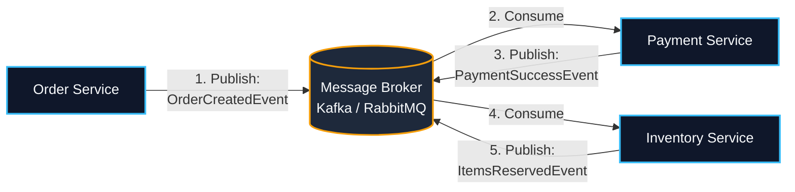
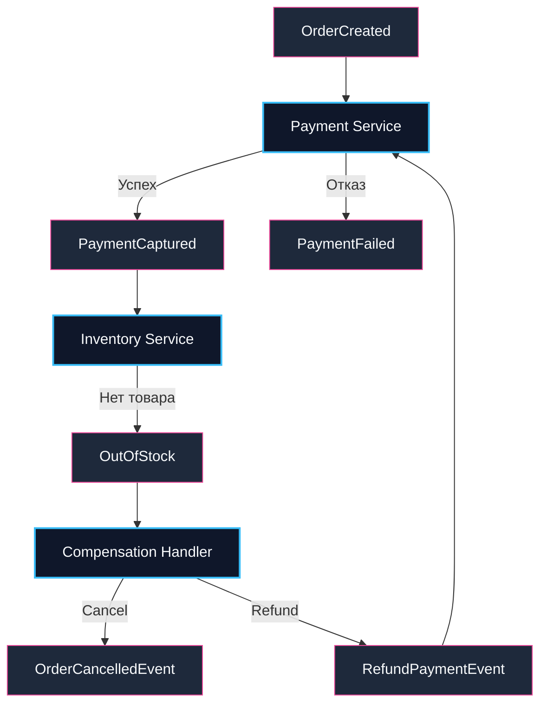
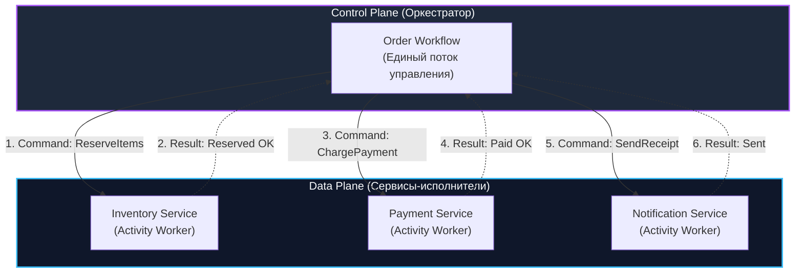
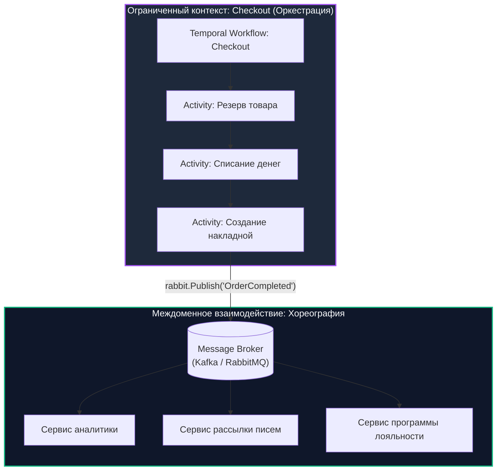

# Оркестрация vs хореография

> *«В архитектуре программного обеспечения нет правильных и неправильных решений — есть только набор компромиссов, за каждый из которых приходится платить либо сложностью кода, либо ресурсами железа.»*

В предыдущих статьях мы погрузились во внутреннее устройство платформы Temporal ([[2. Temporal. Архитектура и концепции]]) и разобрали механику Event Sourcing и Replay, лежащую в основе бессмертных функций ([[3. Durable execution]]). Однако выбор между внедрением специализированного оркестратора и использованием привычных очередей сообщений — это один из самых фундаментальных архитектурных перекрестков в карьере любого бэкенд-инженера.

В распределенных системах для реализации многоэтапных бизнес-транзакций (в частности, паттерна Saga) исторически сформировались две противоположные парадигмы: **Хореография (Choreography)** и **Оркестрация (Orchestration)**.

В этой главе мы сопоставим оба подхода на уровне исходного кода, системных вызовов ядра ОС и сетевых пакетов, выясним, почему «чистая хореография» часто заводит команды в тупик, и выведем формулу надежной гибридной архитектуры.

---

## 1. Хореография (Choreography): Танец без дирижера

Хореография — это классическая **событийно-ориентированная архитектура (Event-Driven Architecture, EDA)**. В этой парадигме нет никакого центрального органа управления или координирующего сервиса. Каждый микросервис существует абсолютно автономно: он слушает события (Domain Events) из распределенного брокера (Apache Kafka, RabbitMQ, NATS), выполняет локальную транзакцию в собственной базе данных и выбрасывает в брокер новое событие о завершении своего шага.

> Фокус хореографии — **События (Events)**. Сервис А никогда не приказывает Сервису Б, что тот обязан сделать. Он лишь констатирует свершившийся в прошлом факт: *«Я создал заказ (OrderCreated)!»*. А остальные участники системы сами решают, интересно ли им это событие.



---

### Преимущества (Pros)

1. **Слабая связность (Decoupling):** Сервис заказов (`Order Service`) не имеет ни малейшего понятия о том, кто слушает его события. Если маркетинг решает внедрить сервис кэшбэка или систему персонализированных пуш-уведомлений, разработчики просто подписывают новый сервис на событие `OrderCreatedEvent`. В кодовой базе сервиса заказов не меняется ни единой строчки.
2. **Отсутствие единой точки отказа (No Single Point of Failure):** В системе нет выделенного «главного сервера», падение которого парализует все бизнес-процессы компании. Если сервис резервирования склада временно отключен на регламентные работы, брокер сохранит сообщения в очереди, а платежи продолжат приниматься в штатном режиме.
3. **Производительность (Mechanical Sympathy):** Взаимодействие предельно легковесно. Отправка события в RabbitMQ или Kafka — это сериализация структуры в Protobuf/JSON и обычный системный вызов `write()` в TCP-сокет (`Go -> TCP -> Erlang Process -> TCP -> Go`). Горутина отправителя освобождается практически мгновенно, сетевые задержки составляют доли миллисекунды.

---

### Недостатки: Pinball Architecture (Архитектура Пинбола)

Когда бизнес-сценарий прост и насчитывает 2–3 линейных шага, хореография выглядит идеальным решением. Но как только реальный бизнес начинает обрастать разветвленными условиями (ветвления `if/else`, циклы `for`, таймауты, проверка мошенничества, кредитный скоринг), архитектура стремительно вырождается в так называемый **«автомат для пинбола» (Pinball Architecture)**.

События хаотично отскакивают от сервиса к сервису, логика бизнес-процесса оказывается фрагментированной и похороненной в недрах десятков независимых микросервисных репозиториев.



> [!warning] Ловушка / Gotcha: Потеря контроля
> Представьте типичный звонок возмущенного клиента в службу поддержки: *«Я оплатил бронирование три часа назад, деньги с карты списались, но подтверждение на почту так и не пришло. Где мой заказ?»*.
> 
> В чисто хореографической архитектуре **ни один сервис в компании не знает ответа**. 
> - Сервис заказов считает, что событие ушло.
> - Сервис оплаты считает, что транзакция одобрена.
> - Сервис склада застрял на переиндексации остатков.
> - Сервис нотификаций упал с ошибкой парсинга шаблона.
> 
> Чтобы восстановить цепочку событий, инженерам приходится вручную грепать логи ElasticSearch или разворачивать тяжелую и дорогостоящую инфраструктуру распределенного трейсинга OpenTelemetry (о которой мы говорили в [[10. Distributed tracing в async системах]]). 
> 
> Ситуация становится катастрофической, когда на 6-м шаге цепочки происходит ошибка, требующая компенсирующей транзакции: приходится публиковать каскад `CompensationEvent`, которые должны быть корректно обработаны пятью предыдущими сервисами с учетом возможных сетевых дублей, ретраев и рассинхронизации часов.

---

## 2. Оркестрация (Orchestration): Симфония с дирижером

Оркестрация решает проблему хаоса и фрагментации за счет введения явного центра координации — **Оркестратора (Orchestrator)**. 

В коде появляется единый алгоритмический дирижер (например, Workflow в Temporal или Zeebe), в котором от первой до последней строчки описан весь жизненный цикл транзакции.

> Фокус оркестрации — **Команды (Commands)**. Оркестратор не ждет случайных сигналов из космоса. Он берет управление на себя и отдает прямые императивные приказы исполнителям (Activity): *«Сервис склада, зарезервируй товар X. Сервис платежей, спиши 500 рублей с карты Y»*.



---

### Преимущества (Pros)

1. **Единый источник истины (Single Source of Truth):** Весь бизнес-процесс сконцентрирован в одном файле исходного кода. Вы открываете Workflow в IDE и мгновенно видите весь сценарий: порядок шагов, ветвления `if/else`, условия тайм-аутов и логику компенсирующих действий при авариях.
2. **Абсолютная наблюдаемость состояния:** Состояние каждого процесса всегда прозрачно. Любой оператор или API-клиент может выполнить запрос к кластеру оркестратора по `WorkflowID` и получить исчерпывающий ответ: *«Заказ #4912 находится на шаге 3 (списание средств), платежный шлюз ответил 500 Internal Server Error, запущен 4-й автоматический повтор с интервалом 8 секунд»*.
3. **Встроенная надежность и детерминизм (Durable Execution):** Если сервис склада выйдет из строя на два часа, оркестратор не упадет и не потеряет контекст. Он заморозит выполнение процесса и будет аккуратно ретраить вызов по экспоненциальной кривой, гарантируя выполнение шага при восстановлении сервиса.

---

### Недостатки (Cons)

1. **Связанность контрактов (Coupling):** Оркестратор обязан знать о существующих сервисах, их адресах (Task Queues) и форматах входных/выходных аргументов вызовов Activity.
2. **Антипаттерн «Божественный сервис» (God Service):** При отсутствии архитектурной дисциплины команды начинают переносить сложную предметную логику (например, расчет сложных скидок или налогов) прямо внутрь кода Workflow. Это превращает оркестратор в монолитного монстра.  
   *Золотое правило: Workflow управляет только маршрутизацией, порядком вызовов и обработкой ошибок; вся доменная бизнес-математика должна оставаться внутри сервисов-Activity.*
3. **Накладные расходы на инфраструктуру (Infrastructure Tax):** Оркестрация требует существенных дисковых и сетевых ресурсов под капотом.

> [!info] Под капотом: Налог на инфраструктуру
> Сопоставим реальный стек операций при отправке сообщения в классический брокер и вызове Activity в оркестраторе:
> 
> **В брокере RabbitMQ:**  
> `Go -> TCP -> Erlang Process -> TCP -> Go`  
> Состояние хранится в оперативной памяти или асинхронном дисковом WAL брокера. Задержка минимальна.
> 
> **В оркестраторе Temporal:**  
> `Go -> gRPC -> Frontend -> gRPC -> History Service -> DB Write (Postgres/Cassandra) -> gRPC -> Matching Service -> gRPC -> Go`  
> На каждый шаг оркестратора кластер выполняет транзакционную запись в СУБД с фиксацией на диске (`fsync` для `ActivityTaskScheduled` и `ActivityTaskStarted`). Это увеличивает время отклика шага (Latency) до 10–30 миллисекунд и снижает пиковый Throughput по сравнению с сырыми очередями брокеров.

---

## 3. Сводное сравнение (Cheat Sheet)

| Характеристика | Хореография (RabbitMQ / Kafka) | Оркестрация (Temporal / Zeebe) |
|---|:---:|:---:|
| **Основная концепция** | **События (Events)** — реакция на изменения | **Команды (Commands)** — директивное управление |
| **Связанность сервисов** | **Слабая (Loose)** — сервисы изолированы | **Умеренная** — оркестратор координирует интерфейсы |
| **Управление процессом** | Децентрализованное (размазано по консьюмерам) | Централизованное (собрано в Workflow) |
| **Отслеживание состояния** | Крайне сложно (требует распределенного трейсинга) | Из коробки (инспектирование истории любого процесса) |
| **Обработка сбоев (Saga)** | Ручные компенсации через брокеры, высок риск гонок | Встроенные автоматические Retry и цепочки компенсаций |
| **Задержки (Latency)** | Микросекунды / единицы миллисекунд | Десятки миллисекунд (накладные расходы на СУБД истории) |
| **Где применять?** | Телеметрия, нотификации, стриминг данных, Big Data | Заказы, биллинг, provisioning инфраструктуры, KYC |

---

## Прагматичный подход: Гибридная архитектура

В зрелых инженерных организациях опытные архитекторы никогда не делают догматичный выбор «или только хореография, или только оркестрация». Практика показывает, что максимальная надежность и производительность достигаются через **гибридную архитектуру (Hybrid Architecture)**.



### Формула старшего инженера:
1. **Используйте Оркестрацию ВНУТРИ ограниченного контекста (Bounded Context):**  
   Там, где крутятся реальные деньги, критические данные и жесткие бизнес-инварианты (процесс `Checkout`, бронирование билетов, выдача кредитов, отгрузка со склада), процессом обязан управлять оркестратор. Здесь критически важен единый источник правды, прозрачные таймауты и контролируемые транзакции отката.
2. **Используйте Хореографию ДЛЯ МЕЖДОМЕННОГО оповещения (Cross-Domain Events):**  
   Когда оркестратор успешно завершил критическую фазу `Checkout`, его финальная Activity вызывает: `rabbit.Publish("OrderCompleted")`.
   ```go
   rabbit.Publish("OrderCompleted", payload)
   ```
   После этого событие отправляется в свободный полет по Kafka или RabbitMQ. Второстепенные сервисы (отправка поздравлений клиенту, расчет аналитических когорт, пересчет бонусов) асинхронно реагируют на это событие, не замедляя критический путь оформления заказа.

> [!tip] Собеседование
> **Вопрос:** На System Design интервью вас просят спроектировать платформу заказа такси (Ride Hailing). Как вы распределите зоны ответственности между хореографией и оркестрацией?
> 
> **Ответ:**
> 1. **Хореография через брокеры сообщений (Kafka / NATS):** Применяется для высоконагруженных потоков телеметрии: стриминг координат водителей (GPS-пинг каждые 2 секунды от 100 000 машин). Здесь критичны минимальный Latency и высокий Throughput; потеря единичного пинга геолокации не критична для системы.
> 2. **Оркестрация через движок процессов (Temporal):** Применяется для жизненного цикла конкретной поездки (Trip Workflow): поиск водителя $\to$ ожидание подачи $\to$ посадка $\to$ движение по маршруту $\to$ списание средств $\to$ чаевые. Здесь важен каждый шаг: если водитель отменил заказ, оркестратор обязан корректно запустить поиск следующего водителя, разморозить залог на карте пассажира и отправить водителю штрафные баллы.

---

## Итог

1. **Хореография** обеспечивает максимальную масштабируемость и низкую связанность сервисов, но сложна в отладке и превращается в неуправляемый хаос (Pinball Architecture) при реализации сложных цепочек компенсаций.
2. **Оркестрация** гарантирует детерминизм, централизованный контроль и наглядность бизнес-процессов, но требует выделенной инфраструктуры и накладывает накладные расходы на СУБД истории.
3. Профессиональный архитектурный подход — **гибридный**: использовать оркестрацию внутри транзакционных бизнес-процессов, а результаты их завершения публиковать в брокеры для хореографического потребления остальной системой.

Одним из главных достоинств оркестратора является прозрачное управление отказами. Что делать, если на середине пути сторонний шлюз вернул ошибку `500` или клиент передумал? Как правильно проектировать компенсирующие транзакции? Об этом мы поговорим в следующей статье: [[5. Retry и compensation logic]].