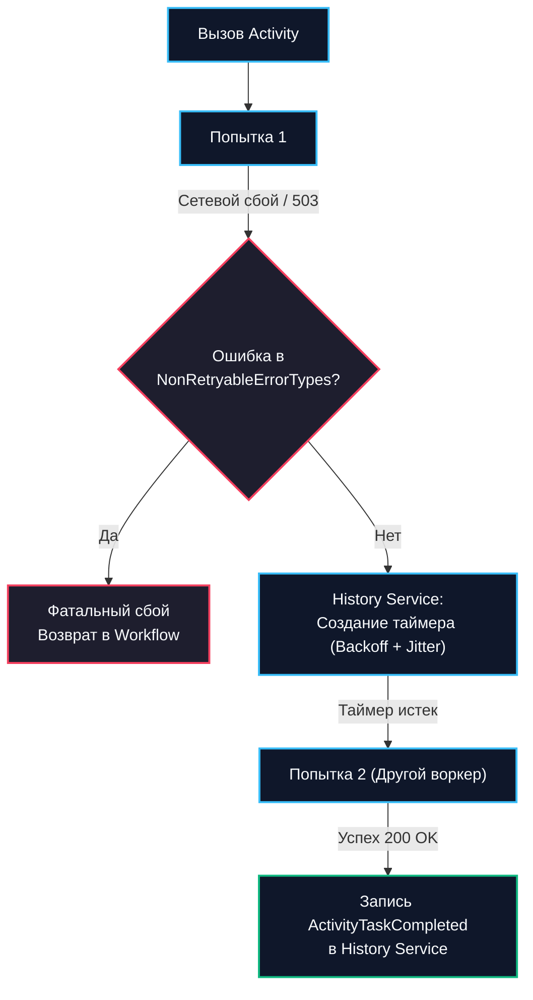
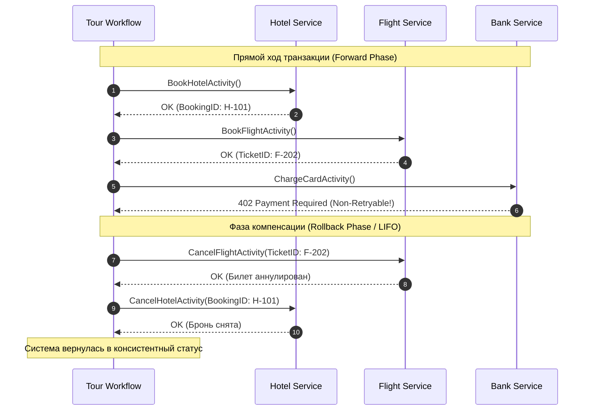
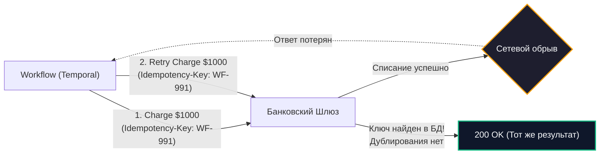

# Retry и compensation logic

> *«В распределенной системе всё, что может пойти не так, обязательно пойдет не так, причем именно в тот момент, когда половина шагов транзакции уже успешно зафиксирована.»*

В предыдущей статье [[4. Оркестрация vs хореография]] мы выяснили, что оркестрация предоставляет инженеру исчерпывающий контроль над сложными распределенными бизнес-процессами. Однако этот контроль теряет всякий практический смысл, если система не умеет элегантно и математически строго реагировать на отказы.

В локальном монолитном приложении обработка ошибок тривиальна: при любом сбое вызывается `tx.Rollback()`, реляционная база данных мгновенно снимает блокировки строк, отбрасывает временные структуры в WAL и возвращает состояние к моменту до начала транзакции. 

В микросервисной архитектуре распределенной единой транзакции не существует: у каждого сервиса своя база данных, свои сетевые сокеты и свои сценарии частичной деградации. Сеть между серверами подвержена задержкам, базы данных ловят кратковременные deadlock'и, а внешние партнерские API возвращают статусы вроде `503 Service Unavailable`.

В современных системах оркестрации (в первую очередь, в Temporal) управление распределенными сбоями опирается на два фундаментальных кита:
1. **Автоматические повторы (Retry Logic)** — для парирования временных инфраструктурных сбоев (Transient Errors).
2. **Компенсирующие транзакции (Compensation Logic / Saga)** — для обратного отката при возникновении неустранимых бизнес-ошибок.

---

## 1. Retry Logic (Стратегии повторных попыток)

Философия оркестраторов формулируется парадоксальным, на первый взгляд, принципом: **Activity обязана падать, и это абсолютно нормальная штатная ситуация**. 

Если сторонний сервис недоступен, Activity-воркер не должен судорожно обрабатывать ошибку костылями или ронять родительский Workflow. Воркер просто возвращает ошибку кластеру, а оркестратор берет на себя интеллектуальное планирование повторов.



---

### Настройка RetryPolicy в Go

Политика повторных попыток задается декларативно через структуру `ActivityOptions` в коде Workflow:

```go
package billing

import (
	"time"

	"go.temporal.io/sdk/temporal"
	"go.temporal.io/sdk/workflow"
)

func PaymentWorkflow(ctx workflow.Context, orderID string, amount int64) error {
	// Конфигурация экспоненциального бэкоффа с защитой от штормов
	retryPolicy := &temporal.RetryPolicy{
		InitialInterval:    1 * time.Second,   // Начальная пауза перед первой перепопыткой
		BackoffCoefficient: 2.0,               // Коэффициент роста интервала: 1s -> 2s -> 4s -> 8s...
		MaximumInterval:    60 * time.Second,  // Верхняя граница задержки
		MaximumAttempts:    0,                 // 0 = бесконечные попытки до победного конца
		NonRetryableErrorTypes: []string{
			"InsufficientFundsError",         // Нет смысла повторять, если на счете 0
			"CardExpiredError",               // Срок действия карты истек
			"FraudRejectedError",             // Отклонено антифрод-системой
		},
	}

	ao := workflow.ActivityOptions{
		StartToCloseTimeout: 15 * time.Second, // Таймаут на ОДНУ конкретную попытку
		ScheduleToCloseTimeout: 1 * time.Hour, // Общий лимит времени со всеми ретраями
		RetryPolicy:         retryPolicy,
	}
	ctx = workflow.WithActivityOptions(ctx, ao)

	// Оркестратор будет надежно повторять вызов функции при сбоях сети или 500/503,
	// пока не получит подтверждение успеха или NonRetryableError
	return workflow.ExecuteActivity(ctx, ChargeClientActivity, orderID, amount).Get(ctx, nil)
}
```

---

### Mechanical Sympathy: Как ретраи работают под капотом?

Вспомним, с какими мучениями связана реализация повторов в традиционных брокерах сообщений (как мы разбирали в [[8. Retry patterns в RabbitMQ]]). В RabbitMQ инженерам приходится создавать запутанные топологии: вспомогательные очереди ожидания (Wait Queues), Dead Letter Exchanges (DLX), настраивать TTL сообщений или подключать сторонние плагины на базе базы данных Mnesia. При этом сообщения летают по кругу, пожирая трафик и засоряя очереди.

В Temporal механизм повторов **встроен непосредственно в ядро распределенного конечного автомата (History Service)**:
1. Воркер выполняет Activity, натыкается на сетевой сбой и сообщает серверу по gRPC: *«Activity упала с ошибкой Connection Reset»*.
2. History Service сверяется с заданной `RetryPolicy`.
3. Если требуется повторить попытку через 8 секунд, History Service не держит открытых сетевых сокетов и не спамит сообщениями. Он просто создает **таймер в таблице персистентной СУБД** (Cassandra / PostgreSQL) и переводит задачу в спящее состояние.
4. Go-воркер в этот момент **мгновенно освобождается**. В оперативной памяти приложения не висит никаких ждущих горутин и вызовов `time.Sleep`. Воркер готов обрабатывать другие клиентские запросы.
5. Ровно через 8 секунд внутренний таймер History Service срабатывает, задача помещается в соответствующую Task Queue, и любой свободный воркер забирает ее на повторное исполнение.

> [!warning] Ловушка / Gotcha: NonRetryableErrors и бизнес-логика
> Если внешний платежный провайдер вернул ошибку «Недостаточно средств» (Insufficient Funds), продолжать `Retry` категорически бессмысленно: деньги на балансе клиента не возникнут из ниоткуда через 2 секунды. Это детерминированная ошибка предметной области.
> 
> Если вы забудете объявить такие ошибки неретраябельными, оркестратор добросовестно начнет долбить партнерский API с частотой раз в минуту, сжигая CPU, засоряя аудит банка и вызывая законную блокировку ваших ключей за DDoS!
> 
> В коде Activity используйте строго типизированные ошибки:
> ```go
> if balance < requiredAmount {
>     return temporal.NewNonRetryableApplicationError(
>         "insufficient funds on customer account",
>         "InsufficientFundsError",
>         nil,
>     )
> }
> ```

---

## 2. Compensation Logic (Паттерн Saga)

Что делать, если все разрешенные повторы исчерпаны, или мы получили фатальную `NonRetryableError`, но до этой точки Workflow уже успел успешно выполнить несколько необратимых действий в других микросервисах?

Классический сценарий бронирования отпуска:
1. Забронирован номер в гостинице (Успех: отель заморозил номер).
2. Забронирован авиабилет (Успех: авиакомпания выписала бронь).
3. Списание средств с карты... **Отказ: банк отклонил транзакцию.**

В распределенной системе зависли чужие ресурсы: отель и авиакомпания ждут подтверждения. Если бросить процесс в этом месте, бизнес понесет финансовые и юридические убытки.

Единственный способ вернуть распределенную систему в согласованное состояние — выполнить цепочку обратных действий: **компенсирующих транзакций (Compensating Transactions)**. Этот архитектурный шаблон называется **Saga**.



---

### Идиоматичная Saga в Temporal (Go)

В языке Go нет встроенных синтаксических конструкций для отката распределенных транзакций, но мы можем элегантно реализовать паттерн Saga с помощью замыканий (closures), стека функций обратного вызова и ключевого слова `defer`.

```go
package travel

import (
	"fmt"
	"go.temporal.io/sdk/workflow"
)

type TourRequest struct {
	UserID   string
	HotelID  string
	FlightID string
	Price    int64
}

func TourBookingWorkflow(ctx workflow.Context, req TourRequest) (err error) {
	// Стек компенсирующих функций (LIFO)
	var compensations []func(c workflow.Context) error

	// Defer-блок: гарантированно выполняется при любом выходе из Workflow
	defer func() {
		if err != nil {
			logger := workflow.GetLogger(ctx)
			logger.Warn("Транзакция сорвалась, запускаем компенсацию Saga...", "cause", err)

			// ВАЖНО: Отключаем отмену контекста для компенсаций!
			// Если исходный ctx был отменен по тайм-ауту или сигналом отмены,
			// компенсирующие шаги ОБЯЗАНЫ выполниться до конца!
			disconnectedCtx, _ := workflow.NewDisconnectedContext(ctx)

			// Разматываем стек компенсаций строго в обратном порядке (LIFO)
			for i := len(compensations) - 1; i >= 0; i-- {
				compErr := compensations[i](disconnectedCtx)
				if compErr != nil {
					// Падение компенсации — критический инцидент (Incident Severity 1)
					logger.Error("КРИТИЧЕСКИЙ СБОЙ КОМПЕНСАЦИИ!", "error", compErr)
				}
			}
		}
	}()

	// --- ШАГ 1: Бронирование отеля ---
	var hotelBookingID string
	err = workflow.ExecuteActivity(ctx, BookHotelActivity, req.HotelID).Get(ctx, &hotelBookingID)
	if err != nil {
		return fmt.Errorf("ошибка бронирования отеля: %w", err)
	}
	// Успешно: регистрируем обратную операцию в стеке компенсаций
	compensations = append(compensations, func(c workflow.Context) error {
		return workflow.ExecuteActivity(c, CancelHotelActivity, hotelBookingID).Get(c, nil)
	})

	// --- ШАГ 2: Бронирование авиаперелета ---
	var flightBookingID string
	err = workflow.ExecuteActivity(ctx, BookFlightActivity, req.FlightID).Get(ctx, &flightBookingID)
	if err != nil {
		// Сработает defer: будет вызвана только отмена отеля (CancelHotel)
		return fmt.Errorf("ошибка бронирования рейса: %w", err)
	}
	// Успешно: регистрируем обратную операцию
	compensations = append(compensations, func(c workflow.Context) error {
		return workflow.ExecuteActivity(c, CancelFlightActivity, flightBookingID).Get(c, nil)
	})

	// --- ШАГ 3: Списание средств с карты ---
	var paymentID string
	err = workflow.ExecuteActivity(ctx, ChargeCardActivity, req.UserID, req.Price).Get(ctx, &paymentID)
	if err != nil {
		// Сработает defer: сначала отменится перелет (CancelFlight), затем отель (CancelHotel)
		return fmt.Errorf("ошибка списания средств: %w", err)
	}

	return nil
}
```

> [!info] Под капотом: DisconnectedContext
> Обратите пристальное внимание на вызов `workflow.NewDisconnectedContext(ctx)`.
> 
> Если клиент нажал кнопку «Отменить бронирование» в мобильном приложении или истек общий дедлайн выполнения Workflow (`ScheduleToCloseTimeout`), родительский `ctx` переходит в отмененное состояние (`ctx.Err() != nil`).
> 
> Если попытаться вызвать компенсацию `CancelHotelActivity`, передав туда оригинальный `ctx`, SDK Temporal моментально отклонит запуск Activity с ошибкой `CanceledError`. Процесс завершится, а забронированный отель так и останется висеть в чужой системе!
> 
> Вызов `workflow.NewDisconnectedContext(ctx)` порождает независимый дочерний контекст, который сохраняет все переменные и трассировку, но **сбрасывает флаг отмены**, гарантируя, что фаза компенсации успешно доведет откат до конца.

---

## Фундамент надежности: Идемпотентность

И повторные попытки (Retries), и компенсирующие транзакции таят в себе колоссальную скрытую опасность.

Представьте ситуацию: воркер выполнил функцию `ChargeCardActivity`, банк успешно списал $1000, сформировал квитанцию, но в момент отправки HTTP-ответа на стороне провайдера моргнул сетевой кабель. TCP-соединение разорвалось по таймауту.

Воркер возвращает оркестратору ошибку `DeadlineExceeded`. Temporal, руководствуясь `RetryPolicy`, добросовестно берет ту же самую Activity и отправляет ее на повторное исполнение на другой воркер. **Если внешняя система не защищена от дублей, с карты клиента будут списаны повторные $1000.**

Точно так же компенсация `CancelFlight` может вызываться повторно при сбоях сети во время отката.



**Каждая Activity в распределенном оркестраторе ОБЯЗАНА быть строго идемпотентной.**  
Подробно архитектурные механизмы идемпотентной обработки мы разбирали в статье [[10. Idempotency в message processing]].

В Temporal для формирования идеального ключа идемпотентности (`Idempotency-Key`) используются встроенные детерминированные метаданные:
```go
// Генерация уникального бизнес-ключа в Activity
info := activity.GetInfo(ctx)
idempotencyKey := fmt.Sprintf("%s:%s:%d", 
    info.WorkflowExecution.ID, 
    info.ActivityType.Name, 
    info.Attempt,
)
```
Используя этот ключ в заголовках HTTP-запросов к внешним API или сохраняя его в уникальный индекс таблицы базы данных, вы гарантируете, что ни один ретрай не приведет к дублированию побочных эффектов.

---

## Подводные камни и вопросы с собеседований

> [!tip] Собеседование
> **Вопрос:** Что произойдет в паттерне Saga, если компенсирующая транзакция `CancelHotel` сама падает с неустранимой ошибкой (например, отель закрылся или их API лежит третий день)?
> 
> **Ответ:**
> Эта ситуация называется **«Сбоем компенсации» (Compensation Failure)** — ночным кошмаром распределенных систем.
> 
> 1. В оркестраторах компенсация — это обычная Activity. Для нее настраивается агрессивная политика повторов (например, `MaximumAttempts: 0` — бесконечные попытки с бэкоффом до 1 часа). Оркестратор будет упорно долбить упавший сервис днями и неделями. Рано или поздно сервис поднимется, и компенсация завершится успешно.
> 2. Если же ошибка носит перманентный характер (отель ликвидирован физически), бесконечный ретрай приведет к зависанию Workflow в статусе `Running`. В таких случаях в коде компенсации устанавливают алерт наивысшего приоритета (PagerDuty / Slack) и переводят процесс на ручное разрешение человеком (**Forward Recovery / Manual Intervention**). Менеджер связывается с отелем вручную, после чего оператор посылает в Workflow сигнал завершения через Temporal Web UI.

---

## Итог

1. **Retry Logic** устраняет временные инфраструктурные сбои (сеть, таймауты, `503 Service Unavailable`). В Temporal таймеры повторов работают в ядре кластера и не утилизируют память воркеров.
2. Ошибки бизнес-правил (нет денег, отказ скоринга) должны маркироваться как **`NonRetryableError`**, иначе система уйдет в бесконечный деструктивный цикл повторов.
3. Необратимые сбои на поздних этапах распределенных транзакций требуют применения **паттерна Saga**: отката ранее выполненных шагов в обратном порядке (LIFO) через стек замыканий в блоке `defer`.
4. Компенсирующие транзакции обязаны запускаться в изолированном контексте `workflow.NewDisconnectedContext(ctx)`, защищенном от отмены родительского процесса.
5. И повторы, и компенсации несут смертельный риск дублирования операций, если функции не защищены сквозным механизмом **идемпотентности** с уникальными ключами `Idempotency-Key`.

Мы изучили передовые практики отказоустойчивости на базе Temporal. Но как Temporal соотносится со своим историческим предком — проектом Cadence? В чем разница их протоколов и архитектур? Об этом — в следующей лекции: [[6. Temporal vs Cadence]].