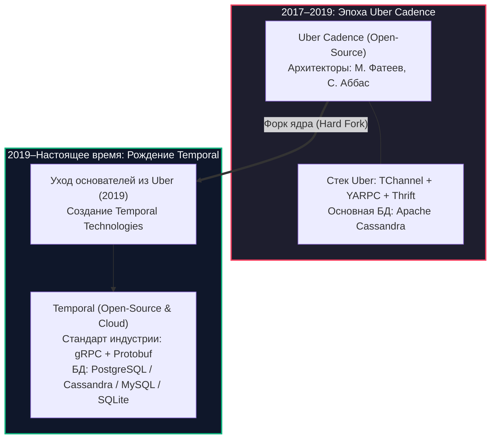
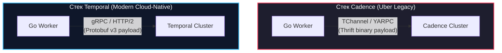

# Temporal vs Cadence

> *«Программное обеспечение не стареет от времени — оно стареет от груза компромиссов, сделанных в угоду устаревшим внутренним стандартам.»*

В предыдущих статьях [[2. Temporal. Архитектура и концепции]] и [[3. Durable execution]] мы детально препарировали внутреннее устройство современного оркестратора Temporal. Однако в корпоративной среде, в технических статьях и на собеседованиях в BigTech (Uber, DoorDash, Coinbase, Stripe) вы гарантированно столкнетесь с другим именем — **Cadence**.

У многих инженеров возникает закономерная путаница: являются ли эти системы прямыми конкурентами? В чем их архитектурное расхождение? Почему существует два почти идентичных по концепциям проекта и что выбирать для нового сервиса на Go?

Чтобы принимать взвешенные инженерные решения, мы обязаны понимать не только синтаксис библиотек, но и историко-технологический контекст эволюции этих систем.

---

## Исторический контекст: Расщепление ядра

История надежных распределенных процессов нового поколения началась в **2017 году в недрах компании Uber**. Главными архитекторами проекта выступили Максим Фатеев (ранее работавший над AWS Simple Workflow Service в Amazon) и Самар Аббас (один из создателей Azure Durable Task Framework в Microsoft).

Uber столкнулся с колоссальным масштабом: миллионы одновременных поездок по всему миру, распределенные цепочки доставки еды (Uber Eats), сложные скоринговые модели и финансовые транзакции выплат водителям. Традиционная микросервисная хореография на очередях сообщений трещала по швам — система превратилась в неуправляемый «пинбол», где невозможно было отследить потерю заказа.

Так родился **Cadence** — система оркестрации процессов на языке Go, основанная на парадигме **Event Sourcing** и детерминированного воспроизведения (**Replay**). Uber выложил проект в open-source, и Cadence моментально стал сенсацией, его взяли на вооружение крупнейшие технологические гиганты.



Однако к 2019 году архитекторы уперлись в непреодолимую стену: Cadence был намертво завязан на внутренний технологический стек Uber, который за пределами компании никто не использовал. Переписать ключевые компоненты внутри репозитория Uber было невозможно из-за сотен тысяч легаси-процессов, уже работающих в компании.

В 2019 году Максим Фатеев и Самар Аббас покинули Uber и основали независимую компанию — **Temporal Technologies**. Они форкнули кодовую базу Cadence и начали бескомпромиссный рефакторинг: безжалостно вырезали проприетарные технологии Uber и заменили их открытыми индустриальными стандартами.

> [!info] Под капотом: Чей сейчас Cadence?
> Cadence по-прежнему существует как открытый репозиторий, поддерживаемый небольшой внутренней командой инженеров Uber для обслуживания существующей инфраструктуры таксопарка. 
> 
> Однако темпы разработки, размер мирового сообщества, глубина документации и экосистема сторонних инструментов Cadence практически остановились в развитии. Вся инженерная мысль, авторы архитектуры и мировое сообщество сосредоточены вокруг Temporal и его облачной платформы (Temporal Cloud).

---

## Фундаментальные архитектурные отличия

Хотя внешне базовые концепции обеих платформ одинаковы (Workflow, Activity, History Service, Matching Service, детерминизм), под капотом между ними лежит технологическая пропасть.

---

### 1. Транспортный уровень (RPC)

Самый глубокий водораздел между системами прошел по протоколам передачи данных.

**В Cadence:**
В наследство от инфраструктуры Uber проекту достался собственный внутренний зоопарк:
- Транспорт: **TChannel** (сетевой протокол мультиплексирования от Uber).
- Маршрутизация: **YARPC** (Yet Another RPC).
- Сериализация: **Apache Thrift**.

Внедрение Cadence в современный стек Kubernetes вызывало у DevOps-инженеров тихий ужас: стандартные балансировщики (Nginx, HAProxy, AWS ALB) и современные Service Mesh (Envoy, Istio, Linkerd) ничего не знают о протоколе TChannel. Приходилось поднимать сложные шлюзы-трансляторы, а отладка трафика через tcpdump превращалась в мучение.

**В Temporal:**
Разработчики Temporal полностью избавились от YARPC и TChannel, переведя ядро на мировые стандарты:
- Транспорт: **gRPC поверх HTTP/2**.
- Сериализация: **Protocol Buffers v3 (Protobuf)**.

* **Mechanical Sympathy:** Переход на gRPC дал Temporal колоссальный скачок эффективности:
  1. Нативное мультиплексирование сотен конкурентных потоков в рамках единого TCP-соединения между Go-воркером и кластером.
  2. Сжатие служебных заголовков по алгоритму HPACK.
  3. Полная, бесшовная интеграция с Envoy, Istio и любыми облачными API Gateway из коробки.



---

### 2. Поддержка баз данных (Persistence Layer)

Оркестратор опирается на базу данных как на источник абсолютной правды для Event Sourcing журнала.

- **Cadence:** Изначально жестко проектировался исключительно под **Apache Cassandra** (NoSQL распределенное хранилище, оптимизированное под интенсивную запись). Поддержка MySQL/PostgreSQL была добавлена позже в виде экспериментальных адаптеров и всегда оставалась «гражданином второго сорта» с низкой производительностью. Эксплуатировать Cassandra ради одного Cadence для большинства компаний средней руки было неподъемной задачей.
- **Temporal:** Слой абстракции хранилища (Persistence Plugin Interface) был полностью переписан с нуля. Сегодня Temporal нативно поддерживает:
  1. **PostgreSQL и MySQL** — первоклассные, глубоко оптимизированные бэкенды для 90% компаний, позволяющие использовать существующие надежные кластеры СУБД.
  2. **Apache Cassandra** — для сверхвысоконагруженных инсталляций (миллионы событий в секунду).
  3. **SQLite** — фантастическое преимущество для локальной разработки и тестирования! Go-разработчик может поднять полнофункциональный кластер Temporal прямо в памяти процесса во время выполнения `go test`, не поднимая Docker-контейнеры.

---

### 3. Безопасность и mTLS

- **Cadence:** Вопросы защиты межсервисного трафика решались по остаточному принципу. Организовать строгую двухстороннюю аутентификацию (Mutual TLS) между воркерами и кластером требовало костылей в виде сторонних proxy-контейнеров.
- **Temporal:** Enterprise-безопасность встроена в ядро. Платформа поддерживает сквозной **mTLS** с гибким разграничением прав на уровне неймспейсов (Namespaces). Кластер может принимать соединения только от Go-воркеров, предъявивших доверенный сертификат, выданный внутренним удостоверяющим центром (Internal CA).

---

## Developer Experience (Go SDK)

Код бизнес-процессов, написанный под Cadence, **несовместим по API и не скомпилируется** с библиотеками Temporal. Команда Temporal радикально переработала Go SDK, сделав его канонически идиоматичным.

```go
// -------------------------------------------------------------
// Temporal Go SDK (Современный, чистый идиоматичный подход)
// -------------------------------------------------------------
package workflow

import (
	"context"
	"time"

	"go.temporal.io/sdk/workflow"
)

// Детерминированный Workflow использует типизированный workflow.Context
func OrderProcessingWorkflow(ctx workflow.Context, orderID string) error {
	ao := workflow.ActivityOptions{
		StartToCloseTimeout: 10 * time.Second,
	}
	ctx = workflow.WithActivityOptions(ctx, ao)

	return workflow.ExecuteActivity(ctx, ChargePaymentActivity, orderID).Get(ctx, nil)
}

// Activity использует стандартный context.Context языка Go
func ChargePaymentActivity(ctx context.Context, orderID string) error {
	// Полная совместимость со стандартной библиотекой Go, HTTP-клиентами и SQL-драйверами
	return nil
}
```

### Ключевые улучшения Go SDK в Temporal:
1. **Канонические контексты:** В коде Activity используется стандартный `context.Context` языка Go, что позволяет прозрачно передавать его в `http.NewRequestWithContext` и базы данных `database/sql`. Внутри Workflow используется изолированный детерминированный `workflow.Context`.
2. **Pluggable Data Converter (Шифрование данных «на лету»):**  
   В Temporal механизм сериализации полезной нагрузки (Payload) полностью настраиваем. Вы можете подключить кастомный `DataConverter`, который шифрует все передаваемые аргументы и результаты функций по алгоритму **AES-256-GCM** прямо в памяти Go-воркера перед отправкой в сеть. В результате сервер Temporal и его база данных работают с абсолютно зашифрованными блоками данных и не имеют физического доступа к персональным данным пользователей (PII), номерам кредитных карт и коммерческой тайне!
3. **Наблюдаемость (OpenTelemetry & Interceptors):**  
   В Temporal SDK встроена модель перехватчиков (Interceptors), аналогичная middleware в HTTP-серверах. Это позволяет в одну строку кода подключить распределенную трассировку OpenTelemetry, сквозной сбор метрик Prometheus и структурированное логирование.

---

## Сравнительная матрица (Cheat Sheet)

| Критерий | Uber Cadence | Temporal |
|---|:---:|:---:|
| **Текущий статус** | Ограниченная поддержка (Uber Legacy) | Активное бурное развитие (Индустриальный де-факто стандарт) |
| **Транспортный протокол** | TChannel / YARPC | **gRPC (HTTP/2)** |
| **Сериализация** | Apache Thrift | **Protocol Buffers v3 (Protobuf)** |
| **Реляционные БД** | Экспериментально (основная — Cassandra) | **First-class граждане (PostgreSQL, MySQL, SQLite)** |
| **Шифрование PII (Payload)** | Сложно, требует кастомных форков | **Из коробки через Custom DataConverter** |
| **Совместимость с Service Mesh** | Крайне затруднена (TChannel) | **Полная нативная поддержка (Envoy, Istio)** |
| **Тестирование в Go** | Требует сложных моков или Docker | **Легковесный in-memory тест-сервер на SQLite** |

---

## Что выбрать в 202X году?

Здесь нет места долгим сомнениям: выбор для любого нового проекта однозначен в пользу современных решений.

## Подводные камни и вопросы с собеседований

> [!warning] Ловушка / Gotcha: Миграция с Cadence на Temporal
> Если вам досталась легаси-система на Cadence, помните: **прямой миграции базы данных (in-place migration) с Cadence на Temporal не существует!**
> 
> Форматы хранения истории событий в БД, схемы таблиц и сериализованные бинарные пейлоады несовместимы.
> 
> **Единственный рабочий паттерн миграции:**
> 1. Развернуть рядом чистый кластер Temporal.
> 2. Адаптировать код воркеров под новый Temporal Go SDK.
> 3. Все новые бизнес-процессы направлять исключительно в кластер Temporal.
> 4. Старый кластер Cadence перевести в режим дренажа (**Drain**): воркеры Cadence продолжают работать до тех пор, пока все ранее открытые долгоживущие Workflow не завершатся естественным путем.

> [!tip] Собеседование
> **Вопрос:** Мы проектируем новую систему биллинга. Техлид настаивает на выборе Cadence, аргументируя тем, что «Cadence проверен колоссальными нагрузками самого Uber, а Temporal — молодой стартап». Как аргументированно возразить?
> 
> **Ответ:** 
> 1. **Temporal создан теми же людьми:** Авторы оригинального Cadence (Фатеев и Аббас) ушли развивать Temporal именно потому, что архитектура Cadence была заблокирована внутри Uber.
> 2. **Экосистема и протоколы:** Cadence завязан на мертвый протокол TChannel и Thrift. Вся современная облачная инфраструктура работает на gRPC/Protobuf, которые в Temporal являются базовыми.
> 3. **Базы данных:** Эксплуатация Cassandra ради Cadence — колоссальный оверхед. Temporal великолепно работает на стандартном PostgreSQL.
> 4. **Индустриальный консенсус:** Крупнейшие компании мира (Netflix, Stripe, Datadog, Descript, HashiCorp) стандартизировали свои критические транзакции именно на Temporal. Выбор Cadence сегодня — это осознанное втягивание компании в технический долг.

---

## Итог

1. **Cadence** — исторический первопроходец распределенной оркестрации от Uber, заложник легаси-протоколов TChannel и Thrift.
2. **Temporal** — эволюционная вершина концепции Durable Execution, переведенная на современные стандарты: **gRPC**, **Protobuf** и полноценную поддержку **PostgreSQL / SQLite**.
3. Go SDK обеих систем кардинально различаются: Temporal предоставляет более чистый, идиоматичный интерфейс на базе стандартного `context.Context` и гибкий механизм шифрования данных.
4. В новых проектах выбор безальтернативен: **только Temporal**.

Temporal решает задачи транзакционной оркестрации на уровне кода. Но существуют и другие концепции — например, визуальные нотации BPMN (Zeebe/Camunda) или планировщики пакетных пайплайнов (Apache Airflow). В следующей лекции мы сравним Temporal с его главными альтернативами: [[7. Альтернативы. Zeebe, Airflow]].