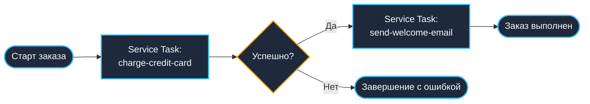
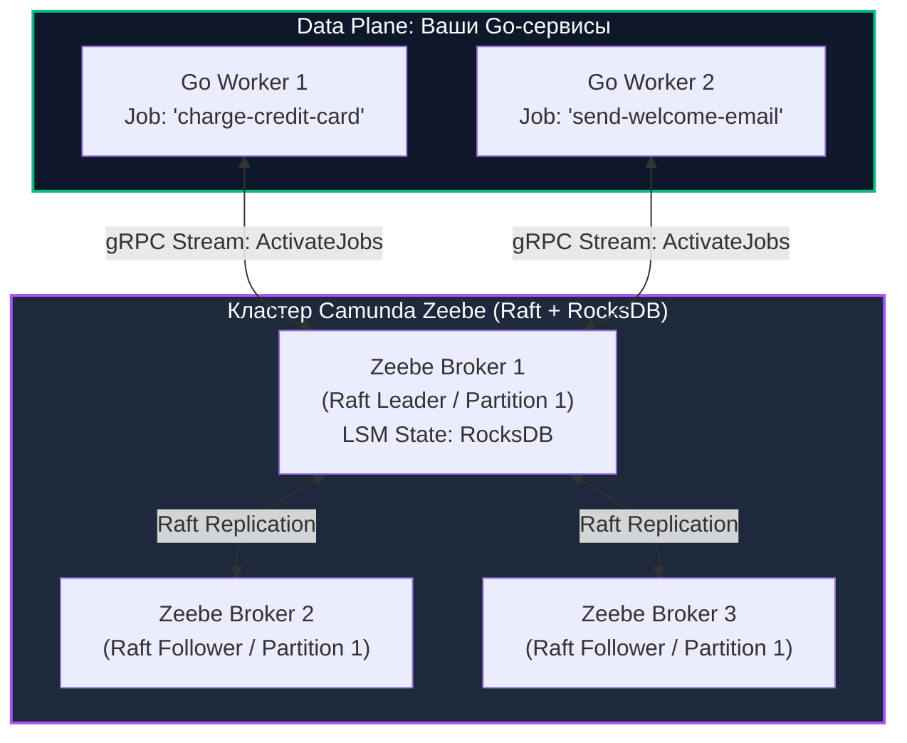
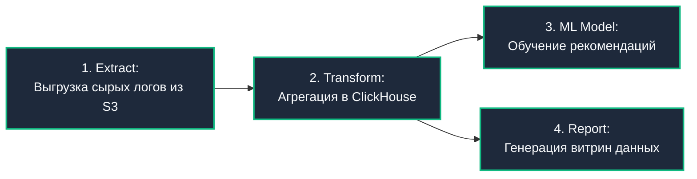

# Альтернативы: Zeebe, Airflow

> *«Если единственным инструментом в вашем арсенале является молоток, то любая проблема начинает казаться гвоздем. В мире распределенных вычислений попытка натянуть один оркестратор на все бизнес-задачи — верный путь к архитектурной катастрофе.»*

В предыдущих лекциях подраздела (включая детальное сопоставление [[6. Temporal vs Cadence]]) мы досконально изучили устройство **Temporal** — флагманского Code-first оркестратора для микросервисных транзакций на языке Go.

Однако ландшафт промышленной оркестрации не исчерпывается написанием детерминированного кода. Бизнес-аналитики часто требуют визуальной прозрачности процессов в виде блок-схем, а инженеры данных (Data Engineers) ежедневно управляют ночными пайплайнами выгрузки петабайт информации.

Попытка использовать Temporal для построения тяжелых ночных ETL-пайплайнов или, наоборот, внедрение аналитического планировщика для оформления заказов в реальном времени — это хрестоматийные ошибки проектирования.

В этой заключительной теоретической статье мы разберем две ведущие альтернативы, воплощающие диаметрально противоположные архитектурные парадигмы: **Camunda Zeebe** (визуальная событийно-ориентированная оркестрация) и **Apache Airflow** (оркестрация пакетных пайплайнов данных).

---

## 1. Camunda Zeebe: Оркестрация через BPMN

Temporal продвигает парадигму **Code-first**: жизненный цикл процесса выражается исключительно в виде программного кода на Go, Java или TypeScript. 

Но что делать, если сложный процесс (например, согласование банковского кредита, включающее проверку скоринга, ручной андеррайтинг сотрудником и верификацию службы безопасности) проектируется не программистом, а кросс-функциональной командой бизнес-аналитиков и риск-офицеров?

**Camunda Zeebe** (технологическое ядро платформы Camunda 8) использует парадигму **Design-first (Визуальное проектирование)**. Бизнес-процесс моделируется в виде графической блок-схемы международного стандарта **BPMN 2.0 (Business Process Model and Notation)**.



Эта блок-схема сохраняется в виде XML-файла стандарта BPMN 2.0, загружается (деплоится) непосредственно в кластер Zeebe и **сама по себе является исполняемым бинарным кодом процесса**!

---

### Архитектура Zeebe (Mechanical Sympathy)

В отличие от Temporal, который перекладывает алгоритмическое исполнение веток на Go-воркеры через Replay, Zeebe представляет собой самостоятельный **распределенный брокер состояний (Stateful Stream-Processing Broker)**.

1. **Движок на Java:** Ядро брокера Zeebe написано на Java, но оптимизировано под экстремально низкие накладные расходы сборщика мусора (GC) за счет активного использования direct memory и кольцевых буферов.
2. **Локальное хранилище на RocksDB:** В отличие от Camunda 7 или Temporal, Zeebe **не требует внешней базы данных (PostgreSQL или Cassandra)**. Каждый брокер хранит состояние шардов локально на диске во встроенной высокоскоростной LSM-базе **RocksDB**.
3. **Консенсус Raft:** Партиции процессов реплицируются между узлами кластера Zeebe по распределенному алгоритму консенсуса **Raft** (аналогично Quorum Queues в RabbitMQ или журналу Apache Kafka).
4. **Job Workers на Go:** Микросервисы на Go не занимаются оркестрацией. Они выступают исключительно в роли легковесных исполнителей конкретных блоков схем (**Job Workers**), подключаясь к брокеру Zeebe по протоколу gRPC.



---

### Как это выглядит в Go?

В парадигме Zeebe инженеру не нужно учить правила детерминизма Temporal: здесь нет ограничений на системное время `time.Now()`, генерацию UUID или вызовы внешних API. Вся координация и стейт-машина живут внутри брокера Zeebe.

Go-код представляет собой чистый обработчик задач:

```go
package main

import (
	"context"
	"fmt"
	"log"

	"github.com/camunda/zeebe/clients/go/v8/pkg/entities"
	"github.com/camunda/zeebe/clients/go/v8/pkg/worker"
	"github.com/camunda/zeebe/clients/go/v8/pkg/zbc"
)

func main() {
	// 1. Инициализация gRPC-клиента Zeebe
	client, err := zbc.NewClient(&zbc.ClientConfig{
		GatewayAddress:         "localhost:26500",
		UsePlaintextConnection: true,
	})
	if err != nil {
		log.Fatalf("Ошибка подключения к Zeebe Gateway: %v", err)
	}
	defer client.Close()

	// 2. Регистрация воркера для сервисного шага из BPMN
	jobWorker := client.NewJobWorker().
		JobType("charge-credit-card"). // Идентификатор Service Task в BPMN XML
		Handler(handleChargeCard).     // Функция-обработчик на Go
		MaxJobsActive(32).             // Конкурентный пул задач
		Open()
	defer jobWorker.Close()

	log.Println("Zeebe Job Worker успешно запущен, ожидание задач...")
	select {} // Блокировка основного потока
}

func handleChargeCard(client worker.JobClient, job entities.Job) {
	ctx := context.Background()

	// Извлекаем переменные процесса, переданные в формате JSON
	variables, err := job.GetVariablesAsMap()
	if err != nil {
		client.NewFailJobCommand().
			JobKey(job.GetKey()).
			Retries(job.GetRetries() - 1).
			ErrorMessage(fmt.Sprintf("Не удалось распарсить переменные: %v", err)).
			Send(ctx)
		return
	}

	amount := variables["amount"]
	log.Printf("Обработка списания средств на сумму: %v", amount)

	// Выполнение реальной сетевой бизнес-логики
	err = executeBankPayment(amount)
	if err != nil {
		// Отрицательное подтверждение (Nack): брокер решит, делать ли Retry согласно BPMN
		client.NewFailJobCommand().
			JobKey(job.GetKey()).
			Retries(job.GetRetries() - 1).
			ErrorMessage(err.Error()).
			Send(ctx)
		return
	}

	// Положительное подтверждение (Ack): шаг выполнен, брокер двигает токен по схеме
	client.NewCompleteJobCommand().
		JobKey(job.GetKey()).
		Send(ctx)
}

func executeBankPayment(amount any) error {
	// Имитация успешного платежа
	return nil
}
```

**Плюсы Zeebe:**
- **Единый язык бизнеса и IT:** Бизнес-аналитик, менеджер продукта и инженер смотрят в один и тот же веб-интерфейс (Camunda Operate), видя путь перемещения «токена» процесса в реальном времени.
- **Отсутствие внешних СУБД:** Встроенный Raft и RocksDB избавляют от администрирования тяжелых кластеров PostgreSQL/Cassandra.

**Минусы Zeebe:**
- **XML-лапша при сложной логике:** Попытка реализовать глубокую алгоритмическую обработку данных, сложные циклы или динамическое слияние массивов превращает визуальную BPMN-схему в чудовищный клубок стрелок («BPMN Spaghetti»).
- **Ограниченная выразительность:** Любое малейшее изменение структуры требует правки схемы в визуальном редакторе (Camunda Modeler) и деплоя новой версии XML.

---

## 2. Apache Airflow: Оркестрация данных (Data Pipelines)

Если Temporal и Zeebe — это микросервисные оркестраторы событий (где процессы стартуют миллионами в секунду, а время отклика шага исчисляется миллисекундами), то **Apache Airflow** правит бал в совершенно иной вселенной — **Data Engineering & Big Data**.

Airflow спроектирован в недрах Airbnb для управления пакетными пайплайнами обработки данных (ETL/ELT), обучением ML-моделей и построением корпоративных хранилищ (DWH).

Процессы в Airflow описываются на языке **Python** в виде **направленных ациклических графов (DAG — Directed Acyclic Graph)**.



---

### Архитектура Airflow (Mechanical Sympathy)

Под капотом у Airflow лежит архитектура, оптимизированная под длительные пакетные вычисления по расписанию, а не под мгновенные отклики:

1. **Scheduler (Python):** Сердце системы. Это тяжелый фоновый процесс, который с заданной периодичностью сканирует директорию с DAG-файлами на диске, парсит Python-скрипты, вычисляет зависимости графа и записывает готовые к исполнению задачи в реляционную базу данных.
2. **Metadata Database (PostgreSQL / MySQL):** Хранит полную информацию о запусках графов (DAG Runs), статусах задач и переменных.
3. **Executors & Workers (Celery / Kubernetes):** Исполнители, которые забирают задачи из базы данных и запускают их физически на машинах кластера.

> [!warning] Ловушка / Gotcha: Airflow для микросервисов
> Самая катастрофическая архитектурная ошибка начинающего инженера — попытаться использовать Apache Airflow для обработки транзакций интернет-магазина (например, оформление клиентского заказа).
> 
> Архитектура Airflow **принципиально не предназначена для сценариев Low-Latency**:
> - Планировщик Airflow работает по циклу `cron`. Он пересчитывает граф задач с интервалом в несколько секунд (а на больших инсталляциях — до десятков секунд!).
> - Запуск одной элементарной задачи в Airflow может занимать от 3 до 15 секунд только на этапе шедулинга и выделения пода.
> - Если Temporal или Zeebe реагируют на события за миллисекунды, Airflow в транзакционном контуре приведет к мгновенному параличу пользовательского опыта.

---

### Как запускать Go-код из Airflow?

Поскольку ядро Airflow написано на Python, микросервисы на Go подключаются к пайплайнам через контейнеризацию. В продакшене стандартом является оператор **`KubernetesPodOperator`**: Airflow поднимает изолированный Kubernetes Pod с собранным бинарником на Go, монтирует сетевые диски, передает переменные окружения, дожидается кода возврата `exit 0` и переходит к следующему узлу DAG.

```python
# Описание DAG в Apache Airflow (Python)
from datetime import datetime, timedelta
from airflow import DAG
from airflow.providers.cncf.kubernetes.operators.kubernetes_pod import KubernetesPodOperator

default_args = {
    'owner': 'data-platform',
    'depends_on_past': False,
    'retries': 3,
    'retry_delay': timedelta(minutes=5),
}

with DAG(
    dag_id='nightly_financial_aggregation',
    default_args=default_args,
    start_date=datetime(2026, 1, 1),
    schedule_interval='@daily', # Запуск раз в сутки по cron
    catchup=False,
) as dag:

    # Запуск высокопроизводительного сервиса агрегации на Go
    aggregate_ledger = KubernetesPodOperator(
        task_id="run_go_ledger_aggregator",
        name="go-ledger-worker",
        namespace="analytics",
        image="registry.company.internal/data/go-aggregator:v2.1",
        cmds=["/app/aggregator"],
        arguments=["--date={{ ds }}", "--batch-size=100000"],
        get_logs=True,
        is_delete_operator_pod=True, # Удалить под после завершения с exit 0
    )
```

---

## 3. Сводный анализ: Выбор Архитектора

Чтобы не ошибиться при выборе инструмента под конкретную задачу, используйте матрицу компромиссов:

| Критерий | Temporal | Camunda Zeebe | Apache Airflow |
|---|:---:|:---:|:---:|
| **Основная парадигма** | **Code-first** (Go, Java, TypeScript, Python) | **Design-first** (BPMN 2.0 XML блок-схемы) | **DAG-first** (Python скрипты по расписанию) |
| **Целевая область** | Микросервисные транзакции, распределенные саги | Бизнес-процессы, сквозная интеграция IT и аналитики | Пакетный ETL, Data Engineering, Machine Learning |
| **Задержка шага (Latency)** | **10–30 миллисекунд** (gRPC Long Polling) | **10–50 миллисекунд** (gRPC Streaming) | **Секунды / Минуты** (Дисковый шедулер, `cron`) |
| **Хранилище стейта** | Внешняя СУБД (PostgreSQL / Cassandra) | **Встроенный RocksDB + Raft-консенсус** | RDBMS Metadata (PostgreSQL / MySQL) |
| **Модель отказоустойчивости** | **Durable Execution (Replay из Event History)** | Stream Processing State Machine | Re-run сбойного узла графа |
| **Главная сила** | Максимальная гибкость и мощь языка Go | Визуальная понятность схемы для менеджеров | Богатейшая экосистема коннекторов к Big Data |
| **Главная слабость** | Отсутствие визуального drag-and-drop дизайнера | BPMN превращается в лапшу при сложной логике | Полная непригодность для транзакций реального времени |

---

## Подводные камни и вопросы с собеседований

> [!tip] Собеседование
> **Вопрос:** В нашей компании есть задача: раз в сутки выгружать из баз данных 500 ГБ логов заказов, очищать их, обогащать данными из CRM и заливать витрину в ClickHouse. Какую систему вы выберете — Temporal или Airflow?
> 
> **Ответ:**
> Однозначно **Apache Airflow** (или его современные наследники Dagster / Prefect).
> 
> 1. **Temporal** оптимизирован под непрерывный поток легковесных короткоживущих транзакций (миллионы процессов, каждый из которых делает несколько сетевых вызовов с небольшими объемами данных в памяти). Прокачка сотен гигабайт через пейлоады Temporal приведет к переполнению базы данных History Service и параличу кластера.
> 2. **Airflow** изначально спроектирован для батчевых задач: он запускается по строгому расписанию (`cron`), великолепно оркестрирует тяжелые распределенные вычисления (Spark, Trino, ClickHouse) и не пытается хранить сами процессируемые данные внутри собственного ядра.

---

## Итог подраздела

Оркестрация — это мощнейший инструмент распределенной архитектуры, требующий осознанного выбора под задачу:
1. Если вам нужен бескомпромиссный контроль над транзакциями, обработка отказов через Saga, строгий детерминизм и чистый Go-код — ваш выбор **Temporal**.
2. Если процесс требует согласования с бизнесом, наглядного визуального контроля и участия нетехнических специалистов — используйте **Camunda Zeebe**.
3. Если перед вами стоит задача регулярной перекачки и трансформации терабайт аналитических данных по расписанию — используйте **Apache Airflow**.

На этом мы подводим черту под теоретическим исследованием распределенной асинхронности: мы прошли путь от кремния и сокетов до очередей RabbitMQ, журналов Kafka, брокера NATS и бессмертных функций Temporal.

Пришло время спустить все полученные знания на землю и проверить их на практике в боевом коде на языке Go. Переходим к практическому разделу: [[1. Работа с очередями в Go]].