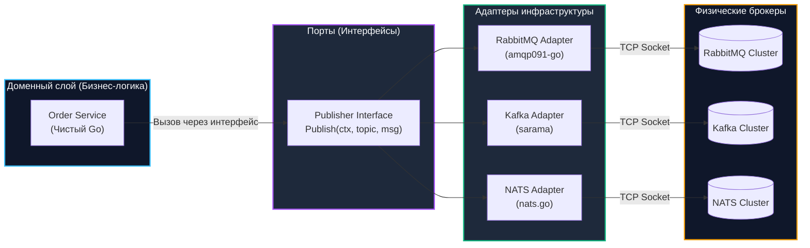
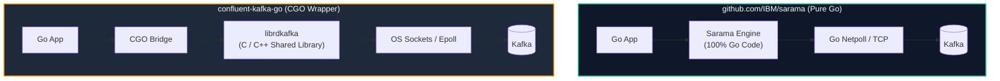
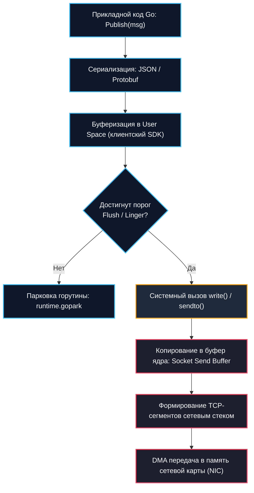

# Работа с очередями в Go

> *«В теории нет никакой разницы между теорией и практикой. На практике же эта разница колоссальна — особенно когда по сокету прилетает RST, а планировщик Go пытается припарковать десять тысяч горутин.»*

## Интеграция брокеров сообщений в Go-приложения

В теоретических главах нашего учебника мы обстоятельно разобрали архитектурные принципы распределенных очередей: от протоколов AMQP в [[1. RabbitMQ. Архитектура и концепции|RabbitMQ]] и шардированных партиций в [[1. Kafka. Архитектура и модель log based системы|Kafka]] до сверхлегкого протокола [[1. NATS. Легковесный брокер|NATS]].

На диаграммах в архитектурных документах всё выглядит гладко и стройно: сервисы публикуют события, брокеры раскладывают их по полочкам, а консьюмеры слаженно разбирают задачи. Однако реальная инженерная разработка бэкенда на языке Go начинается там, где кончается идеальный мир.

В продакшене работа с брокерами сообщений — это непрекращающаяся битва за стабильность:
- Как не потерять сообщения при экстренном перезапуске пода?
- Как корректно переподключиться, если брокер упал на 3 секунды?
- Почему наивный вызов библиотеки порождает утечки сотен горутин и пожирает память аллокациями?
- Как подружить контексты отмены `context.Context` с блокирующими сетевыми вызовами?

В этой практической главе мы заложим надежный фундамент работы с тремя главными брокерами современности с позиций **Mechanical Sympathy** и бескомпромиссных стандартов production-кода.

---

## Архитектурный слой: Зачем нужен Client Wrapper

Самый распространенный антипаттерн, с которым регулярно сталкиваются технические лидеры при аудите микросервисов — **просачивание низкоуровневых SDK брокеров в слой предметной области (Domain & Service Layer)**.

Когда разработчик напрямую в бизнес-структуре вызывает методы специфических библиотек (`amqp091-go`, `confluent-kafka-go` или `nats.go`), проект моментально оказывается заложником чужих сигнатур:
1. Чтобы отправить сообщение в RabbitMQ, нужно открыть логический `Channel` и вызвать `Publish()`.
2. В Kafka требуется инициализировать `Producer` и вызвать `Produce()` или `SendMessage()`.
3. В NATS работа идет с `JetStreamContext`.

Если через год бизнес примет решение мигрировать критический поток заказов с RabbitMQ на Kafka (например, из-за потребности в длительном хранении истории и Event Sourcing), вам придется переписать и заново протестировать десятки файлов прикладной бизнес-логики.



**Решение по чистой архитектуре:** Мы изолируем сторонние библиотеки за узким доменным интерфейсом `Publisher`. Бизнес-код оперирует абстрактной структурой `Message`, а платформенные адаптеры транслируют ее в сетевые вызовы. Это делает юнит-тестирование тривиальным (интерфейс мокается в памяти за 5 строк), а инфраструктурные адаптеры тестируются интеграционными тестами через Testcontainers.

---

## Работа с RabbitMQ в Go

### Под капотом: `amqp091-go` и TCP-соединения

Официальный клиент сообщества `github.com/rabbitmq/amqp091-go` работает по бинарному протоколу AMQP 0-9-1 поверх сырого сетевого сокета TCP. Ключевая концепция протокола — **мультиплексирование каналов (AMQP Channels)** поверх одного физического соединения.

> [!info] Под капотом
> Протокол AMQP разбивает поток данных на типизированные бинарные фреймы (Method, Header, Body, Heartbeat). 
> Внутри библиотеки `github.com/rabbitmq/amqp091-go` запускается специальная фоновая горутина-ридер. Она в бесконечном цикле вычитывает байты из TCP-сокета ядра ОС, парсит заголовки фреймов и диспетчеризирует полезную нагрузку по внутренним Go-каналам (`chan`), привязанным к соответствующим идентификаторам логических AMQP-каналов (`Channel`).
> 
> **Критический нюанс:** Если сетевой провод физически оборвался или брокер перезагрузился, базовое TCP-соединение падает. Вместе с ним **мгновенно и безвозвратно умирают абсолютно все созданные AMQP-каналы**. Библиотека `amqp091-go` **не содержит встроенного автоматического реконнекта**! Если инженер наивно полагает, что драйвер сам восстановит связь, сервис перестанет отправлять сообщения навсегда. Автоматическое переподключение — святая обязанность разработчика.

---

### Правильная структура подключения

Ниже представлен production-шаблон надежного издателя RabbitMQ с поддержкой мониторинга обрыва сети и режима подтверждения доставки (Publisher Confirms):

```go
package rmqpublisher

import (
	"context"
	"fmt"
	"log"
	"net"
	"time"

	amqp "github.com/rabbitmq/amqp091-go"
)

type Config struct {
	Host     string
	Port     int
	User     string
	Password string
}

type RabbitPublisher struct {
	conn    *amqp.Connection
	channel *amqp.Channel
}

func NewRabbitPublisher(ctx context.Context, cfg Config) (*RabbitPublisher, error) {
	url := fmt.Sprintf("amqp://%s:%s@%s:%d/", cfg.User, cfg.Password, cfg.Host, cfg.Port)

	// Защищенный Dial с таймаутом сетевого подключения
	amqpCfg := amqp.Config{
		Dial: func(network, addr string) (net.Conn, error) {
			return net.DialTimeout(network, addr, 5*time.Second)
		},
	}

	conn, err := amqp.DialConfig(url, amqpCfg)
	if err != nil {
		return nil, fmt.Errorf("dial rabbitmq: %w", err)
	}

	ch, err := conn.Channel()
	if err != nil {
		_ = conn.Close()
		return nil, fmt.Errorf("open channel: %w", err)
	}

	// Переводим канал в режим Confirm (гарантия записи брокером)
	if err := ch.Confirm(false); err != nil {
		_ = ch.Close()
		_ = conn.Close()
		return nil, fmt.Errorf("put channel in confirm mode: %w", err)
	}

	pub := &RabbitPublisher{
		conn:    conn,
		channel: ch,
	}

	// Запуск фонового супервизора соединения
	go pub.monitorConnection(ctx)

	return pub, nil
}

func (p *RabbitPublisher) monitorConnection(ctx context.Context) {
	// NotifyClose регистрирует канал, куда брокер пришлет ошибку при обрыве
	closeCh := p.conn.NotifyClose(make(chan *amqp.Error, 1))

	select {
	case <-ctx.Done():
		// Graceful shutdown приложения
		_ = p.channel.Close()
		_ = p.conn.Close()
		return
	case err, ok := <-closeCh:
		if !ok || err == nil {
			return
		}
		// Обрыв связи: в боевом коде здесь запускается конечный автомат реконнекта
		log.Printf("[CRITICAL] RabbitMQ connection lost: %v. Запуск аварийного восстановления...", err)
	}
}

func (p *RabbitPublisher) Publish(ctx context.Context, exchange, routingKey string, body []byte) error {
	// PublishWithContext строго учитывает дедлайн переданного context.Context
	err := p.channel.PublishWithContext(
		ctx,
		exchange,
		routingKey,
		false, // mandatory
		false, // immediate (устарел в стандарте AMQP 0-9-1)
		amqp.Publishing{
			ContentType:  "application/octet-stream",
			Body:         body,
			DeliveryMode: amqp.Persistent, // Сохранять сообщение на диск брокера
			Timestamp:    time.Now().UTC(),
		},
	)
	if err != nil {
		return fmt.Errorf("publish message: %w", err)
	}

	return nil
}
```

> [!warning] Ловушка / Gotcha: Блокирующий `amqp.Dial()`
> Стандартный вызов `amqp.Dial()` выполняет системный вызов `connect()` без ограничения дедлайна со стороны Go. Если целевой хост недоступен, файрвол молча дропает SYN-пакеты или DNS завис, сетевой стек ядра Linux будет удерживать вызов до истечения системного таймаута TCP (который по умолчанию может достигать 2 минут!).
> 
> Если вы реализуете цикл переподключения в фоне, наивный вызов `amqp.Dial()` быстро приведет к накоплению сотен заблокированных горутин, исчерпанию файловых дескрипторов и зависанию сервиса.
> 
> **Всегда используйте `amqp.DialConfig`** с кастомной функцией `net.DialTimeout` или оборачивайте подключение через таймер `time.After` и вспомогательный контекст `context.WithTimeout`.

---

## Работа с Kafka в Go

### Под капотом: `confluent-kafka-go` и `sarama`

В инженерном сообществе Go при работе с Apache Kafka существуют две доминирующие библиотеки. Выбор между ними — классический архитектурный компромисс между производительностью и чистотой рантайма.



#### 1. `sarama` (`github.com/IBM/sarama`) — Чистый Go
- **Преимущества:** 100% чистый Go-код без CGO. Простая кросс-компиляция под любые архитектуры (ARM, x86), сборка ультракомпактных Docker-образов на базе `scratch` или Alpine. Полная прозрачность для профилировщика `pprof` и детектора гонок `go test -race`.
- **Недостатки:** Скорость сериализации протокола чуть ниже C-библиотек; отставание по внедрению новейших экспериментальных фич протокола Kafka.

#### 2. `confluent-kafka-go` — CGO-обертка над `librdkafka`
- **Преимущества:** Максимальная производительность сетевого ввода-вывода, эталонная реализация от создателей Kafka, аппаратная оптимизация вызовов.
- **Недостатки:** **CGO**. Сборка бинарника требует наличия заголовочных файлов `librdkafka` в системе сборщика. Потребление памяти внутри C-библиотеки не контролируется сборщиком мусора Go GC. При сбоях стек вызовов ломается на границе C и Go, что затрудняет анализ дампов памяти.

> [!tip] Собеседование
> **Вопрос:** Какой клиент Kafka вы выберете для микросервисов компании — `sarama` или `confluent-kafka-go`?
> 
> **Ответ:** В 90% стандартных микросервисных задач предпочтителен **чистый Go (`github.com/IBM/sarama`)**. Он обеспечивает предсказуемость сборки (статический бинарник в контейнере `scratch`), отличную интеграцию с профилировщиком `pprof` и полную безопасность памяти. Переход на `confluent-kafka-go` оправдан только при экстремальных нагрузках (сотни тысяч сообщений в секунду на инстанс) или жестком требовании транзакционного Exactly-Once процессинга на уровне ядра Kafka.

---

### Производитель на Sarama: Идиоматичный подход

Фундаментальное свойство Kafka-издателя: он **глубоко асинхронен**. Когда вызывается метод отправки, сообщение не летит в провод мгновенно — оно буферизуется во внутренней очереди продюсера, группируясь в крупные батчи по времени ожидания (`linger.ms`) или размеру пачки (`Flush.Bytes`).

```go
package kafkaproducer

import (
	"context"
	"fmt"
	"time"

	"github.com/IBM/sarama"
)

type KafkaProducer struct {
	prod sarama.SyncProducer
}

func NewKafkaProducer(brokers []string) (*KafkaProducer, error) {
	config := sarama.NewConfig()

	// ВАЖНО: SyncProducer в Sarama НЕ означает синхронный сетевой I/O!
	// Он означает лишь то, что метод SendMessage() блокирует вызывающую горутину
	// до момента, пока брокер не вернет подтверждение (Ack).
	// Под капотом SyncProducer заворачивает асинхронный AsyncProducer и читает каналы Successes/Errors.
	config.Producer.RequiredAcks = sarama.WaitForAll // acks=-1: ждем запись на всех репликах ISR
	config.Producer.Retry.Max = 5
	config.Producer.Retry.Backoff = 100 * time.Millisecond
	config.Producer.Return.Successes = true // Обязательно для работы SyncProducer

	// Механическое сочувствие: оптимизация батчинга для снижения нагрузки на сокеты
	config.Producer.Flush.Bytes = 1024 * 1024        // Батч размером до 1 МБ
	config.Producer.Flush.Frequency = 10 * time.Millisecond // Задержка linger.ms: отправка каждые 10 мс

	prod, err := sarama.NewSyncProducer(brokers, config)
	if err != nil {
		return nil, fmt.Errorf("create kafka sync producer: %w", err)
	}

	return &KafkaProducer{prod: prod}, nil
}

func (p *KafkaProducer) Publish(ctx context.Context, topic string, key, value []byte) error {
	msg := &sarama.ProducerMessage{
		Topic: topic,
		Key:   sarama.ByteEncoder(key),
		Value: sarama.ByteEncoder(value),
	}

	// Проверяем контекст перед выполнением блокирующего вызова
	select {
	case <-ctx.Done():
		return ctx.Err()
	default:
		partition, offset, err := p.prod.SendMessage(msg)
		if err != nil {
			return fmt.Errorf("failed to send message to kafka: %w", err)
		}
		_ = partition
		_ = offset
		return nil
	}
}

func (p *KafkaProducer) Close() error {
	// Очистка и сброс оставшихся буферов в сокет
	return p.prod.Close()
}
```

> [!warning] Ловушка / Gotcha: Потеря данных при `SIGKILL`
> Если операционная система принудительно убивает Go-процесс по сигналу `SIGKILL` (например, при срабатывании Linux OOM Killer или принудительной остановке `docker kill -9`), метод `Close()` продюсера вызван не будет.
> 
> Все сообщения, находившиеся в оперативной памяти продюсера в стадии накопления батча (`Flush.Bytes`), **будут безвозвратно уничтожены**, даже если в конфигурации выставлен строжайший `WaitForAll`! Брокер о них даже не узнал.
> 
> Поэтому для критически важных финансовых систем жизненно необходим корректный механизм [[2. Консьюмеры и graceful shutdown|graceful shutdown]], который перехватывает сигнал `SIGTERM`, завершает прием новых сообщений и вызывает `Close()` у всех активных продюсеров.

---

## Работа с NATS в Go

### Под капотом: Легковесность и Netpoll

Клиент `github.com/nats-io/nats.go` — яркий образец высокоэффективного Go-инжиниринга. В отличие от тяжеловесных драйверов других систем, он создавался с глубоким пониманием архитектуры компилятора и рантайма Go.

> [!info] Под капотом
> Драйвер `nats.go` не плодит отдельные горутины-ридеры на каждый сокет. Он напрямую использует **netpoll** ядра Go. 
> 
> Когда в сетевом сокете нет входящих данных, горутина паркуется планировщиком Go через `runtime.gopark` с нулевым потреблением CPU. Сокет регистрируется в подсистеме мультиплексирования `epoll` (в Linux) или `kqueue` (в macOS). Как только сетевая карта получает пакет, netpoller мгновенно будит целевую горутину. Это позволяет одному сервису удерживать десятки тысяч открытых подписок NATS без малейшей деградации производительности.

---

### JetStream: Публикация с гарантиями

Подсистема [[2. Core NATS vs JetStream|JetStream]] привносит в легковесный NATS персистентность уровня распределенного журнала сообщений. Здесь нет привычных очередей: сообщения публикуются в темы — **`Subject`** (с поддержкой масок `*` и `>`) и сохраняются в персистентный стрим (**`Stream`**).

```go
package natspublisher

import (
	"context"
	"fmt"
	"time"

	"github.com/nats-io/nats.go"
)

type NATSPublisher struct {
	conn *nats.Conn
	js   nats.JetStreamContext
}

func NewNATSPublisher(ctx context.Context, url string) (*NATSPublisher, error) {
	opts := []nats.Option{
		nats.Name("OrderServicePublisher"),
		nats.ReconnectWait(2 * time.Second),
		nats.MaxReconnects(10),
		nats.DisconnectErrHandler(func(nc *nats.Conn, err error) {
			if err != nil {
				fmt.Printf("[WARN] NATS disconnected: %v\n", err)
			}
		}),
		nats.ReconnectHandler(func(nc *nats.Conn) {
			fmt.Printf("[INFO] NATS reconnected to %s\n", nc.ConnectedUrl())
		}),
	}

	nc, err := nats.Connect(url, opts...)
	if err != nil {
		return nil, fmt.Errorf("connect to nats: %w", err)
	}

	// Инициализация контекста JetStream
	js, err := nc.JetStream()
	if err != nil {
		nc.Close()
		return nil, fmt.Errorf("init jetstream: %w", err)
	}

	return &NATSPublisher{conn: nc, js: js}, nil
}

func (p *NATSPublisher) Publish(ctx context.Context, subject string, data []byte) error {
	// JetStream Publish выполняет синхронную публикацию с гарантией сохранения на диске
	ack, err := p.js.Publish(subject, data, nats.Context(ctx))
	if err != nil {
		return fmt.Errorf("publish to jetstream: %w", err)
	}

	// ack.Sequence — монотонно растущий номер в стриме (аналог offset в Kafka)
	_ = ack.Sequence
	return nil
}

func (p *NATSPublisher) Close() error {
	p.conn.Close()
	return nil
}
```

---

## Mechanical Sympathy: Сетевой стек и Аллокации

Когда прикладной код на Go выполняет отправку сообщения, на пути от пользовательской структуры данных до сетевой карты (NIC) разворачивается многоуровневый процесс:



Где высоконагруженная система теряет такты CPU и пропускную способность:
1. **Аллокации слайсов `[]byte` и маршалинг:** Вызов стандартного `json.Marshal()` или преобразование строк `[]byte(str)` создает миллионы временных объектов в куче (Heap), нагружая сборщик мусора Go GC. В Highload-системах используют пул переиспользуемых буферов через `sync.Pool` или специализированные генераторы сериализации (например, `easyjson`), которые избегают рефлексии `reflect` и пишут полезную нагрузку прямо в предварительно выделенный байтовый срез `[]byte`.
2. **Накладные расходы системных вызовов:** Каждый системный вызов `write` — это дорогостоящее переключение контекста процессора из Ring 3 (User Space) в Ring 0 (Kernel Space) со сбросом конвейера CPU. Группировка сообщений в батчи (через буферизацию `bufio` или встроенные батчеры Kafka/NATS) позволяет одним системным вызовом отправить тысячи событий.
3. **Заполнение сокета ядра:** Если сеть перегружена, а буфер сокета (Socket Buffer) переполнен, механизм `epoll` блокирует горутину до момента освобождения места в окне отправки TCP.

---

## Универсальный интерфейс публикации

Сведем рассмотренные подходы к канонической чистой архитектуре:

```go
package messaging

import "context"

// Message представляет платформо-независимое доменное сообщение
type Message struct {
	Key     []byte
	Payload []byte
	Headers map[string]string
}

// Publisher — канонический контракт отправки сообщений
type Publisher interface {
	Publish(ctx context.Context, topic string, msg Message) error
	Close() error
}
```

Адаптер для любого брокера реализует этот контракт:
- Преобразует заголовки (Headers), внедряя идентификатор распределенной трассировки `trace_id` (W3C Trace Context).
- Передает тело сообщения в нативный клиент брокера (`sarama.ProducerMessage` или `amqp.Publishing`).
- Бизнес-логика остается кристально чистой и ничего не знает о сетевом транспорте.

---

## Итоги

1. **Изолируйте брокеры:** Никогда не используйте SDK очередей напрямую в бизнес-слое. Абстрагируйте транспорт за узким интерфейсом `Publisher`.
2. **RabbitMQ требует активного супервизора:** Обрыв сетевого сокета моментально уничтожает все AMQP-каналы. Библиотека `amqp091-go` не умеет восстанавливать соединение самостоятельно — пишите надежный стейт-машин супервизор.
3. **Батчинг продюсера Kafka требует дисциплины:** Без явного вызова метода `Close()` при завершении сервиса все сообщения, ожидающие в памяти, сгорят безвозвратно.
4. **NATS максимально дружелюбен к Go:** Благодаря глубокой интеграции с рантаймом и `netpoll`, тысячи соединений NATS практически не потребляют ресурсы CPU.
5. **Управляйте жизненным циклом через `context.Context`:** Все сетевые методы обязаны принимать контекст, контролировать дедлайны и прерывать выполнение до совершения тяжелых системных вызовов.

В следующей лекции мы перевернем монету и изучим обратную сторону асинхронного мира — построение надежных консьюмеров, обработку очередей без утечек горутин и правильный [[2. Консьюмеры и graceful shutdown]].