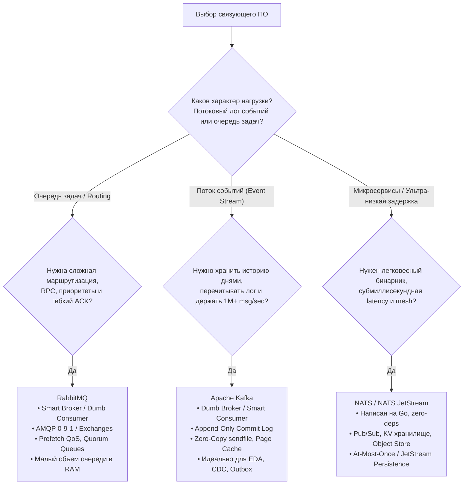
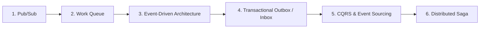

> [!NOTE]
> **Связи:** Эта статья подводит черту под всем разделом 13 «Очереди, брокеры сообщений и оркестраторы», связывая [[1. Обзор раздела. Асинхронность как основа масштабирования]] и все последующие материалы во всех подразделах. Мы завершаем изучение асинхронных коммуникаций и переходим к следующему фундаменту: [[14. Введение в распределенные системы]].

---

## Что мы построили

За шестьдесят шесть подробных лекций мы с вами проделали путь от фундаментального вопроса «зачем вообще нужны очереди сообщений» до сложнейших глубин распределенного рантайма: устройства логов Kafka на уровне страниц памяти ядра Linux, транзакционного exactly-once, паттернов Outbox/Inbox, изоляции ядовитых сообщений и workflow-оркестрации в Temporal.

Этот раздел стал одним из самых массивных и технически глубоких в нашей энциклопедии, и тому есть объективная причина: **асинхронное взаимодействие — это центральная нервная система современного высоконагруженного бэкенда**. Без него не существует ни устойчивых к сбоям распределенных микросервисов, ни финансового процессинга с обработкой миллионов транзакций, ни аналитических конвейеров реального времени.

В этой заключительной статье мы соберем разрозненные мозаичные фрагменты в единую монолитную инженерную картину. Мы сформулируем строгие критерии выбора архитектурных инструментов, выделим вечные принципы и законы сохранения сложности, а также зафиксируем эталонный чек-лист боевого консьюмера на Go.

```mermaid
mindmap
  root((Раздел 13: Асинхронный бэкенд))
    Фундамент
      [[1. Обзор раздела. Асинхронность как основа масштабирования]]
      [[2. Синхронное vs асинхронное взаимодействие]]
      [[3. Producer и consumer]]
      [[4. Модели доставки. At most once, at least once, exactly once]]
      [[5. Ordering и partitioning]]
      [[6. Backpressure и контроль нагрузки]]
    Брокеры под капотом
      RabbitMQ
        [[2. Exchanges. Direct, Fanout, Topic, Headers]]
        [[5. Prefetch и QoS]]
        [[9. Cluster и HA в RabbitMQ]]
      Apache Kafka
        [[7. Kafka storage под капотом]]
        [[4. Consumer groups]]
        [[8. Retention и compaction]]
        [[6. Exactly once в Kafka]]
      NATS и JetStream
        [[1. NATS. Легковесный брокер]]
        [[5. JetStream. Persistence и stream processing]]
        [[6. NATS vs Kafka vs RabbitMQ]]
    Паттерны и Архитектура
      [[05. Паттерны и архитектура]]
      [[1. Pub Sub]] / [[2. Work Queue]]
      [[3. Event Driven Architecture]]
      [[4. Event sourcing и брокеры]] / [[5. CQRS и брокеры]]
      [[6. Outbox pattern]] / [[7. Inbox pattern]]
      [[8. Saga через брокеры]] / [[9. Message choreography vs orchestration]]
    Оркестрация
      [[2. Temporal. Архитектура и концепции]]
      [[3. Durable execution]]
      [[4. Оркестрация vs хореография]]
      [[5. Retry и compensation logic]]
    Боевая практика в Go
      [[07. Практика]]
      [[1. Работа с очередями в Go]]
      [[2. Консьюмеры и graceful shutdown]]
      [[3. Параллелизм обработки сообщений]]
      [[4. Idempotent handlers]]
      [[5. Batch processing сообщений]]
      [[6. Handling poison messages]]
      [[7. Тестирование async систем]]
      [[8. Observability очередей]]
      [[9. Мониторинг lag и throughput]]
```

---

## Переосмысление асинхронности: не быстрее, а надёжнее

Главное заблуждение начинающих инженеров звучит так: *«Наша система тормозит — давайте воткнем брокер сообщений, и она станет летать!»*

На физическом уровне асинхронность **всегда медленнее** прямого синхронного взаимодействия. Вместо одного сетевого прыжка `Client -> Server` по TCP/gRPC мы совершаем минимум три операции с диском и сетью:
1. Продюсер упаковывает батч и отправляет его по сокету в брокер.
2. Брокер производит `fsync` на диск или реплицирует пакет кворуму узлов по сети.
3. Консьюмер опрашивает брокер, получает пакет и десериализует его.

Физическая задержка (Latency) от момента создания события до его фиксации возрастает с 2 миллисекунд до 50–500 миллисекунд. Кроме того, система теряет немедленную согласованность (Strong Consistency), переходя в режим **Eventual Consistency** (согласованность в конечном счете).

В чем же тогда истинный смысл очередей, сформулированный в лекции [[2. Синхронное vs асинхронное взаимодействие]]?

Истинный смысл очередей — **тотальная развязка во времени и пространстве (Temporal & Spatial Decoupling)**:
- **Упругость к всплескам нагрузки (Load Leveling):** Брокер работает как гигантский гравитационный аккумулятор. Когда на Черную Пятницу наплыв заказов подскакивает в 50 раз, база данных не ложится под лавиной коннектов — очередь плавно поглощает удар, а консьюмеры спокойно переваривают поток с постоянной максимальной скоростью.
- **Изоляция сбоев (Fault Tolerance):** Если биллинг или складской сервис упал на техобслуживание на 2 часа, витрина магазина продолжает принимать заказы. Ни один байт данных не будет потерян.

> [!warning] Ловушка / Gotcha: Преждевременная асинхронизация
> Не внедряйте брокеры туда, где пользователю требуется синхронный ответ «здесь и сейчас». Если пользователь меняет пароль или запрашивает баланс карты, ему нужен детерминированный ответ за 15 миллисекунд. Перевод таких операций в фоновые очереди без крайней необходимости порождает ад из опрашивающих веб-сокетов, блокировок пользовательского интерфейса и усложнения инфраструктуры.

---

## Центральные концепции раздела

Прежде чем перейти к выбору конкретных технологий, повторим пять нерушимых законов, проходящих красной нитью через все лекции.

### Модели доставки и их цена

В лекции [[4. Модели доставки. At most once, at least once, exactly once]] мы доказали, что в ненадежной сети с падающими узлами абсолютно бесплатного "Exactly Once" не существует.

- **At-Most-Once:** Сообщение подтверждается до обработки. Риск потери данных. Применимо только для телеметрии и метрик, где потеря 1% замеров незаметна.
- **At-Least-Once:** Гарантия отсутствия потерь ценой неизбежного появления сетевых дубликатов при сбоях и таймаутах. Это рабочий стандарт 99% промышленных систем. Дубликаты нейтрализуются на стороне консьюмера через [[10. Idempotency в message processing]].
- **Transactional Exactly-Once:** Достижимо только в замкнутых контурах (например, связка Kafka Streams / Flink через двухфазный коммит и маркеры `read_committed`, как показано в [[6. Exactly once в Kafka]]). Как только результат обработки записывается во внешнюю базу данных или сторонний HTTP API, гарантия мгновенно деградирует до At-Least-Once.

### Порядок и параллелизм — фундаментальный конфликт

Глобальный строгий порядок сообщений и горизонтальное масштабирование системы взаимно исключают друг друга.
- Чтобы гарантировать строгий порядок во времени, в системе должен быть **ровно один поток исполнения и одна очередь**. Любая попытка параллельной вычитки несколькими горутинами неизбежно перемешает порядок завершения операций из-за квантования планировщика ОС.
- Компромисс современного инжиниринга — **локальный порядок по ключу шардирования** ([[5. Ordering и partitioning]]). Сообщения с одинаковым `customer_id` всегда попадают в одну и ту же партицию и обрабатываются строго последовательно, тогда как миллионы разных клиентов обрабатываются параллельно на сотнях ядер CPU.

### Управление нагрузкой

Без защитных барьеров консьюмер мгновенно захлебнется входящим потоком.
- В Kafka используется **Pull-модель** ([[3. Producer и consumer]]): консьюмер сам запрашивает порцию данных у брокера только тогда, когда готов ее переварить. Это естественный, заложенный в архитектуру механизм Backpressure ([[6. Backpressure и контроль нагрузки]]).
- В push-системах (RabbitMQ) критически важно жестко настраивать параметр **Prefetch QoS** ([[5. Prefetch и QoS]]). Если оставить prefetch безлимитным, RabbitMQ сбросит миллион сообщений в сетевой сокет одного процесса Go, вызвав немедленный OOM Kill (Out Of Memory) рантайма.

### Обработка ошибок и устойчивость

В асинхронном мире сбои — это не исключение, а штатный режим функционирования:
- [[9. Retry стратегии и exponential backoff]]: повторы с экспоненциальной паузой и случайным шумом (Jitter) предотвращают эффект «громоподобного стада» (Thundering Herd) на упавшую базу данных.
- [[8. Dead Letter Queue]]: ядовитые сообщения отсекаются в специальный накопитель для ручного или автоматического анализа инженерами.
- [[4. Idempotent handlers]]: уникальный ключ дедупликации защищает счета клиентов от двойного списания денег при повторных доставках.
- [[6. Handling poison messages]]: непрерывный перехват паники через `defer recover()` защищает воркер-пул от фатального краша процесса ОС (`SIGABRT`).

---

## Выбор брокера: RabbitMQ, Kafka или NATS

Один из ключевых вопросов на собеседованиях уровня Senior и Lead — осознанный выбор связующего звена. Серебряной пули нет: каждый инструмент спроектирован под свой класс задач и имеет свои компромиссы.



Сведем сравнительный анализ, проведенный в лекции [[6. NATS vs Kafka vs RabbitMQ]], в итоговую матрицу:

| Критерий | RabbitMQ | Apache Kafka | NATS JetStream |
|---|---|---|---|
| **Модель хранения** | Очереди в памяти/диске; удаление после `Ack` | Append-Only лог на диске; хранение по времени ([[8. Retention и compaction]]) | Потоки в памяти или на диске (Raft-консенсус) |
| **Интеллект системы** | **Smart Broker:** сам следит за доставкой и состоянием | **Smart Consumer:** брокер хранит лог, консьюмер двигает смещение | Гибрид: легкий брокер + клиентские консьюмеры |
| **Маршрутизация** | Мощные обменники ([[2. Exchanges. Direct, Fanout, Topic, Headers]]) | Простая адресация по имени топика и партиции | Иерархические темы (`orders.*.created`, wildcard `>`) |
| **Пропускная способность** | До $50\,000$ msg/sec на узел | От $1\,000\,000+$ msg/sec (Zero-Copy [[7. Kafka storage под капотом]]) | До $10\,000\,000+$ msg/sec в Core Pub/Sub |
| **Повторное чтение (Replay)** | Невозможно (сообщение уничтожается) | Нативное: перематываем Offset назад на любое время | Поддерживается через JetStream Consumer Replay |
| **Высокая доступность** | Classic Mirrored / Quorum Queues ([[9. Cluster и HA в RabbitMQ]]) | Встроенная репликация партиций (ISR, KRaft) | Встроенный Raft-кластер (Clustered JetStream) |

---

## Паттерны: от простого pub/sub к сложным сагам

В подразделе [[05. Паттерны и архитектура]] мы проследили эволюцию проектирования распределенных систем:



1. **[[1. Pub Sub]]:** Базовое широковещательное оповещение нескольких независимых сервисов об одном свершившемся факте.
2. **[[2. Work Queue]]:** Распределение пула тяжелых вычислительных задач между конкурирующими воркерами.
3. **[[3. Event Driven Architecture]]:** Архитектура, где сервисы общаются фактами прошлого (`OrderPaid`), полностью избавляясь от жесткой связанности (Coupling).
4. **[[6. Outbox pattern]] и [[7. Inbox pattern]]:** Решение вечной проблемы распределенных систем — **двойной записи (Dual Write)**. Запись бизнес-сущности и события в брокер объединяются в одну локальную ACID-транзакцию реляционной БД.
5. **[[4. Event sourcing и брокеры]] и [[5. CQRS и брокеры]]:** Полный отказ от мутабельного состояния. Состояние сущности вычисляется как проекция неизменяемого потока событий.
6. **[[8. Saga через брокеры]]:** Управление распределенными бизнес-транзакциями, пересекающими границы микросервисов, через цепочку событий и компенсирующих действий ([[5. Retry и compensation logic]]) с выбором между хореографией и оркестрацией ([[9. Message choreography vs orchestration]]).

---

## Оркестрация процессов: следующий уровень абстракции

Когда сага разрастается до десятков шагов, содержит циклы, длительные ожидания (таймауты на 30 дней) и сложные деревья ветвлений, событийная хореография превращается в неуправляемый «спагетти-конвейер».

Здесь на сцену выходит **Temporal** — движок оркестрации нового поколения, разобранный в лекциях [[2. Temporal. Архитектура и концепции]] и [[4. Оркестрация vs хореография]].

Главная инновация Temporal — **Durable Execution (Неубиваемое исполнение)** ([[3. Durable execution]]).
Разработчик пишет обычный, линейный, императивный код на Go:
```go
func OrderWorkflow(ctx workflow.Context, orderID string) error {
    // Вызываем Activity списания денег (автоматический retry при сбоях)
    var paymentErr error
    err := workflow.ExecuteActivity(ctx, ChargePaymentActivity, orderID).Get(ctx, &paymentErr)
    if err != nil {
        return err
    }

    // Засыпаем на 3 дня! Ни один поток или горутина не висит в памяти.
    // Если сервер упадет, Temporal восстановит выполнение с этой же наносекунды.
    _ = workflow.Sleep(ctx, 3*24*time.Hour)

    // Отправляем товар клиенту
    return workflow.ExecuteActivity(ctx, ShipOrderActivity, orderID).Get(ctx, nil)
}
```

Temporal берет на себя сохранение стека, дедупликацию, таймеры и компенсации, освобождая инженера от сотен строк ручного инфраструктурного кода.

---

## Практика в Go: чек-лист production-ready консьюмера

Если перед вами стоит задача спроектировать или провести код-ревью боевого консьюмера для промышленного использования, используйте проверенный практический чек-лист подразделов [[07. Практика]] и [[10. Distributed tracing в async систем]]:

- [ ] **1. Подключение и транспорт ([[1. Работа с очередями в Go]]):**
  - [ ] Реализован цикл автоматического переподключения (Reconnect Loop) с экспоненциальным backoff при обрыве TCP-сессии.
  - [ ] Сериализация данных проверена на нативную поддержку схем (Protobuf / JSON / Avro).
- [ ] **2. Graceful Shutdown ([[2. Консьюмеры и graceful shutdown]]):**
  - [ ] Сервис перехватывает системные сигналы `os.Interrupt`, `syscall.SIGTERM`.
  - [ ] При получении сигнала консьюмер немедленно останавливает чтение новых сообщений (`ctx.Done()`).
  - [ ] Горутины дорабатывают уже взятые в память сообщения и выполняют коммит смещений (ACK) до завершения процесса.
- [ ] **3. Управление конкурентностью ([[3. Параллелизм обработки сообщений]]):**
  - [ ] Размер пула горутин ограничен емкостью очередей и лимитами зависимых баз данных.
  - [ ] Сообщения с одинаковым бизнес-ключом маршрутизируются в одну горутину для сохранения очередности.
- [ ] **4. Идемпотентность ([[4. Idempotent handlers]]):**
  - [ ] Наличие уникального ключа события (`MessageID` / `EventID`).
  - [ ] Проверка и фиксация ключа выполняются атомарно (в транзакции PostgreSQL `INSERT ... ON CONFLICT DO NOTHING` или Redis `SET NX EX`).
- [ ] **5. Батчинг ([[5. Batch processing сообщений]]):**
  - [ ] Если воркер упирается в I/O диска СУБД, чтение и запись сгруппированы в батчи с двойным триггером сброса: по размеру пачки и по таймауту (`ticker.C`).
- [ ] **6. Изоляция ядовитых пакетов ([[6. Handling poison messages]]):**
  - [ ] Обработчик обернут в `defer recover()` с логированием полного стека паники.
  - [ ] Предусмотрен маршрут отвода битых сообщений в Dead Letter Queue (`requeue=false`) без бесконечного зацикливания.
- [ ] **7. Полноценное тестирование ([[7. Тестирование async систем]]):**
  - [ ] Бизнес-логика покрыта быстрыми unit-тестами с моками интерфейсов и фаззингом входных структур.
  - [ ] Сетевые контракты проверены интеграционными тестами с Docker через `testcontainers-go`.
  - [ ] Тесты выполняются без состояний гонки под детектором `-race`.
- [ ] **8. Сквозная наблюдаемость ([[8. Observability очередей]]):**
  - [ ] Заголовки `traceparent` OpenTelemetry извлекаются из брокера и связываются с локальными спанами.
  - [ ] Логи выводятся через `log/slog` в формате JSON и автоматически включают атрибут `trace_id`.
- [ ] **9. Инфраструктурный мониторинг ([[9. Мониторинг lag и throughput]]):**
  - [ ] Настроены Prometheus-метрики Throughput, Duration и Time Lag.
  - [ ] Алерты срабатывают на положительную производную роста лага и превышение бизнес-SLA, а не на абстрактный размер очереди.

---

## Ключевой инженерный принцип: сложность не исчезает

> [!info] Под капотом: Закон сохранения сложности (Law of Conservation of Complexity)
> Закон Теслера (Larry Tesler) в инженерии программного обеспечения гласит: *«В любой сложной системе существует неустранимый фундаментальный объем сложности, который невозможно уничтожить — его можно лишь перемещать»*.
> 
> Переходя от синхронных вызовов к очередям сообщений, мы **не избавляемся от сложности**. Мы перемещаем ее:
> - Из слоя клиентского кода (где пользователь раньше ждал 5 секунд ответа сервера) — в слой инфраструктуры брокеров, согласования смещений, ребалансировок групп и репликации логов.
> - Из плоскости простого локального дебаггинга в IDE — в плоскость распределенной трассировки OpenTelemetry, парсинга терабайтов JSON-логов и настройки детектора лагов в Grafana.
> 
> Понимание этого закона предостерегает зрелого архитектора от безумного усложнения систем там, где бизнес-задача легко решается парой надежных синхронных эндпоинтов.

---

> [!tip] Собеседование: Архитектурный синтез на System Design
> **Вопрос:** Вам нужно спроектировать ядро системы обработки онлайн-заказов крупного маркетплейса. Как вы скомпонуете изученные компоненты?
> 
> **Эталонный ответ:**
> 1. **Ingress & Orders API:** Пользователь отправляет `POST /orders`. Сервер открывает транзакцию в PostgreSQL, сохраняет запись заказа в таблицу `orders` и одновременно пишет событие `OrderCreated` в локальную таблицу `outbox` (**Transactional Outbox Pattern**). Транзакция коммитится мгновенно, пользователю возвращается `201 Created` с `order_id`. Никакой сети брокера внутри HTTP-хэндлера.
> 2. **Message Relay:** Фоновый процесс на Go считывает события из `outbox` через логическую репликацию PostgreSQL (CDC / Debezium) и публикует их в топик `orders.created` **Apache Kafka**, используя `order_id` в качестве ключа партиционирования для сохранения строгого порядка.
> 3. **Оркестрация саги (Temporal):** Воркер слушает события и запускает распределенный workflow в Temporal. Оркестратор поочередно вызывает:
>    - Activity резервирования остатков на складе (Warehouse Service).
>    - Activity списания средств в платежном шлюзе (Payment Service).
> 4. **Отказоустойчивость:** Если платеж не прошел, Temporal запускает компенсационные действия — снимает резерв товара на складе и уведомляет пользователя.
> 5. **Мониторинг:** Все консьюмеры снабжены OTel-контекстом, метриками Prometheus и алертами на производную Consumer Lag.

---

## Что дальше: распределённые системы

Мы завершили фундаментальный тринадцатый раздел нашей энциклопедии. Вы освоили весь спектр асинхронных технологий: от атомарных операций в рантайме Go до глобально распределенных топологий очередей.

Однако брокеры сообщений — это лишь один из кирпичей в огромном здании современных распределенных систем. Как узлы брокеров договариваются между собой при падении лидера? Как работают алгоритмы консенсуса Raft и Paxos? Что говорит теорема CAP о разделении сети, и как проектировать масштабируемые хранилища без единой точки отказа?

Все эти захватывающие темы ждут нас в следующем грандиозном разделе: [[14. Введение в распределенные системы]]. 

*В добрый путь, коллеги! Впереди — новые горизонты распределенного инжиниринга.*