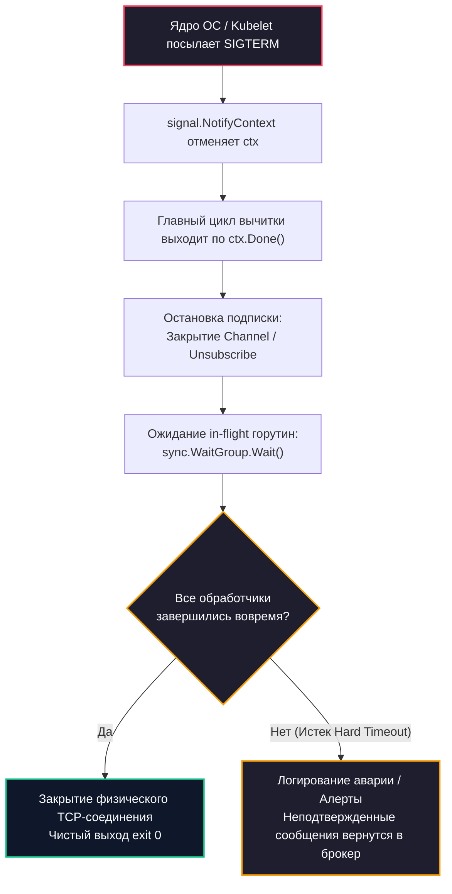
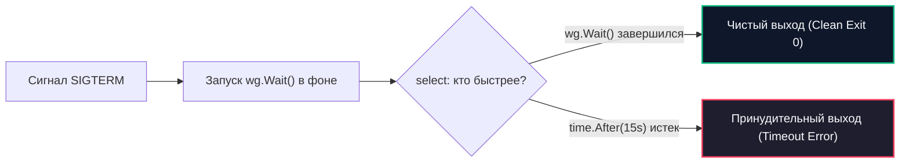

# Консьюмеры и graceful shutdown

> *«Любая программа умеет запускаться. Истинное мастерство инженера проверяется тем, как красиво его программа умеет умирать.»*

## Прерывая бесконечный цикл

В классических веб-приложениях старой школы (PHP-FPM, CGI, Python WSGI) жизненный цикл процесса был предельно прямолинеен: пришел HTTP-запрос, скрипт выделил память, отдал HTML и немедленно завершил работу. Если оператор перезапускал сервер, мастер-процесс просто принудительно гасил воркеры — операционная система забирала память, а открытые TCP-сокеты закрывались ядром.

В мире Go мы создаем принципиально иные сущности — **долгоживущие распределенные демоны (Long-Lived Daemons)**. 

Консьюмер (потребитель сообщений) в Go — это пул легковесных горутин, непрерывно крутящихся в бесконечном цикле `for`, вычитывающих бинарные полезные нагрузки из брокеров (RabbitMQ, Kafka, NATS) и мутирующих состояние распределенной базы данных.

Рано или поздно наступает неизбежный момент: деплой новой версии сервиса, вытеснение пода планировщиком Kubernetes или аварийная перезагрузка ноды из-за нехватки памяти (OOM). 

Если процесс завершить грубо (отправив сигнал `SIGKILL`), система окажется в неопределенном состоянии:
1. Сообщения, которые уже вычитаны из брокера в буфер User Space Go-приложения, но еще не успели обработаться, **испарятся безвозвратно**.
2. Сообщения, которые уже записали данные в PostgreSQL, но упали за миллисекунду до отправки подтверждения брокеру (`Ack`), вернутся в очередь и при перезапуске будут обработаны повторно, порождая дубликаты и нарушая гарантии доставки, подробно описанные в [[4. Модели доставки. At most once, at least once, exactly once]].

Единственный способ избежать катастрофы данных — спроектировать безупречный механизм **плавной остановки (Graceful Shutdown)**.

---

## Архитектура Graceful Shutdown в Go

Graceful Shutdown — это не наивный вызов `os.Exit(0)`. Это строго детерминированный протокол остановки распределенного узла, гарантирующий, что ни один байт данных не зависнет в неопределенности.

Канонический алгоритм плавной остановки состоит из трех последовательных фаз:
1. **Перехват сигналов операционной системы** (POSIX-сигналы `SIGINT`, `SIGTERM`).
2. **Остановка приема новых сообщений (Drain Phase):** Сервис закрывает подписки и объявляет брокеру: *«Больше не отдавай мне входящие задачи»*.
3. **Ожидание завершения текущих задач (In-flight Processing):** Сервис терпеливо дожидается, пока все уже взятые в работу сообщения завершат бизнес-транзакции и отправят брокеру итоговые `Ack` / `Nack`.



---

## Под капотом: Сигналы, Контекст и Планировщик

Разберем, как механизм `signal.NotifyContext` взаимодействует с ядром Linux и рантаймом Go на уровне машинных инструкций.

Когда приложение вызывает:
```go
ctx, stop := signal.NotifyContext(parentCtx, syscall.SIGTERM, syscall.SIGINT)
```
рантайм Go выполняет системный вызов ядра **`sigaction`**. В таблице дескрипторов сигналов процесса ядро прописывает указатель на системную функцию обработки прерываний рантайма Go.

> [!info] Под капотом
> При отправке сигнала (например, командой `kubectl delete pod` или `kill <pid>`) ядро Linux совершает программное прерывание. Однако рантайм Go устроен так, что он **никогда не прерывает стек горутины посреди произвольной ассемблерной инструкции**.
> 
> Сигнал перехватывается внутренней системной горутиной рантайма `signal.recv`. Она просыпается, читает битовую маску поступившего сигнала и пишет уведомление во внутренний буферизованный канал.
> 
> Обработчик `signal.NotifyContext` получает это событие и закрывает канал `ctx.Done()`.  
> В рантайме Go операция закрытия канала (`close(ch)`) является **широковещательной (Broadcast)**. Это означает, что абсолютно все горутины, находящиеся в состоянии блокировки на селекторе `case <-ctx.Done():`, мгновенно переводятся планировщиком Go (модель G-M-P) в статус `_Grunnable` и одновременно получают сигнал на пробуждение.

---

### Почему Context, а не Channels?

В коде инженеров, переходящих на Go с других языков, часто можно встретить рукописные каналы остановки: `stopChan chan struct{}`. 

В современном Go использование **`context.Context` — это абсолютный и безальтернативный стандарт**:
1. **Иерархическая отмена:** Контекст каскадно передается вниз по всему стеку вызовов (в драйверы баз данных `database/sql`, в HTTP-клиенты, во внутренние очереди). При отмене корневого контекста все вложенные тайм-ауты и селекторы отменяются автоматически.
2. **Безопасность состояния:** Закрытие канала `close(stopChan)` может вызвать панику при повторном вызове (`panic: close of closed channel`). Контекст же идемпотентен: метод `ctx.Err()` всегда возвращает детерминированную ошибку `context.Canceled`, независимо от того, сколько раз к нему обращаются параллельные горутины.

---

## Паттерн WaitGroup: Считаем в полете

Самая опасная и трудноуловимая ошибка при создании конкурентного консьюмера — некорректное использование примитива синхронизации `sync.WaitGroup`.

Рассмотрим хрестоматийный пример кода с состоянием гонки (Data Race):

```go
func (c *Consumer) BrokenStart(ctx context.Context) error {
	ctx, cancel := signal.NotifyContext(ctx, syscall.SIGTERM, syscall.SIGINT)
	defer cancel()

	var wg sync.WaitGroup

	for {
		select {
		case <-ctx.Done():
			c.logger.Info("Остановка: ожидаем завершения горутин...")
			wg.Wait() // Ожидание счетчика
			return nil
		case msg, ok := <-c.messagesCh:
			if !ok {
				return nil
			}

			// КАТАСТРОФИЧЕСКАЯ ОШИБКА: wg.Add(1) внутри горутины!
			go func() {
				wg.Add(1)
				defer wg.Done()
				c.processMessage(ctx, msg)
			}()
		}
	}
}
```

> [!warning] Ловушка / Gotcha: Состояние гонки в `wg.Add(1)`
> Если вызов `wg.Add(1)` поместить внутрь тела создаваемой горутины `go func()`, возникает состояние гонки. 
> 
> После того как сообщение вычитано из канала `msg`, планировщик операционной системы может переключить контекст CPU обратно на главный цикл. Если в этот микросекундный интервал прилетает сигнал остановки, главный цикл пойдет в ветку `<-ctx.Done()` и выполнит `wg.Wait()`. 
> 
> Так как новая горутина еще не успела запуститься и инкрементировать счетчик, `wg.Wait()` увидит нулевое значение счетчика и **мгновенно завершит процесс**! Приложение умрет, а сообщение, которое уже было извлечено из брокера, будет грубо оборвано на полуслове.
> 
> **Железный закон Go:** Инкремент `wg.Add(1)` обязан выполняться **строго синхронно ДО ключевого слова `go func()`** в родительской горутине, а декремент `wg.Done()` — строго через `defer` на первой строчке внутри дочерней горутины!

```go
// ПРАВИЛЬНЫЙ ШАБЛОН:
wg.Add(1) // Инкремент в родительском потоке ДО запуска
go func() {
	defer wg.Done() // Гарантированный декремент при любом исходе
	c.processMessage(ctx, msg)
}()
```

---

## Hard Timeout: Защита от зависаний

Даже если вы безупречно расставили `sync.WaitGroup`, ваша система остается уязвимой перед внешними зависимостями.

Представьте ситуацию: функция `processMessage` совершает HTTP-вызов к сторонней платежной системе или выполняет SQL-запрос в PostgreSQL. Но прямо во время деплоя сетевой шлюз зависает, сокет не отдает данные, а TCP Keepalive не настроен. Горутина зависает намертво.

Что произойдет, если вызвать бесконечный `wg.Wait()`? Сервис зависнет в фазе выключения. 

В оркестраторе Kubernetes на выключение пода по умолчанию выделяется ровно 30 секунд:
```yaml
terminationGracePeriodSeconds: 30
```
Если по истечении этого времени контейнер не завершил работу самостоятельно, Kubelet безжалостно присылает сигнал **`SIGKILL`**. Процесс будет уничтожен операционной системой в случайной точке памяти, сокеты разорвутся, а временные таблицы не очистятся.

Поэтому зрелый production-консьюмер обязан реализовывать **двухуровневую защиту с жестким таймаутом (Hard Timeout)**:



Если горутины не укладываются в отведенный коридор безопасности (например, 15 секунд при 30 секундах в K8s), консьюмер принудительно обрывает работу, логирует критический инцидент и освобождает ресурсы.

> [!tip] Собеседование
> **Вопрос:** Что произойдет с сообщением в RabbitMQ или Kafka, если горутина успешно обновила запись в БД, но в момент отправки `msg.Ack()` процесс был принудительно убит по таймауту?
> 
> **Ответ:**
> Брокер не получит `Ack`. В RabbitMQ при разрыве TCP-сокета брокер переведет сообщение обратно в очередь (Requeue). В Kafka смещение (offset) не будет зафиксировано в системном топике `__consumer_offsets`.
> 
> При следующем старте сервиса сообщение **будет вычитано повторно**. Именно поэтому консьюмеры обязаны строиться по принципу идемпотентности, о котором мы детально поговорим в статье [[4. Idempotent handlers]]. `Ack` должен отправляться строго после фиксации транзакции в БД, а бизнес-логика должна быть устойчива к повторным прогонам.

---

## Production-ready скелет Консьюмера

Соберем все инженерные принципы в законченную архитектурную конструкцию:

```go
package consumer

import (
	"context"
	"errors"
	"fmt"
	"log/slog"
	"os/signal"
	"sync"
	"syscall"
	"time"
)

type Message struct {
	ID   string
	Body []byte
	Ack  func() error
	Nack func() error
}

type BrokerClient interface {
	Consume(ctx context.Context) (<-chan Message, error)
	Close() error
}

type Handler func(ctx context.Context, msg Message) error

type Consumer struct {
	broker      BrokerClient
	handler     Handler
	logger      *slog.Logger
	stopTimeout time.Duration
}

func New(broker BrokerClient, handler Handler, logger *slog.Logger) *Consumer {
	return &Consumer{
		broker:      broker,
		handler:     handler,
		logger:      logger,
		stopTimeout: 15 * time.Second, // Запас времени до Kubernetes SIGKILL
	}
}

func (c *Consumer) Run(parentCtx context.Context) error {
	// 1. Привязываем контекст приложения к сигналам ядра ОС
	ctx, stop := signal.NotifyContext(parentCtx, syscall.SIGINT, syscall.SIGTERM)
	defer stop()

	messagesCh, err := c.broker.Consume(ctx)
	if err != nil {
		return fmt.Errorf("subscribe failed: %w", err)
	}

	var wg sync.WaitGroup

	c.logger.Info("Консьюмер успешно запущен, ожидание сообщений...")

	// 2. Главный цикл диспетчеризации
	for {
		select {
		case <-ctx.Done():
			c.logger.Warn("Получен сигнал завершения. Переход в режим Drain...")
			return c.gracefulShutdown(&wg)

		case msg, ok := <-messagesCh:
			if !ok {
				c.logger.Error("Канал брокера закрыт со стороны сервера")
				return c.gracefulShutdown(&wg)
			}

			// 3. Синхронный инкремент ДО старта горутины
			wg.Add(1)
			go func(m Message) {
				defer wg.Done()

				// Изолированный контекст с локальным дедлайном на обработку
				// Не используем ctx сигнала, иначе при SIGTERM обработка мгновенно оборвется
				msgCtx, cancel := context.WithTimeout(context.Background(), 10*time.Second)
				defer cancel()

				c.handleSingleMessage(msgCtx, m)
			}(msg)
		}
	}
}

func (c *Consumer) handleSingleMessage(ctx context.Context, msg Message) {
	if err := c.handler(ctx, msg); err != nil {
		c.logger.Error("Ошибка бизнес-логики обработки сообщения", "id", msg.ID, "err", err)
		if nackErr := msg.Nack(); nackErr != nil {
			c.logger.Error("Ошибка отправки Nack брокеру", "id", msg.ID, "err", nackErr)
		}
		return
	}

	if ackErr := msg.Ack(); ackErr != nil {
		c.logger.Error("Ошибка отправки Ack брокеру", "id", msg.ID, "err", ackErr)
	}
}

func (c *Consumer) gracefulShutdown(wg *sync.WaitGroup) error {
	// Создаем канал-сигнализатор завершения всех in-flight горутин
	done := make(chan struct{})
	go func() {
		wg.Wait()
		close(done)
	}()

	// Ожидание с жестким дедлайном (Hard Timeout)
	select {
	case <-done:
		c.logger.Info("Все in-flight сообщения успешно завершены")
	case <-time.After(c.stopTimeout):
		c.logger.Error("ТАЙМАУТ: часть горутин не успела завершиться до дедлайна!", 
			"timeout", c.stopTimeout)
	}

	// Закрываем физическое сетевое соединение с кластером брокера
	c.logger.Info("Закрытие сетевых сокетов брокера...")
	if err := c.broker.Close(); err != nil {
		c.logger.Error("Ошибка при закрытии клиента брокера", "err", err)
		return err
	}

	c.logger.Info("Graceful Shutdown успешно завершен")
	return nil
}
```

---

### Анализ кода и механика памяти

1. **Изоляция контекста в `handleSingleMessage`:**  
   Обратите внимание: мы вызываем `context.WithTimeout(context.Background(), 10*time.Second)`, а не оборачиваем родительский `ctx`.  
   Почему? Если передать отмененный родительский `ctx` в драйвер базы данных или HTTP-клиент, они моментально оборвут активные сетевые вызовы с ошибкой `context canceled`. В результате полезная работа, которая могла успешно завершиться за 200 миллисекунд в фазе graceful shutdown, будет насильственно прервана. Воркер должен иметь шанс спокойно довести транзакцию до коммита в рамках отведенного запаса времени.
2. **Передача `msg` по значению в замыкание:**  
   В цикле `for` мы явно передаем `msg` как аргумент `go func(m Message)`: это защищает от классической ошибки разделения переменной цикла (хотя в Go 1.22+ семантика переменных цикла изменена на per-iteration, явная передача параметров остается лучшей практикой для чистоты интерфейса).
3. **Отказ от `auto-commit`:**  
   В надежных системах автоматическая фиксация смещений (`auto-commit: true` в Kafka) категорически запрещена. Коммит должен происходить строго вручную через `msg.Ack()` только после того, как сайд-эффекты сохранены в локальную базу данных.

---

## Итог

1. **Graceful Shutdown** — обязательный компонент любого распределенного консьюмера, предотвращающий потерю сообщений и повреждение данных.
2. **`signal.NotifyContext`** связывает прерывания POSIX-ядра операционной системы (`sigaction`) с планировщиком горутин Go через широковещательное закрытие канала `ctx.Done()`.
3. Примитив **`sync.WaitGroup`** требует строжайшего соблюдения порядка: `wg.Add(1)` вызывается синхронно в главном цикле *до* вызова `go func()`, а `wg.Done()` — через `defer` внутри воркера.
4. Консьюмер обязан иметь **двухуровневую защиту (Hard Timeout)**, чтобы зависшие внешние соединения не привели к внезапному убийству процесса по `SIGKILL` от оркестратора Kubernetes.
5. `Ack` брокеру должен отправляться синхронно после завершения локальной транзакции в БД, а бизнес-логика должна проектироваться с расчетом на повторные доставки.

Мы научились корректно останавливать консьюмер. Но как разогнать его производительность, когда одного потока вычитки недостаточно, а порядок сообщений критически важен? В следующей статье мы разберем паттерны параллельной обработки: [[3. Параллелизм обработки сообщений]].