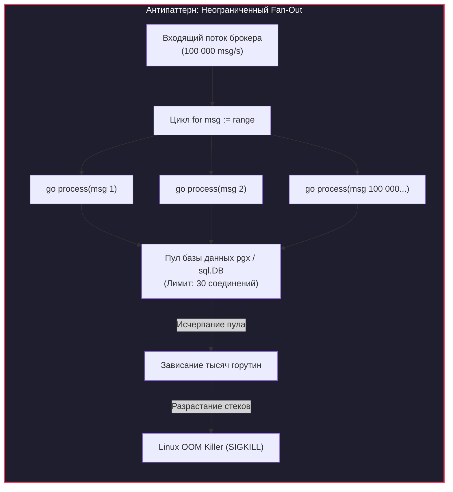
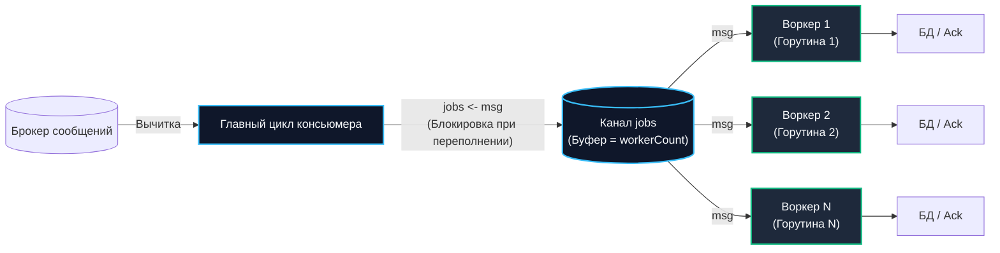
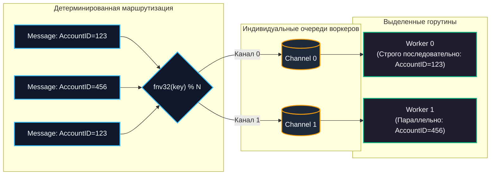

# Параллелизм обработки сообщений

> *«Сделать программу быстрой очень просто: достаточно перестать делать то, что делать не нужно, а то, что делать необходимо, разложить по свободным ядрам процессора — не забывая о законе сохранения порядка.»*

## Узкое горлышко синхронного консьюмера

В предыдущей статье [[2. Консьюмеры и graceful shutdown]] мы спроектировали надежный консьюмер, способный корректно выдерживать любые сигналы выключения от операционной системы. Однако в его базовой архитектуре кроется фундаментальное ограничение: **последовательная (синхронная) обработка**.

Представьте типичную производственную ситуацию: брокер (например, кластер Apache Kafka) отдает сообщения со скоростью 10 000 сообщений в секунду. При этом бизнес-обработка одного события (сохранение заказа в PostgreSQL, расчет налогов, поход по HTTP в стороннюю CRM) занимает честные 50 миллисекунд.

Математика безжалостна:
$$\text{Throughput} = \frac{1}{0.050\text{ с}} = 20\text{ msg/s}$$

Один синхронный поток вычитки способен переварить всего 20 сообщений в секунду! Остальные 9 980 сообщений каждую секунду будут накапливаться в партициях брокера, порождая лавинообразно растущее отставание — [[9. Мониторинг lag и throughput|Lag]].

В экосистемах PHP или Python эту проблему решают «в лоб» — запуском сотен независимых процессов операционной системы через Supervisor или масштабированием подов Kubernetes. В языке Go, обладающем уникальным рантаймом с кооперативными горутинами, у инженеров есть гораздо более элегантные и дешевые инструменты конкурентности. Однако именно здесь кроются самые опасные архитектурные грабли.

---

## Fan-Out: Почему не стоит запускать горутину на каждое сообщение?

Первое искушение начинающего Go-разработчика формулируется просто: *«Горутины весят всего 2 килобайта! Зачем что-то придумывать? Будем писать `go process(msg)` на каждое пришедшее сообщение!»*.

В продакшене этот наивный подход (unbounded `go process()`) гарантированно приводит к отказу сервиса:



> [!warning] Ловушка / Gotcha: Разрушение Backpressure
> Неограниченный Fan-Out полностью уничтожает базовый закон надежности распределенных систем — **противодавление ([[6. Backpressure и контроль нагрузки|Backpressure]])**, о котором мы говорили в [[6. Backpressure и контроль нагрузки]]:
> 
> 1. **Исчерпание оперативной памяти (OOM):** Начальный стек горутины в Go составляет от 2 до 8 КБ. Но при вызове глубоких функций или обработке тяжелого JSON стек динамически растет в куче. Миллион одновременно порожденных горутин легко утилизирует 5–10 ГБ оперативной памяти, вызывая немедленный `SIGKILL` от ядра Linux.
> 2. **Коллапс пулов соединений (Connection Exhaustion):** Пул соединений к базе данных (`sql.DB` или `pgx`) жестко ограничен инфраструктурой (обычно 20–50 коннектов). Сотни тысяч горутин бросятся забирать свободный коннект, встанут в бесконечную очередь, исчерпают таймауты и положат базу данных лавиной полуоткрытых транзакций.
> 3. **Трэшинг планировщика (Scheduler Thrashing):** Планировщик рантайма Go (G-M-P) начнет тратить все доступные такты процессора на переключение контекста между миллионом ожидающих горутин вместо выполнения полезных бизнес-инструкций.

---

## Worker Pool: Идиоматичный подход

Канонический и безопасный способ параллелизации обработки в Go — паттерн **Worker Pool (Пул воркеров фиксированного размера)**.

Мы инициализируем строго контролируемое количество горутин-обработчиков на этапе старта приложения и распределяем между ними входящие сообщения через буферизованный канал.



Этот паттерн обеспечивает **естественное аппаратное противодавление**: если все $N$ воркеров заняты тяжелыми вычислениями, буфер канала заполняется. Операция `jobs <- msg` в главном цикле блокируется, консьюмер перестает вычитывать новые сообщения из сетевого сокета брокера, брокер притормаживает отправку по TCP, и система работает на пределе своей реальной пропускной способности, не перегружая память.

---

### Реализация Worker Pool

```go
package workerpool

import (
	"context"
	"log/slog"
	"os/signal"
	"sync"
	"syscall"
	"time"
)

type Message interface {
	Ack() error
	Nack(requeue bool) error
}

type Consumer struct {
	brokerMessages <-chan Message
	handler        func(ctx context.Context, msg Message) error
	logger         *slog.Logger
}

func (c *Consumer) Run(ctx context.Context, workerCount int) error {
	ctx, cancel := signal.NotifyContext(ctx, syscall.SIGINT, syscall.SIGTERM)
	defer cancel()

	// Канал с буфером сглаживает микро-задержки между вычиткой и обработкой
	jobs := make(chan Message, workerCount)
	var wg sync.WaitGroup

	// 1. Старт фиксированного пула воркеров
	for i := 0; i < workerCount; i++ {
		wg.Add(1)
		go func(workerID int) {
			defer wg.Done()
			c.worker(ctx, workerID, jobs)
		}(i)
	}

	c.logger.Info("Worker Pool успешно запущен", "workers", workerCount)

	// 2. Главный цикл вычитки (Диспетчер)
	for {
		select {
		case <-ctx.Done():
			c.logger.Warn("Остановка: закрываем канал jobs и ожидаем завершения воркеров...")
			close(jobs) // Закрытие канала сигнализирует воркерам о выходе из range
			wg.Wait()   // Ожидание завершения всех активных задач
			return nil

		case msg, ok := <-c.brokerMessages:
			if !ok {
				close(jobs)
				wg.Wait()
				return nil
			}

			// 3. Отправка в пул. Если воркеры заняты — здесь консьюмер заблокируется!
			select {
			case jobs <- msg:
			case <-ctx.Done():
				// Если контекст отменился во время ожидания свободного воркера,
				// возвращаем сообщение в брокер, чтобы не потерять его
				_ = msg.Nack(true)
			}
		}
	}
}

func (c *Consumer) worker(ctx context.Context, id int, jobs <-chan Message) {
	// Цикл range автоматически завершится, когда канал jobs будет закрыт
	for msg := range jobs {
		msgCtx, cancel := context.WithTimeout(ctx, 5*time.Second)

		if err := c.handler(msgCtx, msg); err != nil {
			c.logger.Error("Ошибка обработки воркером", "worker_id", id, "err", err)
			_ = msg.Nack(false) // Ошибка: отправляем в DLQ или логируем
		} else {
			_ = msg.Ack()
		}

		cancel() // Освобождаем ресурсы таймера контекста
	}
}
```

---

## Under the Hood: Планировщик G-M-P и Кэши CPU

Как грамотно рассчитать параметр `workerCount`? Это фундаментальный вопрос **Mechanical Sympathy** (сочувствия к физическому процессору).

Поведение консьюмера жестко зависит от типа исполняемой нагрузки:

### 1. CPU-bound нагрузка (Математика, JSON, Сжатие, Хэширование)
Если задача воркера — распарсить сложный JSON, распаковать GZIP или проверить криптографическую подпись, работа упирается исключительно в арифметико-логические устройства (ALU) процессора.

В этом случае количество воркеров должно быть **строго равно `runtime.GOMAXPROCS(0)`** (количеству физических или выделенных контейнеру логических ядер CPU).

> [!info] Под капотом: Cache Thrashing
> Если на 8-ядерной виртуальной машине запустить 100 CPU-bound воркеров, планировщик Go будет непрерывно переключать контексты горутин между системными тредами ОС (M) по истечении кванта времени в 10 миллисекунд (`runtime`).
> 
> Каждое переключение контекста влечет катастрофический побочный эффект — **Cache Thrashing (Выбивание процессорного кэша)**:
> - Данные текущей горутины находятся в сверхбыстром кэше L1/L2 (время доступа ~1 наносекунда).
> - Планировщик вытесняет горутину, загружая контекст другой задачи. Новая горутина затирает кэш своими структурами.
> - Когда старая горутина возвращается на CPU, ее данных в кэше больше нет: процессор вынужден простаивать сотни тактов, ожидая подгрузки байтов из медленной оперативной памяти (RAM, задержка ~60–100 нс).
> 
> *Больше горутин для CPU-работы = лавинообразный рост промахов кэша (Cache Misses) = катастрофическое падение реальной производительности.*

### 2. IO-bound нагрузка (Сеть, Базы данных, Внешние API)
Если воркер большую часть времени ожидает ответа от диска PostgreSQL или внешнего HTTP-сервера, горутина паркуется в `runtime.netpoller` с нулевым потреблением процессорного времени. В этом сценарии количество воркеров можно безопасно увеличивать до 50, 200 или 500 (главное — чтобы не захлебнулся пул соединений с базой данных).

---

## Проблема порядка (Ordering)

При распараллеливании вычислений мы немедленно сталкиваемся с фундаментальной дилеммой: **что происходит с [[5. Ordering сообщений и его цена|порядком сообщений]]?**

Если брокер передал сообщения `A`, `B` и `C`, относящиеся к одному банковскому счету, в строгой последовательности:
1. `A`: Пополнение счета на 10 000 руб.
2. `B`: Покупка товара на 8 000 руб.
3. `C`: Снятие остатка 2 000 руб.

Если раскидать сообщения `A, B, C` по параллельным воркерам классического Worker Pool:
- Воркер 2 обработает сообщение `B` за 5 мс.
- Воркер 1 зависнет на сетевом запросе по `A` на 100 мс.

**Итог:** Сообщение `B` попытается списаться со счета раньше, чем придет пополнение `A`! Транзакция упадет с ошибкой «Недостаточно средств», а бизнес-логика окажется сломанной.

Поведение очередей различается:
- **В RabbitMQ:** Если консьюмер использует `Prefetch > 1`, параллельные воркеры неизбежно нарушат порядок фиксации. Если обработка `A` завершится ошибкой и уйдет в `Nack(requeue=true)`, брокер вернет его в очередь, но уже *позади* других сообщений.
- **В Kafka:** Порядок сообщений гарантируется **только внутри одной конкретной партиции**. Если консьюмер вычитывает партицию батчем и раскидывает ее элементы по воркерам пула — гарантия порядка внутри партиции полностью разрушается.

---

### Как сохранить порядок: Key-based Hash Worker Pool

Если порядок критичен для связанных бизнес-сущностей (пользователь, заказ, счет), классический Worker Pool неприменим. Инженерное решение — **Пул воркеров с хэш-маршрутизацией по ключу (Key-based / Hash Worker Pool)**.

Мы извлекаем ключ партицирования из сообщения (например, `UserID` или `AccountID`) и отправляем сообщение строго в тот выделенный канал, за которым закреплен конкретный воркер:
$$\text{workerID} = \text{hash}(\text{key}) \pmod{\text{workerCount}}$$



```go
package keypool

import (
	"context"
	"hash/fnv"
)

type KeyedMessage interface {
	Key() []byte
	Body() []byte
}

func fnv32(key []byte) uint32 {
	h := fnv.New32a()
	_, _ = h.Write(key)
	return h.Sum32()
}

func (c *Consumer) RunKeyedPool(ctx context.Context, workerCount int) error {
	// Создаем персональный канал для каждого воркера
	workerChannels := make([]chan KeyedMessage, workerCount)
	for i := 0; i < workerCount; i++ {
		workerChannels[i] = make(chan KeyedMessage, 100)
		go c.keyedWorker(ctx, i, workerChannels[i])
	}

	for {
		select {
		case <-ctx.Done():
			for _, ch := range workerChannels {
				close(ch)
			}
			return nil

		case msg, ok := <-c.brokerMessages:
			if !ok {
				return nil
			}

			// Детерминированная привязка сообщения к воркеру
			key := msg.Key()
			workerID := fnv32(key) % uint32(workerCount)

			select {
			case workerChannels[workerID] <- msg:
			case <-ctx.Done():
				return nil
			}
		}
	}
}

func (c *Consumer) keyedWorker(ctx context.Context, id int, jobs <-chan KeyedMessage) {
	for msg := range jobs {
		// Все сообщения по AccountID=123 обрабатываются строго последовательно,
		// гарантируя корректность баланса и отсутствие race conditions!
		c.process(ctx, msg)
	}
}
```

Этот подход воспроизводит архитектурный гений партицирования Apache Kafka прямо в оперативной памяти нашего сервиса: сообщения с одинаковыми ключами (`AccountID=123`) выстраиваются в строгую очередь в рамках одной горутины, а сообщения с разными ключами (`AccountID=456`) обрабатываются полностью параллельно на соседних ядрах CPU.

> [!tip] Собеседование
> **Вопрос:** Как распараллелить долгую обработку сообщений из одной партиции Kafka, если нам необходимо сохранить строгий хронологический порядок для каждого отдельного пользователя?
> 
> **Ответ:** 
> Классический Worker Pool здесь применять нельзя, так как он разрушит порядок внутри партиции. 
> 
> **Правильное решение:** 
> Применить внутри сервиса **Key-based Hash Worker Pool**. Мы вычитываем батч сообщений из партиции Kafka и с помощью хэширования ключа `hash(key) % numWorkers` раскидываем их по внутренним изолированным Go-каналам. Внутри каждого канала сохраняется строгий порядок для конкретного `UserID`, а пользователи с разными ID обрабатываются параллельно на всех доступных ядрах.
> 
> Дополнительно для сверхвысоких нагрузок применяется [[5. Batch processing сообщений]], при котором события одного пользователя группируются в батч и применяются к БД единой SQL-транзакцией.

---

## Data Races в обработчиках

Параллельная обработка требует абсолютной изоляции памяти. Если воркеры обращаются к общим изменяемым структурам данных (in-memory кэш, счетчики метрик, сессионные мапы) без синхронизации, программа неизбежно упадет.

> [!warning] Ловушка / Gotcha: Конкурентная мапа
> Попытка чтения и записи в стандартную встроенную `map` из параллельных горутин-воркеров без блокировок приведет к аварийной панике:
> ```
> fatal error: concurrent map read and map write
> ```
> Эту ошибку невозможно перехватить через `recover()` — рантайм Go немедленно аварийно завершает весь процесс.
> 
> **Правила защиты памяти:**
> 1. Для общего кэша с частым чтением и редкой записью используйте **`sync.Map`**.
> 2. Для стандартных изменяемых структур используйте **`sync.RWMutex`**.
> 3. Идеальный архитектурный паттерн: **Shared Nothing (Ничего общего)**. Воркеры должны быть абсолютно stateless и не делить память процесса между собой.

---

## Итог

1. **Неограниченный Fan-Out (`go process()`) — архитектурный яд**, приводящий к OOM-падениям, исчерпанию пулов баз данных и выбиванию процессора из колеи.
2. **Worker Pool на каналах** — канонический способ управления параллелизмом, гарантирующий жесткий контроль нагрузки и естественный механизм противодавления (**[[6. Backpressure и контроль нагрузки|Backpressure]]**).
3. Размер пула рассчитывается исходя из природы нагрузки: строго `GOMAXPROCS` для CPU-bound задач и сотни горутин для IO-bound операций.
4. Параллельная обработка разрушает очередность доставки. Если порядок транзакций критичен, используйте **Key-based Worker Pool** с детерминированным хэшированием по ключу бизнес-сущности.
5. Любая разделяемая память между воркерами обязана защищаться мьютексами или примитивами `sync.Map`.

Распараллелив обработку, мы увеличили пропускную способность системы в сотни раз. Однако в конкурентной среде повторные доставки при сетевых сбоях неизбежны. Как гарантировать, что повторное выполнение операции не спишет деньги дважды? Разберем это в следующей лекции: [[4. Idempotent handlers]].