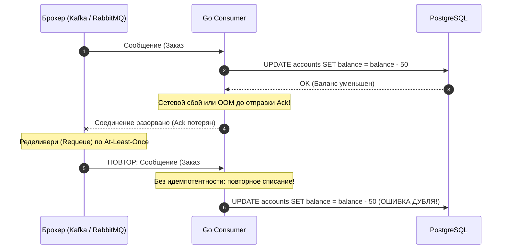
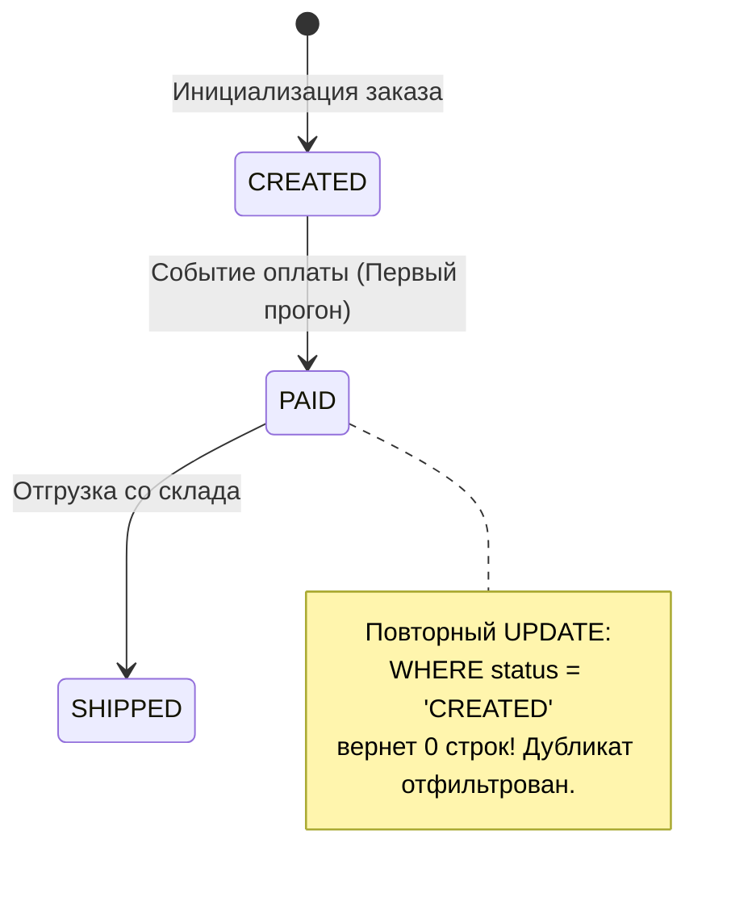

# Idempotent handlers

> *«В распределенных системах нет вопроса "случится ли дублирование?". Вопрос лишь в том, спишет ли ваш обработчик деньги у клиента дважды, когда дубликат неизбежно прилетит.»*

## Иллюзия Exactly-Once и неизбежность дубликатов

В фундаментальной лекции [[4. Модели доставки. At most once, at least once, exactly once]] мы сформулировали суровую правду компьютерных сетей: идеальная физическая доставка **`Exactly-Once`** (ровно один раз) в распределенной среде невозможна из-за проблемы двух генералов и неизбежности сетевых сбоев.

Практически все современные брокеры сообщений (Apache Kafka, RabbitMQ, NATS JetStream) работают с семантикой **`At-Least-Once`** (как минимум один раз). 

Это означает, что появление дубликатов в очереди — не редкий баг, а **штатное повседневное состояние системы**:
- Сервер-консьюмер успешно выполнил списание средств, но процесс был вытеснен Kubernetes прямо перед отправкой подтверждения `Ack` (как мы разбирали в [[2. Консьюмеры и graceful shutdown]]).
- Сетевой шлюз словил микропаузу, TCP-таймаут брокера истек, и брокер решил, что консьюмер погиб, отправив то же самое сообщение другому воркеру.
- Продюсер переотправил пачку из-за таймаута репликации в Kafka.

Если ваш обработчик (Handler) не обладает свойством **идемпотентности**, система мгновенно деградирует: с клиента спишутся лишние средства, на складе заблокируется двойной объем товара, а пользователю придет десяток одинаковых SMS-уведомлений.



> **Идемпотентность** — математическое свойство операции:
> $$f(f(x)) = f(x)$$
> В контексте асинхронного бэкенда это означает: *если обработчик получит сообщение с `message_id=123` десять раз подряд, финальное состояние системы изменится ровно так же, как если бы оно было получено строго один раз, а все последующие ответы будут идентичны первому.*

---

## Откуда берется ключ: Producer vs Broker

Чтобы отбросить повторное сообщение, консьюмер обязан однозначно опознать его. Откуда взять надежный уникальный идентификатор?

1. **Внутренние идентификаторы брокера:**  
   У брокеров всегда есть внутренние метки (например, `DeliveryTag` в RabbitMQ или связка `Topic-Partition-Offset` в Kafka). **Использовать их в качестве ключа идемпотентности категорически запрещено!** При пересылке сообщения в Dead Letter Exchange (DLQ), при повторной публикации продюсером или при переносе очередей эти технические идентификаторы меняются.
2. **Идентификатор продюсера (`Idempotency Key` — единственный верный подход):**  
   Продюсер обязан сгенерировать детерминированный или уникальный `Idempotency Key` на своей стороне в момент зарождения намерения (например, UUIDv7 или хэш бизнес-параметров `order_id + user_id`) и внедрить его в заголовки (Headers) либо в тело сообщения. Этот ключ сопровождает полезную нагрузку на протяжении всей ее жизни.

> [!info] Под капотом: Почему UUIDv7, а не UUIDv4?
> В реляционных базах данных (PostgreSQL, MySQL) ключи идемпотентности индексируются через B-Tree структуры. 
> 
> Традиционный `UUIDv4` генерируется абсолютно случайно. Вставка случайных значений в B-Tree индекс приводит к постоянным расщеплениям страниц (**Page Splits**), размытию данных по диску, выбиванию горячего кэша CPU (L1/L2 Cache Misses) и деградации производительности дискового I/O.
> 
> **`UUIDv7`** содержит в старших 48 битах монотонно возрастающую временную метку (Unix Timestamp в миллисекундах). Новые ключи всегда вставляются в самый правый, горячий край B-Tree дерева, обеспечивая идеальную локальность данных (**Data Locality**) и исключая фрагментацию страниц памяти.

---

## Паттерны идемпотентности в Go

В промышленной разработке применяются три фундаментальных инженерных паттерна обеспечения идемпотентности.

---

### 1. Optimistic Locking через БД (Естественная идемпотентность)

Наиболее надежный и транзакционно строгий метод — делегировать проверку уникальности персистентному движку базы данных с помощью ограничения уникальности (**`UNIQUE CONSTRAINT`**).

```sql
-- Таблица транзакций в PostgreSQL
CREATE TABLE transactions (
    id UUID PRIMARY KEY DEFAULT gen_random_uuid(),
    idempotency_key VARCHAR(255) NOT NULL,
    user_id BIGINT NOT NULL,
    amount DECIMAL(19, 4) NOT NULL,
    created_at TIMESTAMPTZ NOT NULL DEFAULT NOW(),
    CONSTRAINT uq_transactions_idempotency_key UNIQUE (idempotency_key)
);
```

В Go-коде мы выполняем операцию `INSERT`. Если сообщение дублируется, PostgreSQL откатит вставку и вернет ошибку нарушения ограничения уникальности (код `23505` в драйвере `pgx` — `pgerrcode.UniqueViolation`).

```go
package handler

import (
	"context"
	"encoding/json"
	"errors"
	"fmt"
	"log/slog"

	"github.com/jackc/pgerrcode"
	"github.com/jackc/pgx/v5/pgconn"
	"github.com/jackc/pgx/v5/pgxpool"
)

type TopUpEvent struct {
	IdempotencyKey string  `json:"idempotency_key"`
	UserID         int64   `json:"user_id"`
	Amount         float64 `json:"amount"`
}

type PaymentHandler struct {
	db     *pgxpool.Pool
	logger *slog.Logger
}

func (h *PaymentHandler) HandleTopUp(ctx context.Context, body []byte) error {
	var event TopUpEvent
	if err := json.Unmarshal(body, &event); err != nil {
		return fmt.Errorf("unmarshal event: %w", err)
	}

	_, err := h.db.Exec(ctx, `
		INSERT INTO transactions (idempotency_key, user_id, amount)
		VALUES ($1, $2, $3)
	`, event.IdempotencyKey, event.UserID, event.Amount)

	if err != nil {
		var pgErr *pgconn.PgError
		// Проверяем, является ли ошибка нарушением уникального ключа (код 23505)
		if errors.As(err, &pgErr) && pgErr.Code == pgerrcode.UniqueViolation {
			// ДУБЛИКАТ: Транзакция уже была успешно применена ранее!
			// КРИТИЧЕСКИ ВАЖНО: возвращаем nil, чтобы консьюмер отправил брокеру Ack
			h.logger.Warn("Обнаружен дубликат сообщения, пропускаем", 
				"idempotency_key", event.IdempotencyKey)
			return nil
		}

		// Реальная ошибка базы данных (разрыв сети, таймаут диска)
		return fmt.Errorf("db insert failed: %w", err)
	}

	// Успешная первая обработка
	h.logger.Info("Транзакция успешно зафиксирована", "idempotency_key", event.IdempotencyKey)
	return nil
}
```

> [!warning] Ловушка / Gotcha: Ошибка вместо nil
> Обратите внимание на возврат `nil` при перехвате `pgerrcode.UniqueViolation`.
> 
> Если вы в панике вернете ошибку наружу консьюмеру, он посчитает, что обработка провалилась, и выполнит `Nack(requeue=true)`. Брокер вернет сообщение в очередь, консьюмер снова попытается сделать `INSERT`, снова получит `UniqueViolation`, и сервис войдет в бесконечный цикл пожирания CPU (**Poison Message Loop**). 
> 
> Дубликат сообщения — это не ошибка программы, это успешно обработанное в прошлом событие. Его необходимо подтверждать брокеру (`Ack`).

---

### 2. Отдельное хранилище идемпотентности (Redis / Memcached)

Метод с `UNIQUE CONSTRAINT` безупречен, если целевым действием является запись в реляционную базу данных. Но что, если обработка сообщения — это внешний побочный эффект: вызов API платежного шлюза Stripe, генерация фискального чека или отправка SMS?

В этом случае мы не можем повесить `UNIQUE CONSTRAINT` на чужой HTTP-сервер. Нам необходимо атомарно захватить распределенную блокировку **до** вызова внешнего API.

Для этого используется распределенный кэш (Redis) с атомарной операцией:
```
SET key value NX EX 3600
```
- Флаг `NX` (Not Exists) гарантирует, что ключ запишется только в том случае, если его еще нет в памяти.
- Флаг `EX` (Expire) задает время жизни (TTL), защищая от вечной блокировки.

```go
package handler

import (
	"context"
	"fmt"
	"time"

	"github.com/redis/go-redis/v9"
)

type SMSHandler struct {
	redisClient *redis.Client
	smsGateway  SMSGatewayClient
}

func (h *SMSHandler) HandleSendSMS(ctx context.Context, idempKey string, phone, text string) error {
	redisKey := "idemp:" + idempKey

	// 1. Атомарная попытка захвата ключа
	set, err := h.redisClient.SetNX(ctx, redisKey, "processing", 1*time.Hour).Result()
	if err != nil {
		return fmt.Errorf("redis setnx error: %w", err) // Сетевой сбой Redis -> Nack
	}
	if !set {
		// Ключ уже существует: операция либо выполняется параллельно, либо уже завершена
		return nil // Пропускаем дубликат
	}

	// 2. Вызов внешнего стороннего API
	err = h.smsGateway.Send(ctx, phone, text)
	if err != nil {
		// ВНИМАНИЕ: Если внешний вызов упал, мы ОБЯЗАНЫ удалить ключ из Redis!
		// Иначе при повторной доставке система сочтет сообщение дубликатом,
		// и пользователь никогда не получит важное SMS.
		_ = h.redisClient.Del(ctx, redisKey).Err()
		return fmt.Errorf("sms gateway failed: %w", err)
	}

	// 3. Помечаем как успешно завершенное
	_ = h.redisClient.Set(ctx, redisKey, "done", 24*time.Hour).Err()
	return nil
}
```

> [!warning] Ловушка / Gotcha: Серая зона Redis
> Паттерн с Redis содержит опасную гонку состояний (Race Condition). Что произойдет, если воркер успешно отправил SMS, но упал по OOM ровно за миллисекунду до того, как отправил `Ack` брокеру?
> 
> Брокер переотправит сообщение. Новый воркер обратится в Redis, увидит ключ в статусе `done` и решит, что сообщение обработано, проигнорировав его. В данном сценарии это приемлемо (SMS отправлено, дубля нет). 
> 
> Но если воркер упал посреди длинного внешнего вызова, ключ зависнет в статусе `processing` до истечения TTL.
> По сути, мы деградировали гарантию доставки до хрупкого `At-Most-Once`. 
> Если вам нужна строгая идемпотентность с внешними сайд-эффектами, Redis не подходит. Нужен паттерн [[6. Outbox pattern]] или [[7. Inbox pattern]].

---

### 3. Конечные автоматы (State Machines)

Если бизнес-сущность уже сохранена в базе данных и имеет жизненный цикл (например, сущность `Order` со статусами `Created` $\to$ `Paid` $\to$ `Shipped`), мы можем превратить сам запрос `UPDATE` в естественный атомарный фильтр дубликатов:

```sql
UPDATE orders 
SET status = 'PAID', paid_at = NOW() 
WHERE id = $1 AND status = 'CREATED';
```



В Go мы анализируем количество модифицированных строк с помощью метода `RowsAffected()`:

```go
func (h *OrderHandler) HandleOrderPaid(ctx context.Context, orderID string) error {
	tag, err := h.db.Exec(ctx, `
		UPDATE orders 
		SET status = 'PAID', paid_at = NOW() 
		WHERE id = $1 AND status = 'CREATED'
	`, orderID)
	if err != nil {
		return fmt.Errorf("update order error: %w", err)
	}

	if tag.RowsAffected() == 0 {
		// Ни одной строки не изменено: заказ либо не существует,
		// либо УЖЕ находится в статусе PAID или SHIPPED (дубликат!).
		h.logger.Warn("Повторный статус оплаты или невалидное состояние, пропускаем", 
			"order_id", orderID)
		return nil // Отправляем Ack брокеру
	}

	// Успешный первичный переход конечного автомата
	return nil
}
```

---

## Mechanical Sympathy: Цена идемпотентности

Закон сохранения сложности в распределенных системах напоминает: **за надежность и защиту от дублей приходится платить аппаратными ресурсами (I/O и задержками)**.

1. **Дисковые накладные расходы индексов:**  
   Каждое ограничение `UNIQUE CONSTRAINT` — это дополнительное дерево B-Tree на диске. На каждый `INSERT` СУБД обязана выполнить обход дерева и удерживать страницы индекса в буферном пуле памяти (Shared Buffers). Использование невыровненных ключей приводит к постоянным промахам кэша.
2. **Сетевые задержки Redis:**  
   Проверка `SetNX` в Redis добавляет сетевой round-trip (1–3 миллисекунды) на каждое сообщение. При потоке в 50 000 msg/s это создаст 50 000 дополнительных сетевых вызовов в секунду, утилизируя сетевой стек ядра и сокеты Linux.
3. **Отсутствие распределенных транзакций:**  
   Если вы обновляете баланс в PostgreSQL, а флаг идемпотентности проверяете в Redis, между ними всегда существует зазор для аварии.

Наиболее совершенное решение для высоконагруженных систем — **Inbox Pattern ([[7. Inbox pattern]])**, где таблица входящих ключей идемпотентности (`inbox`) находится в той же базе данных PostgreSQL, что и бизнес-данные, и обновляется строго в рамках единой локальной ACID-транзакции.

> [!tip] Собеседование
> **Вопрос:** Мы пишем HTTP-хэндлер приема вебхуков от платежного шлюза (Stripe/PayPal). Как спроектировать идемпотентный обработчик на Go, исключающий двойное зачисление баланса при повторных запросах шлюза?
> 
> **Ответ:**
> 1. Платежный шлюз всегда передает уникальный `event_id` в теле или заголовках вебхука.
> 2. В локальной СУБД создается таблица `processed_events (event_id VARCHAR PRIMARY KEY, processed_at TIMESTAMPTZ)`.
> 3. В единой транзакции базы данных:
>    ```sql
>    BEGIN;
>    INSERT INTO processed_events (event_id) VALUES ($1);
>    UPDATE accounts SET balance = balance + $amount WHERE user_id = $uid;
>    COMMIT;
>    ```
> 4. Если приходит повторный вебхук с тем же `event_id`, СУБД возвращает ошибку нарушения первичного ключа (`23505`). Хэндлер перехватывает ее, возвращает шлюзу статус `200 OK` (чтобы шлюз перестал спамить повторами), но баланс пользователя остается в неприкосновенности.

---

## Итог

1. **Дубликаты неизбежны:** Семантика `At-Least-Once` обязывает все консьюмеры быть строго идемпотентными.
2. **Ключ генерирует продюсер:** Внутренние метки брокеров (`DeliveryTag`, `Offset`) нестабильны. Используйте монотонно возрастающие бизнес-идентификаторы или `UUIDv7`.
3. **`UNIQUE CONSTRAINT` в СУБД** — золотой стандарт надежности. При перехвате `UniqueViolation` обязательно возвращайте `nil`, подтверждая сообщение брокеру.
4. **Внешние API защищаются через Redis (`SET NX`)**: но помните про обязательное удаление ключа в блоке обработки ошибок при авариях вызова.
5. **Конечные автоматы (State Machines)** позволяют реализовывать идемпотентность естественным образом через `UPDATE ... WHERE status = ...` и проверку `RowsAffected()`.

Идемпотентность защитила нас от дублей при повторных попытках ([[9. Retry стратегии и exponential backoff]]). Но что делать, если обработка единичных сообщений перегружает базу данных тысячами мелких транзакций в секунду? Как научить консьюмер обрабатывать данные пачками? Разберем в следующей лекции: [[5. Batch processing сообщений]].